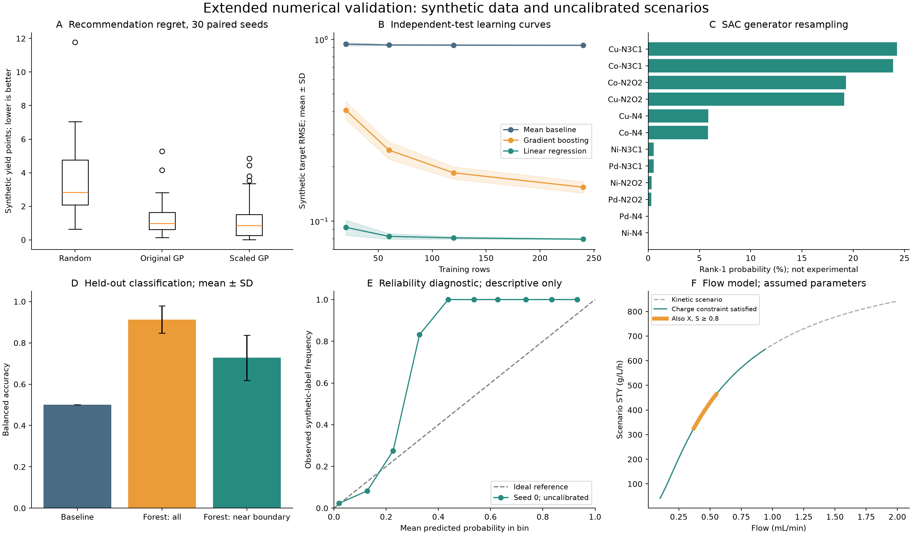

# AI4S Organic Electrosynthesis & Catalyst Informatics

完整技术报告、可复现计算与证据审计。Updated 2026-09-27.

## Latest three-module research engine / 新增三模块研究引擎

- **[最新中文报告](research/reports/research_grade_technical_report_chinese.md)**
- **[Latest English report](research/reports/research_grade_technical_report_english.md)**
- [Bilingual report / 双语合并版](research/reports/research_grade_technical_report_bilingual.md)
- [Execution, audit and reproduction / 执行、核验与复现](research/README.md)

原脚本已按原样完成；补充 231 组权重、多输出 GP 分组验证、64 个构象、16 个 xTB 作业及独立有限体积扩散核验。报告修正原始“超过 50 µm 即 η<0.40”的错误结论，并明确底物产率来自随机标签。没有湿实验、准确电位预测或生产成熟度的验证。

The latest five-section report preserves all three modules and their original outputs, with independent numerical checks and a proposed one-year measurement plan. Synthetic objective values and random yield labels remain distinct from actual molecular calculations and experiments.

## Earlier four-task pipeline / 前一版四任务流程

- **[新版中文报告](production/reports/production_technical_report_chinese.md)**
- **[New English report](production/reports/production_technical_report_english.md)**
- [Section-aligned bilingual report / 按章节对齐的双语版](production/reports/production_technical_report_bilingual.md)
- [Execution records, methods and reproduction / 执行记录与复现](production/README.md)

新附件的原脚本在 SASA 接口处失败；归档修订版已完成四任务。新增 30 种子 × 4 策略 BO 对照、32 个构象、SAC 分组留出、流动解析解与电流平衡核验、目标分子的 3 个 xTB 作业。物性嵌入优势和 C3 位点主张均未得到这些模型的支持。A/C 仍是合成目标，D 使用未校准参数；没有湿实验验证，也尚未达到生产可用性。

The new extension preserves the failed original and the explicit repair, includes negative results, and distinguishes synthetic scores, molecular calculations and proposed experiments. It follows the new four-section report specification. The earlier five-topic study below remains available with its original evidence boundaries.

## Earlier five-topic study / 原五课题报告

- **[中文完整报告](reports/technical_report_chinese.md)**
- **[Complete English report](reports/technical_report_english.md)**

两份报告均保留原规范第 3 节的三个主体部分：执行概要与实验室契合性、五课题各四部分分析、本科四阶段路线。附录 D、E 补充新计算。原始脚本与结果保持原字节，代码中的硬编码结论和合成数据标签在报告中明确审计。

Both editions preserve the requested report architecture. Original benchmark outputs remain unchanged. Appendices D and E add numerical robustness studies and real-molecule semiempirical calculations.

## What was actually computed / 实际计算范围

| Calculation | Scale | Main result and boundary |
|---|---|---|
| Paired Bayesian optimization | 30 seeds × 3 methods × 20 evaluations | Mean recommendation regret: random 3.5557, original GP 1.3570, scaled GP 1.3208 synthetic yield points; scaled vs original difference inconclusive |
| Regression generalization | 360 fits; 5,000 independent test rows | At n=60, test R²: boosting 0.9287, linear 0.9921; synthetic targets, not volts |
| SAC ranking sensitivity | 100,000 draws at each of 3 noise levels | Co–N₄ ranks first in 5.841% at original SD; generator sensitivity, not catalyst selection |
| Classification diagnosis | 30 training seeds; 5,000 held-out rows | Balanced accuracy 0.9129 overall, 0.7276 near boundaries; no real reaction labels |
| Sequential flow scenario | 191 grid points; 10,000 kinetic scenarios per flow | Best qualifying grid point 0.55 mL/min under assumptions; higher-flow rows can violate charge availability |
| Real molecular descriptors | 6 molecules; 36 GFN2-xTB jobs | 6 neutral optimizations, 30 single points; fixed-nuclei gas/ALPB comparison, charges, RDKit descriptors |

**证据边界：** 原五课题及扩展统计使用合成数据；流动参数属于未校准假设。新增六分子计算是实际执行的 GFN2-xTB 半经验计算，**不是 DFT、实测氧化电位、反应势垒、区域选择性验证或工业条件推荐**。没有湿实验记录。

**Evidence boundary:** Executed software and semiempirical calculations are distinguished from literature facts, hypotheses, and experiments. No experimental reaction, electrochemical calibration, DFT transition state, or industrial optimum is established.

## Files

```text
reports/                 Complete English and Chinese reports
reports/figures/         English/Chinese PNG and SVG figures
data/original/           Byte-preserved supplied script, original output, audit
scripts/                Additional computation, plotting, release validation
results/extended/       Per-run CSVs, test data, flow grid, summary JSON
results/molecular/      Molecular identities, XYZ, xTB logs/JSON, atomic charges
tests/                  Scientific invariants and independent source checks
provenance/             Environment, tests, publication checks, hashes
```

`data/original/benchmark_audit.json` describes the original run only. Its statements about missing repeated-seed tests do not describe the later extension. Current evidence is in `results/extended/summary.json` and `results/molecular/summary.json`.

## Reproduce

Use an existing environment when available. The recorded run used Python 3.12.14, NumPy 2.4.6, SciPy 1.18.0, pandas 2.3.3, scikit-learn 1.9.0, Matplotlib 3.11.1, RDKit 2026.03.5, and xTB 6.7.1. See [recorded package versions](provenance/requirements_recorded.txt). `requirements.txt` gives compatibility ranges, not a guarantee of identical numerical output across versions. xTB is an external executable, not supplied by the Python requirements.

Activate the environment before running. **On Windows, Conda activation must put that environment's `Library/bin` on PATH**, otherwise numerical DLLs may fail even if imports succeed. No new dependencies were installed for the delivered run. If preparing a fresh environment, install the Python requirements and obtain xTB from its [official project](https://github.com/grimme-lab/xtb).

From the repository root, set thread counts to one (PowerShell):

```powershell
$env:OMP_NUM_THREADS = '1'
$env:OPENBLAS_NUM_THREADS = '1'
$env:MKL_NUM_THREADS = '1'
# If xtb is not on PATH: set XTB_EXE to your installed xtb executable.
python scripts/extended_benchmarks.py --output work/reproduction/extended --seeds 30
python scripts/molecular_descriptors.py --output work/reproduction/molecular --timeout 180
python -m unittest discover -s tests -v
python scripts/validate_release.py
```

The `work/` outputs are separate from the committed results. The molecular script overwrites outputs at its explicitly selected destination; use a new directory when preserving previous runs. Each xTB job is serial and limited to 180 seconds by default. The statistical suite took approximately one minute on the recorded host; runtime is machine-dependent.

Tests read committed results, independently refit representative models, check paired BO budgets, verify the original hashes, compare flow equations against an independent integrator, enforce charge/material bookkeeping, account for every reliability-bin row, and inspect all 36 xTB job records. Tests do not require rerunning xTB. Passing them verifies numerical and record integrity, not chemical prediction accuracy.

`provenance/SHA256SUMS.txt` covers the reviewed release files. The manifest itself and mutable `release_validation.json` / `test_results.txt` execution records are excluded. After intentionally changing and reviewing artifacts, stage the files, run `python scripts/update_manifest.py`, and validate again. Do not regenerate hashes merely to silence an unexplained mismatch. Archived source and calculation files preserve exact bytes through Git; authored Markdown and Python use LF.

To rerun the original benchmark without modifying its archived JSON:

```powershell
New-Item -ItemType Directory -Path work/original-reproduction -Force
Copy-Item data/original/simulate_all_topics.py work/original-reproduction/
Copy-Item data/original/audit_benchmarks.py work/original-reproduction/
Push-Location work/original-reproduction
python simulate_all_topics.py
python audit_benchmarks.py
Pop-Location
```

To regenerate figures from committed data:

```powershell
python scripts/plot_extended.py --zh-font C:/Windows/Fonts/msyh.ttc
```

On other operating systems pass an installed CJK font file. The already committed figures include embedded outlines for Chinese SVG text. Figure rendering does not rerun the calculations. Hash checks will correctly flag changed artifacts; review intentional changes before updating the manifest.

## Reading the added molecular results

Molecules: benzene, pyridine, anisole, indole, N-methylindole, benzofuran. Every molecule has explicit SMILES, atom order, charge/spin and coordinates. Neutral GFN2-xTB/ALPB(acetonitrile) geometries are reused without changing nuclei for charged and gas-phase calculations. Each charged ALPB state has its own equilibrium solvent response; the energy differences are not rigorous nonequilibrium-solvent vertical ionization energies or reference-electrode potentials. No Hessian, thermal corrections, ionic relaxation, or experimental calibration was performed.

Public xTB logs/JSON retain scientific values, with only machine-specific executable and working-directory paths normalized. Atom indices correspond to saved coordinates, not automatic chemical site names. Full methods, primary references, numerical tables, and proposed experimental validation are in each complete report.


