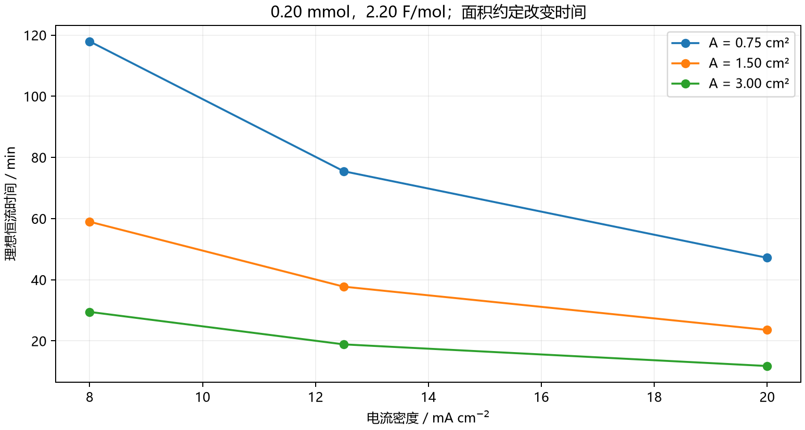
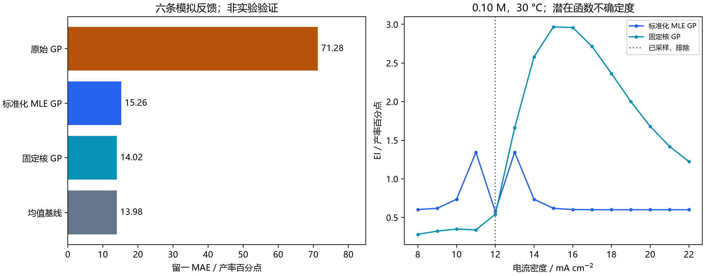
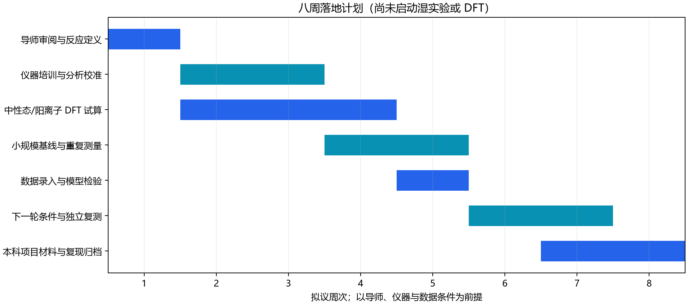

# Closed-Loop AI4S Report: Integrating Data-Driven Optimization with Wet-Lab Execution & Quantum Mechanical Modeling
# 闭环 AI4S 报告：数据驱动优化与湿实验操作、量子化学计算的全流程集成

2026-09-28 · Complete section-aligned bilingual edition / 完整章节对齐双语版

## 1. Executive Summary & Paradigm Shift / 执行概要与范式转变

### 1.1 Abstract and evidence standard / 摘要与证据标准

This study executes the supplied three-module platform and audits the proposed transition from molecular computation to an experimental feedback loop. The original program completed, produced a stoichiometric card and two quantum input files, and fitted a Gaussian process (GP) to six hardcoded yield labels. Additional work comprises 81 scale/volume/area/current scenarios, eight partner-loading calculations, four conditional Faradaic-efficiency balances, 24 leave-one-out prediction records, 270 candidate predictions, nine acquisition sensitivity scenarios, a 200,000-draw EI check, and 12 reviewed quantum input files. The three requested modules are retained throughout this report.

The resulting deliverable is a reproducible **planning and software-verification package**. No electrolysis, HPLC measurement, isolation, Gaussian calculation or ORCA calculation was performed. The six values described as laboratory yields in the source are mock data. The defined wet-lab substrate and the original quantum target are different molecules. The missing product, partner loading and analytical calibration prevent the proposed card from becoming a validated operating procedure. These limitations are results of the audit, not omissions concealed by successful execution.

Evidence labels are [L] verified literature/documentation; [S] supplied assumptions or mock data; [A] arithmetic and numerical audit executed here; [M] conditional model inference; [Q] previously executed quantum calculations reused as starting geometries; [P] proposed work; and [U] unresolved information. In particular, [Q] denotes GFN2-xTB in this release, never DFT. A software status such as `model_recalibrated` is not evidence of reaction discovery.

本研究执行附件中的三模块平台，并审计其由分子计算走向实验反馈闭环的实现程度。原程序已完成运行，生成计量卡和两份量子化学输入文件，并用六条硬编码产率标签拟合高斯过程（GP）。新增工作包括 81 组规模/体积/面积/电流密度情景、8 组偶联试剂用量计算、4 组条件性法拉第效率平衡、24 条留一预测记录、270 条候选条件预测、9 组采集函数敏感性情景、200,000 次抽样的 EI 核验，以及 12 份经审阅的量子化学输入文件。全文保留原规范要求的三个模块。

当前交付物是一套可复现的**设计与软件核验材料**。没有执行电解、HPLC 测量、产物分离、Gaussian 计算或 ORCA 计算。源码称为实验产率的六个数值属于模拟数据；湿实验部分与原量子输入部分使用的分子也不相同。产物、偶联试剂当量和分析校准尚未定义，因此生成卡片还不能成为经验证的操作规程。这些限制是本次审计得出的结果，不能被“程序运行成功”掩盖。

本文使用证据标签：[L] 已核对的文献或官方文档；[S] 附件假设或模拟数据；[A] 本次实际执行的算术与数值审计；[M] 条件性的模型推断；[Q] 复用的既有量子计算几何；[P] 拟议工作；[U] 未确定信息。本交付中的 [Q] 仅指 GFN2-xTB，不代表 DFT。`model_recalibrated` 等软件状态不能作为发现新反应的证据。

### 1.2 What closes the scientific loop / 科学闭环的完成条件

Bridging in-silico design to a physical bench matters because only traceable measurements can determine whether a chemical hypothesis survives contact with the real system. A defensible loop records molecular identity and conditions, predicts an outcome, executes a defined experiment, quantifies it against a calibration, preserves the raw measurement, and updates a model using that evidence. The present work completes the bookkeeping, input preparation, mock ingestion and model-analysis stages. The experimental and DFT stages remain proposed.

Automated stoichiometry removes repeated unit conversion while retaining the electrode-area convention; input generation removes repeated coordinate and charge/spin transcription while keeping molecule identity explicit; evidence-linked CSV ingestion makes subsequent model updates inspectable. These conveniences reduce clerical work, but neither establish the reaction mechanism nor guarantee a useful acquisition policy. The GP audit actually finds no MAE advantage over the simple mean baseline on these six labels.

计算设计走向实验台之所以关键，是因为只有可追溯测量才能判断化学假设是否成立。可信闭环应记录分子身份和条件，提出预测，执行已定义的实验，经校准定量，保存原始数据，再用这些证据更新模型。本次完成了计量核算、输入准备、模拟数据导入与模型分析；实验和 DFT 环节仍为计划。

自动计量减少重复单位换算，但必须保留电极面积的定义；输入文件生成减少坐标、电荷和自旋的重复录入，但必须保持分子身份一致；带证据链接的 CSV 导入使后续模型更新可检查。这些功能能够减少文书性工作，却不能证明反应机理，也不能保证采集策略有效。本次 GP 审计实际上未发现其在六条标签上的 MAE 优于简单均值基线。

### 1.3 Provenance and corrections to the source claims / 来源追溯与原文主张修正

The [supplied specification](../source/specification.md) and [extracted script](../source/run_closed_loop_platform.py) are retained. Only line endings and a final newline were normalized during extraction; source logic was not changed. The executable SHA256 is `37ff41ed272eb5f07094e5801c5837a2c39f4c350cc7731c034c147a35156b9a`. The [execution record](../results/original/execution.json), logs and [original JSON](../results/original/closed_loop_results.json) document this run. New calculations occupy separate files; all reported tables below are populated from their saved outputs.

| Source claim | Audited status |
| --- | --- |
| Wet-lab feedback is experimental | Six hardcoded mock labels; no raw assay files |
| MAE is cross-validation | 2.883333 pp is a direct label comparison; LOO is computed separately |
| Acquisition is EI | Source uses UCB; extension implements analytic EI |
| Shared DFT target and method | Indoline differs from target indole; source ORCA uses CPCM |
| Ready-to-run SOP | Partner equivalents, product, quench and assay are unspecified |
| Computed DFT energies | Input files only; no DFT executed |

[原始规范](../source/specification.md)与[提取脚本](../source/run_closed_loop_platform.py)均已保留。提取时仅规范化换行并补充末尾换行，没有修改源码逻辑。可执行脚本 SHA256 为 `37ff41ed272eb5f07094e5801c5837a2c39f4c350cc7731c034c147a35156b9a`。[执行记录](../results/original/execution.json)、日志及[原始 JSON](../results/original/closed_loop_results.json)记录本次运行。新增计算保存在独立文件中，下文表格均由保存结果填充。

| 原文主张 | 核验状态 |
| --- | --- |
| 湿实验反馈为实验数据 | 实际为六条硬编码模拟标签，没有原始分析文件 |
| MAE 即交叉验证 | 2.883333 个百分点仅为给定标签比较；另做留一验证 |
| 采集函数为 EI | 原式为 UCB；扩展实现解析 EI |
| DFT 目标和方法一致 | 吲哚啉不同于目标吲哚；原 ORCA 使用 CPCM |
| SOP 可直接执行 | 偶联试剂当量、产物、淬灭及分析方法未确定 |
| 已得到 DFT 能量 | 仅生成输入，未执行 DFT |

## 2. Standardized Wet-Lab Operating Protocol (SOP) / 规范化湿实验操作规程

### 2.1 Reaction definition and 0.20 mmol dispensing card / 反应定义与 0.20 mmol 投料卡

[S/A] The substrate SMILES `COc1ccc2[nH]c(cc2c1)c3ccccc3` corresponds to 5-methoxy-2-phenyl-1H-indole, formula C15H13NO, calculated molecular weight 223.275 g/mol. The supplied partner SMILES `CSc1ccccc1` denotes thioanisole, not thiophenol. Its argument is unused by the original dispensing function. A product structure and balanced transformation are not supplied; therefore neither partner identity for the intended chemistry nor its equivalents can be inferred from the title “oxidative C–H functionalization.”

| Material | mmol | mg | mL | Definition |
| --- | --- | --- | --- | --- |
| Target indole | 0.200 | 44.655 | N/A | 1.00 equivalent; 0.033333 M nominal |
| nBu4NPF6 | 0.600 | 232.458 | N/A | 0.100 M |
| MeCN | unknown | unknown | 4.800 | 80.0% v/v of nominal solvent |
| HFIP | unknown | unknown | 1.200 | 20.0% v/v of nominal solvent |
| Coupling partner | unknown | unknown | unknown | Identity and equivalents unresolved |

Masses are nominal neat-material values and should be adjusted for an independently recorded assay/purity if needed. Solvent masses and mmol are intentionally unknown because density, temperature and grade were not supplied. No additive or internal-standard amount is invented. The total liquid volume is a nominal dispensed-solvent volume; dissolution volume changes are not characterized. The corrected generator calculates the 4:1 volumes from the chosen total instead of repeating the source's fixed 4.8/1.2 mL text.

For planning only, the following scenarios quantify the cost of the partner ambiguity; they do not select a reagent or establish reactive equivalents. Liquid dispensing requires verified density and purity before conversion from mass to volume.

| Scenario reagent | Assumed equivalents | mmol | mg |
| --- | --- | --- | --- |
| thioanisole | 0.50 | 0.100 | 12.421 |
| thioanisole | 1.00 | 0.200 | 24.842 |
| thioanisole | 1.50 | 0.300 | 37.262 |
| thioanisole | 2.00 | 0.400 | 49.683 |
| thiophenol | 0.50 | 0.100 | 11.018 |
| thiophenol | 1.00 | 0.200 | 22.036 |
| thiophenol | 1.50 | 0.300 | 33.054 |
| thiophenol | 2.00 | 0.400 | 44.072 |

[S/A] 底物 SMILES `COc1ccc2[nH]c(cc2c1)c3ccccc3` 对应 5-甲氧基-2-苯基-1H-吲哚，分子式 C15H13NO，计算分子量 223.275 g/mol。附件中的偶联试剂 SMILES `CSc1ccccc1` 表示苯甲硫醚，并非苯硫酚；原投料函数没有使用这一参数。由于没有给出产物结构及配平反应，无法从“氧化 C–H 官能团化”这一标题推定实际应选的试剂或当量。

| 物料 | mmol | mg | mL | 定义 |
| --- | --- | --- | --- | --- |
| 目标吲哚 | 0.200 | 44.655 | 不适用 | 1.00 当量；名义浓度 0.033333 M |
| nBu4NPF6 | 0.600 | 232.458 | 不适用 | 0.100 M |
| MeCN | 未知 | 未知 | 4.800 | 名义溶剂体积的 80.0% |
| HFIP | 未知 | 未知 | 1.200 | 名义溶剂体积的 20.0% |
| 偶联试剂 | 未知 | 未知 | 未知 | 实际选用身份及当量未确定 |

所列质量为名义纯物质用量；如果有独立记录的含量或纯度，应据此修正。附件未提供密度、温度和试剂级别，因此溶剂质量与 mmol 明确保留为未知。本文不虚构添加剂或内标用量。总体积指名义量取的溶剂体积，尚未表征溶解后的体积变化。修正后的计算函数依据总体积计算 4:1 配比，不再沿用源码固定的 4.8/1.2 mL 字符串。

以下情景仅量化偶联试剂身份不明确造成的用量差异，不代表试剂选择或有效反应当量。若要按体积量取液体，需要先核对密度和纯度。

| 情景试剂 | 假定当量 | mmol | mg |
| --- | --- | --- | --- |
| 苯甲硫醚 | 0.50 | 0.100 | 12.421 |
| 苯甲硫醚 | 1.00 | 0.200 | 24.842 |
| 苯甲硫醚 | 1.50 | 0.300 | 37.262 |
| 苯甲硫醚 | 2.00 | 0.400 | 49.683 |
| 苯硫酚 | 0.50 | 0.100 | 11.018 |
| 苯硫酚 | 1.00 | 0.200 | 22.036 |
| 苯硫酚 | 1.50 | 0.300 | 33.054 |
| 苯硫酚 | 2.00 | 0.400 | 44.072 |

### 2.2 Electrical configuration and dimensional derivation / 电化学配置与量纲推导

[S] The source proposes a 10 mL undivided three-neck cell, platinum cathode and platinum anode, constant-current electrolysis (CCE), 1.50 cm² anode area, 12.50 mA/cm² and 2.20 F/mol. The alternative carbon rod has neither defined exposed area nor equivalent surface chemistry; it is not an interchangeable geometry. The quoted 1.0 × 1.5 cm plate area could refer to one face, while both faces and edges may be wetted. Record the exact area convention, masking and immersion depth before using a current density. The 12.50 value is a supplied assumption, not a verified link to an earlier Pareto optimum.

For substrate amount n, charge factor z_app and Faraday constant F = 96485.33 C/mol:

$$
I=jA=12.50\times1.50=18.75\ {\rm mA},\qquad Q=nz_{\rm app}F=0.00020\times2.20\times96485.33=42.4535452\ {\rm C}.
$$

$$
t=\frac{Q}{I}=2264.189077\ {\rm s}=37.7364846\ {\rm min}.
$$

The rounded source card reports 42.5 C and 37.7 min. Prefer the integrated measured charge as the stopping criterion; the time assumes uninterrupted, exactly constant current. A 1,001-node independent constant-current integration reproduces Q to floating-point precision. Current interruptions, compliance limits and changing cell voltage require the actual time/current/voltage log. A cell voltage and product identity are missing, so no measured energy consumption, isolated yield or product-specific kWh/kg is calculated.

[S] 原文提出 10 mL 无隔膜三口玻璃电解池、铂阴极及铂阳极，采用恒电流电解（CCE），面积 1.50 cm²，电流密度 12.50 mA/cm²，通电量 2.20 F/mol。备选碳棒既未定义暴露面积，也不具有相同的表面化学，不能作为几何上可直接替换的电极。1.0 × 1.5 cm 铂片可能按单面定义面积，但实际浸液部分还可能包含双面和边缘。使用电流密度前应记录面积约定、遮蔽方式及浸入深度。12.50 是附件给定假设，并非已验证地接续于此前某个 Pareto 最优点。

设底物物质的量为 n、通电系数为 z_app，法拉第常数 F = 96485.33 C/mol：

$$
I=jA=12.50\times1.50=18.75\ {\rm mA},\qquad Q=nz_{\rm app}F=0.00020\times2.20\times96485.33=42.4535452\ {\rm C}.
$$

$$
t=\frac{Q}{I}=2264.189077\ {\rm s}=37.7364846\ {\rm min}.
$$

原始卡片四舍五入后为 42.5 C 和 37.7 min。应优先以实测电流积分所得电荷判断通电终点；时间估计假定电流完全恒定且不中断。独立的 1,001 节点恒流积分在浮点精度内复现了 Q。电流中断、电源输出极限及电池电压变化需要通过实际时间/电流/电压日志判断。当前没有电池电压和明确产物身份，因此不计算实测能耗、分离收率或产物相关的 kWh/kg。

### 2.3 Charge balance and sensitivity calculations / 电荷平衡与敏感性计算

[A/P] For a hypothetical net two-electron product, n_product = Q·FE/(2F). At FE = 100%, the passed charge could generate 0.220 mmol product, exceeding the available 0.200 mmol substrate. Consequently complete substrate-to-product conversion would correspond to at most 90.9091% FE at 2.20 F/mol, assuming this stoichiometry. The excess charge does not prove that either conversion or selectivity will be high. FE and analytical yield are distinct quantities.

| Assumed yield / % | Product / mmol | FE / % |
| --- | --- | --- |
| 25.0 | 0.050 | 22.7273 |
| 50.0 | 0.100 | 45.4545 |
| 75.0 | 0.150 | 68.1818 |
| 100.0 | 0.200 | 90.9091 |

The 81-row [parameter sweep](../results/audit/stoichiometry_sweep.csv) spans scale 0.10/0.20/0.50 mmol, volume 3.0/6.0/12.0 mL, area 0.75/1.50/3.00 cm² and j = 8.0/12.5/20.0 mA/cm². Volume changes electrolyte mass and substrate concentration; area changes current and duration. These arithmetic scenarios do not preserve mass transport, electrode spacing or reaction similarity. In particular, doubling the area to 3.00 cm² at fixed j halves the nominal duration to 18.8682 min.


[A/P] 若假设目标产物净消耗两个电子，则 n_product = Q·FE/(2F)。在 FE = 100% 时，已通过电荷理论上可对应 0.220 mmol 产物，超过投入的 0.200 mmol 底物。因此，在该化学计量假设下，2.20 F/mol 对应的完全转化且全部生成目标产物情景，其 FE 上限为 90.9091%。多通入电荷不能证明转化率或选择性较高；FE 与分析产率是不同指标。

| 假定产率 / % | 产物 / mmol | FE / % |
| --- | --- | --- |
| 25.0 | 0.050 | 22.7273 |
| 50.0 | 0.100 | 45.4545 |
| 75.0 | 0.150 | 68.1818 |
| 100.0 | 0.200 | 90.9091 |

81 行[参数扫描](../results/audit/stoichiometry_sweep.csv)覆盖规模 0.10/0.20/0.50 mmol、体积 3.0/6.0/12.0 mL、面积 0.75/1.50/3.00 cm²、电流密度 8.0/12.5/20.0 mA/cm²。体积改变电解质质量和底物浓度；面积改变电流和时间。这些算术情景并未保持传质、电极间距或反应相似性。例如，在电流密度不变时，将面积加倍至 3.00 cm²，会把名义时间减半至 18.8682 min。



### 2.4 Workup and chromatography: source proposal with unresolved compatibility / 后处理与柱层析：保留相容性缺项的原文方案

[S/P/U] The following preserves the requested step sequence and numerical gradient. It is a **provisional source-derived workup**, not an experimentally verified isolation method. The source provides no product identity, quench compatibility, TLC retention, silica loading, fraction analysis or recovery. These missing facts must be resolved with the supervising chemist before applying the sequence to a reaction.

1. Stop the current at the target integrated charge, nominally 42.4535 C; retain the time/current/voltage trace.
2. The source proposes 10 mL saturated aqueous Na2S2O3/NaHCO3. The slash does not specify separate solutions, a mixture, concentrations or order. A validated quench composition and compatibility are required; none is inferred here. Six mL reaction liquid plus ten mL quench exceeds a 10 mL nominal cell, so any approved workup needs a separately specified vessel with appropriate capacity.
3. The source proposes ethyl acetate extraction, three portions of 15 mL, after an appropriate quench and phase separation. MeCN/HFIP partitioning and emulsion formation are unknown; layer identity must be established rather than inferred from a generic recipe.
4. It then proposes a 15 mL brine wash of the combined organic extracts, followed by anhydrous Na2SO4. Drying-agent loading and contact time are unspecified.
5. It proposes filtration and reduced-pressure solvent removal. Product stability and evaporation settings remain unspecified.
6. It proposes silica flash chromatography with petroleum ether/ethyl acetate 15:1 progressing to 8:1 by volume. This corresponds to ethyl acetate fractions of 6.25% and 11.11%. Petroleum ether boiling range, gradient volume, column dimensions and product fractions are unknown; determine them using validated analytical observations and report isolated mass and purity separately from HPLC yield.

This section fulfills the requested numerical and procedural documentation while retaining the fields that the source cannot justify. A fabricated partner loading or quench formulation would give the appearance of completeness without a chemically defined experiment.

[S/P/U] 以下保留原规范要求的步骤顺序与数值梯度。这是**来自附件的暂定后处理方案**，并非已验证的分离方法。原文未提供产物身份、淬灭相容性、TLC 保留情况、硅胶负载量、馏分分析及回收率；用于实际反应前，需要与指导实验人员共同确定这些事项。

1. 达到目标累计电荷时停止通电，名义目标为 42.4535 C；保存时间、电流和电压轨迹。
2. 原文提出加入 10 mL 饱和 Na2S2O3/NaHCO3 水溶液，但斜杠未说明是两种溶液、混合液、具体浓度或加入顺序。需要已验证的淬灭组成与相容性，本文不作推定。6 mL 反应液再加 10 mL 淬灭液超过 10 mL 电解池名义容量，获准采用的后处理还需另行明确合适容量的容器。
3. 原文提出在适当淬灭及分相后，用乙酸乙酯萃取三次，每次 15 mL。MeCN/HFIP 的分配及乳化情况未知，不能仅凭通用操作假定哪一层为目标有机相。
4. 原文随后提出合并有机层，用 15 mL 盐水洗涤，再用无水 Na2SO4 干燥。干燥剂用量和接触时间未指定。
5. 原文提出过滤并减压除去溶剂。产物稳定性和蒸发条件尚未指定。
6. 原文提出硅胶快速柱层析，洗脱剂为石油醚/乙酸乙酯，体积比由 15:1 逐步变为 8:1；对应乙酸乙酯体积分数为 6.25% 和 11.11%。石油醚馏程、梯度体积、柱尺寸和产物馏分均未知，应通过经核验的分析观察确定，并分别报告分离质量、纯度及 HPLC 产率。

本节完整记录了所需数值和操作顺序，同时保留原始材料无法支持的字段。编造偶联试剂当量或淬灭配方，会制造“方案完整”的表象，却仍然没有定义清楚化学实验。

### 2.5 Bench record and release conditions / 实验记录与可执行条件

[P] A usable bench record must connect one run ID to the product and reactant structures; reagent lots, purity and mass; solvent composition; cell and electrode materials; one-face or total-wetted area; electrode spacing; current and charge trace; measured temperature and stirring; sampling and quench; HPLC calibration and raw chromatograms; and isolated-product identity. The current card does not specify a reaction temperature, stirring rate or gap. The mock-learning candidate at 30 °C is not evidence that the default SOP was calibrated there. The [arithmetic audit](../results/audit/stoichiometry.json) therefore records `ready_for_wet_lab: false` with explicit missing fields.

[P] 可用的实验记录应把单次运行编号与以下信息关联：产物及反应物结构；试剂批号、纯度和质量；溶剂组成；池体及电极材料；单面面积或总浸液面积约定；电极间距；电流、电荷轨迹；实测温度及搅拌；取样和淬灭；HPLC 校准及原始色谱；分离产物鉴定。当前卡片未指定温度、搅拌速度或电极间距。模拟学习给出的 30 °C 候选点不能证明默认 SOP 在此温度下经过校准。因此，[计量审计](../results/audit/stoichiometry.json)明确记录 `ready_for_wet_lab: false`，并列出缺项。

## 3. Computational Chemistry & DFT Integration / 量子化学计算与 DFT 文件解析

### 3.1 Molecular identity, charge and spin / 分子身份、电荷与自旋

[A] The source DFT default `c1ccc2c(c1)CCN2` is indoline (C8H9N), whereas the dispensing card concerns C15H13NO. A one-electron oxidation of a closed-shell neutral molecule removes one electron without changing nuclear composition: M → M⁺ + e⁻. The lowest-spin candidate then has S = 1/2 and multiplicity 2S+1 = 2; net charge is +1. This electron bookkeeping motivates the input state, not a demonstrated reactive intermediate or ground-state assignment.

| Molecule | Formula | State | Charge | Multiplicity | Electrons | Atoms |
| --- | --- | --- | --- | --- | --- | --- |
| target_indole | C15H13NO | neutral | 0 | 1 | 118 | 30 |
| target_indole | C15H13NO | cation | 1 | 2 | 117 | 30 |
| indoline_control | C8H9N | neutral | 0 | 1 | 64 | 18 |
| indoline_control | C8H9N | cation | 1 | 2 | 63 | 18 |

A doublet has an ideal spin expectation S(S+1) = 0.75. An unrestricted calculation allows distinct alpha and beta orbitals, but may have spin contamination or an unstable SCF solution. Eventual outputs require spin and wavefunction review, alongside convergence. Neutral singlet partners are included because an isolated cation energy cannot supply an oxidation free-energy difference.

[A] 原 DFT 函数默认结构 `c1ccc2c(c1)CCN2` 是吲哚啉（C8H9N），投料卡则针对 C15H13NO。闭壳层中性分子单电子氧化时，移除一个电子而不改变原子核组成：M → M⁺ + e⁻。相应的最低自旋候选态为 S = 1/2，自旋多重度 2S+1 = 2，净电荷为 +1。这种电子计数支持输入态的设置，并不等于已经确认其为真实反应中间体或基态。

| 分子 | 分子式 | 状态 | 电荷 | 多重度 | 电子数 | 原子数 |
| --- | --- | --- | --- | --- | --- | --- |
| 目标吲哚 | C15H13NO | 中性态 | 0 | 1 | 118 | 30 |
| 目标吲哚 | C15H13NO | 阳离子 | 1 | 2 | 117 | 30 |
| 吲哚啉对照 | C8H9N | 中性态 | 0 | 1 | 64 | 18 |
| 吲哚啉对照 | C8H9N | 阳离子 | 1 | 2 | 63 | 18 |

理想双重态的自旋期望值 S(S+1) = 0.75。非限制计算允许 α、β 轨道不同，但可能存在自旋污染或 SCF 不稳定解。后续需结合收敛情况检查自旋和波函数。输入中同时包含中性单重态，因为只有阳离子能量无法构成氧化自由能差。

### 3.2 Coordinate provenance and actual files / 坐标来源与实际文件

[Q/A/P] The reviewed set contains four Gaussian `.gjf` files with two steps each and eight ORCA `.inp` files with separated optimization and refinement steps: two molecules × two charge states. Their two starting XYZ geometries reuse previously completed neutral GFN2-xTB/ALPB(MeCN) optimizations from this repository. SHA256 identity checks precede reuse; atom counts, atom order, finite coordinates and interatomic distances are checked. No new xTB job is claimed. Neutral and cation inputs begin at the same neutral geometry and request independent DFT relaxation.

The [input manifest](../inputs/reviewed/input_manifest.json) maps every file to charge, multiplicity, electron count, geometry provenance and hash. See the [input guide](../inputs/reviewed/README.md). Representative files are [target cation Gaussian](../inputs/reviewed/target_indole_cation.gjf), [target cation ORCA optimization](../inputs/reviewed/target_indole_cation_opt.inp), and [ORCA refinement](../inputs/reviewed/target_indole_cation_sp.inp). Original indoline files remain under `results/original/dft_inputs` for comparison.

[Q/A/P] 审阅版包含 4 份各带两个步骤的 Gaussian `.gjf` 文件，以及将优化与精修分开的 8 份 ORCA `.inp` 文件，对应两个分子和各自两个电荷态。两套起始 XYZ 坐标复用仓库内此前实际完成的中性态 GFN2-xTB/ALPB(MeCN) 优化结果。复用前核对 SHA256，并检查原子数、原子顺序、坐标有限性和原子间距；本次没有新增 xTB 作业。中性态和阳离子态以相同的中性几何起步，但分别请求独立 DFT 弛豫。

[输入清单](../inputs/reviewed/input_manifest.json)逐一记录文件、电荷、多重度、电子数、几何来源和哈希。[输入使用说明](../inputs/reviewed/README.md)解释依赖关系。代表文件包括[目标阳离子 Gaussian 输入](../inputs/reviewed/target_indole_cation.gjf)、[目标阳离子 ORCA 优化输入](../inputs/reviewed/target_indole_cation_opt.inp)及[ORCA 精修输入](../inputs/reviewed/target_indole_cation_sp.inp)。原始吲哚啉输入仍保存在 `results/original/dft_inputs` 中供比较。

### 3.3 Method choice, solvation and engine differences / 方法选择、溶剂化与程序差异

[L/P] The requested UB3LYP-D3(BJ)/def2-SVP level provides a relatively modest proposed optimization/frequency model for the radical cation; neutral partners use the restricted form. Dispersion correction and an implicit polar solvent address selected interactions absent from a bare gas-phase calculation. The UM06-2X/def2-TZVP single point changes functional and increases basis flexibility for an energy comparison at the optimized geometry. It does not reoptimize that geometry or prove greater accuracy for these radicals. No D3(BJ) term is automatically appended to M06-2X in this protocol. Gaussian keywords are described in the [official DFT reference](https://gaussian.com/dft/).

The original Gaussian file requests SMD(MeCN), but the original ORCA line requests only CPCM(acetonitrile); the shared JSON model label is therefore inaccurate. Reviewed ORCA 6.1 files explicitly set `smd true` and `SMDsolvent "acetonitrile"` in `%cpcm`. The ORCA implementation supports this distinction ([official solvation manual](https://www.faccts.de/docs/orca/6.1/manual/contents/essentialelements/solvationmodels.html)); Gaussian SMD is specified through SCRF ([official reference](https://gaussian.com/scrf/)). ORCA `B3LYP/G` selects Gaussian-style VWN3 correlation ([functional definitions](https://www.faccts.de/docs/orca/6.1/manual/contents/modelchemistries/DensityFunctionalTheory.html)). Grids, RIJCOSX and continuum implementations still differ between engines, so identical energies are not assumed.

The proposed bench solvent is MeCN/HFIP 4:1, while the input model is pure-MeCN SMD. This is an explicit approximation: specific HFIP hydrogen bonding, counterions, electrode fields, potential control and interfacial charge transfer are not represented. A later solvent/explicit-cluster sensitivity study is needed if those effects control the claimed chemistry.

[L/P] 指定的 UB3LYP-D3(BJ)/def2-SVP 是拟用于自由基阳离子优化和频率分析的较低成本模型，中性配对态采用限制形式。色散修正和隐式极性溶剂纳入裸气相计算缺少的部分相互作用。随后进行 UM06-2X/def2-TZVP 单点计算，可在已优化几何上更换泛函并增加基组灵活性；它不会重新优化几何，也不能自动证明对这些自由基更准确。本方案不会自行给 M06-2X 追加 D3(BJ)。相关 Gaussian 关键词见[官方 DFT 参考](https://gaussian.com/dft/)。

原 Gaussian 文件指定 SMD(MeCN)，原 ORCA 行却仅指定 CPCM(acetonitrile)，所以两者共享的 JSON 方法标签并不准确。审阅版 ORCA 6.1 输入在 `%cpcm` 中显式设置 `smd true` 和 `SMDsolvent "acetonitrile"`。这种区别可由 [ORCA 官方溶剂化文档](https://www.faccts.de/docs/orca/6.1/manual/contents/essentialelements/solvationmodels.html)核对；Gaussian 通过 SCRF 指定 SMD，见[官方参考](https://gaussian.com/scrf/)。ORCA 的 `B3LYP/G` 选用与 Gaussian 风格对应的 VWN3 相关项，见[泛函定义](https://www.faccts.de/docs/orca/6.1/manual/contents/modelchemistries/DensityFunctionalTheory.html)。两套程序的网格、RIJCOSX 和连续介质实现仍有差别，不预设能量完全相同。

拟议实验溶剂为 MeCN/HFIP 4:1，量子输入却采用纯 MeCN 的 SMD。这是明确的近似：没有显式描述 HFIP 特异氢键、反离子、电极电场、电位控制及界面电子转移。如果这些因素决定目标化学行为，后续需要溶剂模型及显式簇敏感性研究。

### 3.4 Resource configuration and dependent jobs / 计算资源与作业依赖

[A/P] The original Gaussian input requests 16 processors and 32 GB memory. Original ORCA `%maxcore 2000` with 16 processes implies nominal 32,000 MB plus overhead because maxcore is per process ([official memory guide](https://www.faccts.de/docs/orca/6.1/tutorials/first_steps/memory.html)). These settings exceed the approximately 16 GB host and are unsuitable for automatic local execution. The checked PATH exposed neither g16 nor orca; no engine was launched, and this check does not establish that no installation exists elsewhere.

Reviewed files request two CPU processes, Gaussian 3 GB total or ORCA 1,000 MB per process. A 4 GB scheduler allocation for one job is a proposed pilot starting point, not a measured memory guarantee. A licensed/configured engine and adequate available RAM are still required. Gaussian Link1 reads its checkpoint; ORCA SP files depend on newly produced `*_opt.xyz` coordinates and must follow successful optimization and frequency inspection. Those optimized DFT files do not yet exist. Generated input syntax has been reviewed against documentation and structural checks, but has not passed an engine parser or convergence test.

[A/P] 原 Gaussian 输入请求 16 处理器、32 GB 内存；原 ORCA 的 `%maxcore 2000` 配合 16 进程，对应名义 32,000 MB，且可能有额外开销，因为 maxcore 按进程计，见[官方内存说明](https://www.faccts.de/docs/orca/6.1/tutorials/first_steps/memory.html)。该配置超过本机约 16 GB 内存，不适合自动本地执行。检查的 PATH 中没有 g16 或 orca，本次未启动这些引擎；PATH 检查不等于证明其他目录没有安装。

审阅版使用两个 CPU 进程，Gaussian 总内存 3 GB，或 ORCA 每进程 1,000 MB。为单作业申请 4 GB 调度内存只是拟议试算起点，并非实测内存保证；仍需已配置、符合许可条件的引擎及足够可用内存。Gaussian Link1 从检查点读取数据；ORCA 单点输入依赖新生成的 `*_opt.xyz`，必须先完成优化并检查频率。当前这些 DFT 优化结果尚不存在。输入语法已对照文档并做结构检查，但未经过引擎解析或收敛验证。

### 3.5 What an eventual calculation could establish / 后续计算可以支持什么结论

[P] For each neutral/cation pair, retain converged geometries, electronic energies, harmonic frequencies, thermal corrections and spin diagnostics at stated temperature and standard state. A composite estimate may use G_comp = E_SP + (G_low − E_low), provided the thermal correction and solvation conventions are internally consistent and not double-counted. Soft modes, conformer populations and alternate SCF solutions require assessment. Significant imaginary frequencies invalidate an assumed minimum unless resolved.

An adiabatic oxidation free-energy difference further requires a defined electron/reference-electrode convention and consistent standard states; a calibrated reference couple should be treated at the same protocol. No oxidation potential in volts is reported here. Neither these input files nor a future vertical ionization energy alone establishes a transition state, reaction rate, C3 selectivity or the identity of the electrode-generated species.

[P] 对每组中性态/阳离子，应保存指定温度、标准态下的收敛几何、电子能、谐振频率、热修正及自旋诊断。组合自由能可考虑 G_comp = E_SP + (G_low − E_low)，前提是热修正和溶剂化约定一致，且不重复计入。低频振动、构象占比和不同 SCF 解需要评估；显著虚频意味着不能在未进一步处理前将其认定为极小值。

绝热氧化自由能差还需要定义电子/参比电极约定，并统一标准态；可按相同方法处理已校准的参比氧化还原对。本文不报告以伏特为单位的氧化电位。输入文件本身，或将来单独得到的垂直电离能，都不能证明过渡态、反应速率、C3 选择性或电极生成物种的身份。

## 4. Active Learning Feedback & Model Evolution / 主动学习数据回传与模型自适应迭代

### 4.1 Provenance of the six feedback rows / 六条反馈记录的来源

[S/A] All labels below are hardcoded in the supplied script. The saved [mock feedback CSV](../data/mock_feedback.csv) marks every row as mock and leaves chromatogram, calibration and reaction-identity fields empty. “HPLC” in the source comment is not a measurement record. In particular, no evidence links these six labels to the wet-lab substrate in Section 2.

| Run | j / mA cm⁻² | c / M | T / °C | Given prediction / % | Mock label / % |
| --- | --- | --- | --- | --- | --- |
| mock-01 | 8.0 | 0.050 | 25.0 | 62.0 | 58.5 |
| mock-02 | 15.0 | 0.050 | 25.0 | 78.5 | 81.2 |
| mock-03 | 10.0 | 0.150 | 40.0 | 71.0 | 69.4 |
| mock-04 | 20.0 | 0.150 | 25.0 | 84.0 | 79.8 |
| mock-05 | 25.0 | 0.200 | 50.0 | 55.0 | 51.2 |
| mock-06 | 12.0 | 0.100 | 30.0 | 86.5 | 88.0 |

The direct comparison gives MAE = (3.5 + 2.7 + 1.6 + 4.2 + 3.8 + 1.5)/6 = 2.883333 percentage points, reported as 2.88 in the source. This is a discrepancy between given prior predictions and given mock labels. It does not involve held-out fitting and is not cross-validation loss.

[S/A] 下表标签全部硬编码于原脚本。[模拟反馈 CSV](../data/mock_feedback.csv)将每条记录标为 mock，并把原始色谱、校准及反应结构字段留空。源码注释中的“HPLC”不是测量记录，尤其没有证据把这六条标签与第 2 节底物对应起来。

| 记录 | j / mA cm⁻² | c / M | T / °C | 给定预测 / % | 模拟标签 / % |
| --- | --- | --- | --- | --- | --- |
| mock-01 | 8.0 | 0.050 | 25.0 | 62.0 | 58.5 |
| mock-02 | 15.0 | 0.050 | 25.0 | 78.5 | 81.2 |
| mock-03 | 10.0 | 0.150 | 40.0 | 71.0 | 69.4 |
| mock-04 | 20.0 | 0.150 | 25.0 | 84.0 | 79.8 |
| mock-05 | 25.0 | 0.200 | 50.0 | 55.0 | 51.2 |
| mock-06 | 12.0 | 0.100 | 30.0 | 86.5 | 88.0 |

直接比较得到 MAE = (3.5 + 2.7 + 1.6 + 4.2 + 3.8 + 1.5)/6 = 2.883333 个百分点，原输出取 2.88。它只是给定先验预测与给定模拟标签之间的偏差，没有进行留出拟合，因此不是交叉验证损失。

### 4.2 Independent leave-one-out assessment / 独立留一评估

[A/M] Each of six folds holds out one row and fits only the other five. Feature standardization and target normalization are recomputed within each training fold. The original GP uses its source Matérn-plus-white kernel and unnormalized target. The scaled MLE GP adds a fitted signal amplitude, standardizes all three features, normalizes y, and fits scalar length scale and noise by marginal likelihood with two restarts. The fixed-kernel sensitivity model uses standardized features, unit amplitude/length scale, Matérn 5/2 and an assumed 2-percentage-point observation SD. The mean baseline predicts the training mean. Hyperparameters were not tuned on held-out errors; the full fold records are retained.

| Method | MAE / pp | RMSE / pp |
| --- | --- | --- |
| Original GP | 71.2820 | 72.4649 |
| Scaled MLE GP | 15.2560 | 17.1483 |
| Fixed-kernel GP | 14.0159 | 15.6392 |
| Training-mean baseline | 13.9800 | 15.6506 |

The original full-data kernel drives its length scale to 100,000 and inferred noise variance to about 5,250.30 pp² while using unit signal amplitude. Its almost-zero mean and 72.47 pp predictive SD expose poor scaling and prior specification. The scaled model repairs those numerical pathologies but does **not** beat the mean baseline in MAE. Fixed-kernel RMSE is slightly lower than baseline, while its MAE is slightly higher; six dependent leave-one-out errors do not support a general superiority claim. No random train/test split can manufacture additional independent chemical information here. Future real evaluation needs repeated assays and condition- or time-held-out validation.

[A/M] 六折计算每次留出一条记录，仅用另外五条训练；特征标准化和目标归一化都在各折训练集内重新计算。原始 GP 保留源码的 Matérn 加白噪声核及未归一化目标。标准化 MLE GP 加入可拟合信号幅度，标准化三个特征、归一化 y，并通过边际似然和两次重启拟合标量长度尺度与噪声。固定核敏感性模型采用标准化特征、单位幅度和长度尺度、Matérn 5/2，以及假定为 2 个产率百分点的观测标准差。均值基线预测训练标签均值。没有利用留出误差调参，完整逐折结果已保存。

| 方法 | MAE / pp | RMSE / pp |
| --- | --- | --- |
| 原始 GP | 71.2820 | 72.4649 |
| 标准化 MLE GP | 15.2560 | 17.1483 |
| 固定核 GP | 14.0159 | 15.6392 |
| 训练均值基线 | 13.9800 | 15.6506 |

原模型全数据拟合将长度尺度推至 100,000，噪声方差约为 5,250.30 pp²，但信号幅度仍固定为 1。其接近零的预测均值及 72.47 个百分点的预测标准差暴露了尺度和先验设置问题。标准化修正了这些数值异常，却**未能在 MAE 上超过均值基线**。固定核模型 RMSE 略低于基线、MAE 略高；六条相互依赖的留一误差不足以支持普遍优越性。随机切分也不能制造更多独立化学信息。后续真实评估应包含重复分析和按条件或时间留出的验证。

### 4.3 EI, UCB and uncertainty definitions / EI、UCB 与不确定度的定义

[L/A] The source computes μ + 2.5σ, which is UCB. Its intermediate improvement and Z variables do not turn that score into Expected Improvement. For maximization, the implemented analytic one-point EI is

$$
\Delta=\mu-f_{\rm best}-\xi,\quad z=\Delta/\sigma_f,\quad EI=\Delta\Phi(z)+\sigma_f\phi(z),\quad UCB=\mu+\kappa\sigma_f.
$$

At zero variance, EI reduces to max(Δ,0). Larger mean supports exploitation; greater function uncertainty can support exploration. UCB uses κ = 2.5 here; EI uses ξ = 0 by default. This formula follows the [BoTorch acquisition documentation](https://botorch.org/docs/acquisition). We compute it with SciPy, without claiming to have executed BoTorch optimization.

The GP's WhiteKernel contributes observation-noise variance to predictive variance. We retain both and use σ_f² = max(σ_observation² − σ_noise²,0) after restoring target units for the revised acquisition. The original source UCB uses observation SD; that original result is preserved. The [scikit-learn GPR API](https://scikit-learn.org/stable/modules/generated/sklearn.gaussian_process.GaussianProcessRegressor.html) describes target normalization and predictive uncertainty. EI here plugs in the largest observed label, 88%; it is not noise-integrated EI and does not resolve uncertainty in the incumbent. The 200,000-draw check gives 1.339844 ± 0.008071 pp Monte Carlo standard error versus analytic 1.344386 pp at the selected scaled-MLE point.

[L/A] 原代码计算 μ + 2.5σ，实际为 UCB；即使提前计算 improvement 和 Z，也没有构成期望改进 EI。对最大化任务，本次实现的解析单点 EI 为：

$$
\Delta=\mu-f_{\rm best}-\xi,\quad z=\Delta/\sigma_f,\quad EI=\Delta\Phi(z)+\sigma_f\phi(z),\quad UCB=\mu+\kappa\sigma_f.
$$

零方差时 EI 退化为 max(Δ,0)。较高均值支持利用已有知识，较大的函数不确定度可以支持探索。本例 UCB 采用 κ = 2.5，EI 默认 ξ = 0。公式与 [BoTorch 采集函数文档](https://botorch.org/docs/acquisition)一致；本次用 SciPy 计算，不声称执行了 BoTorch 优化。

GP 的 WhiteKernel 为预测方差贡献观测噪声。修正后的采集函数保留两种不确定度，并在恢复目标单位后使用 σ_f² = max(σ_observation² − σ_noise²,0)。原 UCB 使用观测标准差，其原始结果仍被保留。[scikit-learn GPR API](https://scikit-learn.org/stable/modules/generated/sklearn.gaussian_process.GaussianProcessRegressor.html)说明了目标归一化和预测不确定度接口。此处 EI 把最高观测标签 88% 作为固定当前最优值，不是对观测噪声积分的 EI，也没有解决最优观测值自身的不确定度。在标准化 MLE 所选点，200,000 次抽样给出 1.339844 pp，蒙特卡洛标准误为 0.008071 pp；解析值为 1.344386 pp。

### 4.4 Round 2 candidates and sensitivity / 第二轮候选条件与敏感性

[M/P] The pool contains 90 conditions: j = 8–22 mA/cm² in unit increments, electrolyte concentration 0.08/0.10/0.12 M, and temperature 25/30 °C. One previously sampled point is excluded, leaving 89 unseen candidates. Only 31 of the original 90 lie inside the training convex hull; a bounding box alone is not interpolation support. The following are conditional rankings on mock labels, not qualified bench recommendations.

| Policy | j / mA cm⁻² | c / M | T / °C | μ / % | σ / pp (latent unless stated) |
| --- | --- | --- | --- | --- | --- |
| Source UCB (observation SD) | 15.00 | 0.080 | 30.0 | 0.0800 | 72.4700 |
| Scaled MLE EI | 13.00 | 0.100 | 30.0 | 78.3720 | 11.6784 |
| Fixed-kernel EI | 15.00 | 0.100 | 30.0 | 88.5049 | 6.7860 |
| Fixed-kernel UCB | 18.00 | 0.100 | 30.0 | 84.5275 | 9.6600 |

The revised default EI and latent-UCB both select 13.00 mA/cm², 0.100 M and 30.0 °C, with predicted mean 78.3720% and latent SD 11.6784 pp. A fixed-kernel EI policy instead selects 15.00 mA/cm²; its UCB selects 18.00. Across the nine fixed-kernel noise/ξ scenarios, the EI choice changes between 15.00 and 16.00 mA/cm². Such sensitivity must remain visible rather than presenting one grid point as a discovered optimum. An unbounded Gaussian posterior can extend beyond 0–100%; a UCB above 100 is an acquisition score, not a physically possible yield.

The scaled-MLE runner-up at 11.00 mA/cm², 0.100 M and 30.0 °C has EI 1.344373 pp, only 0.00001312 pp below the reported maximum. This nearly symmetric ranking around the sampled 12.00 point provides no meaningful scientific preference for 13.00 over 11.00.

The saved top-five rankings are not a jointly optimized experimental batch. Closely spaced points may be redundant. Once real assay variance is known, a subsequent batch should include an incumbent replicate, an exploratory point and a predeclared comparator, with a suitable joint or sequential-fantasy acquisition and balanced execution order. Those experiments have not been selected or run here.


[M/P] 候选池包含 90 个条件：电流密度 8–22 mA/cm²、步长 1，电解质浓度 0.08/0.10/0.12 M，温度 25/30 °C。排除一个已采样条件后剩余 89 个新条件。原 90 个点中只有 31 个位于训练数据凸包内，处于取值范围框内不等于具备插值支持。下表是模拟标签下的条件性排序，不能直接作为已合格的实验推荐。

| 策略 | j / mA cm⁻² | c / M | T / °C | μ / % | σ / pp（默认潜在函数） |
| --- | --- | --- | --- | --- | --- |
| 原 UCB（观测标准差） | 15.00 | 0.080 | 30.0 | 0.0800 | 72.4700 |
| 标准化 MLE EI | 13.00 | 0.100 | 30.0 | 78.3720 | 11.6784 |
| 固定核 EI | 15.00 | 0.100 | 30.0 | 88.5049 | 6.7860 |
| 固定核 UCB | 18.00 | 0.100 | 30.0 | 84.5275 | 9.6600 |

修正版默认 EI 和潜在函数 UCB 均选出 13.00 mA/cm²、0.100 M、30.0 °C，预测均值为 78.3720%，潜在标准差为 11.6784 个百分点。固定核 EI 则选择 15.00 mA/cm²，其 UCB 选择 18.00。在九组固定核噪声/ξ 情景中，EI 所选电流密度在 15.00 与 16.00 mA/cm² 之间变化。应保留这种敏感性，而不是把单个网格点称为发现了最优条件。无界高斯后验可能超出 0–100%；超过 100 的 UCB 是采集得分，并非物理上可能的产率。

标准化 MLE 排名第二的条件是 11.00 mA/cm²、0.100 M、30.0 °C，EI 为 1.344373 pp，仅比最高值低 0.00001312 pp。这种围绕已采样 12.00 点近乎对称的排序，并未提供有意义的科学依据来优先选择 13.00 而非 11.00。

保存的前五名是单点排序，并非联合优化的实验批次，相近条件可能高度冗余。掌握真实分析方差后，可在下一批安排当前最佳条件的重复、探索点及预先声明的对照，并使用合适的联合或序贯虚拟观测采集方法、平衡执行顺序。本次没有选定或执行这些实验。



### 4.5 Evidence-linked ingestion and practical update cycle / 带证据链接的数据导入与更新流程

[A/P] The extension accepts a CSV through `--feedback` and an explicit `--role`. Mock and experimental rows cannot be mixed; duplicate run IDs, nonfinite values, yields outside 0–100%, invalid temperature units and inconsistent reaction identity are rejected. Experimental mode additionally requires valid substrate/partner/product SMILES, operator/time fields, HPLC metadata and local raw-assay, calibration and electrolysis files whose SHA256 hashes match. Files must resolve within the feedback directory. These checks establish linkage and basic consistency, not the truth of a chromatogram or the adequacy of calibration.

After a supervised run, archive immutable raw files, transcribe one record per independent experiment, document exclusions and failed runs, run ingestion, inspect held-out error and uncertainty, then review the proposed condition before scheduling the next experiment. Independent replicate IDs are allowed even at identical conditions. The present CSV model does not estimate batch effects or heteroscedastic noise; failed chemistry must not be silently dropped or converted from “unmeasured” into zero yield. Reports are rebuilt explicitly from saved results, and no autonomous hardware control or laboratory scheduling occurs.

[A/P] 扩展程序通过 `--feedback` 接受 CSV，并要求明确的 `--role`。模拟与实验记录不能混用；重复运行编号、非有限数、超出 0–100% 的产率、错误温度单位和不一致反应身份将被拒绝。实验模式还要求有效的底物/偶联试剂/产物 SMILES、操作人和时间、HPLC 元数据，以及原始分析、校准和电解记录文件，且 SHA256 必须匹配；文件应解析到反馈目录内部。这些检查建立证据关联和基本一致性，不证明色谱本身真实或校准充分。

监督实验结束后，归档不可随意覆盖的原始文件，每个独立实验录入一条记录，说明排除项与失败记录，执行导入，检查留出误差及不确定度，然后审阅拟议条件并安排下一次实验。条件相同但编号不同的独立重复记录可以保留。当前 CSV 模型没有估计批次效应或异方差噪声；失败反应不能被默默删除，“未测量”也不能直接改成零产率。报告需要显式从保存结果重新构建，本软件不控制仪器或自动安排实验。

### 4.6 Reproduction and computational extent / 复现方式与计算范围

From the repository root in an existing environment with the recorded packages and numerical DLLs available:

```powershell
python closed_loop/scripts/run_original.py
python closed_loop/scripts/audit_closed_loop.py --output work/closed-loop-audit
python closed_loop/scripts/generate_reviewed_inputs.py --output work/closed-loop-inputs
python -m unittest discover -s tests -v
python closed_loop/scripts/validate_closed_loop.py
```

The first command intentionally refreshes the archived original run and its timing; it never launches the generated quantum inputs. Use a separate checkout if preserving release bytes. The audit defaults to the mock CSV; experimental mode requires `--feedback path/to/records.csv --role experimental`. It writes model outputs to the explicitly selected destination. The reviewed generator reads hash-verified prior geometries from this repository. Numerical versions are stored in [audit_summary.json](../results/audit/audit_summary.json). No packages were installed for this work. Timing and floating-point ties may vary by platform; original near-flat UCB rankings in particular have negligible numerical separation.

在已具备记录版本的软件包及数值 DLL 的环境中，从仓库根目录运行：

```powershell
python closed_loop/scripts/run_original.py
python closed_loop/scripts/audit_closed_loop.py --output work/closed-loop-audit
python closed_loop/scripts/generate_reviewed_inputs.py --output work/closed-loop-inputs
python -m unittest discover -s tests -v
python closed_loop/scripts/validate_closed_loop.py
```

首条命令会明确更新原始运行归档及耗时记录，但不会启动生成的量子输入；如需保持发布文件字节不变，应在另一份检出目录中复现。审计默认读取模拟 CSV；实验模式需指定 `--feedback path/to/records.csv --role experimental`，模型输出写入明确指定的位置。审阅版输入生成器读取本仓库已核对哈希的既有几何。数值包版本保存于 [audit_summary.json](../results/audit/audit_summary.json)。本次未安装新依赖。耗时和浮点近似并列可能随平台变化，尤其原 UCB 排序本来就近乎平坦，其细微顺序没有化学意义。

## 5. Execution Gantt & Laboratory Integration Plan / 实验室落地与大创推进计划

### 5.1 Conditional eight-week Gantt / 附前提条件的八周甘特计划

[P] The intended audience is the Pan–Tang group named in the supplied brief. Bench access, instrument availability, group priorities and compute allocation have not been independently confirmed. The sequence below is a proposal beginning only after a supervisor accepts a defined research question and local training requirements.


| Proposed week | Responsible role | Output required before advancing |
| --- | --- | --- |
| 1 | Supervisor and student | Define product, partner and an explicit chemical question |
| 2–3 | Trained mentor and student | Instrument training; assay calibration; confirm reagent and cell compatibility |
| 2–4 | Computational mentor | Run one paired DFT pilot; inspect convergence/frequencies/spin |
| 4–5 | Supervised bench team | Baseline and independent repeats; archive full raw data |
| 5 | Student with mentor review | Validate linked feedback, LOO and baseline comparison |
| 6–7 | Bench and analysis team | Predeclare next candidates; repeat comparator; evaluate held-out outcomes |
| 7–8 | Student and supervisor | Evidence-limited undergraduate proposal and versioned release |

[P] 目标受众为附件指定的潘英明—唐海涛课题组。实验台、仪器状态、组内研究优先级及计算配额尚未独立核实。以下流程是拟议计划，应在导师接受明确研究问题并满足当地培训要求后开始。



| 拟议周次 | 责任角色 | 进入下一步前所需产出 |
| --- | --- | --- |
| 1 | 导师与学生 | 定义产物、偶联试剂和明确化学问题 |
| 2–3 | 经过训练的指导人员与学生 | 仪器培训、分析校准、核对物料及池体相容性 |
| 2–4 | 计算指导人员 | 执行一组配对 DFT 试算，检查收敛、频率与自旋 |
| 4–5 | 受监督实验人员 | 基线及独立重复，完整归档原始数据 |
| 5 | 学生及指导人员 | 核验反馈关联、留一误差与基线比较 |
| 6–7 | 实验与分析人员 | 预先声明候选，重复对照，评估留出结果 |
| 7–8 | 学生与导师 | 形成证据边界清晰的大创申请和版本化材料 |

### 5.2 A concrete undergraduate presentation to Prof. Haitao Tang / 向唐海涛老师汇报的具体材料

[P] A freshman or sophomore can bring a compact dossier: one page defining the intended transformation and unresolved partner/product; the 0.20 mmol charge card; a figure exposing the difference between given MAE and held-out error; the paired neutral/cation inputs; and the reproducible repository. In a proposed ten-minute discussion, spend two minutes on the chemical question, three on the evidence and missing fields, two on the numerical checks, and three on a bounded pilot request. Explain the negative baseline result openly; it establishes a measurable modeling problem rather than a claim of an already intelligent laboratory.

A suitable request is supervised access to one compatible electrochemical station for a small pilot, a named graduate-student mentor, help selecting and calibrating an analytical method, and a short CPU allocation for one neutral/cation pair. The current calculations need no GPU. Ask for a GPU allocation only if a later, explicitly specified model and workload require it. Report actual wall time and memory from the first DFT jobs before estimating a larger budget. These are discussion materials, not a promise that space or funding will be granted; no message has been sent to any faculty member.

[P] 大一或大二学生可准备一份精简材料包：一页描述目标转化及尚未确定的偶联试剂/产物；0.20 mmol 电荷卡；一张区分给定 MAE 与留出误差的图；中性态/阳离子配对输入；以及可复现仓库。拟议的十分钟讨论可分为：两分钟说明化学问题，三分钟展示证据与缺项，两分钟介绍数值核验，三分钟提出有边界的试点资源需求。应如实呈现未超过基线的结果，把它作为可测量的建模问题，而非宣称已经建成智能实验室。

可提出在监督下使用一台兼容电化学设备开展小规模试点，指定一名研究生指导，协助选择并校准分析方法，并为一对中性/阳离子安排短期 CPU 试算。现有任务不需要 GPU；只有在以后明确某个模型和工作负荷确实需要时，才申请 GPU 配额。先报告首批 DFT 作业的实际墙钟时间和内存，再估算扩大计算的预算。这些内容是沟通材料，不保证获得空间或经费；本次未向任何教师发送消息。

### 5.3 Acceptance criteria and undergraduate project scope / 验收条件与本科项目边界

[P] The first deliverable is a fully defined reaction and assay, not a target yield invented in advance. The next is at least one supervised baseline with identifiable product and an independent repeat sufficient to begin estimating variability. Failed outcomes and unresolved identification remain in the record. A modeling milestone requires predeclared conditions held out from fitting and comparison with a simple baseline; improvement must exceed relevant measurement uncertainty. A quantum milestone requires converged paired states with documented frequency/spin diagnostics and sensitivity checks, not just `.gjf`/`.inp` file counts.

For an undergraduate innovation proposal, frame the work as a traceable electrosynthesis data and computation workflow with a bounded case study. Distinguish milestones that the student can execute independently—unit checks, provenance, literature reading, data entry and reproducibility—from chemical interpretation, instrument operation and computational-method review that require trained supervision. A journal quartile or an eventual high yield is not an acceptance criterion for this software package. Publication-level methodology would additionally require verified novelty, substrate scope, controls, selectivity, reproducibility, mechanistic evidence and an appropriate uncertainty analysis.

[P] 首项交付应是完整定义的反应及分析方法，而不是提前虚构目标产率。下一步是至少一个可鉴定产物的监督基线实验，并有独立重复以开始估计波动；失败结果和未解决的鉴定问题仍须留档。建模里程碑应采用预先声明的留出条件，与简单基线比较，且改进应超过相关测量不确定度。量子计算里程碑应是具有频率、自旋诊断和敏感性核验的收敛配对态，不是 `.gjf`/`.inp` 文件数量。

大创申请可将项目定位为可追溯的电合成数据与计算流程及一个有边界的案例研究。明确区分学生可独立完成的单位核对、来源记录、文献阅读、数据录入和复现工作，与需要经过训练人员指导的化学判断、仪器操作及计算方法审阅。期刊分区或最终高产率不能作为当前软件材料包的验收依据。达到方法学论文水平，还需要验证新颖性、底物范围、对照、选择性、可重复性、机理证据及合理的不确定度分析。

### 5.4 Delivery map and literature basis / 交付索引与文献依据

The [closed-loop README](../README.md) indexes raw source output, the numerical audit, reviewed input files, data schema, figures and tests. The [publication validation record](../results/publication_validation.json) checks saved structure and numerical consistency; the repository-wide manifest links the release bytes. Such tests do not certify experimental reproducibility or chemical accuracy.

Primary technical references, checked 2026-09-28: [Gaussian DFT](https://gaussian.com/dft/), [Gaussian SCRF/SMD](https://gaussian.com/scrf/), [ORCA 6.1 solvation](https://www.faccts.de/docs/orca/6.1/manual/contents/essentialelements/solvationmodels.html), [ORCA 6.1 functional definitions](https://www.faccts.de/docs/orca/6.1/manual/contents/modelchemistries/DensityFunctionalTheory.html), [ORCA memory settings](https://www.faccts.de/docs/orca/6.1/tutorials/first_steps/memory.html), [scikit-learn GPR](https://scikit-learn.org/stable/modules/generated/sklearn.gaussian_process.GaussianProcessRegressor.html), and [BoTorch acquisition functions](https://botorch.org/docs/acquisition). The user's specification supplies the provisional reaction assumptions and mock labels; it is not a primary experimental reference for their chemical validity.

[闭环目录说明](../README.md)索引原始输出、数值审计、审阅版输入、数据字段、图和测试。[出版核验记录](../results/publication_validation.json)检查已保存结构及数值一致性，仓库总清单关联发布文件字节。这些检查不构成实验可重复性或化学准确性的认证。

核对日期为 2026-09-28 的一手技术来源：[Gaussian DFT](https://gaussian.com/dft/)、[Gaussian SCRF/SMD](https://gaussian.com/scrf/)、[ORCA 6.1 溶剂化](https://www.faccts.de/docs/orca/6.1/manual/contents/essentialelements/solvationmodels.html)、[ORCA 6.1 泛函定义](https://www.faccts.de/docs/orca/6.1/manual/contents/modelchemistries/DensityFunctionalTheory.html)、[ORCA 内存设置](https://www.faccts.de/docs/orca/6.1/tutorials/first_steps/memory.html)、[scikit-learn GPR](https://scikit-learn.org/stable/modules/generated/sklearn.gaussian_process.GaussianProcessRegressor.html)、[BoTorch 采集函数](https://botorch.org/docs/acquisition)。用户规范提供暂定反应假设及模拟标签，不能作为证明其化学有效性的一手实验文献。
