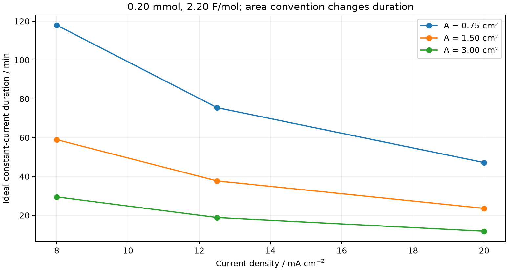
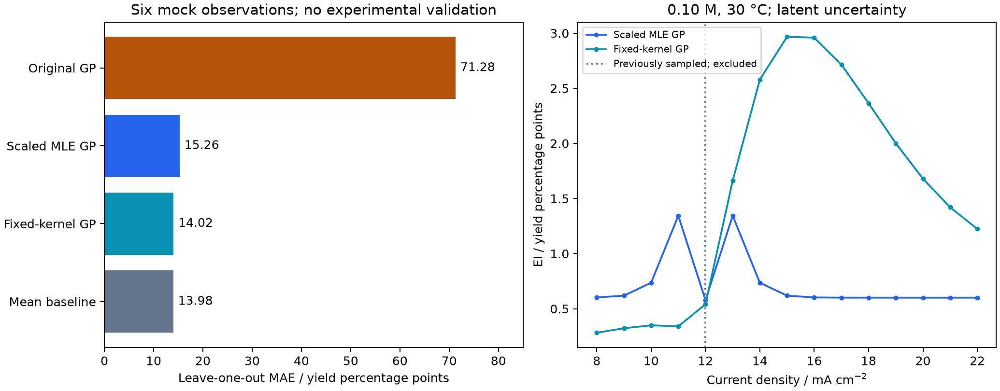
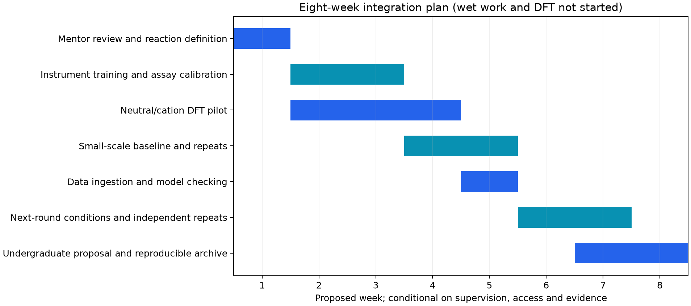

# Closed-Loop AI4S Report: Integrating Data-Driven Optimization with Wet-Lab Execution & Quantum Mechanical Modeling

Academic technical report · 2026-09-28 · Separate English edition

## 1. Executive Summary & Paradigm Shift

### 1.1 Abstract and evidence standard

This study executes the supplied three-module platform and audits the proposed transition from molecular computation to an experimental feedback loop. The original program completed, produced a stoichiometric card and two quantum input files, and fitted a Gaussian process (GP) to six hardcoded yield labels. Additional work comprises 81 scale/volume/area/current scenarios, eight partner-loading calculations, four conditional Faradaic-efficiency balances, 24 leave-one-out prediction records, 270 candidate predictions, nine acquisition sensitivity scenarios, a 200,000-draw EI check, and 12 reviewed quantum input files. The three requested modules are retained throughout this report.

The resulting deliverable is a reproducible **planning and software-verification package**. No electrolysis, HPLC measurement, isolation, Gaussian calculation or ORCA calculation was performed. The six values described as laboratory yields in the source are mock data. The defined wet-lab substrate and the original quantum target are different molecules. The missing product, partner loading and analytical calibration prevent the proposed card from becoming a validated operating procedure. These limitations are results of the audit, not omissions concealed by successful execution.

Evidence labels are [L] verified literature/documentation; [S] supplied assumptions or mock data; [A] arithmetic and numerical audit executed here; [M] conditional model inference; [Q] previously executed quantum calculations reused as starting geometries; [P] proposed work; and [U] unresolved information. In particular, [Q] denotes GFN2-xTB in this release, never DFT. A software status such as `model_recalibrated` is not evidence of reaction discovery.

### 1.2 What closes the scientific loop

Bridging in-silico design to a physical bench matters because only traceable measurements can determine whether a chemical hypothesis survives contact with the real system. A defensible loop records molecular identity and conditions, predicts an outcome, executes a defined experiment, quantifies it against a calibration, preserves the raw measurement, and updates a model using that evidence. The present work completes the bookkeeping, input preparation, mock ingestion and model-analysis stages. The experimental and DFT stages remain proposed.

Automated stoichiometry removes repeated unit conversion while retaining the electrode-area convention; input generation removes repeated coordinate and charge/spin transcription while keeping molecule identity explicit; evidence-linked CSV ingestion makes subsequent model updates inspectable. These conveniences reduce clerical work, but neither establish the reaction mechanism nor guarantee a useful acquisition policy. The GP audit actually finds no MAE advantage over the simple mean baseline on these six labels.

### 1.3 Provenance and corrections to the source claims

The [supplied specification](../source/specification.md) and [extracted script](../source/run_closed_loop_platform.py) are retained. Only line endings and a final newline were normalized during extraction; source logic was not changed. The executable SHA256 is `37ff41ed272eb5f07094e5801c5837a2c39f4c350cc7731c034c147a35156b9a`. The [execution record](../results/original/execution.json), logs and [original JSON](../results/original/closed_loop_results.json) document this run. New calculations occupy separate files; all reported tables below are populated from their saved outputs.

| Source claim | Audited status |
| --- | --- |
| Wet-lab feedback is experimental | Six hardcoded mock labels; no raw assay files |
| MAE is cross-validation | 2.883333 pp is a direct label comparison; LOO is computed separately |
| Acquisition is EI | Source uses UCB; extension implements analytic EI |
| Shared DFT target and method | Indoline differs from target indole; source ORCA uses CPCM |
| Ready-to-run SOP | Partner equivalents, product, quench and assay are unspecified |
| Computed DFT energies | Input files only; no DFT executed |

## 2. Standardized Wet-Lab Operating Protocol (SOP)

### 2.1 Reaction definition and 0.20 mmol dispensing card

[S/A] The substrate SMILES `COc1ccc2[nH]c(cc2c1)c3ccccc3` corresponds to 5-methoxy-2-phenyl-1H-indole, formula C15H13NO, calculated molecular weight 223.275 g/mol. The supplied partner SMILES `CSc1ccccc1` denotes thioanisole, not thiophenol. Its argument is unused by the original dispensing function. A product structure and balanced transformation are not supplied; therefore neither partner identity for the intended chemistry nor its equivalents can be inferred from the title “oxidative C–H functionalization.”

| Material | mmol | mg | mL | Definition |
| --- | --- | --- | --- | --- |
| Target indole | 0.200 | 44.655 | N/A | 1.00 equivalent; 0.033333 M nominal |
| nBu4NPF6 | 0.600 | 232.458 | N/A | 0.100 M |
| MeCN | unknown | unknown | 4.800 | 80.0% v/v of nominal solvent |
| HFIP | unknown | unknown | 1.200 | 20.0% v/v of nominal solvent |
| Coupling partner | unknown | unknown | unknown | Identity and equivalents unresolved |

Masses are nominal neat-material values and should be adjusted for an independently recorded assay/purity if needed. Solvent masses and mmol are intentionally unknown because density, temperature and grade were not supplied. No additive or internal-standard amount is invented. The total liquid volume is a nominal dispensed-solvent volume; dissolution volume changes are not characterized. The corrected generator calculates the 4:1 volumes from the chosen total instead of repeating the source's fixed 4.8/1.2 mL text.

For planning only, the following scenarios quantify the cost of the partner ambiguity; they do not select a reagent or establish reactive equivalents. Liquid dispensing requires verified density and purity before conversion from mass to volume.

| Scenario reagent | Assumed equivalents | mmol | mg |
| --- | --- | --- | --- |
| thioanisole | 0.50 | 0.100 | 12.421 |
| thioanisole | 1.00 | 0.200 | 24.842 |
| thioanisole | 1.50 | 0.300 | 37.262 |
| thioanisole | 2.00 | 0.400 | 49.683 |
| thiophenol | 0.50 | 0.100 | 11.018 |
| thiophenol | 1.00 | 0.200 | 22.036 |
| thiophenol | 1.50 | 0.300 | 33.054 |
| thiophenol | 2.00 | 0.400 | 44.072 |

### 2.2 Electrical configuration and dimensional derivation

[S] The source proposes a 10 mL undivided three-neck cell, platinum cathode and platinum anode, constant-current electrolysis (CCE), 1.50 cm² anode area, 12.50 mA/cm² and 2.20 F/mol. The alternative carbon rod has neither defined exposed area nor equivalent surface chemistry; it is not an interchangeable geometry. The quoted 1.0 × 1.5 cm plate area could refer to one face, while both faces and edges may be wetted. Record the exact area convention, masking and immersion depth before using a current density. The 12.50 value is a supplied assumption, not a verified link to an earlier Pareto optimum.

For substrate amount n, charge factor z_app and Faraday constant F = 96485.33 C/mol:

$$
I=jA=12.50\times1.50=18.75\ {\rm mA},\qquad Q=nz_{\rm app}F=0.00020\times2.20\times96485.33=42.4535452\ {\rm C}.
$$

$$
t=\frac{Q}{I}=2264.189077\ {\rm s}=37.7364846\ {\rm min}.
$$

The rounded source card reports 42.5 C and 37.7 min. Prefer the integrated measured charge as the stopping criterion; the time assumes uninterrupted, exactly constant current. A 1,001-node independent constant-current integration reproduces Q to floating-point precision. Current interruptions, compliance limits and changing cell voltage require the actual time/current/voltage log. A cell voltage and product identity are missing, so no measured energy consumption, isolated yield or product-specific kWh/kg is calculated.

### 2.3 Charge balance and sensitivity calculations

[A/P] For a hypothetical net two-electron product, n_product = Q·FE/(2F). At FE = 100%, the passed charge could generate 0.220 mmol product, exceeding the available 0.200 mmol substrate. Consequently complete substrate-to-product conversion would correspond to at most 90.9091% FE at 2.20 F/mol, assuming this stoichiometry. The excess charge does not prove that either conversion or selectivity will be high. FE and analytical yield are distinct quantities.

| Assumed yield / % | Product / mmol | FE / % |
| --- | --- | --- |
| 25.0 | 0.050 | 22.7273 |
| 50.0 | 0.100 | 45.4545 |
| 75.0 | 0.150 | 68.1818 |
| 100.0 | 0.200 | 90.9091 |

The 81-row [parameter sweep](../results/audit/stoichiometry_sweep.csv) spans scale 0.10/0.20/0.50 mmol, volume 3.0/6.0/12.0 mL, area 0.75/1.50/3.00 cm² and j = 8.0/12.5/20.0 mA/cm². Volume changes electrolyte mass and substrate concentration; area changes current and duration. These arithmetic scenarios do not preserve mass transport, electrode spacing or reaction similarity. In particular, doubling the area to 3.00 cm² at fixed j halves the nominal duration to 18.8682 min.



### 2.4 Workup and chromatography: source proposal with unresolved compatibility

[S/P/U] The following preserves the requested step sequence and numerical gradient. It is a **provisional source-derived workup**, not an experimentally verified isolation method. The source provides no product identity, quench compatibility, TLC retention, silica loading, fraction analysis or recovery. These missing facts must be resolved with the supervising chemist before applying the sequence to a reaction.

1. Stop the current at the target integrated charge, nominally 42.4535 C; retain the time/current/voltage trace.
2. The source proposes 10 mL saturated aqueous Na2S2O3/NaHCO3. The slash does not specify separate solutions, a mixture, concentrations or order. A validated quench composition and compatibility are required; none is inferred here. Six mL reaction liquid plus ten mL quench exceeds a 10 mL nominal cell, so any approved workup needs a separately specified vessel with appropriate capacity.
3. The source proposes ethyl acetate extraction, three portions of 15 mL, after an appropriate quench and phase separation. MeCN/HFIP partitioning and emulsion formation are unknown; layer identity must be established rather than inferred from a generic recipe.
4. It then proposes a 15 mL brine wash of the combined organic extracts, followed by anhydrous Na2SO4. Drying-agent loading and contact time are unspecified.
5. It proposes filtration and reduced-pressure solvent removal. Product stability and evaporation settings remain unspecified.
6. It proposes silica flash chromatography with petroleum ether/ethyl acetate 15:1 progressing to 8:1 by volume. This corresponds to ethyl acetate fractions of 6.25% and 11.11%. Petroleum ether boiling range, gradient volume, column dimensions and product fractions are unknown; determine them using validated analytical observations and report isolated mass and purity separately from HPLC yield.

This section fulfills the requested numerical and procedural documentation while retaining the fields that the source cannot justify. A fabricated partner loading or quench formulation would give the appearance of completeness without a chemically defined experiment.

### 2.5 Bench record and release conditions

[P] A usable bench record must connect one run ID to the product and reactant structures; reagent lots, purity and mass; solvent composition; cell and electrode materials; one-face or total-wetted area; electrode spacing; current and charge trace; measured temperature and stirring; sampling and quench; HPLC calibration and raw chromatograms; and isolated-product identity. The current card does not specify a reaction temperature, stirring rate or gap. The mock-learning candidate at 30 °C is not evidence that the default SOP was calibrated there. The [arithmetic audit](../results/audit/stoichiometry.json) therefore records `ready_for_wet_lab: false` with explicit missing fields.

## 3. Computational Chemistry & DFT Integration

### 3.1 Molecular identity, charge and spin

[A] The source DFT default `c1ccc2c(c1)CCN2` is indoline (C8H9N), whereas the dispensing card concerns C15H13NO. A one-electron oxidation of a closed-shell neutral molecule removes one electron without changing nuclear composition: M → M⁺ + e⁻. The lowest-spin candidate then has S = 1/2 and multiplicity 2S+1 = 2; net charge is +1. This electron bookkeeping motivates the input state, not a demonstrated reactive intermediate or ground-state assignment.

| Molecule | Formula | State | Charge | Multiplicity | Electrons | Atoms |
| --- | --- | --- | --- | --- | --- | --- |
| target_indole | C15H13NO | neutral | 0 | 1 | 118 | 30 |
| target_indole | C15H13NO | cation | 1 | 2 | 117 | 30 |
| indoline_control | C8H9N | neutral | 0 | 1 | 64 | 18 |
| indoline_control | C8H9N | cation | 1 | 2 | 63 | 18 |

A doublet has an ideal spin expectation S(S+1) = 0.75. An unrestricted calculation allows distinct alpha and beta orbitals, but may have spin contamination or an unstable SCF solution. Eventual outputs require spin and wavefunction review, alongside convergence. Neutral singlet partners are included because an isolated cation energy cannot supply an oxidation free-energy difference.

### 3.2 Coordinate provenance and actual files

[Q/A/P] The reviewed set contains four Gaussian `.gjf` files with two steps each and eight ORCA `.inp` files with separated optimization and refinement steps: two molecules × two charge states. Their two starting XYZ geometries reuse previously completed neutral GFN2-xTB/ALPB(MeCN) optimizations from this repository. SHA256 identity checks precede reuse; atom counts, atom order, finite coordinates and interatomic distances are checked. No new xTB job is claimed. Neutral and cation inputs begin at the same neutral geometry and request independent DFT relaxation.

The [input manifest](../inputs/reviewed/input_manifest.json) maps every file to charge, multiplicity, electron count, geometry provenance and hash. See the [input guide](../inputs/reviewed/README.md). Representative files are [target cation Gaussian](../inputs/reviewed/target_indole_cation.gjf), [target cation ORCA optimization](../inputs/reviewed/target_indole_cation_opt.inp), and [ORCA refinement](../inputs/reviewed/target_indole_cation_sp.inp). Original indoline files remain under `results/original/dft_inputs` for comparison.

### 3.3 Method choice, solvation and engine differences

[L/P] The requested UB3LYP-D3(BJ)/def2-SVP level provides a relatively modest proposed optimization/frequency model for the radical cation; neutral partners use the restricted form. Dispersion correction and an implicit polar solvent address selected interactions absent from a bare gas-phase calculation. The UM06-2X/def2-TZVP single point changes functional and increases basis flexibility for an energy comparison at the optimized geometry. It does not reoptimize that geometry or prove greater accuracy for these radicals. No D3(BJ) term is automatically appended to M06-2X in this protocol. Gaussian keywords are described in the [official DFT reference](https://gaussian.com/dft/).

The original Gaussian file requests SMD(MeCN), but the original ORCA line requests only CPCM(acetonitrile); the shared JSON model label is therefore inaccurate. Reviewed ORCA 6.1 files explicitly set `smd true` and `SMDsolvent "acetonitrile"` in `%cpcm`. The ORCA implementation supports this distinction ([official solvation manual](https://www.faccts.de/docs/orca/6.1/manual/contents/essentialelements/solvationmodels.html)); Gaussian SMD is specified through SCRF ([official reference](https://gaussian.com/scrf/)). ORCA `B3LYP/G` selects Gaussian-style VWN3 correlation ([functional definitions](https://www.faccts.de/docs/orca/6.1/manual/contents/modelchemistries/DensityFunctionalTheory.html)). Grids, RIJCOSX and continuum implementations still differ between engines, so identical energies are not assumed.

The proposed bench solvent is MeCN/HFIP 4:1, while the input model is pure-MeCN SMD. This is an explicit approximation: specific HFIP hydrogen bonding, counterions, electrode fields, potential control and interfacial charge transfer are not represented. A later solvent/explicit-cluster sensitivity study is needed if those effects control the claimed chemistry.

### 3.4 Resource configuration and dependent jobs

[A/P] The original Gaussian input requests 16 processors and 32 GB memory. Original ORCA `%maxcore 2000` with 16 processes implies nominal 32,000 MB plus overhead because maxcore is per process ([official memory guide](https://www.faccts.de/docs/orca/6.1/tutorials/first_steps/memory.html)). These settings exceed the approximately 16 GB host and are unsuitable for automatic local execution. The checked PATH exposed neither g16 nor orca; no engine was launched, and this check does not establish that no installation exists elsewhere.

Reviewed files request two CPU processes, Gaussian 3 GB total or ORCA 1,000 MB per process. A 4 GB scheduler allocation for one job is a proposed pilot starting point, not a measured memory guarantee. A licensed/configured engine and adequate available RAM are still required. Gaussian Link1 reads its checkpoint; ORCA SP files depend on newly produced `*_opt.xyz` coordinates and must follow successful optimization and frequency inspection. Those optimized DFT files do not yet exist. Generated input syntax has been reviewed against documentation and structural checks, but has not passed an engine parser or convergence test.

### 3.5 What an eventual calculation could establish

[P] For each neutral/cation pair, retain converged geometries, electronic energies, harmonic frequencies, thermal corrections and spin diagnostics at stated temperature and standard state. A composite estimate may use G_comp = E_SP + (G_low − E_low), provided the thermal correction and solvation conventions are internally consistent and not double-counted. Soft modes, conformer populations and alternate SCF solutions require assessment. Significant imaginary frequencies invalidate an assumed minimum unless resolved.

An adiabatic oxidation free-energy difference further requires a defined electron/reference-electrode convention and consistent standard states; a calibrated reference couple should be treated at the same protocol. No oxidation potential in volts is reported here. Neither these input files nor a future vertical ionization energy alone establishes a transition state, reaction rate, C3 selectivity or the identity of the electrode-generated species.

## 4. Active Learning Feedback & Model Evolution

### 4.1 Provenance of the six feedback rows

[S/A] All labels below are hardcoded in the supplied script. The saved [mock feedback CSV](../data/mock_feedback.csv) marks every row as mock and leaves chromatogram, calibration and reaction-identity fields empty. “HPLC” in the source comment is not a measurement record. In particular, no evidence links these six labels to the wet-lab substrate in Section 2.

| Run | j / mA cm⁻² | c / M | T / °C | Given prediction / % | Mock label / % |
| --- | --- | --- | --- | --- | --- |
| mock-01 | 8.0 | 0.050 | 25.0 | 62.0 | 58.5 |
| mock-02 | 15.0 | 0.050 | 25.0 | 78.5 | 81.2 |
| mock-03 | 10.0 | 0.150 | 40.0 | 71.0 | 69.4 |
| mock-04 | 20.0 | 0.150 | 25.0 | 84.0 | 79.8 |
| mock-05 | 25.0 | 0.200 | 50.0 | 55.0 | 51.2 |
| mock-06 | 12.0 | 0.100 | 30.0 | 86.5 | 88.0 |

The direct comparison gives MAE = (3.5 + 2.7 + 1.6 + 4.2 + 3.8 + 1.5)/6 = 2.883333 percentage points, reported as 2.88 in the source. This is a discrepancy between given prior predictions and given mock labels. It does not involve held-out fitting and is not cross-validation loss.

### 4.2 Independent leave-one-out assessment

[A/M] Each of six folds holds out one row and fits only the other five. Feature standardization and target normalization are recomputed within each training fold. The original GP uses its source Matérn-plus-white kernel and unnormalized target. The scaled MLE GP adds a fitted signal amplitude, standardizes all three features, normalizes y, and fits scalar length scale and noise by marginal likelihood with two restarts. The fixed-kernel sensitivity model uses standardized features, unit amplitude/length scale, Matérn 5/2 and an assumed 2-percentage-point observation SD. The mean baseline predicts the training mean. Hyperparameters were not tuned on held-out errors; the full fold records are retained.

| Method | MAE / pp | RMSE / pp |
| --- | --- | --- |
| Original GP | 71.2820 | 72.4649 |
| Scaled MLE GP | 15.2560 | 17.1483 |
| Fixed-kernel GP | 14.0159 | 15.6392 |
| Training-mean baseline | 13.9800 | 15.6506 |

The original full-data kernel drives its length scale to 100,000 and inferred noise variance to about 5,250.30 pp² while using unit signal amplitude. Its almost-zero mean and 72.47 pp predictive SD expose poor scaling and prior specification. The scaled model repairs those numerical pathologies but does **not** beat the mean baseline in MAE. Fixed-kernel RMSE is slightly lower than baseline, while its MAE is slightly higher; six dependent leave-one-out errors do not support a general superiority claim. No random train/test split can manufacture additional independent chemical information here. Future real evaluation needs repeated assays and condition- or time-held-out validation.

### 4.3 EI, UCB and uncertainty definitions

[L/A] The source computes μ + 2.5σ, which is UCB. Its intermediate improvement and Z variables do not turn that score into Expected Improvement. For maximization, the implemented analytic one-point EI is

$$
\Delta=\mu-f_{\rm best}-\xi,\quad z=\Delta/\sigma_f,\quad EI=\Delta\Phi(z)+\sigma_f\phi(z),\quad UCB=\mu+\kappa\sigma_f.
$$

At zero variance, EI reduces to max(Δ,0). Larger mean supports exploitation; greater function uncertainty can support exploration. UCB uses κ = 2.5 here; EI uses ξ = 0 by default. This formula follows the [BoTorch acquisition documentation](https://botorch.org/docs/acquisition). We compute it with SciPy, without claiming to have executed BoTorch optimization.

The GP's WhiteKernel contributes observation-noise variance to predictive variance. We retain both and use σ_f² = max(σ_observation² − σ_noise²,0) after restoring target units for the revised acquisition. The original source UCB uses observation SD; that original result is preserved. The [scikit-learn GPR API](https://scikit-learn.org/stable/modules/generated/sklearn.gaussian_process.GaussianProcessRegressor.html) describes target normalization and predictive uncertainty. EI here plugs in the largest observed label, 88%; it is not noise-integrated EI and does not resolve uncertainty in the incumbent. The 200,000-draw check gives 1.339844 ± 0.008071 pp Monte Carlo standard error versus analytic 1.344386 pp at the selected scaled-MLE point.

### 4.4 Round 2 candidates and sensitivity

[M/P] The pool contains 90 conditions: j = 8–22 mA/cm² in unit increments, electrolyte concentration 0.08/0.10/0.12 M, and temperature 25/30 °C. One previously sampled point is excluded, leaving 89 unseen candidates. Only 31 of the original 90 lie inside the training convex hull; a bounding box alone is not interpolation support. The following are conditional rankings on mock labels, not qualified bench recommendations.

| Policy | j / mA cm⁻² | c / M | T / °C | μ / % | σ / pp (latent unless stated) |
| --- | --- | --- | --- | --- | --- |
| Source UCB (observation SD) | 15.00 | 0.080 | 30.0 | 0.0800 | 72.4700 |
| Scaled MLE EI | 13.00 | 0.100 | 30.0 | 78.3720 | 11.6784 |
| Fixed-kernel EI | 15.00 | 0.100 | 30.0 | 88.5049 | 6.7860 |
| Fixed-kernel UCB | 18.00 | 0.100 | 30.0 | 84.5275 | 9.6600 |

The revised default EI and latent-UCB both select 13.00 mA/cm², 0.100 M and 30.0 °C, with predicted mean 78.3720% and latent SD 11.6784 pp. A fixed-kernel EI policy instead selects 15.00 mA/cm²; its UCB selects 18.00. Across the nine fixed-kernel noise/ξ scenarios, the EI choice changes between 15.00 and 16.00 mA/cm². Such sensitivity must remain visible rather than presenting one grid point as a discovered optimum. An unbounded Gaussian posterior can extend beyond 0–100%; a UCB above 100 is an acquisition score, not a physically possible yield.

The scaled-MLE runner-up at 11.00 mA/cm², 0.100 M and 30.0 °C has EI 1.344373 pp, only 0.00001312 pp below the reported maximum. This nearly symmetric ranking around the sampled 12.00 point provides no meaningful scientific preference for 13.00 over 11.00.

The saved top-five rankings are not a jointly optimized experimental batch. Closely spaced points may be redundant. Once real assay variance is known, a subsequent batch should include an incumbent replicate, an exploratory point and a predeclared comparator, with a suitable joint or sequential-fantasy acquisition and balanced execution order. Those experiments have not been selected or run here.



### 4.5 Evidence-linked ingestion and practical update cycle

[A/P] The extension accepts a CSV through `--feedback` and an explicit `--role`. Mock and experimental rows cannot be mixed; duplicate run IDs, nonfinite values, yields outside 0–100%, invalid temperature units and inconsistent reaction identity are rejected. Experimental mode additionally requires valid substrate/partner/product SMILES, operator/time fields, HPLC metadata and local raw-assay, calibration and electrolysis files whose SHA256 hashes match. Files must resolve within the feedback directory. These checks establish linkage and basic consistency, not the truth of a chromatogram or the adequacy of calibration.

After a supervised run, archive immutable raw files, transcribe one record per independent experiment, document exclusions and failed runs, run ingestion, inspect held-out error and uncertainty, then review the proposed condition before scheduling the next experiment. Independent replicate IDs are allowed even at identical conditions. The present CSV model does not estimate batch effects or heteroscedastic noise; failed chemistry must not be silently dropped or converted from “unmeasured” into zero yield. Reports are rebuilt explicitly from saved results, and no autonomous hardware control or laboratory scheduling occurs.

### 4.6 Reproduction and computational extent

From the repository root in an existing environment with the recorded packages and numerical DLLs available:

```powershell
python closed_loop/scripts/run_original.py
python closed_loop/scripts/audit_closed_loop.py --output work/closed-loop-audit
python closed_loop/scripts/generate_reviewed_inputs.py --output work/closed-loop-inputs
python -m unittest discover -s tests -v
python closed_loop/scripts/validate_closed_loop.py
```

The first command intentionally refreshes the archived original run and its timing; it never launches the generated quantum inputs. Use a separate checkout if preserving release bytes. The audit defaults to the mock CSV; experimental mode requires `--feedback path/to/records.csv --role experimental`. It writes model outputs to the explicitly selected destination. The reviewed generator reads hash-verified prior geometries from this repository. Numerical versions are stored in [audit_summary.json](../results/audit/audit_summary.json). No packages were installed for this work. Timing and floating-point ties may vary by platform; original near-flat UCB rankings in particular have negligible numerical separation.

## 5. Execution Gantt & Laboratory Integration Plan

### 5.1 Conditional eight-week Gantt

[P] The intended audience is the Pan–Tang group named in the supplied brief. Bench access, instrument availability, group priorities and compute allocation have not been independently confirmed. The sequence below is a proposal beginning only after a supervisor accepts a defined research question and local training requirements.



| Proposed week | Responsible role | Output required before advancing |
| --- | --- | --- |
| 1 | Supervisor and student | Define product, partner and an explicit chemical question |
| 2–3 | Trained mentor and student | Instrument training; assay calibration; confirm reagent and cell compatibility |
| 2–4 | Computational mentor | Run one paired DFT pilot; inspect convergence/frequencies/spin |
| 4–5 | Supervised bench team | Baseline and independent repeats; archive full raw data |
| 5 | Student with mentor review | Validate linked feedback, LOO and baseline comparison |
| 6–7 | Bench and analysis team | Predeclare next candidates; repeat comparator; evaluate held-out outcomes |
| 7–8 | Student and supervisor | Evidence-limited undergraduate proposal and versioned release |

### 5.2 A concrete undergraduate presentation to Prof. Haitao Tang

[P] A freshman or sophomore can bring a compact dossier: one page defining the intended transformation and unresolved partner/product; the 0.20 mmol charge card; a figure exposing the difference between given MAE and held-out error; the paired neutral/cation inputs; and the reproducible repository. In a proposed ten-minute discussion, spend two minutes on the chemical question, three on the evidence and missing fields, two on the numerical checks, and three on a bounded pilot request. Explain the negative baseline result openly; it establishes a measurable modeling problem rather than a claim of an already intelligent laboratory.

A suitable request is supervised access to one compatible electrochemical station for a small pilot, a named graduate-student mentor, help selecting and calibrating an analytical method, and a short CPU allocation for one neutral/cation pair. The current calculations need no GPU. Ask for a GPU allocation only if a later, explicitly specified model and workload require it. Report actual wall time and memory from the first DFT jobs before estimating a larger budget. These are discussion materials, not a promise that space or funding will be granted; no message has been sent to any faculty member.

### 5.3 Acceptance criteria and undergraduate project scope

[P] The first deliverable is a fully defined reaction and assay, not a target yield invented in advance. The next is at least one supervised baseline with identifiable product and an independent repeat sufficient to begin estimating variability. Failed outcomes and unresolved identification remain in the record. A modeling milestone requires predeclared conditions held out from fitting and comparison with a simple baseline; improvement must exceed relevant measurement uncertainty. A quantum milestone requires converged paired states with documented frequency/spin diagnostics and sensitivity checks, not just `.gjf`/`.inp` file counts.

For an undergraduate innovation proposal, frame the work as a traceable electrosynthesis data and computation workflow with a bounded case study. Distinguish milestones that the student can execute independently—unit checks, provenance, literature reading, data entry and reproducibility—from chemical interpretation, instrument operation and computational-method review that require trained supervision. A journal quartile or an eventual high yield is not an acceptance criterion for this software package. Publication-level methodology would additionally require verified novelty, substrate scope, controls, selectivity, reproducibility, mechanistic evidence and an appropriate uncertainty analysis.

### 5.4 Delivery map and literature basis

The [closed-loop README](../README.md) indexes raw source output, the numerical audit, reviewed input files, data schema, figures and tests. The [publication validation record](../results/publication_validation.json) checks saved structure and numerical consistency; the repository-wide manifest links the release bytes. Such tests do not certify experimental reproducibility or chemical accuracy.

Primary technical references, checked 2026-09-28: [Gaussian DFT](https://gaussian.com/dft/), [Gaussian SCRF/SMD](https://gaussian.com/scrf/), [ORCA 6.1 solvation](https://www.faccts.de/docs/orca/6.1/manual/contents/essentialelements/solvationmodels.html), [ORCA 6.1 functional definitions](https://www.faccts.de/docs/orca/6.1/manual/contents/modelchemistries/DensityFunctionalTheory.html), [ORCA memory settings](https://www.faccts.de/docs/orca/6.1/tutorials/first_steps/memory.html), [scikit-learn GPR](https://scikit-learn.org/stable/modules/generated/sklearn.gaussian_process.GaussianProcessRegressor.html), and [BoTorch acquisition functions](https://botorch.org/docs/acquisition). The user's specification supplies the provisional reaction assumptions and mock labels; it is not a primary experimental reference for their chemical validity.
