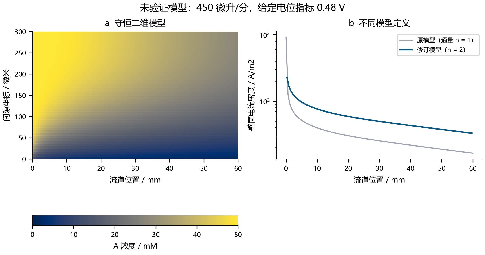
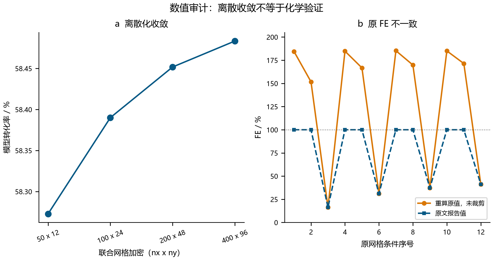
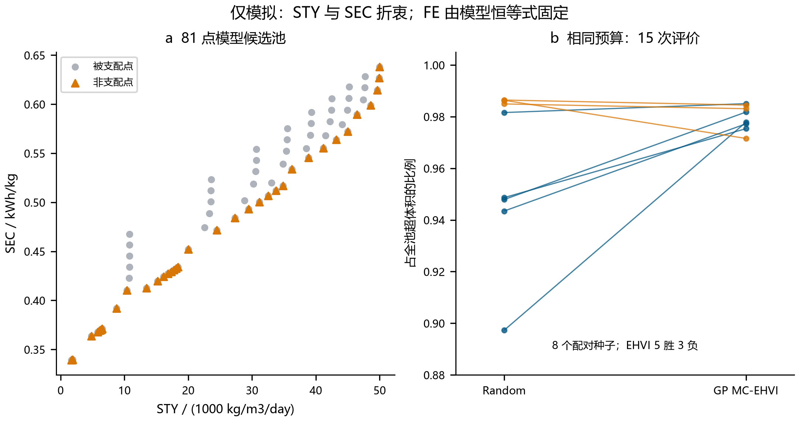

# ElectraTwin-OS：守恒输运、经审计的工艺指标与序贯数值模拟

**完整中文技术报告 · 2026 年 9 月 28 日**

本次工作将用户提供的 ElectraTwin 程序转化为可复现的科研数值演示：保留原程序失败及仅兼容修复后的输出，另行建立守恒输运求解器、具有明确边界的指标计算、有限候选池序贯优化、水力与电功率热升情景，以及本地仪器状态模拟器。修订模型在所声明假设下给出基准转化率 58.3872859%、电流 42.2513750 mA。这些数值属于已执行计算，尚不是实测化学性能。本次没有进行湿实验、连接真实仪器、执行 DFT 计算、获得工业认定或提交申报书。

全文区分五种证据：**原文声明**只归档而不直接采信；**已执行计算**是可复现的软件结果；**数值验证**检验方程、单位和算法；**文献事实**连接可访问的原始来源；**物理验证**目前缺失。JSON 保留较多有效数字是为了复核，不能解释成相同位数的预测精度。[来源访问记录](../results/sources.json)区分了已打开正文的来源与只能读取出版社索引摘要或片段的来源。

## 1. 工作范围、原程序执行与科学审计

### 1.1 原始输入保留与有界执行

[用户原始说明](../source/specification.md)、[提取的 Python 程序](../source/electratwin_core.py)、文件哈希及[兼容补丁](../source/numpy_compatibility.patch)均单独归档，不与修订实现混为一体。Python 提取过程仅统一换行并补充末尾换行，不改变科学逻辑。原文中的课题组定位及作者署名未经确认；将它们保存在仓库中，不代表已经获得单位认可或相关人员参与。

原程序执行约 6.10 s 后以退出码 1 结束，原因是当前 NumPy 2.4.6 已移除 `np.trapz`。单独保存的兼容副本只将这一处调用替换为 `np.trapezoid`，该替换有 [NumPy 官方发布说明](https://numpy.org/doc/2.4/release/2.4.0-notes.html)依据。兼容副本约 52.21 s 后完成，计时覆盖单案例、十二个网格案例、图形与结果导出。这只是本机实际运行时间，不是工业实时性保证。计算复用了已有 CPU 科学环境，没有重新安装软件包。原始与兼容执行的标准输出、错误输出、退出状态及耗时分别保留在对应结果目录。

运行包装器在兼容程序主流程结束后，额外捕获其浓度数组与优化历史，不会静默修改动力学、电子计量、通量积分或优化算法。因此，原始图形及 JSON 中存在的问题被保留供审计，不能作为经审核的科学结论直接使用。

### 1.2 原模型的守恒与效率问题

原程序展示的控制方程含轴向和横向扩散，实际离散却只有轴向迎风对流与横向扩散。它将相邻迭代解的变化称为残差，并始终返回 `converged=True`，包括达到迭代上限的情况。原程序还将转化率截断到 0–99.9%，将 FE 截断到 0–100%。这些操作会掩盖不一致，而不是解释或修复不一致。

其 100 × 45 单案例的未舍入混杯平均转化率为 60.0353608623%，积分电流为 24.9750174353 mA。入口阳极角点保留入口浓度，没有执行下游相同的反应边界，却被纳入电极电流梯形积分；该点贡献占积分电流的 13.28363283%。按照原边界的一电子计量，将电流换算的消耗量与入口—出口分子通量比较，得到 **+15.03513433% 的差异**。相邻迭代变化很小不能证明物料守恒。

| 原程序审计量 | 数值 |
|---|---:|
| 原程序报告转化率，% | 60.04 |
| 原程序报告电流，mA | 24.98 |
| 原程序迭代次数 | 973 |
| 原程序迭代更新范数 | 9.989432e-6 |
| 电流与物料通量差异，% | 15.03513433 |
| 入口角点占电流比例，% | 13.28363283 |
| 网格评价次数 | 12 |
| 超过 100% 后被截断的 FE 数量 | 8 |
| 最大重建 FE，% | 185.24213191 |
| 所选折中点重建 FE，% | 171.43077675 |

原壁面使用电流除以 F 表示消耗量，下游绿色指标却默认每个产物分子转移两个电子。十二个案例中有八个 FE 在截断前大于 100%。原程序选出的 1200 µL/min、η = 0.45 V 折中点打印 FE = 100%，但依照其传给指标函数的数值重算，结果为 171.43077675%。因此，对应 STY 和电耗不能被提升为经过验证的操作建议。[原程序审计 JSON](../results/source_audit.json)保留了全部十二行重建值与独立残差计算。

### 1.3 “工业级”和“自主优化”的证据范围

原规划器运行固定的四乘三笛卡尔网格。使用轻量替代求解器检查参数语义时，预算参数取 0、1、7 或 12，均产生十二次评价。它没有拟合代理模型，没有预测不确定度，也没有计算期望超体积改进。其二维超体积函数通过了一个可手算的矩形并集例子，但这个局部正确性不等于贝叶斯优化。程序也只是导入 RDKit，没有实际处理分子结构或分子图。

连续流微通道是有价值的放大方案，但“唯一工业路径”缺少依据。一篇 [OPRD 原始研究](https://pubs.acs.org/doi/10.1021/acs.oprd.3c00255)报告了可在间歇与流动方式下运行的旋转圆柱电极反应器。这为排他性说法提供反例，但不构成本项目反应器具备制造资质的证明。本次可访问出版社索引中的摘要和文章片段，未完成全文与支持信息审阅。附件本身并未建立已确认的工业合作方、实体实验装置或经过验证的化学体系。

## 2. 守恒输运模型与数值验证

### 2.1 控制假设与边界条件

修订模型在给定的不可压缩 Poiseuille 速度场中，求解抽象物种 A 与 P 的稳态、等温输运：

\[
\nabla\cdot(\mathbf u C_s-D\nabla C_s)=0,\qquad s\in\{A,P\}.
\]

相同扩散系数与一比一分子转化假设给出 \(C_A+C_P=C_T\)，总量由入口组成固定。因此只需求解一个线性浓度系统，再重建另一物种。这是模型定义所导致的恒等关系，不是独立观测。它**不能证明真实偶联反应的元素或全组分质量平衡**，尤其不能忽略不同分子量及额外反应物。模型没有描述偶联组分消耗、质子、支持电解质、气体或副产物。

入口采用 Danckwerts 条件，指定进入体系的总通量 \(uC_{in}\)。出口轴向扩散通量为零，并允许对流离开；上壁面无物种通量。默认计算包含轴向扩散。轴向扩散不可忽略时，此入口与固定浓度边界不同，是有意声明的模型选择。下壁面满足

\[
J=k_fC_{A,w}-k_rC_{P,w},\qquad j=nFJ,
\]

考虑首层网格中心到壁面的半网格扩散阻力后，有

\[
J=\frac{(k_f+k_r)C_{A,c}-k_rC_T}
{1+(k_f+k_r)\Delta y/(2D)},\qquad
C_{A,w}=C_{A,c}-J\Delta y/(2D).
\]

物料方程和电流积分使用完全相同的壁面通量。相邻控制体共享内部面通量，全域求和时内部交换项相消。Poiseuille 速度在每个横向条带上积分，使离散体积流量在不同网格下均等于给定 Q。单元中心有限体积组装采用一阶迎风对流、中心扩散与稀疏直接求解，与 [NIST 有限体积说明](https://www.ctcms.nist.gov/~wd15/fipy/documentation/numerical/discret.html)所述的守恒框架一致；本实现没有实际调用 FiPy。

### 2.2 有效电化学参数化

默认速率常数保留附件的有效电位依赖：

\[
k_f=\frac{j_{scale}}{nFC_{ref}}e^{\alpha F\eta/(RT)},\qquad
k_r=\frac{j_{scale}}{nFC_{ref}}e^{-(1-\alpha)F\eta/(RT)}.
\]

η 是相对某固定参考状态外加的参数指标。指数保留有效一电子形式，而 n = 2 用于将分子周转量换算成电荷。这不是热力学完整的二电子 Butler–Volmer/Nernst 模型。固定 η 时，壁面表达式对浓度是仿射线性的。模型没有求解电极或电解液电势，速率尺度与传递系数也没有通过实验标定。因此，电荷记账自洽不能被误认为机理正确。

默认输入为 L = 0.06 m、H = 0.0003 m、W = 0.012 m、D = 1.1 × 10⁻⁹ m²/s、T = 298.15 K、Q = 450 µL/min、入口 A = 50 mM、入口 P = 0、η = 0.48 V、电流尺度 = 0.08 A/m²、α = 0.5、参考浓度 = 50 mM。1 mol/m³ 等于 1 mM。反应器体积为 0.216 mL，名义停留时间为 28.8 s。输运求解未耦合温度、迁移、气体、压力、结垢或暂态场。

### 2.3 基准浓度场、网格研究与极限情况

| 修订输运量 | 数值 |
|---|---:|
| 基准网格 | 100 × 48 |
| 基准转化率，% | 58.3872858750 |
| 基准电流，mA | 42.2513750193 |
| 出口 A 浓度，mM | 20.8063570625 |
| 壁面净周转量，mol/s | 2.18952322031e-7 |
| 基准相对线性残差 | 5.834586e-15 |
| 基准进料归一化物料误差 | 1.588187e-14 |
| 基准电荷平衡误差 | 1.582164e-14 |
| 验证求解总次数 | 39 |
| 验证中最大物料误差 | 3.057068e-10 |

全部 39 次求解满足所声明的有限残差、全局平衡及浓度检查。次数包括一次基准、七次网格、十二次参数扫描、五个域内点各两种网格共十次、五次极限条件和四次解析极限对照。测试还注入无效求解器结果，以确认失败不会被强行标记为收敛。A/P 总浓度在定义上恒定，其零偏差不能算作第二项独立验证证据。

| 联合网格 | 单元数 | 转化率，% |
|---|---:|---:|
| 50 × 12 | 600 | 58.2728316193 |
| 100 × 24 | 2400 | 58.3900166910 |
| 200 × 48 | 9600 | 58.4517308193 |
| 400 × 96 | 38400 | 58.4833547496 |

最后一次联合加密使转化率变化 0.0316239302 个百分点。80 × 32 筛选网格在基准条件下比最细测试网格低 0.1270724193 个百分点。在候选域四个角点及中心的检查中，粗细网格最大差为 0.1446419170 个百分点。这五个点并不能给出所有候选或所有局部梯度的误差上界。一阶迎风引入数值扩散；在基准轴向网格上，中心线估算的数值扩散约为物理轴向扩散的 850 倍。把某物理项写入方程不等于已充分分辨它的微小作用，[NIST 数值格式说明](https://www.ctcms.nist.gov/~wd15/fipy/documentation/numerical/scheme.html)解释了这一差别。

零反应速率、零扩散与等组成平衡进料恢复了预期极限行为。只输入产物并采用负电位参数时，得到 −42.2289396144 mA 的负电流，结果被保留；由于入口 A 为零，按 A 定义的转化率记为 `null`。极限案例中约 −2.2 × 10⁻¹³ mM 的微小负浓度作为浮点舍入结果保存，并依据明确容差判定。另一独立的快速横向混合、不可逆平推流极限给出 \(X=1-e^{-k_fLW/Q}\) = 9.1535983931%。轴向加密到 320 单元时，差异减至 −0.0013167311 个百分点，符合一阶收敛趋势。上述都是数值验证，尚不是实际反应器验证。



**图 1。** a 为修订模型 100 × 48 网格浓度场；b 用对数坐标比较原程序和修订模型的电流记账。原程序壁面采用 n = 1，修订模型采用 n = 2，同时改变了其他模型与边界内容。因此该图不是同一物理模型的独立校准对照。[可编辑 SVG](figures/Fig1_Transport_Field_chinese.svg)。



**图 2。** 联合网格加密结果与原程序的未截断、已截断 FE 并列展示。数值残差很小和原 FE 被截断回答的是不同问题，需要分别解释。[可编辑 SVG](figures/Fig2_Numerical_Audit_chinese.svg)。

## 3. 工艺指标、水力估算与电功率热升情景

### 3.1 指标定义与不完整物料边界

当浓度用 mol/L、流量用 mL/min、X 和 S 分别为百分数转化率与选择性时，假定一比一产物计量有

\[
\dot n_P=C_{in}Q10^{-3}(X/100)(S/100),\quad
FE=\frac{nF\dot n_P}{60I}100\%,\quad
STY=\frac{1.44\dot n_PM_P}{V_{mL}10^{-6}}.
\]

分子量采用 g/mol，STY 的单位为 kg/(m³ day)。按反应器内生成产物计的电耗为 \(UI/(60\dot n_PM_P)\) kWh/kg，不含泵、温控、分离及溶剂回收。按分离获得产物计的电耗还需除以指定回收率。产物量或电流分母为零时，结果返回 `null` 和解释性标记，不用 9999 等任意有限数代替未定义量。

附件给出的 223.27、110.18 和 331.43 g/mol 没有对应经确认的结构或配平反应。假设一比一所得质量比为 99.3942120258%，但正式原子经济性仍记为 `null`。底物、偶联组分与溶剂只构成部分进料清单。[ACS GCI 的 PMI 定义](https://www.acs.org/green-chemistry-sustainability/green-chemistry-nexus/articles/process-mass-intensity-calculation-tool.html)要求纳入包括水在内的总物料。因此计算器仅输出声明边界内的物料强度，不填写全流程 PMI。只有采用同一闭合边界并把全部非产物输出计为废物时，减一才对应废物比；副产物回收和循环流必须另行分配核算。

### 3.2 基准算术与核算选择的敏感性

| 依赖假设的基准指标 | 数值 |
|---|---:|
| 假定电池电压，V | 3.11165043786 |
| 假定产物速率，g/min | 0.00435404208545 |
| STY，kg/(m³ day) | 29026.9472363 |
| 按反应器产物计电耗，kWh/kg | 0.503254627151 |
| 声明边界内物料强度 | 82.9580003847 |
| 声明边界内废物比 | 81.9580003847 |
| 正式原子经济性 | null |
| 全流程 PMI | null |

这些数值将修订基准结果与未标定的代数电压式 \(U=1.85+\eta+18.5I\)、假定产物分子量相结合。STY 较大部分源于用很小的反应器体积归一化，不能据此建立分离产率或长期制造能力。模型 FE 约为 100%，是因为全部电流都被分配给唯一建模反应。没有副反应和分析测定数据，就无法证明实际高选择性。

独立算术敏感性案例使用假定的 20% 转化率。将其电荷一致电流减半，而仍按二电子报告，FE 会达到 200%；程序保留并标记该值。再加入 0.005 g/min 电解质、0.5 g/min 后处理溶剂和 0.2 g/min 水，并设 80% 回收率，声明边界内物料强度由 242.1846242042 升至 893.6046701667。这体现了遗漏进料和分离损失的影响，两个情景均非实测。[敏感性结果 JSON](../results/control/metric_boundary_sensitivity.json)保存全部假设及零产物案例。

### 3.3 水力与热升计算

工程扩展以三种流量、三种通道高度、三种黏度形成 27 个水力情景，再以三种热容和三种电功率分配比例形成九个热升情景。基准密度 786 kg/m³、黏度 0.00035 Pa s、热容 2200 J/(kg K) 是所选假设，不是测得的混合物性质。计算式为

\[
D_h=\frac{2WH}{W+H},\quad Re=\frac{\rho uD_h}{\mu},\quad
Pe_H=\frac{uH}{D},\quad \tau=\frac{LWH}{Q},\quad
\Delta P=\frac{12\mu LQ}{WH^3}.
\]

压降公式假设宽平行板之间充分发展的牛顿流动，未包含入口、侧壁、管路、歧管及气体造成的额外损失。理想水力功率 \(Q\Delta P\) 不是实际泵耗电。电功率热升情景采用

\[
\Delta T_{elec}=\frac{f_hUI}{\rho Q C_p}.
\]

| 工程基准量 | 数值 |
|---|---:|
| 水力雷诺数 | 2.7386759582 |
| 间隙 Péclet 数 | 568.1818181818 |
| 长度 Péclet 数 | 113636.3636364 |
| 名义停留时间，s | 28.8 |
| 横向扩散时间尺度，s | 81.8181818182 |
| 平行板压降，Pa | 5.8333333333 |
| 理想水力功率，W | 4.375e-8 |
| 全部电功率转显热的温升，K | 10.1373667653 |
| 水力情景数 | 27 |
| 电功率热升情景数 | 9 |

较低的雷诺数估计与所假设层流区域相容。扩散时间与停留时间的比较说明有必要考虑空间输运，不能据此用“完全混合”替代空间模型。若把全部电功率分配为显热，基准温升为 10.1373667653 K；但计算未包括反应焓、空间换热和其他能量来源。因此它不是求解得到的温度场，不是实测温度，也不是严格安全上界。所有情景及来源边界均保存在[工程结果](../results/engineering/summary.json)中。

## 4. 序贯多目标基准与本地仪器模拟

### 4.1 目标选择与实际采集函数

修订的单反应模型将 FE ≈ 100% 固定为恒等关系，因此以 STY 和 FE 为目标会退化为单纯最大化 STY；采用精确 FE 恒等值时，原目标空间只有一个非支配点。本次改为最大化 \(f_1=STY/50000\)、\(f_2=-SEC\)，固定参照点为 \(r=(0,-2)\)。没有为了画出漂亮前沿而虚构副反应选择性。STY/SEC 关系仍受假定分子量和电压影响，不能视为已验证且相互独立的物理权衡。

对于已观察目标集合 Y，超体积是由参照点 r 与目标向量界定的矩形并集面积。每个后验抽样 z 的贡献为

\[
\Delta HV(z)=HV(Y\cup\{z\};r)-HV(Y;r),\quad
a(x)=\frac{1}{M}\sum_{m=1}^{M}\Delta HV(z_m)
\mathbf1[z_{m,1}\geq0,\ z_{m,2}<0].
\]

因此实现确实以蒙特卡洛方式计算新增覆盖面积的期望，同时对非负 STY 和正 SEC 施加后验抽样物理域掩码。它是单候选、有限池方法，不是并行 qEHVI、含实验噪声的 EHVI 或学习到安全约束的控制器。[BoTorch 采集函数文档](https://botorch.readthedocs.io/en/stable/acquisition.html)区分了依赖预测模型的 EHVI 与确定性超体积计算。[可复现交叉审查记录](../results/cross_review.json)将向量化 HVI 与显式加入候选前后的超体积相减，在 400 个随机抽样上得到最大差 1.33 × 10⁻¹⁵。该检查使用种子 718 和标准正态目标坐标，比较同一模块中的两种几何实现，不是外部库或形式化验证，也不新增单元测试计数。

### 4.2 信息隔离与评价预算

候选池为声明的 9 × 9 网格，覆盖 100–1500 µL/min 和 η = 0.20–0.75 V，每个候选采用 80 × 32 输运网格。81 个 PDE 结果预先计算，作为缓存和全池参照；另做一次 100 × 48 基准求解用于指标报告。这些参考成本明确列在每种方法预算之外，不被包装成已节省的实验次数。

序贯每一步对两个目标分别拟合归一化 Matérn-5/2 高斯过程，固定长度尺度为 (0.3, 0.3)，振幅为 1，数值对角稳定项为 10⁻⁸。不优化超参数，也不拟合实验噪声模型。输入范围来自预先声明的设计空间；输出归一化与 GP 拟合仅使用已选点。推荐函数得不到未选点目标值。每个候选使用 256 次后验抽样，各候选共享标准正态随机数，以减少比较噪声。独立 GP 忽略目标相关性，其后验不确定度没有经过实验校准。

| 基准预算项目 | 数值 |
|---|---:|
| 候选池 PDE 评价次数 | 81 |
| 额外指标基准求解次数 | 1 |
| 随机种子数 | 8 |
| 方法数 | 2 |
| 每个种子共享初始点数 | 5 |
| 每次运行序贯新增点数 | 10 |
| 每种方法每个种子的总预算 | 15 |
| 运行次数 | 16 |
| 评价使用记录数 | 240 |
| 每个候选后验抽样数 | 256 |

240 条记录是十六次数值运行对缓存评价的使用记录，不是 240 次独立反应，也不是 240 次新 PDE 求解。两种方法对每个种子共享前五个点，并在单次运行内避免重复选择。全池具有 46 个 STY/SEC 非支配点，缩放超体积为 1.52157817325。FE 的范围 99.9999999999689–100.0000000000368% 反映浮点守恒误差，而不是真实选择性变化。

### 4.3 配对结果与保留的负结果

| 种子 | MC-EHVI/全池超体积 | 随机法/全池超体积 | 配对超体积差 |
|---:|---:|---:|---:|
| 0 | 0.985029 | 0.981589 | 0.005235 |
| 1 | 0.981783 | 0.947877 | 0.051591 |
| 2 | 0.984477 | 0.986432 | -0.002974 |
| 3 | 0.983069 | 0.984923 | -0.002821 |
| 4 | 0.975342 | 0.948635 | 0.040636 |
| 5 | 0.977870 | 0.897247 | 0.122673 |
| 6 | 0.971559 | 0.986345 | -0.022498 |
| 7 | 0.977219 | 0.943429 | 0.051414 |

MC-EHVI 平均覆盖全池超体积的 0.979543496，随机法为 0.959559623。MC-EHVI 在五个种子上胜出，随机法在三个种子上胜出。配对超体积差均值为 0.0304070243，样本标准差为 0.0465353274；配对种子均值的 95% t 区间为 [−0.0084974830, 0.0693115316]，包含零。该区间假设种子效应相互独立且近似正态，仅描述这个小规模有限池基准。它不是化学不确定度，也不能证明统计上已确立或可普遍推广的优化优越性。种子 2、3、6 的负比较结果明确保留。程序导出全部已评价非支配点，不将前沿中位数自动命名为工业最优条件。



**图 3。** 候选池 STY/SEC 前沿与八种子配对比较均来自未标定模拟，使用假定产物质量及电压。图中保留了随机方法胜出的种子。[可编辑 SVG](figures/Fig3_Sequential_Optimization_chinese.svg)。

### 4.4 仅模拟的 SCPI 状态机

原程序的连接信息、仪器身份和电压均在内存中生成。修订的 `SimulationOnlySCPI` 明确接受且只接受 `SIMULATOR::ELECTRATWIN`，拒绝真实 USB、GPIB 或 TCPIP 资源，不导入仪器通信组件。返回身份直接声明没有实体设备。电压式 1.95 + 22.4I 只是玩具模型，不是采集遥测，也不代表某厂商仪器的响应。

未知命令、非有限设置和越界值会产生明确错误。输出要求先连接；模拟电压限制被突破时关闭输出并锁存故障。复位要求输出关闭且设定电流为零，断开操作会清零电流并关闭输出。模拟器范围不是设备额定参数。[保存的状态轨迹](../results/control/scpi_simulator_trace.json)最终为未连接、输出关闭。[Tektronix 官方参考文档页](https://www.tek.com/tw/keithley-source-measure-units/keithley-smu-2400-series-sourcemeter-manual/model-2450-interactive-sou)说明真实 SCPI 集成需要匹配具体型号；它不认证本地状态机，也不赋予任何设备使用权限。

## 5. 复现、交付物与尚缺的科学证据

### 5.1 执行顺序与可检查记录

在仓库根目录，使用已配置数值动态库路径的现有科学 Python 环境运行。CPU 主机建议将 OMP/BLAS/MKL 线程数设为一。本次记录环境为 Python 3.12.14、NumPy 2.4.6、SciPy 1.18.0、scikit-learn 1.9.0；已具备这些依赖时不需要重新安装。

```text
python electratwin/scripts/run_source.py --timeout-seconds 600
python electratwin/scripts/run_source.py --audit-only
python electratwin/scripts/transport_reviewed.py
python electratwin/scripts/metrics_control.py
python electratwin/scripts/engineering_audit.py --transport-json electratwin/results/transport/baseline_solution.json
python electratwin/scripts/cross_review.py
python electratwin/scripts/plot_reviewed.py
python electratwin/scripts/validate_electratwin.py
```

第一条命令会有意先记录不改动原程序的失败，再运行兼容副本。`--audit-only` 从已保存数组重算诊断，并执行少量内存探针。`metrics_control.py --skip-optimization` 仅生成算术敏感性和模拟器轨迹。默认优化为八个种子、每种方法十五次选择、256 次后验抽样；这些参数可配置并写入记录。重新生成前应先保存本次交付归档。即使确定性数值保持一致，重新运行的耗时、时间戳和对应文件哈希也可能变化。重新生成的图件必须重新做视觉核验，旧 QA 记录不会自动适用于新文件。

### 5.2 验证覆盖与出版图件

[输运验证](../results/transport/verification.json)、[优化汇总](../results/control/optimization_summary.json)、[基准指标](../results/control/baseline_metrics.json)和[工程汇总](../results/engineering/summary.json)是本报告数值的主要依据。ElectraTwin 测试集包含 36 项：十五项输运测试覆盖独立极限、平衡与失败行为；十八项控制及指标测试覆盖量纲算术、保留超限 FE、不完整清单、几何 HVI、信息与预算行为以及模拟器状态；三项工程测试覆盖水力缩放、量纲一致性与电功率热量边界。前版分析工具包另有独立的十九项测试。软件检查不能补足缺失的物理验证。

中文图件同时提供 PNG 阅读副本及可编辑 SVG，对应英文图件附在另一份完整英文报告中。[图件溯源清单](../results/figure_manifest.json)、[视觉核验记录](../results/figure_qa.json)和[报告发布验证](../results/publication_validation.json)记录本次交付实际完成的工件检查。应按各记录的具体范围理解，不能将其等同于期刊接收或完整科学同行评审。原始图件仍单独保存在兼容结果目录，因为原图标题可能夸大证据等级。

### 5.3 建立实体或工业结论尚需的证据

当前成果是透明、可复现的科研软件演示。若要定量预测真实化学工艺，至少需要确认分子身份与配平反应，建立经校准的分析产率和选择性，取得流量、电流、电压及可追溯不确定度，标定输运与动力学参数，并预留独立工况验证。实体数字孪生还需要已记录的物理资产及可靠的测量联接。浓度彩图和通过测试均不能替代这些数据。

放大结论还需明确工艺边界，取得分离回收、电解质及后处理清单，测量温度与压力行为，验证长期电极和反应器稳定性，并对实际设备完成工程验证。未包含的电位、传热、气体、迁移及副反应可能在实验预测之前就具有重要影响。很小的代数残差和基准中的平均超体积改善，不能证明制造适用性、环境优越性或论文已经达到发表标准。

本次工作延续了此前的[中文分析工具包报告](../../toolkit/reports/deployment_toolkit_report_chinese.md)与[中文大学生创新项目申报书](../../toolkit/proposals/National_Undergraduate_Grant_Proposal_PanTang_Lab.md)。前版文档保留分析数据边界与拟议项目性质；申报书尚未提交，导师同意及实验平台使用权限也未经本次工作确认。当前平台提供进一步可复现计算与明确失败证据，供后续审阅使用，同时保持实验和工业证据缺口可见。
