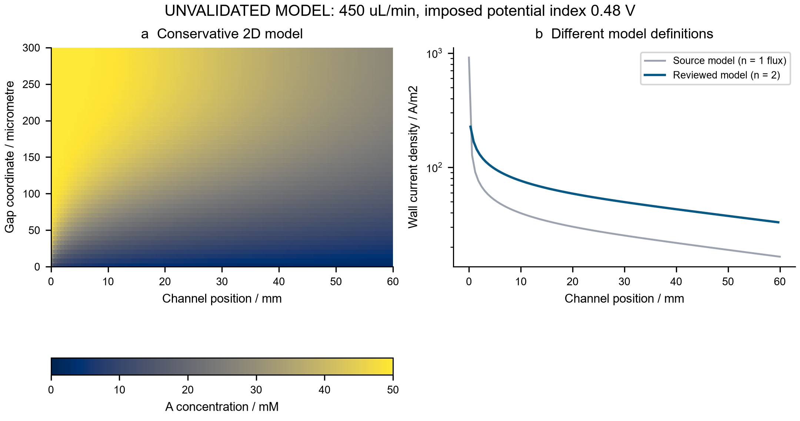
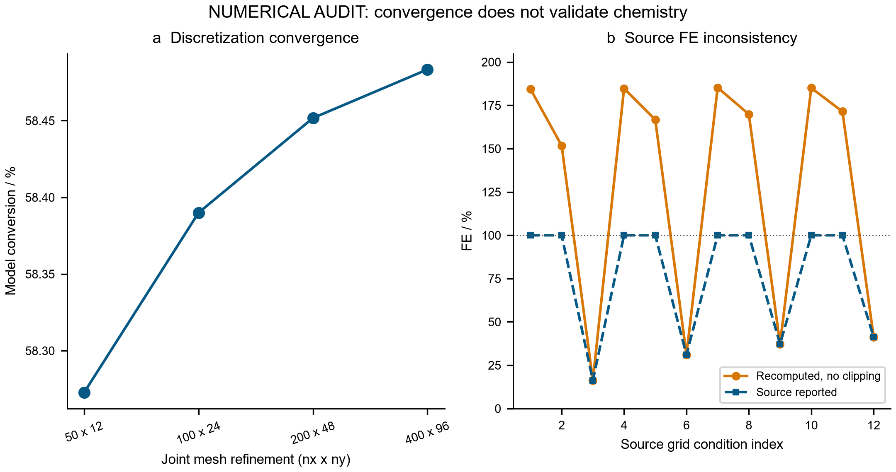
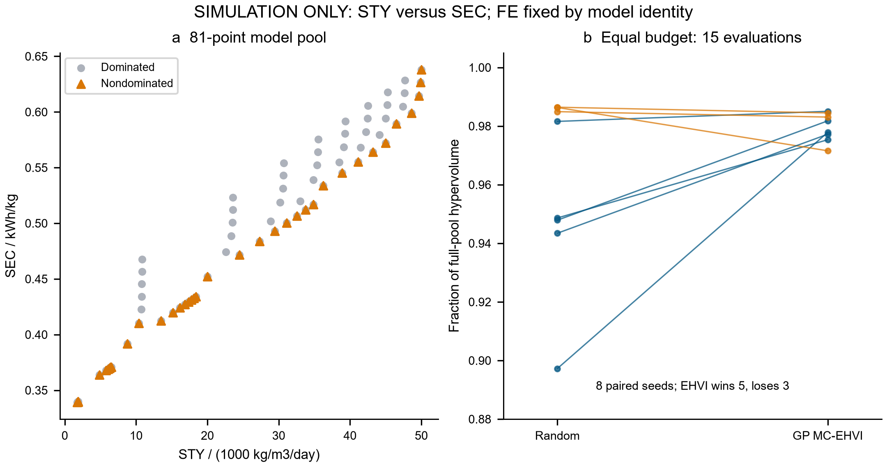

# ElectraTwin-OS: conservative transport, audited process metrics and sequential simulation

**Complete English technical report · 28 September 2026**

This release converts the submitted ElectraTwin program into a reproducible numerical research demonstrator. It preserves the original execution failure and compatibility-only results, then provides a separate conservative transport model, explicit metric boundaries, finite-pool sequential optimization, hydraulic and electrical-heating scenarios, and a local instrument-state simulator. The reviewed baseline predicts 58.3872859% conversion and 42.2513750 mA under declared assumptions. These are executed calculations, not measured chemical performance. No experiment, physical instrument connection, DFT calculation, industrial qualification or grant submission occurred in this work.

Evidence is separated throughout: **submitted assertions** are preserved but not adopted; **executed calculations** are reproducible software outputs; **numerical verification** tests equations, units and algorithms; **literature facts** are tied to accessible primary sources; and **physical validation** remains absent. Full precision in JSON supports reproducibility and must not be read as predictive accuracy. The [source-access record](../results/sources.json) states which references were opened and which were available only as publisher-indexed excerpts.

## 1. Scope, original execution and scientific audit

### 1.1 Preserved source and bounded execution

The [submitted specification](../source/specification.md), [extracted Python program](../source/electratwin_core.py), hashes and [compatibility patch](../source/numpy_compatibility.patch) are archived separately from the reviewed implementation. The extraction normalizes Python line endings and appends a final newline without changing scientific logic. Laboratory alignment and the author's attribution in that source are unverified source statements; inclusion in this repository does not establish institutional endorsement or participation.

The original program exited with code 1 after 6.10 s because NumPy 2.4.6 no longer provides `np.trapz`. A separate copy replaces that single call with `np.trapezoid`, as supported by the [official NumPy release notes](https://numpy.org/doc/2.4/release/2.4.0-notes.html). The compatibility copy completed in 52.21 s, including the single-case calculation, twelve campaign cases, graphics and exports. This is an observed local runtime, not an industrial latency guarantee. The existing CPU scientific environment was reused without reinstalling packages. Original and compatibility stdout, stderr, exit status and elapsed time remain inspectable in their respective result directories.

The wrapper captures the compatibility program's arrays and campaign history only after its main block returns. It does not silently repair kinetics, stoichiometry, flux integration or optimization. The original figures and JSON therefore retain their problematic claims for audit and should not be used as reviewed scientific conclusions.

### 1.2 Conservation and efficiency failures in the source

The displayed source equation contains axial and transverse diffusion, but its implemented stencil contains only axial upwind convection and transverse diffusion. It reports successive-iterate change as a residual and always returns `converged=True`, even if the iteration ceiling is reached. Its conversion is clipped to 0–99.9%, and its FE is clipped to 0–100%. Those operations can hide inconsistencies.

For its 100 × 45 single case, the unrounded mixed-cup conversion is 60.0353608623%, and integrated current is 24.9750174353 mA. The inlet anode corner retains the inlet concentration instead of satisfying the downstream reactive condition, yet contributes to the electrode-current trapezoid. Its contribution is 13.28363283% of the integrated current. Comparing the current-derived consumption, using the source boundary's one-electron basis, with the inlet–outlet molecular flux gives a **+15.03513433% discrepancy**. A small iterate change cannot establish conservation.

| Source audit quantity | Value |
|---|---:|
| Source reported conversion, % | 60.04 |
| Source reported current, mA | 24.98 |
| Source iterations | 973 |
| Source update norm | 9.989432e-6 |
| Current/material-flux mismatch, % | 15.03513433 |
| Inlet-corner fraction of current, % | 13.28363283 |
| Campaign evaluations | 12 |
| FE values clipped above 100%, count | 8 |
| Largest reconstructed FE, % | 185.24213191 |
| Selected compromise reconstructed FE, % | 171.43077675 |

The boundary divides current by F, whereas the downstream green calculator assumes two electrons per product. Eight campaign FE values exceed 100% before clipping. The selected source compromise at 1200 µL/min and η = 0.45 V prints 100% FE although its own unrounded metric calculation gives 171.43077675%. Its reported STY and energy values are consequently not a validated operating recommendation. The [source audit](../results/source_audit.json) retains the complete twelve-row reconstruction and independent residual calculations.

### 1.3 Scope of the industrial and autonomy claims

The source planner is a fixed four-by-three Cartesian grid. In small stub-solver probes, budget arguments 0, 1, 7 and 12 all produce twelve evaluations. It fits no surrogate, computes no predictive uncertainty and evaluates no expected hypervolume improvement. Its finite two-dimensional hypervolume helper passes a hand-calculated rectangle-union example, but that does not make the campaign Bayesian optimization. RDKit is imported without processing a molecular structure or graph.

Continuous-flow microchannels are a useful scale-up approach, but exclusivity is unsupported. A [primary OPRD study](https://pubs.acs.org/doi/10.1021/acs.oprd.3c00255) describes a rotating-cylinder electrode architecture operated in batch and flow modes. It provides a counterexample to the claim that microchannels are the only engineering route; it does not qualify this project's reactor for manufacturing. Publisher-indexed abstract and article excerpts were accessible, whereas direct full-text and supporting-information review was not obtained. No industrial partner, actual laboratory asset or experimental chemistry is established by the attachment.

## 2. Conservative transport model and numerical verification

### 2.1 Governing assumptions and boundary conditions

The reviewed model solves steady, isothermal transport of abstract species A and P in a prescribed incompressible Poiseuille velocity field:

\[
\nabla\cdot(\mathbf u C_s-D\nabla C_s)=0,\qquad s\in\{A,P\}.
\]

Equal diffusivities and one-to-one molecular conversion imply \(C_A+C_P=C_T\), where the total is fixed by the inlet feed. One linear concentration system is solved; the second species is reconstructed. This is a model identity, not an independent observation. It does **not** establish elemental or full-component mass closure for a real coupling reaction with different molecular weights. Partner consumption, protons, supporting ions, gas and side products are not represented.

The inlet prescribes total incoming flux \(uC_{in}\), a Danckwerts condition. The outlet has zero axial diffusive flux and outgoing convection; the top wall is impermeable. Axial diffusion is included by default. This inlet deliberately differs from a fixed-concentration boundary when axial diffusion matters. At the lower wall,

\[
J=k_fC_{A,w}-k_rC_{P,w},\qquad j=nFJ,
\]

and the half-cell diffusion resistance gives

\[
J=\frac{(k_f+k_r)C_{A,c}-k_rC_T}
{1+(k_f+k_r)\Delta y/(2D)},\qquad
C_{A,w}=C_{A,c}-J\Delta y/(2D).
\]

The exact same wall-face flux appears in the material equation and current integration. Shared internal face fluxes cancel on summation. Strip-integrated Poiseuille velocities reproduce the imposed volumetric flow on every mesh. The cell-centered assembly uses first-order upwind convection, central diffusion and a sparse direct solve, consistent with the conservative framework described in [NIST's finite-volume documentation](https://www.ctcms.nist.gov/~wd15/fipy/documentation/numerical/discret.html). FiPy itself is not executed.

### 2.2 Effective electrochemical parameterization

The rate constants use the attachment's effective potential dependence:

\[
k_f=\frac{j_{scale}}{nFC_{ref}}e^{\alpha F\eta/(RT)},\qquad
k_r=\frac{j_{scale}}{nFC_{ref}}e^{-(1-\alpha)F\eta/(RT)}.
\]

Here η is an imposed index relative to a fixed reference state. The exponent retains an effective one-electron dependence, while n = 2 converts molecular turnover into charge. This is not a thermodynamically complete two-electron Butler–Volmer/Nernst model. At fixed η, the wall expression is affine in concentration. Neither electrode nor electrolyte potential is solved, and the rate scale and transfer coefficient are uncalibrated. Charge consistency must therefore not be mistaken for mechanistic validity.

Default inputs are L = 0.06 m, H = 0.0003 m, W = 0.012 m, D = 1.1 × 10⁻⁹ m²/s, T = 298.15 K, Q = 450 µL/min, inlet A = 50 mM, inlet P = 0, η = 0.48 V, current scale = 0.08 A/m², α = 0.5 and reference concentration = 50 mM. One mol/m³ equals one mM. The volume is 0.216 mL and nominal residence time is 28.8 s. No thermal, migration, gas, pressure, fouling or transient field is coupled to the transport solve.

### 2.3 Baseline field, grid study and limiting cases

| Reviewed transport quantity | Value |
|---|---:|
| Baseline grid | 100 × 48 |
| Baseline conversion, % | 58.3872858750 |
| Baseline current, mA | 42.2513750193 |
| Outlet A concentration, mM | 20.8063570625 |
| Net wall turnover, mol/s | 2.18952322031e-7 |
| Baseline relative linear residual | 5.834586e-15 |
| Baseline feed-scaled material error | 1.588187e-14 |
| Baseline charge-balance error | 1.582164e-14 |
| Total verification solves | 39 |
| Maximum verification material error | 3.057068e-10 |

All 39 solves meet the declared finite-residual, global balance and concentration checks. The count comprises one baseline, seven grid cases, twelve parameter-sweep cases, ten solves for five domain points at two grids, five limiting cases and four analytic-limit comparisons. Tests include an injected invalid solver result to ensure that failure is not relabelled as convergence. A/P total concentration is exactly constant by construction; its zero deviation is not a second independent validation result.

| Joint grid | Cells | Conversion, % |
|---|---:|---:|
| 50 × 12 | 600 | 58.2728316193 |
| 100 × 24 | 2400 | 58.3900166910 |
| 200 × 48 | 9600 | 58.4517308193 |
| 400 × 96 | 38400 | 58.4833547496 |

The final joint refinement changes conversion by 0.0316239302 percentage points. The 80 × 32 screening mesh differs from the finest tested mesh by −0.1270724193 points at the baseline. At four candidate-domain corners and the center, the largest observed coarse/fine difference is 0.1446419170 points. These five checks do not bound every candidate or every local gradient. First-order upwind introduces numerical diffusion: a centerline estimate on the baseline axial mesh is roughly 850 times the physical axial diffusivity. Including a physical term does not guarantee that its small effect is resolved; [NIST's scheme discussion](https://www.ctcms.nist.gov/~wd15/fipy/documentation/numerical/scheme.html) explains this distinction.

Zero kinetics, zero diffusion and equal-feed equilibrium recover their expected limiting behavior. Product-only reverse feed yields a negative current of −42.2289396144 mA, which is retained; A-based conversion is `null` because inlet A is zero. Trace negative concentrations around −2.2 × 10⁻¹³ mM in a limiting case are preserved as roundoff and judged against an explicit tolerance. A separate rapidly mixed, irreversible plug-flow limit predicts \(X=1-e^{-k_fLW/Q}\) = 9.1535983931%. Refining to 320 axial cells reduces the discrepancy to −0.0013167311 percentage points, consistent with first-order convergence. These are numerical verification results, not reactor validation.



**Figure 1.** Panel a shows the reviewed 100 × 48 concentration field. Panel b compares source and reviewed current accounting on a logarithmic axis. The source uses n = 1 in its wall balance and the reviewed model uses n = 2, with other model and boundary changes; this is not independent calibration of the same physical model. [Editable SVG](figures/Fig1_Transport_Field_english.svg).



**Figure 2.** Joint mesh refinement is shown alongside the source campaign's raw and clipped FE values. Small numerical residuals and source FE clipping answer different questions and must be interpreted separately. [Editable SVG](figures/Fig2_Numerical_Audit_english.svg).

## 3. Process metrics, hydraulic estimates and electrical-heating scenarios

### 3.1 Definitions and incomplete material boundaries

With concentration in mol/L, flow in mL/min and percentage conversion X and selectivity S, the assumed one-to-one product rate is

\[
\dot n_P=C_{in}Q10^{-3}(X/100)(S/100),\quad
FE=\frac{nF\dot n_P}{60I}100\%,\quad
STY=\frac{1.44\dot n_PM_P}{V_{mL}10^{-6}}.
\]

STY is reported in kg/(m³ day), using molecular weight in g/mol. Reactor-product electrical SEC is \(UI/(60\dot n_PM_P)\) kWh/kg. It excludes pumps, thermal control, separation and solvent recovery. Recovered-product SEC divides this value by the specified isolation recovery. Zero-product or zero-current denominators produce `null` and an explanatory flag, rather than fabricated values such as 9999.

The attachment's molecular weights 223.27, 110.18 and 331.43 g/mol have no verified structures or balanced reaction. Their assumed one-to-one mass ratio is 99.3942120258%, but formal atom economy remains `null`. Feed substrate, partner and solvent form only a partial inventory. [ACS GCI's PMI definition](https://www.acs.org/green-chemistry-sustainability/green-chemistry-nexus/articles/process-mass-intensity-calculation-tool.html) includes total material inputs, including water. The calculator therefore reports declared-boundary mass intensity while withholding full-process PMI. Subtracting one yields a waste ratio only if the same boundary closes and all non-product output is waste; coproduct recovery and recycle require explicit allocation.

### 3.2 Baseline arithmetic and sensitivity to accounting choices

| Assumption-dependent baseline metric | Value |
|---|---:|
| Assumed cell voltage, V | 3.11165043786 |
| Assumed product rate, g/min | 0.00435404208545 |
| STY, kg/(m³ day) | 29026.9472363 |
| Reactor-product electrical SEC, kWh/kg | 0.503254627151 |
| Declared-boundary mass intensity | 82.9580003847 |
| Declared-boundary waste ratio | 81.9580003847 |
| Formal atom economy | null |
| Full-process PMI | null |

These values combine the reviewed baseline with \(U=1.85+\eta+18.5I\), an uncalibrated algebraic voltage relation, and assumed product mass. Large STY follows in part from normalization by a very small reactor volume; it does not establish an isolated production rate or long-term manufacturing capacity. FE is approximately 100% because all modelled current is assigned to the sole modelled reaction. The computation cannot demonstrate actual selectivity without side-reaction and assay data.

An independent arithmetic sensitivity case uses hypothetical 20% conversion. Halving its charge-consistent current while retaining two-electron reporting gives FE = 200%, which remains visible and flagged. Adding 0.005 g/min electrolyte, 0.5 g/min workup solvent and 0.2 g/min water, with 80% recovery, changes declared-boundary mass intensity from 242.1846242042 to 893.6046701667. This illustrates sensitivity to omitted inputs and isolation loss; neither scenario is measured. The [sensitivity JSON](../results/control/metric_boundary_sensitivity.json) preserves all assumptions and zero-product cases.

### 3.3 Hydraulic and heating calculations

The engineering extension evaluates 27 hydraulic scenarios from three flows, three channel heights and three viscosities, followed by nine electrical-heating scenarios from three heat capacities and three heat-allocation fractions. Baseline density 786 kg/m³, viscosity 0.00035 Pa s and heat capacity 2200 J/(kg K) are selected assumptions, not measured mixture properties. The calculations use

\[
D_h=\frac{2WH}{W+H},\quad Re=\frac{\rho uD_h}{\mu},\quad
Pe_H=\frac{uH}{D},\quad \tau=\frac{LWH}{Q},\quad
\Delta P=\frac{12\mu LQ}{WH^3}.
\]

The pressure formula assumes fully developed Newtonian flow between wide parallel plates. It excludes entrance, sidewall, tubing, manifold and gas losses. Ideal hydraulic power \(Q\Delta P\) is not actual pump electrical consumption. The electrical-heating scenario is

\[
\Delta T_{elec}=\frac{f_hUI}{\rho Q C_p}.
\]

| Engineering baseline quantity | Value |
|---|---:|
| Hydraulic Reynolds number | 2.7386759582 |
| Gap Péclet number | 568.1818181818 |
| Length Péclet number | 113636.3636364 |
| Nominal residence time, s | 28.8 |
| Transverse diffusion scale, s | 81.8181818182 |
| Parallel-plate pressure drop, Pa | 5.8333333333 |
| Ideal hydraulic power, W | 4.375e-8 |
| All-electrical-heat temperature rise, K | 10.1373667653 |
| Hydraulic scenarios | 27 |
| Electrical-heating scenarios | 9 |

The low Reynolds estimate is consistent with the assumed laminar regime. The diffusion-time comparison motivates spatial transport modelling but does not replace it with a complete-mixing argument. Allocating all electrical power to sensible heat gives 10.1373667653 K at the baseline; reaction enthalpy, spatial heat transfer and other energy sources are absent. This is neither a solved temperature field nor a measured temperature or strict safety upper bound. All scenario rows and provenance are saved in the [engineering results](../results/engineering/summary.json).

## 4. Sequential multiobjective benchmark and local instrument simulation

### 4.1 Objective choice and actual acquisition calculation

The reviewed single-reaction model enforces FE ≈ 100% as an identity. Optimizing STY against FE therefore degenerates to maximizing STY; only one exact-identity STY/FE point is nondominated. The reviewed benchmark instead maximizes \(f_1=STY/50000\) and \(f_2=-SEC\), with a fixed reference \(r=(0,-2)\). This does not manufacture side-reaction data to create a front. The STY/SEC relationship still depends on assumed product mass and voltage and is not a validated independent physical trade-off.

For a set of observed objective vectors Y, hypervolume is the union of rectangles bounded by r and those vectors. Each posterior draw z contributes

\[
\Delta HV(z)=HV(Y\cup\{z\};r)-HV(Y;r),\quad
a(x)=\frac{1}{M}\sum_{m=1}^{M}\Delta HV(z_m)
\mathbf1[z_{m,1}\geq0,\ z_{m,2}<0].
\]

Thus the implemented acquisition is the Monte Carlo expected newly covered area, with a physical-domain mask on nonnegative STY and positive SEC. It is a single-candidate finite-pool criterion, not parallel qEHVI, noisy EHVI or a learned safety-constrained controller. The [BoTorch acquisition documentation](https://botorch.readthedocs.io/en/stable/acquisition.html) distinguishes model-based EHVI from a deterministic hypervolume calculation. A [reproducible differential audit](../results/cross_review.json) comparing vectorized HVI with explicit before/after hypervolumes on 400 random draws found a maximum difference of 1.33 × 10⁻¹⁵. It uses seed 718 and standard-normal objective coordinates, comparing two geometry implementations in the same module; it is not external-library or formal validation and is not counted as an additional unit test.

### 4.2 Information isolation and evaluation budgets

The candidate pool is a declared 9 × 9 grid over 100–1500 µL/min and η = 0.20–0.75 V. Each point uses 80 × 32 transport cells. The 81 PDE values are precomputed for caching and full-pool reference evaluation; a separate 100 × 48 baseline is recomputed once for metric reporting. These costs are disclosed outside the per-method budget, and are not disguised as experimental savings.

At each sequential step, each objective has an independent normalized Matérn-5/2 Gaussian process with fixed length scales (0.3, 0.3), unit amplitude and numerical nugget 10⁻⁸. No hyperparameters or experimental noise model are fitted. Input bounds are known by design; output normalization and GP fitting use selected observations only. Unseen objective values are unavailable to the recommendation function. Its 256 draws per candidate use common normal draws across candidates to reduce comparison noise. Objective correlation is omitted, and posterior uncertainty is not experimentally calibrated.

| Benchmark accounting item | Value |
|---|---:|
| Candidate-pool PDE evaluations | 81 |
| Additional metric-baseline solve | 1 |
| Random seeds | 8 |
| Methods | 2 |
| Shared initial points per seed | 5 |
| Sequential additions per run | 10 |
| Total budget per method and seed | 15 |
| Campaign runs | 16 |
| Recorded evaluation uses | 240 |
| Posterior draws per candidate | 256 |

The 240 records are cached evaluation uses across sixteen numerical campaigns, not 240 independent reactions or 240 new PDE solutions. Both methods share the initial five points for each seed and avoid duplicate selections within a run. The full pool has 46 nondominated STY/SEC points and scaled hypervolume 1.52157817325. The FE range, 99.9999999999689–100.0000000000368%, reflects floating-point closure rather than real selectivity variation.

### 4.3 Paired results and retained negative outcomes

| Seed | MC-EHVI/full-pool HV | Random/full-pool HV | Paired HV difference |
|---:|---:|---:|---:|
| 0 | 0.985029 | 0.981589 | 0.005235 |
| 1 | 0.981783 | 0.947877 | 0.051591 |
| 2 | 0.984477 | 0.986432 | -0.002974 |
| 3 | 0.983069 | 0.984923 | -0.002821 |
| 4 | 0.975342 | 0.948635 | 0.040636 |
| 5 | 0.977870 | 0.897247 | 0.122673 |
| 6 | 0.971559 | 0.986345 | -0.022498 |
| 7 | 0.977219 | 0.943429 | 0.051414 |

Mean full-pool coverage is 0.979543496 for MC-EHVI and 0.959559623 for random selection. MC-EHVI wins five seeds; random wins three. Mean paired HV difference is 0.0304070243, with sample SD 0.0465353274. The paired-seed 95% t interval is [−0.0084974830, 0.0693115316], which includes zero. It assumes independent, approximately normal seed effects and describes this small finite-pool benchmark. It is not chemical uncertainty or evidence of statistically established, generally superior optimization. Seeds 2, 3 and 6 explicitly retain the negative method comparison. All evaluated nondominated candidates are exported, without declaring a median point an industrial optimum.



**Figure 3.** The pool's STY/SEC front and paired eight-seed hypervolume comparisons come from uncalibrated simulations with assumed product mass and voltage. The plots preserve the random method's winning seeds. [Editable SVG](figures/Fig3_Sequential_Optimization_english.svg).

### 4.4 Simulation-only SCPI state machine

The source's connection message, instrument identity and voltage are generated in memory. The reviewed `SimulationOnlySCPI` makes this explicit: it accepts only `SIMULATOR::ELECTRATWIN` and rejects physical USB, GPIB and TCPIP resources. It imports no instrument transport. Its identity states that no physical device exists. The formula 1.95 + 22.4I generates a toy voltage, not acquired telemetry or a specific manufacturer's response.

Unknown commands, nonfinite settings and out-of-range values produce explicit errors. Output requires connection; a simulated compliance violation disables output and latches a fault. Reset requires output off and zero current, and disconnect clears current and disables output. Simulator ranges are not equipment ratings. The [saved trace](../results/control/scpi_simulator_trace.json) ends disconnected with output off. [Tektronix's official documentation page](https://www.tek.com/tw/keithley-source-measure-units/keithley-smu-2400-series-sourcemeter-manual/model-2450-interactive-sou) confirms that real SCPI integration is model-specific; it does not certify this local state machine or grant access to equipment.

## 5. Reproduction, deliverables and remaining scientific evidence

### 5.1 Execution order and inspectable records

Run from the repository root in the existing scientific Python environment, with its numerical-library path configured. Request one OMP/BLAS/MKL thread on the CPU host. The recorded environment uses Python 3.12.14, NumPy 2.4.6, SciPy 1.18.0 and scikit-learn 1.9.0. No additional installation is required when these are already present.

```text
python electratwin/scripts/run_source.py --timeout-seconds 600
python electratwin/scripts/run_source.py --audit-only
python electratwin/scripts/transport_reviewed.py
python electratwin/scripts/metrics_control.py
python electratwin/scripts/engineering_audit.py --transport-json electratwin/results/transport/baseline_solution.json
python electratwin/scripts/cross_review.py
python electratwin/scripts/plot_reviewed.py
python electratwin/scripts/validate_electratwin.py
```

The first command intentionally records the unchanged source failure before running the compatibility copy. `--audit-only` recalculates diagnostics from saved arrays and performs small in-memory probes. `metrics_control.py --skip-optimization` regenerates only arithmetic sensitivity and the simulator trace. The default optimization uses eight seeds, fifteen selections per method and 256 posterior draws; these are configurable and recorded. Preserve the delivered archive before regenerating results. Runtime durations, timestamps and corresponding file hashes can change on rerun even when deterministic numerical outputs agree. Regenerated graphics require new visual QA; the saved QA record does not automatically apply to new files.

### 5.2 Verification coverage and publication artifacts

The [transport verification](../results/transport/verification.json), [optimization summary](../results/control/optimization_summary.json), [baseline metrics](../results/control/baseline_metrics.json) and [engineering summary](../results/engineering/summary.json) are the numerical authorities for this report. The ElectraTwin suite contains 36 tests: fifteen transport tests cover independent limiting cases, balances and failure behavior; eighteen control/metric tests cover dimensional arithmetic, unhidden FE violations, incomplete inventories, geometric HVI, information/budget behavior and simulator states; and three engineering tests cover hydraulic scaling, dimensional consistency and electrical-heating boundaries. The earlier analytical toolkit has a separate nineteen-test suite. These software checks do not supply missing physical validation.

The English figures have PNG viewing copies and editable SVG counterparts; their Chinese counterparts accompany the separate complete Chinese report. [Figure provenance](../results/figure_manifest.json), [visual QA](../results/figure_qa.json) and [publication validation](../results/publication_validation.json) document the release's actual artifact checks. They should be read for their specific scope, rather than interpreted as journal acceptance or full scientific peer review. Original graphics remain segregated under compatibility results because original titles can overstate their evidence.

### 5.3 Evidence needed for a physical or industrial claim

The current result is a transparent research software demonstrator. Quantitative prediction for an actual chemical process would require verified molecular identities and a balanced reaction; calibrated analytical yields and selectivities; measured flow, current and voltage with traceable uncertainties; transport and kinetic calibration; and independent conditions reserved for validation. A physical digital twin additionally requires a documented physical asset and reliable measurement linkage. None is replaced by a dense concentration plot or a passing unit test.

Scale-up claims would require a defined process boundary, isolation/recovery data, electrolyte and workup inventories, temperature/pressure behavior, long-duration electrode and reactor performance, and engineering validation of the actual equipment. The absent potential, heat, gas, migration and side-reaction models may matter before laboratory predictions are defensible. The model's small algebraic residual and the benchmark's mean HV improvement cannot establish manufacturing suitability, environmental superiority or publication readiness.

This release continues the earlier [English analytical-toolkit report](../../toolkit/reports/deployment_toolkit_report_english.md) and [English undergraduate grant proposal](../../toolkit/proposals/National_Undergraduate_Grant_Proposal_PanTang_Lab_English.md). Those documents preserve analytical-data and proposed-project boundaries; the proposal has not been submitted, and named supervisors or laboratory facilities have not been confirmed by this work. The present platform supplies additional reproducible calculations and explicit failure evidence for future review, with its experimental and industrial gaps left visible.
