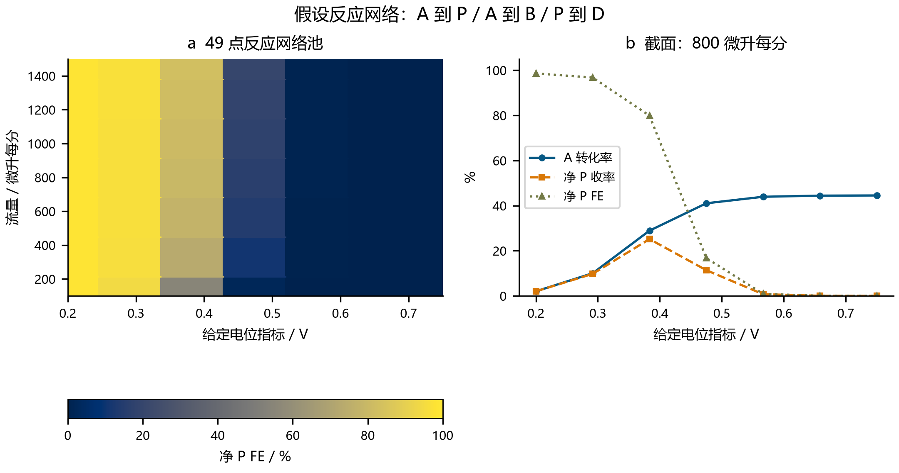
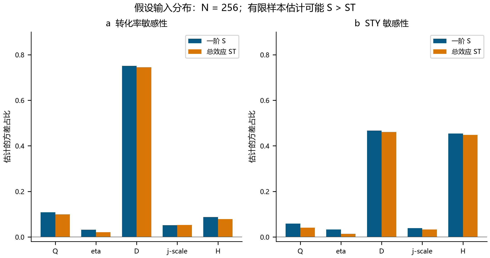
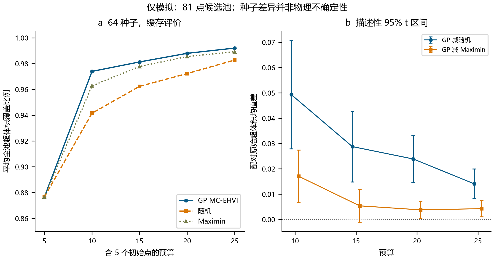
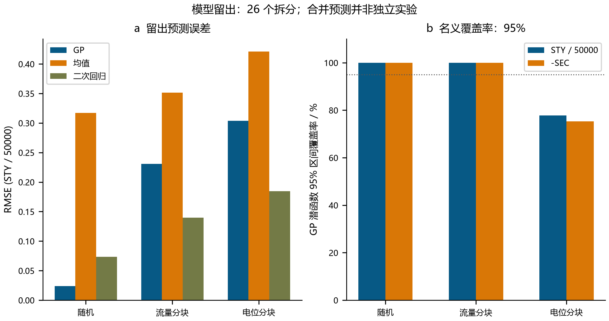

# ElectraTwin-OS 计算扩展：反应网络、参数情景与留出基准

**独立完整补充技术报告 · 2026 年 9 月 28 日**

## 1. 研究范围与计算计数

### 1.1 科学问题与不同模型的边界

本补充报告回答三个问题：连续产物破坏怎样改变电荷分账；选定参数范围怎样影响原守恒输运模型；序贯策略与代理预测在冻结候选池上怎样表现。全部结果均为实际执行的数值情景，没有标定分子机理、参数后验、实验选择性或工业性能。未连接真实仪器，也未执行实验。

四物种网络显式求解 A、P、B、D，而不确定性和基准模块继续使用此前单反应 A/P 模型，其目标产物 FE 在结构上恒定。因此，不能把网络中的 FE 损失拼接到不确定性 STY 或基准优化结果上。两类模型守恒的是抽象分子数量，不代表真实反应的元素或全组分质量平衡。[主技术报告](electratwin_report_chinese.md) 记录了原程序审计和此前模型。

### 1.2 实际工作量与来源记录

| 扩展模块 | 新增研究 PDE 求解 | 完整运行缓存评价使用 | 新增通过测试 |
|---|---:|---:|---:|
| 反应网络及对照 | 63 | 0 | 17 |
| 参数情景 | 1829 | 0 | 13 |
| 基准与留出 | 0 | 4800 | 12 |
| 合计 | 1892 | 4800 | 42 |

网络包括 62 次网络求解及一次冻结求解器对照。不确定性包括 1792 次主设计、16 次网格与 21 次局部差分求解。单元测试调用不计入研究次数。基准包含 192 个序贯运行；独立的 60 次缓存使用试运行不计入完整运行的 4800 次。26 个留出拆分产生 4212 行预测记录，并非新增 PDE 或独立实验。[网络](../results/reaction_network/study_summary.json)、[不确定性](../results/uncertainty/summary.json) 与[基准](../results/benchmark_extension/summary.json) 来源记录保存脚本、池和输出哈希、种子及版本。日志耗时仅为本地实测运行时间，不构成工程性能保证。

## 2. 四物种反应与输运模型

### 2.1 守恒方程与壁面动力学

假设支路为 A→P、A→B 和 P→D。每个物种满足

\[
\nabla\cdot(\mathbf u C_s-D\nabla C_s)=0.
\]

输运采用指定 Poiseuille 流场、相同恒定扩散系数、Danckwerts 入口总通量、出口零轴向扩散及绝缘上壁面。共享有限体积通量采用中心扩散和一阶迎风对流，对应 [NIST FiPy 文档](https://pages.nist.gov/fipy/en/latest/numerical/discret.html) 描述的守恒形式；实际程序使用 SciPy 稀疏矩阵。轴向与横向扩散均保留。

物种顺序为 A、P、B、D 时，下壁面向外通量为 \(J=LC_w\)，其中

\[
L=\begin{pmatrix}k_1+k_2&0&0&0\\-k_1&k_3&0&0\\-k_2&0&0&0\\0&-k_3&0&0\end{pmatrix},\qquad
C_w=(I+hL/D)^{-1}C_c,\quad h=\Delta y/2.
\]

半网格消元耦合四个浓度场，没有通过总浓度减 A 来推算产物。矩阵各列和为零，因而守恒分子数量。速率采用假设关系 \(k_i=k_{i,ref}\exp[\beta_iF(\eta-0.45)/(RT)]\)。

| 支路 | 参考速率，m/s | β | 每步电子数 |
|---|---:|---:|---:|
| A→P | 5.0e-5 | 0.50 | 2 |
| A→B | 3.0e-6 | 0.65 | 2 |
| P→D | 8.0e-6 | 0.85 | 2 |

这些常数描述假设的不可逆一级反应。η 是指定参数，不是求解所得界面电位，也不代表多电子 Butler–Volmer 机理推导。默认尺寸为 60 mm × 300 µm × 12 mm，D=1.1e-9 m²/s、T=298.15 K、Q=450 µL/min、A 入口浓度为 50 mM。η=0.48 V 时，三个速率分别为 8.9644260e-5、6.4082505e-6 和 2.1583865e-5 m/s。

### 2.2 净产物分账与不利结果

积分反应速率 \(\xi_i\) 的单位为 mol/s。每步二电子时，

\[
I=2F(\xi_{AP}+\xi_{AB}+\xi_{PD}),\quad
\Delta\dot n_P=\xi_{AP}-\xi_{PD},\quad
FE_{P,net}=100\frac{2F\Delta\dot n_P}{I}.
\]

出口独立电荷核算为 \(I=2F(\Delta\dot n_P+\Delta\dot n_B+2\Delta\dot n_D)\)。D 前额外系数计算其经历的两步氧化。收率以 A 进料为分母，选择性以 A 消耗为分母；AP 总支路电荷比例还包括随后被破坏的 P。

| 基准量 | 数值 |
|---|---:|
| A 转化率，% | 58.4087489913 |
| 净 P 收率，% | 11.5438481742 |
| 净 P 选择性，% | 19.7639024522 |
| 净 P FE，% | 11.3870659398 |
| AP 总支路电荷比例，% | 53.7715926427 |
| 总电流，mA | 73.3603391064 |
| AP / AB / PD 电流，mA | 39.4470227056 / 2.8198838829 / 31.0934325179 |
| 出口 A / P / B / D，mM | 20.7956255044 / 5.7719240871 / 1.9484024642 / 21.4840479443 |

过氧化使转化与有效产出明显分离。在 Q=100–1500 µL/min、η=0.20–0.75 的 49 点网格上，FE 范围为 0.0001740358–98.5898713586%。高 FE 端点仅有 1.0883060% 转化；低 FE 端点转化为 97.9097723%，净 P 收率却只有 0.0002970%。这些是所设网络的结果，不是经发现和验证的运行建议。仅进料 P 并发生降解时，净 P FE 约为 −100%；程序按净出口差量的定义保留此值。

### 2.3 数值核验及适用边界

62 次网络求解全部通过检查，最大相对物种、总摩尔及电荷误差依次为 3.3611e-10、3.7649e-10 和 4.5102e-11，最大误差出现在人为设置的高扩散极限。

| 网格 | 标量未知数 | 净 P 收率，% | 净 P FE，% |
|---|---:|---:|---:|
| 40×16 | 2560 | 11.4970663282 | 11.3690377267 |
| 80×32 | 10240 | 11.5438481742 | 11.3870659398 |
| 160×64 | 40960 | 11.5672500428 | 11.3956066765 |

末次加密变化分别为 0.0234018686 与 0.0085407367 个百分点。关闭副反应后，与条件一致的冻结求解器对照，转化差为 1.42e-13 个百分点以内。并联速率比 2:1 给出 FE=66.6667%；零动力学保持进料组成，零扩散阻断壁面接近。

独立的截面充分混合极限采用接触参数 \(\theta=LW/Q\)，得到 \(A=A_0e^{-a\theta}\) 及 \(P=P_0e^{-b\theta}+k_{AP}A_0(e^{-a\theta}-e^{-b\theta})/(b-a)\)，其中 \(a=k_{AP}+k_{AB}\)、\(b=k_{PD}\)。等速率极限使用 \(k_{AP}A_0\theta e^{-a\theta}\)。解析 P 浓度为 7.2087720656 mM；加密使最大物种误差从 0.043509 降至 0.005502 mM，与一阶行为相符。全局闭合不消除迎风误差或局部梯度误差。



**图 4。** 假设动力学下的显式四物种计算及净产物分账。FE 针对出口完整净 P，并非 AP 总周转。浓度和工况结果均为模拟，网格核验不能建立真实机理。[SVG](figures/Fig4_Reaction_Network_chinese.svg)。

## 3. 参数情景传播与敏感性

### 3.1 分布与估计方法

冻结单反应模型使用 \(k_f=k_0e^{\alpha F\eta/RT}\)、\(k_r=k_0e^{-(1-\alpha)F\eta/RT}\)，其中 \(k_0=j_*/(2FC_{ref})\)、α=0.5、Cref=50 mM。这些现象学常数尚未标定。

| 参数 | 分布 | 下界 | 上界 |
|---|---|---:|---:|
| Q，µL/min | 均匀 | 405 | 495 |
| η，V | 均匀 | 0.46 | 0.50 |
| D，m²/s | 均匀 | 0.77e-9 | 1.43e-9 |
| j*，A/m² | 对数均匀 | 0.04 | 0.16 |
| H，m | 均匀 | 0.00027 | 0.00033 |

独立性和范围均为选定情景，不是实测不确定度。对数均匀变换 \(j_*=0.04e^{u\log4}\) 的中位数为 0.08。十维扰乱 Sobol 采用种子 20260928、N=256，不跳点、不稀释，使用 `random_base2`，对应 [SciPy 官方文档的平衡要求](https://docs.scipy.org/doc/scipy/reference/generated/scipy.stats.qmc.Sobol.html)。两组五维坐标构成 A/B；ABᵢ 只把 A 的第 i 列替换成 B 的对应列。

60×24 网格上的 256(2+5)=1792 次求解给出 Jansen 估计：

\[
S_i=1-\frac{\operatorname{mean}[(Y_B-Y_{AB_i})^2]}{2V},\qquad
S_{T_i}=\frac{\operatorname{mean}[(Y_A-Y_{AB_i})^2]}{2V},
\]

V 为拼接 A/B 输出的样本方差（`ddof=1`）。常量方差明确拒绝，指标不截断。N=64/128/256 前缀全部复用已有结果。

### 3.2 输出分布与敏感性结果

假定产物分子量 M=0.33143 kg/mol、体积 Vreactor=LWH、电压 U=1.85+η+18.5I，则 \(STY=86400M\dot n_P/V_{reactor}\)、\(SEC=IU/(3.6\times10^6M\dot n_P)\)。SEC 不含泵、温控与后处理。512 个基础 A/B 点给出的情景分位数为：

| 输出 | 2.5 分位数 | 中位数 | 97.5 分位数 |
|---|---:|---:|---:|
| 转化率，% | 46.6527406 | 58.2164694 | 68.2987594 |
| 电流，mA | 34.0464611 | 41.7600327 | 49.1734242 |
| 假定产物 STY，kg/(m³ day) | 22007.8915421 | 28579.1463429 | 36384.6973412 |
| 电耗 SEC，kWh/kg | 0.478175577 | 0.501288224 | 0.525308379 |

| 参数 | 转化率 ST | 电流 ST | STY ST | SEC ST |
|---|---:|---:|---:|---:|
| Q | 0.099932 | 0.067665 | 0.040956 | 0.063705 |
| η | 0.021165 | 0.021856 | 0.013584 | 0.080110 |
| D | 0.745056 | 0.767547 | 0.460676 | 0.722628 |
| j* | 0.053205 | 0.054670 | 0.032909 | 0.051470 |
| H | 0.078877 | 0.081341 | 0.448519 | 0.076581 |

在这些范围内，D 对转化率贡献最大；D 与 H 对 STY 的贡献接近。一阶指标和依次为 1.030520、1.040820、1.050985、1.040439，且部分 S 大于 ST。这些有限估计违例不是物理上的负交互作用。转化率 D 的 ST 随前缀为 0.717498→0.768736→0.745056，尚不能认定指标收敛。

500 次配对行自助重采样使用种子 20260929，对 A/B/全部混合矩阵保留一致行索引并重算方差。分位范围仅为探索性稳定性诊断：QMC 行并非独立同分布，重采样会破坏点集平衡；本次没有执行独立扰乱重复。转化率 D 的 ST 范围为 [0.643705,0.873640]；STY 中 D/H 范围为 [0.388113,0.546007]/[0.381538,0.528240]，彼此重叠。负的一阶区间端点原样保存。

### 3.3 离散化与局部核验

八个预选点采用 60×24 和 180×72 网格，最大转化差为 0.1598292455 个百分点。转化、电流、STY 最大相对差为 0.2544885%，SEC 为 0.0718705%。这不是全域误差界，也没有重算加密网格敏感性。21 次中心及对称步长求解采用单位坐标步长 0.02、0.01。弹性 \((x/Y)dY/dx\) 应用坐标变换的雅可比。较小步长的转化弹性按表格参数顺序为 [−0.556606,0.521692,0.500760,0.055849,−0.500765]；两步长最大弹性差为 0.000023071。局部弹性不等于全局方差贡献。1829 次求解全部通过检查，最大物料平衡误差为 2.6901e-14。分位范围没有包含网格误差或模型结构误差。



**图 5。** 原单反应模型在所选分布下的敏感性。柱形比较 N=256 时转化率和 STY 的一阶及总效应估计；保留有限样本下不满足 S≤ST 的结果。重采样稳定性范围保存在 CSV 中，本图未绘出。结果不含反应网络副产物，也不等于真实物理或模型不确定度。[SVG](figures/Fig5_Parameter_Sensitivity_chinese.svg)。

## 4. 序贯基准与留出预测

### 4.1 策略、信息访问与预算

冻结的 81 点池覆盖 Q=100–1500 µL/min 和 η=0.20–0.75，原 PDE 网格为 80×32。最大化目标为 \(z=(STY/50000,-SEC)\)，参考点 r=(0,−2)，完整池 HV=1.5215781732523859。64 个种子下，每个策略共享五个初始点。随机、GP MC-EHVI、仅使用输入的 maximin 各获 25 次不重复调用。maximin 在归一化输入空间中最大化到已选点的最近距离；平局选择最小剩余索引。

两个独立、固定 Matérn-5/2 GP 仅接收已观察目标。采集函数对 256 个后验抽样的 \(HV(P\cup\{Z\};r)-HV(P;r)\) 乘以 STY≥0、SEC>0 掩码后取平均。这确实计算新增面积的期望，但掩码不是学习到的工艺安全约束。未观察目标不供采集函数访问。192 个运行的预算及唯一性检查全部通过；原 240 条已保存前缀精确重现。不同预算检查点来自同一运行的前缀。

### 4.2 学习曲线与配对对照

| 预算 | GP 平均 HV 比例 | 随机平均 HV 比例 | Maximin 平均 HV 比例 |
|---:|---:|---:|---:|
| 5 | 0.876685929 | 0.876685929 | 0.876685929 |
| 10 | 0.973962450 | 0.941565731 | 0.962743109 |
| 15 | 0.981292266 | 0.962374910 | 0.977752064 |
| 20 | 0.987960570 | 0.972264126 | 0.985467926 |
| 25 | 0.992024355 | 0.982781182 | 0.989217617 |

对种子配对差 d，描述性区间为 \(\bar d\pm t_{0.975,63}s_d/\sqrt{64}\)。

| 25 点预算原始 HV 差 | 均值 | 描述性 95% t 区间 | 胜 / 负 |
|---|---:|---|---:|
| GP−随机 | 0.014064210 | [0.008194365,0.019934055] | 45 / 19 |
| GP−maximin | 0.004270671 | [0.001022415,0.007518927] | 33 / 31 |
| Maximin−随机 | 0.009793539 | [0.002746504,0.016840574] | 42 / 22 |

15 点预算下，GP 对 maximin 在 39/64 个种子中落败；均值差 0.005386695 的区间为 [−0.001078722,0.011852111]。20 点预算时落败 36/64。区间描述固定曲面上近似独立的种子效应，相关预算及多组比较没有进行多重校正。目标缩放、参考点和候选域共同定义 HV 比较。本次没有测试其他参考点，因此没有建立参考点稳健性或策略的普遍优越性。



**图 6。** 64 个种子下的缓存池学习及配对策略对照。预算包括五个共享初始评价；前缀相关，4800 次缓存使用不是新增实验。HV 使用上述固定参考点和缩放。[SVG](figures/Fig6_Optimization_Extension_chinese.svg)。

### 4.3 防止泄漏的留出设计

20 个随机拆分采用种子 2000–2019，另有三个连续流量块及三个电位块拆分，每次均为 54 个训练点、27 个测试点。GP、训练均值和二次 OLS \([1,x_1,x_2,x_1^2,x_1x_2,x_2^2]\) 对每个目标独立拟合。输入变换与 GP 目标标准化仅使用训练行，遵循 [scikit-learn 防泄漏指导](https://scikit-learn.org/stable/common_pitfalls.html)。固定 GP 长度尺度为 (0.3,0.3)、幅度为一、数值对角项为 1e-8，没有根据留出结果重新调参；[GP 接口文档](https://scikit-learn.org/stable/modules/generated/sklearn.gaussian_process.GaussianProcessRegressor.html) 说明这些设置。分块预处理因此不同于序贯运行的预先声明域归一化。端部块超出当前训练子集范围，但仍处于原候选池内。

### 4.4 预测误差与区间失配

| 拆分类别 | 模型 | STY/50000 RMSE | −SEC RMSE，kWh/kg |
|---|---|---:|---:|
| 随机 | GP | 0.023814117 | 0.005867510 |
| 随机 | 训练均值 | 0.317246326 | 0.091777371 |
| 随机 | 二次回归 | 0.073270727 | 0.015955436 |
| 流量块 | GP | 0.230838320 | 0.059243346 |
| 流量块 | 训练均值 | 0.351532797 | 0.098252572 |
| 流量块 | 二次回归 | 0.139597004 | 0.030398649 |
| 电位块 | GP | 0.303768791 | 0.095824743 |
| 电位块 | 训练均值 | 0.421253862 | 0.128631987 |
| 电位块 | 二次回归 | 0.184537455 | 0.040184884 |

二次回归在两类分块留出的两个目标上都胜过固定 GP。随机拆分表现好不能保证缺失区域预测质量。GP 潜在函数区间为均值±1.96σ；标准化残差为（缓存真值−均值）/σ。

| 拆分类别 | STY 覆盖率，% | −SEC 覆盖率，% | STY 残差 RMS | −SEC 残差 RMS |
|---|---:|---:|---:|---:|
| 随机 | 100.0000 | 100.0000 | 0.287068 | 0.235736 |
| 流量块 | 100.0000 | 100.0000 | 0.868403 | 0.749543 |
| 电位块 | 77.7778 | 75.3086 | 1.399732 | 1.687733 |

因此，名义 95% 覆盖随拆分方式改变，尚未完成校准。后验 σ 既非测量不确定度，也非 PDE 或模型误差。每个目标和模型有 702 条留出使用记录，包含重复候选，合计 4212 行。均值和二次模型的不确定度字段保留为空。



**图 7。** 以确定性缓存目标为参照的预测和覆盖诊断。分块外推仅针对当前训练子集；重复留出使用彼此依赖，GP 区间不能量化真实工艺不确定度。[SVG](figures/Fig7_Heldout_Prediction_chinese.svg)。

## 5. 复现与尚缺证据

### 5.1 可复现执行

在仓库根目录，复用来源记录中的 Python 环境，并将 OMP/OpenBLAS/MKL 线程设为一：

```text
python electratwin/scripts/reaction_network.py
python electratwin/scripts/uncertainty_analysis.py
python electratwin/scripts/benchmark_extension.py
python electratwin/scripts/run_extensions.py --dry-run
python electratwin/scripts/run_extensions.py --modules network uncertainty benchmark
```

统一入口默认选择三个计算模块。本次交付分别执行了各模块，并以 --dry-run 检查统一入口的命令构造；统一入口不自动更新图形 QA。重跑前应保存交付归档，因为时间戳、耗时和哈希可能变化。重新生成图形后需要新的视觉检查。[网络说明](../network_notes.md)、[不确定性说明](../uncertainty_notes.md) 与[基准说明](../benchmark_extension_notes.md) 提供实现细节及原始结果链接。

### 5.2 核验范围

新增 42 项测试覆盖网络平衡和解析极限、Sobol 加性/乘积算例及重采样不变量，以及预算、只使用输入的 maximin 选择和仅使用训练集的预处理。它们补充此前 36 项 ElectraTwin 测试，并非 42 次实验。2026 年 9 月 28 日核验的官方科学文档只支持数值方法定义，没有认可所假设的化学或参数分布。

### 5.3 仍需建立的科学证据

尚缺真实分子身份、配平计量、标定后的速率与选择性、电压测量、联合参数分布及独立预测目标。两类模型均未求解电位、迁移、热、气泡、催化剂老化或分离损失。纳入反应网络的优化、多次独立扰乱敏感性区间、参考点敏感性及外部实验验证仍属后续工作。本交付建立的是可检查的计算行为，并明确暴露失败情景；工业可靠性和化学发现尚未得到证明。
