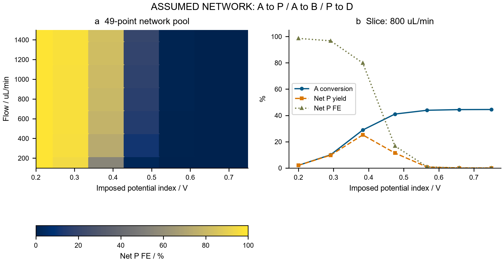
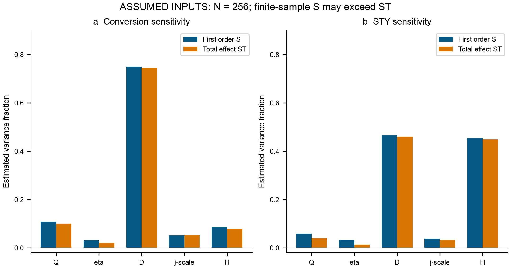
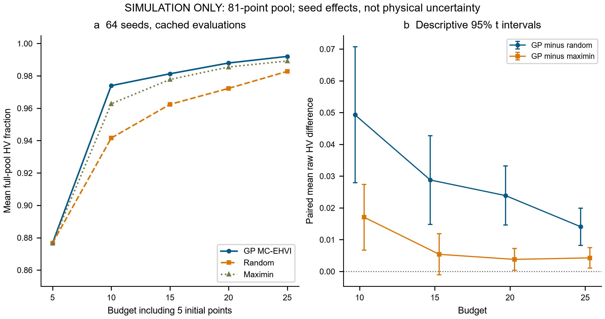
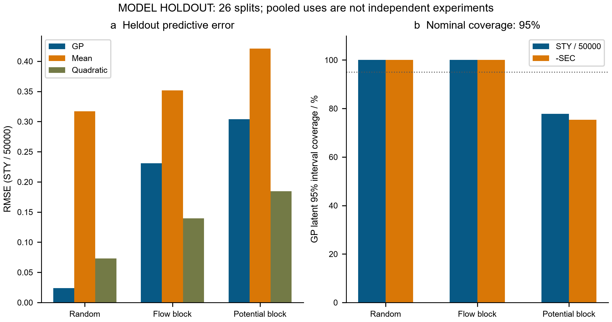

# ElectraTwin-OS computational extensions: reaction networks, parameter scenarios and held-out benchmarks

**Independent supplementary technical report · 28 September 2026**

## 1. Scope and calculation accounting

### 1.1 Questions and distinct model families

This supplement addresses three questions: how consecutive product destruction changes charge accounting; how selected parameter ranges affect the original conservative transport model; and how sequential policies and surrogate predictions behave on its frozen candidate pool. All results are executed numerical scenarios. No molecular mechanism, parameter posterior, experimental selectivity or industrial performance was calibrated. No instrument was connected and no experiment was performed.

The four-species network explicitly solves A, P, B and D. The uncertainty and benchmark modules retain the earlier single-reaction A/P model, including its structurally constant desired-product FE. Consequently, network FE losses cannot be attached to uncertainty STY values or benchmark optima. Both model families conserve abstract molecular amount, which does not establish real elemental or full-component mass balance. The [main report](electratwin_report_english.md) documents the original-source audit and earlier model.

### 1.2 Executed work and provenance

| Extension | Additional study PDE solves | Full-run cached evaluation uses | New tests passed |
|---|---:|---:|---:|
| Reaction network and comparator | 63 | 0 | 17 |
| Parameter scenarios | 1829 | 0 | 13 |
| Benchmark and holdout | 0 | 4800 | 12 |
| Total | 1892 | 4800 | 42 |

The network count comprises 62 network solves and one frozen-solver comparison. Uncertainty comprises 1792 main, 16 mesh and 21 local-difference solves. Test invocations are excluded from study counts. Benchmarking uses 192 campaigns; a separate 60-use pilot is excluded from the 4800 full-run uses. Holdout prediction produces 4212 rows across 26 splits, not additional PDE solves or independent experiments. Source, pool and output hashes, seeds and versions are retained in the [network](../results/reaction_network/study_summary.json), [uncertainty](../results/uncertainty/summary.json) and [benchmark](../results/benchmark_extension/summary.json) records. Logged execution times are local observations, not engineering performance guarantees.

## 2. Four-species reaction and transport model

### 2.1 Conservative equations and wall kinetics

The hypothetical pathways are A→P, A→B and P→D. Each species obeys

\[
\nabla\cdot(\mathbf u C_s-D\nabla C_s)=0.
\]

Prescribed Poiseuille flow, equal constant diffusivity, a Danckwerts total-flux inlet, zero outlet axial diffusion and an insulating upper wall define the transport problem. Shared finite-volume fluxes use central diffusion and first-order upwind convection, following the conservative formulation described by [NIST FiPy](https://pages.nist.gov/fipy/en/latest/numerical/discret.html); this implementation uses SciPy sparse matrices. Both diffusion directions are retained.

For species order A,P,B,D, the outward lower-wall flux is \(J=LC_w\), where

\[
L=\begin{pmatrix}k_1+k_2&0&0&0\\-k_1&k_3&0&0\\-k_2&0&0&0\\0&-k_3&0&0\end{pmatrix},\qquad
C_w=(I+hL/D)^{-1}C_c,\quad h=\Delta y/2.
\]

The half-cell elimination couples all four fields; products are not inferred by subtracting A. Zero column sums conserve molecular count. Rates follow the assumed law \(k_i=k_{i,ref}\exp[\beta_iF(\eta-0.45)/(RT)]\).

| Pathway | Reference rate, m/s | β | Electrons per step |
|---|---:|---:|---:|
| A→P | 5.0e-5 | 0.50 | 2 |
| A→B | 3.0e-6 | 0.65 | 2 |
| P→D | 8.0e-6 | 0.85 | 2 |

These constants are hypothetical, irreversible first-order rates. The imposed index η is not a solved interfacial potential or a mechanistic multi-electron Butler–Volmer derivation. Default dimensions are 60 mm × 300 µm × 12 mm, with D=1.1e-9 m²/s, T=298.15 K, Q=450 µL/min and A feed=50 mM. At η=0.48 V the rates are 8.9644260e-5, 6.4082505e-6 and 2.1583865e-5 m/s.

### 2.2 Net-product accounting and adverse outcomes

Integrated extents \(\xi_i\) have units mol/s. For two electrons per step,

\[
I=2F(\xi_{AP}+\xi_{AB}+\xi_{PD}),\quad
\Delta\dot n_P=\xi_{AP}-\xi_{PD},\quad
FE_{P,net}=100\frac{2F\Delta\dot n_P}{I}.
\]

Independently, \(I=2F(\Delta\dot n_P+\Delta\dot n_B+2\Delta\dot n_D)\). The extra factor on D accounts for both oxidation steps. Yield divides net P by A feed; selectivity divides it by A consumption. Gross AP charge fraction counts even subsequently destroyed P.

| Baseline quantity | Value |
|---|---:|
| A conversion, % | 58.4087489913 |
| Net P yield, % | 11.5438481742 |
| Net P selectivity, % | 19.7639024522 |
| Net P FE, % | 11.3870659398 |
| Gross AP charge fraction, % | 53.7715926427 |
| Total current, mA | 73.3603391064 |
| AP / AB / PD currents, mA | 39.4470227056 / 2.8198838829 / 31.0934325179 |
| Outlet A / P / B / D, mM | 20.7956255044 / 5.7719240871 / 1.9484024642 / 21.4840479443 |

Overoxidation therefore makes conversion and useful production diverge. Across the 49-point Q=100–1500 µL/min, η=0.20–0.75 grid, FE spans 0.0001740358–98.5898713586%. The high-FE endpoint has only 1.0883060% conversion; the low-FE endpoint has 97.9097723% conversion but 0.0002970% net P yield. These are assumed-network outcomes, not discovered operating recommendations. Product-only degradation yields approximately −100% net P FE, correctly retained as a net outlet-difference metric.

### 2.3 Numerical verification and its limits

All 62 network cases passed checks. Maximum relative species, total-molar and charge errors are 3.3611e-10, 3.7649e-10 and 4.5102e-11, respectively; the largest occur in an artificial high-diffusion limit.

| Grid | Scalar unknowns | Net P yield, % | Net P FE, % |
|---|---:|---:|---:|
| 40×16 | 2560 | 11.4970663282 | 11.3690377267 |
| 80×32 | 10240 | 11.5438481742 | 11.3870659398 |
| 160×64 | 40960 | 11.5672500428 | 11.3956066765 |

Last-refinement changes are 0.0234018686 and 0.0085407367 percentage points. No-side-reaction comparison agrees with the matched frozen solver within 1.42e-13 conversion percentage points. Parallel rates 2:1 give FE=66.6667%; zero kinetics preserves feed, and zero diffusivity blocks wall access.

An independent mixed-cross-section limit, with exposure \(\theta=LW/Q\), gives \(A=A_0e^{-a\theta}\) and \(P=P_0e^{-b\theta}+k_{AP}A_0(e^{-a\theta}-e^{-b\theta})/(b-a)\), where \(a=k_{AP}+k_{AB}\), \(b=k_{PD}\). The equal-rate limit uses \(k_{AP}A_0\theta e^{-a\theta}\). Analytic P=7.2087720656 mM; refinement reduces maximum species error from 0.043509 to 0.005502 mM, consistent with first-order behavior. Global closure does not eliminate upwind or local-gradient errors.



**Figure 4.** Explicit four-species calculations and net-product accounting under assumed kinetics. FE refers to intact net P, not gross AP turnover. Concentration and operating-condition results are simulations; mesh verification does not establish a real mechanism. [SVG](figures/Fig4_Reaction_Network_english.svg).

## 3. Parameter-scenario propagation and sensitivity

### 3.1 Distributions and estimator

The frozen single-reaction model uses \(k_f=k_0e^{\alpha F\eta/RT}\), \(k_r=k_0e^{-(1-\alpha)F\eta/RT}\), with \(k_0=j_*/(2FC_{ref})\), α=0.5 and Cref=50 mM. These phenomenological constants remain uncalibrated.

| Parameter | Distribution | Lower | Upper |
|---|---|---:|---:|
| Q, µL/min | Uniform | 405 | 495 |
| η, V | Uniform | 0.46 | 0.50 |
| D, m²/s | Uniform | 0.77e-9 | 1.43e-9 |
| j*, A/m² | Log-uniform | 0.04 | 0.16 |
| H, m | Uniform | 0.00027 | 0.00033 |

Independence and ranges are selected scenarios, not measured uncertainty. Log-uniform transformation \(j_*=0.04e^{u\log4}\) gives median 0.08. A ten-dimensional scrambled Sobol sequence uses seed 20260928, N=256, no skipping/thinning, and `random_base2`, consistent with [SciPy's documented balance requirements](https://docs.scipy.org/doc/scipy/reference/generated/scipy.stats.qmc.Sobol.html). Its two five-column halves form A/B; ABᵢ replaces A column i with B's.

At 60×24 cells, 256(2+5)=1792 solves give Jansen estimates

\[
S_i=1-\frac{\operatorname{mean}[(Y_B-Y_{AB_i})^2]}{2V},\qquad
S_{T_i}=\frac{\operatorname{mean}[(Y_A-Y_{AB_i})^2]}{2V},
\]

with pooled A/B sample variance V (`ddof=1`). Constant variance is rejected; indices are never clipped. N=64/128/256 prefixes reuse outputs.

### 3.2 Output distributions and sensitivity findings

With assumed molecular weight M=0.33143 kg/mol, volume Vreactor=LWH and U=1.85+η+18.5I, \(STY=86400M\dot n_P/V_{reactor}\), \(SEC=IU/(3.6\times10^6M\dot n_P)\). SEC excludes pumping, temperature control and downstream processing. The 512 base A/B evaluations give scenario quantiles:

| Output | 2.5th percentile | Median | 97.5th percentile |
|---|---:|---:|---:|
| Conversion, % | 46.6527406 | 58.2164694 | 68.2987594 |
| Current, mA | 34.0464611 | 41.7600327 | 49.1734242 |
| Assumed-product STY, kg/(m³ day) | 22007.8915421 | 28579.1463429 | 36384.6973412 |
| Electrical SEC, kWh/kg | 0.478175577 | 0.501288224 | 0.525308379 |

| Parameter | Conversion ST | Current ST | STY ST | SEC ST |
|---|---:|---:|---:|---:|
| Q | 0.099932 | 0.067665 | 0.040956 | 0.063705 |
| η | 0.021165 | 0.021856 | 0.013584 | 0.080110 |
| D | 0.745056 | 0.767547 | 0.460676 | 0.722628 |
| j* | 0.053205 | 0.054670 | 0.032909 | 0.051470 |
| H | 0.078877 | 0.081341 | 0.448519 | 0.076581 |

D dominates conversion under these ranges; D and H contribute similarly to STY. First-order sums are 1.030520, 1.040820, 1.050985 and 1.040439, and some S exceed ST. These finite-estimator violations are not negative physical interactions. Conversion D's ST changes 0.717498→0.768736→0.745056 across prefixes; convergence is not established.

Five hundred paired-row bootstrap resamples, seed 20260929, preserve matching A/B/hybrid indices and recompute variance. Their percentile ranges are exploratory stability diagnostics: QMC rows are not iid and resampling destroys net balance. No independent-scramble replication was performed. Conversion D's ST range is [0.643705,0.873640]; STY D/H ranges [0.388113,0.546007]/[0.381538,0.528240] overlap. Negative first-order limits remain saved, not hidden.

### 3.3 Discretization and local checks

Eight preset points on 60×24 and 180×72 meshes give maximum conversion difference 0.1598292455 percentage points. Maximum relative differences are 0.2544885% for conversion/current/STY and 0.0718705% for SEC. This is not a domain-wide bound; refined-mesh indices were not calculated. Twenty-one center/symmetric-step solves use unit-coordinate steps 0.02 and 0.01. Elasticity \((x/Y)dY/dx\) applies the transform Jacobian. Conversion elasticities at the smaller step are [−0.556606,0.521692,0.500760,0.055849,−0.500765] in table order; maximum inter-step elasticity difference is 0.000023071. Local elasticity is not a global variance contribution. All 1829 solves passed checks; maximum material-balance error is 2.6901e-14. Mesh error and model discrepancy are absent from quantile bands.



**Figure 5.** Selected-distribution sensitivity of the original single-reaction model. Bars compare first-order and total-effect estimates for conversion and STY at N=256. The finite-sample violations of S≤ST are retained; resampling stability ranges are available in the CSV and are not drawn here. They exclude reaction-network side products and physical/model uncertainty. [SVG](figures/Fig5_Parameter_Sensitivity_english.svg).

## 4. Sequential benchmark and held-out prediction

### 4.1 Policies, information access and budgets

The frozen 81-point pool spans Q=100–1500 µL/min and η=0.20–0.75 on an 80×32 PDE mesh. Objectives are \(z=(STY/50000,-SEC)\), maximized against reference r=(0,−2); full-pool HV=1.5215781732523859. Sixty-four seeds share five initial points per policy. Random selection, GP MC-EHVI and outcome-blind maximin each receive 25 unique calls. Maximin maximizes nearest-selected distance in normalized input space; ties use the lowest remaining index.

Independent fixed Matérn-5/2 GPs use observed outcomes only. Acquisition averages 256 posterior draws of \(HV(P\cup\{Z\};r)-HV(P;r)\), multiplied by the STY≥0, SEC>0 draw mask. This is expected additional area with a physical-domain mask, not learned process safety. Unseen objectives are inaccessible to acquisition. All 192 budget/uniqueness checks pass; the original 240 saved prefixes reproduce exactly. Budget checkpoints reuse campaign prefixes.

### 4.2 Learning curves and paired comparisons

| Budget | GP mean HV fraction | Random mean HV fraction | Maximin mean HV fraction |
|---:|---:|---:|---:|
| 5 | 0.876685929 | 0.876685929 | 0.876685929 |
| 10 | 0.973962450 | 0.941565731 | 0.962743109 |
| 15 | 0.981292266 | 0.962374910 | 0.977752064 |
| 20 | 0.987960570 | 0.972264126 | 0.985467926 |
| 25 | 0.992024355 | 0.982781182 | 0.989217617 |

For paired seed differences d, the descriptive interval is \(\bar d\pm t_{0.975,63}s_d/\sqrt{64}\).

| Budget-25 raw HV contrast | Mean | Descriptive 95% t interval | Wins / losses |
|---|---:|---|---:|
| GP−random | 0.014064210 | [0.008194365,0.019934055] | 45 / 19 |
| GP−maximin | 0.004270671 | [0.001022415,0.007518927] | 33 / 31 |
| Maximin−random | 0.009793539 | [0.002746504,0.016840574] | 42 / 22 |

At budget 15, GP loses to maximin in 39/64 seeds; mean difference 0.005386695 has interval [−0.001078722,0.011852111]. At budget 20 it loses 36/64. Intervals describe approximate independent seed effects on this fixed surface; correlated budgets/comparisons have no multiplicity correction. Objective scaling, reference point and domain define the HV comparison. Alternative reference points were not tested, so reference robustness or universal policy superiority is not established.



**Figure 6.** Cached-pool learning and paired policy comparison over 64 seeds. Budgets include five shared initial evaluations; prefixes are correlated, and 4800 uses are not new experiments. HV uses the fixed reference and scaling above. [SVG](figures/Fig6_Optimization_Extension_english.svg).

### 4.3 Leakage-controlled holdout design

Twenty random splits (seeds 2000–2019), three contiguous flow-block splits and three potential-block splits each use 54 training/27 test points. GP, training-mean and quadratic OLS \([1,x_1,x_2,x_1^2,x_1x_2,x_2^2]\) fit each target independently. Input transforms and GP target normalization use training rows only, following [scikit-learn leakage guidance](https://scikit-learn.org/stable/common_pitfalls.html). Fixed GP length scales (0.3,0.3), unit amplitude and nugget 1e-8 were not retuned on holdouts; the [GP API documentation](https://scikit-learn.org/stable/modules/generated/sklearn.gaussian_process.GaussianProcessRegressor.html) explains these settings. Block preprocessing therefore differs from campaign domain normalization. Endpoint blocks extrapolate beyond the training subset, while remaining inside the original pool.

### 4.4 Prediction errors and interval mismatch

| Split group | Model | STY/50000 RMSE | −SEC RMSE, kWh/kg |
|---|---|---:|---:|
| Random | GP | 0.023814117 | 0.005867510 |
| Random | Training mean | 0.317246326 | 0.091777371 |
| Random | Quadratic | 0.073270727 | 0.015955436 |
| Flow blocks | GP | 0.230838320 | 0.059243346 |
| Flow blocks | Training mean | 0.351532797 | 0.098252572 |
| Flow blocks | Quadratic | 0.139597004 | 0.030398649 |
| Potential blocks | GP | 0.303768791 | 0.095824743 |
| Potential blocks | Training mean | 0.421253862 | 0.128631987 |
| Potential blocks | Quadratic | 0.184537455 | 0.040184884 |

Quadratic regression beats the fixed GP for both objectives in both blocked groups. Random-split success does not establish missing-region prediction quality. Latent GP bands are mean±1.96σ; standardized residuals use (cached truth−mean)/σ.

| Split group | STY coverage, % | −SEC coverage, % | STY residual RMS | −SEC residual RMS |
|---|---:|---:|---:|---:|
| Random | 100.0000 | 100.0000 | 0.287068 | 0.235736 |
| Flow blocks | 100.0000 | 100.0000 | 0.868403 | 0.749543 |
| Potential blocks | 77.7778 | 75.3086 | 1.399732 | 1.687733 |

Nominal 95% coverage is therefore split-dependent and uncalibrated. Posterior σ is neither measurement uncertainty nor PDE/model error. There are 702 held-out uses per target/model, with repeated candidates, totaling 4212 rows. Mean/quadratic uncertainty fields remain null.



**Figure 7.** Prediction and coverage diagnostics against deterministic cached targets. Block extrapolation refers only to the training subset. Repeated holdout uses are dependent; GP intervals do not quantify real-process uncertainty. [SVG](figures/Fig7_Heldout_Prediction_english.svg).

## 5. Reproduction and unresolved evidence

### 5.1 Reproducible execution

From the repository root, reuse the recorded Python environment with OMP/OpenBLAS/MKL threads set to one:

```text
python electratwin/scripts/reaction_network.py
python electratwin/scripts/uncertainty_analysis.py
python electratwin/scripts/benchmark_extension.py
python electratwin/scripts/run_extensions.py --dry-run
python electratwin/scripts/run_extensions.py --modules network uncertainty benchmark
```

The wrapper defaults to all three calculation modules. Each module was executed separately for this release; wrapper command construction was checked with --dry-run. The wrapper does not automatically renew figure QA. Preserve the delivered archive before rerunning: timestamps, elapsed times and hashes may change. Regenerated figures require fresh visual review. Implementation details and raw-result links are provided in [network notes](../network_notes.md), [uncertainty notes](../uncertainty_notes.md) and [benchmark notes](../benchmark_extension_notes.md).

### 5.2 Verification scope

The 42 new tests cover network balances/analytic limits, Sobol additive/product examples and resampling invariants, plus budgets, input-only maximin selection and training-only preprocessing. These supplement the previous 36 ElectraTwin tests; they are not 42 experiments. Scientific documentation was checked on 28 September 2026 for numerical-method definitions. It does not endorse the assumed chemistry or parameter distributions.

### 5.3 Evidence still required

Real molecular identities, balanced stoichiometry, calibrated rate/selectivity data, voltage measurements, joint parameter distributions and independent prediction targets remain absent. Neither model resolves potential, migration, heat, bubbles, catalyst aging or separation losses. Network-aware optimization, repeated-scramble sensitivity intervals, reference-point sensitivity and external experimental validation are future work. The delivered extension establishes inspectable computational behavior and exposes failure cases; industrial reliability and chemical discovery remain unproven.
