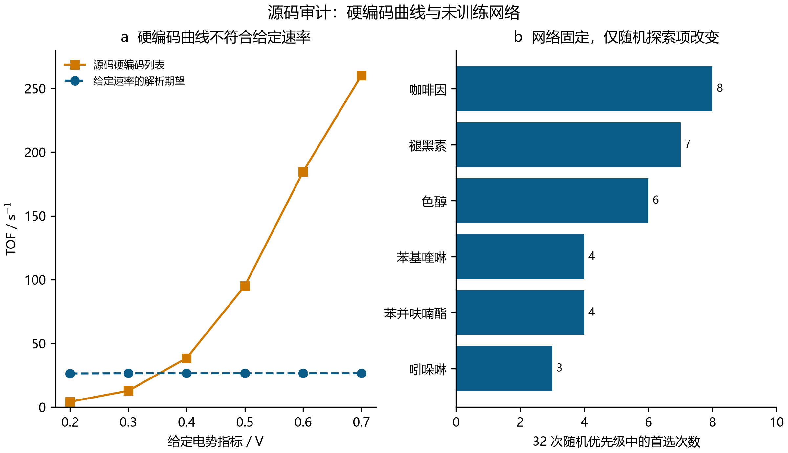
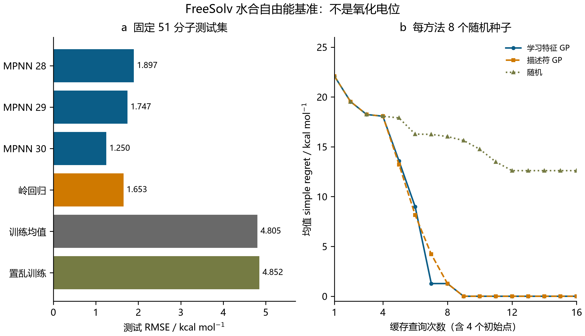
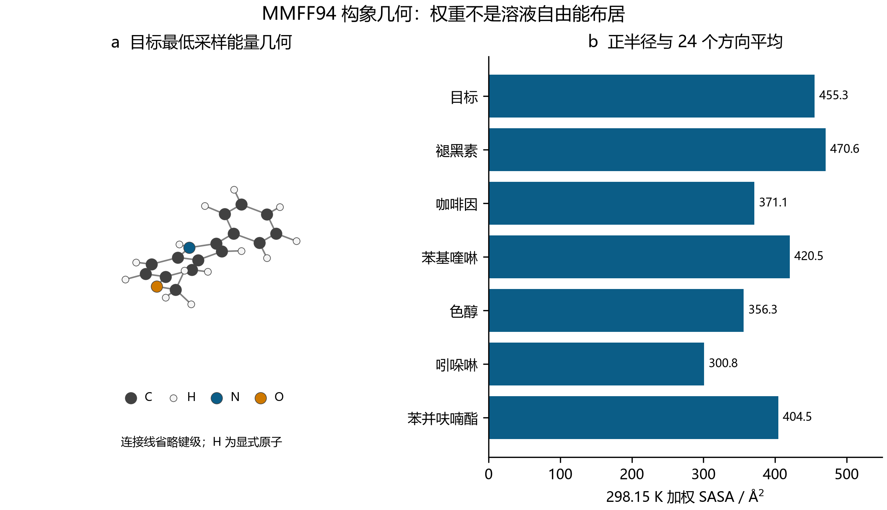
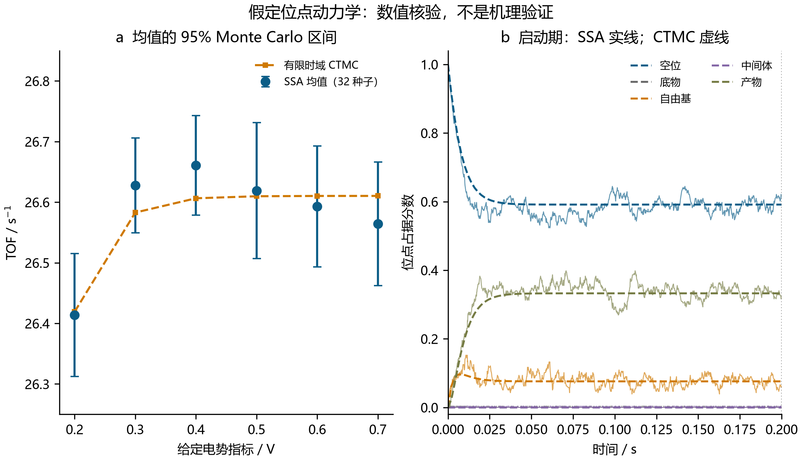

# ElectroGraph-kMC：以证据约束的软件与数值研究

**独立中文版报告 · 2026 年 9 月 28 日**  
范围：图学习、构象描述符、反应原子记账与随机动力学。报告分别标明源代码执行、监督基准证据、力场计算与假定模型核验；不涉及仪器、新实验或量子化学计算。

## 1. 研究范围与源代码审计

### 1.1 研究问题与证据层级

本研究考察所提供的 ElectroGraph-kMC 演示中，哪些主张能够经受实际执行和明确的数值检查。
目标是交付可复现、可检查失败的软件套件，不能把“氧化电位”“Fukui 代理”或“POP-SAC”
这些名称本身视为验证。各模块的证据作用不同：水合数据支持监督预测；分子几何支持力场
描述符；映射图支持原子记账；假定的 Markov 模型支持随机过程一致性检查。现有计算没有
建立有机电合成机理、经校准的电极电位、催化剂排名或工业操作窗口。测试成功和图表制作
精美均不能越过这些证据边界。

### 1.2 不变源文件与兼容性执行

原始代码与任务规范、SHA256 一并保存。原代码因已安装 RDKit 不存在未使用的
`HybridizationType.AROMATIC` 枚举而失败。独立记录的兼容版本仅作四项 API 修复：
删除该枚举，通过 `EmbedParameters` 设置 ETKDG 剪枝，修正 `CalcSASA`/`confIdx`
名称，以及改用 `Minimize(maxIts=...)`。一次失败的中间修复及其日志也予以保留。
最终兼容版本执行成功，但保留了原有科学假设和缺陷。它的构象种子仍沿用原代码默认值，
因此重复兼容执行不保证得到相同坐标。审查版模块使用显式种子和独立输出。兼容执行成功
仅说明程序能够运行，不代表科学正确。

### 1.3 审计不支持的主张

源神经网络含 888,515 个参数，却没有标签、参数优化、训练检查点或电极标定。
审计对六个分子使用 12 次初始化，实际执行 72 次前向计算；另在固定权重下改变均匀
“不确定度”的种子，进行 32 次优先级排序、192 次前向计算，六个候选均曾成为第一名。
尽管原文把选择解释为碳反应性，捕获的两次最高分原子实际为氢。消息传递架构本身不能
验证这些输出。[Gilmer 等](https://proceedings.mlr.press/v70/gilmer17a.html)

源 SASA 原子分类对目标的全部 30 个原子给出零半径。源动力学图使用硬编码电势曲线，
未映射反应也被直接赋予硬编码反应类型和中心。这些数值作为审计证据保存，不作为基准
真值。原代码没有拟合 GP；均匀随机数不是后验不确定度，该排序也不是深核学习。
[Wilson 等](https://proceedings.mlr.press/v51/wilson16.html) 精确观察与哈希见
[源代码审计](../results/source_audit.json)。



**图 1。源代码行为审计。** a 比较硬编码的源动力学曲线与给定速率的期望；b 统计固定
权重、只改变人为均匀优先级项的 32 次运行中各候选成为首选的次数。这些输出不是经校准
电位或不确定度；稳态期望上界也不限制每个随机样本。
[可编辑 SVG](figures/Fig1_Source_Audit_chinese.svg)。

## 2. 监督图学习与回顾性搜索

### 2.1 数据、署名与拆分

本地 642 行 FreeSolv/SAMPL 快照按规范异构 SMILES 和实验水合自由能，与官方 v0.52
数据库核对。所有记录在 1e-8 kcal/mol 内一致。保存官方数据、逐分子参考文献、完整
CC-BY 4.0 许可及其原始来源条款。部分不确定度元数据是上游估计值或默认值，并非独立
测得的误差条。GAFF 计算能量既不作为目标，也不作为输入特征。
[MobleyLab FreeSolv](https://github.com/MobleyLab/FreeSolv)

对规范结构 SHA256 排序选取 256 个分子，不按标签高低筛选。环状分子按无手性 Murcko
骨架分组，无环分子按完整规范结构分组；整组分配至 60/20/20 目标，最终训练、验证和
测试分别为 154、51、51 个分子，结构与组键均无交叉。不过三部分分别含 38/42/45 个
无环分子，因此无环近似物可能跨集合。这不是普遍骨架新颖性检验。预处理与模型选择
遵守拆分边界。[数据泄漏指南](https://scikit-learn.org/stable/common_pitfalls.html)

### 2.2 编码器与训练方案

审查版编码器使用 24 维原子、11 维键特征，并包含显式未知类别。绝对 CIP 类别避免
直接使用依赖原子顺序的顺、逆时针手性标签。每条键对应两条有向边，通过完整边条件
矩阵传递消息；两个 24 维消息层采用

\[
m_i=\sum_{j\to i}W(e_{ji})h_j/\sqrt{24},\qquad h_i'=\operatorname{GRU}(m_i,h_i).
\]

孤立原子接收定义明确的零消息更新。求和与均值池化拼接为 48 维分子表示；完整模型
有 29,369 个参数。没有原子标签，因此不保留原子反应性输出头。GRU 使用文档所述的
循环单元定义。[PyTorch GRUCell](https://docs.pytorch.org/docs/stable/generated/torch.nn.GRUCell.html)

仅训练集目标均值与标准差分别为 −4.6901298701 和 4.2638749810 kcal/mol。
种子 20260928–20260930 各训练 60 轮 Adam：学习率 0.003、权重衰减 1e-4、批量 32、
梯度范数上限 5。验证集选择第 39/44/60 轮，测试标签不参与选择。打乱训练标签的对照
使用种子 20261001，并继续用真实验证标签选择检查点，选中第 2 轮。它是负对照，
不是置换显著性检验。

### 2.3 基线与监督预测结果

十个描述符的岭回归在训练行拟合缩放，按验证 RMSE 从 {0.1, 1, 10, 100} 中选择
alpha=0.1。另一基线始终预测训练集均值。下表使用相同的 51 个测试分子。

| 模型 | RMSE / kcal mol⁻¹ | MAE / kcal mol⁻¹ |
|---|---:|---:|
| MPNN 种子 20260928 | 1.897239 | 1.426569 |
| MPNN 种子 20260929 | 1.746786 | 1.269662 |
| MPNN 种子 20260930 | 1.249601 | 1.016765 |
| 描述符岭回归 | 1.653425 | 1.202677 |
| 训练均值 | 4.805322 | 3.503397 |
| 打乱训练标签的 MPNN | 4.852263 | 3.589107 |

MPNN RMSE 的均值为 1.631209，种子间标准差为 0.338936。这只描述同一拆分上
初始化和小批量顺序的变化，不是泛化置信区间。两个神经网络运行不如岭回归，尚未证明
神经网络稳定占优。全部 1,536 条预测、240 轮记录、缩放器和四份权重检查点均已保存。
这些是实际水合性质预测，不能推断氧化电位准确性。

### 2.4 冻结表征 GP-UCB 及其负比较结果

回顾性搜索在 51 个测试分子中最大化负实验水合自由能。编码器种子预先指定为
20260928，不根据测试性能选择。特征缩放在训练表征上拟合。学习表征 GP 与描述符 GP
均使用固定 Matérn-5/2 核、单位幅度和长度尺度，距离除以特征数的平方根，标准化噪声
方差为 1e-5。只有已查询标签用于条件后验与输出标准化：

\[
\operatorname{UCB}(x)=\mu(x\mid D_t)+1.96\sigma(x\mid D_t).
\]

八个种子、三种方法、每组 16 次不同查询，共 384 次缓存调用。同一种子共享四个初始
点。两种 GP 均在九次调用内对全部种子找到 −23.62 kcal/mol 的多羟基极值分子，
第 16 次调用时八次全部平局。随机策略仅一次找到最优，平均简单遗憾为
12.60625 kcal/mol。GP 相对随机的配对改善具有描述性 t 区间
[7.581861, 17.630639]，七胜一平。历史 154 个训练标签及 51 个验证标签属于编码器
的额外成本。这是冻结编码器加 GP，不是联合优化的深核学习；条件潜在函数标准差不是
经校准的物理不确定度。没有证明学习表征优于描述符 GP。



**图 2。水合预测与固定池搜索。** 测试误差保留三个神经种子和全部基线；搜索曲线使用
一致初始点和相同候选池查询预算。两种 GP 最终平局。目标性质、历史预训练成本、无环
拆分策略及单一候选池范围，使其不能被解释为电化学发现。
[可编辑 SVG](figures/Fig2_Graph_Benchmark_chinese.svg)。

## 3. 构象系综与反应拓扑

### 3.1 可复现构象生成

七个提供的结构分别使用三个种子 20260928–20260930，每个种子请求 24 个 ETKDGv3
构象，嵌入剪枝阈值为 0.15 Å。返回的全部 120 个结构进行最多 1,000 次迭代的 MMFF94
优化，均返回状态零。504 个请求不能写成 504 个成功构象：剪枝和内部嵌入失败影响
返回数量，失败事件计数也不直接等于未返回的请求数。收敛几何按能量排序，以对称性
校正重原子 RMSD 0.35 Å 贪心去重，留下 36 个合并极小值。对齐使用副本；含显式氢
的嵌入及优化坐标保存于 14 个 SDF。优化器收敛不能代替 Hessian 检验。
[ETKDG 文档](https://www.rdkit.org/docs/RDKit_Book.html)、
[MMFF API](https://www.rdkit.org/docs/source/rdkit.Chem.rdForceFieldHelpers.html)。

### 3.2 力场权重、SASA 与不确定性边界

在 250、298.15 和 350 K，以 kcal/mol 为单位的 MMFF 能量、简并度取一，计算

\[
w_i=\frac{e^{-(E_i-E_{\min})/(RT)}}{\sum_j e^{-(E_j-E_{\min})/(RT)}},\quad
N_{\mathrm{eff}}=\frac1{\sum_iw_i^2},\quad
R_g^2=\frac{\sum_am_a|r_a-r_{\mathrm{COM}}|^2}{\sum_am_a}.
\]

其中 R=0.00198720425864 kcal mol⁻¹ K⁻¹。权重未计入振动、溶剂化或势阱熵，
不是溶液 Gibbs 布居。用 RDKit 正值范德华半径替代失败分类：H/C/N/O 分别为
1.20/1.70/1.60/1.55 Å。SASA 使用
1.4 Å 探针、Lee–Richards 积分，并对 24 个固定正旋转取平均，旋转种子为 17381。
[FreeSASA 接口](https://www.rdkit.org/docs/source/rdkit.Chem.rdFreeSASA.html)

| 分子 | 返回数 | 合并极小值 | 298.15 K 有效数 | SASA / Ų | 质量 Rg / Å |
|---|---:|---:|---:|---:|---:|
| 目标 | 6 | 3 | 2.751691 | 455.326579 | 3.608485 |
| 褪黑素 | 49 | 18 | 7.134821 | 470.631031 | 3.323095 |
| 咖啡因 | 3 | 1 | 1.000000 | 371.059477 | 2.464656 |
| 2-苯基喹啉 | 3 | 1 | 1.000000 | 420.532069 | 3.207699 |
| 色醇 | 33 | 6 | 3.793324 | 356.289274 | 2.458393 |
| 吲哚啉 | 8 | 1 | 1.000000 | 300.839276 | 1.961946 |
| 苯并呋喃酯 | 18 | 6 | 3.854778 | 404.491154 | 3.005735 |

2,880 次表面积计算中，前 12 个与全部 24 个方向均值的最大差为 1.167181 Ų，
单个结构方向范围最大为 16.577209 Ų，不能认为积分已经收敛。褪黑素不同种子的最低
能量跨度为 0.574056 kcal/mol，质量 Rg 加权值跨度为 0.069286 Å；搜索变化不是
经校准的不确定度。原单构象 SASA/Rg 为 289.29 Ų/4.142 Å，审查版目标为
455.326579 Ų/3.608485 Å。坐标、系综构建及描述符定义均有差异，不能把差值归因于
某一项修正。同一审查版系综的无质量权重定义 Rg 为 4.094013 Å。Rg 和 SASA 均不是
埋藏体积。



**图 3。采样得到的 MMFF 构象系综。** a 显示目标的最低采样能量几何，含显式氢，
连接线省略键级；b 比较七个分子的 298.15 K 加权 SASA。权重未考虑熵和溶剂；
种子变化与方向敏感性保留在底层表格中，不能作为物理置信界限。
[可编辑 SVG](figures/Fig3_Conformer_Ensemble_chinese.svg)。

### 3.3 原子库存与映射键变化

图结构检查确认目标为 5-甲氧基-2-苯基-1H-吲哚，分子式 C15H13NO。
原始未映射反应总分子式由 C22H21NOS 变为 C21H17NOS：少一个碳和四个氢，
重原子数从 25 变为 24。其试剂 `CSc1ccccc1` 是苯甲硫醚，不是苯硫酚。
原反应以不守恒、映射不足的状态保留，不据此推断中心或机理。

审查版要求每个显式原子具有正的唯一映射号、左右映射集合一致，且元素和同位素身份
不变。按映射号对比较键，识别成键、断键及键级变化。配平教学例“乙醇→乙醛+H2”
得到四项编辑：C2–O3 单键变双键，C2–H4 与 O3–H5 断裂，H4–H5 形成。
它仅验证原子记账。`CC>>CO` 提供重原子数相同却不满足元素守恒的反例。
自动原子映射和反应立体化学验证均不在本次范围内。

## 4. 明确假设下的随机动力学

### 4.1 模型与速率

五个状态为空位、底物、自由基、中间体和吸附产物。不可逆拟一级步骤沿循环推进；
SET 和 PCET 各计一个电子，脱附计一个产物。沿用的速率单位为 s⁻¹：

\[
(k_0,k_1,k_2,k_3,k_4)=(45,120e^{\alpha F\eta/(RT)},350,200e^{\alpha F\eta/(RT)},80),
\]

其中 α=0.5、F=96485.33、R=8.314、T=298.15 K。这些速率是假定值，不是测量值
或 DFT 结果。计数倾向 nᵢkᵢ 对同一指定速率类别中的独立等价位点作精确聚合。
不存在近邻、扩散、空间晶格或周期操作。直接 SSA 对指定随机过程的抽样精确，
不意味着化学描述精确。[Gillespie，1977](https://pubs.acs.org/doi/10.1021/j100540a008)

### 4.2 观测窗口与执行计数

审查版记录事件后的状态和实际事件数，删失超过终点的事件，并积分分段常数占据数：

\[
\bar\theta_i=\frac{\int_b^Tn_i(t)\,dt}{N(T-b)},\qquad
\widehat{\mathrm{TOF}}=\frac{C_{\mathrm{des}}(b,T]}{N(T-b)}.
\]

主研究执行 273 条轨迹、9,950,504 个事件：电势轨迹 192 条、位点数研究 48 条、
两类速率 16 条、完整基准 1 条以及事件上限诊断 16 条。前 257 条从全空位开始，
终点 T=1 s、预热 b=0.2 s。诊断在实际完成 3,500 个事件后停止，不设预热；
终止时间为 0.098456–0.103911 s，平均表观 TOF 为 24.20722140 s⁻¹。
路径依赖的终止不能构成稳态采样。另保存 105 个解析扰动条件、101 个瞬态时间点和
151 个循环等待 CDF 时间点。

### 4.3 解析 CTMC 与电势响应

行生成矩阵 Q 的对角元为 −kᵢ、循环后继元为 kᵢ，概率满足 p(t)=p(0)exp(Qt)。
增广矩阵指数同时计算占据数积分。[SciPy expm](https://docs.scipy.org/doc/scipy/reference/generated/scipy.linalg.expm.html)
由此得到

\[
\pi_i=\frac{1/k_i}{\sum_j1/k_j},\qquad
\mathrm{TOF}_{\infty}=\frac1{\sum_j1/k_j},\qquad
\frac{\partial\log\mathrm{TOF}_{\infty}}{\partial\log k_i}=\pi_i.
\]

| η / V | SSA TOF 均值 / s⁻¹ | 均值区间下限 | 均值区间上限 | 有限窗口 CTMC TOF / s⁻¹ |
|---:|---:|---:|---:|---:|
| 0.2 | 26.413727 | 26.312386 | 26.515068 | 26.419159 |
| 0.3 | 26.627655 | 26.549261 | 26.706049 | 26.582874 |
| 0.4 | 26.660767 | 26.578592 | 26.742941 | 26.606421 |
| 0.5 | 26.619110 | 26.506958 | 26.731262 | 26.609788 |
| 0.6 | 26.592865 | 26.493277 | 26.692453 | 26.610268 |
| 0.7 | 26.564178 | 26.462074 | 26.666283 | 26.610337 |

每个电势下以 32 个独立种子构造 95% Student-t 区间，条件是速率固定。六个区间均包含
其 CTMC 期望；这次覆盖情况不能验证名义覆盖率或物理不确定性。均值相对偏差最大为
0.2043%，未作多重比较校正。稳态期望上界为
(1/45+1/350+1/80)⁻¹=26.61034847 s⁻¹，所以原硬编码曲线上升至 260.2 s⁻¹
不受该模型支持。η=0.48 V 时稳态 TOF 为 26.60952060 s⁻¹，吸附/脱附弹性为
0.59132268/0.33261901，由此解释趋于饱和的响应。

### 4.4 异质速率、涨落与守恒

64/256/1024 个位点的 TOF 样本标准差为 0.425537/0.227059/0.115410 s⁻¹，
与独立位点数增加时涨落减小一致。长时间更新过程近似为
0.492167/0.246084/0.123042，不能作为精确有限窗口方差。静态混合情形包含
192 个参考位点和 64 个慢位点，后者吸附/脱附速率乘以 0.25/0.5。
其 TOF 均值 22.15179443、区间 [21.99441633,22.30917254] 与有限窗口 CTMC
的 22.09851785 s⁻¹ 一致。这只加入指定速率差异，没有加入空间相互作用。

全部轨迹满足整数状态守恒以及

\[
C_{\mathrm{SET}}+C_{\mathrm{PCET}}-2C_{\mathrm{des}}=(0,0,1,1,2)\cdot[n(T)-n(b)].
\]

基准的 5,363 个产物和 10,745 个电子，与严格 2:1 比例之差来自表面 19 个电子的
库存变化。换算电流 2.15192349e-15 A 仅描述这些显式位点。占据数和的最大误差为
9.33e-15，扫描 CTMC 概率和误差达到 6.36e-10。没有电极面积、位点密度或传质标定。



**图 4。动力学数值核验。** a 比较 32 种子 SSA 均值与有限窗口 CTMC 期望，
误差条描述固定速率下 Monte Carlo 均值的不确定度。b 叠加基准轨迹（展示时每七条
事件记录抽取一条）与前 0.2 s 的解析瞬态，右侧点线标记预热终点；完整轨迹记录
仍保留。没有建立物理速率不确定性、POP-SAC 机理
或电极尺度性能。
[可编辑 SVG](figures/Fig4_Kinetic_Validation_chinese.svg)。

## 5. 复现与验收边界

### 5.1 文件、成本与来源

下表主数值计数不包括 pilot、单元测试计算和源代码审计前向计算，避免将请求结构、
返回构象或重复调用缓存标签当作新实验。

| 主研究数量 | 计数 |
|---|---:|
| 神经网络训练次数 | 4 |
| 实际训练轮数 | 240 |
| 预测记录 | 1536 |
| 冻结池缓存调用 | 384 |
| 请求构象 | 504 |
| MMFF 优化 | 120 |
| 合并独立极小值 | 36 |
| SASA 方向计算 | 2880 |
| SSA 轨迹 | 273 |
| SSA 事件 | 9950504 |
| 新模块测试 | 49 |
| 新实验或量子化学计算 | 0 |

Pilot 另有两次网络训练、四轮、96 次调用；六个请求返回并完成两次 MMFF 优化；
五条 SSA 轨迹、169,216 个事件。学习 pilot 早于最终 CIP 修正，其精确源码字节已
归档。主模块本地 CPU 用时约为学习 45.60 s、结构 16.30 s，不是跨硬件速度保证。
SHA256 记录连接源代码、选定数据、坐标、模型权重和结果表格。

### 5.2 复现与核验

复用 Python 3.12.14、PyTorch 2.10.0、RDKit 2026.03.5、NumPy 2.4.6、
SciPy 1.18.0 和 scikit-learn 1.9.0，数值库设为单线程。在仓库根目录可执行以下阶段：

```text
python electrograph/scripts/run_suite.py --dry-run
python electrograph/scripts/run_source.py
python electrograph/scripts/audit_source.py
python electrograph/scripts/graph_learning.py
python electrograph/scripts/structure_reviewed.py
python electrograph/scripts/kinetics_reviewed.py
python electrograph/scripts/plot_reviewed.py
python electrograph/scripts/validate_electrograph.py
```

dry-run 仅列出命令，不表示已经执行。原版失败是预期保留的结果。49 项新增测试包括
学习 16 项、结构 18 项及动力学 15 项，不等于整个仓库的测试数。测试覆盖不变性、
原子身份、预算、检查点、几何、单位、终点删失与守恒。只读交叉审查重建完整基准
占据积分并复算保存的汇总算术。图表检查验证渲染，不验证化学准确性；具体检查范围
另有记录。

### 5.3 已建立的能力与仍然缺失的证据

本套件建立了可执行的监督水合学习、可追溯 MMFF 采样、明确的映射键记账及内部一致的
随机动力学。它保留神经网络表现不稳定、两种 GP 搜索终点相同、构象采样不完全、
SASA 有限积分以及源反应不守恒等结果。实验氧化/原子反应性标签、更广泛独立拆分、
溶剂自由能、Hessian 检验、速率标定、可逆热力学一致性及空间/传质耦合仍然缺失。
仅凭本次发布不足以提出机理已经证实或论文已经达到发表标准的结论。

[项目入口](../README.md)连接[学习汇总](../results/learning/summary.json)、
[结构汇总](../results/structure/summary.json)、[动力学汇总](../results/kinetics/summary.json)、
[发布核验](../results/publication_validation.json)和[图表 QA 记录](../results/figure_qa.json)。
这些机器可读文件限定了实际执行与检查的内容；方法学文献支持定义，不代替目标化学验证。
