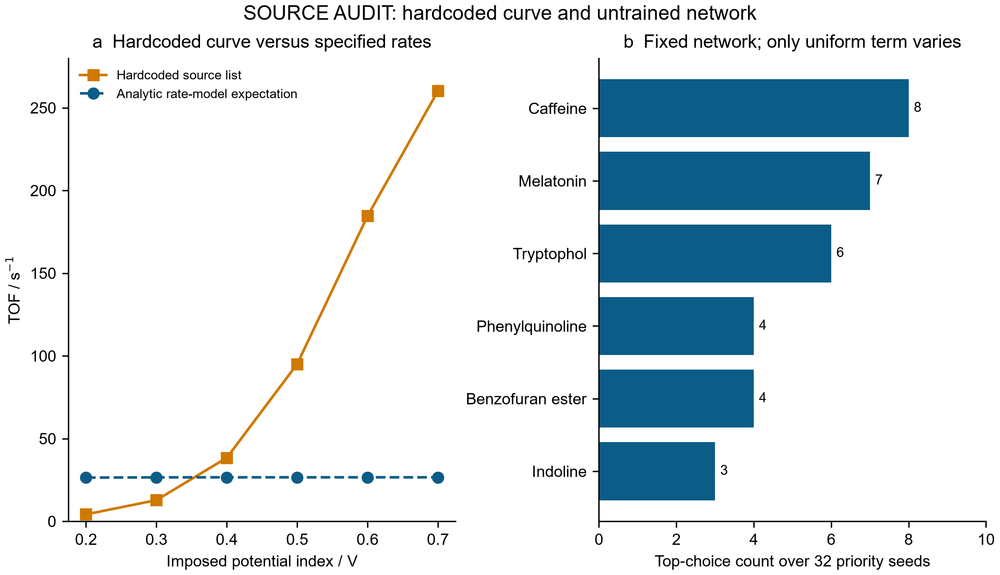
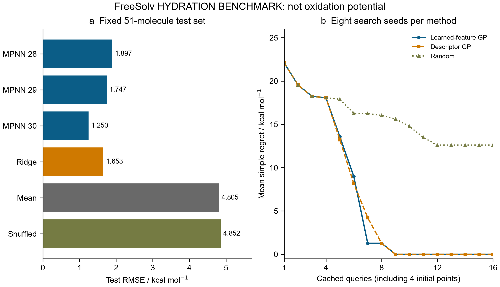
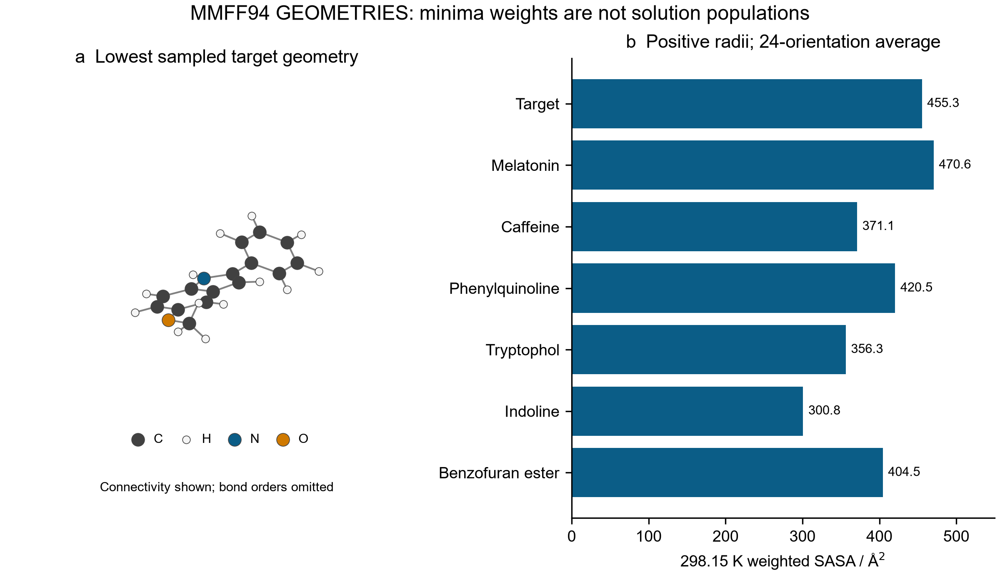
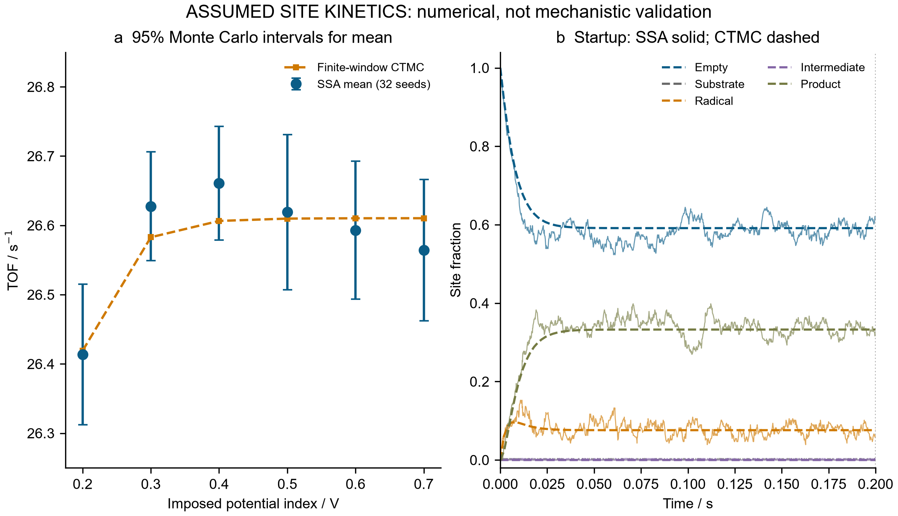

# ElectroGraph-kMC: an evidence-gated software and numerical study

**Independent English report · 28 September 2026**  
Scope: graph learning, conformer descriptors, reaction bookkeeping and stochastic kinetics. Results distinguish source execution, supervised benchmark evidence, force-field calculations and assumed-model verification. No instrument, new experiment or quantum-chemical calculation is involved.

## 1. Scope and source audit

### 1.1 Research question and evidence levels

This study asks which claims in the supplied ElectroGraph-kMC demonstration survive execution and explicit numerical checks. The objective is a reproducible software suite with inspectable failures, rather than acceptance of names such as “oxidation potential,” “Fukui proxy” or “POP-SAC” as validation. The modules have different evidential roles: a hydration dataset supports supervised prediction; molecular geometries support force-field descriptors; mapped graphs support atom bookkeeping; an assumed Markov model supports stochastic consistency checks. No calculation establishes an organic electrosynthetic mechanism, calibrated electrode potential, catalyst ranking or industrial operating window. These boundaries apply equally to successful tests and visually polished figures.

### 1.2 Immutable source and compatibility execution

The original source is preserved with its specification and SHA256. It fails because the installed RDKit lacks the unused `HybridizationType.AROMATIC` enum. A separately recorded compatibility version makes four API repairs: removal of that enum, ETKDG pruning through `EmbedParameters`, corrected `CalcSASA`/`confIdx` spelling, and `Minimize(maxIts=...)`. A failed intermediate attempt and its logs are retained. The final compatibility run succeeds, but preserves the scientific assumptions and defects. Its conformer seed remains the source default; repeated compatibility execution need not reproduce its coordinates. The reviewed modules use explicit seeds and separate outputs. Compatibility success therefore establishes execution, not scientific correctness.

### 1.3 Claims rejected by the audit

The source neural model has 888,515 parameters but no labels, optimization, trained checkpoint or electrode calibration. The audit evaluates six molecules under 12 initializations, giving 72 forward passes. A further 32 priority runs hold weights fixed while changing the uniform “uncertainty” draw, adding 192 passes; every one of the six candidates becomes the top choice. Two captured top atom selections are hydrogen despite carbon-reactivity wording. Message-passing architecture alone cannot validate these outputs. [Gilmer et al.](https://proceedings.mlr.press/v70/gilmer17a.html)

The original SASA classification gives zero radii for all 30 target atoms. Its kinetic plot uses a hard-coded potential curve, and its unmapped reaction receives a hard-coded class and center. Source values remain archived as audit evidence, not benchmark truth. The source contains no fitted GP; a uniform draw is not posterior uncertainty, and its ranking is not deep kernel learning. [Wilson et al.](https://proceedings.mlr.press/v51/wilson16.html) Exact observations and hashes are in the [source audit](../results/source_audit.json).



**Figure 1. Source behavior audit.** Panel a compares the hard-coded source kinetic curve with the expectation from its specified rates. Panel b counts the top choices from 32 runs with fixed weights and only the artificial uniform priority term changed. These outputs are not calibrated potentials or uncertainty; a steady-expectation bound does not bound every stochastic estimate. [Editable SVG](figures/Fig1_Source_Audit_english.svg).

## 2. Supervised graph learning and retrospective search

### 2.1 Dataset, attribution and split

The local 642-row FreeSolv/SAMPL snapshot is checked against the official v0.52 database using canonical isomeric SMILES and experimental hydration free energies. All records agree within 1e-8 kcal/mol. The official dataset, per-compound references, complete CC-BY 4.0 license and its original-source caveat are retained. Some uncertainty metadata are upstream estimates or defaults, not independently measured error bars. Calculated GAFF energies are excluded from targets and features. [MobleyLab FreeSolv](https://github.com/MobleyLab/FreeSolv)

Sorting canonical-structure SHA256 values selects 256 molecules without ranking labels. Ring molecules share a nonchiral Murcko-scaffold group; acyclic molecules use the complete canonical structure. Whole groups are allocated toward 60/20/20 targets, giving 154 training, 51 validation and 51 test molecules. Structures and group keys do not overlap. However, those partitions contain 38/42/45 acyclic molecules: related acyclic analogues can cross partitions. This is not a universal scaffold-novelty test. Preprocessing and model selection respect the partition boundaries. [Leakage guidance](https://scikit-learn.org/stable/common_pitfalls.html)

### 2.2 Encoder and training protocol

The reviewed encoder uses 24 atom and 11 bond features with explicit unknown categories. Absolute CIP categories avoid atom-order-dependent clockwise tags. Reciprocal directed edges transmit full edge-conditioned matrix messages; two 24-dimensional layers apply

\[
m_i=\sum_{j\to i}W(e_{ji})h_j/\sqrt{24},\qquad h_i'=\operatorname{GRU}(m_i,h_i).
\]

Isolated atoms receive a defined zero-message update. Concatenated sum and mean pooling produce a 48-dimensional representation; the complete network has 29,369 parameters. No atom-reactivity head is retained without atom labels. The GRU follows the documented recurrent-cell definition. [PyTorch GRUCell](https://docs.pytorch.org/docs/stable/generated/torch.nn.GRUCell.html)

Training-only target mean and SD are −4.6901298701 and 4.2638749810 kcal/mol. Seeds 20260928–20260930 each run 60 Adam epochs: learning rate 0.003, weight decay 1e-4, batch size 32, gradient-norm cap 5. Validation selects epochs 39/44/60; test labels never select checkpoints. A shuffled-training-label control uses seed 20261001 and true validation labels, selecting epoch 2. It is a negative control, not a permutation significance test.

### 2.3 Baselines and supervised results

A ten-descriptor ridge baseline fits scaling on training rows and selects alpha 0.1 from {0.1, 1, 10, 100} by validation RMSE. The other baseline predicts the training mean. The following metrics use the same 51 test molecules.

| Model | RMSE / kcal mol⁻¹ | MAE / kcal mol⁻¹ |
|---|---:|---:|
| MPNN seed 20260928 | 1.897239 | 1.426569 |
| MPNN seed 20260929 | 1.746786 | 1.269662 |
| MPNN seed 20260930 | 1.249601 | 1.016765 |
| Descriptor ridge | 1.653425 | 1.202677 |
| Training mean | 4.805322 | 3.503397 |
| Shuffled-training-label MPNN | 4.852263 | 3.589107 |

MPNN RMSE averages 1.631209 with seed SD 0.338936. This describes initialization/minibatch variation on one split, not a generalization confidence interval. Two neural runs are worse than ridge; stable neural superiority is unproven. All 1,536 prediction rows, 240 epoch records, scalers and four weight checkpoints are saved. These are actual hydration predictions, with no inference of oxidation accuracy.

### 2.4 Frozen-feature GP-UCB and its negative comparison

Retrospective search maximizes negative experimental hydration free energy in the 51-member test pool. The encoder seed is predeclared as 20260928, not chosen by test performance. Feature scaling uses training representations. Both learned-feature and descriptor GPs use fixed Matérn-5/2 kernels, unit amplitude/length scale, distance divided by the square root of feature count, and standardized noise variance 1e-5. Only queried labels condition the posterior and update output normalization:

\[
\operatorname{UCB}(x)=\mu(x\mid D_t)+1.96\sigma(x\mid D_t).
\]

Eight seeds, three methods and 16 distinct calls each give 384 cached calls. Each seed shares four initial points. Both GPs find the −23.62 kcal/mol polyhydroxy extreme within nine calls for all seeds and tie eight times at call 16. Random search succeeds once; its mean simple regret is 12.60625 kcal/mol. The paired GP-versus-random reduction has descriptive t interval [7.581861, 17.630639], seven wins and one tie. The historical 154 training labels and 51 validation labels are additional encoder costs. This is a frozen encoder plus GP, not jointly optimized deep kernel learning; conditional latent SD is not calibrated physical uncertainty. No advantage over descriptor GP is demonstrated.



**Figure 2. Hydration prediction and fixed-pool search.** Test errors retain all three neural seeds and baselines; search curves use matched initial points and equal pool-query budgets. Both GP methods ultimately tie. The target, historical pretraining cost, acyclic split policy and single-pool scope prevent interpretation as electrochemical discovery. [Editable SVG](figures/Fig2_Graph_Benchmark_english.svg).

## 3. Conformer ensembles and reaction topology

### 3.1 Reproducible conformer generation

Seven supplied structures each receive 24 ETKDGv3 requests for three seeds, 20260928–20260930. Embedding pruning is 0.15 Å. All 120 returned structures undergo MMFF94 optimization with at most 1,000 iterations and return status zero. The 504 requests are not 504 successful conformers: pruning and internal embedding failures affect returns, and failure-event counters do not directly count missing requests. Converged geometries are sorted by energy and greedily deduplicated using symmetry-aware heavy-atom RMSD 0.35 Å, leaving 36 pooled minima. Alignment uses copies; explicit-H embedded and optimized coordinates are preserved in 14 SDF files. Optimizer convergence does not replace a Hessian test. [ETKDG documentation](https://www.rdkit.org/docs/RDKit_Book.html), [MMFF API](https://www.rdkit.org/docs/source/rdkit.Chem.rdForceFieldHelpers.html).

### 3.2 Force-field weights, SASA and uncertainty limits

At 250, 298.15 and 350 K, unit-degeneracy weights use MMFF energies in kcal/mol:

\[
w_i=\frac{e^{-(E_i-E_{\min})/(RT)}}{\sum_j e^{-(E_j-E_{\min})/(RT)}},\quad
N_{\mathrm{eff}}=\frac1{\sum_iw_i^2},\quad
R_g^2=\frac{\sum_am_a|r_a-r_{\mathrm{COM}}|^2}{\sum_am_a}.
\]

Here R=0.00198720425864 kcal mol⁻¹ K⁻¹. These weights omit vibrational, solvation and basin entropy and are not solution Gibbs populations. Positive RDKit van der Waals radii replace failed classification: H/C/N/O use 1.20/1.70/1.60/1.55 Å. SASA uses a 1.4 Å probe and Lee–Richards integration averaged over 24 fixed proper rotations, seed 17381. [FreeSASA interface](https://www.rdkit.org/docs/source/rdkit.Chem.rdFreeSASA.html)

| Molecule | Returned | Pooled minima | Effective count at 298.15 K | SASA / Ų | Mass Rg / Š|
|---|---:|---:|---:|---:|---:|
| Target | 6 | 3 | 2.751691 | 455.326579 | 3.608485 |
| Melatonin | 49 | 18 | 7.134821 | 470.631031 | 3.323095 |
| Caffeine | 3 | 1 | 1.000000 | 371.059477 | 2.464656 |
| 2-Phenylquinoline | 3 | 1 | 1.000000 | 420.532069 | 3.207699 |
| Tryptophol | 33 | 6 | 3.793324 | 356.289274 | 2.458393 |
| Indoline | 8 | 1 | 1.000000 | 300.839276 | 1.961946 |
| Benzofuran ester | 18 | 6 | 3.854778 | 404.491154 | 3.005735 |

Across 2,880 surface evaluations, the largest first-12/full-24 mean difference is 1.167181 Ų and the largest orientation range is 16.577209 Ų. Quadrature convergence is unproven. Melatonin seed minima span 0.574056 kcal/mol and weighted mass Rg spans 0.069286 Å: search variability is not calibrated uncertainty. The source's single-conformer SASA/Rg are 289.29 Ų/4.142 Å; reviewed target values are 455.326579 Ų/3.608485 Å. Different coordinates, ensemble construction and descriptor definitions preclude attribution to a single correction. On the same reviewed ensemble, unweighted-definition Rg is 4.094013 Å. Neither Rg nor SASA is buried volume.



**Figure 3. Sampled MMFF conformer ensembles.** Panel a shows the lowest sampled target geometry with explicit H and connectivity lines that omit bond orders. Panel b compares the seven 298.15 K weighted SASAs. Weights omit entropy and solvent; seed variation and orientation sensitivity are retained in the underlying tables and are not physical confidence bounds. [Editable SVG](figures/Fig3_Conformer_Ensemble_english.svg).

### 3.3 Atom inventories and mapped bond changes

Graph inspection identifies the target as 5-methoxy-2-phenyl-1H-indole, C15H13NO. The original unmapped reaction changes total formula C22H21NOS to C21H17NOS: one carbon and four hydrogens disappear, while heavy atoms change 25→24. Its reagent `CSc1ccccc1` is thioanisole, not thiophenol. The source reaction is retained as unbalanced and insufficiently mapped, with no inferred center or mechanism.

The reviewed mapper requires positive unique atom maps, identical map sets and consistent element/isotope identity. Bonds keyed by map pairs reveal formation, cleavage and order changes. A balanced educational ethanol→acetaldehyde+H2 example yields four edits: C2–O3 single→double, C2–H4 and O3–H5 cleavage, and H4–H5 formation. This validates bookkeeping only. `CC>>CO` supplies an equal-heavy-atom counterexample to elemental conservation. Automatic mapping and reaction stereochemistry remain outside scope.

## 4. Stochastic kinetics under explicit assumptions

### 4.1 Model and rates

The five states are empty, substrate, radical, intermediate and adsorbed product. Irreversible pseudo-first-order steps advance cyclically; SET and PCET each count one electron and desorption one product. The inherited rates in s⁻¹ are

\[
(k_0,k_1,k_2,k_3,k_4)=(45,120e^{\alpha F\eta/(RT)},350,200e^{\alpha F\eta/(RT)},80),
\]

with α=0.5, F=96485.33, R=8.314 and T=298.15 K. They are assumed, not measured or DFT-derived. Count-based propensities nᵢkᵢ exactly aggregate equivalent independent sites within each assigned rate class. No neighbors, diffusion, spatial lattice or periodic operations exist. Direct SSA is exact for this specified stochastic process, not for chemistry. [Gillespie, 1977](https://pubs.acs.org/doi/10.1021/j100540a008)

### 4.2 Observation windows and execution accounting

The reviewed implementation records post-event states and actual event counts, censors events beyond the horizon and integrates piecewise-constant populations:

\[
\bar\theta_i=\frac{\int_b^Tn_i(t)\,dt}{N(T-b)},\qquad
\widehat{\mathrm{TOF}}=\frac{C_{\mathrm{des}}(b,T]}{N(T-b)}.
\]

The main study executes 273 trajectories and 9,950,504 events: 192 potential trajectories, 48 site-scaling trajectories, 16 two-class trajectories, one complete baseline and 16 event-cap diagnostics. The first 257 use T=1 s and b=0.2 s from initially empty sites. The diagnostics stop at 3,500 actual events without burn-in. They terminate at 0.098456–0.103911 s with mean apparent TOF 24.20722140 s⁻¹. Their path-dependent stopping does not constitute steady-state sampling. Separate outputs contain 105 analytic perturbation cases, 101 transient times and 151 cycle-wait CDF times.

### 4.3 Analytic CTMC and potential response

For row generator Q with diagonal −kᵢ and cyclic successor rate kᵢ, probabilities obey p(t)=p(0)exp(Qt). An augmented matrix exponential also integrates occupancy. [SciPy expm](https://docs.scipy.org/doc/scipy/reference/generated/scipy.linalg.expm.html) Consequently,

\[
\pi_i=\frac{1/k_i}{\sum_j1/k_j},\qquad
\mathrm{TOF}_{\infty}=\frac1{\sum_j1/k_j},\qquad
\frac{\partial\log\mathrm{TOF}_{\infty}}{\partial\log k_i}=\pi_i.
\]

| η / V | Mean SSA TOF / s⁻¹ | Lower mean interval | Upper mean interval | Finite CTMC TOF / s⁻¹ |
|---:|---:|---:|---:|---:|
| 0.2 | 26.413727 | 26.312386 | 26.515068 | 26.419159 |
| 0.3 | 26.627655 | 26.549261 | 26.706049 | 26.582874 |
| 0.4 | 26.660767 | 26.578592 | 26.742941 | 26.606421 |
| 0.5 | 26.619110 | 26.506958 | 26.731262 | 26.609788 |
| 0.6 | 26.592865 | 26.493277 | 26.692453 | 26.610268 |
| 0.7 | 26.564178 | 26.462074 | 26.666283 | 26.610337 |

Intervals are 95% Student-t intervals across 32 independent seeds per potential, conditional on fixed rates. All six contain their CTMC expectations; this realized coverage does not validate nominal coverage or physical uncertainty. Maximum relative mean discrepancy is 0.2043%; multiplicity is unadjusted. The expected steady ceiling is (1/45+1/350+1/80)⁻¹=26.61034847 s⁻¹. Thus the source's hard-coded rise to 260.2 s⁻¹ is unsupported. At η=0.48 V, steady TOF is 26.60952060 s⁻¹; adsorption/desorption elasticities are 0.59132268/0.33261901, explaining saturation.

### 4.4 Heterogeneity, fluctuations and conservation

At 64/256/1024 sites, observed TOF SDs are 0.425537/0.227059/0.115410 s⁻¹, consistent with decreasing independent-site fluctuations. Long-time renewal approximations are 0.492167/0.246084/0.123042; they are not exact finite-window variances. A static 192-reference/64-slow mixture reduces the latter class's adsorption/desorption rates by factors 0.25/0.5. Its mean TOF 22.15179443, interval [21.99441633,22.30917254], agrees with finite CTMC 22.09851785 s⁻¹. This adds assigned rate variation, not spatial interactions.

All trajectories satisfy integer state balances and

\[
C_{\mathrm{SET}}+C_{\mathrm{PCET}}-2C_{\mathrm{des}}=(0,0,1,1,2)\cdot[n(T)-n(b)].
\]

The baseline's 5,363 products and 10,745 electrons differ from a strict 2:1 ratio by a 19-electron inventory change. Its 2.15192349e-15 A current describes only the enumerated sites. Maximum occupancy-sum error is 9.33e-15; the scan CTMC probability-sum error reaches 6.36e-10. No electrode area, site-density or transport calibration is available.



**Figure 4. Numerical kinetics verification.** Panel a compares 32-seed SSA means with finite-window CTMC expectations; error bars describe mean Monte Carlo uncertainty at fixed rates. Panel b overlays the baseline trajectory (every seventh event record for display) and the analytic transient over their first 0.2 s; the dotted right boundary marks the burn-in endpoint. Full trajectory records are retained. No physical-rate uncertainty, POP-SAC mechanism or electrode-scale performance is established. [Editable SVG](figures/Fig4_Kinetic_Validation_english.svg).

## 5. Reproducibility and acceptance boundaries

### 5.1 Artifacts, costs and provenance

The following ledger excludes pilots, unit-test calculations and source-audit forward passes from the main numerical totals. It prevents requested structures, returned conformers and repeated cached labels from being counted as new experiments.

| Main study quantity | Count |
|---|---:|
| Neural training runs | 4 |
| Executed training epochs | 240 |
| Prediction rows | 1536 |
| Frozen-pool cached calls | 384 |
| Requested conformers | 504 |
| MMFF optimizations | 120 |
| Pooled distinct minima | 36 |
| SASA orientation evaluations | 2880 |
| SSA trajectories | 273 |
| SSA events | 9950504 |
| New module tests | 49 |
| New experiments or QM calculations | 0 |

Pilots add two neural fits/four epochs/96 calls, two MMFF optimizations from six requests, and five SSA trajectories/169,216 events. The learning pilot predates the final CIP correction; exact source bytes are archived. Main modules ran in approximately 45.60 s for learning and 16.30 s for structure on the local CPU, not a hardware-general speed claim. SHA256 records connect sources, selected data, coordinates, weights and tables.

### 5.2 Reproduction and verification

Python 3.12.14, PyTorch 2.10.0, RDKit 2026.03.5, NumPy 2.4.6, SciPy 1.18.0 and scikit-learn 1.9.0 were reused with one numerical thread. From the repository root, the documented stages are:

```text
python electrograph/scripts/run_suite.py --dry-run
python electrograph/scripts/run_source.py
python electrograph/scripts/audit_source.py
python electrograph/scripts/graph_learning.py
python electrograph/scripts/structure_reviewed.py
python electrograph/scripts/kinetics_reviewed.py
python electrograph/scripts/plot_reviewed.py
python electrograph/scripts/validate_electrograph.py
```

The dry-run lists commands without claiming execution. Original failure is an expected retained result. Forty-nine new tests comprise 16 learning, 18 structure and 15 kinetics tests; this is not the whole-repository test count. They check invariance, atom identity, budgets, checkpoints, geometry, units, censoring and conservation. Read-only cross-review reconstructs the complete baseline occupancy integral and saved summary arithmetic. Figure inspection checks rendering, not chemical accuracy; its precise scope is recorded separately.

### 5.3 What is established and what remains open

The suite establishes executable supervised hydration learning, traceable MMFF sampling, explicit mapped-bond bookkeeping and internally consistent stochastic kinetics. It retains unstable neural performance, identical final GP search outcomes, incomplete conformer sampling, finite SASA integration and an unbalanced source reaction. Experimental oxidation/atom-reactivity labels, broader independent splits, solvent free energies, Hessian verification, rate calibration, reversible thermodynamic consistency and spatial/transport coupling remain absent. These gaps prevent mechanism or publication-readiness claims based solely on this release.

The [project entry](../README.md) links the [learning summary](../results/learning/summary.json), [structure summary](../results/structure/summary.json), [kinetics summary](../results/kinetics/summary.json), [publication validation](../results/publication_validation.json) and [figure QA record](../results/figure_qa.json). These machine-readable artifacts delimit what was executed and checked; methodological citations establish definitions, not validation of the target chemistry.
