# 分子学习与多尺度计算化学中的参考和观测量依赖性

宋思毅

广西师范大学，中国

扩展研究论文 · 2026 年 9 月 29 日

## 摘要

计算化学项目将分子表示、电子参考、统计采样及下游观测量相结合，但某一阶段的成功不能证明下一阶段的准确性。本文整合六个公开仓库历史中选取的数值证据，去除继承研究的重复计数，并区分已执行计算、合成对照与拟议工作，形成可复现的回顾性研究。两条受控 H₂ 计算链提供核心定量分析。在配对神经拟合中，梯度监督使相对 RHF 标签的测试 RMSE 降低 60.24–73.65%，但相对匹配有限基组 FCI 的误差只降低 0.00838–0.02168%；有符号归因识别参考偏差并保留误差抵消。在独立的 FCI 参数化 Morse 模型中，接近机器精度的代数残差与浅束缚态遗漏并存；扩展区间及加密网格恢复该态，事后固定区间外推相对解析模型的偏差达到 0.02688%。历史构象、变分、自旋态、分子动力学及对接记录将分析拓展到参考对齐、态质量与不充分采样。传输和分析对照说明，守恒、正确均值或较小拟合残差，仍可能遗漏所需产物、分布或峰面积。扩展证据保留全部已记录种子比较和未成功结果，不只选择有利结果。新增图表由归档记录重算，并附固定提交与文件摘要；本文不宣称新增实验。贡献在于对耦合计算给出可审计、针对观测量的解释，而非提出新的通用化学算法或经验证的催化机理。

关键词：计算化学；参考偏差；分子学习；采样；数值收敛；可复现性

## 1 引言

机器学习势通过可微近似替代昂贵的计算，将电子结构数据与分子模拟连接起来。现代模型引入几何对称性，并使用能量与力训练；电子结构方法则定义被视为目标的标签 [@unke2021; @batzner2022]。这种分工使“准确性”具有不同含义：模型可能准确插值某种量子近似，导数也内部一致，却仍明显偏离更高层次的电子参考；数值求解器也可能准确求解一个离散算符，而离散化或边界条件仍使物理观测量失真。这些问题需要不同的比较对象。

对有机电合成而言，这一区分尤其重要，因为催化剂身份、溶剂、电极条件、电荷转移和产物选择性最终需要建立联系。唐海涛及其合作者在实验中建立的转化，为计算支持的电合成提供了化学动机 [@tang1; @tang2]，但没有为本文模型研究提供标定数据。特别是，运行成功的代理模型或传输求解器不能确立电催化机理、氧化电位或制备操作窗口。数值演示只有在明确参考、适用域和目标观测量后，才具有可解释的化学意义。

既有研究已经确立了切合实际的评估、不确定度分析和符合物理要求的机器学习表示的重要性 [@uncertainty; @evaluation]。本文不将参考偏差、分布偏移或离散误差视为新发现的现象，而是把这些已知问题组织到可检查的计算链中，量化某一层面的改善有多少能够传递到下一层。分析保留未成功的尝试，并区分直接计算、缓存评估、合成标签和拟议输入。将许多小型工作流汇集为一个软件集合时，这种核算尤其必要。

主要证据来自两条计算链。第一条中，配对神经模型使用相同的 RHF/STO-3G 训练标签，并在具有新 RHF 和 FCI 参考的几何上共同评估，由此无须在电子数据集之间插值即可进行有符号误差归因。第二条中，FCI 平衡性质用于参数化 Morse 势，其精确全实轴能谱为径向有限差分提供数学比较。独立改变网格步长和径向范围，揭示哪些观测量尚未得到充分解析。此前的分子学习、反应路径、热化学、传输、随机动力学和分析计算作为支持案例纳入。它们拓展失败模式的范围，但不合并为普遍性能评分。

本文研究三个问题：拟合误差降低后，有多少改善能够在改用电子相关参考时保留下来？较小的代数残差能否保证近阈值分子模型观测量的准确性？当内部一致性、守恒或执行成功被用来替代相关外部比较时，哪些结论仍缺乏支持？图 1 给出计算设计，并区分两条主要计算链。

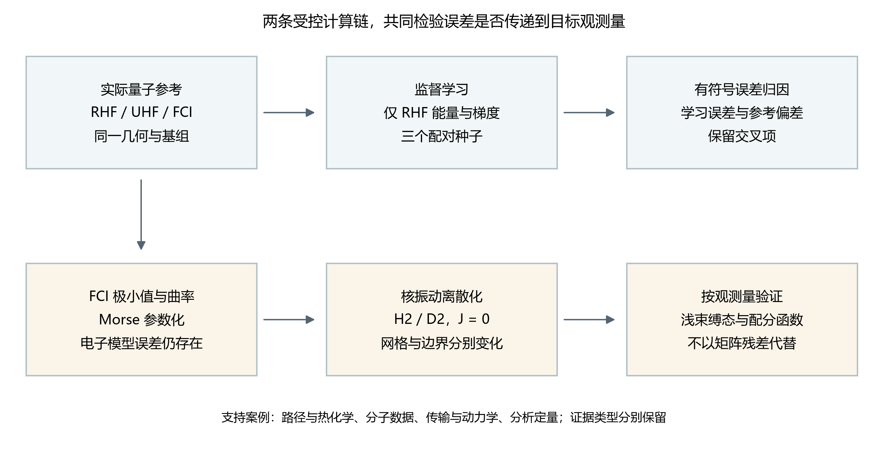

图 1. 用于误差归因的两条受控计算链。神经训练使用 RHF 标签，FCI 仅用于独立参考比较。核运动采用 FCI 参数化的 Morse 近似，并具有自身的模型、边界和离散化误差。支持案例保留各自原始数据类型，不被视为额外 H₂ 观测。

## 2 方法

### 2.1 证据集合与研究设计

源集合冻结于仓库提交 1ad05c243155a9f64b18e0d58c665424fde919a0，包含初始五主题研究及后续 production、research、闭环、分析、传输、分子图、多孔材料模型和量子/路径研究。补充信息 S1–S12 记录完整范围，包括不用于建立主要定量结论的部分。在源文件层面区分实际分子计算、公开实验标签、解析对照、合成目标、模拟反馈和未执行的量子输入。

主要 H₂ 分析是小体系基准。其几何是同一条解离曲线上的相关点，不是化学空间的独立样本。三个随机种子用于考察初始化依赖，而非总体层面的统计不确定度。新增误差传递和 Richardson 分析均明确属于对冻结数据的事后运算；这些算术分析不计为新的电子能量计算、神经训练或核本征问题。主要 H₂ 研究使用验证数据选模，先导仅访问训练和验证记录。部分早期支持案例的先导包含留出输出，因此不能将完整历史集合描述为开发全过程保持盲态的评估。

### 2.2 电子参考计算

使用 Psi4 1.11 [@psi4]，对 C1 对称性下的中性 H₂，在 0.50–4.00 Å 之间的 25 个核间距计算能量。每个点采用相同几何，分别在 STO-3G 和 cc-pVDZ [@dunning] 下进行 RHF、UHF 与 FCI 计算，两核位于 ±R/2。SCF 使用 CORE 初猜、PK 积分、10⁻¹² 的能量和密度收敛阈值，以及 200 次迭代上限。UHF 使用轨道混合并跟随内部不稳定方向，RHF 则检查稳定性。FCI 采用 RHF 参考、单根、不冻结轨道，能量阈值为 10⁻¹²，残差阈值为 10⁻¹⁰。根据保存日志，两种基组在 Nα=Nβ=1 扇区分别产生 4 和 100 个行列式。

电子主研究包含 150 个曲线能量、两个孤立双重态 H 计算、21 次 FCI 极小值搜索和十次 FCI 曲率评估。搜索区间为 0.6–0.9 Å，五点曲率估计采用 h=0.0025 Å，电子势阱深度定义为 Dₑ=2E(H)−E(minimum)。另外计入二十次成功的先导/恢复能量调用，总共得到 203 次实际能量 driver 调用。更早的六个可选诊断配置在调用前被拒绝，不计为能量计算。原研究的 58 个量子作业保留为独立记录；FCI 内部的 SCF 阶段不重复计数。

FCI 消除了指定轨道基组和电子哈密顿量内的组态截断，但不消除基组不完备、相对论、非绝热或环境误差。STO-3G 与 cc-pVDZ 不是嵌套的收缩基组，因此不将观察到的能量排序视为一般变分定理。保存记录未提供 FCI 自旋期望值，也不以其 RHF 参考轨道的自旋代替 CI 波函数诊断。

### 2.3 配对分子能量学习

一个具有 3537 个参数的距离消息神经网络，在此前 42 点 RHF/STO-3G 数据集上训练；数据分为 17 个训练、8 个验证、8 个测试和 9 个拉伸分布外几何。共享氢嵌入、两个宽度为 16 的消息/更新层、SiLU 非线性、两条有向边和原子能求和读出定义不变标量能量，笛卡尔力由自动微分获得。该构造采用消息传递与连续分子能量表示的思想 [@mpnn; @schnet]，但不声称复现其中任一架构。H₂ 仅有一个独立距离，因此在本应用中，该模型实际是径向回归器。

仅由训练集计算的能量和径向梯度标准差分别为 0.0937046071 Hartree、0.318790348 Hartree Å⁻¹，用于归一化损失。仅能量目标最小化归一化能量均方误差，联合目标再加入归一化径向梯度均方误差。两者均按同一个“归一化验证能量与梯度 RMSE 之和”选择检查点。因此，仅能量训练仍使用验证梯度和训练梯度尺度。种子 7301、7302、7303 在两个目标间配对，初始化哈希完全相同。每次正式运行采用 800 步全批量 float64 Adam，学习率从 0.003 按余弦衰减至 0.00015，梯度范数截断为 5，权重衰减为零。所有选中检查点均为第 800 轮；这只是预算终点，不证明优化收敛。

保留冻结的仅能量与联合高斯 RBF 拟合，以及线性插值/外推基线，均使用原标签划分。通过旋转、反射、平移和原子置换检查能量不变性与力协变性，并将每个笛卡尔力分量与能量中心差分比较。这些测试评估所学标量函数的数学一致性，没有将其力与相关电子结构力进行比较。

### 2.4 有符号归因与改善传递

参考数据在完全相同的保存几何处连接，共包含 21 个间距、126 个模型/种子记录，其中包括全部八个测试几何和原九个 OOD 几何中的五个。记 ε 为神经模型相对旧 RHF 标签的误差，d 为新旧 RHF 重放差，b 为新 RHF 与 FCI 的差，则

$$
\begin{aligned}
\widehat E-E_{\rm FCI}&=\epsilon+d+b,\quad \epsilon=\widehat E-E_{\rm RHF}^{\rm old},\\
d&=E_{\rm RHF}^{\rm old}-E_{\rm RHF}^{\rm new},\quad b=E_{\rm RHF}^{\rm new}-E_{\rm FCI}.
\end{aligned}
$$

全部连接几何的新旧参考差在记录精度下均为零。因此，新增分组分析保留以下精确的两项均方恒等式：

$$
{\rm MSE}_{\rm FCI}=\langle\epsilon^2\rangle+\langle b^2\rangle+2\langle\epsilon b\rangle.
$$

交叉项可以为负，本文直接报告其数值，而不将其解释为正的方差贡献。对同一有限集合，反三角不等式和三角不等式给出

$$
\left|{\rm RMSE}(b)-{\rm RMSE}(\epsilon)\right|
\leq {\rm RMSE}(\epsilon+b)
\leq {\rm RMSE}(b)+{\rm RMSE}(\epsilon).
$$

这些是标准恒等式与界限，不是新理论。它们在本研究中具有解释价值，是因为匹配几何上的全部分量均可获得。对每个种子和划分，分别以 RHF、FCI 为参考计算相对改善 100[1−RMSE(joint)/RMSE(energy-only)]。测试和匹配 OOD 结果分开报告。FCI 标签不进入拟合、检查点选择或超参数调整。

### 2.5 核模型与数值误差分离

电子极小值、孤立原子定义的势阱深度以及 FCI 局部曲率确定 Morse 近似 [@morse]：

$$
V(r)=D_e[1-e^{-a(r-r_e)}]^2,\qquad a=\sqrt{k/(2D_e)}.
$$

这是由三个性质确定的参数化，不是对完整电子曲线进行非线性拟合。H₂ 与 D₂ 共享相同电子势；约化质量使用裸质子/氘核质量 1.0072764665789/2.013553212544 u 的一半。采用 Dirichlet 端点的二阶有限差分径向哈密顿量描述 J=0 核运动，对称三对角本征求解器提取低于 Dₑ 的状态。另行指定 Dₑ=0.2 Hartree、a=1.8 Å⁻¹、rₑ=1 Å 的 Morse 对照，利用精确全实轴能谱检验实现。

主网格在 [0,8] Å 上使用 400、800、1200 个区间；区间变化和刻意移动壁面的负对照另行记录。六组最终模型/同位素能谱产生 130 个主网格能级。主研究、先导和浅束缚态追加分别包含 38、6、7 个独立本征问题，始终区分全实轴与有限径向边界条件。束缚态配分和在 100、298.15、600、1000、2000、4000 K 计算。所报 F 是仅束缚态的振动 Helmholtz 贡献，不是完整分子 Gibbs 自由能。

追加研究独立改变径向范围与步长。新增算术分析对同一批保存本征问题比较浅束缚态束缚能误差和矩阵残差，并在固定右边界 48、96 Å 下计算标准二阶估计 Bext=(4B(h/2)−B(h))/3。该事后外推假设主导网格误差为二次项，不替代归档单网格能谱，也不建立其他势能的普遍收敛性。

### 2.6 回顾性仓库取样与历史去重

扩展证据集来自 2026 年 9 月 29 日作者 GitHub 账户下可见的六个公开仓库。公开可见性定义了本研究的取样范围，并不意味着这些项目是计算化学研究的随机样本。外部仓库均固定到特定提交；选入的数值文件保留原始仓库路径、逐字节 SHA-256 摘要及提取脚本。通过提交历史识别继承代码、修订分析和续算。仓库名称、README 概述、拟议任务和结果截图，不被视为已执行计算的等价证据。

水溶解度仓库与复杂骨架仓库共享初始提交，其中选取的九个代码或图像文件具有完全相同的内容。因此，早期溶解度模型是一项被继承的研究，而非两次独立验证。同样，后续计算若重复先导阶段的设置，就分别报告执行历史次数和去重后的科学设置数；两种计数回答不同问题。重新启动的 NEB 路径是续算，不是新增的已接受过渡态。缓存优化查询统计策略所作的选择，不代表新增传输求解。在比较表观计算规模之前，必须先完成这种历史去重。

表 1 列出冻结仓库及其在论文中的作用。完整提交标识与文件级记录随历史审计目录发布。第 3 节和第 7 节所依据的本地源研究保持不变；本次扩充新增回顾性提取、汇总统计重算、图形与解释。新增算术明确区别于新的电子结构求解、神经网络训练、动力学或实验。本文不报告新增湿实验测量。

**表 1. 历史取样框及冻结提交。**

| 仓库 | 提交（前 8 位） | 选入证据的作用 |
|---|---|---|
| [aqueous-solubility-ml-benchmark](https://github.com/songsiyi2006-chem/aqueous-solubility-ml-benchmark/tree/5939547a936ed4baf7fa7ee9fac6fa6e90bfa8fe) | 5939547a | 继承溶解度代码；无逐行预测档案 |
| [ai4chem-complex-scaffolds-benchmark](https://github.com/songsiyi2006-chem/ai4chem-complex-scaffolds-benchmark/tree/5e19c519dbd11430926828fddf5375b919af67f0) | 5e19c519 | 构象、变分区块与匹配参考计算 |
| [Paper-Analysis-ChemMLLM](https://github.com/songsiyi2006-chem/Paper-Analysis-ChemMLLM/tree/c1d309a0c2f876ccc8b4d2ce753ece971d58fe97) | c1d309a0 | 文献分析来源，不计新增分子计算 |
| [ai4pharm-lead-developability-suite](https://github.com/songsiyi2006-chem/ai4pharm-lead-developability-suite/tree/a7a2a4df501d5dad030dc488691b02c73fdb423f) | a7a2a4df | 已执行采样与对接对照 |
| [pincer-catmech-ai](https://github.com/songsiyi2006-chem/pincer-catmech-ai/tree/2edffb123791bd61acbfdeff763f603ee50c2287) | 2edffb12 | 态质量、基线与路径审计 |
| [subject-group](https://github.com/songsiyi2006-chem/subject-group/tree/073bb3872d9112ec1ca46b3b9e80476d00ffbf97) | 073bb387 | 电子、核、传输、动力学和分析对照 |

### 2.7 证据单位、对照与缺失结果

证据单位取决于所提问题。一次构象优化对应一个几何上的运行；分子性质测试集的一行对应一个分子；VMC 区块对应相关轨迹的一段；Git 提交则对应档案的一个版本。这些单位不可互换。因此，本文按各项研究分别报告数量，区分尝试与成功，并避免把异质计算简单加成一个总数。重复时间戳和共享分子标签不被解释为独立观测。失败或缺失几何保留在对应计算尝试的分母中，即使它们不能进入能量比较。

本文使用三类比较。精确或解析对照在既定模型内部检验实现与离散化；匹配参考比较检验指定电子方法、基组、溶剂或参考定义变化的影响；公开实测标签与外部归档轨迹提供经验背景，但实验来源属于原始数据生产者。这些比较支持的推论范围不同。合成阴性对照可说明流程能检出预设失败，却不能估计它在未指定实验总体中的错误率。

不确定度始终与产生它的单位对应。种子间变化描述实际执行的训练或搜索重复；区块间变化用于诊断有限相关采样，不能自动视为精确基态能量的标准误；对数据行进行自助抽样，也不能把单条时间序列变成独立实验。因此，小规模重复集主要通过保留数值与描述性汇总展示，不作总体显著性推断。在参考数据可得时，算术连接使用保存的精确标识或几何，而不是近邻匹配。

缺失证据也作分类。未训练的输出头没有经过验证的任务性能；超时量子任务没有可接受能量；未派发合格配对的 MECP 程序没有完成量子交叉点计算；未归档的模型权重使该检查点不能独立复现。这些限制不同，所需补救也不同。提取记录保留这些区别，不以零填补缺失值，也不悄然删除。

### 2.8 方法文献与化学先例的选择

文献围绕实际采用的方法及本文检验的科学区别选择。相关基础包括利用实验扭转角偏好的分子构象生成 [@etkdg; @etkdg2020]、GFN2-xTB 近似 [@gfn2] 及 PySCF 电子结构框架 [@pyscf2020]。这些引用用于标明方法来源，不意味着归档脚本使用了原论文报告的全部能力。尤其是，量子软件接口的存在不能证明量子计算已经完成。

ESOL 与 CNS-MPO 文献用于标明基于结构的溶解度估计和多参数评分的来源 [@esol2004; @cns_mpo]。本地实现使用近似描述符及假定的电离参数，因此与其方程一致，不等于复现了原研究的验证。

药学实例在 OpenMM 分子动力学、良调元动力学及 AutoDock Vina 的方法背景下解释 [@openmm; @wtmeta; @vina]。已发表方法提供定义与先例，而本地实际设置和输出决定当前计算能够说明什么。低频热化学敏感性分析参照对软模作谨慎处理的既有研究 [@qrrho]；简单设置频率下限不会被悄然改称为文献中的物理处理。AqSolDB 论文用于确认历史档案涉及的溶解度数据集身份 [@aqsoldb]，不能补足缺失的预测记录。

发表记录通过出版方页面、官方方法文档或作者维护的机构记录核验。文献登记表保留访问限制，并明确标记缩略作者列表。DOI、作者姓名或期刊名称均不只依据项目自行生成的引用推断。本文不作未经核验的期刊分区声明，也不把已发表电合成先例当作当前模型的标定结果。文献检索服务于这项回顾性分析，不被表述为穷尽性的优先权检索。

## 3 结果

### 3.1 电子参考区分电子相关误差与基组效应

全部 50 组同基组、同几何比较均在 10⁻⁸ Hartree 内满足 EFCI≤EUHF≤ERHF。28 个 UHF 点被归类为能量更低的自旋对称性破缺解，22 个表现为类似限制性解。两种基组中首次采样到的较低分支均在 1.26 Å，但这不是分岔点的精确位置。在 4 Å，STO-3G、cc-pVDZ 的 RHF 能量分别高于 FCI 0.318301388、0.216407978 Hartree。UHF 减小了这一能量差，但其 ⟨S²⟩ 分别为 0.999980059、0.999764680。因此，更低的平均场能量伴随着显著自旋污染。

表 2. 用于核模型参数化的 FCI 性质。电子势阱深度以两个孤立 H 原子为参考，不含核与热修正。

| 物理量 | STO-3G | cc-pVDZ |
|---|---:|---:|
| 平衡核间距 / Å | 0.734865227 | 0.760893445 |
| 最低能量 / Hartree | −1.137306051 | −1.163672981 |
| 电子势阱深度 / Hartree | 0.204142352 | 0.165116174 |
| 曲率 / Hartree Å⁻² | 1.703746695 | 1.307967354 |

4 Å 处的 FCI 能量仍分别低于两个原子参考 7.66273×10⁻⁶、4.93793×10⁻⁵ Hartree。因此，视觉上平坦的拉伸曲线不被当作渐近参考。图 2 展示电子参考曲线，以及解离过程中保留限制性单行列式描述时持续存在的较大偏差。这些结果再现了已知的小分子物理，并为学习分析提供受控的参考变更。

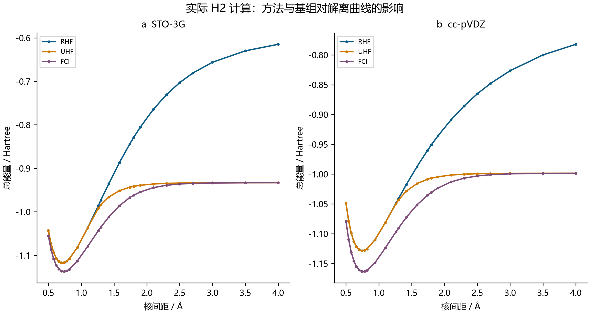

图 2. STO-3G、cc-pVDZ 下，RHF、UHF 和 FCI 在 25 个相同间距处实际计算的 H₂ 总能量。总能量包含核排斥。连线只连接保存点，不代表额外计算。FCI 是有限基组电子比较对象。

### 3.2 拟合改善向电子相关参考的传递有限

相对原 RHF 标签，联合监督改善了三个配对种子在完整测试集和完整 OOD 集上的能量与梯度误差。测试能量 RMSE 从仅能量拟合的 0.000226936–0.000757399 Hartree，降至联合拟合的 0.000090229–0.000216394 Hartree。然而，每个神经模型的测试能量与梯度误差仍高于两个冻结 RBF 模型。神经模型在原九点拉伸 RHF 集上的外推更准确，但该优势仅适用于这一参考和径向区间。

匹配 FCI 比较改变了结果的解释。八个测试几何的 RHF–FCI RMSE 为 0.068653520 Hartree，五个匹配 OOD 几何为 0.208255039 Hartree。即使联合网络相对 RHF 的测试误差低于 0.00022 Hartree，其相对 FCI 的 RMSE 仍约为 0.06864 Hartree。对全部三个配对种子，拟合损失的下降仅使相对 FCI 的测试总误差略有变化（表 3、图 3）。

表 3. 加入梯度监督后能量 RMSE 的相对降低比例。每组比较使用相同几何与初始化种子；此处 OOD 仅含五个匹配点，不是原学习评价中的九个点。

| 划分 | 种子 | 相对 RHF 降低 / % | 相对 FCI 降低 / % |
|---|---:|---:|---:|
| 测试 | 7301 | 73.64861 | 0.021679 |
| 测试 | 7302 | 71.42932 | 0.015494 |
| 测试 | 7303 | 60.24035 | 0.008384 |
| 匹配 OOD | 7301 | 97.44489 | 3.403104 |
| 匹配 OOD | 7302 | 70.12125 | 8.214032 |
| 匹配 OOD | 7303 | 62.52848 | 4.284502 |

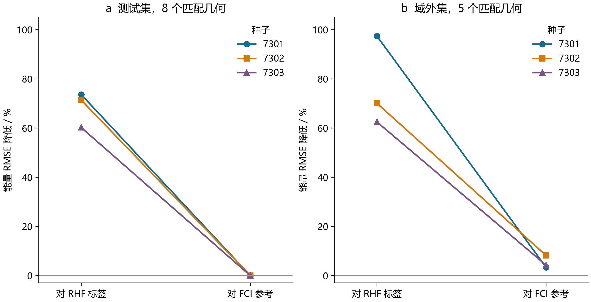

图 3. 从仅能量到联合训练后，在相同几何处以两种参考评价能量 RMSE 的降低百分比。连线标识配对种子。八点测试集与五点匹配 OOD 集分开进行比较。这里是三次运行中观察到的变化，不是置信区间或总体估计。

MSE 分解解释了这种有限传递。联合种子 7301 在测试集上的学习项为 1.64325×10⁻⁸ Hartree²，参考项为 4.71331×10⁻³ Hartree²，交叉项为 −1.47269×10⁻⁶ Hartree²。负交叉项使总误差略小于单独的 RHF–FCI 参考误差；这属于误差抵消，不是学习到了电子相关。三个联合测试拟合的交叉项符号相同。匹配 OOD 上的交叉项为正，使总误差增加。全部十二组恒等式闭合于 1.05×10⁻¹⁷ Hartree² 以内。图 4 保留这些符号，避免正百分比贡献图将其掩盖。

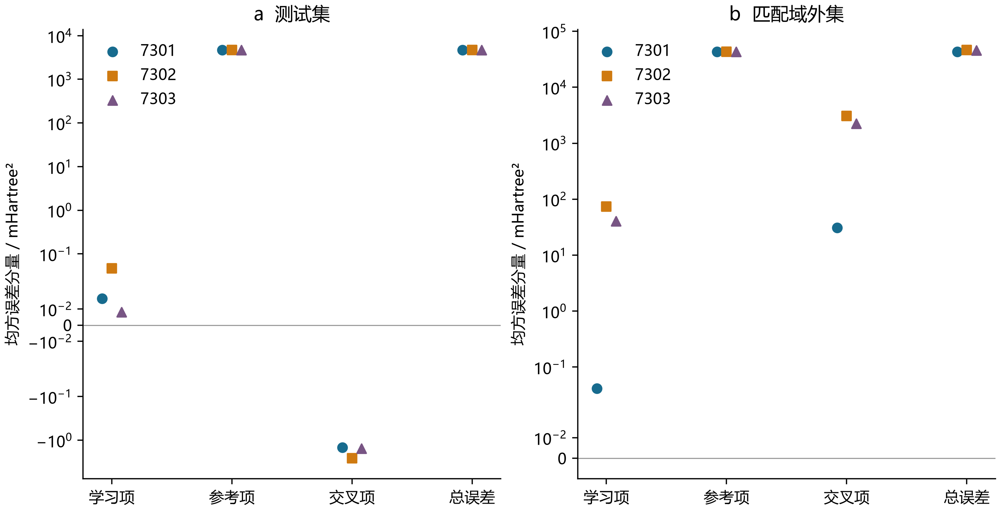

图 4. 三个联合模型的学习、参考、交叉与总均方项。对称对数轴保留负交叉项，数值单位为 mHartree²。几何和电子计算相同，因此各种子共享参考项。各项不是统计独立的方差分量。两面板纵轴范围不同。

模型数学检查仍然成功。36 个变换探针的最大偏差为相应能量与力单位下的 2.22×10⁻¹⁶。72 个完整笛卡尔有限差分案例在 h=10⁻⁵ Å 时，最大力差为 2.22813×10⁻¹⁰ Hartree Å⁻¹。这些结果验证了学习函数的导数一致性与对称性，却未改变参考偏差。三种子集成离散度也不足以构成校准不确定度：能量和梯度均只有 75% 的八个测试误差位于两倍样本离散度内。八个相关距离和三个拟合不能建立对其他分子的覆盖保证。

### 3.3 核计算精度依赖所要求的观测量

在 25 个采样间距上，FCI 参数化 Morse 势相对电子曲线的 RMSE 分别为 STO-3G 0.00757282 Hartree、cc-pVDZ 0.00420654 Hartree。即使精确求解 Morse 势上的核方程，这一模型误差仍存在。最细主网格中，STO-3G 参数的 H₂/D₂ 0→1 能级差为 4722.097/3397.084 cm⁻¹，cc-pVDZ 参数为 4117.259/2966.494 cm⁻¹。相应非谐同位素比为 1.39004412、1.38792116，谐振比则为 1.41386262。图 5 显示相对谐振近似，连续 Morse 能级间距逐渐压缩。本文未计算跃迁强度或进行实验谱线指认。

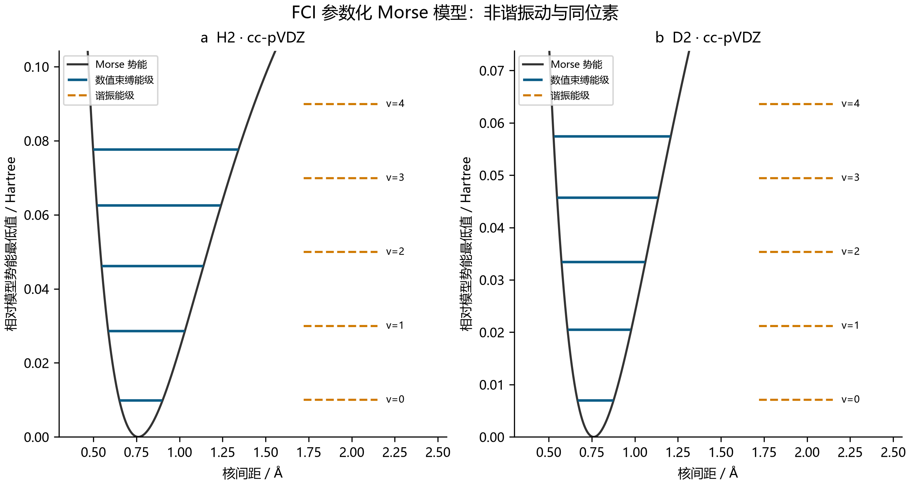

图 5. cc-pVDZ 参数化 Morse 模型上的 H₂、D₂ 能级。实线为主 1200 区间网格得到的前五个束缚能级，虚线为谐振比较。能量以模型最低点为零。该表示不能替代在完整 FCI 曲线上求解核运动。

低能级近似呈二阶收敛，零点能实测收敛阶为 2.00057–2.00093。主网格矩阵残差不大于 1.43×10⁻¹⁴ Hartree，但在最细主网格上，六组光谱各自前三能级中的最大误差相对解析模型仍为 3.975–5.705 cm⁻¹。解离阈值附近，cc-pVDZ 参数化 H₂ 模型在全实轴上有十七个精确束缚态，而 [0,8] Å 区间仅返回十六个。最浅态解析束缚能仅为 6.69637×10⁻⁷ Hartree，振幅衰减长度为 15.0913 Å。因此，足以描述低能级的区间可能遗漏具有长尾的状态。

追加研究还显示边界误差与网格误差可以相互补偿。在 48 Å、7200 个区间下，全部十七态均已找到，但浅束缚态束缚能相对误差为 125.201%；其绝对束缚能误差约为同一本征问题矩阵残差的 1.72×10⁸ 倍。在 96 Å、115200 个区间下，单网格束缚能误差降至 1.564%，矩阵残差却增至 1.26610×10⁻¹² Hartree。若只按代数残差排序，就会颠倒这些计算的物理精度次序（图 6a）。残差与束缚能误差不是可互换的误差界。

表 4. 浅束缚态束缚能的固定边界二阶外推。有符号误差相对于精确全实轴 Morse 值。这些是由归档本征值获得的新算术估计，不是新增能谱。

| 边界 / Å | 细网格区间数 | 细网格误差 / % | Richardson 误差 / % |
|---:|---:|---:|---:|
| 48 | 14400 | 25.76358 | −7.38220 |
| 48 | 28800 | 5.20144 | −1.65261 |
| 96 | 115200 | 1.56403 | −0.02688 |

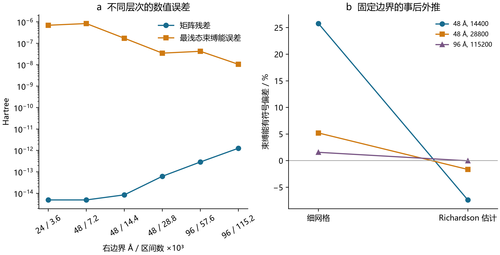

图 6. (a) 已返回十七个束缚态的保存本征问题，其矩阵残差与浅束缚态绝对束缚能误差；(b) 细网格与固定边界 Richardson 误差。96 Å 估计改善了与解析 Morse 参考的一致性，不证明电子参数化的准确性或普遍外推保证。

最细 96 Å 外推束缚能为 6.69456672×10⁻⁷ Hartree，相对解析值的有符号偏差为 −0.026882%。精度较低的 48 Å 外推仍保留更大误差，与尚未消除的边界效应及高阶离散项一致。96 Å 仅有两个网格，尚未通过第三个细网格独立检验主导阶外推。4000 K 时，仅束缚态振动 F 误差由粗长区间网格上的约 −4.14×10⁻⁶ Hartree，降至最细网格上的 −6.46×10⁻⁸ Hartree。因此，较不敏感的配分和可能看似令人满意，但最浅单个状态仍不准确。本比较不包含连续谱、转动、平动、核自旋统计或溶剂贡献。

## 4 分子系综与参考对齐

### 4.1 以明确证据单位为基础的历史审计

这两个历史仓库提供了一条值得纳入论文的比较主线：科学工作流程越来越复杂，而支持其结论所需的证据也必须逐层增加。这里的核心结果不是“完成了多少软件模块”，而是一组可以追溯的实例：实现检查通过、计算正常收敛或报告中的指标较好，都不足以自动建立下一层科学主张。它们与正文中的 H₂ 误差链互为补充，说明相同问题也存在于溶解度学习、构象筛选、变分蒙特卡洛、电化学时间序列以及带电分子能量比较中。

本次审计以 2026 年 9 月 29 日核查的远程 HEAD 为固定版本：`aqueous-solubility-ml-benchmark` 的提交为 `5939547a936ed4baf7fa7ee9fac6fa6e90bfa8fe`，`ai4chem-complex-scaffolds-benchmark` 的提交为 `5e19c519dbd11430926828fddf5375b919af67f0`。前者只有 1 次提交，后者有 54 次。最关键的关系是：水溶性仓库的整个初始提交，正是复杂骨架仓库历史的根提交。两个固定版本中的 5 个继承 Python 文件和 4 个继承 PNG 文件具有完全相同的字节哈希。因此，它们属于同一份科学记录，不能作为两次独立重复验证。后续历史增加了阶段模块、数值修正、重新执行后的验收记录、目录迁移和第 28—31 阶段；把文件移入新的项目文件夹，本身不构成一次新计算。[历史清单](../history/learning/sources/complex_history.csv)保留了全部提交标题及审查类别，但这不意味着本次穷尽复核了每个历史差异和每条大型轨迹。

表 5. 固定版本证据、工作量单位与可复现边界。

| 证据对象 | 历史数量 | 计数单位 | 本次审计状态 |
|---|---:|---|---|
| 水溶性仓库 | 1 | 提交 | 共同祖先；没有保存逐分子预测行 |
| 复杂骨架仓库 | 54 | 提交 | 阶段与审计历史；不能相加为样本量 |
| 完全相同的继承代码与图像 | 9 | 文件 | 字节级重复已核实 |
| 第 01 阶段 | 500 | 验收通过的力场优化记录 | 10 个有效结构；原版与审计版的舍入能量一致 |
| 第 11 阶段 | 100 | 保存的 VMC 生产块均值 | 5 个体系；4,050 个训练轮次；没有保存波函数权重 |
| 第 28 阶段 | 196,496 | 已发表轨迹数据行 | 按轨迹分别计有 39,726 个不同时间戳；电极数量未核实 |
| 第 29 阶段 | 156 | 历史 xTB 执行次数 | 144 个不同设置；12 次执行重复此前设置 |
| 第 29 阶段 DFT 交叉比较 | 8 | 收敛单点作业 | 4 组电荷态配对；8 行 GFN 配对比较 |

随附数据包保留原始 MIT 声明，并在 [audit.json](../history/learning/audit.json) 中记录固定提交、原路径、原始 SHA256、JSON 指针和 CSV 选择条件。来自出版商数据的数值摘录继续保留 DOI 与原工作簿哈希；将这些事实性数值纳入分析，不表示第三方材料的权利转移为仓库 MIT 许可。已通过出版商主来源核对论文元数据，但在线许可全文受到身份重定向限制，未成功读取。因此，本数据包不再分发出版商论文正文、原始图像或完整工作簿，也不自行声称这些第三方材料均采用 CC-BY。确定性的[事后分析脚本](../history/learning/sources/recompute_history.py)只使用 Python 标准库，不导入或执行原来的科学程序。脚本检查来源哈希并重新计算表中算术，不新增电子结构作业、神经网络训练、分子优化或实验。本次历史审计也没有重新解析全部原始求解器日志；下面的结论依据所保留的单作业结果文件、执行台账和数值输出，范围明确限定在这些证据以内。

### 4.2 溶解度：合理的协议不等于已重建的基准结果

原水溶性流程将 11 个 RDKit 描述符与半径为 2、长度为 2,048 位的 Morgan 指纹结合，总特征维度为 2,059。源代码规范化 SMILES、删除不能解析的结构、对相同规范 SMILES 的标签取平均，然后采用随机种子 42 的打乱五折交叉验证。单独的 ESOL 留出集采用相同种子的随机 20% 划分。在头对头比较的两个模型训练之前，程序从 AqSolDB 中删除与 ESOL 测试分子规范 SMILES 完全相同的记录。这是一项明确的分子身份重叠控制，但不能因此认为已经实现骨架隔离、来源实验室独立、相近类似物系列分离或测量条件统一。固定仓库中没有保存骨架划分结果，也没有多随机种子的性能分布。

README 报告五折 R² = 0.815、RMSE = 1.019 个对数单位；随后报告同一 226 分子测试集上的随机森林 RMSE = 0.803、梯度提升 RMSE = 0.635，并称从 AqSolDB 排除了 222 个重叠分子，相应 R² 分别为 0.864 和 0.915。这些数值在本研究中仍属于**历史报告层证据**。固定提交保存了代码和栅格图，却没有保存逐分子预测表、原始标签快照、固定划分标识、拟合模型或执行日志，因而无法只凭该提交重建这些指标。本次没有从散点图像素反推出预测值，也没有重新训练模型。因此，报告中的 20.9% 改善不能像已经独立复算的基准结果一样，与完整保存的机器学习试验合并统计。

源代码还澄清了历史“旧 ESOL 模型”表述中的歧义。在头对头比较脚本中，四描述符随机森林与描述符加指纹的梯度提升器，实际上都在过滤后的 AqSolDB 训练行上拟合。单独的 `esol_model.py` 确实在 ESOL 训练数据上建模，但那属于另一条执行路径。这里的头对头比较同时改变了输入特征和估计器类型，不能把性能差异单独归因为更多训练数据、指纹表示或算法架构。一个随机留出集可以在其协议内提供参考，但不足以证明工业可靠性，亦不能证明对复杂天然产物的结构外推能力。

紫杉醇例子进一步说明，化学解释需要独立证据。程序采用未指定立体化学的输入字符串和二维特征。较低的预测溶解度、或者某个指纹位，都不能证明某个具体分子内氢键存在，也不能证明极性表面在构象系综中被埋藏。代码打印出的参考单位换算也需要更正：按报告的分子量 853.9 g mol⁻¹，0.3—1 μg mL⁻¹ 对应以 mol L⁻¹ 为单位的 log₁₀ S = −6.454286 至 −5.931407，而不是原程序打印的 −6.1 至 −5.6。这只是对所述浓度范围的量纲算术核查，不是对该实验范围真实性的独立验证。AqSolDB 的主来源论文能证明数据集的身份与设计，却不能验证这个仓库的具体拟合模型及其分子解释。[@aqsoldb]。

### 4.3 构象筛选刻画采样行为，不是训练模型的精度试验

最初的复杂骨架基准保存了 11 条输入记录。其中原始螺烯输入 M09 在 Kekulé 化时失败，该失败保留在记录中；M09R 则明确标识为另一个修复参考。因此，完成计算的面板包含 10 个有效结构。审计输出显示，每个有效结构都产生了 50 个嵌入且收敛后被接受的优化记录。9 个结构使用 MMFF94，含硼的 M07 因力场覆盖问题而使用 UFF。总数 500 指的是验收通过的优化记录数，不是不同局部极小点数、独立实验数或量子计算数。原版与审计版 JSON 中，所有 10 个有效结构的舍入最小能量、最大能量与能量范围均相同。修正验收策略对未来输入有价值，但现有保存结果并没有显示这次策略修正使这些结构的最低能量得到改善。

表 6. 审计后的构象能量范围；保留力场和片段边界。能量单位为 kcal mol⁻¹。

| 结构 | 力场 | 验收记录 | 最小能量 | 最大能量 | 保存的范围 | 几何 IMHB 数 |
|---|---|---:|---:|---:|---:|---:|
| M01 | MMFF94 | 50 | 67.37 | 110.42 | 43.06 | 2 |
| M02 | MMFF94 | 50 | 106.33 | 114.92 | 8.59 | 0 |
| M03 | MMFF94 | 50 | 29.16 | 41.33 | 12.17 | 1 |
| M04 | MMFF94 | 50 | 71.34 | 82.83 | 11.48 | 1 |
| M05 | MMFF94 | 50 | −0.15 | 7.72 | 7.87 | 0 |
| M06 | MMFF94 | 50 | 38.04 | 65.47 | 27.43 | 1 |
| M07 | UFF | 50 | 78.56 | 78.82 | 0.26 | 0 |
| M08 | MMFF94 | 50 | 8.43 | 15.27 | 6.84 | 0 |
| M09R | MMFF94 | 50 | 97.19 | 97.19 | 0.00 | 0 |
| M10 | MMFF94 | 50 | 123.99 | 139.09 | 15.11 | 0 |

表中采用保存的能量范围，而不是用已经舍入的两个端点再相减；分别舍入可能带来 0.01 的差别。不同化学组成之间不能直接用这些绝对能量进行稳定性排序，UFF 与 MMFF94 也不能合并成一个统一可比的能量标尺。M03 是两个未连接片段组成的输入，其图表示与三维优化仅针对最大片段，而部分整体描述符对应全部输入。因此，若把这一行称为“完整连接的降解剂构象”，就会混用两个不同的分子对象。M09R 的能量范围在所存精度下为零，也不能证明找到了 50 个彼此不同的构象极小点。

历史标志 `ENTROPY` 根据能量范围阈值赋值，但能量范围并不是热力学熵：该标志没有建立平衡占据、简并度或平衡概率测度。几何规则计数的分子内氢键接触也只是给定距离和角度阈值下的结构诊断，不是测得的氢键自由能。图神经网络检查验证的是这些输入的特征与张量能否兼容，而没有训练后的性质预测。因此，这一基准支持的是输入适用性和构象采样审计，不能说明二维网络在定量预测上已经被击败，也不能证明三维学习优于二维学习。它与正文完整监督的 FreeSolv 案例形成有意的区分：前者检查表示和数据结构能否运行，后者才在指定划分下测量标签预测误差。

### 4.4 神经波函数：内部数值检查与精度失败可以在同一次计算中并存

第 11 阶段是历史材料中最有力的配对反例：同一次完成的计算同时保留了通过的内部检查和未达到的精度目标。新鲜执行保存了 5 个体系，每个体系使用 2,048 个 walker，并保存 20 个生产块均值。训练安排为平衡 H₂ 1,200 轮、三个拉伸 H₂ 各 550 轮，以及 He 1,200 轮，合计 4,050 轮。保存结果中的反对称性最大偏差为零，自动微分与有限差分拉普拉斯的相对误差为 3.515304 × 10⁻⁷。这些诊断验证了指定数值运算，却没有给变分试探波函数误差或最终能量的统计不确定性提供上界。

本次对每个体系分别从 20 个保存的块均值独立重算 Ē = Σᵢ Eᵢ/20 与 SE = s(Eᵢ)/√20。比较参考是历史计算保存的 FCI aug-cc-pV(T,Q)Z 完备基组外推值，不是没有误差的连续空间精确能量。还必须注意，体系名称中的键长单位是 **bohr**，而 QuantumEqui 扫描采用 ångström。因此不能仅凭数值相同的键长标签，把这两个研究直接连接起来。二者的基组与参考定义也不同，不能作为相同参考条件下的重复试验处理。

表 7. VMC 点估计及独立重算的块标准误。能量单位为 Hartree，误差和 SE 单位为 mEh。

| 体系 | VMC 能量 | 计算参考 | 有符号误差 | 块 SE | 绝对误差阈值 | 点估计验收 |
|---|---:|---:|---:|---:|---:|---|
| H₂，R = 1.4011 bohr | −1.173979102 | −1.174441940 | 0.462837 | 0.321004 | 1.600000 | 通过 |
| H₂，R = 2.5 bohr | −1.093561268 | −1.093943014 | 0.381746 | 0.203228 | 1.600000 | 通过 |
| H₂，R = 4.0 bohr | −1.015835784 | −1.016336946 | 0.501162 | 0.133787 | 1.600000 | 通过 |
| H₂，R = 6.0 bohr | −0.999316513 | −1.000740584 | 1.424071 | 0.390502 | 1.600000 | 通过 |
| He | −2.902038144 | −2.903699030 | 1.660887 | 0.564223 | 1.600000 | 未通过 |

在不改变 1.6 mEh 阈值的前提下，4 个点估计通过，He 未通过。有不确定性并不能把失败的点估计改写为通过；同样，点估计通过也不代表已经给出了置信界意义上的精度保证。较早的验收审计利用同样的 20 个块均值，报告 He 的独立同分布块 bootstrap 有符号误差区间为 [0.595197, 2.746738] mEh，6 bohr 拉伸 H₂ 为 [0.667166, 2.165752] mEh。本节保留这些历史区间作为描述性重分析，没有把它们称为新的蒙特卡洛观测。它们假定块之间独立，且未包含参考外推误差。只有 20 个块均值，并不能证明相关性已经充分消除。

尖点条件的证据边界更窄。保存的电子—核和电子—电子方向斜率为 −2.430565 与 −1.862306，但它们来自有限半径单一射线上的对数密度拟合，而不是球面平均后再取聚合极限。后来添加的角平均诊断只在一个解析函数上测试，并未用于已经训练好的网络。由于没有保存波函数 `state_dict`，仅凭当前历史文件无法进行冻结模型的尖点复测或独立重采样，除非重新训练。修改未来版本中的标签也不能反过来验证旧图。这说明，保存损失曲线和几个数值能量，仍不足以支持可复现的学习型波函数主张。

### 4.5 已发表时间序列：重复时间戳与目标统计量的敏感性

第 28 阶段重新分析了两篇有机电催化原始研究随文公开的数值源数据。2023 年 Nature 记录提供恒电位与恒电流轨迹，2026 年 Nature Synthesis 记录提供更长的恒电流轨迹。这些是此前发表的实验观测，不是本论文实施的新实验。数据包保存原工作簿哈希及工作表、列位置：较早研究对应 Figure2g 的 A:B 与 D:E 列，后续研究对应 2h 工作表的 A:B 列。[@yang2023; @yang2026]。

三条轨迹一共包含 196,496 行数值，但分别按轨迹计算，只有 39,726 个不同时间戳。相同时间的多个条目不能被称为独立电极或独立失活事件。相同时间戳组的大小还可能改变端点统计量的权重，所以保存的分析同时给出逐行中位数与平衡各时间戳权重后的中位数。2023 年恒电位轨迹的电流纵坐标归一化仍未解决，因此只能用源数据纵坐标单位报告，不能默默换算为绝对电流或面积归一化电流。观测结束只是记录受到截断，不等于观察到了失效时间。

表 8. 轨迹重复程度及端点变化对分析窗口的敏感性。恒电流轨迹变化量单位为 V；恒电位轨迹采用其归一化未解决的源电流纵坐标单位。

| 轨迹 | 行数 | 不同时间戳 | 重复比例 | 平衡后的 1 h 变化 | 全部窗口变化范围 | 启动排除 ≥10 h 后的变化范围 |
|---|---:|---:|---:|---:|---|---|
| Nature 2023，恒电位 | 43,112 | 13,246 | 0.692754 | −0.156250 | [−0.156250, 0.0428125] | [−0.023750, 0.021250] |
| Nature 2023，恒电流 | 18,750 | 7,707 | 0.588960 | 0.044250 | [−0.004000, 0.044250] | [−0.004000, 0.009250] |
| Nature Synthesis 2026，恒电流 | 134,634 | 18,773 | 0.860563 | 0.017000 | [0.003000, 0.017000] | [0.003000, 0.006000] |

72 组保存的窗口设置揭示了目标统计量选择的重要性。2023 年恒电流轨迹采用默认的平衡后一小时差值时，结果为 44.25 mV；若排除最初至少 10 h，变化量则介于 −4.00 与 9.25 mV 之间。2026 年轨迹相应的范围由全部设置下的 3—17 mV 缩小到排除启动阶段后的 3—6 mV。这些变化均来自相同的保存轨迹，不是电极之间的不确定性区间。若事后挑选最小变化量，那是分析口径选择，不能被当作耐久性改善的证据。图 9 展示完整窗口网格，并明确标出启动阶段排除规则，保留全部统计口径。

另外的源数据工作表保存了 50 条随时间变化的均值和标准差记录，原图注称每项基于 4 次独立实验，但没有提供逐重复观测值。24 h 的最终氯气产量均值为 0.338190 mol，最终法拉第效率均值为 99.792360%。历史均值区间依赖重复独立性和分布假定；跨时间点比较还依赖未知的协方差。因此仓库保留的是相关系数敏感性分析，而不是凭空重建重复实验轨迹。某一观测时间内的高选择性，不能自动识别失活风险、寿命分布、反应机制或工业更换周期。若数字孪生优化器把这些量作为目标，其统计定义和采样单位应先于优化过程明确下来。

### 4.6 带电分子能量：先明确参考，再比较方法

第 29 阶段在最初 12 次分子 xTB 单点的基础上增加了一个 144 次调用矩阵，由 12 个分子、2 个 GFN 版本、3 种环境和 2 种电荷/自旋态组成。扩展矩阵重复了最初的 12 个设置，所以历史执行总数为 156，但两轮合计只有 144 个不同设置，其中扩展新增的设置为 132。扩展的全部 144 次调用都记录了正常终止和 SCC 收敛，同时全部保留了浮点数值警告。本次从保存的电子能量重新构造 72 个电荷态差值，与原表算术一致，但减法能够复现不代表已经验证了溶液中或电极上的物理精度。

独立交叉比较包含固定 MMFF 阳离子几何上的 8 次收敛 PBE0 作业：Q01—Q03 的 def2-SVP 阳离子/自由基配对，以及 Q01 额外的 def2-TZVP 配对。分子对应关系为 Q01/P01 吡啶、Q02/P04 3-甲氧基吡啶和 Q03/P09 吡啶-3-甲腈。每组方法配对的几何哈希一致。这里定义 ΔE = E（自由基，电荷 0）− E（阳离子，电荷 +1），每组内部使用完全相同的核坐标。这些量是指定模型态之间的能量差，不能直接称为实验氧化还原电位、界面势垒或产物选择性。

原始 GFN—PBE0 差值约为 GFN1 的 −5.86 至 −5.59 eV，以及 GFN2 的 −4.89 至 −4.81 eV。不同方法处理不同电荷态时具有不同的电子能量参考，因此不能把这些未对齐的差值标为相对于物理真值的“预测误差”。较容易解释、但仍有限定条件的比较，是先移除公共 Q01 偏移：δM(Q) = ΔEM(Q) − ΔEM(Q01)，然后计算跨方法双重差值 δGFN(Q) − δPBE0(Q)。这样的相减可消除同一方法共同的常数电荷态偏移，同时保留随分子变化的差别；它并没有校准氧化还原电位。

表 9. 配对的 def2-SVP 参考对比及双重差值，单位为 eV。PBE0 是比较方法，不是实验真值。

| 分子 | PBE0 ΔE | PBE0 以 Q01 为中心 | GFN1 以 Q01 为中心 | GFN2 以 Q01 为中心 | GFN1 双重差值 | GFN2 双重差值 |
|---|---:|---:|---:|---:|---:|---:|
| Q01/P01 | −4.957325 | 0.000000 | 0.000000 | 0.000000 | 0.000000 | 0.000000 |
| Q02/P04 | −4.776458 | 0.180867 | 0.166602 | 0.162533 | −0.014265 | −0.018334 |
| Q03/P09 | −5.689793 | −0.732468 | −0.475732 | −0.678319 | 0.256736 | 0.054149 |

两个非母体分子的结果说明，一致性依赖分子身份。Q03 的 GFN1 双重差值为 0.256736 eV，GFN2 为 0.054149 eV；而 Q02 的结果分别为 −0.014265 与 −0.018334 eV。Q01 从 def2-SVP 到 def2-TZVP 的增量为 −0.039814 eV，这一单分子检查不能证明其他分子的基组收敛。自由基 S² 介于 0.770825 与 0.776918 之间，而纯双重态的参考值为 0.75；此外没有完成波函数稳定性检查。这组 DFT 对比没有包含几何弛豫、弥散基组研究、热修正、反离子、电极参考或显式界面。

更大的矩阵还保留了排序的不稳定性：气相 GFN1 与 GFN2 比较中，66 个分子对有 6 对次序反转；GFN1 的气相与乙腈比较有 7 对反转。这是在保存几何和指定面板内部的方法敏感性计数，不是域外准确率。它与正文 H₂ 参考偏差分解构成互补：H₂ 链条具有明确的有限基组 FCI 比较对象，而带电分子链条首先需要物理上合理的参考对齐，并且依旧缺少外部目标验证。

### 4.7 历史验收门槛与有边界的方法学创新

表 10. 后期阶段的主要证据边界；这些单位不能相加成为单一“总计算量”。

| 阶段 | 保存的数值范围 | 最强可支持结论 | 缺失或失败层次 |
|---|---|---|---|
| 24 | 312 个模拟测量；312 个 QC 通过 | 分析与采集流程能处理合成响应 | 0 次新实验；没有硬件或化学验证 |
| 25 | 各试跑合计 25 个已审计初步 xTB 极小点 | 局部分子极小点及部分亚胺计算 | 选择性未判定；缺少验收通过的 DFT TS/IRC |
| 26 | 48 个条件条目；3 个干表面种子 | 界面研究设计与初始对象 | 0 个完整溶剂化界面 |
| 27 | 6 成员设计；3 个激发窗口 | 文献坐标与分析准备 | 0 条新非绝热轨迹 |
| 29 | 8 次收敛 PBE0 单点 | 同几何方法比较 | 0 组已验证 TS/IRC；同对反应位点切换未证实 |
| 30 | 碳残差 −4.11658 × 10⁻¹⁹ mol s⁻¹；热残差 −7.43849 × 10⁻¹⁵ W | 降阶情景的守恒及数值检查 | 未校准；没有 DFT/AIMD 或工业验证 |
| 31 | 18 个收敛 MMFF 构象 | 有界本地分子工程试跑 | 0 条 FEP 轨迹；0 个验收通过的先导候选 |

机器可读的覆盖清单对较早阶段采用同样的原则。第 04 阶段的独立鞍点精修，不能反过来使原先未收敛的 NEB 成为收敛路径，也不能补出尚未验证的 IRC。第 05 阶段保留多个虚频与接近零的产率，第 06 阶段完成了轨迹但产物区采样不足。第 03、07、08 及 12—16 阶段仍存在待完成或未完整验收的科学范围。第 09—10 阶段属于协议或控制模型，第 17—19 阶段主要有受限的原子、数值或几何验证，第 20—23 阶段则使用有效输运、光学、自旋或电路模型。它们出现在 Git 历史中，不等于已经在实验室实现。阶段编号是模块标识，而不是科学成熟度等级。

这些历史证据支持提出一种可以进一步检验和复用的方法学贡献：任何主张都应连接到具体的对象身份、参考定义、采样单位、计算状态和验收门槛。其价值超过一般性的“倡导可复现”，因为这里保存了配对反例：同一次 VMC 运行通过内部检查，却未达到 He 的点精度目标；同一分子几何上的多种方法正常收敛，但比较仍受电子参考定义影响；同一条实验时间序列在不同启动窗口下给出不同的表观漂移。其他比较则明确不是配对证据：缺少预测表的溶解度 README 不能与冻结的监督学习基准等同，力场构象面板也不能被提升为 GNN 精度测试。把这些情况分开，能够避免文字叙事超出数据支持范围。

图 7—11 展示了整理后的历史比较：单独标识 UFF 的逐结构构象范围，显示保存块标准误和固定精度门槛的 VMC 有符号误差，三条已发表轨迹的完整启动/窗口敏感性，原始与 Q01 中心化分子能量对比，以及完整的方法/环境排序反转矩阵。五组图均由附带 CSV 生成并保留负面结果。它们展示的是重新组织与复算的历史证据，不会增加原记录中的实验数、训练次数或独立样本量。

<!-- historical figures -->

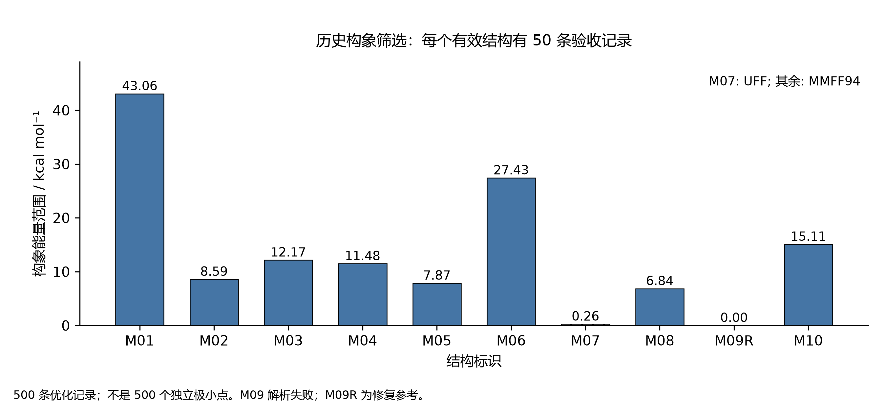

图 7. 历史构象能量范围。每个有效结构有 50 条验收优化记录；阴影线 M07 使用 UFF，其余使用 MMFF94。能量范围不是熵，也不能建立不同极小点的数量。 [SVG](../history/learning/figures/Figure_L1_Conformer_chinese.svg).

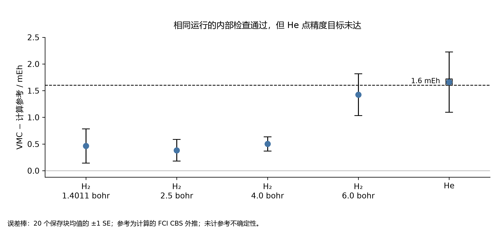

图 8. VMC 相对于保存的 FCI CBS 计算参考的误差。误差棒为每体系 20 个保存生产块计算的 ±1 块标准误，未包含参考误差。1.6 mEh 虚线是未改变的点估计验收门槛。键长单位为 bohr。 [SVG](../history/learning/figures/Figure_L2_VMC_chinese.svg).

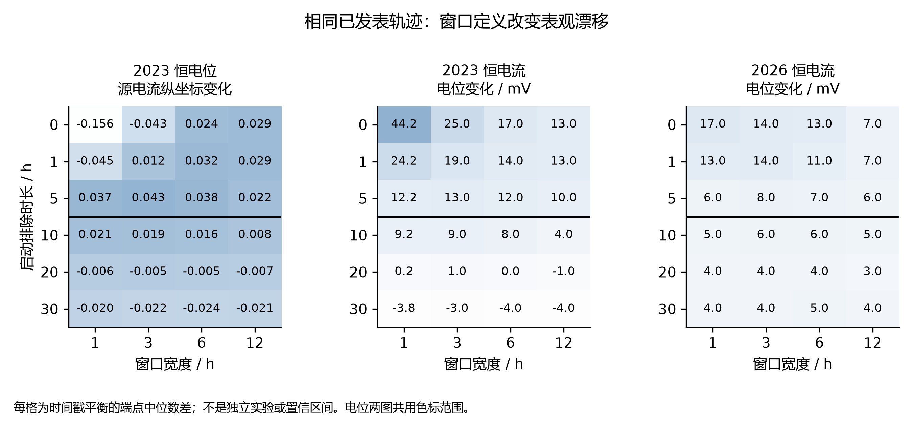

图 9. 同样三条已发表轨迹在全部 72 组保存窗口设置下的端点差值。电位图共用 −5 至 45 mV 色标；源电流图采用独立的 −0.16 至 0.05 色标，其电流归一化未解决。黑色分界线标记启动排除至少 10 h。数值是描述性差值，不是独立重复实验的置信区间 [@yang2023; @yang2026]。 [SVG](../history/learning/figures/Figure_L3_Trace_Windows_chinese.svg).

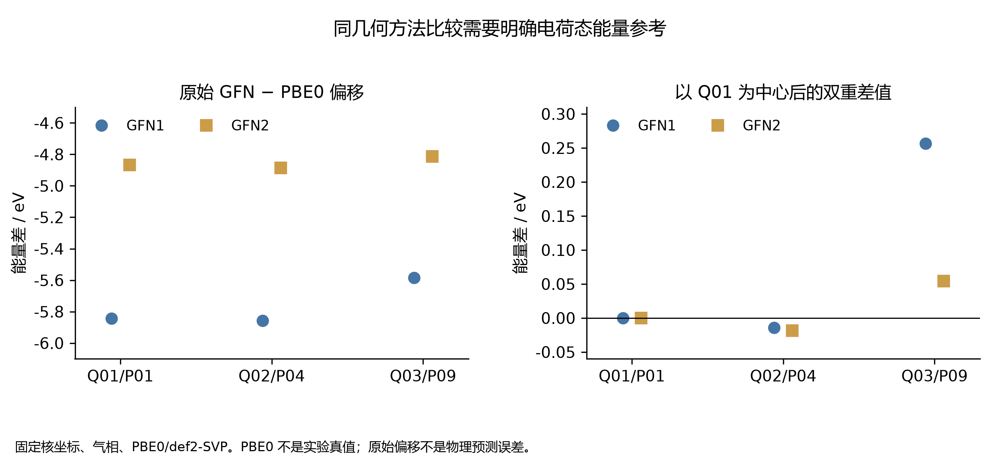

图 10. 固定几何、气相条件下与 PBE0/def2-SVP 的比较。左图为原始电荷态偏移；右图为各方法减去自身 Q01 数值之后的双重差值。两图有意采用不同纵轴范围。PBE0 是方法比较对象，原始偏移不是经过校准的物理预测误差。 [SVG](../history/learning/figures/Figure_L4_Reference_Alignment_chinese.svg).

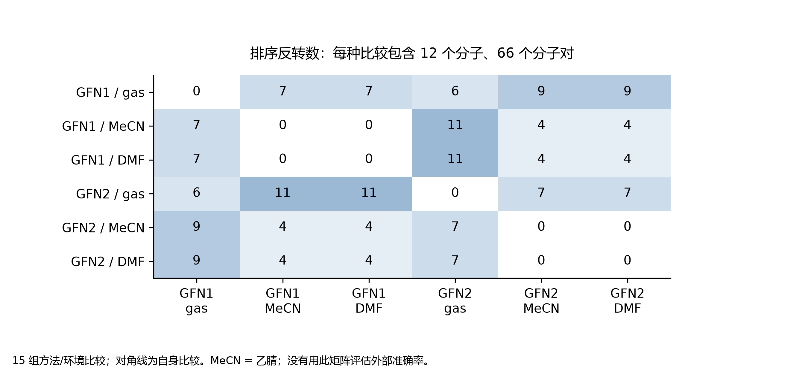

图 11. 由 72 个态差值形成的全部 15 组方法/环境比较。每个非对角格统计相同 12 个分子的 66 个配对中的排序反转数，不是新计算数或相对实验的错误数。对角线零值来自自身比较。 [SVG](../history/learning/figures/Figure_L5_Rank_Reversals_chinese.svg).

## 5 催化态质量与路径推断边界

### 5.1 研究范围、来源与证据计量单位

公开的 `pincer-catmech-ai` 档案为主文提出的分层验证框架提供了一个互补案例。H₂ 研究可以在定义明确的坐标上进行受控比较，而催化档案同时包含性质不同的对象：分子电子结构作业、人工构造的溶剂团簇、尚未完成验证的反应路径、用于监督学习的构象能量标签，以及合成动力学测试体系。这些对象出现在同一仓库，并不意味着已经形成经实验验证的完整催化机理。本节的目标是追踪原始计算记录经过各级接受条件后，究竟支持哪些结论。

审计将公开仓库固定在提交 **2edffb123791bd61acbfdeff763f603ee50c2287**，并独立核实其与远程 HEAD 和 main 分支一致。该版本晚于本机历史检出版本 9aa9c08b15f2f64b3f108e4a90e0f8ec0a4352c0。仓库的十次提交涵盖初始工作流、原生程序筛选、Phase 3 自旋与微溶剂化研究、Phase 4 前体检查，以及后续与 Cu–N–P 研究方向有关的分子预检。最后一项只是项目背景，并不代表每次计算的元素组成；尤其是最新的分子 DFT 模型并不含 Cu。提交说明用于建立时间顺序，以下数值结论则来自保存的结果文件，而非从提交标题推断。

[来源目录](../history/catalysis/sources/catalog.json) 为每个来源分配 C 或 N 编号，并记录固定提交、仓库路径、Git 对象标识、原始字节 SHA-256、保留摘录的哈希，以及 JSON 指针或 CSV 行选择器。C01–C24 涵盖精选数据和来源许可记录，N01–N10 对应独立能量检查所用的原生输出日志。各表数值均对应这些来源，六个 `posthoc_*.csv` 文件还为每个派生数据行记录证据标识和算术公式。本次从原生日志重新提取了十个最终电子能：Phase 3 的八个收敛状态，以及后期完成的两个分子 DFT 状态。它们与相应机器可读记录在存档精度下全部一致，最大绝对差为 0.0 Hartree。这证实的是数据转录一致性，而非电子结构方法的独立准确性。本次审计没有启动新的量子化学作业。

计数保留原有单位：目标槽位不等于实际启动的计算，SCF 解不一定是极小值，构象对不等于独立催化剂，为远程计算机准备输入也不等于已经提交作业。Phase 3 的准备状态表包含 24 个设计，每个设计有 40 个温度/碱条件组合，因此得到 960 行，但拟议的 18 步动力学机理对应的已接受物理预测数量为零 [C01]。其中 383.15 K 基准温度和 0.05 当量总添加 tBuOK 是场景输入。总碱量不能决定游离阴离子活度，醇的活度也未经测量。因此，设计网格的乘积反映记录范围，而不是受到实验约束的预测数量。

### 5.2 自旋筛选：收敛状态不等于交叉点

主要垂直自旋矩阵采用 PBE/STO-3G、35 × 110 积分网格和 SOSCF，电子能与密度收敛目标分别为 10⁻⁸ 和 10⁻⁶；对 18 个设计设置名义多重度 1、3、5 [C03]。这些计算使用给定几何，身份与连接关系检查本身不足以确认所提出的活性物种。档案包含 54 个目标槽位，其中实际启动 48 次物理状态计算，40 次超时、六个来源几何缺失，八个状态收敛。该计数只描述指定矩阵，并非仓库中全部探索性方案的合计。

**表 11. 存档垂直自旋矩阵中的接受数量。** 来源为 C02–C06；精确选择器和算术位于 [posthoc_spin_gates.csv](../history/catalysis/sources/posthoc_spin_gates.csv)。各行代表不同接受阶段，并非互不重叠的样本。

| 记录或接受阶段 | 数量 |
|---|---:|
| 目标状态槽位 | 54 |
| 实际物理状态计算 | 48 |
| SCF 收敛状态 | 8 |
| 通过自旋与身份筛选的状态 | 6 |
| 可计算的原始垂直能隙 | 1 |
| 合格的诊断能隙 | 0 |
| 已接受的 MECP | 0 |

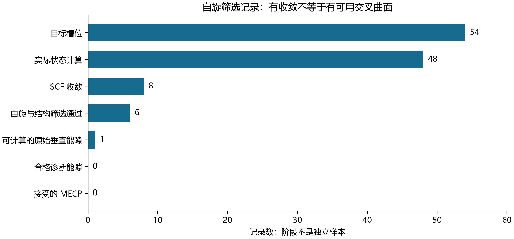

**图 12.** 固定提交自旋审计中各阶段的数量。原始能隙行计量能量差，前面的行计量状态，因此该图展示的是证据推进过程，不能视为独立抽样或统计生存曲线。[矢量图](../history/catalysis/figures/Figure_C1_Spin_Gates_chinese.svg)。

S² 期望值直接体现了“已收敛”与“形成可用自旋对”的差别。Fe_bipyridine_pnnoh_iPr 的收敛三重态具有 ⟨S²⟩ = 2.661445763547917，相对于理想的 S(S+1) = 2，其污染诊断值为 0.661445763547917。Fe_macho_pnp_iPr 五重态具有 ⟨S²⟩ = 6.166902016475518，比理想值 6 高 0.166902016475518。两者均被存档筛选规则标记为不通过。其余六个收敛状态通过了记录中的自旋和身份检查，但这只是必要数值筛选，不能证明它们代表实验催化剂的真实电子态 [C03–C04]。

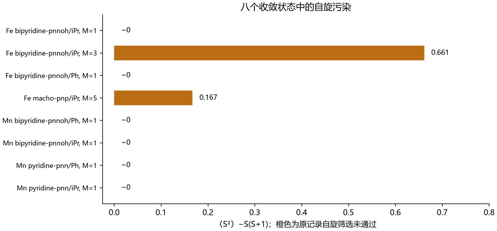

**图 13.** 八个收敛状态记录的 ⟨S²⟩ − S(S+1)，橙色表示未通过原有自旋筛选的状态。M 表示多重度。接近零的数值包括舍入误差量级的负单重态结果，图中显示为约零。[矢量图](../history/catalysis/figures/Figure_C2_Spin_Quality_chinese.svg)。

现有矩阵只能组成一个原始垂直能量差：Fe_bipyridine_pnnoh_iPr 的三重态减单重态为 −0.0314591288624797 Hartree [C05]。由于三重态未通过自旋筛选，该数值不能作为已接受的自旋能级顺序，也不是交叉能量。下游 MECP 记录明确标为 `no_eligible_pair`，量子曲面对评估次数和量子状态计算次数均为零 [C06]。因此，该矩阵并未启动 MECP 优化。这里的零意味着前置条件未通过，既不能说明交叉不存在，更不能解释为已收敛的最低能量交叉点。这一差别对误差传递至关重要：下游程序不能仅凭接收一个数值能量差，就补齐缺失的合格电子态对信息。

### 5.3 微溶剂化：电子缔合与热力学缔合并不相同

微溶剂化数据来自规模受限的构造团簇，而非实验测定的溶剂系综。九次 GFN2-xTB 优化由三个团簇大小与三个起始种子组合而成；全部收敛并保留记录中的连接关系。计算采用 xTB 6.7.1、ALPB 甲苯、extreme 优化设置、0.5 精度参数和 300 K 电子展宽温度 [C09–C12]。每种团簇大小只选取一个采样最低能结构计算 Hessian，因此得到的是三个选定团簇的 Hessian，而不是充分采样的构象配分函数。含一个、两个、三个 tBuOH 的入选结构分别来自种子 2、1、0。

**表 12. 选定微溶剂化结构的缔合量。** 数值单位均为 kcal mol⁻¹。来源为 C09–C12；[posthoc_solvation_selected.csv](../history/catalysis/sources/posthoc_solvation_selected.csv) 记录所选数据行。末列为冻结片段分解中超出成对相互作用之和的贡献。

| tBuOH 数量 | 缔合 ΔE | ΔG，298.15 K，1 M | ΔG，383.15 K，1 M | 超出成对项的贡献 |
|---|---:|---:|---:|---:|
| 1 | −10.994093 | 0.658254 | 3.797726 | 0.000000 |
| 2 | −21.166260 | 3.586112 | 10.220408 | 1.547073 |
| 3 | −31.716522 | 4.105509 | 13.685284 | 3.558360 |

电子缔合能随团簇增大而更加负，并不意味着标准缔合自由能更加有利。在 383.15 K 下，相应的 1 M 自由能均为正，并从 3.797726 增至 13.685284 kcal mol⁻¹。存档热化学同时使用 ALPB 溶剂化和一次 1 atm 到 1 M 标准态修正，每个参与物种都定义在 1 M 标准态。真实溶液中的种群还需要浓度或活度信息，以及充分的构象采样，不能仅由表中数据恢复。上述团簇及其缔合自由能均不包含催化剂、显式 tBuOK 离子对或已接受的过渡态 [C12]。

超出成对项的贡献同样需要严格解释。对于双醇团簇，冻结相互作用能为 −0.9529920930613116 eV，成对项之和为 −1.0200795115757728 eV，两者之差为正，因此并非额外稳定化。三醇团簇相应数值为 −1.4095253966465862 和 −1.5638304890707104 eV。由于各片段在 ALPB 下计算，该分解包含连续介质空腔和反应场贡献的变化，不能视为孤立气相分子的纯电子多体相互作用 [C11]。后续敏感性分析生成 405 行算术结果，没有增加量子作业，并精确重现了 27 行基准热化学数据。在 383.15 K 下，三个团簇大小对应的低频截断敏感范围分别为 0.793212、2.298506、3.465158 kcal mol⁻¹ [C18]。它反映模型选择的影响，不是统计误差棒，也不是实验验证。

### 5.4 质子链路径与动力学测试：保留负结果

质子链研究包含两个独立初始化的路径，以及第一个路径的一次续算。计算采用中性 GFN2-xTB/ALPB 甲苯模型，没有显式钾或游离 tBuO⁻ 物种 [C13–C14]。因此，末次力残差只对该模型路径有意义，总碱活度问题仍未解决。三个记录均未达到 0.07 eV Å⁻¹ 的力目标。继续迭代一条未成功路径，也不会增加一个独立的化学试验。

**表 13. 尚未接受的质子链路径记录。** 能量列是采样路径相对于其反应物参考的最大势能差，并非活化势垒。C13–C14 及 [posthoc_proton_wire.csv](../history/catalysis/sources/posthoc_proton_wire.csv) 提供精确数值和力比值公式。所有行均未获得接受的过渡态。

| 路径记录 | 最后步数 | 力 / eV Å⁻¹ | 力/目标 | 路径最大值 / eV |
|---|---:|---:|---:|---:|
| 起点 1，团簇种子 02 | 100 | 0.375882 | 5.369743 | 1.795702 |
| 起点 2，团簇种子 01 | 100 | 1.347282 | 19.246886 | 4.568802 |
| 起点 1 续算 | 200 | 1.206630 | 17.237571 | 2.391468 |

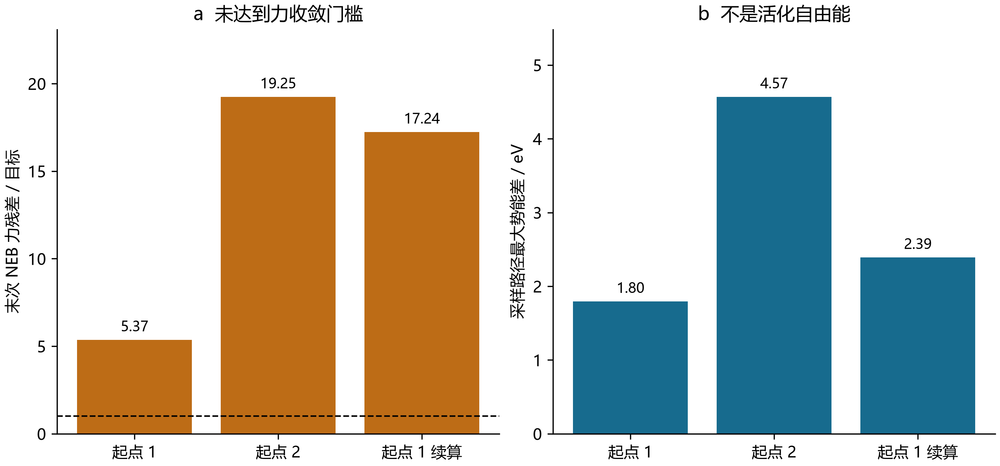

**图 14.** （a）末次力残差除以收敛目标，虚线为一。（b）采样路径的最大势能差。起点 1、起点 2 表示独立初始化顺序，而非团簇种子的数值编号；续算沿用起点 1。未收敛路径不能确立活化自由能。[矢量图](../history/catalysis/figures/Figure_C4_Unaccepted_Paths_chinese.svg)。

只有第二个初始化路径通过了产物图检查。第一个路径及其续算均未通过；即便通过产物图检查的路径，其力残差仍超过目标的十九倍。记录的总耗时为 1182.0914974212646 s，已接受过渡态和活化自由能数量均为零 [C14]。离散路径上出现可见峰值远远不够：端点身份、路径收敛、驻点表征及其与目标反应的连接是不同问题。现有证据尚未同时满足这些条件。

与此配套的动力学代码具有不同的证据用途。其合成测试体系组合八个温度和五个初始游离碱当量，得到 40 个网格条件，每个条件记录 500 个时间点；速率是人为给定的测试输入。解析与有限差分 Jacobian 的最大误差为 9.630873876176338 × 10⁻¹¹，最大金属与碱守恒误差分别为 3.642919299551295 × 10⁻¹⁷ M 和 4.996003610813204 × 10⁻¹⁶ M，金属灵敏度守恒残差为 5.72390984436566 × 10⁻¹⁷ M [C15]。这些结果有助于检查微分方程实现，但不能测定催化周转、确立 18 步机理，也不能替代缺失的活化自由能。账本明确保留了物理催化预测数量为零的结论。

### 5.5 真实训练的 EGNN 及其未改善的基线比较

本档案中的辅助 EGNN 确实接受了训练，与主文其他部分审查的未训练神经势不同，但其证据范围仅限于相对构象能量。数据构建接受 610 个原生程序收敛结构、拒绝 202 条记录，最终形成六个家族、70 个组成组内的 540 个非自配对样本 [C07–C08]。每个组成组的参考结构由最低原始构象编号确定，不按能量挑选。原生优化收敛并不意味着所有结构都已通过 Hessian 极小值验证。

分区按完整的骨架/取代基家族留出，并共同约束金属、状态和构象记录。训练集含四个家族的 374 对样本，验证集含 `macho_pnp|iPr` 的 80 对，测试集含 `macho_pnp|Ph` 的 86 对。这比随机拆分高度相关的原子结构记录更严格，但仍是规模有限、任务特定的档案，不能证明对任意催化剂具有迁移能力。网络有 12,675 个参数，使用 PyTorch 2.10.0，在 CPU 上以两个线程训练。账本记录九个完成或部分完成的 epoch，最佳验证 epoch 为 0，耗时 85.032 s [C07]。

**表 14. 辅助相对能预测与简单基线。** MAE 单位为 eV。等参考能基线预测相对能为零，另一个基线采用训练目标均值。C07 和 [posthoc_egnn_metrics.csv](../history/catalysis/sources/posthoc_egnn_metrics.csv) 保存完整精度与检查点来源。

| 分区 | 样本对 | EGNN MAE | 等参考能 MAE | 训练均值 MAE |
|---|---:|---:|---:|---:|
| 训练 | 374 | 0.286664 | 0.286438 | 0.297798 |
| 验证 | 80 | 0.261617 | 0.259393 | 0.337521 |
| 测试 | 86 | 0.195200 | 0.193999 | 0.260416 |

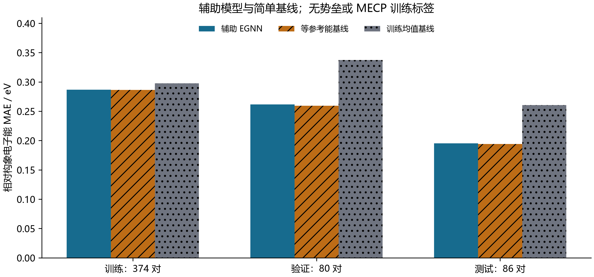

**图 15.** 真实训练的辅助网络及两个基线在各分区的 MAE。目标是相对构象电子能，没有可用于训练相应输出的活化势垒或 MECP 能隙标签。柱形不代表重复训练的不确定性。[矢量图](../history/catalysis/figures/Figure_C3_EGNN_Baselines_chinese.svg)。

网络优于训练均值预测器，但在三个分区中均未优于等参考能基线。测试 MAE 为 0.19519976927396127 eV，高于等参考能基线的 0.19399893976147659 eV，对应“改善量”为 −0.0012008295124846802 eV [C07]。不能只报告较弱基线，从而掩盖没有正向改善的结果。记录中的测试 RMSE 为 0.3845663866708711 eV。活化势垒和 MECP 能隙输出头均没有观测标签，保持未训练状态；540 对辅助能量样本不能赋予这些输出头物理有效性。

检查点级对称性验证检验的是另一种性质。对 float64 旋转、非正旋转、置换和批处理测试，最大标量误差与坐标误差均为 1.7763568394002505 × 10⁻¹⁵，单位分别为 eV 和 Å [C07]。这有力支持该实现在受测变换下的性质，但不变性或等变性误差接近机器精度，仍可与化学预测欠佳同时存在。该结果说明架构验证、标签有效性、基线比较和外部验证必须分开。仅凭保存的分区标签，本节也不追溯性地声称整个开发过程始终完全隔离了测试信息。

### 5.6 后续原生计算缩小了结论范围，并未补齐机理

Phase 4 新增九次本地量子调用，其中三次为 Psi4 作业，六次为 xTB 调用。两个收敛的 Psi4 作业未形成同一方法下可用的自旋对 [C16–C17]，其梯度也不允许把 SCF 收敛解释为几何驻点。

**表 15. Phase 4 同一几何上的自旋试算。** 分子目标为 Fe_bipyridine_pnnoh_iPr，泛函均为 PBE。最大梯度单位为 Hartree bohr⁻¹。破折号表示不可得，不代表零。C17 和 [posthoc_phase4_jobs.csv](../history/catalysis/sources/posthoc_phase4_jobs.csv) 保留能量、耗时及筛选决定。

| 基组；多重度 | 结果 | ⟨S²⟩ | 最大梯度 | 自旋筛选 |
|---|---|---:|---:|---|
| STO-3G；5 | SCF 收敛 | 6.193760 | 0.201560 | 未通过 |
| def2-SVP；1 | SCF 收敛 | 约 0 | 0.035808 | 通过 |
| def2-SVP；5 | 超时 | — | — | 不可得 |

STO-3G 五重态恢复计算能量为 −2533.7232403662692 Hartree，def2-SVP 单重态能量为 −2562.3192161270376 Hartree。由于基组不同，二者之差不是自旋能隙。def2-SVP 五重态在 450.0779999999795 s 后超时。这些作业均不能确立所提出催化物种的化学有效性 [C17]。

六次 xTB 调用服务于另一个目的：对两个各含 62 个原子的晶体学前体分子，分别进行优化、新鲜梯度和完整 Hessian 计算。两者均有 180 个内部振动模且没有虚频，最低频率分别为 33.46886841017446、33.81102119885175 cm⁻¹；新鲜最大力分别为 0.0007802942092995298、0.0007509869895041861 eV Å⁻¹。它们的映射结构 RMSD 为 0.00354291 Å，并不能确立不同势阱 [C19]。这些结果是有用的前体结构模型极小值检查，但不是活性中间体或自旋基态验证。另有六份远程计算输入已准备，实际提交为零 [C16]。晶体学来源及其上游 CC BY-NC 4.0 声明作为 C24 保留；本审计复制许可声明，而非完整外部结构数据集。

后续分子预检使用独立生成的 3-甲基喹唑啉-4(3H)-酮坐标，分子式 C₉H₈N₂O，含 20 个原子、中性态 84 个电子，不含 Cu [C22]。二十次完成的原生 xTB 调用中出现了有价值的驻点反例：初始优化中性结构存在 −50.49 cm⁻¹ 的显著虚频；调整转子并进行 very tight 优化后，54 个振动模中的最低正频率为 78.64 cm⁻¹ [C20]。可接受结论仅为 xTB 模型极小值，不是 DFT 极小值或实验结构。

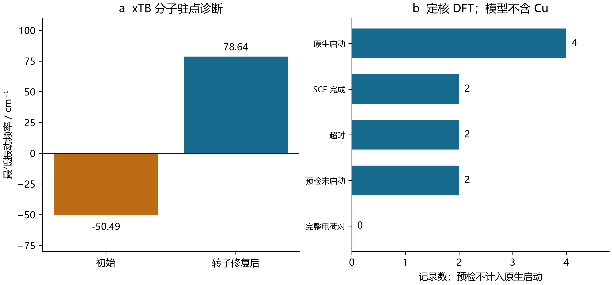

**图 16.** （a）转子修复前后的最低 xTB 振动频率。（b）后续定核 DFT 作业数量，预检拒绝不计入原生启动。模型不含 Cu，完整中性/阴离子对数量为零。[矢量图](../history/catalysis/figures/Figure_C5_Molecular_Preflight_chinese.svg)。

固定核几何下，GFN1 与 GFN2 所得阴离子减中性态充电能量的差异，在气相为 0.7816478999991645 eV，在平衡 ALPB DMF 中为 0.8319797664252286 eV，均超过记录中的 0.2 eV 敏感性门槛 [C20]。这些量不能改称非平衡垂直电子亲和能、电极电势或溶液反应自由能。随后的原生 DFT 试算虽然使用弥散基组，却未完成任何完整电荷对。

**表 16. 后续定核分子 DFT 启动作业。** 基组均为 def2-SVPD。C21–C23 和 [posthoc_dft_jobs.csv](../history/catalysis/sources/posthoc_dft_jobs.csv) 区分四次原生启动与另外两次预检拒绝。破折号表示没有可用收敛能量。

| 泛函；电荷 | 结果 | 能量 / Hartree | 墙钟时间 / s |
|---|---|---:|---:|
| PBE0；0 | SCF 完成 | −531.566397414 | 108.659154 |
| PBE0；−1 | 超时 | — | 300.061065 |
| B3LYP；0 | SCF 完成 | −532.173578168 | 117.232500 |
| B3LYP；−1 | 超时 | — | 300.134975 |

中性态计算含 307 个基函数。仅用两个中性态能量，既不能得到充电能的完整方法差异，也不能得到收敛的电子添加能；尤其不能把不同泛函的中性态能量相减当作电子亲和能。所有状态均未验证 SCF 稳定性；该方案没有溶剂、DFT 几何优化或 DFT Hessian [C21]。在本档案中，更复杂的计算只是进一步确定了缺失证据的位置，并没有完成 Cu 催化机理。

### 5.7 复现及其对主文论点的意义

审计可由已有 Git 对象库复现，无须检出完整大仓库，也无须重跑化学计算。使用已配置的 Python 解释器，执行 `python sources/reproduce_audit.py --repository <local-git-object-store>`，即可在固定提交上重新生成保留摘录与算术表。执行 `python plotting.py` 可由这些摘录重新绘图；NumPy、Matplotlib 和说明中的字体需要预先具备。上述两条命令均从仓库子目录 `manuscript/history/catalysis` 执行。[审计记录](../history/catalysis/audit.json)、[原生能量比较](../history/catalysis/sources/native_energy_checks.json)、[提交历史](../history/catalysis/sources/commit_history.json) 和[图像清单](../history/catalysis/figures/manifest.json) 将数值来源与渲染区分开来。PNG 接受 AI 视觉检查，SVG 接受结构检查；后者不等于独立渲染后的视觉审查。

这些结果为证据传递给出了具体停止条件。收敛但自旋污染的状态不能自动构成交叉问题标签；有利的团簇电子能不能代替依赖浓度的缔合热力学；未收敛路径不能产生反应势垒标签；满足对称性的神经模型仍可能无法胜过简单基线，某个辅助输出头接受训练也不意味着另一个物理观测量已被训练。最后，一个位于催化项目中的分子预检，若缺少金属及其环境，就不能成为金属位点计算。这些是由存档原生数据支持的特定模型结论，不是在断言目标催化化学不可能发生。它们共同说明了为何主文将接受标准与观测量定义视为科学结果的一部分，而非附带的管理信息。

## 6 分子可开发性中的采样与对接

### 6.1 历史范围与结果记录的含义

药学仓库为“计算确已执行，但目标科学观测量仍未得到验证”提供了独立案例。本次核查 `ai4pharm-lead-developability-suite` 的完整九次提交历史，并固定在 `a7a2a4df501d5dad030dc488691b02c73fdb423f`。选取分子描述符、三元结合、共价动力学、原子级三元复合体先导模拟及结构引导搜索，依据是存在可检查的数值记录，且与本文的验证主线相关；不将它们作为药物发现证据。本次整合没有新增分子动力学、电子结构计算、对接或模型训练。

历史文件身份通过 git 对象核对。尽管经历目录重组，所选 Task 1、Task 2、Task 3 结果表与首次发布提交逐字节相同；它们在综合复算目录中的副本也完全相同。因此，不将这些副本合并计为额外分子、独立化学重复或新增实验证据。[审计记录](../history/pharmacology/audit.json)把每组数值关联到固定提交、源路径、SHA-256 与字段；[来源清单](../history/pharmacology/sources/source_manifest.json)区分历史实际执行与后续展示修改。复制的药学材料附带 MIT 许可，第三方结构保留来源归属。

### 6.2 多参数评分保留算术意义，但不能自动获得临床有效性

冻结面板包含三十个母体结构，各有 PubChem 标识及结构来源；三个目的性分组各含十个化合物。这些身份信息是公共结构记录，并非三十组实测 ADMET 标签。CNS 多参数优化评分组合六项满意度变换，而历史实现采用工具包描述符和化学类别电离假设。准确复现评分公式，不代表已证明其输入适用于特定电离状态或测定条件。原 CNS-MPO 是方法来源，仓库中的口服评分则是另行设定的等权排序。[Wager 等，2010](https://doi.org/10.1021/cn100008c)

**表 17. 冻结可开发性分组。评分为描述性代理指标，构象数量为抽样结果。**

| 分组 | 分子数 | CNS-MPO 中位数 | 口服代理评分中位数 | 嵌入 / 收敛构象 | 部分收敛的分子数 |
|---|---:|---:|---:|---:|---:|
| 口服参照 | 10 | 4.989850 | 81.049384 | 48 / 48 | 0 |
| 毒性相关比较物 | 10 | 3.647260 | 75.028315 | 54 / 54 | 0 |
| bRo5 类型 | 10 | 1.617406 | 43.759364 | 60 / 54 | 4 |

独立读取全精度字段，重新计算六项 CNS 和、ESOL 方程及等权口服评分，误差均在 10⁻¹² 内。这只验证算术，不是 ADMET 准确度结果。hERG、Caco-2 与吸收率输出使用未经拟合的公式；有上下界的 hERG 分数也不是事件概率。临床分组标签没有进入评分函数，但人工选定的临床面板仍不能估计前瞻性区分能力。因此，组间中位数差异仅作描述，不据此声称显著性或泛化能力。

几何信息还有另一层限制：162 个嵌入构象中 156 个收敛，六个未收敛构象集中于四个 bRo5 分子。三十个结构的绝对变色龙氢键指数均为空值。这样的不可识别结论是恰当的，因为小规模、等权、气相构象集合不能测量随溶剂变化的暴露程度。图中的 pKa 包络来自假设变化，应解释为情景范围，不能当作置信区间。这个案例说明，“代理”“近似”“假设”等状态标签必须随数值传递到下游图表。

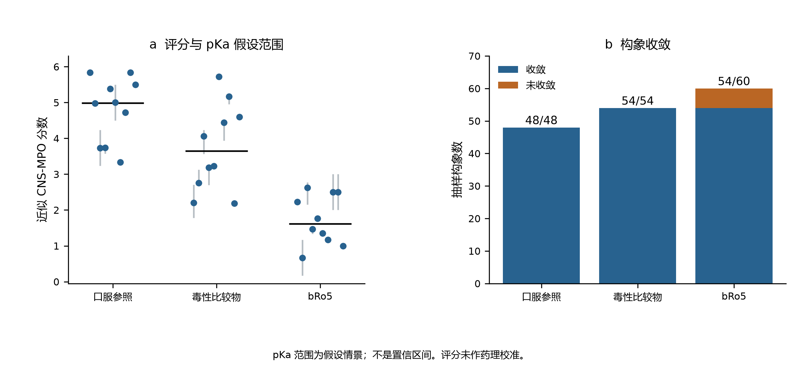

**图 17.** 单分子的近似 CNS-MPO 评分及基于 pKa 假设的范围；另示组中位数与构象收敛。目的性分组和未经校准的评分不能建立预测准确度。

### 6.3 三元平衡：方程通过验证不等于识别有效降解构型

三元复合体模型特别适合在同一质量作用体系中区分不同观测量。归档网格有 724 行，来自四种协同性情景及每种情景的 181 个降解剂总浓度。在 E₀ = T₀ = 100 nM、Kᴅ,E = 10 nM、Kᴅ,T = 100 nM 下，最优总浓度保持约 131.622777 nM，但协同性改变三元复合体峰值及高占有率窗口宽度。输入文档中的另一峰值表达式给出 148.323970 nM，在这组参数下高出 12.688680%；这属于公式层面的偏差，并非数值求解噪声。

**表 18. 固定亲和力与蛋白总浓度下的三元平衡敏感性。**

| 协同性 α | 精确峰值总浓度 / nM | 三元复合体峰值 / nM | 不低于峰值 80% 的窗口 / nM |
|---:|---:|---:|---:|
| 0.01 | 131.622777 | 0.570646 | 70.727187–236.327186 |
| 1 | 131.622777 | 29.053551 | 68.346071–275.136772 |
| 10 | 131.622777 | 66.147685 | 69.289276–439.603083 |
| 100 | 131.622777 | 87.675477 | 73.626624–1287.533850 |

将所有保存物种独立代入三个质量守恒式及三个平衡关系，均通过 10⁻⁹ 相对阈值。但较高峰值或较宽窗口不能识别泛素化有效几何、细胞通透性或降解速率。仓库的 HiBiT 与类似 western blot 的读数明确为合成数据；即使曲线满足设定动力学方程，也不能改称生物学重复。

连接子计算进一步区分几何分布与生物功能。两个封端片段各保留一百次 ETKDG/MMFF 抽样，包括重复构象；这并非一百个独立构象盆地。刚性连接子的极小离散度反映重复收敛至相近几何。假设的 8–12 Å 兼容区间没有实验出口向量依据，其占比也不能解释为结合熵。

**表 19. 未加权连接子片段抽样；区间只是假设的几何条件。**

| 封端连接子 | 抽样 / 收敛 | 平均端点距离 / Å | 样本标准差 / Å | 8–12 Å 内比例 |
|---|---:|---:|---:|---:|
| 柔性 PEG | 100 / 100 | 9.671507 | 0.957658 | 0.96 |
| 刚性炔基 | 100 / 100 | 9.604954 | 3.909640 × 10⁻⁷ | 1.00 |

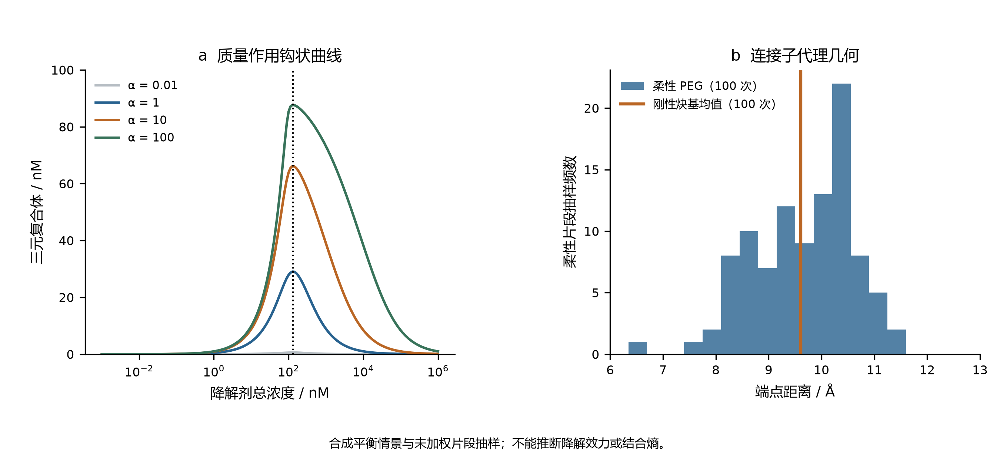

**图 18.** 质量作用钩状曲线及连接子端点距离抽样。协同性改变占有量，而这些情景保持同一最优总浓度。连接子片段是几何代理，并非蛋白结合状态降解剂模拟。

### 6.4 共价动力学：近似方法改变所声称的效率

八个假设战头组合了实际执行的扩展 Hückel 轨道描述符与人为给定的动力学常数，两者属于不同证据类型。每条动力学来源均注明未进行实验校准；由描述符生成的势垒不是搜索得到的过渡态势垒。程序具备可选 xTB 接口，也不表示该面板实际执行了 xTB。

在进行生化验证之前，效率分母的选择已会改变数值。解离常数为 Kᴅ = kₒff/kₒn，而正向准稳态分母为 Kᵢ = (kₒff + kᵢnact)/kₒn。因此，快速平衡效率相对准稳态效率的超出比例为 kᵢnact/kₒff。这些都是已有近似；本文的价值是使归档比较中的不同定义保持清楚，而不是提出新动力学理论。

**表 20. 假设动力学情景与实际执行的 EHT 定域描述符。效率单位为 M⁻¹ s⁻¹。**

| 战头编号 | kᵢnact/Kᴅ | kᵢnact/Kᵢ | 相对超出 / % | 反应中心 LUMO 布居代理 |
|---|---:|---:|---:|---:|
| W01 | 30000.000 | 29126.214 | 3.000 | 0.351241 |
| W02 | 20000.000 | 19512.195 | 2.500 | 0.348904 |
| W03 | 60000.000 | 54545.455 | 10.000 | 0.460621 |
| W04 | 45000.000 | 41284.404 | 9.000 | 8.903366 × 10⁻⁹ |
| W05 | 10666.667 | 10389.610 | 2.667 | 8.093850 × 10⁻⁷ |
| W06 | 400.000 | 399.202 | 0.200 | 2.981633 × 10⁻⁵ |
| W07 | 90000.000 | 81818.182 | 10.000 | 0.470255 |
| W08 | 120000.000 | 109090.909 | 10.000 | 0.471430 |

在二百个浓度记录中，拟合的纯正向慢速率与独立计算的矩阵本征值相对误差不超过 7.82 × 10⁻⁸。这不能证明可逆驻留时间，因为该诊断刻意关闭逆反应。同样，算出了全局 LUMO，也不能默认它定域在亲电原子上；表 20 中若干中心布居极小。速率数值一致性与轨道定域的化学解释需要分别检查。

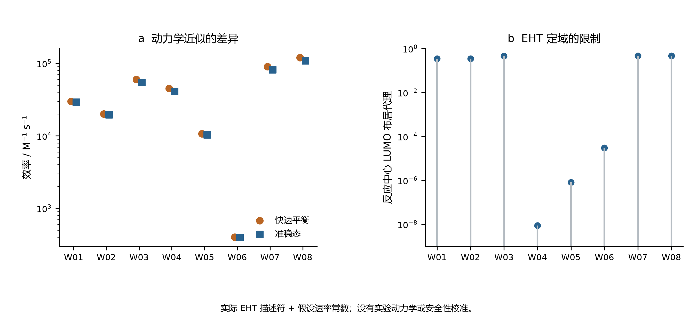

**图 19.** 快速平衡与准稳态效率，以及反应中心 EHT 布居代理。速率常数为假设输入；两个面板都不测量靶标效力或 GSH 安全性。

### 6.5 原子模拟和对接执行仍需针对目标观测量验收

后续原子级案例来自公开的 5T35 晶体结构。独立重算重原子距离，在指定 VHL 与 BRD4 链间恢复 4.5 Å 内的 112 对原子和十四对残基，最近距离为 2.798363 Å。这是对实验结构的几何分析。原始结构论文还使用生物物理与细胞实验；这些属于外部文献，不能视为本仓库复现的测量。[Gadd 等，2017](https://doi.org/10.1038/nchembio.2329)

保存的 OpenMM 先导模型含 150838 个粒子，但只有 0.2 ps 平衡和 1.0 ps 偏置动力学。二十次记录的高斯沉积满足保存的良调元动力学高度规则；距离变量仅跨越 0.024018 nm。坐标有限、检查点有效、偏置可复现，都是有用的执行检查，却不能证明反复跨越自由能盆地或自由能已收敛。因此，归档的 PMF 收敛标记为 false，协同性仍为 null。粒子数量不能弥补目标观测量的抽样不足。[@openmm; @wtmeta]

结构引导搜索同样存在关键对照。二千行种群历史对应 1034 个已评估图结构；等预算随机搜索也评估 1034 个结构，两者并集为 1597 个身份，说明重叠 471 个，不能把种群行数当作新增独立分子。最终最佳几何评分相对初始种群提高 7.543625%，但相对单次随机对照只提高 0.084750%；随机对照入选分子的评分中位数反而更高。现有证据不能支持经过重复检验的优化优势。

**表 21. 已执行的分子工作流与尚不能建立的目标观测量。**

| 记录中的比较 | 数值结果 | 仍存在的证据边界 |
|---|---|---|
| 原子级先导模拟 | 150838 粒子；0.2 + 1.0 ps；20 hills | 无收敛 PMF 或协同性 |
| 最佳几何分：初始 / 进化 / 随机 | 19.219952 / 20.669833 / 20.652330 | 单次随机对照；任意量纲评分 |
| 入选中位数：进化 / 随机 | 14.515998 / 15.329122 | 没有重复优势估计 |
| 十二个候选 Vina 分数 | −6.368 至 −4.405 kcal mol⁻¹ | 经验对接评分，非实测亲和力 |
| 两次 X77 重对接重原子 RMSD | 1.242364 / 1.054641 Å | 位姿恢复不等于亲和力校准 |

十二个候选对接记录和两次重对接对照证明对接确已执行。然而，恢复已知位姿检验的是该受体准备方案下的几何行为，而不是新配体的结合热力学。仓库恰当地将预测纳摩尔亲和力及已确认新颖性保留为空缺；换一个标签不能把评分变成实测亲和力。[@vina]

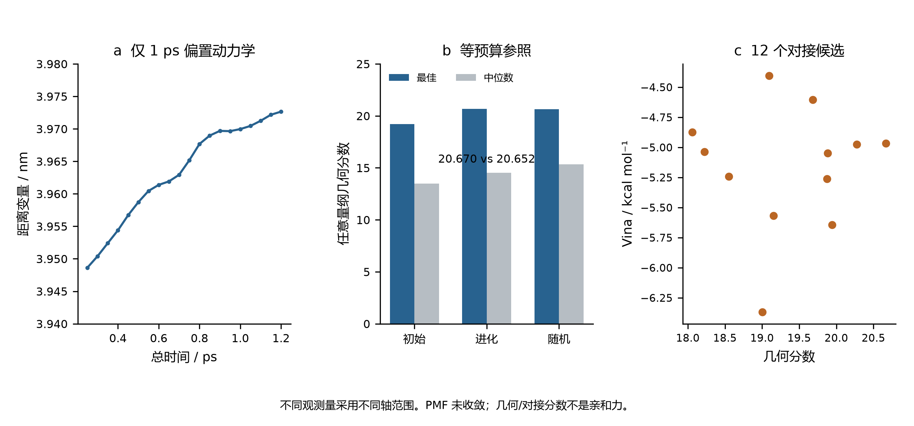

**图 20.** 短程原子模拟的距离轨迹、等预算几何搜索比较及选定对接子集。各轴表示不同观测量。动力学和对接已执行，不等于得到收敛自由能、临床作用或实验确认的先导物。

### 6.6 文献历史提供背景，不增加实际计算数量

`Paper-Analysis-ChemMLLM` 固定于 `c1d309a0c2f876ccc8b4d2ce753ece971d58fe97`，有六次提交和二十七个跟踪文件。目录包含研读总结与文档，未见科学计算驱动、模型检查点或原始结果数据集。公开 ChemMLLM 论文可用于讨论化学多模态接口；铜催化论文和单原子有机电合成综述分别提供实验及综述背景。DOI 已通过原出版方页面核对，但它们都不是本工作执行产生的结果。[@chem_mllm; @cu_data_driven; @single_atom_review]

本审计保留最小仓库来源记录与原始文献引用，没有复制期刊 PDF 或已发表图片。研读仓库未发现开放许可声明，也不根据期刊声誉推断分区。多个教学版本不是独立科学重复。综合来看，结构身份、精确算术、稳定积分、位姿恢复及生物学作用属于不同证据层级，不能在工作流传递中被悄然替换。

## 7 多尺度观测量与受控模型失败

### 7.1 以实测标签评价水合自由能学习

H₂ 分析暴露了电子参考自身带来的限制。水合自由能学习提出另一个问题：在保存的划分下，更灵活的分子表示是否改善了对实测性质的预测。ElectroGraph 使用 642 行 FreeSolv/SAMPL 快照，其结构与实验值已和官方 v0.52 核对，差异在 10⁻⁸ kcal mol⁻¹ 内 [@freesolv]。不查看标签的哈希筛选保留 256 个分子，按 154、51、51 分为训练、验证和测试集。目标是水合自由能，不是氧化电位、反应收率或活性。使用公开实测标签不等于本研究开展了新实验。

两层边条件 GRU 消息传递网络有 29369 个参数。三个种子分别训练 60 轮，另有打乱训练标签的阴性对照。归一化只使用训练集，检查点由验证集选取。描述符岭回归与训练集均值预测器在相同的 51 个测试分子上评价。表 22 报告全部六个测试结果，而不是只选最优神经种子。神经网络 RMSE 为 1.249601–1.897239 kcal mol⁻¹，跨越岭回归的 1.653425。因此，最佳种子是有用的结果，但现有重复运行不支持神经表示稳定优于简单基线。打乱标签的误差为 4.852263，接近均值预测器的 4.805322；这仅支持一个有限判断：此任务需要有信息的标签，模型表达能力本身不足以产生预测能力。

**Table 22. 相同测试分子的水合自由能预测。单位：kcal mol⁻¹。**

| 模型 | RMSE | MAE |
| --- | --- | --- |
| mpnn_seed20260928 | 1.897239 | 1.426569 |
| mpnn_seed20260929 | 1.746786 | 1.269662 |
| mpnn_seed20260930 | 1.249601 | 1.016765 |
| shuffled_train_mpnn_seed20261001 | 4.852263 | 3.589107 |
| descriptor_ridge | 1.653425 | 1.202677 |
| training_mean | 4.805322 | 3.503397 |

图 21. 相对 FreeSolv 实测水合标签的归档测试误差。三个神经种子、打乱标签对照及两个基线共用 51 分子测试集。不绘制误差棒，因为六个模型误差不是化学空间不确定性的六次独立估计。

划分规则将含环分子按非手性 Murcko 骨架分组，无环分子则按完整规范身份分组。这阻止相同身份泄漏，却不能阻止接近的无环类似物跨越划分。此外，历史先导运行已保存全部 256 个分子的预测，包括后来的测试分子。主训练代码仍保持分区，但开发历史不能称为完全盲测。解释骨架或分组划分时必须保留这些区别 [@leakage; @datasail; @datasail_addendum]。一种划分只是对评价范围的操作性定义，不保证所有相似性、先前查看或选择都被消除。DataSAIL 的增补也提醒，不能把一种划分策略称作普遍最优。

这个案例通过表示与评价设计连接公开溶解度、构象项目，但目标不能互换。将水合自由能用于溶解度模型，还需要处理额外热力学和测量条件；在小分子公开数据上学会一种性质，也不意味着校准了其他模块中的八原子催化剂片段。因此，跨项目比较的合理问题是：每个模型是否针对其主张真正需要的观测量和基线进行评价。

### 7.2 守恒、转化率与完整目标产物的产率

传输计算提供了一个内部平衡高度准确、目标产物结果却较差的受控例子。ElectraTwin 使用单元中心有限体积对流–扩散离散、轴向迎风、双向扩散和半网格 Robin 壁面通量。早期单反应模型只有 A→P，因此目标产物法拉第效率在结构上固定为 100%；在该模型内优化此量不会发现选择性。后续四物种模型加入 A→B 与 P→D；所有符号都代表抽象物种和指定动力学，不能指认成唐海涛课题组反应的中间体。

归档基准的总物质与电荷平衡相对误差分别为 1.83524×10⁻¹⁵、1.89173×10⁻¹⁵。四个出口浓度分别为 A=20.795626、P=5.771924、B=1.948402、D=21.484048 mM。在数值精度内，它们之和保持入口总浓度 50 mM，但转化掉的 A 大部分没有保留为完整 P。转化率为 58.408749%，P 净产率为 11.543848%，净选择性为 19.763902%，P 净法拉第效率为 11.387066%。这些量的分母不同，不能重新命名为同一种效率。

**Table 23. 四物种模型的不同观测量。**

| 观测量 | % |
| --- | --- |
| A 转化率 | 58.408749 |
| P 净产率 | 11.543848 |
| P 净选择性 | 19.763902 |
| P 净法拉第效率 | 11.387066 |
| A→P 毛电荷占比 | 53.771593 |

图 22. 实际执行的四物种传输模型基准。a 为出口浓度；b 分别报告转化率、产率、选择性和电荷核算。守恒仅适用于假设的抽象网络，不构成化学机理或实测反应器验证。

A→P 毛生成占模型电荷的 53.771593%，明显高于 P 净效率，因为 P→D 消耗产物及额外电荷。A→P、A→B、P→D 的电流贡献分别为 39.447023、2.819884、31.093433 mA，总和为 73.360339 mA。只报告第一通道会隐藏产物破坏。该区别对未来电合成有指导价值，但在完成速率、传输和分析校准之前，数值不能迁移到真实电极。这是针对一种推断规则的反例，不是特定催化剂的预测。

历史单反应不确定性与优化研究没有在四物种网络上重新执行，因此不能把新的净产物损失附加到原缓存目标值。保持版本区别非常重要，否则组合图会看起来优化了算法从未评价的化学过程。仓库历史既记录执行量，也记录模型之间尚未连接的边界。

### 7.3 固定预算搜索与简单基线的强度

序贯优化在早期确定性传输模型生成的 81 个候选点、9×9 网格池上评价。三个策略使用 64 个配对种子，总预算为 25 次选择，其中五个初始候选共享。4800 次目标使用是缓存调用，不是 4800 次新 PDE 求解。这样的比较能够低成本复算，并隔离候选池上的策略行为，但不能直接外推到连续优化、有噪实验或一般反应器设计。

最终相对完整候选池的平均超体积分数分别为：GP-MC-EHVI 0.992024，随机选择 0.982781，最大最小距离空间填充 0.989218。GP 平均值最高，但相对有结构的非贝叶斯基线的优势，远小于相对随机选择的优势。新增配对复算得到：GP 对随机策略胜/负为 45/19，对 maximin 为 33/31；在 10⁻¹² 数值阈值下均无平局。平均归一化改善分别为 0.009243、0.002807。这些是固定候选池上的种子描述性比较，不是新实验室搜索获得成功的概率。

**Table 24. 64 个种子的最终归一化超体积（预算 25）。SD 为种子间标准差。**

| 策略 | 均值 | SD | 最小值 | 最大值 |
| --- | --- | --- | --- | --- |
| gp_mc_ehvi | 0.992024 | 0.001734 | 0.987164 | 0.995286 |
| random | 0.982781 | 0.015598 | 0.929280 | 0.994952 |
| maximin_spacefill | 0.989218 | 0.008467 | 0.952652 | 0.994824 |

图 23. 归档固定预算优化与分块输入预测。a 中每个点对应一个种子–策略的最终结果，黑色短线为均值；组内水平偏移仅用于显示。b 保留原 STY/50000 归一化。重叠的留出使用不是独立新增数据。

归档研究还包含 26 个留出划分，包括流量和过电位分块组。二次回归在两个分块输入组上均优于固定 GP。搜索表现和逐点预测精度有关，但不是同一个量：策略可以在未使全域 RMSE 最小时作出有用选择，插值较好的模型也可能在整个输入区块上失效。所需比较取决于主张究竟针对预测、采集决策，还是达到的目标值。代码调用成功次数无法解决这个区别。

不确定性扩展另有 1792 次 Sobol 设计求解、16 次网格检查和 21 次局部导数求解，假设五个独立输入分布，并以 N=256 使用 Jansen 估计量。部分一阶估计超过总效应，部分一阶之和超过一；这些诊断被原样保留，没有裁剪成看似物理的百分比。五百次配对行重采样属于探索性敏感度诊断，不能替代相关准蒙特卡洛采样的已校准不确定性，假设参数范围也不是实验测得的分布。

### 7.4 随机周转与有限观测窗口的比较对象

ElectroGraph 动力学模型是独立位点上的五态不可逆循环。直接随机模拟 [@gillespie] 与相同观测窗口的连续时间马尔可夫链解、解析更新过程极限比较。主归档包含 273 条轨迹、9950504 个事件，排除五条先导轨迹。事件数衡量已执行的计算量，不能把指定速率变成实验确立的化学。

电位扫描包含六个指定过电位，每点 32 条轨迹。表 25 同时保留模拟均值、轨迹标准差和有限窗口比较值。对该指定循环，长时周转频率是各步骤平均等待时间之和的倒数。吸附、偶联、脱附速率使其上界为 26.61034847 s⁻¹。提高依赖电位的速率，不能消除其他步骤所耗时间；因此归档扫描趋于饱和，而不是原脚本硬编码的 260.2 s⁻¹。

**Table 25. 各设定过电位下 32 条轨迹；TOF 单位为 s⁻¹。**

| η / V | SSA 均值 | SD | 有限窗 CTMC |
| --- | --- | --- | --- |
| 0.2 | 26.413727 | 0.281082 | 26.419159 |
| 0.3 | 26.627655 | 0.217436 | 26.582874 |
| 0.4 | 26.660767 | 0.227923 | 26.606421 |
| 0.5 | 26.619110 | 0.311069 | 26.609788 |
| 0.6 | 26.592865 | 0.276221 | 26.610268 |
| 0.7 | 26.564178 | 0.283199 | 26.610337 |

图 24. 实际执行的随机轨迹与同窗口马尔可夫链模型比较。误差棒为轨迹间标准差，不是化学速率常数的不确定性；占据图为模型稳态解。电位依赖由模型指定，不代表电极实测。

扫描点上，轨迹均值相对有限窗口比较值的最大偏差约为 0.2043%。与独立计算的数学表达一致，是对选定随机算法有意义的核验。但它不识别反应网络，不建立空间相互作用，不施加微观可逆性，也没有把循环耦合到有限体积反应器。这些都属于需要新证据的额外模型。尤其不能直接把动力学和传输表相乘，制造没有定义接口、没有统一单位的多尺度预测。

### 7.5 分子动力学：均值不是分布

SynthaPore 动力学使用具有 21 个内部笛卡尔自由度的八粒子解析谐振簇。二十条 NVE 轨迹与二十四条恒温器重复轨迹合计 350000 个积分步。实测能量误差阶为 1.96457–2.04409，在测试步长内与二阶积分行为一致。这是参考已知、实际执行的算法对照，不是多孔有机聚合物的原子级预测。

恒温器比较比单独看平均温度更有判别力。八个重复的 Langevin BAOAB 平均温度为 302.508228 K，轨迹内方差与正则参考之比为 0.982727。正确计数的 Berendsen 耦合给出 299.999705 K，看起来均值非常理想，方差比却仅为 3.10355×10⁻⁷。沿用原脚本自由度约定，则均值偏至 342.856740 K。正则参考温度方差为 8571.428571 K²。表 26 与图 25 同时展示两个矩，因为任何一个单独使用都会遗漏重要诊断。

**Table 26. 每种恒温器 8 个重复的温度矩。**

| 恒温器 | 均值 / K | 方差 / K² | 方差比 |
| --- | --- | --- | --- |
| langevin_baoab | 302.508228 | 8423.370489 | 0.982727 |
| berendsen | 299.999705 | 0.002660 | 3.10355e-07 |
| berendsen_source_dof | 342.856740 | 0.003125 | 3.6453e-07 |

图 25. 解析谐振簇对照的均值与涨落。虚线标记 300 K 及单位正则方差比，右图为对数轴。方差是有限相关轨迹的诊断量，不是独立样本的置信估计。

Berendsen 弱耦合是既有方法 [@berendsen]，本文不声称首次发现其采样限制。这个计算的作用，是用归档轨迹展示合理均值如何掩盖不恰当的分布。这与浅束缚态例子平行：容易监测的数值可能先稳定，而科学主张所需观测量仍未正确。未来吸附或自由能计算必须直接评估系综采样、平衡和相关性，不能从温度控制的运行测试继承有效性。

相邻的路径研究还区分程序返回状态与驻点。十八个复核解析 CI-NEB 案例在显式力和端点检查下收敛；十二个原算法对照中，十个返回收敛却未满足独立力阈值 [@neb; @neb_tangent]。解析势垒与 Hessian 特征核验了规定势面上的实现，不能升级为化学活化势垒或含 Cu 过渡态的证据。

### 7.6 模型误设下的分析回收率

即便优化器运行成功，分析流程仍可能在信号到目标物理量的最后一步失效。工具箱归档提供 80 个合成双峰回收案例：四种峰间距、两种峰宽设定，每个条件十个噪声种子。生成器给出已知真实面积，因此可直接比较拟合峰面积与固定窗口积分，同时不把这些数据表述为仪器实测。

峰宽正确时，平均绝对拟合面积误差为 0.011026%–0.054386%，窗口积分误差为 2.110304%–32.221383%。故意使用错误峰宽后，拟合误差增至 8.249158%–24.445618%。在最大的 0.25 min 峰间距处，错误拟合模型明显差于窗口积分：8.249158% 对 0.756555%。同一种拟合策略可以表现极好或很差，关键取决于仅靠优化残差不能确认的结构假设。

**Table 27. 合成色谱的平均绝对峰面积误差；每行 10 个案例。**

| 峰宽误设 | 间距 / min | 拟合误差 / % | 积分误差 / % |
| --- | --- | --- | --- |
| False | 0.03 | 0.054386 | 32.221383 |
| False | 0.06 | 0.029811 | 30.041023 |
| False | 0.13 | 0.011026 | 20.259837 |
| False | 0.25 | 0.014230 | 2.110304 |
| True | 0.03 | 24.445618 | 29.354524 |
| True | 0.06 | 15.327456 | 27.174165 |
| True | 0.13 | 10.435116 | 17.392978 |
| True | 0.25 | 8.249158 | 0.756555 |

图 26. 全部 80 个保存的合成色谱案例的事后汇总。每点为十个噪声种子的平均绝对误差。两面板区分正确与错误峰宽，均非实验校准，也不构成针对某个 HPLC 方法的性能主张。

这个例子直接连接未来湿实验验证。只有保留原始色谱、内标量、响应因子、积分规则和正交测量，才能把峰回收转换为收率主张。早期仓库的 HPLC 与 NMR 算术并不一致，因此不能先验假设二者吻合。本文不报告新湿实验产率。数值研究的价值在于指出，在把高精度数字解释为化学测量之前，应当测试哪些假设。

### 7.7 哪些量可以跨层级整合

这六组比较由共同问题连接，而不是由相同单位连接：所检查的性质是否足以建立目标观测量？水合 RMSE、产物效率、超体积、周转频率、温度方差和回收峰面积不能平均成一个分数。参考也不同，分别是公开实测标签、守恒恒等式、有限候选池、马尔可夫链解、解析系综和合成信号生成器。每一种参考支持一个局部主张，却留下其他问题。

这些案例支持一个报告顺序：指定分子或模型身份，说明标签或数学参考，给出采样与选择范围，报告真正相关的观测量，并保留内部检查与目标结论不一致的失败。这个顺序不是新的普遍定理，也不替代化学验证。它是建立在保存计算上的操作性综合，防止把研究组合中的大量成功执行误认为一个已验证的端到端电合成平台。

## 8 讨论

### 8.1 组合分析的贡献

本文主要贡献在于共同量化两种不同的解释障碍。第一，匹配几何研究测量了未改变的电子参考偏差如何压制显著的监督学习改善。第二，核研究测量了优异离散残差如何与近阈值观测量遗漏或不准确并存，并将固定边界加密与区间扩展区分开来。二者通过一套可执行的验证流程连接：识别最终观测量，区分影响它的参考和数值近似，并在将结果传至下游之前，为每一层选择合适的独立比较对象。

本文以精确有符号算术和受控干预展示该流程，不提出新的误差恒等式或本征求解器，也不声称建立普遍可靠的 AI 化学平台。同基组 FCI 为 H₂ 提供有用的电子比较目标，全实轴 Morse 能谱为核离散化提供有用的数学比较目标；两者都不是一般催化的实验真值。支持案例展示执行、对称性、守恒和优化与其科学主张脱节的其他方式，但不估计此类失败在文献中的发生频率。

在决定下一步计算时，参考偏差对改善的限制尤其相关。如果目标域上测得的参考偏差范数远大于拟合误差范数，进一步拟合本身对该域总误差的影响空间就有限。三角界限使这一判断能在已观测有限集合上定量表达。此时，提高电子参考层级、改变目标性质的表示或直接标定，可能更值得优先考虑。这是条件性决策规则，不证明模型容量或训练数据通常不重要。误差抵消也可能使更差拟合偶然更接近选定高层参考；保留有符号交叉项，可避免把这种抵消误认作模型学习到的修正。

电合成实例进一步说明，具有化学依据的扩展需要哪些证据。唐海涛及其合作者报道了以锌单原子阴极配合阳极碘离子介导实现吡啶羟甲基化 [@tang1]、以铁单原子氧化还原介体促进阳极有机合成 [@tang2]，以及将锰催化析氧与硅烷氧化偶联 [@tang3]。其含碲噁唑烷酮合成研究提供了另一项具有明确实验定义的转化 [@tang4]。这些化学体系各不相同，不能通过给抽象 A/P/B/D 网络或 H₂ 基准重新命名来表示。未来计算研究需要选定其中一项转化，获得完整结构、匹配的电化学条件、经指认的产物及针对具体路径的参考计算。这些论文说明了上述要求的必要性；本文不声称已针对其实验完成验证。

### 8.2 与既有研究的关系及创新范围

能量/力学习、等变表示、不确定度估计、参考方法依赖，以及数值验证与物理验证的区别，均是已有研究主题 [@unke2021; @batzner2022; @uncertainty; @evaluation]。本文可能具有复用价值之处，在于以全部中间量公开的冻结、可审计案例连接这些问题。H₂ 学习比较保留初始化配对、标签访问规则和精确几何匹配；核比较将同一本征问题的残差与特定浅束缚态误差联系起来。发布记录允许读者无须重跑全部科学计算，即可检查这些结论。

Kamath 及其合作者的研究是与本文尤为相关的比较对象；他们已从拟合质量和计算振动谱两个方面比较神经网络与高斯过程势能面 [@kamath2018]。本文的神经模型—参考误差链与 Morse 势—核运动链彼此独立：学习得到的神经势并未代入核求解器。因此，本文尚未开展从神经势到振动谱的端到端传播研究。本文更具体的区别在于，以匹配 FCI 数值为参照，量化 RHF 拟合改善在总误差改善中的衰减，并另行提供近阈值问题中网格与定义域效应的反例。这一区分可避免将既有文献的贡献呈现为本文的新工作。

现有集合不支持新催化剂、新化学反应、跨化学空间迁移、新可扩展量子方法或最先进学习精度等主张。其最有力的贡献是可复现的方法学案例研究。若要建立更广泛的创新性，需要多个化学上不同且独立构建的参考系列、更多模型架构与匹配计算预算，以及盲化的外部重复验证。

### 8.3 局限与下一步验证

主要电子体系仅有两个电子，监督输入实际上是一维的，两个基组也较小。拉伸点有意暴露已知的平均场局限。研究仅有三个种子和小型相关测试集。新的匹配 OOD 分析只含原九个 OOD 点中的五个，没有隐式外推缺失 FCI 标签。核势仅由三个 FCI 性质参数化，与采样电子曲线存在偏差；有限径向边界问题也不同于解析全实轴比较对象。最细外推在该模型内显示改善，但仍仅基于两个网格。

支持性化学工作流混合不同证据类型，不能建立单一端到端准确性主张。具体而言，任何 Cu 反应路径均未获得经量子驻点和连通性分析验证的结果；没有电极/溶剂模型针对所引电合成研究完成标定；也没有新增实验室实验。文献先例建立相关性，不构成本研究验证。可信的后续扩展应预先定义面向特定反应和观测量的参考层级，保留真正未被查看的外部测试集，在相同标签与计算访问条件下比较简单基线和现代模型，并将不确定度追踪到所需势垒、速率、选择性或光谱。匹配参考计算和定量数值收敛检验应先于机理解释。

### 8.4 跨项目结果与限制性近似的位置

历史项目通过改变模型和失败类型，加强了本文的中心论点。在 H₂ 中，拟合目标定义清楚，但与相关电子比较对象不同；在自旋态档案中，收敛电子能量仍可能不满足物理比较所需的态质量标准；在元动力学实例中，轨迹确实存在，但尚未证明所需的盆地间连通采样；在反应网络中，守恒成立，但目标产物在下游继续消耗；在色谱中，准确优化假设峰模型不能修复错误的峰宽。这些误差不可互换，修复它们需要不同计算。

因此，有用的跨项目综合对象，是从科学主张到缺失或限制性比较的对应关系，而不是按文件数、参数量或测试通过数给仓库排名。表 28 给出代表性对应。每行保留自身的物理或数学单位，不能对各行数值求一个有意义的平均值。比较栏说明现有记录实际提供什么，最后一栏说明更强主张还需要什么。这样，回顾性综合可以指导后续工作，又不假装不同应用具有统一标定的置信分数。

**表 28. 代表性归档证据的主张特异性解释。**

| 证据链 | 已有比较 | 可支持结论 | 更强主张仍需证据 |
|---|---|---|---|
| H₂ 能量学习 | 同几何 RHF 与有限基组 FCI | 匹配测试集上的拟合改善主要受参考限制 | 一般分子准确性及相关电子力 |
| Morse 核运动 | 解析全实轴能谱与固定边界加密 | 浅束缚态准确性强烈依赖区间与步长 | 从头算或实验光谱准确性 |
| 构象生成 | 优化状态与同方法内部能量 | 记录结构在指定力场下完成优化 | 完整溶液布居或实验构象 |
| 辅助构象能量学习 | 留出构象能量对及等参考基线 | 当前图模型测试 MAE 未优于该基线 | 可靠的自旋交叉或反应势垒预测 |
| 短时偏置动力学 | 保存轨迹与重构曲面 | 可检查采样及重构 | 收敛的分子自由能差 |
| 有限候选池搜索 | 同一缓存池上的配对策略 | 预算相关的描述性策略表现 | 前瞻性实验优化 |
| 四物种传输 | 物料、电荷平衡及净产物量 | 守恒与选择性不同 | 经标定的有机电合成条件 |
| 合成色谱 | 已知模拟峰面积及峰宽干预 | 回收精度依赖假设峰形 | 真实样品上的分析方法准确性 |

综合这些案例所得的最强新推论具有条件性：投入更多计算之前，应先定位限制所需观测量的近似。对不变的偏差标签增加训练，主要修复拟合；对错误分子身份增加优化迭代，不能修复身份；在未访问的盆地之外增加相关帧，不能确定其平衡权重；增加缓存搜索查询，不能为未建模反应补充物理信息。另一方面，档案也包含正确干预确实有效的实例：显式扩展边界恢复浅束缚态，匹配电子参考揭示误差抵消，而更强简单基线检验表示复杂度是否带来可测收益。关键是新增了什么信息，而非下一工具看起来多先进。

这种解释也说明阴性结果为何应进入正文。保留等参考预测器后，EGNN 比较更有信息；单独选择最佳水合神经网络种子，不如完整报告三个种子和打乱标签对照；路径能量曲线若缺少端点、力及驻点检查，就不完整。删除失败运行会使集合显得更成功，却破坏决定下一步计算所需的证据。因此，扩展论文将失败记录视为约束解释的科学信息，不将其包装为成功化学预测。

### 8.5 回顾性综合的新贡献

各项单独方法均已有基础。本文不提出等变性、扩散、VMC、电子结构理论、NEB、元动力学或贝叶斯优化。贡献是以明确历史去重和主张特异性比较，对选取的已执行研究作可复现整合。最具定量性的部分仍是同几何有符号误差分析：不删除交叉项，区分拟合、参考重放及 RHF–FCI 差异。第二项受控研究将代数本征问题残差与同一浅束缚态的束缚误差连接，并检验不同数值干预。

新增历史分析提供三方面补充。第一，重建表面独立项目共享证据的位置，避免因仓库复制而宣称重复验证。第二，在化学上不同的工作流中，将标签或实现层面的成功与缺失的态、采样及观测量检查联系起来。第三，重新发布紧凑源数据提取、数值选择规则和双语图，使读者能复现回顾性算术。这些贡献可审计，范围也小于“已广泛验证的自主化学系统”这一主张。

需要区别可能具有发表价值的方法学论证与已经证明的优先权或影响力。当前实例提供有定量支持的连贯论证，但不证明验证流程前所未有、基准集合具有代表性，或论文达到特定期刊录用标准。更强的原创研究投稿应在独立分子家族上检验预先指定假设，比较匹配计算预算，并证明所得决策规则改善下游物理预测，或降低达到定义精度所需的成本。单靠回顾性整合不能提供这一前瞻性检验。

### 8.6 超出现有证据的具体化学路径

对于电合成，下一项有依据的扩展应选定一项实验定义明确的反应，并在建模前冻结分子身份、电荷和自旋约定、溶剂、电极参考及实测观测量。随后，在代表性反应物、中间体及产物形成步骤上比较适当电子参考方法。结构只有通过与其作用相符的连通性和驻点检查后才可接受。势垒应来自经验证的过渡态和路径连接，而不是任意插值路径上的最大值。自旋交叉主张需要实际合格配对、执行过的交叉搜索，以及两势能面的质量检查。

顺序十分重要，因为速率与选择性模型会放大输入误差。随机求解器可以准确复现指定速率的行为，而这些速率仍可能在化学上错误；传输可以一致地重新分配产物，而网络仍可能遗漏主要通道；学习代理只能在数据支持的条件内优化已标定目标。当前记录把这些阶段分开，使未来实验—模型比较有机会定位失败阶段。它们并未为所引唐海涛课题组转化提供经验证的速率定律。

对于分子性质及构象自由能，对应重点是未被查看的外部测试集、化学上有意义的划分、保留模型权重、可重复预处理，以及与所需量对应的采样诊断。力场布居、单点电子差、对接分数和实测自由能，只能在定义与参考态对齐后比较。对于指定预测，通过这些检查的简单模型，比针对更容易但不同目标评估的复杂模型更有用。这是案例支持的决策原则，并非否定先进模型。

因此，当前回顾性工作止于明确边界：提供关于归档模型及其解释的定量证据，并给出检查派生图表的可复现路径。实验验证、更广化学迁移、完全收敛的分子自由能及经验证的催化机理，仍是未来科学结果，而不是软件集合隐含已经完成的交付。

## 9 结论

配对 H₂ 拟合表明，相对 RHF 标签的大幅改善，可能只带来相对同基组 FCI 的极小改善。保留有符号学习–参考交叉项，可以区分参考限制与误差抵消。独立的 FCI 参数化核模型表明，小矩阵残差不能证明近阈值束缚态的完整性或准确性；必须分别改变网格与边界，并针对所需观测量评估。固定区间外推改善了解析模型的浅束缚态估计，同时保留电子模型局限。结合支持性工作流审计，这些结果给出一条从算法一致性走向适度科学主张的可检查路径。证据支持本文验证案例及定量反例，更广泛的化学预测仍是独立研究任务。

## 数据与代码可用性

全部基础计算见 [subject-group 仓库](https://github.com/songsiyi2006-chem/subject-group)，冻结源研究由提交 1ad05c243155a9f64b18e0d58c665424fde919a0 标识。manuscript 目录包含事后分析脚本、逐行结果、证据目录、核验文献、图形来源和论文源文件。补充信息将每个早期模块映射到保存的原始数据、代码与报告。失败记录、先导结果和实际执行源码快照均保留。仓库完整性检查验证记录与数值恒等式，不认证实验化学。依赖与数据集许可仍遵循各自上游项目。

扩展稿的历史提取、派生数值、制图脚本及固定提交登记位于 manuscript/history 与 manuscript/expanded。所有新增图表均有可追溯的归档输入；公开实测数据的实验归属仍为原始生产者。

## 作者与稿件准备声明

宋思毅为唯一列名作者，单位为广西师范大学。代码实现、任务协调、文献检索、翻译和论文起草使用了 AI 辅助工具；AI 系统不列为作者。全文区分已执行计算、保留记录和拟议工作。本稿是研究草稿，仍需作者最终科学确认，并按目标期刊要求审查披露。资金来源、利益冲突信息及通讯地址尚未提供，本文不作推断。

## 参考文献

<!-- VERIFIED_REFERENCES -->
