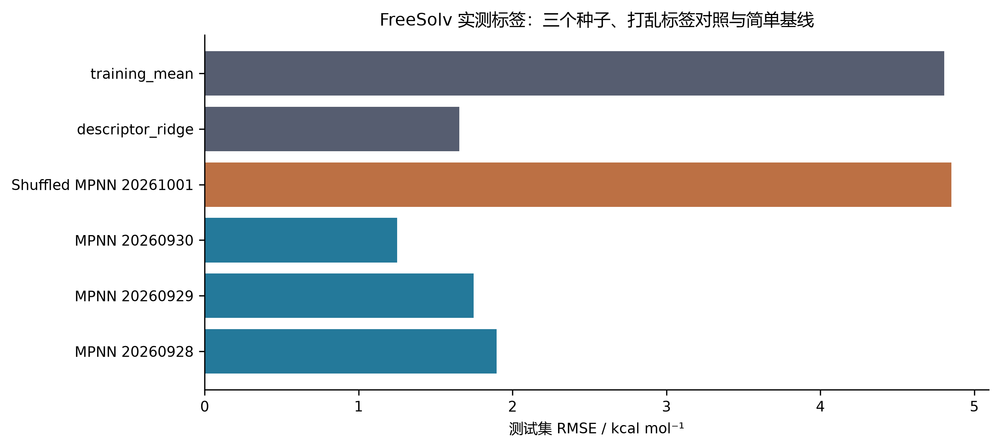
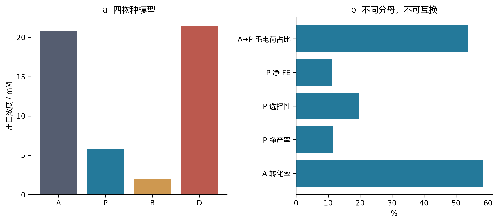
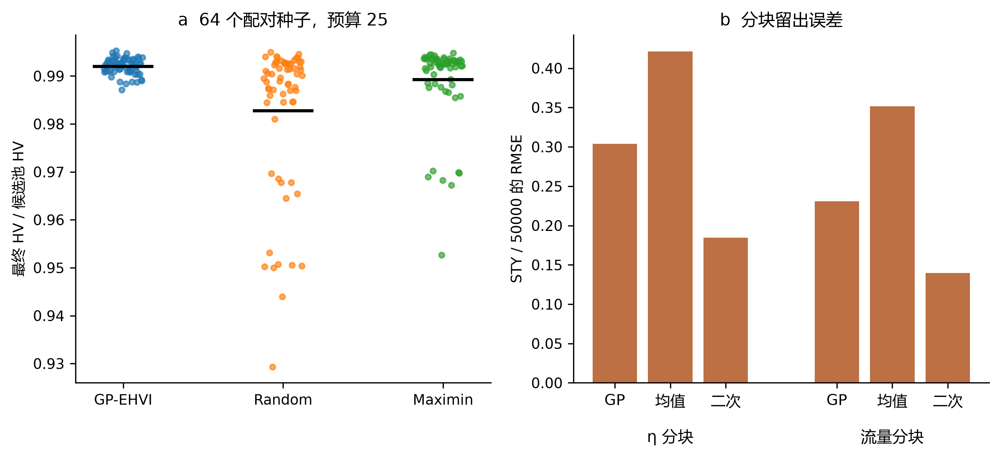
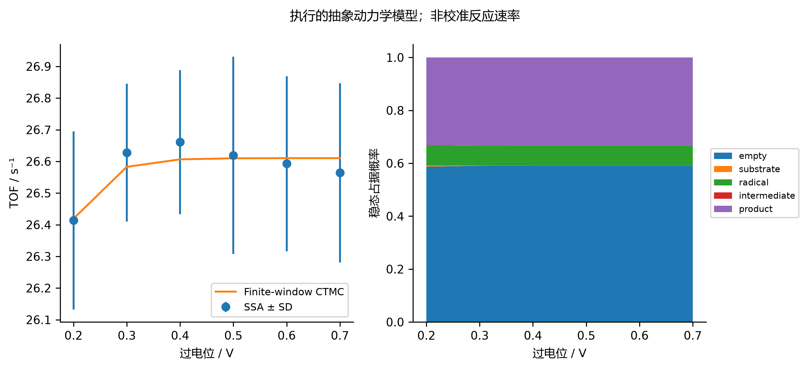
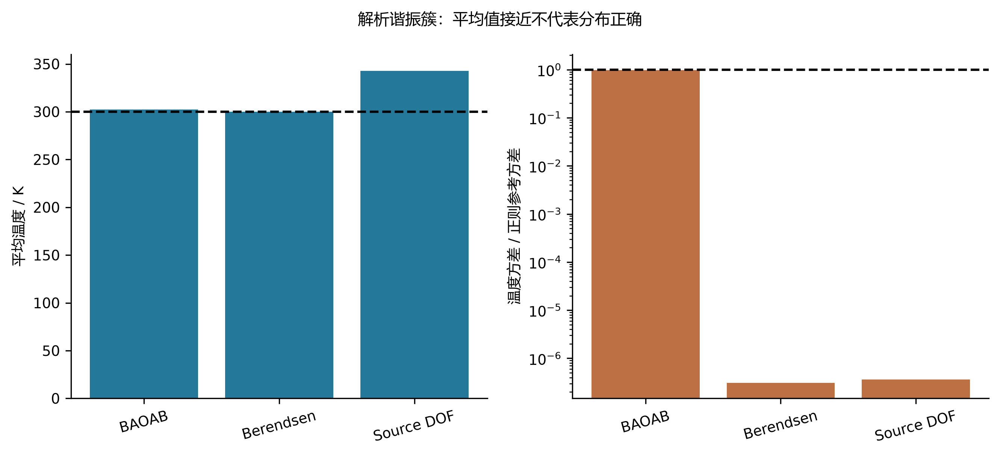
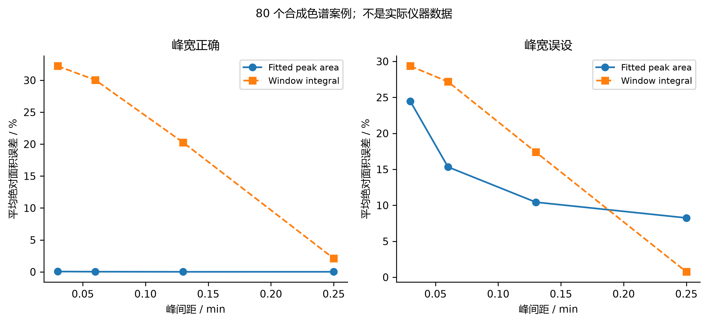

## 多尺度观测量与内部计算成功的适用边界

### 以实测标签评价水合自由能学习

H₂ 分析暴露了电子参考自身带来的限制。水合自由能学习提出另一个问题：在保存的划分下，更灵活的分子表示是否改善了对实测性质的预测。ElectroGraph 使用 642 行 FreeSolv/SAMPL 快照，其结构与实验值已和官方 v0.52 核对，差异在 10⁻⁸ kcal mol⁻¹ 内 [@freesolv]。不查看标签的哈希筛选保留 256 个分子，按 154、51、51 分为训练、验证和测试集。目标是水合自由能，不是氧化电位、反应收率或活性。使用公开实测标签不等于本研究开展了新实验。

两层边条件 GRU 消息传递网络有 29369 个参数。三个种子分别训练 60 轮，另有打乱训练标签的阴性对照。归一化只使用训练集，检查点由验证集选取。描述符岭回归与训练集均值预测器在相同的 51 个测试分子上评价。表 M1 报告全部六个测试结果，而不是只选最优神经种子。神经网络 RMSE 为 1.249601–1.897239 kcal mol⁻¹，跨越岭回归的 1.653425。因此，最佳种子是有用的结果，但现有重复运行不支持神经表示稳定优于简单基线。打乱标签的误差为 4.852263，接近均值预测器的 4.805322；这仅支持一个有限判断：此任务需要有信息的标签，模型表达能力本身不足以产生预测能力。

**Table M1. 相同测试分子的水合自由能预测。单位：kcal mol⁻¹。**

| 模型 | RMSE | MAE |
| --- | --- | --- |
| mpnn_seed20260928 | 1.897239 | 1.426569 |
| mpnn_seed20260929 | 1.746786 | 1.269662 |
| mpnn_seed20260930 | 1.249601 | 1.016765 |
| shuffled_train_mpnn_seed20261001 | 4.852263 | 3.589107 |
| descriptor_ridge | 1.653425 | 1.202677 |
| training_mean | 4.805322 | 3.503397 |

图 M1. 相对 FreeSolv 实测水合标签的归档测试误差。三个神经种子、打乱标签对照及两个基线共用 51 分子测试集。不绘制误差棒，因为六个模型误差不是化学空间不确定性的六次独立估计。

划分规则将含环分子按非手性 Murcko 骨架分组，无环分子则按完整规范身份分组。这阻止相同身份泄漏，却不能阻止接近的无环类似物跨越划分。此外，历史先导运行已保存全部 256 个分子的预测，包括后来的测试分子。主训练代码仍保持分区，但开发历史不能称为完全盲测。解释骨架或分组划分时必须保留这些区别 [@leakage; @datasail; @datasail_addendum]。一种划分只是对评价范围的操作性定义，不保证所有相似性、先前查看或选择都被消除。DataSAIL 的增补也提醒，不能把一种划分策略称作普遍最优。

这个案例通过表示与评价设计连接公开溶解度、构象项目，但目标不能互换。将水合自由能用于溶解度模型，还需要处理额外热力学和测量条件；在小分子公开数据上学会一种性质，也不意味着校准了其他模块中的八原子催化剂片段。因此，跨项目比较的合理问题是：每个模型是否针对其主张真正需要的观测量和基线进行评价。

### 守恒、转化率与完整目标产物的产率

传输计算提供了一个内部平衡高度准确、目标产物结果却较差的受控例子。ElectraTwin 使用单元中心有限体积对流–扩散离散、轴向迎风、双向扩散和半网格 Robin 壁面通量。早期单反应模型只有 A→P，因此目标产物法拉第效率在结构上固定为 100%；在该模型内优化此量不会发现选择性。后续四物种模型加入 A→B 与 P→D；所有符号都代表抽象物种和指定动力学，不能指认成唐海涛课题组反应的中间体。

归档基准的总物质与电荷平衡相对误差分别为 1.83524×10⁻¹⁵、1.89173×10⁻¹⁵。四个出口浓度分别为 A=20.795626、P=5.771924、B=1.948402、D=21.484048 mM。在数值精度内，它们之和保持入口总浓度 50 mM，但转化掉的 A 大部分没有保留为完整 P。转化率为 58.408749%，P 净产率为 11.543848%，净选择性为 19.763902%，P 净法拉第效率为 11.387066%。这些量的分母不同，不能重新命名为同一种效率。

**Table M2. 四物种模型的不同观测量。**

| 观测量 | % |
| --- | --- |
| A 转化率 | 58.408749 |
| P 净产率 | 11.543848 |
| P 净选择性 | 19.763902 |
| P 净法拉第效率 | 11.387066 |
| A→P 毛电荷占比 | 53.771593 |

图 M2. 实际执行的四物种传输模型基准。a 为出口浓度；b 分别报告转化率、产率、选择性和电荷核算。守恒仅适用于假设的抽象网络，不构成化学机理或实测反应器验证。

A→P 毛生成占模型电荷的 53.771593%，明显高于 P 净效率，因为 P→D 消耗产物及额外电荷。A→P、A→B、P→D 的电流贡献分别为 39.447023、2.819884、31.093433 mA，总和为 73.360339 mA。只报告第一通道会隐藏产物破坏。该区别对未来电合成有指导价值，但在完成速率、传输和分析校准之前，数值不能迁移到真实电极。这是针对一种推断规则的反例，不是特定催化剂的预测。

历史单反应不确定性与优化研究没有在四物种网络上重新执行，因此不能把新的净产物损失附加到原缓存目标值。保持版本区别非常重要，否则组合图会看起来优化了算法从未评价的化学过程。仓库历史既记录执行量，也记录模型之间尚未连接的边界。

### 固定预算搜索与简单基线的强度

序贯优化在早期确定性传输模型生成的 81 个候选点、9×9 网格池上评价。三个策略使用 64 个配对种子，总预算为 25 次选择，其中五个初始候选共享。4800 次目标使用是缓存调用，不是 4800 次新 PDE 求解。这样的比较能够低成本复算，并隔离候选池上的策略行为，但不能直接外推到连续优化、有噪实验或一般反应器设计。

最终相对完整候选池的平均超体积分数分别为：GP-MC-EHVI 0.992024，随机选择 0.982781，最大最小距离空间填充 0.989218。GP 平均值最高，但相对有结构的非贝叶斯基线的优势，远小于相对随机选择的优势。新增配对复算得到：GP 对随机策略胜/负为 45/19，对 maximin 为 33/31；在 10⁻¹² 数值阈值下均无平局。平均归一化改善分别为 0.009243、0.002807。这些是固定候选池上的种子描述性比较，不是新实验室搜索获得成功的概率。

**Table M3. 64 个种子的最终归一化超体积（预算 25）。SD 为种子间标准差。**

| 策略 | 均值 | SD | 最小值 | 最大值 |
| --- | --- | --- | --- | --- |
| gp_mc_ehvi | 0.992024 | 0.001734 | 0.987164 | 0.995286 |
| random | 0.982781 | 0.015598 | 0.929280 | 0.994952 |
| maximin_spacefill | 0.989218 | 0.008467 | 0.952652 | 0.994824 |

图 M3. 归档固定预算优化与分块输入预测。a 中每个点对应一个种子–策略的最终结果，黑色短线为均值；组内水平偏移仅用于显示。b 保留原 STY/50000 归一化。重叠的留出使用不是独立新增数据。

归档研究还包含 26 个留出划分，包括流量和过电位分块组。二次回归在两个分块输入组上均优于固定 GP。搜索表现和逐点预测精度有关，但不是同一个量：策略可以在未使全域 RMSE 最小时作出有用选择，插值较好的模型也可能在整个输入区块上失效。所需比较取决于主张究竟针对预测、采集决策，还是达到的目标值。代码调用成功次数无法解决这个区别。

不确定性扩展另有 1792 次 Sobol 设计求解、16 次网格检查和 21 次局部导数求解，假设五个独立输入分布，并以 N=256 使用 Jansen 估计量。部分一阶估计超过总效应，部分一阶之和超过一；这些诊断被原样保留，没有裁剪成看似物理的百分比。五百次配对行重采样属于探索性敏感度诊断，不能替代相关准蒙特卡洛采样的已校准不确定性，假设参数范围也不是实验测得的分布。

### 随机周转与有限观测窗口的比较对象

ElectroGraph 动力学模型是独立位点上的五态不可逆循环。直接随机模拟 [@gillespie] 与相同观测窗口的连续时间马尔可夫链解、解析更新过程极限比较。主归档包含 273 条轨迹、9950504 个事件，排除五条先导轨迹。事件数衡量已执行的计算量，不能把指定速率变成实验确立的化学。

电位扫描包含六个指定过电位，每点 32 条轨迹。表 M4 同时保留模拟均值、轨迹标准差和有限窗口比较值。对该指定循环，长时周转频率是各步骤平均等待时间之和的倒数。吸附、偶联、脱附速率使其上界为 26.61034847 s⁻¹。提高依赖电位的速率，不能消除其他步骤所耗时间；因此归档扫描趋于饱和，而不是原脚本硬编码的 260.2 s⁻¹。

**Table M4. 各设定过电位下 32 条轨迹；TOF 单位为 s⁻¹。**

| η / V | SSA 均值 | SD | 有限窗 CTMC |
| --- | --- | --- | --- |
| 0.2 | 26.413727 | 0.281082 | 26.419159 |
| 0.3 | 26.627655 | 0.217436 | 26.582874 |
| 0.4 | 26.660767 | 0.227923 | 26.606421 |
| 0.5 | 26.619110 | 0.311069 | 26.609788 |
| 0.6 | 26.592865 | 0.276221 | 26.610268 |
| 0.7 | 26.564178 | 0.283199 | 26.610337 |

图 M4. 实际执行的随机轨迹与同窗口马尔可夫链模型比较。误差棒为轨迹间标准差，不是化学速率常数的不确定性；占据图为模型稳态解。电位依赖由模型指定，不代表电极实测。

扫描点上，轨迹均值相对有限窗口比较值的最大偏差约为 0.2043%。与独立计算的数学表达一致，是对选定随机算法有意义的核验。但它不识别反应网络，不建立空间相互作用，不施加微观可逆性，也没有把循环耦合到有限体积反应器。这些都属于需要新证据的额外模型。尤其不能直接把动力学和传输表相乘，制造没有定义接口、没有统一单位的多尺度预测。

### 分子动力学：均值不是分布

SynthaPore 动力学使用具有 21 个内部笛卡尔自由度的八粒子解析谐振簇。二十条 NVE 轨迹与二十四条恒温器重复轨迹合计 350000 个积分步。实测能量误差阶为 1.96457–2.04409，在测试步长内与二阶积分行为一致。这是参考已知、实际执行的算法对照，不是多孔有机聚合物的原子级预测。

恒温器比较比单独看平均温度更有判别力。八个重复的 Langevin BAOAB 平均温度为 302.508228 K，轨迹内方差与正则参考之比为 0.982727。正确计数的 Berendsen 耦合给出 299.999705 K，看起来均值非常理想，方差比却仅为 3.10355×10⁻⁷。沿用原脚本自由度约定，则均值偏至 342.856740 K。正则参考温度方差为 8571.428571 K²。表 M5 与图 M5 同时展示两个矩，因为任何一个单独使用都会遗漏重要诊断。

**Table M5. 每种恒温器 8 个重复的温度矩。**

| 恒温器 | 均值 / K | 方差 / K² | 方差比 |
| --- | --- | --- | --- |
| langevin_baoab | 302.508228 | 8423.370489 | 0.982727 |
| berendsen | 299.999705 | 0.002660 | 3.10355e-07 |
| berendsen_source_dof | 342.856740 | 0.003125 | 3.6453e-07 |

图 M5. 解析谐振簇对照的均值与涨落。虚线标记 300 K 及单位正则方差比，右图为对数轴。方差是有限相关轨迹的诊断量，不是独立样本的置信估计。

Berendsen 弱耦合是既有方法 [@berendsen]，本文不声称首次发现其采样限制。这个计算的作用，是用归档轨迹展示合理均值如何掩盖不恰当的分布。这与浅束缚态例子平行：容易监测的数值可能先稳定，而科学主张所需观测量仍未正确。未来吸附或自由能计算必须直接评估系综采样、平衡和相关性，不能从温度控制的运行测试继承有效性。

相邻的路径研究还区分程序返回状态与驻点。十八个复核解析 CI-NEB 案例在显式力和端点检查下收敛；十二个原算法对照中，十个返回收敛却未满足独立力阈值 [@neb; @neb_tangent]。解析势垒与 Hessian 特征核验了规定势面上的实现，不能升级为化学活化势垒或含 Cu 过渡态的证据。

### 模型误设下的分析回收率

即便优化器运行成功，分析流程仍可能在信号到目标物理量的最后一步失效。工具箱归档提供 80 个合成双峰回收案例：四种峰间距、两种峰宽设定，每个条件十个噪声种子。生成器给出已知真实面积，因此可直接比较拟合峰面积与固定窗口积分，同时不把这些数据表述为仪器实测。

峰宽正确时，平均绝对拟合面积误差为 0.011026%–0.054386%，窗口积分误差为 2.110304%–32.221383%。故意使用错误峰宽后，拟合误差增至 8.249158%–24.445618%。在最大的 0.25 min 峰间距处，错误拟合模型明显差于窗口积分：8.249158% 对 0.756555%。同一种拟合策略可以表现极好或很差，关键取决于仅靠优化残差不能确认的结构假设。

**Table M6. 合成色谱的平均绝对峰面积误差；每行 10 个案例。**

| 峰宽误设 | 间距 / min | 拟合误差 / % | 积分误差 / % |
| --- | --- | --- | --- |
| False | 0.03 | 0.054386 | 32.221383 |
| False | 0.06 | 0.029811 | 30.041023 |
| False | 0.13 | 0.011026 | 20.259837 |
| False | 0.25 | 0.014230 | 2.110304 |
| True | 0.03 | 24.445618 | 29.354524 |
| True | 0.06 | 15.327456 | 27.174165 |
| True | 0.13 | 10.435116 | 17.392978 |
| True | 0.25 | 8.249158 | 0.756555 |

图 M6. 全部 80 个保存的合成色谱案例的事后汇总。每点为十个噪声种子的平均绝对误差。两面板区分正确与错误峰宽，均非实验校准，也不构成针对某个 HPLC 方法的性能主张。

这个例子直接连接未来湿实验验证。只有保留原始色谱、内标量、响应因子、积分规则和正交测量，才能把峰回收转换为收率主张。早期仓库的 HPLC 与 NMR 算术并不一致，因此不能先验假设二者吻合。本文不报告新湿实验产率。数值研究的价值在于指出，在把高精度数字解释为化学测量之前，应当测试哪些假设。

### 哪些量可以跨层级整合

这六组比较由共同问题连接，而不是由相同单位连接：所检查的性质是否足以建立目标观测量？水合 RMSE、产物效率、超体积、周转频率、温度方差和回收峰面积不能平均成一个分数。参考也不同，分别是公开实测标签、守恒恒等式、有限候选池、马尔可夫链解、解析系综和合成信号生成器。每一种参考支持一个局部主张，却留下其他问题。

这些案例支持一个报告顺序：指定分子或模型身份，说明标签或数学参考，给出采样与选择范围，报告真正相关的观测量，并保留内部检查与目标结论不一致的失败。这个顺序不是新的普遍定理，也不替代化学验证。它是建立在保存计算上的操作性综合，防止把研究组合中的大量成功执行误认为一个已验证的端到端电合成平台。
