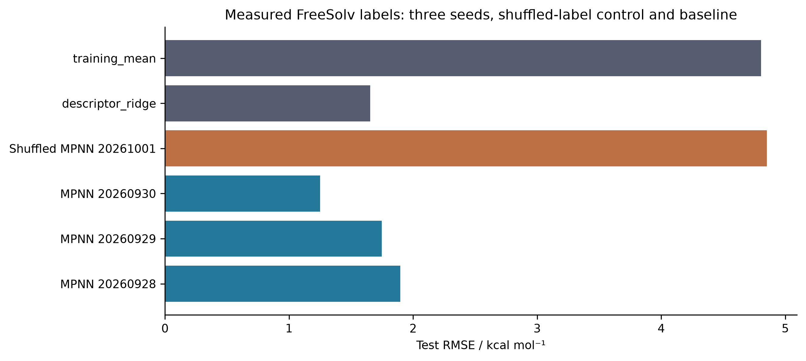
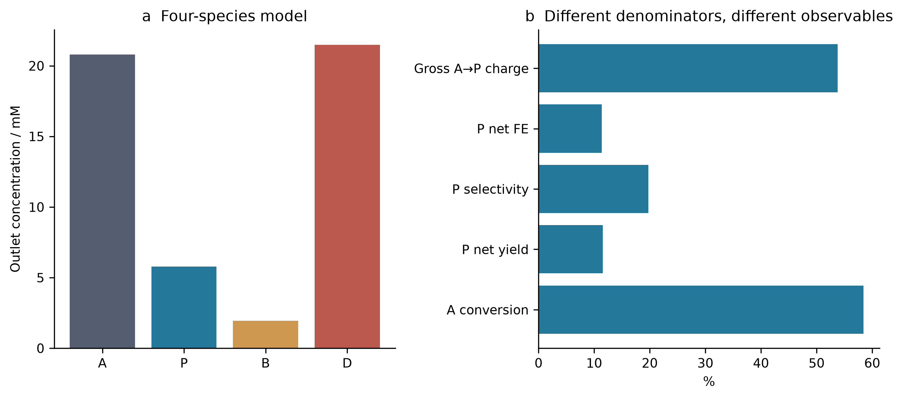
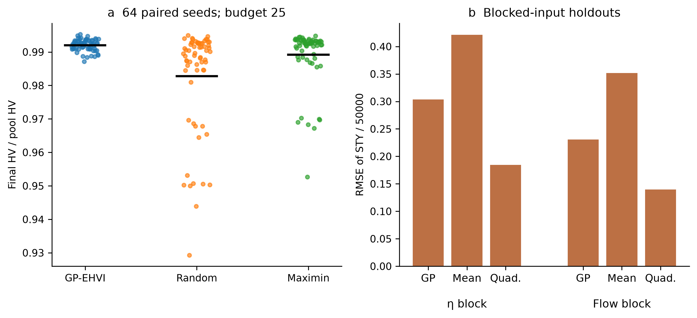
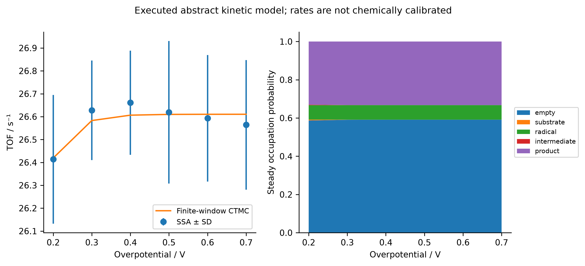
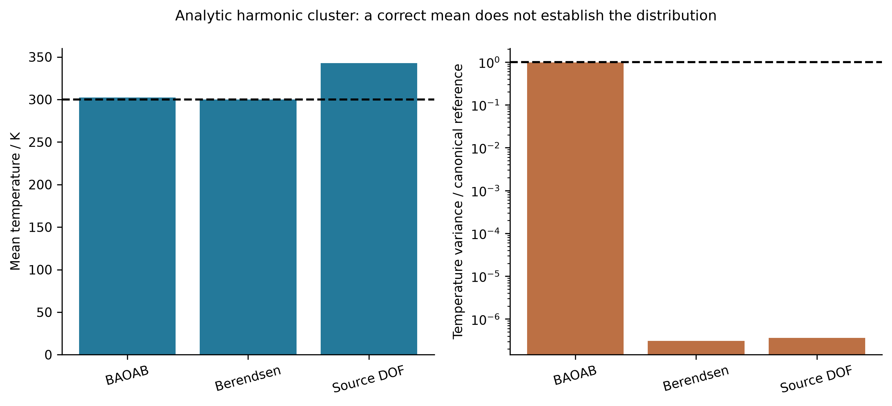
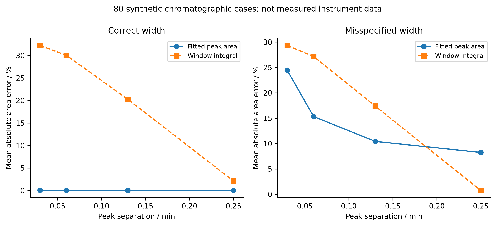

## Multiscale observables and the limits of internally successful calculations

### Hydration learning as a measured-label comparison

The H₂ analysis exposes a limitation inherited from an electronic reference. Hydration learning poses a different question: whether a flexible representation improves prediction of a measured molecular property under the archived split. The ElectroGraph study uses a 642-row FreeSolv/SAMPL snapshot checked against the official v0.52 structures and experimental values within 10⁻⁸ kcal mol⁻¹ [@freesolv]. A label-blind hash selection retains 256 molecules; 154, 51 and 51 form the training, validation and test partitions. The experimental target is a hydration free energy, not an oxidation potential, reaction yield or activity measurement. Reusing a public measured label does not make these calculations new experiments.

A two-layer edge-conditioned GRU message-passing network contains 29369 parameters. Three seeds each undergo 60 epochs; an additional shuffled-training-label run is a negative control. Training-set normalization and validation-selected checkpoints are retained. The simple descriptor-ridge baseline and a training-mean predictor are evaluated on the same 51 test molecules. Table M1 reports all six test results rather than selecting the best neural seed. The neural RMSE spans 1.249601–1.897239 kcal mol⁻¹, straddling the ridge value of 1.653425. Thus the best seed provides a useful result, but the executed repetitions do not establish uniformly superior performance of the neural representation. The shuffled-label result of 4.852263 is close to the mean-predictor error of 4.805322, supporting the limited interpretation that informative labels, rather than only an expressive architecture, are necessary for this task.

**Table M1. Hydration free-energy prediction on identical test molecules. Units: kcal mol⁻¹.**

| Model | RMSE | MAE |
| --- | --- | --- |
| mpnn_seed20260928 | 1.897239 | 1.426569 |
| mpnn_seed20260929 | 1.746786 | 1.269662 |
| mpnn_seed20260930 | 1.249601 | 1.016765 |
| shuffled_train_mpnn_seed20261001 | 4.852263 | 3.589107 |
| descriptor_ridge | 1.653425 | 1.202677 |
| training_mean | 4.805322 | 3.503397 |

Figure M1. Archived test errors against measured FreeSolv hydration labels. The three neural seeds, shuffled-label control and two baselines share the same 51-molecule test set. Error bars are intentionally absent: these six model errors are not six independent estimates of chemical-space uncertainty.

The partition rule groups ring-containing molecules by nonchiral Murcko scaffold; acyclic molecules are grouped by complete canonical identity. This prevents exact identity leakage but does not prevent close acyclic analogues from crossing partitions. In addition, the historical pilot already saved predictions for all 256 molecules, including the later test set. The main training code remains separated, yet the historical development process cannot be called fully blind. Such distinctions matter when interpreting scaffold or grouped splits [@leakage; @datasail; @datasail_addendum]. A split is an operational definition of an evaluation domain, not a guarantee that every mode of similarity, previous inspection or selection has been removed. The DataSAIL addendum also cautions against treating one splitting strategy as universally best.

This case connects to the public solubility and conformer projects through representation and evaluation design, not through interchangeable targets. A hydration free energy cannot be inserted into a solubility model without accounting for the additional thermodynamics and measurement conditions. Likewise, learning a property on small public molecules does not calibrate the eight-atom catalyst fragments used elsewhere. The defensible cross-project comparison is therefore whether each model was tested against the observable and baseline its claim actually requires.

### Conservation, conversion and intact-product yield

The transport calculations provide a controlled example in which an internally accurate balance and a poor desired-product outcome coexist. ElectraTwin uses a cell-centred finite-volume convection–diffusion discretization with axial upwinding, diffusion in two directions and a half-cell Robin wall flux. The earlier single-reaction model contains only A→P, making desired-product Faradaic efficiency structurally 100%. Optimizing this quantity in that model would not discover selectivity. The later four-species model adds A→B and P→D; all symbols represent abstract species and assigned kinetics rather than identified intermediates of the Tang-group chemistry.

At the archived baseline, total amount and charge balances close at relative errors of 1.83524×10⁻¹⁵ and 1.89173×10⁻¹⁵, respectively. The four outlet concentrations are A=20.795626, P=5.771924, B=1.948402 and D=21.484048 mM. These values sum to the inlet total of 50 mM within numerical accuracy, but most converted A does not remain as intact P. Conversion is 58.408749%; net P yield is 11.543848%; net selectivity is 19.763902%; and net P Faradaic efficiency is 11.387066%. The quantities use different denominators and must not be relabeled as a common efficiency score.

**Table M2. Distinct observables of the four-species model.**

| Observable | % |
| --- | --- |
| A conversion | 58.408749 |
| Net P yield | 11.543848 |
| Net P selectivity | 19.763902 |
| Net P Faradaic efficiency | 11.387066 |
| Gross A→P charge fraction | 53.771593 |

Figure M2. Executed four-species transport-model baseline. Panel a shows outlet concentrations; panel b separates conversion, yield, selectivity and charge accounting. Conservation applies to the assumed abstract network and does not validate a chemical mechanism or a measured reactor.

Gross A→P formation accounts for 53.771593% of the modeled charge, far above the net P efficiency, because the P→D channel consumes product and additional charge. The current contributions are 39.447023, 2.819884 and 31.093433 mA for A→P, A→B and P→D; their sum is 73.360339 mA. Reporting only the first channel would hide product destruction. The distinction is useful for future electrosynthesis studies, but the numbers cannot be transferred to a real electrode without rate, transport and analytical calibration. The calculations implement a counterexample to an inference rule, not a prediction for a particular catalyst.

The historical single-reaction uncertainty and optimization studies have not been rerun with the four-species network. Consequently, the new net-product losses cannot be appended to their cached objective values. Keeping these versions separate is essential: otherwise a combined figure could appear to optimize chemistry that the optimization code never evaluated. The repository history records this model boundary as well as the execution counts.

### Fixed-budget search and the strength of simple baselines

Sequential optimization is evaluated on an 81-candidate, 9×9 pool generated by the older deterministic transport model. Three policies use 64 paired seeds and a total budget of 25 selections, including five shared initial candidates. The resulting 4800 objective uses are cached evaluations, not 4800 fresh PDE solves. This makes the comparison inexpensive to replay and isolates policy behavior on that pool, while limiting conclusions about continuous optimization, noisy experiments and general reactor design.

At the final budget, mean hypervolume fractions relative to the full candidate pool are 0.992024 for GP-MC-EHVI, 0.982781 for random selection and 0.989218 for maximin space filling. The GP has the highest mean, but its advantage over the structured non-Bayesian baseline is much smaller than its advantage over random selection. Newly recomputed paired differences give GP wins/losses of 45/19 against random and 33/31 against maximin, with no ties under a 10⁻¹² numerical threshold. The mean normalized improvements are 0.009243 and 0.002807, respectively. These are descriptive seed comparisons on a fixed pool, not probabilities of success in a new laboratory campaign.

**Table M3. Final normalized hypervolume over 64 seeds at budget 25. SD describes variation across seeds.**

| Policy | Mean | SD | Minimum | Maximum |
| --- | --- | --- | --- | --- |
| gp_mc_ehvi | 0.992024 | 0.001734 | 0.987164 | 0.995286 |
| random | 0.982781 | 0.015598 | 0.929280 | 0.994952 |
| maximin_spacefill | 0.989218 | 0.008467 | 0.952652 | 0.994824 |

Figure M3. Archived fixed-budget optimization and blocked-input prediction. Each point in panel a is one seed–policy endpoint; horizontal black marks show means. The positions within each group are deterministic display offsets, not another variable. Panel b retains the archived STY/50000 normalization. Overlapping holdout uses are not independent new data.

The archived study also includes 26 holdout splits, including blocked flow and blocked overpotential groups. Quadratic regression outperforms the fixed GP on both blocked-input groups. Search performance and pointwise prediction accuracy are related but distinct: a policy can make useful selections without minimizing global RMSE, while a model with accurate interpolation may fail in a blocked region. The relevant comparison depends on whether the intended claim concerns prediction, acquisition decisions or attained objectives. Counting successful code calls cannot resolve this distinction.

The uncertainty extension further contains 1792 Sobol-design solves, 16 grid checks and 21 local-derivative solves. It assumes five independent input distributions and uses a Jansen estimator with N=256. Some first-order estimates exceed total-effect estimates and some sums exceed one; these numerical diagnostics were retained, not clipped into apparently physical percentages. Five hundred paired-row resamples are exploratory sensitivity diagnostics. They are not a substitute for calibrated uncertainty in correlated quasi-Monte Carlo sampling, nor do the assumed parameter ranges become experimentally measured distributions.

### Stochastic turnover and finite-window comparators

The ElectroGraph kinetic model is a five-state irreversible cycle with independent sites. Direct stochastic simulation [@gillespie] is compared with a continuous-time Markov-chain solution at the same observation window and with an analytic renewal limit. The main archive contains 273 trajectories and 9950504 events, excluding five pilot trajectories. Event count measures computation performed; it does not turn assigned rate constants into experimentally established chemistry.

The potential scan has six assigned overpotentials and 32 trajectories at each point. Table M4 preserves the simulated mean, trajectory standard deviation and finite-window comparator. For the assigned cycle, the long-time turnover frequency is the reciprocal of the sum of the mean waiting times. The adsorption, coupling and desorption rates impose an upper bound of 26.61034847 s⁻¹. Increasing the potential-dependent rates cannot remove the time spent in these other steps, and the archived scan approaches saturation rather than the source script's hardcoded 260.2 s⁻¹.

**Table M4. 32 trajectories at each assigned overpotential; TOF in s⁻¹.**

| η / V | SSA mean | SD | Finite-window CTMC |
| --- | --- | --- | --- |
| 0.2 | 26.413727 | 0.281082 | 26.419159 |
| 0.3 | 26.627655 | 0.217436 | 26.582874 |
| 0.4 | 26.660767 | 0.227923 | 26.606421 |
| 0.5 | 26.619110 | 0.311069 | 26.609788 |
| 0.6 | 26.592865 | 0.276221 | 26.610268 |
| 0.7 | 26.564178 | 0.283199 | 26.610337 |

Figure M4. Executed stochastic trajectories compared with the same-window Markov-chain model. Error bars show between-trajectory standard deviations, not uncertainty in chemical rate constants. The occupation panel is the model's stationary solution. The overpotential dependence was assigned; no electrode measurement is inferred.

At the scanned points, the maximum relative discrepancy of the trajectory mean from the finite-window comparator is approximately 0.2043%. Agreement with an independently evaluated mathematical representation is a meaningful verification of the chosen stochastic algorithm. It does not identify the reaction network, establish spatial interactions, impose microscopic reversibility or couple the cycle to the finite-volume reactor. Those would be additional models requiring additional evidence. In particular, the kinetic and transport datasets must not be multiplied together to create an apparent multiscale prediction without a defined interface and consistent units.

### Molecular dynamics: the mean is not the distribution

The SynthaPore dynamics study uses an analytic eight-particle harmonic cluster with 21 internal Cartesian degrees of freedom. Twenty NVE trajectories and 24 thermostat replicas total 350000 integration steps. The observed energy-error orders of 1.96457–2.04409 are consistent with the expected second-order integration behavior over the tested time steps. This is an executed algorithmic control whose reference is known; it is not an atomistic prediction for a porous organic polymer.

The thermostat comparison is more discriminating than average temperature alone. With eight replicas, Langevin BAOAB gives a mean temperature of 302.508228 K and a within-trajectory variance ratio of 0.982727 relative to the canonical reference. Correctly counted Berendsen coupling gives 299.999705 K, an apparently excellent mean, but a variance ratio of only 3.10355×10⁻⁷. Retaining the source's degree-of-freedom convention shifts the mean to 342.856740 K. The canonical reference temperature variance is 8571.428571 K². Table M5 and Figure M5 show both moments because either one alone would omit an important diagnosis.

**Table M5. Temperature moments for eight replicas per thermostat.**

| Thermostat | Mean / K | Variance / K² | Variance ratio |
| --- | --- | --- | --- |
| langevin_baoab | 302.508228 | 8423.370489 | 0.982727 |
| berendsen | 299.999705 | 0.002660 | 3.10355e-07 |
| berendsen_source_dof | 342.856740 | 0.003125 | 3.6453e-07 |

Figure M5. Means and fluctuations for the analytic harmonic-cluster control. Dashed lines mark 300 K and unit canonical variance ratio. The right panel is logarithmic. The plotted variances are finite correlated-trajectory diagnostics, not independent-sample confidence estimates.

Berendsen weak coupling is an established method [@berendsen]; the present calculation does not claim to discover its sampling limitations. Its role is to demonstrate, using archived trajectories, how a plausible mean can hide an inappropriate distribution. This parallels the shallow-state example: an easily monitored number may stabilize before the observable needed for the scientific claim is correct. For a future adsorption or free-energy calculation, ensemble sampling, equilibration and correlation would need to be assessed directly rather than inherited from a temperature-control smoke test.

The associated path studies also distinguish software return status from a stationary point. Eighteen reviewed analytic CI-NEB cases converge under explicit force and endpoint checks, whereas ten of twelve source-algorithm controls return convergence without meeting the independently assessed force threshold [@neb; @neb_tangent]. The analytic barriers and Hessian signatures verify the implementation on the stated surfaces. They cannot be promoted into chemical activation barriers or evidence for a Cu-containing transition state.

### Analytical recovery under model misspecification

An analytical pipeline can fail at the final conversion from a measured signal to the claimed quantity even when its optimizer succeeds. The toolkit archive supplies 80 synthetic two-peak recovery cases: four peak separations, two width specifications and ten noise seeds per condition. The true area is known from the generator. This enables an explicit comparison of fitted peak area with fixed-window integration while keeping measured instrument data out of the claim.

With the correct peak width, mean absolute fitted-area errors range from 0.011026% to 0.054386%; corresponding window-integration errors range from 2.110304% to 32.221383%. Under the deliberately wrong width, fitted-area errors instead range from 8.249158% to 24.445618%. At the widest 0.25 min separation, the incorrect fitted model is substantially worse than window integration: 8.249158% versus 0.756555%. The same fitting strategy can therefore appear excellent or poor depending on a structural assumption that the optimization residual alone does not certify.

**Table M6. Mean absolute peak-area error in synthetic chromatography; ten cases per row.**

| Wrong width | Separation / min | Fitted error / % | Window error / % |
| --- | --- | --- | --- |
| False | 0.03 | 0.054386 | 32.221383 |
| False | 0.06 | 0.029811 | 30.041023 |
| False | 0.13 | 0.011026 | 20.259837 |
| False | 0.25 | 0.014230 | 2.110304 |
| True | 0.03 | 24.445618 | 29.354524 |
| True | 0.06 | 15.327456 | 27.174165 |
| True | 0.13 | 10.435116 | 17.392978 |
| True | 0.25 | 8.249158 | 0.756555 |

Figure M6. Post hoc summaries of all 80 saved synthetic chromatographic recovery cases. Each point is the mean absolute error over ten noise seeds. The panels distinguish correctly specified and misspecified peak widths; neither is an experimental calibration or a claim about a particular HPLC method.

This example provides a direct bridge to future wet-laboratory validation. Raw chromatograms, internal-standard quantities, response factors, integration rules and orthogonal measurements would be required to turn peak recovery into a yield claim. Source HPLC and NMR arithmetic in the earlier repository did not agree, so concordance was not assumed. No new wet-laboratory yield is reported here. The value of the numerical study is that it identifies which assumptions should be tested before a high-precision number is interpreted as a chemical measurement.

### What can and cannot be combined across these levels

The six comparisons are linked by a question, not by a common physical unit: does the checked property establish the intended observable? Hydration RMSE, product efficiency, hypervolume, turnover frequency, temperature variance and recovered peak area cannot be averaged into one score. The references also differ: public experimental labels, conservation identities, a finite candidate pool, a Markov-chain solution, an analytic ensemble and a synthetic signal generator. Each supplies a useful comparator for one claim while leaving other claims unresolved.

Across these cases, the evidence supports a sequence of reporting decisions. Specify the molecular or model identity; identify the label or mathematical reference; state the sampling and selection domain; report the observable that matters; and preserve the failure when an internal check and the target conclusion disagree. This sequence is not a new general theorem or a substitute for chemical validation. It is an operational synthesis grounded in the saved calculations, and it prevents the portfolio's many successful executions from being mistaken for one validated end-to-end electrosynthesis platform.
