# Reference and observable dependence in molecular learning and multiscale computational chemistry

Siyi Song

Guangxi Normal University, China

Expanded research manuscript · 29 September 2026

## Abstract

Computational chemistry projects combine molecular representations, electronic references, statistical sampling and downstream observables, but success at one stage does not establish accuracy at the next. We integrate selected numerical evidence from six public repository histories into a reproducible retrospective study, deduplicating inherited studies and distinguishing executed calculations from synthetic controls and proposed work. Two controlled H₂ chains provide the central quantitative analysis. Across paired neural fits, gradient supervision reduces RHF-label test RMSE by 60.24–73.65%, but error against matched finite-basis FCI by only 0.00838–0.02168%. Signed attribution identifies reference bias and retains error cancellation. In a separate FCI-parameterized Morse model, near-machine-precision algebraic residuals coexist with a missing shallow bound state; domain extension and refinement recover it, and a post hoc fixed-domain extrapolation reaches a 0.02688% discrepancy from the analytic model. Historical conformer, variational, spin-state, molecular-dynamics and docking records extend the analysis to reference alignment, state quality and incomplete sampling. Transport and analytical controls show why conservation, a correct mean or a small fitting residual can miss the requested product, distribution or peak area. The expanded evidence includes all recorded seed-level comparisons and unsuccessful outcomes, rather than only favorable results. New figures and tables are recalculated from archived records, with fixed commits and source hashes; no new experiments are claimed. The contribution is an auditable, observable-specific interpretation of coupled computation, not a new general-purpose chemistry algorithm or a validated catalyst mechanism.

Keywords: computational chemistry; reference bias; molecular learning; sampling; numerical convergence; reproducibility

## 1 Introduction

Machine learning potentials connect electronic-structure data with molecular simulation by replacing expensive evaluations with differentiable approximations. Modern models incorporate geometric symmetries and train on energies and forces, while electronic-structure calculations define the labels that are treated as targets [1, 2]. This separation creates several meanings of accuracy. A model may accurately interpolate a chosen quantum approximation, have internally consistent derivatives and remain inaccurate with respect to a better electronic reference. A numerical solver can accurately solve a discretized operator while the discretization or boundary conditions still distort a physical observable. These questions require different comparisons.

The distinction matters for organic electrosynthesis, where catalyst identity, solvent, electrode conditions, charge transfer and product selectivity must ultimately be connected. Experimentally established transformations from Haitao Tang and collaborators provide chemical motivation for computation-supported electrosynthesis [3, 4]. They do not provide calibration data for the model studies considered here. In particular, an executed surrogate or transport solver does not establish an electrocatalytic mechanism, an oxidation potential or a preparative operating window. A numerical demonstration becomes chemically informative only when its reference, domain and target observable are specified.

Prior work has already established the importance of realistic evaluation, uncertainty assessment and physically appropriate machine learning representations [5, 6]. The present study does not claim that reference bias, distribution shift or discretization error is a newly discovered phenomenon. Its objective is to connect these familiar problems within inspectable calculation chains and quantify how much improvement at one level reaches the next. The analysis preserves unsuccessful trials and separates direct calculations from cached evaluations, synthetic labels and proposed inputs. This accounting is especially important when many small workflows are combined into a single software collection.

Two chains provide the principal evidence. In the first, paired neural fits use the same RHF/STO-3G training labels, and both are evaluated at geometries with fresh RHF and FCI references. This enables signed error attribution without interpolation between electronic datasets. In the second, FCI equilibrium quantities parameterize a Morse potential whose exact full-line spectrum provides a mathematical comparator for radial finite differences. Independent changes to grid spacing and radial extent reveal which observables remain unresolved. Earlier molecular-learning, reaction-path, thermochemical, transport, stochastic-kinetic and analytical calculations are included as supporting cases. They extend the range of failure modes but are not pooled into a universal performance score.

The study addresses three questions. How much of a reduction in fitting error survives a change to a correlated electronic reference? Can a small algebraic residual certify a near-threshold molecular-model observable? Which conclusions remain unsupported when internal consistency, conservation or successful execution is used as a substitute for the relevant external comparison? Figure 1 defines the calculation design and separates the two principal chains.

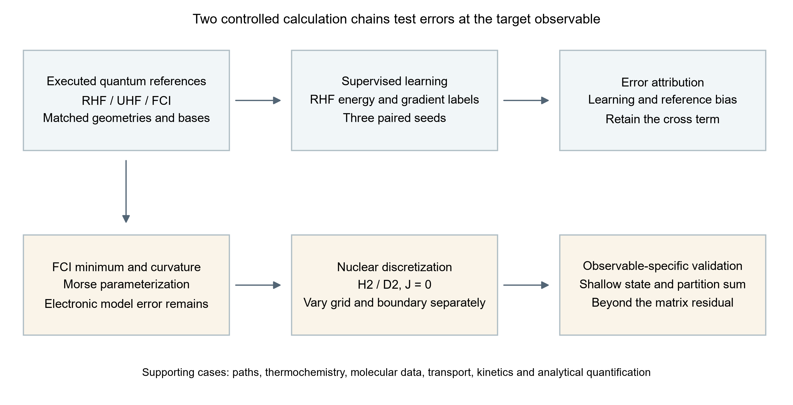

Figure 1. Two controlled calculation chains used for error attribution. Neural training uses RHF labels; FCI is introduced only for independent reference comparison. Nuclear dynamics uses an FCI-parameterized Morse approximation with its own model, boundary and discretization errors. The supporting cases retain their original data types and are not treated as additional H₂ observations.

## 2 Methods

### 2.1 Evidence set and study design

The original source collection is frozen at repository commit 1ad05c243155a9f64b18e0d58c665424fde919a0. It contains the initial five-topic study and subsequent production, research, closed-loop, analytical, transport, molecular-graph, porous-material-model and quantum/path studies. Supporting Information S1–S12 documents the complete scope, including components that are not used to establish the main quantitative conclusions. Actual molecular calculations, public experimental labels, analytic controls, synthetic objectives, simulated feedback and unexecuted quantum inputs are distinguished at source-file level.

The main H₂ analysis is a small-system benchmark. Its geometries are correlated points on one dissociation curve, not independent samples of chemical space. Three random seeds probe initialization dependence, not population-level statistical uncertainty. The new error-transfer and Richardson analyses are explicitly post hoc operations on frozen data. No new electronic energy, neural training run or nuclear eigenproblem is counted for these arithmetic analyses. Model selection in the main H₂ study uses validation data; its pilot exposes only training and validation records. Some earlier supporting pilots include held-out outputs, so the complete historical collection cannot be described as an end-to-end blinded evaluation.

### 2.2 Electronic reference calculations

Psi4 1.11 [7] was used for neutral H₂ in C1 symmetry at 25 internuclear separations between 0.50 and 4.00 Å. RHF, UHF and FCI were evaluated in STO-3G and cc-pVDZ [8] with a common geometry at each point. The nuclei lie at ±R/2. SCF used a CORE guess, PK integrals, energy and density convergence thresholds of 10⁻¹² and a limit of 200 iterations. UHF used orbital mixing and followed internal instabilities; RHF stability was checked. FCI used the RHF reference, one root, no frozen orbitals, an energy threshold of 10⁻¹² and a residual threshold of 10⁻¹⁰. The two basis sets yield 4 and 100 determinants in the Nα=Nβ=1 sector, as verified from saved logs.

The main electronic study comprises 150 curve energies, two isolated doublet H calculations, 21 FCI minimum-search evaluations and ten FCI curvature evaluations. The search interval is 0.6–0.9 Å. Five-point curvature estimates use h=0.0025 Å; the electronic depth is Dₑ=2E(H)−E(minimum). Twenty successful pilot/recovery energy calls are counted separately, yielding 203 actual energy-driver calls. Six earlier optional-diagnostic configurations were rejected before dispatch and are not counted as energy calculations. The original study's 58 quantum jobs remain a separate record. Underlying SCF phases within FCI are not counted again.

FCI removes configuration truncation within the specified orbital basis and electronic Hamiltonian. It does not remove basis incompleteness, relativistic, nonadiabatic or environmental errors. STO-3G and cc-pVDZ are not nested contracted bases, so their observed ordering is not used as a general variational theorem. The stored FCI spin expectation is unavailable; the spin of its RHF reference orbitals is not substituted for a CI-wavefunction diagnostic.

### 2.3 Paired molecular energy learning

A 3537-parameter distance-message neural network is trained on the earlier 42-point RHF/STO-3G dataset, split into 17 training, 8 validation, 8 test and 9 stretched out-of-distribution geometries. A shared hydrogen embedding, two width-16 message/update layers with SiLU nonlinearities, two directed edges and a summed atomic-energy readout define an invariant scalar energy. Cartesian forces follow by automatic differentiation. This construction follows message-passing and continuous molecular-energy representations [9, 10], but is not presented as a reproduction of either cited architecture. H₂ contains only one independent distance; the model is consequently a radial regressor in this application.

Training-only energy and radial-gradient standard deviations, 0.0937046071 Hartree and 0.318790348 Hartree Å⁻¹, normalize the losses. The energy-only objective minimizes normalized energy mean-square error; the joint objective adds normalized radial-gradient mean-square error. Both select checkpoints using the same sum of normalized validation energy and gradient RMSEs. Thus energy-only training still uses validation gradients and the training gradient scale. Seeds 7301, 7302 and 7303 are paired across objectives with identical initialization hashes. Each main run uses 800 full-batch float64 Adam steps, cosine learning-rate decay from 0.003 to 0.00015, gradient clipping at norm 5 and zero weight decay. All selected checkpoints are at epoch 800; this is a budget endpoint, not proof of optimization convergence.

Frozen energy-only and joint Gaussian-RBF fits and a linear interpolation/extrapolation baseline are retained. They use the original label split. Energy invariance and force covariance are checked under rotations, reflections, translations and atom permutation, and every Cartesian force component is compared with central energy differences. These tests evaluate the learned scalar function's mathematical consistency. They do not compare its forces with correlated electronic forces.

### 2.4 Signed attribution and improvement transfer

The reference join is performed at identical saved geometries. It includes 21 separations and 126 model/seed records, comprising all eight test geometries and five of the nine original OOD geometries. Let ε be neural error relative to the old RHF label, d the old-to-fresh RHF replay difference, and b the fresh RHF–FCI difference. Then

$$
\begin{aligned}
\widehat E-E_{\rm FCI}&=\epsilon+d+b,\quad \epsilon=\widehat E-E_{\rm RHF}^{\rm old},\\
d&=E_{\rm RHF}^{\rm old}-E_{\rm RHF}^{\rm new},\quad b=E_{\rm RHF}^{\rm new}-E_{\rm FCI}.
\end{aligned}
$$

The replay difference is zero at the recorded precision for all joined geometries. The new grouped analysis therefore retains the exact two-term mean-square identity

$$
{\rm MSE}_{\rm FCI}=\langle\epsilon^2\rangle+\langle b^2\rangle+2\langle\epsilon b\rangle.
$$

The cross term can be negative. Its value is reported directly rather than interpreted as a positive variance contribution. For the same finite set, the reverse triangle inequality and triangle inequality give

$$
\left|{\rm RMSE}(b)-{\rm RMSE}(\epsilon)\right|
\leq {\rm RMSE}(\epsilon+b)
\leq {\rm RMSE}(b)+{\rm RMSE}(\epsilon).
$$

These are standard identities and bounds, not new theory. They become informative here because all terms are available at matched geometries. A relative improvement is 100[1−RMSE(joint)/RMSE(energy-only)], computed once against RHF and once against FCI for each seed and split. Test and matched-OOD results are reported separately. No FCI labels enter fitting, checkpoint selection or hyperparameter adjustment.

### 2.5 Nuclear model and numerical error separation

The electronic minimum, isolated-atom depth and local FCI curvature define a Morse approximation [11]

$$
V(r)=D_e[1-e^{-a(r-r_e)}]^2,\qquad a=\sqrt{k/(2D_e)}.
$$

This is a three-quantity parameterization, not a nonlinear fit to the full electronic curve. H₂ and D₂ share the same electronic potential; reduced masses use half the bare proton/deuteron masses, 1.0072764665789/2.013553212544 u. A second-order finite-difference radial Hamiltonian with Dirichlet endpoints represents J=0 nuclear motion. A symmetric tridiagonal eigensolver extracts states below Dₑ. An independently specified Morse control, Dₑ=0.2 Hartree, a=1.8 Å⁻¹ and rₑ=1 Å, checks the implementation against the exact full-line spectrum.

The principal grids use 400, 800 and 1200 intervals on [0,8] Å; domain variation and a deliberately displaced-wall control are recorded separately. Six final model/isotope spectra yield 130 main-grid levels. The main, pilot and shallow-state follow-up comprise 38, 6 and 7 unique eigenproblems, respectively. Full-line and finite radial boundary conditions are distinguished throughout. Bound-state partition sums are evaluated at 100, 298.15, 600, 1000, 2000 and 4000 K. Reported F is the bound-only vibrational Helmholtz contribution, not the full molecular Gibbs energy.

The follow-up varies radial extent and spacing independently. A new arithmetic analysis compares shallow-state binding errors with matrix residuals for the same saved eigenproblems. It also computes the standard second-order estimate Bext=(4B(h/2)−B(h))/3 at fixed right boundaries of 48 and 96 Å. This extrapolation is post hoc, assumes a leading quadratic grid error, and does not replace the archived single-grid spectrum or establish general convergence for other potentials.

### 2.6 Retrospective repository sampling and lineage control

The expanded evidence set was assembled from the six public repositories visible under the author's GitHub account on 29 September 2026. Public availability defines the sampling frame; it does not imply that these projects form a random sample of computational chemistry. Each external repository was inspected at a fixed commit, and selected numerical files were retained with original repository paths, byte-level SHA-256 hashes and extraction scripts. Commit history was used to identify inherited code, revised analyses and continuations. Repository names, README summaries, prospective task descriptions and rendered screenshots were not accepted as equivalent evidence for an executed calculation.

The aqueous-solubility repository and the complex-scaffold repository share their initial commit. Nine selected code/image blobs are byte-identical across the two histories. The early solubility model is therefore one inherited study, not two independent validations. Similarly, a later campaign that repeats settings from an earlier pilot is counted both as an execution history and as a deduplicated set of scientific settings; the two counts answer different questions. A restarted NEB path is a continuation, not a new accepted transition state. Cached optimization queries count decisions made by a policy, not additional transport solves. This lineage control is necessary before comparing apparent computational scale.

Table 1 identifies the frozen repositories and their role in the paper. Full commits and source-level records are distributed in the history audit directories. The local source study underlying Sections 3 and 7 remains unchanged; the present expansion adds retrospective extraction, recalculation of summary statistics, figures and interpretation. Newly computed arithmetic is explicitly distinguished from fresh electronic-structure calculations, neural training, dynamics or experiments. No additional wet-laboratory measurements are reported.

**Table 1. Historical sampling frame and frozen commits.**

| Repository | Commit prefix | Role of selected evidence |
|---|---|---|
| [aqueous-solubility-ml-benchmark](https://github.com/songsiyi2006-chem/aqueous-solubility-ml-benchmark/tree/5939547a936ed4baf7fa7ee9fac6fa6e90bfa8fe) | 5939547a | Inherited solubility code; no row-level prediction archive |
| [ai4chem-complex-scaffolds-benchmark](https://github.com/songsiyi2006-chem/ai4chem-complex-scaffolds-benchmark/tree/5e19c519dbd11430926828fddf5375b919af67f0) | 5e19c519 | Conformers, variational blocks and matched reference calculations |
| [Paper-Analysis-ChemMLLM](https://github.com/songsiyi2006-chem/Paper-Analysis-ChemMLLM/tree/c1d309a0c2f876ccc8b4d2ce753ece971d58fe97) | c1d309a0 | Literature-analysis provenance, not new molecular calculations |
| [ai4pharm-lead-developability-suite](https://github.com/songsiyi2006-chem/ai4pharm-lead-developability-suite/tree/a7a2a4df501d5dad030dc488691b02c73fdb423f) | a7a2a4df | Executed sampling and docking controls |
| [pincer-catmech-ai](https://github.com/songsiyi2006-chem/pincer-catmech-ai/tree/2edffb123791bd61acbfdeff763f603ee50c2287) | 2edffb12 | State-quality, baseline and pathway audits |
| [subject-group](https://github.com/songsiyi2006-chem/subject-group/tree/073bb3872d9112ec1ca46b3b9e80476d00ffbf97) | 073bb387 | Electronic, nuclear, transport, kinetic and analytical controls |

### 2.7 Evidence units, controls and missing results

The unit of evidence depends on the question. A conformer optimization is a run on a geometry; a molecular-property test row is a molecule; a VMC block is a segment of a correlated trajectory; and a Git commit is a version of an archive. None of these units can be substituted for the others. Accordingly, the paper reports counts within each study, retains attempted and successful runs separately, and avoids a global sum of heterogeneous calculations. Repeated time stamps and shared molecular labels are not interpreted as independent observations. A failure or missing geometry remains in the denominator relevant to the attempted campaign even when it cannot enter an energy comparison.

Three classes of comparison are used. Exact or analytic controls diagnose implementation and discretization within a stated model. Matched-reference comparisons diagnose sensitivity to a specified change in electronic method, basis, solvent or reference definition. Public measured labels and archived external traces provide empirical context, but their experimental provenance belongs to the original data producers. These comparisons have different inferential reach. A synthetic negative control can demonstrate that a procedure detects a designed failure; it cannot estimate its error rate in an unspecified experimental population.

Uncertainty is kept attached to its generating unit. Across-seed variation describes the repeated training or search runs that were actually executed. Across-block variation diagnoses finite correlated sampling and is not automatically a standard error for the exact ground-state energy. A bootstrap of rows cannot create independent experiments from a single time series. Small repeated-run sets are consequently shown through their recorded values and descriptive summaries, with no population-level significance claim. Arithmetic joins use exact saved identifiers or geometries rather than proximity matching when the corresponding reference is available.

Absence is also typed. An untrained output head has no validated task performance; a quantum job that timed out has no accepted energy; an implemented MECP runner that dispatched no eligible pair has no quantum crossing calculation; and an unarchived model weight file prevents independent reproduction from that checkpoint. These are different limitations and lead to different repairs. The extraction records preserve them instead of replacing missing values by zero or dropping them silently.

### 2.8 Selection of methods literature and chemical precedent

References were selected for the methods actually used and the scientific distinctions evaluated. Relevant foundations include molecular conformation generation with experimental torsional preferences [12, 13], the GFN2-xTB approximation [14], and the PySCF electronic-structure framework [15]. These citations identify methodological lineage; they do not imply that every published capability was exercised by the archived scripts. In particular, an interface to a quantum package is not evidence of a completed quantum calculation.

The ESOL and CNS-MPO references identify the origins of structure-based solubility estimation and multiparameter scoring [16, 17]. The local implementation uses approximate descriptors and assumed ionization parameters, so agreement with its equations does not reproduce the original studies' validation.

The pharmaceutical examples are interpreted in the context of molecular dynamics in OpenMM, well-tempered metadynamics and AutoDock Vina [18, 19, 20]. Their published methods provide definitions and precedent, while the actual local settings and outputs determine what the current calculations show. Low-frequency thermochemical sensitivity is compared with the established need to treat soft modes carefully [21]; replacing a frequency by a floor is not silently relabeled as the cited physical treatment. The AqSolDB paper supplies the identity of the solubility dataset discussed in the historical archive [22], not missing prediction records.

Published bibliographic identity was checked against publisher pages, official method documentation or author-maintained institutional records. The reference registry records access limitations and explicitly marks abbreviated author lists. A DOI, author name or journal title was never inferred solely from a project-generated citation. The paper makes no unverified journal-quartile claims, and published electrosynthesis precedents are kept separate from calibration of the present models. Literature review is targeted to this retrospective analysis rather than presented as an exhaustive priority search.

## 3 Results

### 3.1 Electronic references separate correlation error from basis effects

All 50 same-basis, same-geometry comparisons satisfy EFCI≤EUHF≤ERHF within 10⁻⁸ Hartree. Twenty-eight UHF points are classified as lower spin-broken solutions and twenty-two as restricted-like. The first sampled lower branch occurs at 1.26 Å in both bases; this is not an exact location of the bifurcation. At 4 Å, RHF exceeds FCI by 0.318301388 Hartree in STO-3G and 0.216407978 Hartree in cc-pVDZ. UHF reduces this energy difference but has ⟨S²⟩ values of 0.999980059 and 0.999764680, respectively. The lower mean-field energy therefore accompanies substantial spin contamination.

Table 2. FCI quantities used to parameterize the nuclear models. Electronic depths use two isolated H atoms and exclude nuclear and thermal corrections.

| Quantity | STO-3G | cc-pVDZ |
|---|---:|---:|
| Equilibrium distance / Å | 0.734865227 | 0.760893445 |
| Minimum energy / Hartree | −1.137306051 | −1.163672981 |
| Electronic depth / Hartree | 0.204142352 | 0.165116174 |
| Curvature / Hartree Å⁻² | 1.703746695 | 1.307967354 |

The 4 Å FCI values remain 7.66273×10⁻⁶ and 4.93793×10⁻⁵ Hartree below their two-atom references. A visually flat stretched curve is therefore not treated as the asymptotic reference. Figure 2 shows the reference curves and the large discrepancy that persists when a restricted single-determinant description is retained during dissociation. These results reproduce established small-molecule physics and provide the controlled reference change needed for the learning analysis.

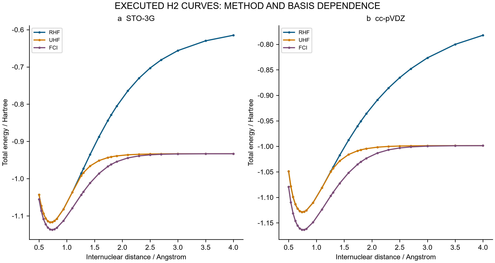

Figure 2. Executed H₂ total energies for RHF, UHF and FCI in STO-3G and cc-pVDZ at 25 common separations. Total energies include nuclear repulsion. Lines connect saved points and do not represent additional calculations. FCI is a finite-basis electronic comparator.

### 3.2 Improved fitting transfers weakly to the correlated reference

Against the original RHF labels, joint supervision improves energy and gradient errors for all three paired seeds on both the full test and full OOD sets. Test energy RMSE decreases from 0.000226936–0.000757399 Hartree for energy-only fitting to 0.000090229–0.000216394 Hartree for joint fitting. Every neural model nevertheless has larger test energy and gradient errors than both frozen RBF models. The neural models extrapolate more accurately on the original nine-point stretched RHF set, a benefit confined to this reference and radial domain.

The matched FCI comparison changes the interpretation. RHF–FCI RMSE is 0.068653520 Hartree on the eight test geometries and 0.208255039 Hartree on the five matched OOD geometries. Joint networks have test FCI RMSEs of approximately 0.06864 Hartree even when their errors against RHF are below 0.00022 Hartree. For all three paired seeds, reducing the fitting loss yields only a small change in total test error relative to FCI (Table 3 and Figure 3).

Table 3. Relative reduction in energy RMSE after adding gradient supervision. Every comparison uses the same geometries and initialization seed; OOD contains five matched points here, not the nine points of the original learning evaluation.

| Split | Seed | Reduction against RHF / % | Reduction against FCI / % |
|---|---:|---:|---:|
| Test | 7301 | 73.64861 | 0.021679 |
| Test | 7302 | 71.42932 | 0.015494 |
| Test | 7303 | 60.24035 | 0.008384 |
| Matched OOD | 7301 | 97.44489 | 3.403104 |
| Matched OOD | 7302 | 70.12125 | 8.214032 |
| Matched OOD | 7303 | 62.52848 | 4.284502 |

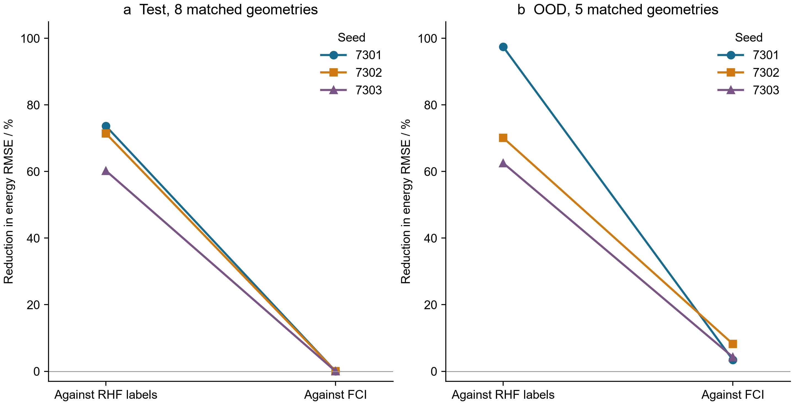

Figure 3. Percentage reduction in energy RMSE from energy-only to joint training, evaluated against two references at identical geometries. Connecting lines identify paired seeds. The eight-point test set and five-point matched OOD set are separate comparisons. These are observed changes in three runs, not confidence intervals or population estimates.

The MSE decomposition explains the weak transfer. For joint seed 7301 on the test set, the learning term is 1.64325×10⁻⁸ Hartree², the reference term is 4.71331×10⁻³ Hartree² and the cross term is −1.47269×10⁻⁶ Hartree². The negative cross term makes the total error slightly smaller than the RHF–FCI reference error alone; it is cancellation, not learned electron correlation. The same sign occurs for all three joint test fits. In matched OOD, the cross term is positive and increases the total error. All twelve grouped identities close within 1.05×10⁻¹⁷ Hartree². Figure 4 retains the signs, which would be lost in a chart of positive percentage contributions.

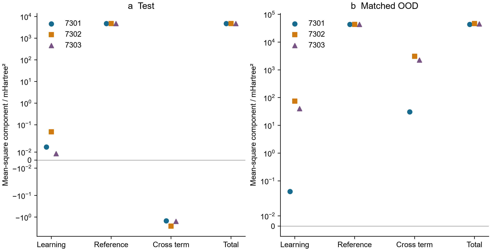

Figure 4. Learning, reference, cross and total mean-square terms for the three joint models. The symmetric logarithmic axis retains negative cross terms; values are expressed in mHartree². The reference term is shared across seeds because the geometries and electronic calculations are identical. Terms are not statistically independent variance components. Panel ranges differ.

The mathematical model checks remain successful. Thirty-six transformation probes have maximum discrepancies of 2.22×10⁻¹⁶ in the corresponding energy and force units. Seventy-two full Cartesian finite-difference cases reach a maximum force discrepancy of 2.22813×10⁻¹⁰ Hartree Å⁻¹ at h=10⁻⁵ Å. These results establish consistent derivatives and symmetry of the learned function while leaving the reference bias intact. Three-seed ensemble spread is also insufficient as a calibrated uncertainty statement: only 75% of the eight test errors fall within twice the sample spread, for both energy and gradient. Eight correlated distances and three fits do not establish coverage for other molecules.

### 3.3 Nuclear accuracy depends on the requested observable

The FCI-derived Morse potentials have electronic-curve RMSEs of 0.00757282 Hartree for STO-3G and 0.00420654 Hartree for cc-pVDZ across the 25 sampled separations. This model error remains even if the nuclear equation for the Morse potential is solved exactly. The finest main grid gives 0→1 gaps of 4722.097/3397.084 cm⁻¹ for H₂/D₂ with STO-3G parameters and 4117.259/2966.494 cm⁻¹ with cc-pVDZ parameters. The corresponding anharmonic isotope ratios are 1.39004412 and 1.38792116, compared with the harmonic ratio 1.41386262. Figure 5 shows the compression of successive Morse levels relative to a harmonic approximation. No transition intensity or experimental spectral assignment is calculated.

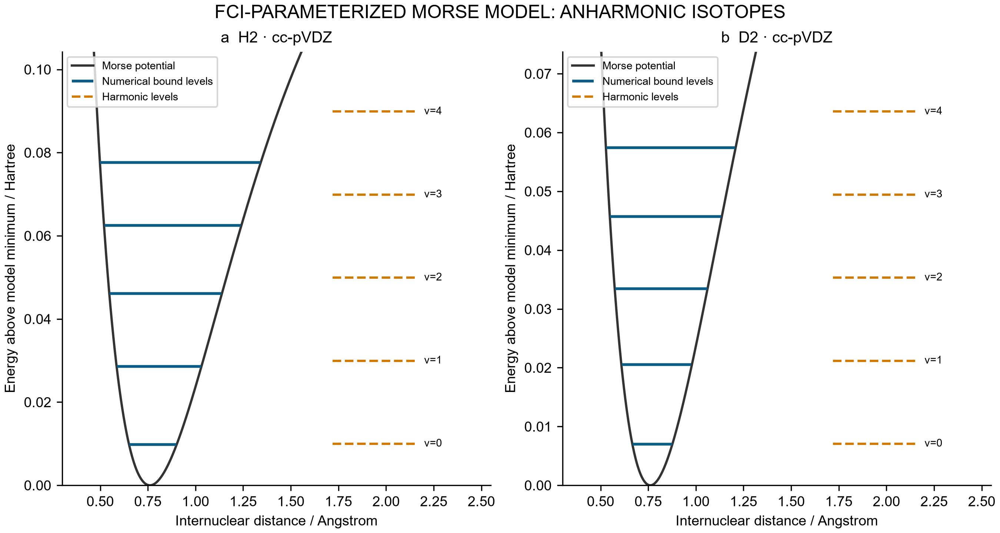

Figure 5. H₂ and D₂ levels on the cc-pVDZ-derived Morse model. Solid levels are the first five bound energies from the main 1200-interval grid; dashed levels are harmonic comparisons. Energies are measured from the model minimum. This representation does not substitute for nuclear propagation on the full FCI curve.

Low levels show approximately second-order convergence, with observed ZPE orders of 2.00057–2.00093. Main-grid matrix residuals are no larger than 1.43×10⁻¹⁴ Hartree, but the maximum error among the first three levels ranges from 3.975 to 5.705 cm⁻¹ across the six spectra, relative to the analytic model at the finest main grid. Near the dissociation threshold, the cc-pVDZ-derived H₂ model has seventeen exact full-line states, whereas [0,8] Å returns sixteen. Its shallowest exact binding is only 6.69637×10⁻⁷ Hartree, with an amplitude decay length of 15.0913 Å. A domain adequate for low levels can therefore omit a state with a long tail.

The follow-up also demonstrates compensation between boundary and grid errors. At 48 Å with 7200 intervals, all seventeen states are found, yet the shallow-state binding has 125.201% relative error. The absolute binding error is about 1.72×10⁸ times the matrix residual for that same eigenproblem. At 96 Å with 115200 intervals, the single-grid binding error decreases to 1.564%, while the matrix residual grows to 1.26610×10⁻¹² Hartree. Ranking these calculations by algebraic residual alone would reverse their physical accuracy ordering (Figure 6a). The residual and binding error are not interchangeable error bounds.

Table 4. Fixed-boundary, second-order extrapolation of the shallow-state binding. Signed errors are relative to the exact full-line Morse value. These are new arithmetic estimates from archived eigenvalues, not new spectra.

| Boundary / Å | Fine intervals | Fine-grid error / % | Richardson error / % |
|---:|---:|---:|---:|
| 48 | 14400 | 25.76358 | −7.38220 |
| 48 | 28800 | 5.20144 | −1.65261 |
| 96 | 115200 | 1.56403 | −0.02688 |

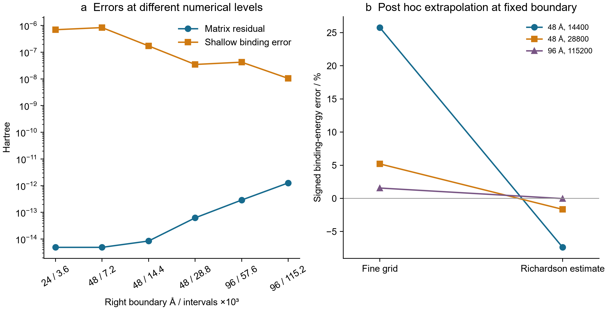

Figure 6. (a) Matrix residual and absolute shallow-state binding error for the same saved eigenproblems after seventeen states are present. (b) Fine-grid and fixed-boundary Richardson errors. The 96 Å estimate improves agreement with the analytic Morse reference; it does not establish the accuracy of the electronic parameterization or a general extrapolation guarantee.

The finest 96 Å extrapolated binding is 6.69456672×10⁻⁷ Hartree, a signed discrepancy of −0.026882% from the analytic value. The weaker 48 Å extrapolations retain larger errors, consistent with unresolved boundary effects and higher-order discretization terms. Only two 96 Å grids are available; the leading-order extrapolation is not independently verified by a third fine grid. At 4000 K, the bound-state vibrational F error decreases from approximately −4.14×10⁻⁶ Hartree on the coarse long-domain grids to −6.46×10⁻⁸ Hartree on the finest grid. A relatively insensitive partition sum can therefore look satisfactory while the shallowest individual state remains inaccurate. Continuum, rotation, translation, nuclear-spin statistics and solvent contributions are absent from this comparison.

## 4 Molecular ensembles and reference alignment

### 4.1 A history audit with explicit units of evidence

The historical repositories contribute a useful comparison between increasingly ambitious scientific workflows and the evidence needed to support their conclusions. The central result is not a count of completed software modules. It is a set of traceable cases in which an implementation check, a converged calculation or a favorable reported metric does not establish the next scientific claim. These cases complement the detailed H₂ error chain in the main study: they reveal similar distinctions in solubility learning, conformer screening, variational Monte Carlo, electrochemical time series and charged molecular calculations.

We fixed the public repositories at the remote HEADs verified on 29 September 2026: `aqueous-solubility-ml-benchmark` at `5939547a936ed4baf7fa7ee9fac6fa6e90bfa8fe`, and `ai4chem-complex-scaffolds-benchmark` at `5e19c519dbd11430926828fddf5375b919af67f0`. The former contains one commit; the latter contains 54. Crucially, the entire aqueous commit is the root commit of the complex-scaffolds history. Five inherited Python files and four inherited PNG files have identical byte hashes across the two pinned trees. They are a shared scientific record, not an independent replication. The later repository adds new stages, numerical corrections, fresh-run acceptance reviews, a folder migration, and Phases 28–31. Moving files into project folders does not itself constitute a new calculation. The complete commit-subject inventory and review categories are preserved in [the history CSV](../../history/learning/sources/complex_history.csv); this inventory is not a claim that every historical diff or every large trajectory was exhaustively revalidated.

Table 5. Pinned evidence, counting units and reproducibility boundaries.

| Evidence object | Historical amount | Unit counted | Status in this audit |
|---|---:|---|---|
| Aqueous repository | 1 | commit | Shared ancestor; no stored prediction rows |
| Complex-scaffolds repository | 54 | commits | Stage and audit history; no additive sample count |
| Identical inherited code and figure files | 9 | files | Exact byte-level duplication |
| Phase 01 | 500 | accepted force-field optimization records | 10 valid structures; original and audited rounded energies agree |
| Phase 11 | 100 | saved VMC production block means | 5 systems; 4,050 training epochs; no saved wavefunction weights |
| Phase 28 | 196,496 | published trace rows | 39,726 distinct within-trace timestamps; electrode count unverified |
| Phase 29 | 156 | historical xTB executions | 144 unique settings; 12 executions repeated prior settings |
| Phase 29 DFT crosscheck | 8 | converged single-point jobs | 4 charge-state pairs; 8 matched GFN comparison rows |

The source package retains original MIT notices, pinned paths, original SHA256 hashes, JSON pointers and CSV selectors in [audit.json](../../history/learning/audit.json). Selected publisher-derived numerical aggregates retain source DOIs and workbook hashes; their inclusion does not transfer third-party rights to the repository MIT license. Publisher metadata was checked, but the live rights text could not be retrieved through the publisher identity redirect. No publisher article text, original figures or full workbook is bundled here. The deterministic [post-hoc script](../../history/learning/sources/recompute_history.py) uses only the Python standard library and does not import the original scientific programs. It checks source hashes and recomputes the displayed arithmetic without additional electronic-structure jobs, neural training, molecular optimization or experiments. Raw solver logs were not all reparsed in this historical review; the retained individual result files and execution ledgers support the narrower claims below.

### 4.2 Solubility: a plausible protocol is not a reconstructed benchmark

The original aqueous workflow combines 11 RDKit descriptors with a 2,048-bit Morgan fingerprint of radius 2. Its total feature dimension is 2,059. The code canonicalizes SMILES, removes unparsable structures, averages labels sharing a canonical SMILES, and applies shuffled five-fold cross-validation with seed 42. A separate ESOL holdout uses a random 20% split with the same seed. Before training the two head-to-head models, the script removes AqSolDB molecules whose canonical SMILES match a molecule in that ESOL test set. This is an explicit exact-identity overlap control. It does not establish scaffold separation, independence of source laboratories, disjoint analog series or harmonized measurement conditions. No scaffold-split result or repeated-seed performance distribution is stored in this repository.

The README reports five-fold R² = 0.815 and RMSE = 1.019 log units, followed by a same-test-set comparison of RF RMSE = 0.803 and gradient-boosting RMSE = 0.635 for 226 molecules, with 222 overlapping AqSolDB molecules removed. The corresponding reported R² values are 0.864 and 0.915. These remain **historical report-level values**. The committed tree contains code and raster figures, but no molecular prediction table, raw label snapshot, frozen split identifiers, fitted model or execution log that allows those metrics to be reconstructed at the pinned commit. We did not recover predicted values from image pixels or rerun the training. Therefore the reported 20.9% improvement must not enter a pooled performance analysis alongside fully preserved benchmarks as if it were independently recomputed.

The code also resolves an ambiguity in the historical “old ESOL model” wording. In the head-to-head script, both the four-descriptor random forest and the descriptor-plus-fingerprint gradient booster are fitted to the filtered AqSolDB training rows. The standalone `esol_model.py` uses ESOL training data, but that is a different execution pathway. The head-to-head comparison changes features and model class together; it does not isolate the causal contribution of additional training data, fingerprint representation, or estimator architecture. A single held-out random split is useful evidence under that protocol, but it cannot establish industrial reliability or structural extrapolation to complex natural products.

The paclitaxel discussion further illustrates why chemical interpretation requires a separate evidence layer. The code uses a non-stereospecified input string and 2D features. Neither a low predicted solubility nor a fingerprint bit demonstrates a particular intramolecular hydrogen bond or the burial of polar surface in a conformer ensemble. Even the printed reference-unit conversion requires correction: using the reported molecular weight of 853.9 g mol⁻¹, the stated 0.3–1 μg mL⁻¹ range corresponds to log₁₀ S = −6.454286 to −5.931407 in mol L⁻¹, not the source program’s printed −6.1 to −5.6 interval. This is an arithmetic audit of a stated range, not independent validation of the experimental range itself. The primary AqSolDB descriptor article identifies the dataset, but it does not validate this repository’s particular fitted model or its molecular explanation. [22].

### 4.3 Conformer screening measures sampling behavior, not a trained model’s accuracy

The first complex-scaffolds benchmark contains 11 input records. One original helicene input, M09, fails kekulization and is retained as a failed input; M09R is its separately identified repaired reference. Thus the completed panel consists of 10 valid structures. Each has 50 embedded and accepted, converged optimization records in the audited output. Nine structures use MMFF94, whereas the boron-containing M07 uses UFF because of force-field coverage. The total of 500 is a number of accepted optimization records, not a count of unique minima, independent experiments or quantum calculations. The old and audited JSON files have identical rounded minimum energies, maximum energies and energy ranges for all ten valid structures. A corrected acceptance policy matters for future inputs, but these preserved results do not show an energetic improvement caused by the correction.

Table 6. Audited conformer ranges, with force-field and fragment boundaries retained. Energies are in kcal mol⁻¹.

| Structure | Force field | Accepted records | Minimum energy | Maximum energy | Stored range | Geometric IMHB count |
|---|---|---:|---:|---:|---:|---:|
| M01 | MMFF94 | 50 | 67.37 | 110.42 | 43.06 | 2 |
| M02 | MMFF94 | 50 | 106.33 | 114.92 | 8.59 | 0 |
| M03 | MMFF94 | 50 | 29.16 | 41.33 | 12.17 | 1 |
| M04 | MMFF94 | 50 | 71.34 | 82.83 | 11.48 | 1 |
| M05 | MMFF94 | 50 | −0.15 | 7.72 | 7.87 | 0 |
| M06 | MMFF94 | 50 | 38.04 | 65.47 | 27.43 | 1 |
| M07 | UFF | 50 | 78.56 | 78.82 | 0.26 | 0 |
| M08 | MMFF94 | 50 | 8.43 | 15.27 | 6.84 | 0 |
| M09R | MMFF94 | 50 | 97.19 | 97.19 | 0.00 | 0 |
| M10 | MMFF94 | 50 | 123.99 | 139.09 | 15.11 | 0 |

The table uses the stored ranges rather than subtracting already rounded endpoints; independent rounding explains differences of 0.01. Absolute energies cannot be compared between different chemical compositions as a stability ranking, and the UFF and MMFF94 entries cannot be pooled as one energy scale. M03 is a disconnected two-fragment input: its graph and 3D optimization describe the largest fragment, whereas some bulk descriptors describe the full assembly. Calling that record a fully connected degrader conformer would combine incompatible molecular objects. M09R’s rounded zero range also does not prove that 50 independently distinct conformational minima were discovered.

The historical flag named `ENTROPY` is assigned from an energy-range threshold. An energy range is not a thermodynamic entropy: neither populations, degeneracies nor an equilibrium measure are established by the flag. Similarly, geometrically counted intramolecular hydrogen-bond contacts are structural diagnostics under a distance-and-angle rule, not measured bond free energies. The graph neural network checks confirm feature and tensor compatibility for the supplied graphs, but do not include trained property predictions. Consequently, this benchmark supports an input-applicability and sampling audit, not a claim that a 2D neural network has been quantitatively defeated or that 3D learning has won. The contrast with the fully supervised FreeSolv case in the main manuscript is deliberate: one checks representation plumbing, the other measures label prediction under a specified split.

### 4.4 A neural-wavefunction counterexample with matched numerical and accuracy checks

Phase 11 provides the strongest historical match between passing internal checks and a retained accuracy failure within one completed run. The fresh run stores five systems, each with 2,048 walkers and 20 production block means. The training schedule comprises 1,200 epochs for equilibrium H₂, 550 each for three stretched H₂ cases, and 1,200 for He, for 4,050 epochs in total. The preserved result contains an antisymmetry maximum deviation of zero and an automatic-differentiation versus finite-difference Laplacian relative error of 3.515304 × 10⁻⁷. These diagnostics validate specified numerical operations. They do not bound the variational ansatz error or the stochastic uncertainty of a final energy.

For every system, we independently reconstruct Ē = Σᵢ Eᵢ/20 and SE = s(Eᵢ)/√20 from the saved block means. The comparison reference is a computed FCI aug-cc-pV(T,Q)Z complete-basis extrapolation preserved in the historical run, not an error-free continuum energy. Distances in the system labels are **bohr**, whereas the QuantumEqui bond-scan distances are in ångström. The two studies therefore cannot be joined using the numeric bond label alone, and their different basis/reference definitions preclude treating them as identical-reference replications.

Table 7. VMC point estimates and independently reconstructed block standard errors. Energies are Hartree; errors and SE are mEh.

| System | VMC energy | Computed reference | Signed error | Block SE | Absolute-error threshold | Point gate |
|---|---:|---:|---:|---:|---:|---|
| H₂, R = 1.4011 bohr | −1.173979102 | −1.174441940 | 0.462837 | 0.321004 | 1.600000 | Pass |
| H₂, R = 2.5 bohr | −1.093561268 | −1.093943014 | 0.381746 | 0.203228 | 1.600000 | Pass |
| H₂, R = 4.0 bohr | −1.015835784 | −1.016336946 | 0.501162 | 0.133787 | 1.600000 | Pass |
| H₂, R = 6.0 bohr | −0.999316513 | −1.000740584 | 1.424071 | 0.390502 | 1.600000 | Pass |
| He | −2.902038144 | −2.903699030 | 1.660887 | 0.564223 | 1.600000 | Fail |

Four point estimates pass the unchanged 1.6 mEh gate; He fails. Uncertainty does not convert the failing point estimate into a pass, and a passing point estimate does not establish a confidence-bound guarantee. The earlier acceptance audit, using the same 20 stored block means, reported an iid-block-bootstrap signed-error interval of [0.595197, 2.746738] mEh for He and [0.667166, 2.165752] mEh for stretched H₂ at 6 bohr. These historical intervals are retained as descriptive reanalyses, not new Monte Carlo observations. They assume independent blocks and omit reference extrapolation uncertainty. No claim of autocorrelation removal follows from having 20 block means.

The cusp evidence is weaker still. The saved electron–nucleus and electron–electron directional slopes are −2.430565 and −1.862306, but they were obtained from a finite-radius single-ray log-density fit, rather than spherical averaging followed by the coalescence limit. A later angular-average diagnostic was tested on an analytic function, not on the trained network. The wavefunction `state_dict` was not persisted, so this historical result cannot support a frozen-model cusp remeasurement or independent resampling without retraining. Corrected future source labels cannot retroactively validate an old figure. This is a concrete example of why saving loss histories and numerical energies alone is insufficient for a reproducible learned wavefunction claim.

### 4.5 Published time series: repeated timestamps and estimand sensitivity

Phase 28 reanalyzes numerical source data accompanying two primary organoelectrocatalysis studies. The 2023 Nature record supplies constant-potential and constant-current traces; the 2026 Nature Synthesis record supplies a longer constant-current trace. These are previously published experimental observations, not experiments performed for this manuscript. Source workbook hashes and sheet/column coordinates are preserved, including Figure2g columns A:B and D:E for the earlier study and sheet 2h columns A:B for the later study. [23, 24].

The three traces contain 196,496 numerical rows but only 39,726 unique timestamps when counted separately within each trace. Equal-time entries must not be called independent electrodes or independent degradation events. Their group sizes can change the weight of an endpoint statistic; the retained analysis therefore includes timestamp-balanced medians as well as raw-row medians. The 2023 constant-potential current ordinate has an unresolved normalization, so it is reported in source-ordinate units rather than silently converted to an absolute or area-normalized current. End of record is censoring of observation, not an observed failure time.

Table 8. Trace multiplicity and sensitivity of endpoint changes to analysis windows. For constant-current traces, change is in V; for the constant-potential trace, change uses its unresolved source current ordinate.

| Trace | Rows | Unique timestamps | Duplicate fraction | Balanced 1 h change | All-window change range | Startup ≥10 h change range |
|---|---:|---:|---:|---:|---|---|
| Nature 2023, constant potential | 43,112 | 13,246 | 0.692754 | −0.156250 | [−0.156250, 0.0428125] | [−0.023750, 0.021250] |
| Nature 2023, constant current | 18,750 | 7,707 | 0.588960 | 0.044250 | [−0.004000, 0.044250] | [−0.004000, 0.009250] |
| Nature Synthesis 2026, constant current | 134,634 | 18,773 | 0.860563 | 0.017000 | [0.003000, 0.017000] | [0.003000, 0.006000] |

The 72 saved window specifications expose a substantial estimand choice. For the 2023 constant-current trace, the default balanced one-hour difference is 44.25 mV, while windows excluding at least the first 10 h yield differences between −4.00 and 9.25 mV. For the 2026 trace, the analogous range contracts from 3–17 mV over all specifications to 3–6 mV after that exclusion. These changes use the same preserved traces. They are not between-electrode uncertainty intervals, and choosing the smallest value retrospectively would be an analysis choice, not evidence of improved durability. Figure 9 displays the whole window grid and marks the startup policy explicitly.

Separate source sheets preserve 50 time-dependent mean/SD entries, with the published caption reporting four independent experiments and without individual replicate values. Their final chlorine-production mean is 0.338190 mol at 24 h, and the reported final Faradaic-efficiency mean is 99.792360%. Historical mean intervals rely on assumptions about replicate independence and distribution. Serial comparisons additionally depend on the unknown covariance between timepoints; the repository retains a correlation-sensitivity analysis rather than inventing replicate trajectories. High selectivity over an observed window therefore does not identify a degradation hazard, a lifetime distribution, a mechanism or an industrial replacement schedule. This distinction is particularly relevant when a digital-twin optimizer uses such quantities as objectives: the objective’s definition and sampling unit must precede its optimization.

### 4.6 Charged molecular energies: a reference-aware method comparison

Phase 29 extends an initial 12-call molecular xTB pilot with a 144-call matrix: 12 molecular species, two GFN variants, three environments and two charge/spin states. The extension repeats the 12 initial settings, so there are 156 historical executions but only 144 unique settings across both rounds; 132 settings are new in the extension. All 144 extension calls have normal termination and converged SCC recorded, and all retain floating-point numerical warnings. The 72 state differences are reconstructed here from the saved electronic energies. Their arithmetic matches the preserved table, but matching subtraction does not prove physical accuracy in solution or at an electrode.

The independent crosscheck contains eight converged PBE0 jobs at fixed MMFF cation geometries: cation/radical pairs for Q01–Q03 in def2-SVP and an additional Q01 pair in def2-TZVP. The molecular correspondence is Q01/P01 pyridine, Q02/P04 3-methoxypyridine and Q03/P09 pyridine-3-carbonitrile. Geometry hashes agree across each paired method comparison. ΔE is defined as E(radical, charge 0) − E(cation, charge +1), with the same nuclei within a pair. These are model-state energy differences, not experimental redox potentials, interfacial barriers or product selectivities.

Raw GFN–PBE0 offsets are approximately −5.86 to −5.59 eV for GFN1 and −4.89 to −4.81 eV for GFN2. Because the methods use different electronic energy references for different charge states, those raw offsets must not be labeled prediction errors against physical ground truth. A more interpretable, limited diagnostic removes the common Q01 offset: δM(Q) = ΔEM(Q) − ΔEM(Q01). Its cross-method double difference is δGFN(Q) − δPBE0(Q). This subtraction cancels a method-wide constant charge-state offset while retaining molecule-dependent differences; it does not calibrate redox potentials.

Table 9. Matched def2-SVP reference contrasts and their double differences, in eV. PBE0 is a comparator, not experimental truth.

| Molecule | PBE0 ΔE | PBE0 Q01-centered | GFN1 Q01-centered | GFN2 Q01-centered | GFN1 double difference | GFN2 double difference |
|---|---:|---:|---:|---:|---:|---:|
| Q01/P01 | −4.957325 | 0.000000 | 0.000000 | 0.000000 | 0.000000 | 0.000000 |
| Q02/P04 | −4.776458 | 0.180867 | 0.166602 | 0.162533 | −0.014265 | −0.018334 |
| Q03/P09 | −5.689793 | −0.732468 | −0.475732 | −0.678319 | 0.256736 | 0.054149 |

The two non-parent contrasts show that agreement is molecule dependent. The GFN1 double difference for Q03 is 0.256736 eV; GFN2 gives 0.054149 eV. Conversely, the Q02 double differences are −0.014265 and −0.018334 eV. Q01’s def2-SVP to def2-TZVP increment is −0.039814 eV. That single-molecule basis check cannot establish basis convergence for the other molecules. The radical S² values lie between 0.770825 and 0.776918, compared with 0.75 for a pure doublet, and wavefunction stability was not checked. No geometry relaxation, diffuse-basis study, thermal correction, counterion, electrode reference or explicit interface is included in this DFT comparison.

The larger matrix also preserves ranking instability: the gas-phase GFN1/GFN2 comparison reverses 6 of 66 molecular pairs. GFN1 gas versus acetonitrile reverses 7 of 66. These are within-panel sensitivity counts at fixed stored geometries, not out-of-sample accuracy statistics. They provide a useful companion to the main manuscript’s H₂ reference-bias decomposition: the H₂ chain has an explicit finite-basis FCI comparator, whereas the charged-molecule chain first requires a physically defensible reference alignment and still lacks external target validation.

### 4.7 Historical acceptance gates and a restrained innovation claim

Table 10. Selected later-stage evidence boundaries; these units must not be added to a single “total calculation” count.

| Stage | Preserved numerical scope | Strongest defensible conclusion | Missing or failed layer |
|---|---|---|---|
| 24 | 312 simulated measurements; 312 QC passes | Analytical and acquisition workflow executes on synthetic responses | 0 new experiments; no hardware or chemical validation |
| 25 | 25 audited preliminary xTB minima across pilot jobs | Local molecular minima and partial imine calculations | Selectivity undetermined; accepted DFT TS/IRC absent |
| 26 | 48 condition entries; 3 dry slab seeds | Interface study design and starting objects | 0 complete solvated interfaces |
| 27 | 6-member design; 3 excitation windows | Literature-coordinate and analysis preparation | 0 new nonadiabatic trajectories |
| 29 | 8 converged PBE0 single points | Same-geometry method comparison | 0 validated TS/IRC; same-pair switching unproved |
| 30 | Carbon residual −4.11658 × 10⁻¹⁹ mol s⁻¹; heat residual −7.43849 × 10⁻¹⁵ W | Conservation and numerical checks of a reduced scenario | Uncalibrated; no DFT/AIMD or industrial validation |
| 31 | 18 converged MMFF conformers | Bounded local molecular engineering pilot | 0 FEP trajectories; 0 accepted lead candidates |

Earlier phases receive the same treatment in the machine-readable coverage ledger. Phase 04’s independent saddle refinement does not retroactively make the original NEB converged or supply a verified IRC; Phase 05 retains multiple imaginary modes and near-zero yield; Phase 06 finishes a trajectory but undersamples the product. Phases 03, 07, 08 and 12–16 have pending or incompletely accepted scientific scopes. Phases 09–10 are protocol/control models, Phases 17–19 have bounded atomic, numerical or geometric validations, and Phases 20–23 use effective transport, optical, spin or circuit models. Their presence in a Git history does not demonstrate laboratory implementation. Phase numbers identify modules, not maturity levels.

The historical material suggests a methodological contribution that can be tested and reused: a claim should be linked to a specific identity, reference, sampling unit, computational state and acceptance gate. This is stronger than a generic call for reproducibility because the preserved counterexamples are paired. The same VMC run passes internal checks but fails the He point-accuracy target; the same molecular geometry has converged methods but reference-sensitive energy comparisons; the same experimental trace changes its apparent drift under alternative startup windows. Other comparisons are explicitly unpaired: a solubility README without predictions cannot be equated with a frozen supervised benchmark, and a force-field conformer panel cannot be promoted into a GNN accuracy test. Distinguishing these cases prevents a persuasive narrative from outrunning its data.

Figures 7–11 present the resulting historical comparisons: per-structure conformer ranges with UFF identified, VMC signed errors with saved-block standard errors and a fixed accuracy threshold, complete startup/window sensitivity for the three published traces, paired raw and Q01-centered molecular-energy contrasts, and the complete method/environment rank-reversal matrix. All five figures use the accompanying CSVs and retain negative outcomes. They describe newly organized and recomputed historical evidence; they do not add experiments, training runs or independent samples to the preserved record.

<!-- historical figures -->

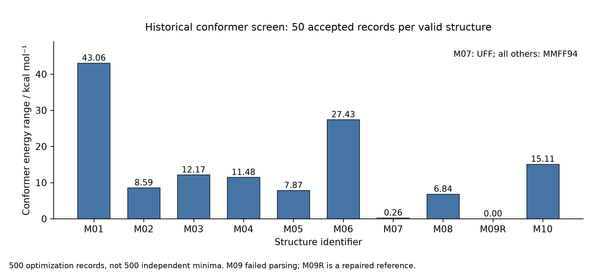

Figure 7. Historical conformer energy ranges. Every valid structure contributes 50 accepted optimization records; the hatched M07 bar uses UFF and all others use MMFF94. The ranges do not measure entropy or establish unique minima. [SVG](../../history/learning/figures/Figure_L1_Conformer_english.svg).

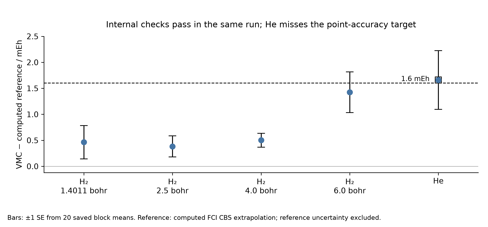

Figure 8. VMC errors against the saved computed FCI CBS reference. Error bars are ±1 block standard error from 20 saved production blocks per system; they exclude reference uncertainty. The 1.6 mEh line is the unchanged point-estimate gate. Distances are in bohr. [SVG](../../history/learning/figures/Figure_L2_VMC_english.svg).

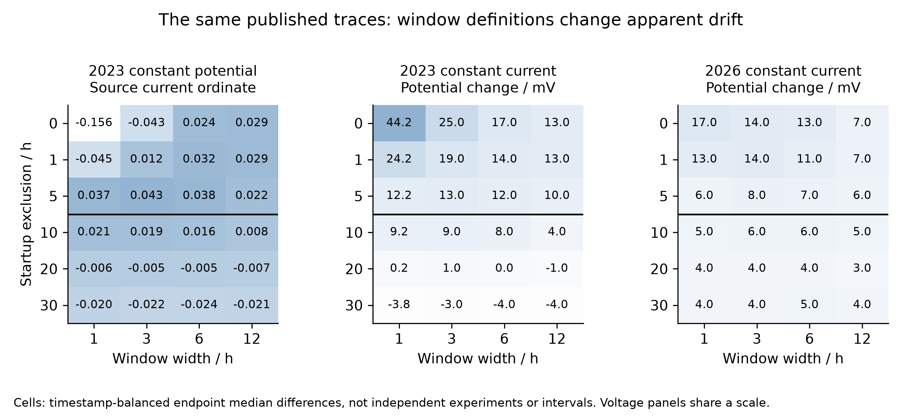

Figure 9. Endpoint-change sensitivity over all 72 saved window specifications, using the same three published traces. Voltage panels share the −5 to 45 mV color scale; the source-current panel has an independent −0.16 to 0.05 scale with unresolved current normalization. The black divider marks startup exclusion of at least 10 h. Values are descriptive contrasts, not independent-replicate confidence intervals [23, 24]. [SVG](../../history/learning/figures/Figure_L3_Trace_Windows_english.svg).

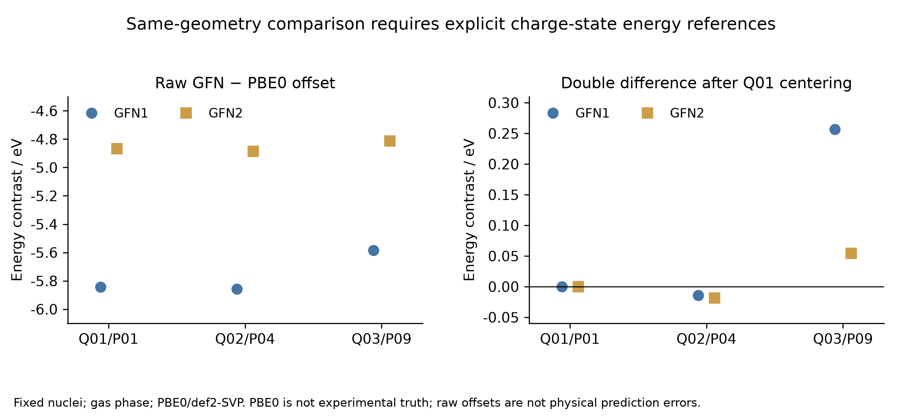

Figure 10. Fixed-geometry gas-phase comparison with PBE0/def2-SVP. Left: raw charge-state offsets. Right: double differences after subtracting each method’s Q01 value. The different vertical scales are intentional. PBE0 is a method comparator, and the raw offsets are not calibrated physical prediction errors. [SVG](../../history/learning/figures/Figure_L4_Reference_Alignment_english.svg).

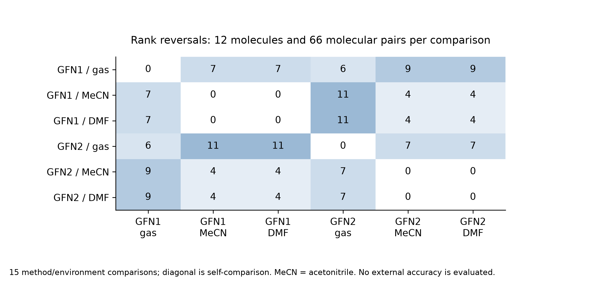

Figure 11. All 15 method/environment comparisons from the 72 state differences. Each off-diagonal cell counts reversed orderings among the same 66 pairs of 12 molecules, not new calculations or errors against experiment. Diagonal zeros are identity comparisons. [SVG](../../history/learning/figures/Figure_L5_Rank_Reversals_english.svg).

## 5 Catalytic state quality and limits of pathway inference

### 5.1 Scope, provenance, and the unit of evidence

The public `pincer-catmech-ai` archive provides a complementary test of the validation hierarchy developed in the main text. Whereas the H₂ study permits controlled comparisons along a well-defined coordinate, the catalysis archive contains several chemically and numerically different objects: molecular electronic-structure jobs, constructed solvent clusters, incomplete reaction paths, supervised conformer-energy labels, and synthetic kinetic fixtures. Their coexistence does not establish an integrated, experimentally validated catalytic mechanism. Our purpose is to determine which conclusions survive when the original calculation records are followed through successive acceptance criteria.

The audit fixes the public repository at commit **2edffb123791bd61acbfdeff763f603ee50c2287**, independently matched to the remote HEAD and main branch. This is later than the local historical checkout at 9aa9c08b15f2f64b3f108e4a90e0f8ec0a4352c0. The ten-commit history includes the original workflow, a native screening campaign, Phase 3 spin and microsolvation studies, Phase 4 precursor checks, and subsequent molecular preflights associated with a Cu–N–P research direction. The last description is a project context, not the elemental composition of every calculation. In particular, the latest molecular DFT model contains no Cu. Commit messages establish chronology; numerical claims below are anchored to saved results rather than inferred from those messages.

The [source catalog](../../history/catalysis/sources/catalog.json) identifies each source by a C or N identifier and records its fixed commit, repository path, Git blob identifier, original-byte SHA-256, retained excerpt hash, and JSON-pointer or CSV-row selector. C01–C24 cover the curated data and attribution records; N01–N10 identify native logs used for independent energy checks. All numbers in the tables refer to these sources, and the six `posthoc_*.csv` files attach evidence identifiers and formulas to each derived row. Ten final electronic energies were re-extracted from native logs: the eight converged Phase 3 states and the two completed later molecular DFT states. All matched their corresponding machine-readable records at the archived precision, with a maximum absolute discrepancy of 0.0 Hartree. This establishes transcription consistency, not independent electronic-structure accuracy. No new quantum-chemistry job was run for the present audit.

Counts retain their original unit. A target slot is not a launched calculation; an SCF solution is not necessarily a minimum; a conformer pair is not an independent catalyst; and an input prepared for a remote computer is not a submitted job. The Phase 3 readiness table contains 24 designs and 40 temperature/base combinations per design, hence 960 rows, but records zero accepted physical predictions for the proposed 18-step kinetic mechanism [C01]. Its baseline of 383.15 K and total added tBuOK equivalent of 0.05 are scenario inputs. Total base does not determine the free-anion activity, and the alcohol activity was not measured. Multiplication of a design grid therefore measures bookkeeping scope rather than the number of experimentally constrained predictions.

### 5.2 Spin screening: a converged state is not a crossing

The principal vertical spin matrix used PBE/STO-3G, a 35 × 110 integration grid, SOSCF, electronic and density convergence targets of 10⁻⁸ and 10⁻⁶, and nominal multiplicities of 1, 3, and 5 for 18 designs [C03]. Calculations were performed on supplied geometries; identity and connectivity checks do not by themselves validate the proposed active species. The archived record contains 54 target slots: 48 launched physical state attempts, 40 timeouts, six missing source geometries, and eight converged states. These counts describe the specified matrix rather than the sum of every exploratory protocol in the repository.

**Table 11. Acceptance counts in the archived vertical spin matrix.** Sources: C02–C06; exact selectors and arithmetic are in [posthoc_spin_gates.csv](../../history/catalysis/sources/posthoc_spin_gates.csv). Rows are different acceptance stages, not disjoint samples.

| Record or acceptance stage | Count |
|---|---:|
| Target state slots | 54 |
| Physical state attempts | 48 |
| SCF-converged states | 8 |
| Spin- and identity-eligible states | 6 |
| Raw computable vertical gaps | 1 |
| Eligible diagnostic gaps | 0 |
| Accepted MECPs | 0 |

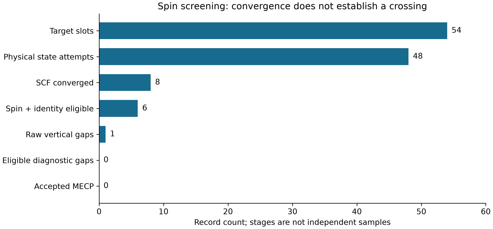

**Figure 12.** Counts at successive stages of the fixed-commit spin audit. The raw-gap row counts an energy difference, whereas preceding rows count states; the plot is an evidence progression and must not be interpreted as independent sampling or a statistical survival curve. [Vector figure](../../history/catalysis/figures/Figure_C1_Spin_Gates_english.svg).

The distinction between convergence and a usable spin pair is visible in the expectation values of S². For Fe_bipyridine_pnnoh_iPr, the converged triplet had ⟨S²⟩ = 2.661445763547917, giving a contamination diagnostic of 0.661445763547917 relative to S(S+1) = 2. The Fe_macho_pnp_iPr quintet had ⟨S²⟩ = 6.166902016475518, or 0.166902016475518 above the ideal value of 6. Both were flagged by the archived screening rule. The other six converged states passed the recorded spin and identity checks; this is a necessary numerical filter, not proof that their electronic states represent the experimental catalyst [C03–C04].

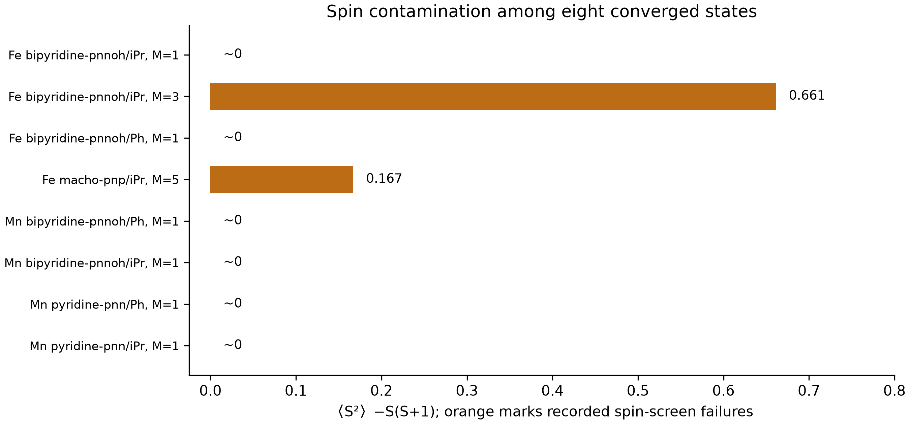

**Figure 13.** Recorded ⟨S²⟩ − S(S+1) for the eight converged states, with archived spin-screen failures in orange. M denotes multiplicity. Values near zero include roundoff-level negative singlet values and are displayed as approximately zero. [Vector figure](../../history/catalysis/figures/Figure_C2_Spin_Quality_english.svg).

Only one raw vertical difference can be formed from the available matrix: the Fe_bipyridine_pnnoh_iPr triplet-minus-singlet value is −0.0314591288624797 Hartree [C05]. Because its triplet fails the spin screen, this is not an accepted spin-ordering result or a crossing energy. The downstream MECP record explicitly reports `no_eligible_pair`, zero quantum pair evaluations, and zero quantum state attempts [C06]. Thus no MECP optimization was launched from this matrix. The zero result is a precondition rejection, not evidence that a crossing does not exist, and certainly not a converged minimum-energy crossing point. This distinction is central to error propagation: a downstream routine cannot supply missing state-pair information merely by accepting a numerical difference as input.

### 5.3 Microsolvation: electronic association and thermodynamic association differ

The microsolvation data concern bounded constructed clusters rather than an experimentally measured solvent ensemble. Nine GFN2-xTB optimizations combined three cluster sizes with three starting seeds; all converged while retaining the recorded connectivity. Calculations used xTB 6.7.1, ALPB toluene, the extreme optimization setting, accuracy 0.5, and 300 K electronic smearing [C09–C12]. One sampled lowest-energy structure per cluster size was selected for a Hessian, yielding three selected-cluster Hessians rather than a comprehensive conformer partition function. The selected structures correspond to seeds 2, 1, and 0 for one, two, and three tBuOH molecules, respectively.

**Table 12. Selected microsolvation association quantities.** All entries are in kcal mol⁻¹. C09–C12 support the values; [posthoc_solvation_selected.csv](../../history/catalysis/sources/posthoc_solvation_selected.csv) records the selected rows. The final column is the frozen-fragment contribution beyond the summed pair interactions.

| tBuOH count | ΔE association | ΔG, 298.15 K, 1 M | ΔG, 383.15 K, 1 M | Beyond-pair contribution |
|---|---:|---:|---:|---:|
| 1 | −10.994093 | 0.658254 | 3.797726 | 0.000000 |
| 2 | −21.166260 | 3.586112 | 10.220408 | 1.547073 |
| 3 | −31.716522 | 4.105509 | 13.685284 | 3.558360 |

Increasingly negative electronic association energies do not imply increasingly favorable standard association free energies. At 383.15 K, the corresponding 1 M free energies are positive and rise from 3.797726 to 13.685284 kcal mol⁻¹ across the sampled sizes. The archived thermochemistry applies ALPB solvation and one 1 atm-to-1 M correction, with every participating species defined at 1 M. Actual solution populations require concentrations or activities and adequate conformational sampling; they cannot be recovered from the table alone. Neither these clusters nor their association free energies include a catalyst, an explicit tBuOK ion pair, or an accepted transition state [C12].

The beyond-pair term also requires a narrow interpretation. For the two-alcohol cluster, the frozen interaction energy is −0.9529920930613116 eV, compared with a pairwise sum of −1.0200795115757728 eV. Their difference is positive, not extra stabilization. For the three-alcohol cluster, the corresponding quantities are −1.4095253966465862 and −1.5638304890707104 eV. Because fragments are evaluated with ALPB, this decomposition includes changes in continuum cavity and reaction-field contributions. It is not a pure isolated-molecule electronic many-body interaction [C11]. A later sensitivity calculation generated 405 arithmetic rows without new quantum jobs and exactly reproduced the 27 baseline thermochemistry rows. At 383.15 K, the reported low-frequency-cutoff ranges were 0.793212, 2.298506, and 3.465158 kcal mol⁻¹ for the three cluster sizes [C18]. This sensitivity is a model-choice diagnostic, not a statistical error bar or experimental validation.

### 5.4 Proton-wire paths and kinetic fixtures: retaining the negative result

The proton-wire study contains two independently initialized paths and a continuation of the first path. It uses a neutral GFN2-xTB/ALPB-toluene model without explicit potassium or a free tBuO⁻ species [C13–C14]. The last force residual is therefore meaningful only for that modeled band, and total-base activity remains unresolved. None of the saved attempts meets the 0.07 eV Å⁻¹ force target. Continuing an unsuccessful path does not produce an additional independent chemical trial.

**Table 13. Unaccepted proton-wire path records.** The energy column is the sampled band maximum above its reactant reference, not an activation barrier. C13–C14 and [posthoc_proton_wire.csv](../../history/catalysis/sources/posthoc_proton_wire.csv) provide exact values and force-ratio formulas. No row is an accepted transition state.

| Path record | Last step | Force / eV Å⁻¹ | Force/target | Band maximum / eV |
|---|---:|---:|---:|---:|
| Start 1, cluster seed 02 | 100 | 0.375882 | 5.369743 | 1.795702 |
| Start 2, cluster seed 01 | 100 | 1.347282 | 19.246886 | 4.568802 |
| Start 1 continuation | 200 | 1.206630 | 17.237571 | 2.391468 |

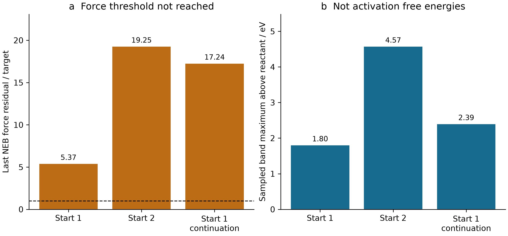

**Figure 14.** (a) Last recorded force residual divided by the convergence target; the dashed line is one. (b) Sampled band maxima. Start 1 and Start 2 denote independent initializations, not the numerical cluster-seed identifiers. The continuation reuses Start 1. Unconverged bands cannot establish activation free energies. [Vector figure](../../history/catalysis/figures/Figure_C4_Unaccepted_Paths_english.svg).

The product-graph check passed only for the second initialization. It failed for the first and its continuation, while even the graph-passing attempt retained a force residual more than nineteen times the target. The archived elapsed time was 1182.0914974212646 s, with zero accepted transition states and zero activation free energies [C14]. A visible peak on a discretized path is insufficient: endpoint identity, band convergence, stationary-point characterization, and connection to the intended reaction remain separate questions. Here the saved evidence stops before those requirements are collectively satisfied.

The associated kinetic code has a different evidential role. Its synthetic fixture evaluates 40 grids, generated from eight temperatures and five initial free-base equivalents, at 500 time points. Rates are arbitrary test inputs. The maximum analytic-versus-finite-difference Jacobian error was 9.630873876176338 × 10⁻¹¹; the largest metal and base conservation errors were 3.642919299551295 × 10⁻¹⁷ M and 4.996003610813204 × 10⁻¹⁶ M. The metal-sensitivity conservation residual was 5.72390984436566 × 10⁻¹⁷ M [C15]. These are useful differential-equation implementation checks. They do not measure catalytic turnover, establish an 18-step network, or replace absent activation free energies. The ledger explicitly retains zero physical catalyst predictions.

### 5.5 A trained EGNN with a negative baseline comparison

The archived auxiliary EGNN is trained, unlike the untrained neural potential examined elsewhere in this manuscript. Its evidence is nevertheless restricted to relative conformer energies. The dataset construction accepted 610 native-converged structures and rejected 202 records, producing 540 non-self pairs in 70 composition groups spanning six families [C07–C08]. The reference within each composition group is the lowest original conformer index, selected deterministically without an energy-based choice. Native optimization convergence does not establish that every structure is a Hessian-certified minimum.

The split holds out complete backbone/substituent families across metal, state, and conformer records. Training contains 374 pairs from four families, validation contains 80 pairs from `macho_pnp|iPr`, and testing contains 86 pairs from `macho_pnp|Ph`. This is a stronger separation than randomly splitting closely related atomistic records, but it is still a small, task-specific archive and does not demonstrate unrestricted catalyst transfer. The 12,675-parameter network was trained using PyTorch 2.10.0 on a CPU with two threads. The ledger records nine completed or partial epochs, a best-validation epoch of 0, and 85.032 s elapsed time [C07].

**Table 14. Auxiliary relative-energy prediction and simple baselines.** MAEs are in eV. The equal-reference baseline predicts zero relative energy; the second baseline uses the training target mean. C07 and [posthoc_egnn_metrics.csv](../../history/catalysis/sources/posthoc_egnn_metrics.csv) contain full precision and checkpoint provenance.

| Split | Pairs | EGNN MAE | Equal-reference MAE | Training-mean MAE |
|---|---:|---:|---:|---:|
| Training | 374 | 0.286664 | 0.286438 | 0.297798 |
| Validation | 80 | 0.261617 | 0.259393 | 0.337521 |
| Test | 86 | 0.195200 | 0.193999 | 0.260416 |

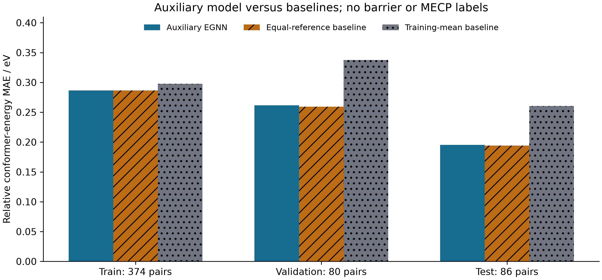

**Figure 15.** Split-specific MAEs for the actual trained auxiliary network and two baselines. The targets are relative conformer electronic energies; no activation-barrier or MECP-gap labels were available for training those outputs. Bars do not represent repeated-training uncertainty. [Vector figure](../../history/catalysis/figures/Figure_C3_EGNN_Baselines_english.svg).

The network improves on the training-mean predictor but not on the equal-reference baseline in any split. Its test MAE of 0.19519976927396127 eV exceeds the equal-reference value of 0.19399893976147659 eV, corresponding to an improvement of −0.0012008295124846802 eV [C07]. The absence of a positive result should not be concealed by reporting only the weaker baseline. The retained test RMSE is 0.3845663866708711 eV. Activation-barrier and MECP-gap heads have zero observed labels and remain untrained; the 540-pair auxiliary task cannot confer validity on those heads.

Checkpoint-level symmetry checks establish a different property. Under float64 rotations, improper rotations, permutations, and batching, the recorded maximum scalar and coordinate errors were both 1.7763568394002505 × 10⁻¹⁵, in eV and Å respectively [C07]. This is strong evidence for the tested transformations of that implementation, but invariant or equivariant errors can coexist with poor chemical prediction. The result illustrates why architecture verification, label validity, baseline comparison, and external validation must remain separate. No retrospective claim of a fully test-blind development history is made from the saved split labels alone.

### 5.6 Later native calculations narrow the claim rather than completing the mechanism

Phase 4 added nine local quantum calls: three Psi4 jobs and six xTB calls. The two converged Psi4 jobs did not produce a usable same-method spin pair [C16–C17]. Their gradients also preclude interpreting SCF convergence as geometry stationarity.

**Table 15. Same-geometry Phase 4 spin pilot.** The molecular target is Fe_bipyridine_pnnoh_iPr; all calculations use PBE. Gradient maxima are in Hartree bohr⁻¹. A dash means unavailable, not zero. C17 and [posthoc_phase4_jobs.csv](../../history/catalysis/sources/posthoc_phase4_jobs.csv) preserve energies, timings, and screening decisions.

| Basis; multiplicity | Outcome | ⟨S²⟩ | Maximum gradient | Spin screen |
|---|---|---:|---:|---|
| STO-3G; 5 | SCF converged | 6.193760 | 0.201560 | Fail |
| def2-SVP; 1 | SCF converged | approximately 0 | 0.035808 | Pass |
| def2-SVP; 5 | Timeout | — | — | Unavailable |

The quintet recovery energy with STO-3G was −2533.7232403662692 Hartree, whereas the def2-SVP singlet energy was −2562.3192161270376 Hartree. Their difference is not a spin gap because the basis sets differ. The def2-SVP quintet timed out after 450.0779999999795 s. None of these jobs establishes chemical validity of the proposed catalytic species [C17].

The six xTB calls had a distinct purpose: optimization, fresh gradient, and full Hessian for each of two 62-atom crystallographic precursor molecules. Both had 180 internal modes and no imaginary frequencies, with lowest frequencies of 33.46886841017446 and 33.81102119885175 cm⁻¹. Fresh maximum forces were 0.0007802942092995298 and 0.0007509869895041861 eV Å⁻¹. Their mapped structural RMSD of 0.00354291 Å does not establish distinct basins [C19]. These are useful model-level minimum checks for precursor structures, not validation of an active intermediate or spin ground state. Six remote-computing inputs were prepared and zero were submitted [C16]. The crystallographic provenance and its upstream CC BY-NC 4.0 notice are retained as C24; the audit copies the notice, not the complete external structural dataset.

The later molecular preflight concerns independently generated coordinates for 3-methylquinazolin-4(3H)-one, C₉H₈N₂O: 20 atoms, 84 neutral electrons, and no Cu [C22]. Twenty completed native xTB calls include a useful stationary-point counterexample. An initially optimized neutral structure had a significant imaginary frequency of −50.49 cm⁻¹. A rotor repair followed by very tight optimization produced a lowest positive frequency of 78.64 cm⁻¹ among 54 vibrational modes [C20]. The accepted result is an xTB-model minimum; it is not a DFT minimum or an experimental structure.

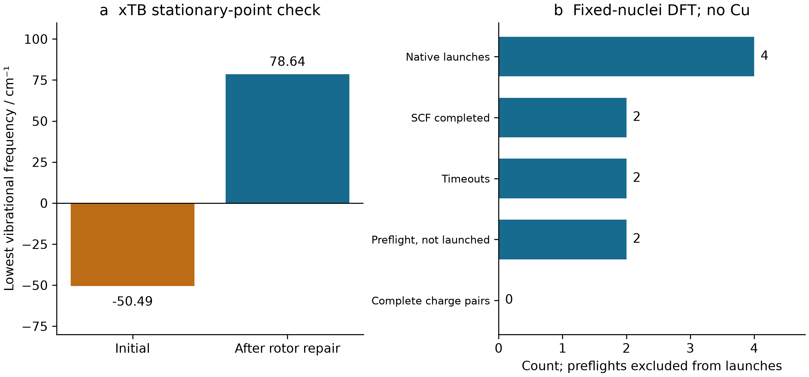

**Figure 16.** (a) Lowest xTB vibrational frequency before and after the rotor repair. (b) Later fixed-nuclei DFT job counts, with preflight rejections excluded from native launches. The molecular model contains no Cu, and zero complete neutral/anion pairs are available. [Vector figure](../../history/catalysis/figures/Figure_C5_Molecular_Preflight_english.svg).

At fixed nuclear geometry, the GFN1/GFN2 differences in anion-minus-neutral charging energies were 0.7816478999991645 eV in the gas phase and 0.8319797664252286 eV with equilibrium ALPB DMF, exceeding the archived 0.2 eV sensitivity threshold [C20]. These quantities cannot be relabeled as nonequilibrium vertical electron affinities, electrode potentials, or solution reaction free energies. The ensuing native DFT pilot used a diffuse basis but did not complete any charge pair.

**Table 16. Later fixed-nuclei molecular DFT launches.** All jobs use def2-SVPD. Sources C21–C23 and [posthoc_dft_jobs.csv](../../history/catalysis/sources/posthoc_dft_jobs.csv) distinguish four native launches from two additional preflight rejections. A dash denotes an unavailable converged energy.

| Functional; charge | Outcome | Energy / Hartree | Wall time / s |
|---|---|---:|---:|
| PBE0; 0 | SCF completed | −531.566397414 | 108.659154 |
| PBE0; −1 | Timeout | — | 300.061065 |
| B3LYP; 0 | SCF completed | −532.173578168 | 117.232500 |
| B3LYP; −1 | Timeout | — | 300.134975 |

The neutral calculations use 307 basis functions. Neither the complete method spread for charging nor a converged electron-addition energy can be obtained from the two neutral energies; specifically, subtracting neutral energies from different functionals does not yield an electron affinity. SCF stability was not verified; the protocol has no solvent, DFT geometry optimization, or DFT Hessian [C21]. In this archive, increased computational sophistication therefore refines the location of missing evidence rather than completing a Cu-catalytic mechanism.

### 5.7 Reproduction and implications for the main argument

The audit is reproduced from an existing Git object store, without checking out the complete large repository or rerunning chemistry. With a preconfigured Python interpreter, `python sources/reproduce_audit.py --repository <local-git-object-store>` regenerates the retained extracts and arithmetic tables at the pinned commit. `python plotting.py` regenerates the figures from those extracts; NumPy, Matplotlib, and the documented fonts must already be available. Run these two commands from the repository subdirectory `manuscript/history/catalysis`. The [audit record](../../history/catalysis/audit.json), [native-energy comparison](../../history/catalysis/sources/native_energy_checks.json), [commit history](../../history/catalysis/sources/commit_history.json), and [figure manifest](../../history/catalysis/figures/manifest.json) separate numerical provenance from rendering. PNGs receive AI visual inspection; SVGs receive structural inspection, which is not an independent rendered-image review.

The results supply several concrete stopping rules for evidence propagation. A converged but spin-contaminated state cannot automatically label a crossing problem. Attractive cluster electronic energies cannot replace concentration-dependent association thermodynamics. An unconverged band cannot label a reaction barrier. A symmetry-correct neural model can fail a simple baseline, and training one auxiliary head does not train another physical observable. Finally, a molecular preflight under a catalysis project title does not become a metal-site calculation without the metal and its environment. These are model-specific findings supported by archived native data, not assertions that the intended catalytic chemistry is impossible. Together they explain why the main paper treats acceptance criteria and observable definitions as part of the scientific result rather than as administrative annotations.

## 6 Sampling and docking in molecular developability

### 6.1 Historical scope and the meaning of a recorded result

The pharmacology history provides an independent setting in which computational execution and the intended scientific observable can diverge. We examined the complete nine-commit history of `ai4pharm-lead-developability-suite`, fixed at `a7a2a4df501d5dad030dc488691b02c73fdb423f`. The selected cases concern molecular descriptors, ternary binding, covalent kinetics, an atomistic ternary-complex pilot and structure-guided search. They were chosen for inspectable numerical records and their connection to the manuscript's validation argument, rather than as evidence of drug discovery. No new molecular dynamics, electronic-structure calculation, docking or model training was performed for this integration.

Historical identity was checked at the git-object level. The selected Task 1, Task 2 and Task 3 result tables are byte-identical to their original publication commits, despite subsequent directory reorganization. Their copies in the omnibus recomputation directory are also byte-identical. Consequently, these copies are not pooled as additional molecules, independent chemical replicates or new experimental evidence. The [audit](../../history/pharmacology/audit.json) links every reported numerical group to its commit, source path, SHA-256 and field names; [source metadata](../../history/pharmacology/sources/source_manifest.json) distinguish archived execution provenance from later presentation changes. The MIT license accompanies the copied pharmacology material, while third-party structures retain their attribution.

### 6.2 Multiparameter scores preserve useful arithmetic but not clinical validity

The frozen developability panel contains thirty parent structures, each with a PubChem identifier and structural provenance. Three purposive strata contain ten compounds each. Those identities are public structure records, not thirty measured ADMET labels. The CNS multiparameter optimization score combines six desirability transformations; the historical implementation substitutes toolkit descriptors and chemical-class ionization assumptions. The distinction matters because exact reproduction of a scoring equation does not validate its inputs for a particular ionization state or assay. The original CNS-MPO method provides the methodological reference, whereas the repository's oral score is its own equal-weight ranking construction. [Wager et al., 2010](https://doi.org/10.1021/cn100008c)

**Table 17. Frozen developability strata. Scores are descriptive proxies; conformer counts are sampling outputs.**

| Stratum | Molecules | Median CNS-MPO | Median oral proxy | Embedded / converged conformers | Molecules with partial convergence |
|---|---:|---:|---:|---:|---:|
| Oral references | 10 | 4.989850 | 81.049384 | 48 / 48 | 0 |
| Toxicity-related comparators | 10 | 3.647260 | 75.028315 | 54 / 54 | 0 |
| bRo5 modalities | 10 | 1.617406 | 43.759364 | 60 / 54 | 4 |

All six-term CNS sums, the ESOL equation and the equal-weight oral score were independently recalculated from full-precision stored fields. Agreement was within 10⁻¹². This is an arithmetic check, not an ADMET accuracy result. In particular, the hERG, Caco-2 and absorption outputs use unfitted formulas; a bounded hERG score is not an event probability. Clinical stratum labels do not enter the scoring formula, but a hand-selected clinical panel still cannot estimate prospective discrimination. Differences between its medians are therefore descriptive, without significance or generalization claims.

Geometry introduces a separate limitation. Of the 162 embedded conformers, 156 converged; all six failures occur within four bRo5 molecules. The stored absolute chameleonic hydrogen-bond index is missing for all thirty structures. That is an appropriate non-identification result: a small, equally weighted gas-phase ensemble does not measure solvent-dependent exposure. The plotted pKa envelope varies assumptions and must be read as a scenario range, not a confidence interval. This case shows why provenance suffixes such as “proxy,” “approximate” and “assumed” need to remain attached to downstream charts.

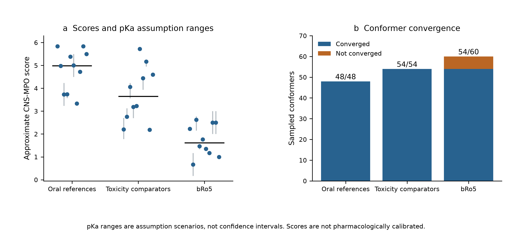

**Figure 17.** Individual approximate CNS-MPO scores and their assumption-based pKa ranges; group medians and conformer convergence are shown separately. The selected strata and uncalibrated score do not establish predictive accuracy.

### 6.3 Ternary equilibrium: a validated equation does not identify productive degradation

The ternary-complex model is especially useful because multiple observables can be separated within the same exact mass-action system. Its archived grid has 724 rows: four cooperativity scenarios and 181 total degrader concentrations per scenario. With E₀ = T₀ = 100 nM, Kᴅ,E = 10 nM and Kᴅ,T = 100 nM, the peak total concentration remains approximately 131.622777 nM while cooperativity changes the peak complex concentration and the width of the high-occupancy window. The alternative supplied peak expression gives 148.323970 nM, a 12.688680% excess for this parameter set. Its disagreement is a formula-level issue, not numerical solver noise.

**Table 18. Ternary-equilibrium sensitivity at fixed affinities and total protein concentrations.**

| Cooperativity α | Exact peak total degrader / nM | Peak ternary complex / nM | 80%-of-peak window / nM |
|---:|---:|---:|---:|
| 0.01 | 131.622777 | 0.570646 | 70.727187–236.327186 |
| 1 | 131.622777 | 29.053551 | 68.346071–275.136772 |
| 10 | 131.622777 | 66.147685 | 69.289276–439.603083 |
| 100 | 131.622777 | 87.675477 | 73.626624–1287.533850 |

Independent substitution of all stored species into the three mass balances and three equilibrium relations passed a 10⁻⁹ relative threshold. Yet neither a high peak nor a broad concentration window identifies ubiquitination-competent geometry, cellular permeability or degradation rate. The repository's HiBiT and western-blot-like readouts are explicitly synthetic. They cannot be relabeled as biological replication simply because their curves are compatible with the chosen kinetic equations.

The associated linker calculation further separates a geometric distribution from biological function. Each capped fragment retains one hundred ETKDG/MMFF draws, including duplicates; these are not one hundred independent conformational basins. The extremely small rigid-linker spread indicates repeated convergence near the same geometry. The assumed 8–12 Å compatibility interval contains no experimentally established exit-vector information, and its occupancy is not a binding-entropy estimate.

**Table 19. Unweighted linker-fragment sampling; the interval is an illustrative geometric criterion.**

| Capped linker | Draws / converged | Mean endpoint distance / Å | Sample SD / Å | Fraction within 8–12 Å |
|---|---:|---:|---:|---:|
| Flexible PEG | 100 / 100 | 9.671507 | 0.957658 | 0.96 |
| Rigid alkynyl | 100 / 100 | 9.604954 | 3.909640 × 10⁻⁷ | 1.00 |

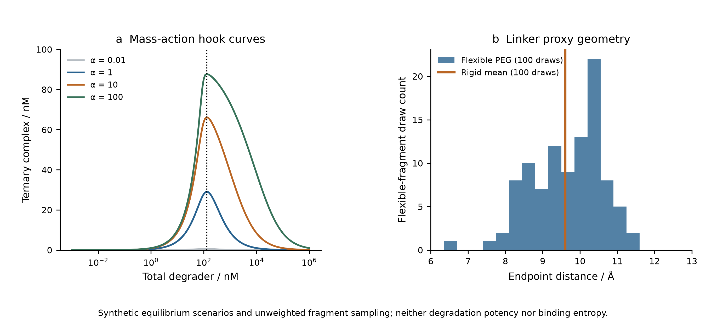

**Figure 18.** Mass-action hook curves and sampled linker endpoint distances. Cooperativity alters occupancy while these scenarios retain the same optimum total concentration. Linker fragments are geometric proxies, not simulated protein-bound degraders.

### 6.4 Covalent kinetics: changing the approximation changes the claimed efficiency

Eight hypothetical warheads combine executed extended-Hückel orbital descriptors with assumed kinetic constants. These are two distinct evidence types. Their displayed kinetic provenance explicitly states that no experimental calibration was performed; the descriptor-derived barrier is not a located transition-state barrier. Optional xTB capability is not evidence that xTB was executed for this panel.

The choice of efficiency denominator is consequential even before biochemical validation. The dissociation constant is Kᴅ = kₒff/kₒn, whereas the forward quasi-steady-state denominator is Kᵢ = (kₒff + kᵢnact)/kₒn. Thus the rapid-equilibrium efficiency exceeds the quasi-steady-state efficiency by the relative factor kᵢnact/kₒff. These expressions are familiar approximations; the contribution here is preserving their distinct meanings in the archived comparison, rather than proposing new kinetics.

**Table 20. Assumed kinetic scenarios and executed EHT localization descriptors. Efficiencies are in M⁻¹ s⁻¹.**

| Warhead ID | kᵢnact/Kᴅ | kᵢnact/Kᵢ | Relative excess / % | Reaction-centre LUMO population proxy |
|---|---:|---:|---:|---:|
| W01 | 30000.000 | 29126.214 | 3.000 | 0.351241 |
| W02 | 20000.000 | 19512.195 | 2.500 | 0.348904 |
| W03 | 60000.000 | 54545.455 | 10.000 | 0.460621 |
| W04 | 45000.000 | 41284.404 | 9.000 | 8.903366 × 10⁻⁹ |
| W05 | 10666.667 | 10389.610 | 2.667 | 8.093850 × 10⁻⁷ |
| W06 | 400.000 | 399.202 | 0.200 | 2.981633 × 10⁻⁵ |
| W07 | 90000.000 | 81818.182 | 10.000 | 0.470255 |
| W08 | 120000.000 | 109090.909 | 10.000 | 0.471430 |

Across two hundred concentration records, the fitted forward-only slow rates agree with an independently evaluated matrix eigenvalue to within 7.82 × 10⁻⁸ relative error. This does not establish reversible residence times: the reverse reaction is deliberately suppressed in this diagnostic. Likewise, a computed global LUMO cannot be assumed to localize on the electrophilic atom. Several population proxies in Table 20 are very small. Numerical rate agreement and the chemical interpretation of orbital localization therefore require separate checks.

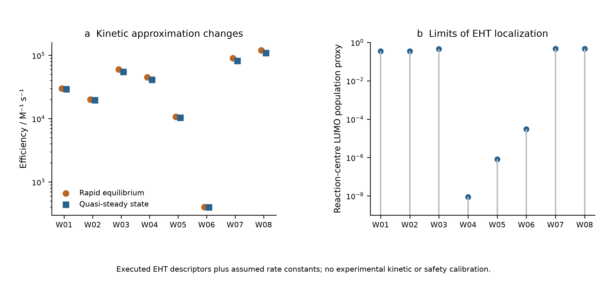

**Figure 19.** Rapid-equilibrium and quasi-steady-state efficiencies, alongside reaction-centre EHT population proxies. Rate constants are hypothetical inputs; neither panel measures target potency or GSH safety.

### 6.5 Atomistic and docking execution still require observable-specific acceptance

The later atomistic case starts from the public 5T35 crystal structure. Independent heavy-atom distance calculations recover 112 atom pairs and fourteen residue pairs within 4.5 Å between the selected VHL and BRD4 chains, with a minimum distance of 2.798363 Å. This is geometric analysis of an experimental structure. The original structural study also used biophysical and cellular evidence; those experiments are external literature, not measurements reproduced by this repository. [Gadd et al., 2017](https://doi.org/10.1038/nchembio.2329)

The saved OpenMM pilot has 150,838 particles but only 0.2 ps of equilibration and 1.0 ps of biased dynamics. Twenty recorded Gaussian depositions satisfy the archived well-tempered height rule; the observed distance spans only 0.024018 nm. Finite coordinates, valid checkpoint metadata and a reproducible bias are useful execution checks. They provide no evidence of recurrent basin transitions or converged free energy. Accordingly, the archived PMF-convergence flag is false and cooperativity remains null. Particle count does not compensate for inadequate sampling of the desired observable. [18, 19]

The structure-guided search has an equally important control. A population history of two thousand rows corresponds to 1,034 evaluated graphs, while the matched-budget random search also evaluates 1,034 graphs. Their union contains 1,597 identities, implying an overlap of 471; population rows are not new independent molecules. The final best geometric score improves by 7.543625% over the initial population but by only 0.084750% over the single random control. The random control also has a higher selected median score. These observations do not support replicated optimization superiority.

**Table 21. Executed molecular workflows and the observables they do not yet establish.**

| Recorded comparison | Numerical result | Remaining evidence boundary |
|---|---|---|
| Atomistic pilot | 150,838 particles; 0.2 + 1.0 ps; 20 hills | No converged PMF or cooperativity |
| Best geometry score: initial / evolved / random | 19.219952 / 20.669833 / 20.652330 | One random control; arbitrary score |
| Selected median: evolved / random | 14.515998 / 15.329122 | No replicated superiority estimate |
| Twelve candidate Vina scores | −6.368 to −4.405 kcal mol⁻¹ | Empirical docking scores, not measured affinity |
| Two X77 redocking heavy-atom RMSDs | 1.242364 / 1.054641 Å | Pose recovery does not calibrate affinity |

Twelve candidate docking records and two redocking controls confirm that docking was executed. However, recovering a known pose tests geometry under that receptor-preparation protocol, not binding thermodynamics across new ligands. The repository appropriately leaves predicted nanomolar affinity and confirmed novelty absent. The score cannot be converted into measured affinity by changing its label. [20]

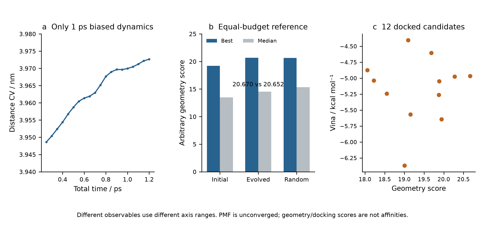

**Figure 20.** The brief atomistic distance trace, equal-budget geometric-search comparison and the selected docking-score subset. Axes represent different observables. Executed dynamics and docking do not establish converged free energies, clinical effects or experimentally confirmed leads.

### 6.6 Literature history contributes context, not additional calculations

`Paper-Analysis-ChemMLLM`, fixed at `c1d309a0c2f876ccc8b4d2ce753ece971d58fe97`, has six commits and twenty-seven tracked files. Its tree contains reading summaries and document artifacts, with no scientific driver, checkpoint or primary result dataset. The public article on ChemMLLM can support discussion of multimodal chemical interfaces; the copper-catalysis article and single-atom electrosynthesis review provide distinct experimental and review contexts. Their DOI records were checked against original publisher pages. None supplies an executed result of the present work. [25, 26, 27]

The audit retains minimal repository provenance and original bibliographic citations, without copying journal PDFs or published figures. No open-license declaration was found in the reading repository, and no journal-quartile claim is inferred from reputation. Its multiple educational editions are not independent scientific replications. Together, these historical cases reinforce an observable-specific rule: structural identity, exact arithmetic, stable integration, pose recovery and biological effect occupy different evidential levels and must not be silently substituted for one another.

## 7 Multiscale observables and controlled model failures

### 7.1 Hydration learning as a measured-label comparison

The H₂ analysis exposes a limitation inherited from an electronic reference. Hydration learning poses a different question: whether a flexible representation improves prediction of a measured molecular property under the archived split. The ElectroGraph study uses a 642-row FreeSolv/SAMPL snapshot checked against the official v0.52 structures and experimental values within 10⁻⁸ kcal mol⁻¹ [28]. A label-blind hash selection retains 256 molecules; 154, 51 and 51 form the training, validation and test partitions. The experimental target is a hydration free energy, not an oxidation potential, reaction yield or activity measurement. Reusing a public measured label does not make these calculations new experiments.

A two-layer edge-conditioned GRU message-passing network contains 29369 parameters. Three seeds each undergo 60 epochs; an additional shuffled-training-label run is a negative control. Training-set normalization and validation-selected checkpoints are retained. The simple descriptor-ridge baseline and a training-mean predictor are evaluated on the same 51 test molecules. Table 22 reports all six test results rather than selecting the best neural seed. The neural RMSE spans 1.249601–1.897239 kcal mol⁻¹, straddling the ridge value of 1.653425. Thus the best seed provides a useful result, but the executed repetitions do not establish uniformly superior performance of the neural representation. The shuffled-label result of 4.852263 is close to the mean-predictor error of 4.805322, supporting the limited interpretation that informative labels, rather than only an expressive architecture, are necessary for this task.

**Table 22. Hydration free-energy prediction on identical test molecules. Units: kcal mol⁻¹.**

| Model | RMSE | MAE |
| --- | --- | --- |
| mpnn_seed20260928 | 1.897239 | 1.426569 |
| mpnn_seed20260929 | 1.746786 | 1.269662 |
| mpnn_seed20260930 | 1.249601 | 1.016765 |
| shuffled_train_mpnn_seed20261001 | 4.852263 | 3.589107 |
| descriptor_ridge | 1.653425 | 1.202677 |
| training_mean | 4.805322 | 3.503397 |

Figure 21. Archived test errors against measured FreeSolv hydration labels. The three neural seeds, shuffled-label control and two baselines share the same 51-molecule test set. Error bars are intentionally absent: these six model errors are not six independent estimates of chemical-space uncertainty.

The partition rule groups ring-containing molecules by nonchiral Murcko scaffold; acyclic molecules are grouped by complete canonical identity. This prevents exact identity leakage but does not prevent close acyclic analogues from crossing partitions. In addition, the historical pilot already saved predictions for all 256 molecules, including the later test set. The main training code remains separated, yet the historical development process cannot be called fully blind. Such distinctions matter when interpreting scaffold or grouped splits [29, 30, 31]. A split is an operational definition of an evaluation domain, not a guarantee that every mode of similarity, previous inspection or selection has been removed. The DataSAIL addendum also cautions against treating one splitting strategy as universally best.

This case connects to the public solubility and conformer projects through representation and evaluation design, not through interchangeable targets. A hydration free energy cannot be inserted into a solubility model without accounting for the additional thermodynamics and measurement conditions. Likewise, learning a property on small public molecules does not calibrate the eight-atom catalyst fragments used elsewhere. The defensible cross-project comparison is therefore whether each model was tested against the observable and baseline its claim actually requires.

### 7.2 Conservation, conversion and intact-product yield

The transport calculations provide a controlled example in which an internally accurate balance and a poor desired-product outcome coexist. ElectraTwin uses a cell-centred finite-volume convection–diffusion discretization with axial upwinding, diffusion in two directions and a half-cell Robin wall flux. The earlier single-reaction model contains only A→P, making desired-product Faradaic efficiency structurally 100%. Optimizing this quantity in that model would not discover selectivity. The later four-species model adds A→B and P→D; all symbols represent abstract species and assigned kinetics rather than identified intermediates of the Tang-group chemistry.

At the archived baseline, total amount and charge balances close at relative errors of 1.83524×10⁻¹⁵ and 1.89173×10⁻¹⁵, respectively. The four outlet concentrations are A=20.795626, P=5.771924, B=1.948402 and D=21.484048 mM. These values sum to the inlet total of 50 mM within numerical accuracy, but most converted A does not remain as intact P. Conversion is 58.408749%; net P yield is 11.543848%; net selectivity is 19.763902%; and net P Faradaic efficiency is 11.387066%. The quantities use different denominators and must not be relabeled as a common efficiency score.

**Table 23. Distinct observables of the four-species model.**

| Observable | % |
| --- | --- |
| A conversion | 58.408749 |
| Net P yield | 11.543848 |
| Net P selectivity | 19.763902 |
| Net P Faradaic efficiency | 11.387066 |
| Gross A→P charge fraction | 53.771593 |

Figure 22. Executed four-species transport-model baseline. Panel a shows outlet concentrations; panel b separates conversion, yield, selectivity and charge accounting. Conservation applies to the assumed abstract network and does not validate a chemical mechanism or a measured reactor.

Gross A→P formation accounts for 53.771593% of the modeled charge, far above the net P efficiency, because the P→D channel consumes product and additional charge. The current contributions are 39.447023, 2.819884 and 31.093433 mA for A→P, A→B and P→D; their sum is 73.360339 mA. Reporting only the first channel would hide product destruction. The distinction is useful for future electrosynthesis studies, but the numbers cannot be transferred to a real electrode without rate, transport and analytical calibration. The calculations implement a counterexample to an inference rule, not a prediction for a particular catalyst.

The historical single-reaction uncertainty and optimization studies have not been rerun with the four-species network. Consequently, the new net-product losses cannot be appended to their cached objective values. Keeping these versions separate is essential: otherwise a combined figure could appear to optimize chemistry that the optimization code never evaluated. The repository history records this model boundary as well as the execution counts.

### 7.3 Fixed-budget search and the strength of simple baselines

Sequential optimization is evaluated on an 81-candidate, 9×9 pool generated by the older deterministic transport model. Three policies use 64 paired seeds and a total budget of 25 selections, including five shared initial candidates. The resulting 4800 objective uses are cached evaluations, not 4800 fresh PDE solves. This makes the comparison inexpensive to replay and isolates policy behavior on that pool, while limiting conclusions about continuous optimization, noisy experiments and general reactor design.

At the final budget, mean hypervolume fractions relative to the full candidate pool are 0.992024 for GP-MC-EHVI, 0.982781 for random selection and 0.989218 for maximin space filling. The GP has the highest mean, but its advantage over the structured non-Bayesian baseline is much smaller than its advantage over random selection. Newly recomputed paired differences give GP wins/losses of 45/19 against random and 33/31 against maximin, with no ties under a 10⁻¹² numerical threshold. The mean normalized improvements are 0.009243 and 0.002807, respectively. These are descriptive seed comparisons on a fixed pool, not probabilities of success in a new laboratory campaign.

**Table 24. Final normalized hypervolume over 64 seeds at budget 25. SD describes variation across seeds.**

| Policy | Mean | SD | Minimum | Maximum |
| --- | --- | --- | --- | --- |
| gp_mc_ehvi | 0.992024 | 0.001734 | 0.987164 | 0.995286 |
| random | 0.982781 | 0.015598 | 0.929280 | 0.994952 |
| maximin_spacefill | 0.989218 | 0.008467 | 0.952652 | 0.994824 |

Figure 23. Archived fixed-budget optimization and blocked-input prediction. Each point in panel a is one seed–policy endpoint; horizontal black marks show means. The positions within each group are deterministic display offsets, not another variable. Panel b retains the archived STY/50000 normalization. Overlapping holdout uses are not independent new data.

The archived study also includes 26 holdout splits, including blocked flow and blocked overpotential groups. Quadratic regression outperforms the fixed GP on both blocked-input groups. Search performance and pointwise prediction accuracy are related but distinct: a policy can make useful selections without minimizing global RMSE, while a model with accurate interpolation may fail in a blocked region. The relevant comparison depends on whether the intended claim concerns prediction, acquisition decisions or attained objectives. Counting successful code calls cannot resolve this distinction.

The uncertainty extension further contains 1792 Sobol-design solves, 16 grid checks and 21 local-derivative solves. It assumes five independent input distributions and uses a Jansen estimator with N=256. Some first-order estimates exceed total-effect estimates and some sums exceed one; these numerical diagnostics were retained, not clipped into apparently physical percentages. Five hundred paired-row resamples are exploratory sensitivity diagnostics. They are not a substitute for calibrated uncertainty in correlated quasi-Monte Carlo sampling, nor do the assumed parameter ranges become experimentally measured distributions.

### 7.4 Stochastic turnover and finite-window comparators

The ElectroGraph kinetic model is a five-state irreversible cycle with independent sites. Direct stochastic simulation [32] is compared with a continuous-time Markov-chain solution at the same observation window and with an analytic renewal limit. The main archive contains 273 trajectories and 9950504 events, excluding five pilot trajectories. Event count measures computation performed; it does not turn assigned rate constants into experimentally established chemistry.

The potential scan has six assigned overpotentials and 32 trajectories at each point. Table 25 preserves the simulated mean, trajectory standard deviation and finite-window comparator. For the assigned cycle, the long-time turnover frequency is the reciprocal of the sum of the mean waiting times. The adsorption, coupling and desorption rates impose an upper bound of 26.61034847 s⁻¹. Increasing the potential-dependent rates cannot remove the time spent in these other steps, and the archived scan approaches saturation rather than the source script's hardcoded 260.2 s⁻¹.

**Table 25. 32 trajectories at each assigned overpotential; TOF in s⁻¹.**

| η / V | SSA mean | SD | Finite-window CTMC |
| --- | --- | --- | --- |
| 0.2 | 26.413727 | 0.281082 | 26.419159 |
| 0.3 | 26.627655 | 0.217436 | 26.582874 |
| 0.4 | 26.660767 | 0.227923 | 26.606421 |
| 0.5 | 26.619110 | 0.311069 | 26.609788 |
| 0.6 | 26.592865 | 0.276221 | 26.610268 |
| 0.7 | 26.564178 | 0.283199 | 26.610337 |

Figure 24. Executed stochastic trajectories compared with the same-window Markov-chain model. Error bars show between-trajectory standard deviations, not uncertainty in chemical rate constants. The occupation panel is the model's stationary solution. The overpotential dependence was assigned; no electrode measurement is inferred.

At the scanned points, the maximum relative discrepancy of the trajectory mean from the finite-window comparator is approximately 0.2043%. Agreement with an independently evaluated mathematical representation is a meaningful verification of the chosen stochastic algorithm. It does not identify the reaction network, establish spatial interactions, impose microscopic reversibility or couple the cycle to the finite-volume reactor. Those would be additional models requiring additional evidence. In particular, the kinetic and transport datasets must not be multiplied together to create an apparent multiscale prediction without a defined interface and consistent units.

### 7.5 Molecular dynamics: the mean is not the distribution

The SynthaPore dynamics study uses an analytic eight-particle harmonic cluster with 21 internal Cartesian degrees of freedom. Twenty NVE trajectories and 24 thermostat replicas total 350000 integration steps. The observed energy-error orders of 1.96457–2.04409 are consistent with the expected second-order integration behavior over the tested time steps. This is an executed algorithmic control whose reference is known; it is not an atomistic prediction for a porous organic polymer.

The thermostat comparison is more discriminating than average temperature alone. With eight replicas, Langevin BAOAB gives a mean temperature of 302.508228 K and a within-trajectory variance ratio of 0.982727 relative to the canonical reference. Correctly counted Berendsen coupling gives 299.999705 K, an apparently excellent mean, but a variance ratio of only 3.10355×10⁻⁷. Retaining the source's degree-of-freedom convention shifts the mean to 342.856740 K. The canonical reference temperature variance is 8571.428571 K². Table 26 and Figure 25 show both moments because either one alone would omit an important diagnosis.

**Table 26. Temperature moments for eight replicas per thermostat.**

| Thermostat | Mean / K | Variance / K² | Variance ratio |
| --- | --- | --- | --- |
| langevin_baoab | 302.508228 | 8423.370489 | 0.982727 |
| berendsen | 299.999705 | 0.002660 | 3.10355e-07 |
| berendsen_source_dof | 342.856740 | 0.003125 | 3.6453e-07 |

Figure 25. Means and fluctuations for the analytic harmonic-cluster control. Dashed lines mark 300 K and unit canonical variance ratio. The right panel is logarithmic. The plotted variances are finite correlated-trajectory diagnostics, not independent-sample confidence estimates.

Berendsen weak coupling is an established method [33]; the present calculation does not claim to discover its sampling limitations. Its role is to demonstrate, using archived trajectories, how a plausible mean can hide an inappropriate distribution. This parallels the shallow-state example: an easily monitored number may stabilize before the observable needed for the scientific claim is correct. For a future adsorption or free-energy calculation, ensemble sampling, equilibration and correlation would need to be assessed directly rather than inherited from a temperature-control smoke test.

The associated path studies also distinguish software return status from a stationary point. Eighteen reviewed analytic CI-NEB cases converge under explicit force and endpoint checks, whereas ten of twelve source-algorithm controls return convergence without meeting the independently assessed force threshold [34, 35]. The analytic barriers and Hessian signatures verify the implementation on the stated surfaces. They cannot be promoted into chemical activation barriers or evidence for a Cu-containing transition state.

### 7.6 Analytical recovery under model misspecification

An analytical pipeline can fail at the final conversion from a measured signal to the claimed quantity even when its optimizer succeeds. The toolkit archive supplies 80 synthetic two-peak recovery cases: four peak separations, two width specifications and ten noise seeds per condition. The true area is known from the generator. This enables an explicit comparison of fitted peak area with fixed-window integration while keeping measured instrument data out of the claim.

With the correct peak width, mean absolute fitted-area errors range from 0.011026% to 0.054386%; corresponding window-integration errors range from 2.110304% to 32.221383%. Under the deliberately wrong width, fitted-area errors instead range from 8.249158% to 24.445618%. At the widest 0.25 min separation, the incorrect fitted model is substantially worse than window integration: 8.249158% versus 0.756555%. The same fitting strategy can therefore appear excellent or poor depending on a structural assumption that the optimization residual alone does not certify.

**Table 27. Mean absolute peak-area error in synthetic chromatography; ten cases per row.**

| Wrong width | Separation / min | Fitted error / % | Window error / % |
| --- | --- | --- | --- |
| False | 0.03 | 0.054386 | 32.221383 |
| False | 0.06 | 0.029811 | 30.041023 |
| False | 0.13 | 0.011026 | 20.259837 |
| False | 0.25 | 0.014230 | 2.110304 |
| True | 0.03 | 24.445618 | 29.354524 |
| True | 0.06 | 15.327456 | 27.174165 |
| True | 0.13 | 10.435116 | 17.392978 |
| True | 0.25 | 8.249158 | 0.756555 |

Figure 26. Post hoc summaries of all 80 saved synthetic chromatographic recovery cases. Each point is the mean absolute error over ten noise seeds. The panels distinguish correctly specified and misspecified peak widths; neither is an experimental calibration or a claim about a particular HPLC method.

This example provides a direct bridge to future wet-laboratory validation. Raw chromatograms, internal-standard quantities, response factors, integration rules and orthogonal measurements would be required to turn peak recovery into a yield claim. Source HPLC and NMR arithmetic in the earlier repository did not agree, so concordance was not assumed. No new wet-laboratory yield is reported here. The value of the numerical study is that it identifies which assumptions should be tested before a high-precision number is interpreted as a chemical measurement.

### 7.7 What can and cannot be combined across these levels

The six comparisons are linked by a question, not by a common physical unit: does the checked property establish the intended observable? Hydration RMSE, product efficiency, hypervolume, turnover frequency, temperature variance and recovered peak area cannot be averaged into one score. The references also differ: public experimental labels, conservation identities, a finite candidate pool, a Markov-chain solution, an analytic ensemble and a synthetic signal generator. Each supplies a useful comparator for one claim while leaving other claims unresolved.

Across these cases, the evidence supports a sequence of reporting decisions. Specify the molecular or model identity; identify the label or mathematical reference; state the sampling and selection domain; report the observable that matters; and preserve the failure when an internal check and the target conclusion disagree. This sequence is not a new general theorem or a substitute for chemical validation. It is an operational synthesis grounded in the saved calculations, and it prevents the portfolio's many successful executions from being mistaken for one validated end-to-end electrosynthesis platform.

## 8 Discussion

### 8.1 What the combined analysis contributes

The main contribution is the joint quantification of two distinct barriers to interpreting improved computation. First, the matched-geometry study measures how a substantial supervised-learning gain is suppressed by an unchanged electronic reference bias. Second, the nuclear study measures how excellent discrete residuals can coexist with a missing or inaccurate near-threshold observable, and separates fixed-boundary refinement from domain enlargement. The connection is an operational validation procedure: identify the final observable, distinguish the reference and numerical approximations that affect it, and test each with an appropriate independent comparator before passing a result downstream.

This procedure is illustrated by exact signed arithmetic and controlled interventions, not by a new error identity or a new eigensolver. It is also narrower than a claim of a universally reliable AI chemistry platform. The same-basis FCI comparison provides a useful electronic target for H₂, while the full-line Morse spectrum provides a useful mathematical target for nuclear discretization. Neither is an experimental truth for general catalysis. The supporting cases show additional ways that execution, symmetry, conservation and optimization can become disconnected from their intended scientific claims; they do not estimate how frequently such failures occur in the literature.

Reference-limited improvement is particularly relevant when selecting the next calculation. If the measured reference-bias norm greatly exceeds the fitting-error norm on the target domain, further fitting alone has limited scope to change that domain's total error. The triangle bound makes this statement quantitative for the observed finite set. A better electronic reference, a changed representation of the target property, or direct calibration may then deserve priority. This is a conditional decision rule, not proof that model capacity or training data are generally unimportant. Error cancellation can also make a worse fit accidentally closer to a chosen higher-level reference; the signed cross term prevents that cancellation from being mistaken for a learned correction.

The electrosynthesis examples clarify what a chemically grounded extension would require. Tang and collaborators report a zinc single-atom cathode with anodic iodide mediation for pyridine hydroxymethylation [3], an iron single-atom redox mediator for anodic organic synthesis [4], and manganese-catalyzed oxygen evolution coupled to silane oxidation [36]. Their tellurium-containing oxazolidinone synthesis supplies another experimentally defined transformation [37]. These are distinct chemical systems and cannot be represented by relabeling the abstract A/P/B/D network or the H₂ benchmark. A future computational study would need complete structures, matching electrochemical conditions, assigned products and pathway-specific reference calculations for one chosen transformation. The papers motivate that requirement; no validation against their experiments is claimed here.

### 8.2 Relation to existing research and scope of novelty

Energy/force learning, equivariant representations, uncertainty estimation, reference-method dependence, and the distinction between numerical verification and physical validation are established research topics [1, 2, 5, 6]. The potentially reusable result here is their connection through frozen, auditable examples with all intermediate quantities exposed. The H₂ learning comparison preserves initialization pairing, label-access rules and exact geometry matching; the nuclear comparison links the same eigenproblem's residual to a specific shallow-state error. The released records allow these conclusions to be checked without rerunning every scientific calculation.

An especially relevant comparison is the study by Kamath and colleagues, which already compared neural and Gaussian-process potential surfaces through both fitting quality and calculated vibrational spectra [38]. The present neural-reference and Morse-nuclear chains are separate: the learned neural potential is not inserted into the nuclear solver. An end-to-end neural-potential-to-spectrum propagation study has therefore not been performed. The narrower distinction is the quantified attenuation of RHF fitting gains against matched FCI values, combined with a separate near-threshold grid/domain counterexample. This distinction prevents the earlier literature's contribution from being presented as new work here.

The present collection does not support claims of a novel catalyst, a new chemical reaction, chemical-space transferability, a new scalable quantum method or state-of-the-art learning accuracy. Its strongest contribution is a reproducible methodological case study. Establishing broader novelty would require multiple chemically distinct and independently assembled reference families, additional model architectures and matched compute budgets, and blinded external replication.

### 8.3 Limitations and next validation steps

The primary electronic system has two electrons, the supervised input is effectively one-dimensional, and both basis sets are small. The stretched points intentionally expose a well-known mean-field limitation. Only three seeds and small correlated test sets are available. The new matched-OOD analysis includes five of nine originally designated OOD points; it does not silently extrapolate missing FCI labels. The nuclear potential is parameterized from three FCI quantities and differs from the sampled electronic curve. Its finite radial boundary problem is not identical to the analytic full-line comparator. The finest extrapolation is promising within that model but remains based on two grids.

Supporting chemistry workflows combine different evidence types and cannot establish a single end-to-end accuracy claim. In particular, no Cu reaction path has a validated quantum stationary point and connectivity analysis, no electrode/solvent model is calibrated against the cited electrosynthesis studies, and no new laboratory experiment is included. Literature examples establish relevance, not validation. A credible extension would predefine a reaction- and observable-specific reference ladder, retain a genuinely unexamined external test set, compare simple baselines and modern models under the same label/compute access, and trace uncertainties to the desired barrier, rate, selectivity or spectrum. Matched reference calculations and quantitative numerical convergence should precede mechanistic interpretation.

### 8.4 Cross-project findings and the location of the limiting approximation

The historical projects strengthen the central argument by changing both the model and the failure mode. In H₂, the fitting target is well specified but differs from the correlated comparator. In the spin-state archive, a converged electronic energy can fail the state-quality criterion needed for a physical comparison. In the metadynamics example, trajectories exist but the required basin communication is not demonstrated. In the reaction network, conservation holds but the desired product is consumed downstream. In chromatography, optimizing the assumed peak model accurately does not repair a misspecified peak width. These are not interchangeable errors, and their remedies require different calculations.

The useful cross-project object is therefore a map from a claim to its missing or limiting comparison. It is not a ranking of repositories by file count, parameter count or number of successful tests. Table 28 gives representative mappings. Each row retains its own physical or mathematical units; no average of its entries is meaningful. The comparison column states what the current record actually provides, while the final column states what would be required for a stronger claim. This makes the retrospective synthesis actionable without pretending that different applications share a calibrated universal confidence score.

**Table 28. Claim-specific interpretation of representative archived evidence.**

| Evidence chain | Comparison available | Conclusion supported | Stronger claim still requiring evidence |
|---|---|---|---|
| H₂ energy learning | Same-geometry RHF and finite-basis FCI | Fitting improvement is largely reference limited on the matched test set | General molecular accuracy and correlated forces |
| Morse nuclear motion | Analytic full-line spectrum; fixed-boundary refinement | Shallow-state accuracy depends strongly on domain and spacing | Ab initio or experimental spectroscopy |
| Conformer generation | Optimizer statuses and within-method energies | Recorded structures were optimized under the assigned force field | Complete solution populations or experimental conformations |
| Auxiliary conformer-energy learning | Held-out conformer-energy pairs and equal-reference baseline | Current graph model does not improve test MAE over that baseline | Reliable spin-crossing or reaction-barrier prediction |
| Short biased dynamics | Saved trajectories and reconstructed surfaces | Sampling and reconstruction can be inspected | Converged molecular free-energy differences |
| Finite-pool search | Paired policies using the same cached pool | Descriptive budget-dependent policy performance | Prospective experimental optimization |
| Four-species transport | Amount and charge balances; net product observables | Conservation and selectivity are distinct | Calibrated organic electrosynthesis conditions |
| Synthetic chromatography | Known simulated peak areas and width intervention | Recovery depends on the assumed line shape | Validated assay accuracy on real samples |

The strongest new inference from combining these cases is conditional: before spending additional computation, locate the approximation that limits the requested observable. More training on unchanged biased labels primarily addresses fitting. More optimization iterations on a wrong molecular identity do not repair the identity. More correlated frames in an unvisited basin do not establish its equilibrium weight. More cached search queries do not add physical information about an unmodeled reaction. Conversely, the archive contains examples in which a correctly targeted intervention does help: explicit boundary extension recovers a shallow state; matched electronic references expose error cancellation; and stronger simple baselines reveal whether representation complexity produces measurable benefit. The relevant distinction is the information added, not the apparent sophistication of the next tool.

This interpretation also explains why negative results belong in the main text. The EGNN comparison is more informative when the equal-reference predictor is retained. A best neural hydration seed is less informative than the full set of three seeds and the shuffled-label control. A path-energy profile is incomplete without endpoint, force and stationary-point checks. Removing failed runs would make the collection appear more successful but would destroy the evidence needed to decide what calculation should follow. The expanded paper thus treats failure records as scientific constraints on interpretation, not as successful chemical predictions.

### 8.5 What is new in the retrospective synthesis

The individual methods are established. This work does not introduce equivariance, diffusion, VMC, electronic-structure theory, NEB, metadynamics or Bayesian optimization. The contribution is a reproducible integration of selected executed studies with explicit historical deduplication and claim-specific comparisons. Its most quantitative component remains the same-geometry signed error analysis, which separates fitting, reference replay and RHF–FCI discrepancy without dropping cross terms. Its second controlled component links an algebraic eigenproblem residual to the binding error of the same shallow state and tests distinct numerical interventions.

The new historical analysis adds three complementary contributions. First, it reconstructs where apparently separate projects share the same evidence, avoiding replication claims from repository duplication. Second, it connects label-level or implementation-level success to missing state, sampling and observable checks across chemically distinct workflows. Third, it republishes compact source extracts, numerical selectors and bilingual plots that allow a reader to reproduce the retrospective arithmetic. These contributions are auditable and narrower than a claim of a broadly validated autonomous chemistry system.

An important distinction is between a potentially publishable methodological argument and demonstrated priority or impact. The present examples provide a coherent argument with quantitative support. They do not establish that the validation procedure is unprecedented, that the benchmark collection is representative, or that the resulting paper meets a particular journal's acceptance threshold. A stronger original-research submission would test a prespecified hypothesis on independent molecular families, compare matched compute budgets, and show that the resulting decision rule improves a downstream physical prediction or reduces the cost of achieving a defined accuracy. That prospective test is not supplied by retrospective integration alone.

### 8.6 A chemically specific route beyond the current evidence

For electrosynthesis, the next defensible extension would select one experimentally defined reaction and freeze its molecular identities, charge and spin conventions, solvent, electrode reference and measured observable before modeling. A reaction-specific electronic benchmark would then compare suitable reference methods on representative reactants, intermediates and product-forming steps. Structures would be accepted only after connectivity and stationary-point checks appropriate to their role. A barrier would require a verified transition state and pathway connection, rather than a maximum on an arbitrary interpolated path. Spin-crossing claims would require an actual eligible pair and an executed crossing search with quality checks on both surfaces.

The sequence matters because rate and selectivity models amplify errors in their inputs. A stochastic solver can reproduce the exact behavior of assigned rates while those rates remain chemically wrong. Transport can redistribute products consistently while the reaction network omits a dominant channel. A learned surrogate can optimize a calibrated objective only within the conditions supported by its data. The present records isolate these stages so that an eventual experiment-to-model comparison could identify which stage fails. They do not supply a validated rate law for any of the cited Tang-group transformations.

For molecular properties and conformational free energies, the corresponding priorities are an untouched external test set, chemically meaningful split design, retained model weights, repeatable preprocessing and sampling diagnostics tied to the desired quantity. Force-field populations, single-point electronic differences, docking scores and measured free energies should be compared only after their definitions and reference states are aligned. A simple model that survives these checks is more useful for a stated prediction than a complex model evaluated against an easier, different quantity. This is a decision principle supported by the case studies, not a rejection of advanced models.

The present retrospective work therefore ends at a well-defined boundary: it provides quantitative evidence about the archived models and their interpretation, together with a reproducible route for checking the derived figures and tables. Experimental validation, broader chemical transfer, fully converged molecular free energies and a validated catalyst mechanism remain future scientific results rather than implied deliverables of the software collection.

## 9 Conclusions

Paired H₂ fits show that large gains against RHF labels can yield very small gains against same-basis FCI. Retaining the signed learning–reference cross term distinguishes reference limitation from cancellation. A separate FCI-parameterized nuclear model shows that small matrix residuals do not establish completeness or accuracy of near-threshold bound states; grid and boundary errors must be varied separately and assessed for the requested observable. Fixed-domain extrapolation improves the shallow-state estimate in the analytic model, while leaving electronic-model limitations explicit. Together with the supporting workflow audits, these results define an inspectable route from algorithmic consistency to appropriately bounded scientific claims. The evidence supports this validation case study and its quantitative counterexamples, while broader chemical prediction remains a separate research task.

## Data and code availability

The complete underlying calculations are available in the [subject-group repository](https://github.com/songsiyi2006-chem/subject-group), with the frozen source study identified by commit 1ad05c243155a9f64b18e0d58c665424fde919a0. The manuscript directory contains the post hoc analysis script, row-level results, evidence catalog, verified references, figure provenance and manuscript sources. The Supporting Information maps every earlier module to its retained raw data, code and reports. Archived failures, pilot records and executed source snapshots are preserved. The repository integrity checks verify records and numerical identities; they do not certify experimental chemistry. Dependency and dataset licensing remain those of their respective upstream projects.

Historical extracts, derived values, plotting scripts and fixed-commit records for this expansion are supplied under manuscript/history and manuscript/expanded. All new figures and tables have traceable archived inputs; empirical datasets remain attributable to their original experimental producers.

## Author and preparation statements

Siyi Song is the sole listed author, affiliated with Guangxi Normal University. AI-assisted tools were used for code implementation, orchestration, literature retrieval, translation and manuscript drafting; AI systems are not authors. Executed calculations and retained records are distinguished from proposed work throughout. This manuscript is a research draft requiring the author's final scientific approval and journal-specific disclosure review. Funding, competing-interest information and a correspondence address were not supplied and are not inferred.

## References

[1] Oliver T. Unke; Stefan Chmiela; Huziel E. Sauceda; Michael Gastegger; Igor Poltavsky; Kristof T. Schütt; Alexandre Tkatchenko; Klaus-Robert Müller. Machine Learning Force Fields. *Chemical Reviews* **2021, 121(16), 10142–10186**. [doi:10.1021/acs.chemrev.0c01111](https://doi.org/10.1021/acs.chemrev.0c01111)

[2] S. Batzner; A. Musaelian; L. Sun; et al. E(3)-equivariant graph neural networks for data-efficient and accurate interatomic potentials. *Nature Communications* **2022, 13, 2453**. [doi:10.1038/s41467-022-29939-5](https://doi.org/10.1038/s41467-022-29939-5)

[3] Xiaodong Liu; Mao-Rui Wang; Yongle Chen; Junwei Tang; Xinyu Wang; Hai-Tao Tang; Ying-Ming Pan. Electrochemical Selective C2–H Hydroxymethylation of Pyridines via a Zinc Single-Atom Cathode and Anodic Iodide Relay-Mediated Strategy. *Journal of the American Chemical Society* **2026, 148(30), 32155–32166**. [doi:10.1021/jacs.6c07265](https://doi.org/10.1021/jacs.6c07265)

[4] Xin-Yu Wang; Yong-Zhou Pan; Jiarui Yang; Wen-Hao Li; Tao Gan; Ying-Ming Pan; Hai-Tao Tang; Dingsheng Wang. Single-Atom Iron Catalyst as an Advanced Redox Mediator for Anodic Oxidation of Organic Electrosynthesis. *Angewandte Chemie International Edition* **2024, 63(27), e202404295**. [doi:10.1002/anie.202404295](https://doi.org/10.1002/anie.202404295)

[5] Gabriele Scalia; Colin A. Grambow; Barbara Pernici; Yi-Pei Li; William H. Green. Evaluating Scalable Uncertainty Estimation Methods for Deep Learning-Based Molecular Property Prediction. *Journal of Chemical Information and Modeling* **2020, 60(6), 2697–2717**. [doi:10.1021/acs.jcim.9b00975](https://doi.org/10.1021/acs.jcim.9b00975)

[6] Xiang Fu; Zhenghao Wu; Wujie Wang; Tian Xie; Sinan Keten; Rafael Gómez-Bombarelli; Tommi Jaakkola. Forces are not Enough: Benchmark and Critical Evaluation for Machine Learning Force Fields with Molecular Simulations. *Transactions on Machine Learning Research* **2023**. [Publisher record](https://openreview.net/forum?id=A8pqQipwkt)

[7] D. G. A. Smith; L. A. Burns; A. C. Simmonett; et al. Psi4 1.4: Open-source software for high-throughput quantum chemistry. *The Journal of Chemical Physics* **2020, 152, 184108**. [doi:10.1063/5.0006002](https://doi.org/10.1063/5.0006002)

[8] Thom H. Dunning, Jr. Gaussian basis sets for use in correlated molecular calculations. I. The atoms boron through neon and hydrogen. *The Journal of Chemical Physics* **1989, 90, 1007–1023**. [doi:10.1063/1.456153](https://doi.org/10.1063/1.456153)

[9] Justin Gilmer; Samuel S. Schoenholz; Patrick F. Riley; Oriol Vinyals; George E. Dahl. Neural Message Passing for Quantum Chemistry. *Proceedings of the 34th International Conference on Machine Learning; Proceedings of Machine Learning Research* **2017, 70, 1263–1272**. [Publisher record](https://proceedings.mlr.press/v70/gilmer17a.html)

[10] K. T. Schütt; H. E. Sauceda; P.-J. Kindermans; et al. SchNet—A deep learning architecture for molecules and materials. *The Journal of Chemical Physics* **2018, 148(24), 241722**. [doi:10.1063/1.5019779](https://doi.org/10.1063/1.5019779)

[11] Philip M. Morse. Diatomic Molecules According to the Wave Mechanics. II. Vibrational Levels. *Physical Review* **1929, 34, 57–64**. [doi:10.1103/PhysRev.34.57](https://doi.org/10.1103/PhysRev.34.57)

[12] Sereina Riniker; et al. Better Informed Distance Geometry: Using What We Know To Improve Conformation Generation. *Journal of Chemical Information and Modeling* **2015, 55(12), 2562–2574**. [doi:10.1021/acs.jcim.5b00654](https://doi.org/10.1021/acs.jcim.5b00654)

[13] Shuzhe Wang; Jagna Witek; et al. Improving Conformer Generation for Small Rings and Macrocycles Based on Distance Geometry and Experimental Torsional-Angle Preferences. *Journal of Chemical Information and Modeling* **2020, 60(4), 2044–2058**. [doi:10.1021/acs.jcim.0c00025](https://doi.org/10.1021/acs.jcim.0c00025)

[14] Christoph Bannwarth; Sebastian Ehlert; Stefan Grimme. GFN2-xTB—An Accurate and Broadly Parametrized Self-Consistent Tight-Binding Quantum Chemical Method with Multipole Electrostatics and Density-Dependent Dispersion Contributions. *Journal of Chemical Theory and Computation* **2019, 15(3), 1652–1671**. [doi:10.1021/acs.jctc.8b01176](https://doi.org/10.1021/acs.jctc.8b01176)

[15] Qiming Sun; Xing Zhang; Samragni Banerjee; et al. Recent developments in the PySCF program package. *The Journal of Chemical Physics* **2020, 153, 024109**. [doi:10.1063/5.0006074](https://doi.org/10.1063/5.0006074)

[16] John S. Delaney. ESOL: Estimating Aqueous Solubility Directly from Molecular Structure. *Journal of Chemical Information and Computer Sciences* **2004, 44(3), 1000–1005**. [doi:10.1021/ci034243x](https://doi.org/10.1021/ci034243x)

[17] Travis T. Wager; Xinjun Hou; Patrick R. Verhoest; Anabella Villalobos. Moving beyond Rules: The Development of a Central Nervous System Multiparameter Optimization (CNS MPO) Approach To Enable Alignment of Druglike Properties. *ACS Chemical Neuroscience* **2010, 1(6), 435–449**. [doi:10.1021/cn100008c](https://doi.org/10.1021/cn100008c)

[18] Peter Eastman; Jason Swails; John D. Chodera; Robert T. McGibbon; Yutong Zhao; Kyle A. Beauchamp; Lee-Ping Wang; Andrew C. Simmonett; Matthew P. Harrigan; Chaya D. Stern; Rafal P. Wiewiora; Bernard R. Brooks; Vijay S. Pande. OpenMM 7: Rapid development of high performance algorithms for molecular dynamics. *PLOS Computational Biology* **2017, 13(7), e1005659**. [doi:10.1371/journal.pcbi.1005659](https://doi.org/10.1371/journal.pcbi.1005659)

[19] Alessandro Barducci; Giovanni Bussi; Michele Parrinello. Well-Tempered Metadynamics: A Smoothly Converging and Tunable Free-Energy Method. *Physical Review Letters* **2008, 100(2), 020603**. [doi:10.1103/PhysRevLett.100.020603](https://doi.org/10.1103/PhysRevLett.100.020603)

[20] Oleg Trott; Arthur J. Olson. AutoDock Vina: Improving the speed and accuracy of docking with a new scoring function, efficient optimization, and multithreading. *Journal of Computational Chemistry* **2010, 31(2), 455–461**. [doi:10.1002/jcc.21334](https://doi.org/10.1002/jcc.21334)

[21] Stefan Grimme. Supramolecular Binding Thermodynamics by Dispersion-Corrected Density Functional Theory. *Chemistry – A European Journal* **2012, 18(32), 9955–9964**. [doi:10.1002/chem.201200497](https://doi.org/10.1002/chem.201200497)

[22] M. C. Sorkun; A. Khetan; S. Er. AqSolDB, a curated reference set of aqueous solubility and 2D descriptors for a diverse set of compounds. *Scientific Data* **2019, 6, 143**. [doi:10.1038/s41597-019-0151-1](https://doi.org/10.1038/s41597-019-0151-1)

[23] Jiarui Yang; Wen-Hao Li; Hai-Tao Tang; Ying-Ming Pan; Dingsheng Wang; Yadong Li. CO₂-mediated organocatalytic chlorine evolution under industrial conditions. *Nature* **2023, 617, 519–523**. [doi:10.1038/s41586-023-05886-z](https://doi.org/10.1038/s41586-023-05886-z)

[24] Jiarui Yang; Guo-Wei Lai; Hai-Tao Tang; Yong-Zhou Pan; Ying-Ming Pan; Wen-hao Li; Deyan Luan; Dingsheng Wang; Yadong Li; Xiong Wen David Lou. High-efficiency organo-electrocatalysts enable both anodic and cathodic reactions. *Nature Synthesis* **2026, 5, 1032–1042**. [doi:10.1038/s44160-026-01039-y](https://doi.org/10.1038/s44160-026-01039-y)

[25] Qian Tan; Di Zhang; Ben Gao; et al. Developing ChemMLLM as a multimodal large language model for chemistry. *Cell Reports Physical Science* **2026, 7(5), 103310**. [doi:10.1016/j.xcrp.2026.103310](https://doi.org/10.1016/j.xcrp.2026.103310)

[26] Chongyuan Yan; Jiewen Liu; Lin Tan; Yating Chen; Huw M. L. Davies; Zhunzhun Yu; Kuangbiao Liao. Data-driven copper catalysis enables stereoselective fluorocyclopropanation. *Chem* **2026, 12(6), 102922**. [doi:10.1016/j.chempr.2025.102922](https://doi.org/10.1016/j.chempr.2025.102922)

[27] Zezhao Li; Chang-Jie Yang; Wan-Jie Wei; Meiqi Zhu; Tianyou Zhao; Qixuan Zhang; Yong-Zhou Pan; Jiarui Yang; Xin-Yu Wang; Hai-Tao Tang; Wen-Hao Li; Dingsheng Wang. Advanced organic electrosynthesis empowered by single-atom catalysis. *Chem* **2026, 12(4), 102838**. [doi:10.1016/j.chempr.2025.102838](https://doi.org/10.1016/j.chempr.2025.102838)

[28] David L. Mobley; J. Peter Guthrie. FreeSolv: a database of experimental and calculated hydration free energies, with input files. *Journal of Computer-Aided Molecular Design* **2014, 28, 711–720**. [doi:10.1007/s10822-014-9747-x](https://doi.org/10.1007/s10822-014-9747-x)

[29] Sayash Kapoor; Arvind Narayanan. Leakage and the reproducibility crisis in machine-learning-based science. *Patterns* **2023, 4(9), 100804**. [doi:10.1016/j.patter.2023.100804](https://doi.org/10.1016/j.patter.2023.100804)

[30] Roman Joeres; David B. Blumenthal; Olga V. Kalinina. Data splitting to avoid information leakage with DataSAIL. *Nature Communications* **2025, 16, 3337**. [doi:10.1038/s41467-025-58606-8](https://doi.org/10.1038/s41467-025-58606-8)

[31] Roman Joeres; David B. Blumenthal; Olga V. Kalinina. Addendum: Data splitting against information leakage with DataSAIL. *Nature Communications* **2026, 17, 1597**. [doi:10.1038/s41467-025-67495-w](https://doi.org/10.1038/s41467-025-67495-w)

[32] Daniel T. Gillespie. Exact stochastic simulation of coupled chemical reactions. *The Journal of Physical Chemistry* **1977, 81(25), 2340–2361**. [doi:10.1021/j100540a008](https://doi.org/10.1021/j100540a008)

[33] H. J. C. Berendsen; J. P. M. Postma; W. F. van Gunsteren; A. DiNola; J. R. Haak. Molecular dynamics with coupling to an external bath. *The Journal of Chemical Physics* **1984, 81(8), 3684–3690**. [doi:10.1063/1.448118](https://doi.org/10.1063/1.448118)

[34] Graeme Henkelman; Blas P. Uberuaga; Hannes Jónsson. A climbing image nudged elastic band method for finding saddle points and minimum energy paths. *The Journal of Chemical Physics* **2000, 113(22), 9901–9904**. [doi:10.1063/1.1329672](https://doi.org/10.1063/1.1329672)

[35] Graeme Henkelman; Hannes Jónsson. Improved tangent estimate in the nudged elastic band method for finding minimum energy paths and saddle points. *The Journal of Chemical Physics* **2000, 113, 9978–9985**. [doi:10.1063/1.1323224](https://doi.org/10.1063/1.1323224)

[36] Hai-Tao Tang; He-Yang Zhou; Ying-Ming Pan; Jia-Lan Zhang; Fei-Hu Cui; Wen-Hao Li; Dingsheng Wang. Single-Atom Manganese-Catalyzed Oxygen Evolution Drives the Electrochemical Oxidation of Silane to Silanol. *Angewandte Chemie International Edition* **2024, 63(3), e202315032**. [doi:10.1002/anie.202315032](https://doi.org/10.1002/anie.202315032)

[37] Xue-Qi Zhou; Hai-Tao Tang; Fei-Hu Cui; Ying Liang; Shu-Hui Li; Ying-Ming Pan. Electrocatalytic three-component reactions: synthesis of tellurium-containing oxazolidinone for anticancer agents. *Green Chemistry* **2023, 25, 5024–5029**. [doi:10.1039/D3GC01288C](https://doi.org/10.1039/D3GC01288C)

[38] Aditya Kamath; Rodrigo A. Vargas-Hernández; Roman V. Krems; Tucker Carrington, Jr.; Sergei Manzhos. Neural networks vs Gaussian process regression for representing potential energy surfaces: A comparative study of fit quality and vibrational spectrum accuracy. *The Journal of Chemical Physics* **2018, 148(24), 241702**. [doi:10.1063/1.5003074](https://doi.org/10.1063/1.5003074)
