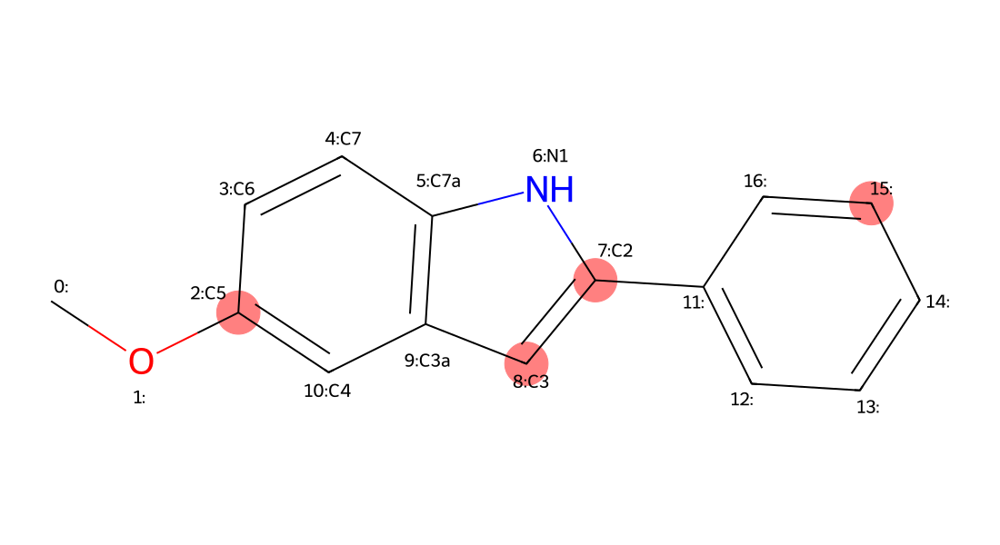
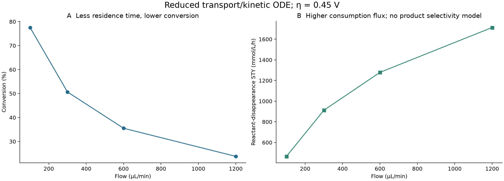
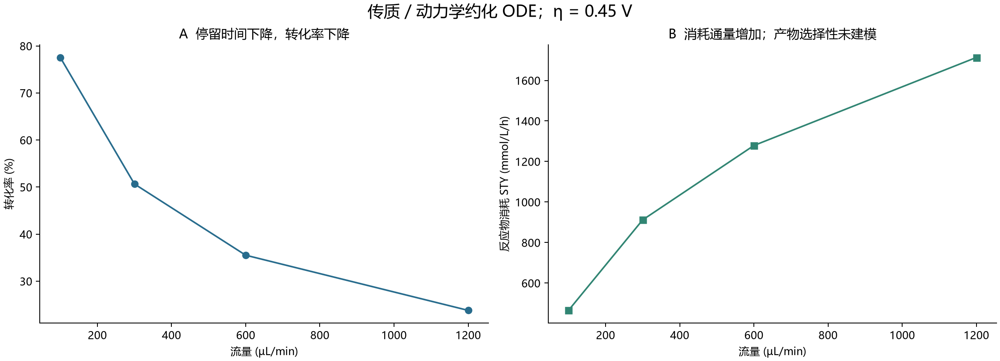
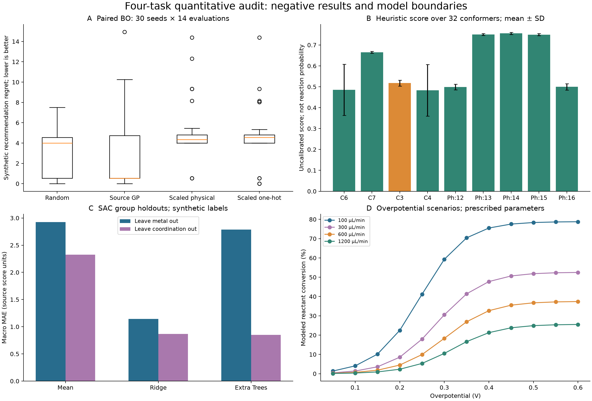
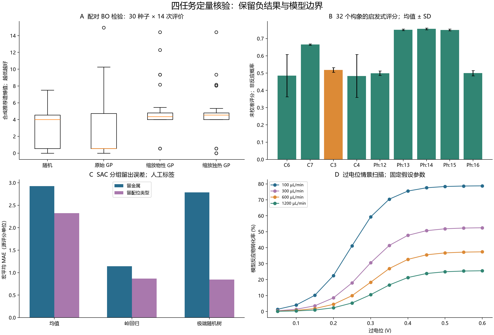
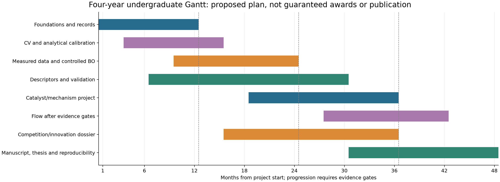
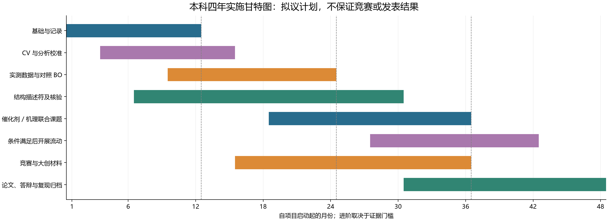

# Quantitative Organic Electrochemistry & Catalysis / 定量有机电合成与配位催化

Date / 日期：2026-09-27。Audited, section-aligned bilingual edition / 经核验、按章节对齐的双语合并版。

**Evidence statement.** The supplied script was attempted unchanged and failed in Task B before writing its final JSON. A separately archived repair completed all four tasks; exact reported source values refer to `results/repaired/production_benchmark_results.json`. A and C still use synthetic target equations. B computes actual molecular force-field geometry and geometric descriptors, but its site ranking is a heuristic. D is a reduced one-dimensional transport/kinetic ODE with assumed parameters. Additional studies comprise 30-seed BO comparisons, 32 conformers, grouped SAC holdouts, analytical/flux checks, and three actual GFN2-xTB jobs on the target molecule. No wet experiment, DFT transition state, calibrated oxidation potential, validated regioselectivity, or production readiness is established.

**Labels:** [L] literature; [S] executed synthetic calculation; [M] molecular mechanics/geometric calculation; [Q] executed semiempirical electronic structure; [A] code or independent numerical audit; [P] proposed experimental work; [U] unverified or missing evidence. A molecular input and physical units do not, by themselves, validate a predictive model.


**证据声明。** 原脚本已按原样尝试执行，在任务 B 失败，未写出最终 JSON。单独归档的修订版完成四项任务；本文的源流程确切数值来自 `results/repaired/production_benchmark_results.json`。A、C 的目标仍由人工公式生成；B 计算了真实分子的力场构象与几何描述符，但位点排序是启发式；D 是采用假设参数的一维传质／动力学约化 ODE。额外完成 30 种子 BO 对照、32 构象分析、SAC 分组留出、解析解／电流平衡核验，以及目标分子的 3 个实际 GFN2-xTB 作业。未开展湿实验、DFT 过渡态或实测氧化电位标定，未证实区域选择性或生产可用性。

**标记：** [L] 文献；[S] 已执行合成数据计算；[M] 分子力学／几何计算；[Q] 已执行半经验电子结构计算；[A] 代码或独立数值核验；[P] 拟议实验；[U] 未核实或缺失证据。使用真实分子和物理单位，本身不足以验证预测模型。


## 1. Executive Scientific Context / 1. 科学背景与技术路线


### 1.1 Scientific alignment and current maturity / 1.1 科研契合性与当前成熟度

**English**

The proposed research connects three complementary questions: how to use electrical input to control organic bond formation, how medicinal heterocycle structure governs accessible redox pathways, and how a porous coordination environment changes catalytic function. Published work on porous-ligand Pd sites and single-atom Fe redox mediation supports this scientific intersection. These precedents motivate a laboratory-aligned program; they do not demonstrate that the present substrate is a standard group substrate or that every named instrument is available locally. [Porous-ligand Pd study](https://doi.org/10.1016/j.chempr.2020.06.020); [Fe-mediated electrosynthesis](https://onlinelibrary.wiley.com/doi/abs/10.1002/anie.202404295).

The revised workflow is more chemically explicit than the preceding generic benchmark: it distinguishes solvent/electrolyte identities, builds a defined molecular structure, introduces a coordination-dependent proxy, and balances electrode flux against convection. Its present maturity is nevertheless **an auditable computational prototype**. “Production-grade,” “without mock primitives,” and “high-fidelity” are claims in the supplied document, not demonstrated conclusions of the run.

| Task | Exact main output from the repaired execution | Supported interpretation |
|---|---|---|
| A | 92.03%; MeCN/LiClO4; 16.0 mA/cm²; 25.0 °C | Largest observed synthetic response among 14 evaluations |
| B | 17 heavy atoms; 10 C-bearing-H candidates; atom 15 score 0.7483 | Neutral geometric/charge heuristic favors a pendant-phenyl atom |
| C | 16 configurations; Pd/N2O2_salen score 17.09 kcal/mol | Lowest assigned synthetic score, not a computed activation free energy |
| D | 77.55→23.80% conversion; 465.30→1713.41 mmol/L/h STY | Reduced-model reactant-consumption trade-off as flow increases |

Three findings change the research interpretation. Physical-feature GP variants did not outperform random search in the added finite-budget comparison. C2 and C5 of the specified indole are substituted and have no C–H bonds. The flow model's mass-transfer coefficient increases with flow, while residence time falls; lower high-flow conversion cannot be attributed simply to worse mass transfer.


**中文**

拟议方向连接三个相互补充的问题：如何利用电输入控制有机成键，药用杂环结构如何影响可及氧化还原路径，以及多孔配位环境如何改变催化功能。多孔配体 Pd 位点和单原子 Fe 氧化还原介导的已发表研究支持这一交叉方向。但这些先例不证明本次底物属于组内经典底物，也不证明全部所列仪器目前在本地可用。[多孔配体 Pd 研究](https://doi.org/10.1016/j.chempr.2020.06.020)；[Fe 介导电合成](https://onlinelibrary.wiley.com/doi/abs/10.1002/anie.202404295)。

与前一版通用基准相比，本流程更明确地描述化学对象：区分溶剂／电解质身份，建立确定分子结构，引入配位相关代理量，并将电极通量与对流相联系。但当前成熟度应表述为**可审计的计算原型**。附件中的“生产级”“无模拟原语”和“高保真”，属于输入文档的主张，不是本次运行已证明的结论。

| 任务 | 修订版主输出确切值 | 可以支持的解释 |
|---|---|---|
| A | 92.03%；MeCN/LiClO4；16.0 mA/cm²；25.0 °C | 14 次评价中最大的含噪合成响应 |
| B | 17 个重原子；10 个带 H 的碳候选；原子 15 评分 0.7483 | 中性几何／电荷启发式偏好侧链苯基原子 |
| C | 16 种构型；Pd/N2O2_salen 评分 17.09 kcal/mol | 给定合成评分最低，不是计算活化自由能 |
| D | 转化率 77.55→23.80%；STY 465.30→1713.41 mmol/L/h | 流量提高时约化模型的反应物消耗权衡 |

三项发现改变了科研解释：在新增有限预算对照中，物性特征 GP 没有优于随机搜索；该吲哚的 C2、C5 已被取代且没有 C–H；流动模型的传质系数随流量提高而增大，停留时间却缩短，因此不能简单把高流量下较低转化率归因于传质变差。


### 1.2 Execution, repairs, and provenance / 1.2 实际执行、修正与来源记录

**English**

[A] The existing environment was reused: Python 3.12.14, NumPy 2.4.6, SciPy 1.18.0, pandas 2.3.3, scikit-learn 1.9.0, RDKit 2026.03.5, Matplotlib 3.11.1 and xTB 6.7.1. Runs were CPU-only and limited to one thread. The untouched source exited with `AttributeError`: RDKit exposes `CalcSASA`, not `calcSASA`. The later `whichAtoms` keyword is also incompatible with the installed signature. Furthermore, `classifyAtoms` returned zero radii for all 30 atoms of this small molecule, so merely changing capitalization would not yield an appropriate van der Waals surface.

The repair uses `CalcSASA`, explicit RDKit periodic-table van der Waals radii, and atom-level `SASA` properties after the total calculation. It checks ETKDG/MMFF convergence, saves candidate/atom/configuration records, and replaces misleading terminal success text with an evidence-qualified message. A/C target equations, BO budget, source site-score coefficients, and D equations remain unchanged. The radius choice is a scientific convention change as well as a software repair; repaired B values must not be described as untouched-source results. The complete edit is recorded in `source/repair.patch`. [RDKit SASA API](https://www.rdkit.org/docs/source/rdkit.Chem.rdFreeSASA.html).

```text
Extracted original script SHA-256:
2b225a9ab8a66275ac276b11335b6d225660dfc8157d8f567f8ea7218a3349b6
```

The original failure, repaired logs, metadata, unrounded intermediate tables and additional audits are preserved separately. Source comments are retained as historical input and are explicitly evaluated here; they are not promoted into evidence. The original run produced no complete `production_benchmark_results.json`.


**中文**

[A] 复用了既有环境：Python 3.12.14、NumPy 2.4.6、SciPy 1.18.0、pandas 2.3.3、scikit-learn 1.9.0、RDKit 2026.03.5、Matplotlib 3.11.1、xTB 6.7.1。采用 CPU、单线程执行。原脚本因 `AttributeError` 退出：RDKit 提供 `CalcSASA`，而不是 `calcSASA`；后续的 `whichAtoms` 关键字也不匹配已安装接口。此外，`classifyAtoms` 对该小分子的 30 个原子均返回零半径，仅改大小写不能得到恰当的范德华表面。

修订版采用 `CalcSASA`、显式 RDKit 周期表范德华半径，并在总面积计算后读取逐原子的 `SASA` 属性；增加 ETKDG／MMFF 收敛检查，保存候选、原子与配位记录，且将误导性的终端成功文字改为注明证据类型的说明。A／C 目标公式、BO 预算、源位点评分系数和 D 方程保持不变。半径选择既是软件修复，也改变了几何模型约定，不能把修订后 B 的数值称作未经修改的原脚本结果。完整差异见 `source/repair.patch`。[RDKit SASA 接口](https://www.rdkit.org/docs/source/rdkit.Chem.rdFreeSASA.html)。

```text
提取后原脚本 SHA-256：
2b225a9ab8a66275ac276b11335b6d225660dfc8157d8f567f8ea7218a3349b6
```

原始失败、修订版日志、元数据、未舍入中间表及新增核验分别保存。原注释作为历史输入保留，并在本文中接受核验，不自动升级为事实。原始运行没有产出完整的 `production_benchmark_results.json`。


### 1.3 A falsifiable route to useful AI4S / 1.3 通向实用 AI4S 的可证伪路线

**English**

The immediate research question is whether a traceable model improves a predeclared laboratory decision over a simple baseline on a chemically identified system. BO must be compared under equal experimental budgets; an oxidation predictor requires measured, reference-consistent labels; catalyst selection requires defined structures and comparable activity data; flow optimization requires measured selectivity and charge balance. Published experimental BO provides a precedent for this evaluation approach, not a guarantee that a particular embedding or GP will win. [Experimental Bayesian reaction optimization](https://www.nature.com/articles/s41586-021-03213-y).

Use four gates: G0, valid identity and executable records; G1, calibrated measurement and reproducibility; G2, frozen prospective predictions compared with baselines; G3, reproducible mechanistic or process value. This delivery improves G0 and performs computational checks. It does not pass G1–G3 for a new chemical reaction.


**中文**

近期问题是：在化学身份明确的体系中，可追溯模型能否比简单基线更好地完成预先定义的实验决策？BO 需等实验预算比较；氧化电位模型需同一参照约定的实测标签；催化剂筛选需明确结构与可比较活性数据；流动优化需实测选择性和电荷平衡。已有实验 BO 文献提供评价思路先例，并不保证某种嵌入或 GP 获胜。[实验贝叶斯反应优化](https://www.nature.com/articles/s41586-021-03213-y)。

设置四个门槛：G0，身份与可执行记录正确；G1，测量已校准且可重复；G2，冻结前瞻预测并比较基线；G3，产生可重复的机理或过程价值。本次提升了 G0 并完成计算核验，尚未使任何新化学反应通过 G1–G3。


## 2. Rigorous Quantitative Breakdown / 2. 四大专业计算任务深度拆解


### 2.1 Task A — physical-property embeddings and mixed-variable BO / 2.1 任务 A——物性嵌入与混合变量 BO

**English**

[S] The input space consists of four solvents, four electrolyte labels, six current densities (4, 8, 12, 16, 20, 24 mA/cm²), and three temperatures (10, 25, 45 °C): **288 candidates**. Although current and temperature are physically continuous, this implementation searches a finite grid. There are **6 initial evaluations plus 8 acquisition steps**, not the ten steps stated in a comment. Seven descriptor columns enter a Matérn-plus-WhiteKernel GP without feature scaling or target normalization; three optimizer restarts and UCB coefficient 2.0 are used.

The following values are **source-assigned descriptors**, retained exactly for reproduction. Their temperature dependence, measurement method, concentration, solvent/reference-electrode conventions, and supporting citations were not supplied. In particular, the electrolyte radii and oxidation limits are not verified universal material constants.

| Solvent | Assigned ε | Viscosity (mPa·s) | Donor number |
| --- | --- | --- | --- |
| MeCN | 37.5 | 0.36 | 14.1 |
| DCM | 8.93 | 0.44 | 1.0 |
| DMF | 36.7 | 0.92 | 26.6 |
| HFIP | 16.7 | 1.65 | 0.0 |

| Electrolyte | Assigned radius (pm) | Assigned oxidation limit (V vs SCE) |
| --- | --- | --- |
| nBu4NPF6 | 254.0 | 3.2 |
| nBu4NBF4 | 218.0 | 2.9 |
| LiClO4 | 236.0 | 2.6 |
| nBu4NOAc | 230.0 | 1.45 |

The response generator is

$$
y=\mathrm{clip}\{88-0.15(j-14)^2-0.02(T-303.15)^2+0.15[0.8\epsilon-12\mu+0.3DN]-45\mathbf{1}(E_{lim}<1.8)+\xi,2,98\},\quad \xi\sim N(0,1.2^2).
$$

It is an assigned scoring surface. No measured yield, overpotential, solvent oxidation current, electrolyte concentration, or calibrated transport law enters this objective. Radius is included in the GP input but absent from the target formula. PF6, BF4 and ClO4 labels receive exactly the same zero parasitic penalty; the generator cannot physically distinguish their performance. Assigned properties are held fixed while temperature varies.

| BO step | Solvent | Electrolyte | j (mA/cm²) | T (°C) | Observed yield (%) | Best so far (%) |
| --- | --- | --- | --- | --- | --- | --- |
| 1 | MeCN | LiClO4 | 20.0 | 10.0 | 79.59 | 85.59 |
| 2 | MeCN | LiClO4 | 8.0 | 10.0 | 76.82 | 85.59 |
| 3 | MeCN | LiClO4 | 24.0 | 10.0 | 72.21 | 85.59 |
| 4 | MeCN | LiClO4 | 4.0 | 10.0 | 69.66 | 85.59 |
| 5 | MeCN | LiClO4 | 16.0 | 25.0 | 92.03 | 92.03 |
| 6 | MeCN | LiClO4 | 12.0 | 25.0 | 89.59 | 92.03 |
| 7 | MeCN | LiClO4 | 20.0 | 25.0 | 86.57 | 92.03 |
| 8 | MeCN | LiClO4 | 8.0 | 25.0 | 87.08 | 92.03 |

The reported optimum is **MeCN/LiClO4, 16.0 mA/cm², 25.0 °C, 92.03%**. The unrounded recorded observation is available in the CSV. Its latent value is **91.3865%**, with favorable sampled noise **0.6475310419 percentage points**. Six grid points tie at the latent maximum: MeCN, either 12 or 16 mA/cm², 25 °C, and any of the three non-acetate electrolyte labels. The continuous formula maximum, 92.4865%, occurs at 14 mA/cm² and 30 °C, neither included in the grid. Thus the selected label is not a unique chemical optimum. The model cannot substantiate the requested explanation that it “minimizes overpotential and competitive solvent oxidation.”

[A/S] An additional comparison uses 30 paired seeds, four methods and 14 evaluations per method: **120 campaigns, 1,680 observations**. Methods share six starting points and stepwise noise; sampling never repeats a complete candidate. The source GP is compared with random search and two normalized GP variants using either assigned physical descriptors or categorical one-hot features. The latter variants share an amplitude-scaled ARD Matérn kernel, one restart, target standardization from observations only, and noise variance 1.44 adjusted to that target scale. Because several changes accompany scaling, source-versus-normalized differences are not a single-factor ablation. The physical-versus-one-hot comparison also changes descriptor dimension and geometry.

Recommendation regret is the known grid maximum minus the latent response at the point selected by maximum noisy observation. Lower values are better; units are synthetic yield percentage points.

| Method | Mean regret | SD | Median |
| --- | --- | --- | --- |
| random | 2.6404 | 2.2697 | 4.0000 |
| scaled_onehot_gp | 4.8088 | 2.9055 | 4.5415 |
| scaled_physical_gp | 5.1545 | 2.8864 | 4.3517 |
| source_gp | 3.0202 | 3.5123 | 0.5415 |

| Paired contrast | Mean difference | 95% bootstrap interval |
| --- | --- | --- |
| scaled_onehot_gp_minus_random | 2.1684 | [0.9445, 3.5377] |
| scaled_physical_gp_minus_random | 2.5141 | [1.5242, 3.6860] |
| source_gp_minus_random | 0.3799 | [-0.9302, 1.8865] |
| physical_minus_onehot | 0.3457 | [-0.4807, 1.2498] |

Intervals are 10,000 paired-seed bootstrap intervals for the mean difference. The source-GP-minus-random interval crosses zero. Both normalized variants have greater mean regret than random search under this 14-evaluation protocol; physical versus one-hot is inconclusive. **The claimed advantage of physical embedding is not supported here.** There were 2,275 captured GP convergence warnings across the audit fits. The summary field named `kernel_warnings` counts all scikit-learn `ConvergenceWarning` instances; message-level categories were not retained. No broad hyperparameter search, new reaction distribution, experimentally informed property uncertainty, or GP calibration study was performed. Retaining these negative results is more informative than optimizing the analysis until one strategy appears favorable.


**中文**

[S] 搜索空间包含四种溶剂、四种电解质标签、六个电流密度（4、8、12、16、20、24 mA/cm²）及三个温度（10、25、45 °C），共 **288 个候选**。电流和温度虽然在物理上连续，本实现却只搜索有限网格。实际为 **6 个初始点加 8 步采集**，不是注释中的十步。七列描述符直接进入未缩放特征、未归一化目标的 Matérn＋WhiteKernel GP；超参数优化重启三次，UCB 系数为 2.0。

以下数值属于**源脚本给定描述符**，为复现而完整保留。输入没有提供温度依赖、测量方法、浓度、溶剂／参比电极约定或相应引文；电解质半径和氧化阈值尤其不能视为已核实的普适常数。

| 溶剂 | 给定 ε | 黏度 (mPa·s) | 给体数 |
| --- | --- | --- | --- |
| MeCN | 37.5 | 0.36 | 14.1 |
| DCM | 8.93 | 0.44 | 1.0 |
| DMF | 36.7 | 0.92 | 26.6 |
| HFIP | 16.7 | 1.65 | 0.0 |

| 电解质 | 给定半径 (pm) | 给定氧化阈值 (V vs SCE) |
| --- | --- | --- |
| nBu4NPF6 | 254.0 | 3.2 |
| nBu4NBF4 | 218.0 | 2.9 |
| LiClO4 | 236.0 | 2.6 |
| nBu4NOAc | 230.0 | 1.45 |

响应生成器为：

$$
y=\mathrm{clip}\{88-0.15(j-14)^2-0.02(T-303.15)^2+0.15[0.8\epsilon-12\mu+0.3DN]-45\mathbf{1}(E_{lim}<1.8)+\xi,2,98\},\quad \xi\sim N(0,1.2^2).
$$

这是人为指定的评分曲面，没有输入实测产率、过电位、溶剂氧化电流、电解质浓度或经校准的传质定律。半径进入 GP 特征，却不进入目标公式。PF6、BF4、ClO4 三类均获得完全相同的零副反应惩罚，生成器不能物理地区分它们的表现。温度变化时，所用物性仍保持不变。

| BO 步数 | 溶剂 | 电解质 | j (mA/cm²) | T (°C) | 含噪产率 (%) | 累计最好值 (%) |
| --- | --- | --- | --- | --- | --- | --- |
| 1 | MeCN | LiClO4 | 20.0 | 10.0 | 79.59 | 85.59 |
| 2 | MeCN | LiClO4 | 8.0 | 10.0 | 76.82 | 85.59 |
| 3 | MeCN | LiClO4 | 24.0 | 10.0 | 72.21 | 85.59 |
| 4 | MeCN | LiClO4 | 4.0 | 10.0 | 69.66 | 85.59 |
| 5 | MeCN | LiClO4 | 16.0 | 25.0 | 92.03 | 92.03 |
| 6 | MeCN | LiClO4 | 12.0 | 25.0 | 89.59 | 92.03 |
| 7 | MeCN | LiClO4 | 20.0 | 25.0 | 86.57 | 92.03 |
| 8 | MeCN | LiClO4 | 8.0 | 25.0 | 87.08 | 92.03 |

源输出的“最优”为 **MeCN/LiClO4、16.0 mA/cm²、25.0 °C、92.03%**；CSV 保存其未舍入观测。该点无噪声值为 **91.3865%**，有利噪声为 **0.6475310419 个百分点**。网格中有六个无噪声并列最优点：MeCN、12 或 16 mA/cm²、25 °C，配合三种非乙酸根电解质标签任意一种。连续公式最大值 92.4865% 位于 14 mA/cm²、30 °C，而二者均不在候选网格内。因此这不是唯一化学最优。模型无法支持附件要求的“最小化过电位和竞争性溶剂氧化”解释。

[A/S] 新增对照采用 30 个配对种子、四种策略、每策略 14 次评价，总计 **120 条轨迹、1,680 条观测**。同一种子共享六个初始点与逐步噪声，不重复评价完全相同的候选。对照包括源 GP、随机搜索、物性特征归一化 GP 和类别独热特征 GP。后两者采用带幅度的 ARD Matérn 核、一次重启、仅依据已观测值作目标标准化，并将噪声方差 1.44 换算到目标尺度。缩放同时伴随其他修改，因此不是单因素消融；物性与独热比较也改变了特征维数及几何结构。

推荐遗憾值定义为已知网格最大值减去最大含噪观测所选点的无噪声值。单位为合成产率百分点，越低越好。

| 方法 | 遗憾值均值 | SD | 中位数 |
| --- | --- | --- | --- |
| random | 2.6404 | 2.2697 | 4.0000 |
| scaled_onehot_gp | 4.8088 | 2.9055 | 4.5415 |
| scaled_physical_gp | 5.1545 | 2.8864 | 4.3517 |
| source_gp | 3.0202 | 3.5123 | 0.5415 |

| 配对差值 | 平均差 | 95% 自助区间 |
| --- | --- | --- |
| scaled_onehot_gp_minus_random | 2.1684 | [0.9445, 3.5377] |
| scaled_physical_gp_minus_random | 2.5141 | [1.5242, 3.6860] |
| source_gp_minus_random | 0.3799 | [-0.9302, 1.8865] |
| physical_minus_onehot | 0.3457 | [-0.4807, 1.2498] |

区间基于 10,000 次配对种子自助重采样，描述平均差。源 GP 减随机搜索的区间跨零；两种归一化版本在当前 14 次预算下的平均遗憾值均高于随机搜索；物性与独热之间尚无明确差异。**本例不支持物性嵌入的优势主张。** 核验拟合共捕获 2,275 条 GP 收敛警告。汇总字段虽名为 `kernel_warnings`，实际统计全部 scikit-learn `ConvergenceWarning`，未保留逐条消息分类。未进行大规模超参数搜索、跨反应分布检验、物性测量不确定性建模或 GP 校准研究。保留负结果比不断修改分析直到出现正面排序更有信息价值。


### 2.2 Task B — molecular identity, 3D geometry, SASA and site claims / 2.2 任务 B——分子身份、三维构象、SASA 与位点结论

**English**

[M/A] The SMILES `COc1ccc2[nH]c(cc2c1)c3ccccc3` defines **5-methoxy-2-phenyl-1H-indole, C15H13NO**, with 17 heavy atoms and 30 atoms after explicit hydrogens. ETKDGv3 seed 42 and MMFF94, maximum 500 iterations, both completed successfully. MMFF provides a force-field minimum, not an electronic-structure or vibrational certification of a chemical minimum.

The atom mapping is explicit: N1=6, C2=7, C3=8, C3a=9, C4=10, C5=2, C6=3, C7=4, C7a=5, using **zero-based RDKit indices**. C2 carries phenyl and C5 carries methoxy; both have zero attached hydrogens. The available indole-core C–H sites are C3, C4, C6 and C7. Five additional aromatic C–H sites belong to phenyl, and the methoxy methyl carbon adds a tenth C-bearing-H candidate. A C3-versus-C2/C5 C–H comparison is structurally inapplicable to this substrate.



Figure 1. Saved structure with atom-index/core-label annotations. Highlights include C5, C2, C3 and the source heuristic's top pendant-phenyl atom. Coordinates, connectivity and mapping are retained in `target_identity.json`; atom indices must not be mistaken for conventional ring locants.

The repaired SASA calculation uses explicit-H radii returned by this RDKit installation: C 1.70, O 1.55, N 1.60 and H 1.20 Å, Lee–Richards surface integration and probe radius 1.40 Å. Total SASA is **454.6229919137123 Ų**. This is a geometric convention, not a calibrated acetonitrile-solvation model. Atom areas sum to the molecular total. Gasteiger charges are computed from molecular connectivity and do not become radical-cation spin densities or frontier orbital populations merely because a conformer is present. [FreeSASA method](https://pmc.ncbi.nlm.nih.gov/articles/PMC4776673/); [RDKit charge implementation](https://github.com/rdkit/rdkit/blob/master/Code/GraphMol/PartialCharges/GasteigerCharges.cpp).

The retained source heuristic is $H_i=-0.6q_i+0.4A_{H_i}/15$. Its weighting and area scale are uncalibrated, and source code uses only the first attached H even for methyl. Exact repaired output is:

| Atom index (0-based) | Mapped label | Hybridization | Gasteiger q (e) | One H SASA (Ų) | Heuristic index |
| --- | --- | --- | --- | --- | --- |
| 15 | phenyl:15 | SP2 | -0.0616 | 26.676 | 0.7483 |
| 14 | phenyl:14 | SP2 | -0.0622 | 26.655 | 0.7481 |
| 13 | phenyl:13 | SP2 | -0.0616 | 26.647 | 0.7476 |
| 4 | C7 | SP2 | -0.0343 | 24.030 | 0.6614 |
| 10 | C4 | SP2 | -0.0106 | 21.407 | 0.5772 |
| 0 | methoxy-CH3 | SP3 | 0.0775 | 21.579 | 0.5289 |
| 8 | C3 | SP2 | -0.0285 | 18.755 | 0.5172 |
| 12 | phenyl:12 | SP2 | -0.0529 | 17.550 | 0.4997 |
| 16 | phenyl:16 | SP2 | -0.0529 | 17.406 | 0.4959 |
| 3 | C6 | SP2 | -0.0179 | 14.600 | 0.4001 |

The top atom, **15**, is on the pendant phenyl ring, not indole C3. The C3 score is **0.5172**, versus **0.7483** for atom 15. For the winner, approximately 95% of the score comes from the area term, illustrating how the assumed scale drives ranking. These outputs cannot explain a C3-selective SET/HAT pathway. SET is a molecular electron-transfer event, and later deprotonation, radical trapping, adsorption and competing barriers require separate mechanistic evidence.

[M] Additional ETKDG sampling (seed 20260927) generated 32 conformers; all converged within 1,000 MMFF94 iterations. MMFF energies span **32.214649–32.903951 kcal/mol** and total SASA **436.033643–457.348241 Ų**. These are force-field energies with their own reference, not reaction barriers. Repeated conformational wells are retained; the set is not an equilibrium ensemble. The audit averages over attached H atoms for methyl bookkeeping and restricts site ranking to the nine aromatic C–H carbons.

| Mapped label | Mean score ± SD | Mean H SASA ± SD (Ų) | Highest-score count / 32 |
| --- | --- | --- | --- |
| C6 | 0.4856 ± 0.1225 | 17.808 ± 4.593 | 0 |
| C7 | 0.6650 ± 0.0044 | 24.165 ± 0.164 | 0 |
| C3 | 0.5179 ± 0.0140 | 18.779 ± 0.524 | 0 |
| C4 | 0.4833 ± 0.1240 | 17.886 ± 4.649 | 0 |
| phenyl_atom_12 | 0.4990 ± 0.0133 | 17.521 ± 0.497 | 0 |
| phenyl_atom_13 | 0.7506 ± 0.0046 | 26.763 ± 0.173 | 2 |
| phenyl_atom_14 | 0.7558 ± 0.0051 | 26.944 ± 0.192 | 27 |
| phenyl_atom_15 | 0.7497 ± 0.0052 | 26.728 ± 0.196 | 3 |
| phenyl_atom_16 | 0.4996 ± 0.0155 | 17.544 ± 0.580 | 0 |

Pendant-phenyl atoms 14, 15 and 13 rank first in 27, 3 and 2 conformers respectively. C3 ranks first in none. These frequencies are sampling diagnostics, not regioisomer probabilities. Gasteiger charges remain invariant across conformers; SASA changes with geometry. On the lowest-MMFF conformer, altering probe radius and the SASA algorithm also changes the highest-scoring atom:

| Probe (Å) | Algorithm | Total SASA (Ų) | Top atom index | Top score |
| --- | --- | --- | --- | --- |
| 1.2 | LeeRichards | 421.495 | 14 | 0.6745 |
| 1.2 | ShrakeRupley | 416.629 | 15 | 0.6932 |
| 1.4 | LeeRichards | 454.086 | 14 | 0.7550 |
| 1.4 | ShrakeRupley | 449.548 | 15 | 0.7619 |
| 1.8 | LeeRichards | 521.291 | 13 | 0.9320 |
| 1.8 | ShrakeRupley | 515.741 | 15 | 0.9719 |

[Q] To add an actual electronic-structure calculation, the lowest-MMFF conformer underwent neutral **GFN2-xTB/ALPB(acetonitrile)** tight optimization, followed by +1 and −1 doublet single points at exactly the neutral nuclei. All three jobs terminated normally; neutral optimization converged. Input/output coordinates, partial charges, JSON and logs are retained.

| State | Charge / multiplicity | Energy (Eh) |
| --- | --- | --- |
| neutral | 0 / 1 | -45.759576727469 |
| cation | +1 / 2 | -45.373191206070 |
| anion | −1 / 2 | -45.980151497784 |

The fixed-nuclei model charge-removal difference is **10.5141 eV**, and the electron-addition difference is **6.0021 eV**, using 27.211386245988 eV/Eh. Total atomic charges match 0, +1 and −1 within 10⁻⁶ e. C3's Mulliken removal response $q_{+1}-q_0$ is **0.03769962 e**. This redistribution is not a site oxidation potential or a reaction barrier. Each charged state has its own equilibrium ALPB response; no nonequilibrium solvent, ionic relaxation, Hessian, thermal correction, reference electrode or measured Eox calibration is included. GFN2-xTB is semiempirical, not DFT. [GFN2-xTB primary method](https://pubs.acs.org/doi/10.1021/acs.jctc.8b01176).


**中文**

[M/A] SMILES `COc1ccc2[nH]c(cc2c1)c3ccccc3` 对应 **5-甲氧基-2-苯基-1H-吲哚，C15H13NO**，17 个重原子，显式补氢后共 30 个原子。ETKDGv3 种子 42 和最多 500 步的 MMFF94 均完成并收敛。MMFF 给出力场极小结构，不是经电子结构／振动频率确认的化学能量极小点。

明确映射为 N1=6、C2=7、C3=8、C3a=9、C4=10、C5=2、C6=3、C7=4、C7a=5，均采用**零基 RDKit 编号**。C2 连苯基、C5 连甲氧基，二者均没有相连 H。吲哚核心的 C–H 位点为 C3、C4、C6、C7；侧链苯基另有五个芳香 C–H，甲氧基甲基碳构成第十个带 H 的碳候选。因此本底物不适用 C3 对 C2／C5 的 C–H 活化比较。


图 1。结构标注原子编号与核心位号；高亮包含 C5、C2、C3 及源启发式评分最高的侧链苯基原子。坐标、连接关系与映射保存在 `target_identity.json`，不得混淆原子索引与常规环位号。

修订版 SASA 使用本机 RDKit 返回的显式氢范德华半径：C 1.70、O 1.55、N 1.60、H 1.20 Å；采用 Lee–Richards 算法及 1.40 Å 探针。总 SASA 为 **454.6229919137123 Ų**，属于几何约定，不是经乙腈标定的溶剂化模型；逐原子面积之和与总值一致。Gasteiger 电荷依赖分子连接关系，不会因为输入具有三维构象就成为自由基阳离子自旋密度或前线轨道布居。[FreeSASA 方法](https://pmc.ncbi.nlm.nih.gov/articles/PMC4776673/)；[RDKit 电荷实现](https://github.com/rdkit/rdkit/blob/master/Code/GraphMol/PartialCharges/GasteigerCharges.cpp)。

保留的源启发式为 $H_i=-0.6q_i+0.4A_{H_i}/15$。权重与面积尺度未经标定，源代码对甲基也只读取第一个相连 H。修订版确切输出如下：

| 零基原子编号 | 映射标签 | 杂化 | Gasteiger q (e) | 一个 H 的 SASA (Ų) | 启发式评分 |
| --- | --- | --- | --- | --- | --- |
| 15 | phenyl:15 | SP2 | -0.0616 | 26.676 | 0.7483 |
| 14 | phenyl:14 | SP2 | -0.0622 | 26.655 | 0.7481 |
| 13 | phenyl:13 | SP2 | -0.0616 | 26.647 | 0.7476 |
| 4 | C7 | SP2 | -0.0343 | 24.030 | 0.6614 |
| 10 | C4 | SP2 | -0.0106 | 21.407 | 0.5772 |
| 0 | methoxy-CH3 | SP3 | 0.0775 | 21.579 | 0.5289 |
| 8 | C3 | SP2 | -0.0285 | 18.755 | 0.5172 |
| 12 | phenyl:12 | SP2 | -0.0529 | 17.550 | 0.4997 |
| 16 | phenyl:16 | SP2 | -0.0529 | 17.406 | 0.4959 |
| 3 | C6 | SP2 | -0.0179 | 14.600 | 0.4001 |

最高分原子 **15** 位于侧链苯基，并非吲哚 C3。C3 得分 **0.5172**，而原子 15 为 **0.7483**；对胜者，约 95% 的分数来自面积项，说明给定尺度主导了排序。该输出不能解释 C3 选择性的 SET／HAT 路径。SET 是分子电子转移事件，后续去质子化、自由基捕获、吸附及竞争势垒均需独立机理证据。

[M] 新增 ETKDG 采样采用种子 20260927，生成 32 个构象，均在 1,000 步 MMFF94 上限内收敛。MMFF 能量范围为 **32.214649–32.903951 kcal/mol**，总 SASA 范围 **436.033643–457.348241 Ų**。这些力场能量具有自身零点，不是反应势垒；重复构象势阱被保留，不能称作平衡构象系综。核验对甲基相连 H 取均值以明确记账，并将位点排序限定为九个芳香 C–H 碳。

| 映射标签 | 评分均值 ± SD | H SASA 均值 ± SD (Ų) | 评分第一次数 / 32 |
| --- | --- | --- | --- |
| C6 | 0.4856 ± 0.1225 | 17.808 ± 4.593 | 0 |
| C7 | 0.6650 ± 0.0044 | 24.165 ± 0.164 | 0 |
| C3 | 0.5179 ± 0.0140 | 18.779 ± 0.524 | 0 |
| C4 | 0.4833 ± 0.1240 | 17.886 ± 4.649 | 0 |
| phenyl_atom_12 | 0.4990 ± 0.0133 | 17.521 ± 0.497 | 0 |
| phenyl_atom_13 | 0.7506 ± 0.0046 | 26.763 ± 0.173 | 2 |
| phenyl_atom_14 | 0.7558 ± 0.0051 | 26.944 ± 0.192 | 27 |
| phenyl_atom_15 | 0.7497 ± 0.0052 | 26.728 ± 0.196 | 3 |
| phenyl_atom_16 | 0.4996 ± 0.0155 | 17.544 ± 0.580 | 0 |

侧链苯基原子 14、15、13 分别在 27、3、2 个构象中第一，C3 没有一次第一。这是采样诊断次数，不是区域异构体概率。Gasteiger 电荷跨构象不变，而 SASA 随几何改变。在最低 MMFF 构象上，调整探针与算法同样会改变最高分原子：

| 探针 (Å) | 算法 | 总 SASA (Ų) | 最高分原子编号 | 最高分 |
| --- | --- | --- | --- | --- |
| 1.2 | LeeRichards | 421.495 | 14 | 0.6745 |
| 1.2 | ShrakeRupley | 416.629 | 15 | 0.6932 |
| 1.4 | LeeRichards | 454.086 | 14 | 0.7550 |
| 1.4 | ShrakeRupley | 449.548 | 15 | 0.7619 |
| 1.8 | LeeRichards | 521.291 | 13 | 0.9320 |
| 1.8 | ShrakeRupley | 515.741 | 15 | 0.9719 |

[Q] 为增加实际电子结构证据，对最低 MMFF 构象作中性 **GFN2-xTB／ALPB(乙腈)** 紧收敛优化，再在完全相同的中性核坐标上作 +1 和 −1 双重态单点。三个作业均正常终止，中性几何收敛；输入／输出坐标、电荷、JSON 和日志均保存。

| 状态 | 电荷／多重度 | 能量 (Eh) |
| --- | --- | --- |
| neutral | 0 / 1 | -45.759576727469 |
| cation | +1 / 2 | -45.373191206070 |
| anion | −1 / 2 | -45.980151497784 |

固定核坐标的模型电荷移除能量差为 **10.5141 eV**，电子添加能量差为 **6.0021 eV**，换算采用 27.211386245988 eV/Eh。原子电荷和在 10⁻⁶ e 内符合 0、+1、−1。C3 的 Mulliken 移除响应 $q_{+1}-q_0$ 为 **0.03769962 e**；该重分布不是位点氧化电位或反应势垒。各电荷态分别采用平衡 ALPB 响应；未计算非平衡溶剂、离子松弛、Hessian、热修正、参比电极或实测 Eox 标定。GFN2-xTB 属于半经验方法，不是 DFT。[GFN2-xTB 原始方法](https://pubs.acs.org/doi/10.1021/acs.jctc.8b01176)。


### 2.3 Task C — coordination proxies, synthetic barriers and group transfer / 2.3 任务 C——配位代理量、人工势垒与分组迁移

**English**

[S/A] Four metals and four coordination labels produce **16 rows**, not the 36 experimentally synthesized variations claimed in a comment. No experimental dataset or catalyst structure is loaded. Nominal d counts, electronegativity values, ligand-field strengths and metal-specific baseline scores are assigned. The coordination labels are not fully defined POP structures and do not specify oxidation state, axial ligation, spin, protonation, support geometry or electrochemical potential.

$$
\varepsilon_d^{proxy}=-1.2L_f-1.5(\chi_M-1.8),\qquad
G_{score}=B_M+4.5(\varepsilon_d^{proxy}+1.85)^2+\zeta,\quad\zeta\sim N(0,0.35^2).
$$

The quadratic has its minimum at the assigned −1.85 eV proxy; in a barrier plot this is U-shaped. Calling it a Sabatier volcano is an analogy to activity maxima, not an adsorption-energy or rate derivation. For isolated sites, a single scalar called a d-band center does not replace a calculated local electronic spectrum. The metal-specific bases (Cu 19.5, Co 23.0, Ni 21.0, Pd 17.0) already favor Pd before learning.

| Rank | Metal | Coordination label | d count | Assigned proxy (eV) | Synthetic score (kcal/mol) |
| --- | --- | --- | --- | --- | --- |
| 1 | Pd | N2O2_salen | 8 | -1.680 | 17.09 |
| 2 | Pd | N3C1_porphyrin | 8 | -1.920 | 17.20 |
| 3 | Pd | N2C2_network | 8 | -1.440 | 17.88 |
| 4 | Pd | N4_planar | 8 | -2.280 | 17.95 |
| 5 | Cu | N4_planar | 9 | -1.830 | 19.45 |
| 6 | Cu | N3C1_porphyrin | 9 | -1.470 | 20.46 |
| 7 | Ni | N4_planar | 8 | -1.845 | 21.52 |
| 8 | Cu | N2O2_salen | 9 | -1.230 | 21.68 |
| 9 | Ni | N3C1_porphyrin | 8 | -1.485 | 21.74 |
| 10 | Ni | N2O2_salen | 8 | -1.245 | 22.02 |
| 11 | Cu | N2C2_network | 9 | -0.990 | 22.36 |
| 12 | Co | N4_planar | 7 | -1.800 | 23.31 |
| 13 | Co | N3C1_porphyrin | 7 | -1.440 | 23.89 |
| 14 | Ni | N2C2_network | 8 | -1.005 | 24.13 |
| 15 | Co | N2O2_salen | 7 | -1.200 | 24.90 |
| 16 | Co | N2C2_network | 7 | -0.960 | 26.01 |

The lowest observed source score is **Pd/N2O2_salen, 17.09 kcal/mol**, with proxy **−1.680 eV**. It is not a calculated $\Delta G^\ddagger$, and no Eyring rate or catalyst recommendation is inferred. The Extra Trees model has 100 trees and seed 42. Its reported feature importances are:

| Descriptor | Extra Trees importance |
| --- | --- |
| d_electrons | 0.1179 |
| metal_EN | 0.7578 |
| coord_N | 0.0445 |
| coord_O | 0.0170 |
| d_band_center_proxy_eV | 0.0628 |

Metal electronegativity importance, **0.7578**, exceeds d-count importance **0.1179** and proxy importance **0.0628**. These values reflect the fabricated target, correlated encodings and chosen fitted model. They are not causal measures of ligand-field control. In-sample R² is **1.0**; this is insufficient evidence of predictive transfer.

[A/S] Leave-one-metal-out and leave-one-coordination-type-out evaluations use four folds per split, 12 training rows and four test rows per fold. Extra Trees, a training-mean predictor and a standardized ridge baseline are fitted using training folds only. Results are unweighted means of the four fold metrics, in the source's synthetic score units:

| Held-out group | Model | Macro MAE | Macro RMSE |
| --- | --- | --- | --- |
| coordination_type | extra_trees | 0.8480 | 0.9303 |
| coordination_type | mean | 2.3249 | 2.7633 |
| coordination_type | ridge | 0.8663 | 1.0043 |
| metal | extra_trees | 2.7869 | 2.8272 |
| metal | mean | 2.9250 | 3.0952 |
| metal | ridge | 1.1440 | 1.2637 |

Extra Trees transfer is much poorer across unseen metals (MAE **2.7869**) than across unseen coordination labels (**0.8480**); the ridge baseline achieves lower metal-held-out MAE (**1.1440**) on this dataset. Four groups and artificial labels do not establish generalization to real catalysts. Task C also lacks its own NumPy seed: the full run is repeatable because Task A sets and consumes the shared random stream, but standalone C results depend on external RNG state. A future dataset should remove this coupling and preserve structural/provenance groups.


**中文**

[S/A] 四种金属乘四种配位标签共 **16 行**，不是注释所称 36 种实验合成变体。代码没有读取实验数据或催化剂结构。名义 d 电子数、电负性、配体场强度和金属基准评分均由人为赋值。配位标签不是完整 POP 结构，也未定义氧化态、轴向配体、自旋、质子化、载体几何或工作电位。

$$
\varepsilon_d^{proxy}=-1.2L_f-1.5(\chi_M-1.8),\qquad
G_{score}=B_M+4.5(\varepsilon_d^{proxy}+1.85)^2+\zeta,\quad\zeta\sim N(0,0.35^2).
$$

该二次式在给定的 −1.85 eV 代理量处取最低值，若纵轴为势垒，形状为 U 形。将其称作 Sabatier 火山只是对活性最大值的类比，不是吸附能或速率推导。对孤立位点，名为 d 带中心的单一标量不能替代计算的局域电子谱。Cu 19.5、Co 23.0、Ni 21.0、Pd 17.0 的金属基准项在学习前就已偏好 Pd。

| 排名 | 金属 | 配位标签 | d 电子数 | 给定代理值 (eV) | 合成评分 (kcal/mol) |
| --- | --- | --- | --- | --- | --- |
| 1 | Pd | N2O2_salen | 8 | -1.680 | 17.09 |
| 2 | Pd | N3C1_porphyrin | 8 | -1.920 | 17.20 |
| 3 | Pd | N2C2_network | 8 | -1.440 | 17.88 |
| 4 | Pd | N4_planar | 8 | -2.280 | 17.95 |
| 5 | Cu | N4_planar | 9 | -1.830 | 19.45 |
| 6 | Cu | N3C1_porphyrin | 9 | -1.470 | 20.46 |
| 7 | Ni | N4_planar | 8 | -1.845 | 21.52 |
| 8 | Cu | N2O2_salen | 9 | -1.230 | 21.68 |
| 9 | Ni | N3C1_porphyrin | 8 | -1.485 | 21.74 |
| 10 | Ni | N2O2_salen | 8 | -1.245 | 22.02 |
| 11 | Cu | N2C2_network | 9 | -0.990 | 22.36 |
| 12 | Co | N4_planar | 7 | -1.800 | 23.31 |
| 13 | Co | N3C1_porphyrin | 7 | -1.440 | 23.89 |
| 14 | Ni | N2C2_network | 8 | -1.005 | 24.13 |
| 15 | Co | N2O2_salen | 7 | -1.200 | 24.90 |
| 16 | Co | N2C2_network | 7 | -0.960 | 26.01 |

源结果最低为 **Pd/N2O2_salen，17.09 kcal/mol**，代理量 **−1.680 eV**。这不是已计算的 $\Delta G^\ddagger$，本文不据此推导 Eyring 速率或推荐催化剂。极端随机树包含 100 棵树、种子 42，其重要性为：

| 描述符 | 极端随机树重要性 |
| --- | --- |
| d_electrons | 0.1179 |
| metal_EN | 0.7578 |
| coord_N | 0.0445 |
| coord_O | 0.0170 |
| d_band_center_proxy_eV | 0.0628 |

金属电负性重要性 **0.7578**，高于 d 电子数 **0.1179** 与代理量 **0.0628**。这些值反映人工目标、相关编码和所选模型，不能因果性地衡量配位场作用。训练集 R² 为 **1.0**，不足以证明预测迁移。

[A/S] 新增按金属与配位类型分别留一组的评价，每类四折，每折训练 12 行、测试四行。极端随机树、训练均值和标准化岭回归均仅使用训练折拟合。下表是四折指标的等权平均，单位为源脚本的合成评分单位：

| 留出分组 | 模型 | 宏平均 MAE | 宏平均 RMSE |
| --- | --- | --- | --- |
| coordination_type | extra_trees | 0.8480 | 0.9303 |
| coordination_type | mean | 2.3249 | 2.7633 |
| coordination_type | ridge | 0.8663 | 1.0043 |
| metal | extra_trees | 2.7869 | 2.8272 |
| metal | mean | 2.9250 | 3.0952 |
| metal | ridge | 1.1440 | 1.2637 |

极端随机树对未见金属的 MAE **2.7869**，明显高于对未见配位标签的 **0.8480**；本数据上岭回归的金属留出 MAE 更低，为 **1.1440**。只有四个分组且目标人工生成，不能验证真实催化剂泛化。任务 C 也没有自己的 NumPy 种子：整体运行可重复，是因为任务 A 设置并消耗了共享随机流；单独调用 C 会依赖外部 RNG 状态。未来数据管道应去除该耦合，并保留结构／来源分组。


### 2.4 Task D — coupled boundary flux and a reduced channel ODE / 2.4 任务 D——边界通量耦合与通道约化 ODE

**English**

[S/A] The numerical model assumes width 10 mm, height 0.5 mm and length 100 mm, giving **0.5 mL** volume and **10 cm²** of one active electrode. Inputs are $C_{in}=50$ mol/m³ (0.05 M), $D=1.2\times10^{-9}$ m²/s, $j_0=0.05$ A/m², $T=298.15$ K, $\alpha_a=\alpha_c=0.5$ and $\eta=0.45$ V. None is measured here. The code assumes a one-electron flux relation and treats the full reactant loss as useful output.

The executed transport correlation is $k_m=0.67D[\gamma/(DL)]^{1/3}$ with $\gamma=6u/h$. It differs from the header's 1.85 Sherwood expression. The implemented BV normalization uses inlet concentration, although the introductory equation names bulk concentration. Writing $a=Fk_m$, $b=(j_0/C_{in})e^{\alpha_aF\eta/RT}$ and $r=j_0e^{-\alpha_cF\eta/RT}$ gives

$$
C_s=\frac{aC_b+r}{a+b},\quad
\frac{dC_b}{dz}=-\frac{k_ma_s}{u}(C_b-C_s),\quad a_s=1/h.
$$

At fixed overpotential all coefficients are constant, so elimination of $C_s$ yields a linear ODE with analytical solution

$$
C_b(z)=C_{eq}+(C_{in}-C_{eq})e^{-k_{eff}a_sz/u},\quad
C_{eq}=r/b,\quad k_{eff}=\frac{k_mk_s}{k_m+k_s},\quad k_s=b/F.
$$

This is a reduced boundary-flux/axial-ODE coupling, not a solved velocity/concentration/potential-field PDE. BV is exponential in the prescribed overpotential; that fact does not make the fixed-parameter concentration equation nonlinear. The constant reverse term assumes fixed product activity, without product or counterelectrode transport.

| Flow (µL/min) | Velocity (mm/s) | Residence (s) | k_m (m/s) | Conversion (%) | STY (mmol/L/h) |
| --- | --- | --- | --- | --- | --- |
| 100 | 0.33 | 300.0 | 2.588e-06 | 77.55 | 465.3 |
| 300 | 1.0 | 100.0 | 3.732e-06 | 50.66 | 911.83 |
| 600 | 2.0 | 50.0 | 4.702e-06 | 35.52 | 1278.87 |
| 1200 | 4.0 | 25.0 | 5.924e-06 | 23.8 | 1713.41 |

The source STY calculation is dimensionally consistent as **reactant disappearance** per reactor volume and time. It becomes product STY only if unit selectivity and the stated electron/product stoichiometry are established. At increasing flow, $k_m$ rises by a factor of about 2.29 while residence time falls twelvefold. Conversion therefore decreases while disappearance throughput increases. This does not identify an industrial optimum or confirm useful product production.

| Flow (µL/min) | Damköhler number | Mass-transfer resistance fraction | Implied current (mA) | (D/k_m)/h |
| --- | --- | --- | --- | --- |
| 100 | 1.4939 | 0.9622 | 6.2354 | 0.9275 |
| 300 | 0.7064 | 0.9464 | 12.2192 | 0.6431 |
| 600 | 0.4389 | 0.9334 | 17.1378 | 0.5104 |
| 1200 | 0.2718 | 0.9175 | 22.9610 | 0.4051 |

The mass-transfer resistance fraction is $(1/k_m)/(1/k_m+1/k_s)=k_s/(k_m+k_s)$. It falls from **0.9622 to 0.9175** with increasing flow. All four conditions are predominantly mass-transfer-controlled under the assumptions, but high flow modestly reduces the relative transport resistance. The declining Damköhler number explains the conversion trend more accurately than claiming that high flow worsens mass transfer.

Independent DOP853 integration and the analytical outlet agree to **8.38×10⁻¹² mol/m³**. Integrating $j(z)$ over the electrode with a 201-point trapezoidal grid agrees with $Fq(C_{in}-C_{out})$ within relative error **4.65×10⁻⁶**; adaptive quadrature independently closes this current balance. Implied current rises from **6.2354 to 22.9610 mA**. This is internal consistency under a one-electron model, not measured Faradaic efficiency. Overpotential is not the total cell voltage, so the script cannot supply full electrical energy per product mass.

The effective thickness $D/k_m$ is 0.405–0.928 times channel height, which raises an applicability question for a thin developing boundary-layer approximation. The prefactor and geometry need experimental or higher-fidelity transport validation. Additional saved scenarios comprise 48 flow/overpotential combinations (four flows and 0.05–0.60 V in 0.05 V steps) and 20 cases varying $j_0$ or D by factors of one-half or two. These are parameter sensitivity calculations, not uncertainty intervals estimated from measurements.



Figure 2. The same assumed flow model on separate axes: conversion decreases as reactant-disappearance STY rises. No product selectivity or process cost is included.


**中文**

[S/A] 模型假设通道宽 10 mm、高 0.5 mm、长 100 mm，对应 **0.5 mL** 体积和一个活性面的 **10 cm²** 电极面积。采用 $C_{in}=50$ mol/m³（0.05 M）、$D=1.2\times10^{-9}$ m²/s、$j_0=0.05$ A/m²、$T=298.15$ K、$\alpha_a=\alpha_c=0.5$、$\eta=0.45$ V；这些均未在本次实测。代码使用单电子通量关系，并把全部反应物消耗计作有效输出。

实际执行的传质式为 $k_m=0.67D[\gamma/(DL)]^{1/3}$，$\gamma=6u/h$，不同于注释中的 1.85 Sherwood 公式。BV 归一化实际使用入口浓度，尽管导言方程写的是体相浓度。令 $a=Fk_m$、$b=(j_0/C_{in})e^{\alpha_aF\eta/RT}$、$r=j_0e^{-\alpha_cF\eta/RT}$，则：

$$
C_s=\frac{aC_b+r}{a+b},\quad
\frac{dC_b}{dz}=-\frac{k_ma_s}{u}(C_b-C_s),\quad a_s=1/h.
$$

过电位固定时各系数为常数，消去 $C_s$ 后得到线性 ODE，解析解为：

$$
C_b(z)=C_{eq}+(C_{in}-C_{eq})e^{-k_{eff}a_sz/u},\quad
C_{eq}=r/b,\quad k_{eff}=\frac{k_mk_s}{k_m+k_s},\quad k_s=b/F.
$$

这是边界通量／轴向 ODE 的约化耦合，不是已求解速度场、浓度场和电势场的 PDE。BV 对给定过电位呈指数关系，不意味着固定参数下的浓度方程非线性。常数反向项假定固定产物活度，未求解产物或对电极传输。

| 流量 (µL/min) | 速度 (mm/s) | 停留时间 (s) | k_m (m/s) | 转化率 (%) | STY (mmol/L/h) |
| --- | --- | --- | --- | --- | --- |
| 100 | 0.33 | 300.0 | 2.588e-06 | 77.55 | 465.3 |
| 300 | 1.0 | 100.0 | 3.732e-06 | 50.66 | 911.83 |
| 600 | 2.0 | 50.0 | 4.702e-06 | 35.52 | 1278.87 |
| 1200 | 4.0 | 25.0 | 5.924e-06 | 23.8 | 1713.41 |

源 STY 的量纲作为单位反应器体积、单位时间的**反应物消耗量**是成立的；只有验证单位选择性及相应电子／产物计量后，才能称作产物 STY。流量提高时，$k_m$ 约增大 2.29 倍，停留时间却缩短十二倍，因而转化率下降而消耗通量增加。这既没有确定工业最优，也没有证实目标产物的生产量。

| 流量 (µL/min) | Damköhler 数 | 传质阻力占比 | 隐含电流 (mA) | (D/k_m)/h |
| --- | --- | --- | --- | --- |
| 100 | 1.4939 | 0.9622 | 6.2354 | 0.9275 |
| 300 | 0.7064 | 0.9464 | 12.2192 | 0.6431 |
| 600 | 0.4389 | 0.9334 | 17.1378 | 0.5104 |
| 1200 | 0.2718 | 0.9175 | 22.9610 | 0.4051 |

传质阻力占比为 $(1/k_m)/(1/k_m+1/k_s)=k_s/(k_m+k_s)$，随流量增加从 **0.9622 降至 0.9175**。在这些假设下四种条件都以传质阻力为主，但较高流量略微降低其相对占比。下降的 Damköhler 数比“高流量传质更差”更准确地解释转化率趋势。

独立 DOP853 积分与解析出口值最大差为 **8.38×10⁻¹² mol/m³**。沿电极用 201 点梯形网格积分 $j(z)$，与 $Fq(C_{in}-C_{out})$ 的相对误差小于 **4.65×10⁻⁶**；自适应求积也独立闭合该电流平衡。隐含电流由 **6.2354 增至 22.9610 mA**。这是单电子假设内的数值一致性，不是实测法拉第效率。过电位不等于总槽电压，因此脚本不能给出完整单位产品电耗。

有效厚度 $D/k_m$ 为通道高度的 0.405–0.928 倍，对薄发展边界层近似的适用性构成疑问；系数和几何需实验或更高保真传输计算验证。额外保存了 48 个流量／过电位组合（四个流量，0.05–0.60 V、间隔 0.05 V），以及 20 个将 $j_0$ 或 D 减半／加倍的场景。这些是参数敏感性计算，不是由实测数据估计的置信区间。



图 2。同一假设流动模型分别展示转化率与消耗 STY：前者下降，后者提高；未计入产物选择性或过程成本。


### 2.5 Cross-task interpretation and validation limits / 2.5 四任务综合解读与验证边界

**English**



Figure 3. A: 30-seed regret distributions; boxes span quartiles, center lines are medians, whiskers extend to 1.5 IQR and outliers are shown. B: aromatic-site heuristic means with ±1 conformer SD; orange denotes C3 and Ph labels retain saved atom indices. C: macro mean errors on held-out synthetic groups. D: uncalibrated overpotential scenarios. These panels distinguish statistical, geometric and equation-solving evidence; none is an experimental validation.

The calculations support useful negative conclusions: the physical embedding is not yet an effective acquisition policy in this benchmark; the geometry/charge heuristic cannot justify the requested site assignment; the SAC regressor mostly learns assigned metal trends; and a dimensional transport model still requires calibration and product-specific balances. These are actionable design findings rather than evidence of a failed chemical reaction, since no reaction was conducted.


**中文**



图 3。A：30 种子的遗憾值分布，箱为四分位区间，中线为中位数，须为 1.5 IQR，离群值单列；B：芳香位点启发式均值及 ±1 构象 SD，橙色为 C3，Ph 标签保留原子索引；C：合成标签分组留出的宏平均误差；D：未校准过电位场景。各图分别属于统计、几何或方程求解证据，均不构成实验验证。

计算支持几项有用的负结论：当前物性嵌入尚未构成有效的优于基线的采集策略；几何／电荷启发式不能支持附件指定的位点结论；SAC 回归主要学习了人为给定的金属趋势；即使传输模型具有正确量纲，也仍需参数校准和产物特异性平衡。这些是可用于修改研究设计的发现，不是某个化学反应失败的实验证据，因为尚未进行反应。


## 3. Wet-Lab Implementation & Instrumentation Protocol / 3. 湿端实验转化与仪器规程


### 3.1 Instrument roles and pre-experimental records / 3.1 仪器角色与实验前记录

**English**

[P/U] The following is a proposed measurement program, not an inventory or a recovered group SOP. Confirm access, training and calibration with the laboratory before execution. Keep a single run registry linking canonical structures, atom maps, batch identities, reagent/solvent provenance, cell dimensions, electrode surface treatment, time/current/potential traces and raw analytical files. Actual preparative partner identity, reaction stoichiometry, catalyst preparation and verified baseline yield were not supplied; they remain prerequisites rather than invented recipes.

| Instrument or configuration | Specific role | Required evidence before interpretation |
|---|---|---|
| Potentiostat with three-electrode cell | CV and potential referencing | Blank stability, reference protocol, resistance measurement |
| Undivided preparative cell; glassy-carbon anode, Pt-plate cathode | Initial validation configuration | Measured immersed area/gap, current density, charge integral, temperature |
| Ag/Ag+ reference in MeCN; ferrocene internal reference check | Non-aqueous potential scale | Reference filling solution, junction, calibration before/after measurements |
| n-Bu4NPF6 electrolyte | Proposed baseline electrolyte for measurement | Solubility, conductivity and blank oxidation window in the actual medium |
| HPLC-MS | Time-resolved composition after calibrated sampling | Separation, response factors, internal standard and sampling/quench validation |
| 1H/13C NMR, HSQC/HMBC and selective NOESY | Product and regioisomer identity | Complete assignments and consistent connectivity constraints |
| N2 sorption at 77 K; ICP-MS; HAADF-STEM; complementary XAS/XPS | Surface area, loading, dispersion and coordination | Independent batches, representative fields and measurement uncertainty |

The proposed n-Bu4NPF6 baseline is a measurement choice, not a result that reverses or endorses the synthetic LiClO4 optimum. All electrolyte choices require measured compatibility with the defined reaction. Literature establishes that CV and cell configuration are central to electrosynthesis; exact implementation still depends on the chosen chemistry. [Electrosynthesis methodology](https://www.nature.com/articles/s41570-022-00372-y).


**中文**

[P/U] 下述是拟议测量计划，不是已核实设备清单或恢复的组内 SOP；实施前应由实验室确认使用权限、培训与校准。建立统一记录，将规范结构、原子映射、批次、试剂／溶剂来源、反应池尺寸、电极表面处理、电流／电位／时间轨迹和原始分析文件关联。真实制备反应的共反应物、计量比、催化剂制备路线与可靠基线产率尚未提供，这些应作为前置条件保留，而不能编造配方。

| 仪器或配置 | 具体用途 | 解释前所需证据 |
|---|---|---|
| 恒电位仪及三电极池 | CV 与电位参照 | 空白稳定性、参比规程、电阻测量 |
| 无隔膜制备池；玻碳阳极、铂片阴极 | 初始验证配置 | 实测浸没面积／间距、电流密度、电量积分、温度 |
| MeCN 中 Ag/Ag+ 参比及二茂铁参照检查 | 非水电位尺度 | 参比填充液、液接界面、前后校准 |
| n-Bu4NPF6 电解质 | 拟议测量基线 | 实际介质的溶解性、电导率及空白氧化窗口 |
| HPLC-MS | 经校准采样后的时间分辨组成 | 分离、响应因子、内标与采样／淬灭验证 |
| 1H/13C NMR、HSQC/HMBC、选择性 NOESY | 产物及区域异构体身份 | 完整归属与一致的连接关系证据 |
| 77 K N2 吸附、ICP-MS、HAADF-STEM、补充 XAS/XPS | 比表面积、负载、分散及配位 | 独立批次、代表性视野、测量不确定性 |

拟议 n-Bu4NPF6 基线属于测量选择，不是推翻或认可人工 LiClO4 最优的实验结论；电解质均需在明确反应中测定相容性。文献支持 CV 与反应池配置在电合成中的基础作用，但具体实现仍依赖化学体系。[电合成方法学](https://www.nature.com/articles/s41570-022-00372-y)。


### 3.2 CV, prospective BO and product assignment / 3.2 CV、前瞻 BO 与产物归属

**English**

Begin with **1 mM target substrate and 0.10 M n-Bu4NPF6 in MeCN** as proposed analytical starting concentrations. Use a polished glassy-carbon disk, Pt counter electrode and a nonaqueous-compatible Ag/Ag+ reference. Record electrolyte-only, substrate-only where interpretable, each intended reaction partner, and reaction-mixture traces. Determine the usable potential window from blanks before scanning the analyte; no absolute preparative potential is inferred from the synthetic descriptor table. Acquire 50, 100 and 200 mV/s scans and independent solution preparations, retain repeated scans that reveal fouling, and measure reference behavior before and after the series. Report solvent, temperature, reference composition, uncompensated resistance and any correction method. Distinguish reversible midpoint, anodic peak and onset potentials.

For preparative work, first select a reaction with identified partners and a verified SOP. Reproduce its baseline in three independent preparations. Use an undivided glassy-carbon/Pt cell only while testing for crossover or cathodic product loss; introduce a divided control if those processes are plausible in the defined system. Record area, gap, stirring, concentration, temperature, atmosphere and $Q=\int I\,dt$. A constant-current density and a controlled anode potential are distinct operating modes; do not claim both are independently fixed with one controller. The source's 16 mA/cm² is a candidate to evaluate only after the measurement window and baseline are known, not a validated starting recipe.

Freeze a matched BO/random/space-filling comparison before outcome collection. Randomize feasible run order, use the same valid-evaluation budget and repeat reference conditions across days. Permit only actual solvent/electrolyte combinations that remain soluble and stable under the chosen operating conditions. Retain failed reactions and distinguish them from instrument failures. Report assay yield, isolated yield, conversion and selectivity separately; calculate FE only after electron stoichiometry and product amount are established. A claimed optimizer benefit must survive independent repeats and exceed analytical and between-run variability.

For kinetics, collect samples at specified fractions of the baseline charge endpoint, for example 0, 0.25, 0.5, 0.75 and 1.0 times the registered charge. Validate quenching and internal-standard recovery. HPLC-MS is time-resolved offline analysis unless an online sampling interface and latency are actually implemented. MS supports composition, while calibrated chromatography quantifies species. Confirm regioisomers with 1H/13C assignments and HSQC/HMBC connectivity; use NOESY as complementary spatial evidence rather than the sole site assignment. Evaluate C3, C4, C6, C7 and pendant-phenyl substitution as applicable to the defined reaction. C2 and C5 have no C–H in this substrate.


**中文**

以 **1 mM 目标底物、MeCN 中 0.10 M n-Bu4NPF6** 作为拟议分析起始浓度。使用抛光玻碳圆盘、铂对电极及适合非水体系的 Ag/Ag+ 参比。记录电解质空白、可解释时的单底物、各拟用共反应物及混合物曲线。先由空白确定可用电位窗口，不从人工描述符表推断绝对制备电位。以 50、100、200 mV/s 扫描并独立配液，保留揭示钝化的连续扫描；测量前后检查参比。报告溶剂、温度、参比组成、未补偿电阻及修正方法，区分可逆中点、阳极峰与起始电位。

制备实验首先选择共反应物明确且有可靠 SOP 的反应，在三次独立配液中复现基线。使用无隔膜玻碳／铂池时检查穿梭与阴极产物损失；若明确体系中存在相关过程，再加入隔膜对照。记录面积、间距、搅拌、浓度、温度、气氛和 $Q=\int I\,dt$。恒电流密度与阳极电位控制属于不同运行模式，不宣称一个控制器独立固定二者。源脚本的 16 mA/cm² 仅是在测量窗口与基线明确后可评价的候选，不是经验证的起始配方。

收集结果前冻结 BO／随机／空间填充对照，使用相同有效评价预算，尽可能随机化可行运行顺序，并跨天重复参照条件。仅允许采用在实际运行条件下可溶且稳定的溶剂／电解质组合。保留反应失败，并与仪器故障区分。分别报告分析产率、分离产率、转化率、选择性；只有确定电子计量与产物量后计算 FE。优化器优势必须在独立重复中保持，并超过分析及批间波动。

动力学采样可按预登记基线电量的比例，例如 0、0.25、0.5、0.75、1.0 倍终点电量采集，验证淬灭及内标回收。未实际搭建在线采样接口并测定延迟时，HPLC-MS 属于时间分辨离线分析，不能称作实时闭环。MS 支持组成判断，经校准色谱负责定量。区域异构体需用 1H/13C 归属与 HSQC/HMBC 连接关系确认，NOESY 作为空间补充，不能单独确证位点。依据明确反应考察 C3、C4、C6、C7 及苯基取代；该底物 C2、C5 没有 C–H。


### 3.3 POP-SAC characterization and mechanism controls / 3.3 POP-SAC 表征与机理对照

**English**

Start from one verified support/metalation route rather than synthesizing every abstract label. Prepare independently replicated batches, report metal-loading basis by ICP-MS after validated digestion, and characterize pore structure by N2 sorption at 77 K with a material-compatible degassing SOP and documented BET fitting interval. Use sufficiently representative aberration-corrected HAADF-STEM fields to assess dispersion. Isolated bright features support spatial dispersion; they do not alone prove that all metal is atomically dispersed or determine the working coordination environment.

Add XANES/EXAFS where accessible for coordination hypotheses and XPS for surface-state trends. Do not infer a working M–N_x–C_y–O_z geometry solely from a precursor name, BET area, ICP loading or the absence of diffraction peaks. Compare the support, metal-free modified support, relevant soluble metal and a comparable nanoparticle control. Record leaching and post-reaction structure; filtration/poisoning can support but not independently settle active-species identity. Normalize performance by geometric area and catalyst mass; site-normalized rates require defensible active-site counts.

Mechanistic work should discriminate hypotheses with concentration/time profiles, competitive or isotopic measurements where interpretable, and product/intermediate identification. Targeted electronic-structure calculations require actual catalyst/substrate geometries, charge/spin choices and competing pathways. A trained model on the 16 synthetic labels is not a substitute for those structures or for measured catalytic rates.


**中文**

从一种经核实的载体／金属化路线起步，而不是按抽象标签合成全部候选。制备独立批次，经验证消解后用 ICP-MS 测定并报告金属负载依据；采用与材料相容的脱气 SOP 做 77 K N2 吸附，记录 BET 拟合区间。以足够代表性的像差校正 HAADF-STEM 视野评价分散。孤立亮点支持空间分散，但不能单独证明全部金属均为单原子或确定运行时配位环境。

条件允许时加入 XANES／EXAFS 检验配位假设，XPS 描述表面状态趋势。不能只凭前体名称、BET、ICP 负载或缺失衍射峰推断工作态 M–N_x–C_y–O_z 几何。比较裸载体、无金属改性载体、相关可溶金属及可比纳米颗粒对照，记录浸出与反应后结构。过滤／毒化只能提供支持，不能单独确定活性物种。按几何面积和催化剂质量归一化；按位点归一化速率需要可信的活性位点计数。

机理研究应结合浓度／时间曲线、可解释的竞争或同位素实验，以及产物／中间体身份，区分候选假说。针对性电子结构计算需明确催化剂与底物几何、电荷、自旋和竞争路径。16 个合成标签上训练的模型不能替代这些结构或实测催化速率。


### 3.4 Flow validation, acceptance gates and stopping conditions / 3.4 流动验证、验收门槛与停止条件

**English**

Measure wetted volume and residence-time distribution before reaction fitting. If the proposed 10 mm × 0.5 mm × 100 mm one-face geometry is adopted, verify its actual 0.5 mL volume and electrode exposure rather than treating nominal dimensions as measured facts. Test the four source flows, 100, 300, 600 and 1200 µL/min, with the same defined inlet composition. Record pressure, temperature, current, electrode potential and cell voltage, then collect time-binned outlet samples until a prespecified stability criterion is met. Steady-state collection must be demonstrated; an arbitrary elapsed number of nominal residence times is not sufficient by itself.

Fit transport/kinetic parameters only after calibrating composition and obtaining product-specific mass and charge balances. Reserve at least one flow/overpotential condition for prediction, compare the reduced model against a residence-time baseline, and estimate parameter identifiability rather than reporting only a best fit. Determine whether a developing-layer correlation applies in the measured geometry and whether the reverse reaction/product activity assumption matters. Track fouling, current drift, pressure rise and product recovery during sustained operation.

Advance only when a defined product, repeatable quantification, defensible selectivity, and predictive validation are available. Stop or redesign when structure assignments are unresolved, apparent optimizer gains vanish on replication, current cannot account for product formation, or separation/electrode degradation eliminates a throughput benefit. Competition submission and journal ambition do not replace these gates.


**中文**

在拟合反应参数前测量实际润湿体积及停留时间分布。若采用 10 mm × 0.5 mm × 100 mm 单活性面结构，应验证其实际 0.5 mL 体积和电极暴露面积，不将标称尺寸当作测量。以同一明确进料测试 100、300、600、1200 µL/min 四个源流量，记录压力、温度、电流、电极电位与槽电压，并分时段收集出口样品直至满足预定稳定性判据。稳态必须有数据支持，仅等待若干名义停留时间本身不足以证明稳态。

在组成已校准、产物特异性物料与电荷平衡成立后才拟合动力学／传质参数。至少保留一个流量／过电位条件作为预测检验，与简单停留时间模型比较，评价参数可辨识性，而不只报告最佳拟合。检查发展边界层相关式是否适合实际几何，以及反向反应／产物活度假设是否重要；持续记录钝化、电流漂移、压升和产物回收。

只有得到明确产物、可重复定量、可信选择性与预测验证后才推进。若结构归属不清、优化优势在重复后消失、电流不能解释产物形成，或分离／电极劣化抵消通量收益，应停止或改写课题。竞赛申报及期刊目标不能取代这些证据门槛。


## 4. Undergraduate Milestone Gantt / 4. 本科生研究实施甘特图


### 4.1 A realistic four-year schedule / 4.1 可执行的四年计划

**English**

[P] Months below are relative to project start, not promises of institutional competition deadlines. The schedule is designed for a freshman learning chemistry and computation together; progression depends on supervision, course workload, instrument access and the evidence gates above.



| Phase | Time | Main work | Deliverable and advancement criterion |
|---|---|---|---|
| Freshman | Months 1–12 | TLC, chromatography, cell operation, lab records, Python/RDKit, CV basics | Reproducible baseline and an independently rerunnable calculation; retain failed runs |
| Sophomore | Months 13–24 | Measured-data registry, analytical calibration, small prospective BO or descriptor project | A usable group tool with traceable labels and a matched baseline comparison |
| Junior | Months 25–36 | One focused wet/dry question, structural/mechanistic controls, optional catalyst/flow work | A discriminating dataset and draft manuscript; claims survive group/temporal holdout or independent experiments |
| Senior | Months 37–48 | Reproduction, uncertainty, thesis, sustained operation if justified, handover | Defended thesis, complete raw-data/code archive and clearly delimited conclusions |

During year one, aim for reliable records and interpretable measurements rather than an impressive model score. During year two, a small well-controlled study is preferable to combining all four themes. During year three, choose catalyst, mechanism or flow depth according to accumulated evidence, not the synthetic ranking. Year four should include independent reproduction and documentation time instead of assuming every experiment will succeed on schedule.


**中文**

[P] 下列月份相对于项目启动，不是对学校竞赛截止日期的承诺。计划面向同时学习化学与计算的大一学生；进度受导师指导、课程负担、仪器权限及上述门槛约束。



| 阶段 | 时间 | 主要工作 | 交付物与进阶标准 |
|---|---|---|---|
| 大一 | 第 1–12 月 | TLC、柱层析、电解池操作、实验记录、Python/RDKit、CV 基础 | 可重复基线及可独立复算的流程，保留失败记录 |
| 大二 | 第 13–24 月 | 实测数据登记、分析校准、小型前瞻 BO 或描述符项目 | 面向组内的可用工具、可追溯标签及匹配基线比较 |
| 大三 | 第 25–36 月 | 聚焦一个干湿联合问题，结构／机理对照，按需开展催化剂／流动工作 | 可区分假设的数据及论文初稿；主张经分组／时间留出或独立实验检验 |
| 大四 | 第 37–48 月 | 复现、不确定性、毕业论文、有依据时持续运行及交接 | 完成答辩、原始数据／代码归档与明确结论边界 |

大一优先建立可靠记录和可解释测量，不以漂亮模型分数为目标。大二完成一个控制良好的小课题，优于同时铺开四条方向。大三按累积证据选择催化剂、机理或流动深度，不依据人工排序决定。大四应预留独立复现和文档时间，而不是假定每个实验都按时成功。


### 4.2 Competitions, innovation projects and paper preparation / 4.2 竞赛、大创与论文准备

**English**

Prepare a reusable dossier containing a falsifiable problem statement, measured baseline, provenance, comparison design, negative results, uncertainty, budget and division of labor. Adapt it to Challenge Cup, the innovation/entrepreneurship competition named “Internet+” in the brief, and an undergraduate innovation training proposal only after checking the current university notice. Their eligibility, official names and deadlines are not established by this calculation. Neither an award nor a high-impact acceptance is guaranteed.

A credible manuscript should center one experimentally supported advance: for example a prospective reduction in valid experiments, a transferable redox predictor with reference-consistent data, a defensible coordination/selectivity relationship, or sustained flow productivity with full balances. The current prototype can contribute software and an audit appendix. It cannot yet supply those scientific claims. If the evidence remains negative, report its useful methodological lesson accurately and adjust the project question.


**中文**

准备可复用材料包，包含可证伪问题、实测基线、数据来源、比较设计、负结果、不确定性、预算及分工。核对学校当期通知后，再适配挑战杯、附件所称“互联网+”创新创业赛事和本科创新训练项目。具体资格、官方名称及截止时间不由本次计算确定，也不保证获奖或高影响力论文录用。

可信论文应围绕一个得到实验支持的进展，例如前瞻性减少有效实验次数、以统一参照标签建立可迁移电位模型、可信的配位／选择性关系，或具有完整平衡的持续流动生产率。本原型可提供软件与审计附录，尚不能提供上述科学结论。若证据持续为负，应准确报告其方法学价值并调整问题。


### 4.3 Deliverables, reproduction and source boundaries / 4.3 交付、复现与来源边界

**English**

The package contains original source/failure logs, a repaired executable, full machine-readable results, audit scripts, grouped tests, atomic coordinates/charges, bilingual figures and three report editions. The English and Chinese editions contain the same numerical tables. The source-named combined file `production_technical_report_bilingual.md` aligns corresponding sections. Root repository tests cover both the earlier report and this extension.

Run from the repository root in the recorded environment:

```text
python production/scripts/prepare_and_execute.py
python production/scripts/audit_pipeline.py --seeds 30
python production/scripts/plot_production.py --zh-font PATH_TO_CJK_FONT
python production/scripts/build_reports.py
python -m unittest discover -s tests -v
python production/scripts/validate_production.py
```

These commands refresh generated files in the working copy; use a separate clone when preserving a release. Activate the environment first, particularly for numerical DLL resolution on Windows. Set `XTB_EXE` if xTB is not on PATH. Source extraction is preserved already; no repeated installation is required. Numerical, integrity and report-architecture tests are not claims of experimental validity. Raw machine-specific executable/directory paths are normalized in public logs, with scientific values retained.

Primary sources used for context and software interpretation are listed below. No external measured training set or supporting-information experiment was reproduced. The solvent/electrolyte property dictionary remains unverified and is explicitly treated as assigned input.

1. Huang and colleagues (2020), porous-ligand Pd catalysis. [Publisher DOI](https://doi.org/10.1016/j.chempr.2020.06.020). Context only; metadata/indexed summary available, full text/SI not reconstructed.
2. Wang and colleagues (2024), Fe single-atom redox mediation. [Publisher abstract](https://onlinelibrary.wiley.com/doi/abs/10.1002/anie.202404295). Scientific alignment; not a live equipment inventory.
3. Shields and colleagues (2021), experimental Bayesian reaction optimization. [Nature article](https://www.nature.com/articles/s41586-021-03213-y). Comparison-design precedent, not evidence for this embedding.
4. RDKit developers, [SASA API](https://www.rdkit.org/docs/source/rdkit.Chem.rdFreeSASA.html) and [charge implementation](https://github.com/rdkit/rdkit/blob/master/Code/GraphMol/PartialCharges/GasteigerCharges.cpp). API and graph-based-charge interpretation.
5. Mitternacht (2016), FreeSASA. [Primary software paper](https://pmc.ncbi.nlm.nih.gov/articles/PMC4776673/). Surface algorithms and configurable geometric conventions.
6. Bannwarth, Ehlert and Grimme (2019), GFN2-xTB. [Primary method paper](https://pubs.acs.org/doi/10.1021/acs.jctc.8b01176). Method provenance, not validation of this target's electron-removal energies.
7. xTB developers, [command documentation](https://xtb-docs.readthedocs.io/en/latest/commandline.html). Charge/spin, optimization and single-point settings.
8. Leech and Lam (2022), electrosynthesis practice. [Methodological review](https://www.nature.com/articles/s41570-022-00372-y). General analytical/cell context; exact proposed measurements above are newly designed, not copied group SOPs.

**Research position.** This is a complete execution, repair, numerical audit and proposed validation report under the supplied architecture. Production readiness remains unestablished. The next scientific step is a chemically defined, calibrated and prospective measurement program.

**中文**

交付包含原脚本／失败日志、修订可执行文件、完整机器可读结果、核验脚本、分组测试、原子坐标／电荷、中英文图和三份报告。中英文独立版的数值表一致；按源文件命名的 `production_technical_report_bilingual.md` 对齐对应章节。仓库根目录测试同时覆盖既有报告与本次扩展。

在记录环境中从仓库根目录运行：

```text
python production/scripts/prepare_and_execute.py
python production/scripts/audit_pipeline.py --seeds 30
python production/scripts/plot_production.py --zh-font PATH_TO_CJK_FONT
python production/scripts/build_reports.py
python -m unittest discover -s tests -v
python production/scripts/validate_production.py
```

这些命令会刷新工作副本中的生成文件；保留发布版时应使用独立克隆。先激活环境，Windows 尤其需要正确加载数值 DLL；若 PATH 中没有 xTB，可设置 `XTB_EXE`。已保存源提取结果，不需重复安装软件。数值、完整性和报告结构测试不代表实验有效性。公开日志仅规范化本机可执行文件／目录路径，保留科学数值。

以下一手来源用于背景与软件解释。未复现外部实测训练集或支持信息实验；溶剂／电解质属性字典仍未经验证，明确按给定输入处理。

1. Huang 等（2020），多孔配体 Pd 催化。[出版社 DOI](https://doi.org/10.1016/j.chempr.2020.06.020)。仅作背景；题录／索引摘要可得，未恢复全文及 SI。
2. Wang 等（2024），单原子 Fe 氧化还原介导。[出版社摘要](https://onlinelibrary.wiley.com/doi/abs/10.1002/anie.202404295)。支持科研契合性，不是实时设备清单。
3. Shields 等（2021），实验反应贝叶斯优化。[Nature 原文](https://www.nature.com/articles/s41586-021-03213-y)。比较设计先例，不证明本嵌入有效。
4. RDKit 开发者，[SASA API](https://www.rdkit.org/docs/source/rdkit.Chem.rdFreeSASA.html)及[电荷实现](https://github.com/rdkit/rdkit/blob/master/Code/GraphMol/PartialCharges/GasteigerCharges.cpp)。用于 API 与图结构电荷解释。
5. Mitternacht（2016），FreeSASA。[原始软件论文](https://pmc.ncbi.nlm.nih.gov/articles/PMC4776673/)。支持表面算法与可配置几何约定。
6. Bannwarth、Ehlert、Grimme（2019），GFN2-xTB。[原始方法论文](https://pubs.acs.org/doi/10.1021/acs.jctc.8b01176)。方法来源，不验证本底物电子移除能量的精度。
7. xTB 开发者，[命令文档](https://xtb-docs.readthedocs.io/en/latest/commandline.html)。电荷／自旋、优化及单点设置。
8. Leech 与 Lam（2022），电合成实践。[方法综述](https://www.nature.com/articles/s41570-022-00372-y)。一般分析／反应池背景；上文具体测量属于新拟议方案，不是抄录组内 SOP。

**科研定位。** 本报告按所给架构完成执行、修复、数值核验及拟议验证方案。尚未证明生产可用性；下一步应开展化学身份明确、经过校准的前瞻测量。
