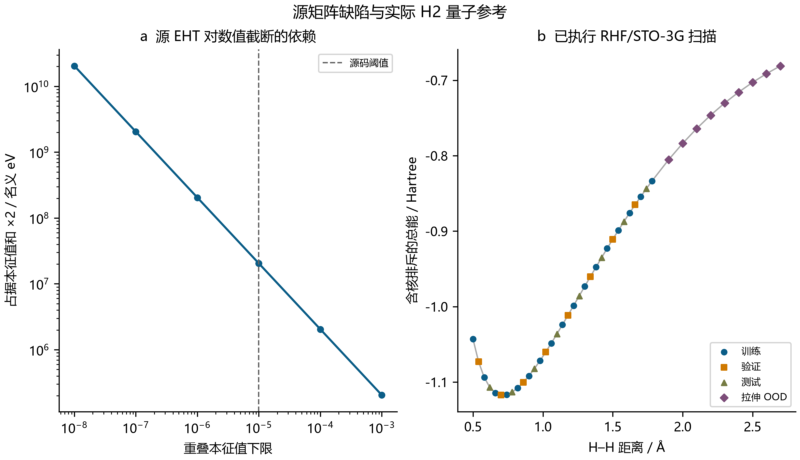
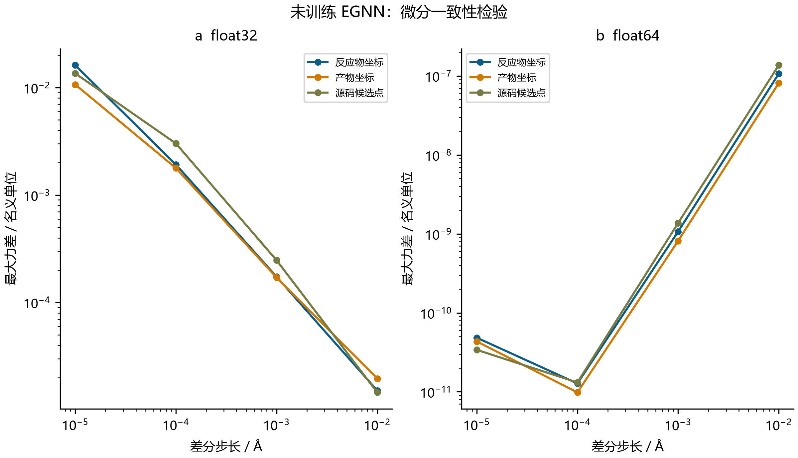
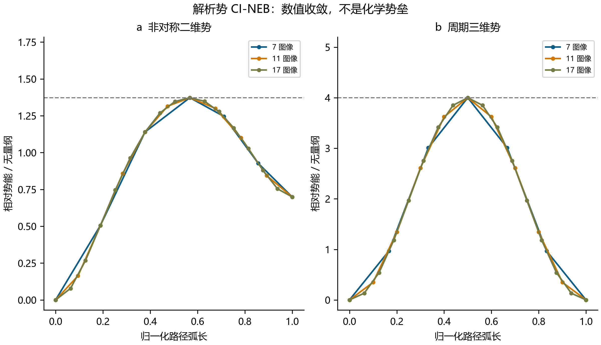
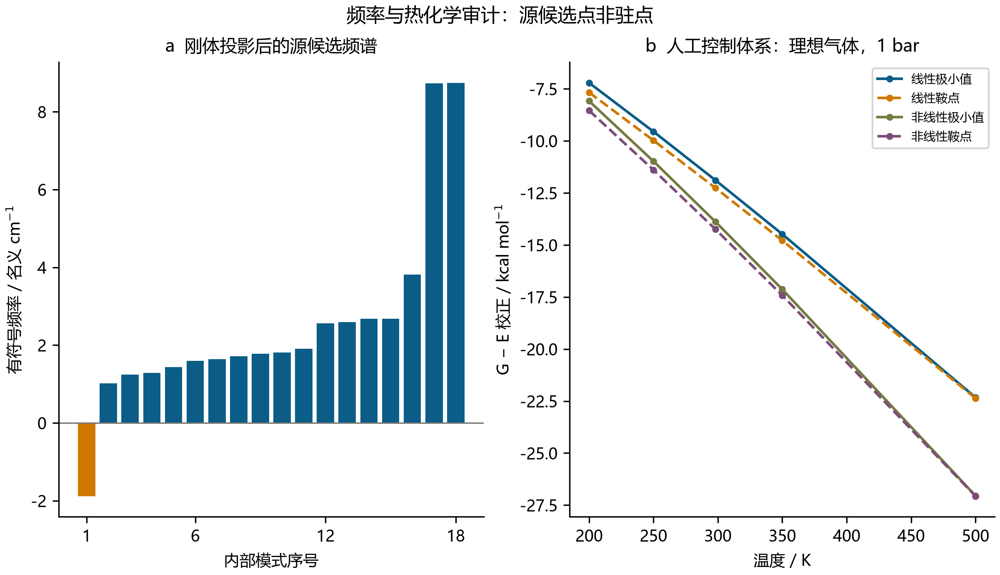

# QuantumEqui-NEB：源程序审计、量子参考与数值验证

学术技术报告 · 2026 年 9 月 28 日 · 中文版

## 1. 执行记录与证据范围

用户提供的 QuantumEqui-NEB 程序已原样执行并正常退出。原始数值结果、图像、坐标、控制台日志及未经训练的权重均已保存，没有进行兼容性修复。追加计算把实现正确性与化学有效性分开检验，涵盖广义特征值问题、实际的小体系 Hartree–Fock 计算、能量和力的插值、等变性、解析路径以及单位明确的谐振热化学。

源码给出八个原子，组成为 **C2HCuN4**，反应物与产物坐标均为手工设定。这不是完整的吲哚底物或多孔催化剂，也没有确立簇的电荷与多重度。含 24,385 个参数的 EGNN 仅随机初始化，没有拟合。因此，其 kcal/mol 标签只能作为名义单位，不能视为经过化学标定的能量。

| 原样执行输出 | 捕获数值 | 解释 |
|---|---:|---|
| EHT 基组维数 | 31 | 必须独立检查重叠矩阵秩 |
| 价电子数 / 占据轨道数 | 40 / 20 | 源码采用的闭壳层假设 |
| HOMO 与 LUMO | 1,005,000 eV | 奇异重叠矩阵正则化伪影 |
| EHT 轨道求和能量 | 471,896,257.61 kcal/mol | 不是从头算总能量 |
| NEB 更新数 / 候选图像 | 30 / 1 | 固定迭代预算 |
| 报告的正向势垒 | −0.01 kcal/mol | 最高内部图像仍低于起点 |
| 原始虚频计数 | 2 | 包含近零数值行为 |
| 报告的鞍点确认 | False | 源码本身未确认鞍点 |
| 报告的 Gibbs 能量 | 471,896,203.29 kcal/mol | 混合能量参考且热化学不完整 |

实际量子参考只涉及 **H2**。没有执行 Cu 簇量子计算、DFT、电化学环境模拟或实验。[归档任务文档](../source/specification.md)、[执行记录](../results/original/execution.json)和[捕获的全局数据](../results/original/captured_results.json)保留了源程序声明，但不据此认可其科学结论。

## 2. 久期方程、实际 H2 计算与替代模型局限

当重叠矩阵 S 为正定时，对称正交化通过 H′=S⁻¹ᐟ²HS⁻¹ᐟ²，把 HC=SCε 转化为普通特征值问题 H′C′=C′ε。必须针对原始矩阵检查特征对残差和 CᵀSC−I；[SciPy 广义特征值文档](https://docs.scipy.org/doc/scipy/reference/generated/scipy.linalg.eigh.html)明确要求度量矩阵正定。

源程序把同一原子上不同 s/p/d 函数的重叠全部设为一，缺少角向轨道结构，因而同原子的重叠矩阵行完全相同。两个几何的矩阵秩均只有 **8**，31 个基函数中存在 **23** 个零空间方向。裁剪小特征值实际改变了原始度量，并产生巨大的伪轨道能。在源码 10⁻⁵ 裁剪阈值下，反应物对原始广义方程的残差达到 3318.67，度量正交误差达到 1。规范秩截断可以得到条件良好的投影数值对照，但八个保留轨道不能容纳 40 个电子。投影残差约 10⁻¹³，并不消除全空间残差 4.59 和被删除方向上的 Hamiltonian 耦合。裁剪与降秩均不能修复物理轨道模型。

| 反应物重叠裁剪阈值 | 占据轨道特征值之和的两倍 / eV |
|---:|---:|
| 0.001 | 204,251.2901 |
| 0.00001 | 20,463,363.7288 |
| 0.0000001 | 2,046,374,613.7281 |

独立量子参考采用 Psi4 1.11，对中性单重态 **H2 进行 RHF/STO-3G** 计算，使用 PK 积分、单线程、请求 500 MB 内存，能量和密度收敛阈值均为 10⁻¹²。42 个距离包括 0.50–1.78 Å 内的 33 点及 1.90–2.70 Å 的九个拉伸点，保存解析梯度、AO 重叠/Fock 矩阵及核排斥能。另进行 12 个位移能量计算，对六个梯度差分条件进行核验；中性双重态孤立 H 的 UHF/STO-3G 计算提供分离原子参考。正式 **55 个 SCF 作业全部收敛**。

最大广义特征对残差为 4.44×10⁻¹⁶，MO 正交误差为 1.11×10⁻¹⁵，梯度有限差分差异为 2.22×10⁻⁶ Hartree/Å。网格最低点位于 0.70 Å，能量 −1.117349035 Hartree，但其导数仍为 −0.025970422 Hartree/Å，因此不能称为已优化几何。两倍孤立 H 能量为 −0.933163699 Hartree，而受限 H2 在长键长下不能正确趋近这一极限。这些是最小基组、平均场近似内真实执行的从头算计算，不是精确解离基准。HF 总能也不同于两倍占据轨道能之和，其自洽能量构造见 [Psi4 理论文档](https://psicode.org/psi4manual/master/scf.html)。

独立的保存数据检查使用密度、核 Hamiltonian 和 Fock 矩阵，重建 55 个正式与三个先导作业的电子能，同时核对电子迹、日志收敛及数值来源。主结果最大密度能量/Fock 差异为 8.88×10⁻¹⁶ Hartree。这证明数值记录内部一致，但不消除基组与电子相关误差。用于梯度差分核验的位移点从未进入替代模型训练。

确定性的距离替代模型在生成标签之前划定 17 个训练、八个验证、八个测试及九个拉伸分布外几何。16 次 Gaussian-RBF 线性拟合比较仅能量目标和能量/梯度联合目标。两者均使用验证能量与梯度误差选择长度尺度 0.24 Å、岭参数 10⁻¹⁰；“仅能量”仅指系数拟合目标，不表示完全不接触力标签。三个基线分别为三次样条、线性插值/外推，以及训练均值能量配合零力。导数来自拟合能量，但线性插值的节点不可微。

| 模型 | 测试 E RMSE / Hartree | 测试梯度 RMSE / Hartree Å⁻¹ | 分布外 E RMSE / Hartree | 分布外梯度 RMSE / Hartree Å⁻¹ |
|---|---:|---:|---:|---:|
| RBF 仅能量 | 0.0000086243 | 0.000115617 | 0.175473 | 0.459351 |
| RBF 能量 + 梯度 | 0.0000055614 | 0.000163747 | 0.118352 | 0.448587 |
| 三次样条 | 0.000213351 | 0.00297464 | 0.222780 | 0.766237 |
| 线性插值/外推 | 0.00110348 | 0.00223930 | 0.0444501 | 0.108744 |
| 均值能量 / 零力 | 0.0960710 | 0.269899 | 0.268390 | 0.161621 |

联合拟合改善了测试能量，却比仅能量 RBF 产生更大的测试梯度误差。两个 RBF 的外推表现均不如线性基线。这是在单一分子上、针对不完美 RHF 标签的插值研究，没有训练神经网络，也不证明跨化学空间泛化。



**图 1。** (a) 重叠裁剪阈值对源占据轨道能之和的影响。(b) 实际执行的 H2 RHF/STO-3G 总能随键长变化。两幅图分别呈现病态源矩阵构造与适用范围有限的独立量子参考。[可编辑 SVG](figures/Fig1_Quantum_Reference_chinese.svg)。

## 3. 捕获 EGNN 的等变性与导数核验

由距离平方构造的标量消息，以及沿相对位置矢量的坐标更新，可以保持 E(3) 协变性，参见 [Satorras 等人的原始工作](https://proceedings.mlr.press/v139/satorras21a.html)。对行坐标 X′=XQᵀ+t 和正交矩阵 Q，力应按 F′=FQᵀ 变换。原子置换必须同步作用于元素、坐标及力。这些数学对称性不提供化学能量标定。

对实际保存权重在反应物、产物和候选结构上的行为进行测试，使用 float32 及提升到 float64 的同一组权重值。四个确定性 QR 变换、两种行列式符号、平移和置换构成 48 次组合探测，同时记录总力及总力矩。单精度最大能量/力变换误差为 4.77×10⁻⁷/1.31×10⁻⁸，双精度为 4.44×10⁻¹⁶/3.47×10⁻¹⁷。

能量中心差分覆盖所有笛卡尔分量，位移为 10⁻²、10⁻³、10⁻⁴、10⁻⁵ Å。在 10⁻⁴ Å 下，双精度最大力差为 1.31213×10⁻¹¹，单精度抵消误差达到 0.00301960 名义力单位；步长降至 10⁻⁵ Å 时增至 0.01616491。这是在核验同一函数的导数，不是在比较参考电子结构力。

最后一层坐标头更新的位置没有进入能量头，因此其 **1,088 个参数**与总能量无连接。将这些参数全部加七，能量和力均不改变。较早层的坐标头仍能影响后续消息。这一冗余与通过的等变性检查可以同时存在，不能解释为模型已经学习化学。



**图 2。** 三个源几何在四个位移下的能量中心差分力误差，分别展示 (a) float32 和 (b) float64。参考为同一个未经训练函数的 autograd 导数。[可编辑 SVG](figures/Fig2_Force_Audit_chinese.svg)。

## 4. 源路径诊断与独立 CI-NEB 验证

采用确切保存权重原样回放正、反向源算法。它先计算旧路径的全部力，再顺序原地更新图像，使每个图像看见已经移动的左邻居。第 15 轮开始攀爬，但没有力停止准则；30 次更新后无条件返回“converged”，同时返回最后一次更新前的陈旧能量。

正向候选最大原子真实力为 **0.0183398705**，两个端点为 0.0180063229 和 0.0197831113，均为名义单位。候选复算相对能为 −0.0108846426，而包含端点的全路径最高相对能为零。仅在内部图像中选择候选解释了负的打印势垒，并不证明无势垒化学过程。最大陈旧能量差为 0.0000625849。正反向映射后的坐标差为 0.000273762 Å；在相同旧力下，同步更新与实际顺序更新的单步差为 0.0000494665 Å。正反向物理势垒原本就可能不相等，因此仅凭势垒不同不能诊断顺序偏差。

复核求解器使用回调、同步更新、能量加权切线、50 轮普通更新后的攀爬以及 FIRE 风格松弛。首先要求端点满足梯度阈值；最大内部投影力与攀爬图像真实力必须同时达标，达到迭代上限则返回失败。攀爬力 FCI=F−2(F·τ̂)τ̂ 遵循 [CI-NEB 原始论文](https://doi.org/10.1063/1.1329672)。这是对仓库已有实现的扩展，不宣称新算法。

两个独立的无量纲势面分别检验不等深势阱和非共面路径：

\[
V_A=(x^2-1)^2+0.35x+2.5[y-0.55\sin(1.7x)]^2,
\]
\[
V_B=2(1-\cos x)+2(y-0.45\sin x)^2+3[z-0.30(1-\cos x)]^2.
\]

A 的驻点横坐标满足 4x³−4x+0.35=0，正反向势垒为 1.3727196610/0.6733964499。B 的端点为 (0,0,0)、(2π,0,0)，鞍点为 (π,0,0.6)，势垒为 4。解析鞍点 Hessian 均只有一个负本征值。谷底函数用于定位参考驻点，不预设整条谷底曲线就是最小能量路径。

| 势面 | 力阈值 | 条件数 | 更新范围 | 最大势垒误差 | 最大鞍点坐标误差 |
|---|---:|---:|---:|---:|---:|
| A：倾斜 2D | 0.001 | 9 | 147–300 | 1.65750e−7 | 3.65261e−4 |
| A：倾斜 2D | 0.00001 | 9 | 201–364 | 1.43074e−11 | 3.39351e−6 |
| B：弯曲 3D | 0.001 | 9 | 112–227 | 2.10034e−7 | 4.91792e−4 |
| B：弯曲 3D | 0.00001 | 9 | 183–290 | 1.52784e−11 | 4.19447e−6 |

每个势面采用 7、11、17 个图像，种子 11、22、33 和两个阈值。36 个扫描条件全部收敛，另外四个反转对照映射后误差不超过 2.22×10⁻¹⁶。这些结果验证有限范围内的解析案例，不构成分子反应路径证据。



**图 3。** (a) 势面 A 和 (b) 势面 B 的最终能量随归一化路径弧长变化；使用 7、11、17 个图像、种子 11 和 10⁻⁵ 阈值。虚线表示精确正向势垒，坐标均为无量纲。[可编辑 SVG](figures/Fig3_NEB_Validation_chinese.svg)。

## 5. Hessian 投影与明确标准态的理想气体热化学

Hessian 必须使用一致单位，并在驻点几何上解释。对单位为 kcal mol⁻¹ Å⁻² amu⁻¹ 的特征值，SI 常数给出

\[
\tilde\nu=\operatorname{sign}(\lambda)\sqrt{|\lambda|}
\frac{\sqrt{(4184/N_A)/(10^{-20}m_u)}}{2\pi c_{\rm cm}}
=108.591358535\operatorname{sign}(\lambda)\sqrt{|\lambda|}\;\mathrm{cm^{-1}}.
\]

源换算因子 1302.83 在其声明单位下约大 11.99755 倍，也不是 Hartree/Bohr² 对应的 5140.48714。常数依据 [NIST CODATA 2022](https://physics.nist.gov/cuu/pdf/JPCRD2022CODATA.pdf)。单位纠正不会使随机势自动获得化学标定。

以质量中心为原点，构造 √m 加权的平移/转动向量，由 SVD 得到刚体子空间。投影到其正交补后，线性分子移除五个方向，非线性分子移除六个方向，而非删除排序最前的特征值。采用 0.01 cm⁻¹ 数值阈值识别近零模式。热化学要求最大原子梯度 ≤10⁻⁵；极小值必须没有不稳定内部模式，一阶鞍点则必须显式指定且恰有一个。

原始 float32、0.005 Å 计算可复现 ZPVE 0.890357736 kcal/mol，但其“前六项删除”移除了两个原始负值。严格原始负值数目随近零舍入误差改变。确切权重的双精度投影得到 **18 个内部模式**，一个负模为 **−1.881083387 nominal cm⁻¹**；最大梯度 **0.018339870823** 超过阈值约 1834 倍。因此没有发布所谓修正后的源 RRHO 值。八个有限差分 Hessian 保留了相同的显著负曲率，也全部不满足驻点要求。源码还使用固定熵基线 78.5 cal mol⁻¹ K⁻¹、遗漏热焓、混合 EHT 与神经能量参考，并在图中采用无关的 +3.2/−1.8 kcal/mol 偏移。

四个平移/转动不变的原子对距离多项式控制，包含线性与非线性极小值及鞍点。独立解析 Hessian 与 autograd 的最大差为 3.55×10⁻¹⁵，40 个有限差分 Hessian 展示截断和舍入误差的竞争。对有效控制体系，稳定的对数分配函数分别计算 ZPVE、振动激发、理想气体平移、经典转动及电子简并。平移焓为 5/2 RT，转动为 RT 或 3/2 RT，因此 G=E+ZPVE+H热−TS，并明确给定压力、对称数和简并度。传统框架见 [Gaussian 热化学技术说明](https://gaussian.com/wp-content/uploads/dl/thermo.pdf)，本任务未运行 Gaussian。

对每个正模式，x=hcν̃/(kBT)，Svib/R=Σ[x/(exp(x)−1)−ln(1−exp(−x))]。`expm1` 避免小 x 时的抵消误差；负模和内部近零模不会被静默当作正振子。默认对称数和电子简并均为一。压力变化满足经独立测试的 ΔG=RT ln(p2/p1)，并输出转动特征温度以说明经典转动近似。一阶鞍点使用其稳定模式的受约束分配函数，不把不稳定方向当作可定义平衡布居的振动。

| 解析控制体系 | 刚体秩 | 投影频率 / cm⁻¹ |
|---|---:|---|
| 线性极小值 | 5 | 346.954630 |
| 线性鞍点 | 5 | −346.954630 |
| 非线性极小值 | 6 | 233.945192, 272.910673, 378.325758 |
| 非线性鞍点 | 6 | −338.905360, 237.572002, 300.003873 |

80 个温压条件覆盖四个控制体系、五个温度和四个压力。298.15 K、1 bar 下，非线性极小值给出 ZPVE=1.265430660、H热=3.182947980 kcal/mol，S=61.494904977 cal mol⁻¹ K⁻¹，G−E=−13.886327279 kcal/mol。另有 72 个低频敏感性条件；把 0.1 cm⁻¹ 模式强制抬升至 100，会使 G 增加 4.09847880 kcal/mol。这种任意干预不等于阻转子修正，也没有描述溶液或电极标准态。



**图 4。** (a) 双精度 Hessian 的 18 个源候选投影模式，单位为名义 cm⁻¹；该几何并非驻点。(b) 四个人工控制体系在 1 bar 下的理想气体 G 校正随温度变化。两幅图属于不同计算，不是修正后的源反应自由能图。[可编辑 SVG](figures/Fig4_Thermochemistry_chinese.svg)。

## 6. 可复现性、计算量与研究局限

| 已执行模块 | 正式工作量 | 独立先导计算 |
|---|---:|---:|
| H2/H SCF 作业 | 55 | 3 |
| H2 解析梯度 | 42 | 1 |
| 源势审计能量/力调用 | 1,209 | — |
| 确切源 NEB 回放调用 + 最终检查 | 420 + 14 | — |
| 复核解析 NEB 求解 / 更新 | 40 / 8,522 | 6 / 1,097 |
| 复核解析路径点评估 | 104,262 | 11,449 |
| 控制 FD Hessian / 力调用 | 40 / 600 | 16 / 240 |
| 源 FD Hessian / 力调用 | 8 / 384 | 2 / 96 |
| 理想气体 / 低频条件 | 80 / 72 | 4 / 9 |

原始主程序执行另外计数。五个控制 autograd Hessian 和一个源 autograd Hessian 补充有限差分结果。矩阵诊断及 16 次替代模型拟合也独立记录，不属于量子作业。单元测试不计入研究计算量。源检查点、先导代码快照、矩阵/梯度日志、完整源路径及输出哈希均可追溯。

下列命令会重新生成科学结果，应在独立检出目录内执行。先把 `CHEM_PYTHON` 和 `PSI4_PYTHON` 配置为已有解释器，并激活或配置其所需的原生运行库。源程序、势函数、路径及热化学使用 chemistry 解释器，电子结构计算使用 Psi4 解释器：

```powershell
$chem=$env:CHEM_PYTHON
$qm=$env:PSI4_PYTHON
$env:OMP_NUM_THREADS='1'; $env:OPENBLAS_NUM_THREADS='1'; $env:MKL_NUM_THREADS='1'
& $chem quantumequi/scripts/run_source.py
& $qm quantumequi/scripts/electronic_reviewed.py
& $chem quantumequi/scripts/potential_audit.py
& $chem quantumequi/scripts/path_reviewed.py --source-audit
& $chem quantumequi/scripts/path_reviewed.py
& $chem quantumequi/scripts/thermochemistry_reviewed.py
& $chem -m unittest discover -s tests -p 'test_quantumequi_*.py' -v
```

归档源码将 NumPy 和 PyTorch 种子均设为 42，但种子不能保证跨软件版本、平台的权重与运算逐位一致。重新生成的结果需要自己的来源记录和 QA。发布哈希核验是对已有工件的独立检查，不需要重跑科学计算；有意重算前应保留归档结果与历史代码快照。

[电子结构](../results/electronic/summary.json)、[势函数](../results/potential/summary.json)、[路径](../results/path/summary.json)和[热化学](../results/thermochemistry/summary.json)摘要定义了单位、计算量与来源。工件核验见[模块说明](../README.md)、[发布检查](../results/publication_validation.json)及[图像检查](../results/figure_qa.json)。进一步科学研究仍需要完整结构、电荷与自旋指定、独立电子结构参考、经过训练及外部测试的势能模型、优化后的分子端点和鞍点连接关系。溶剂、超越谐振近似的熵及电极处理也是额外要求。现有证据支持可执行数值组件和有限的 H2 量子基准，尚不能确立所提出的 Cu 催化反应机理。
