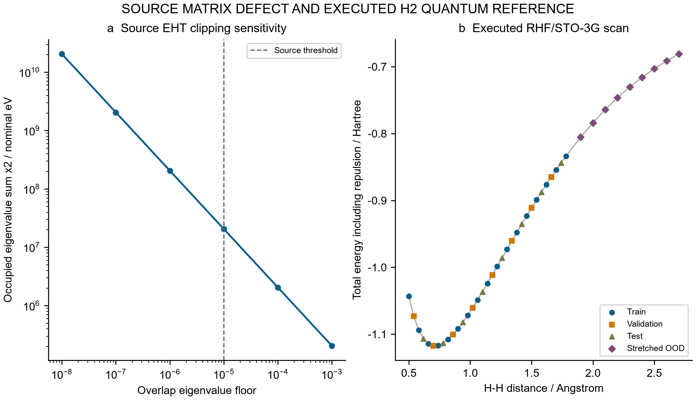
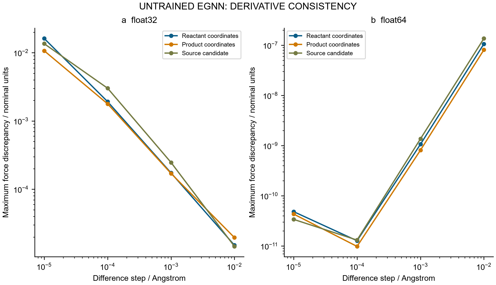
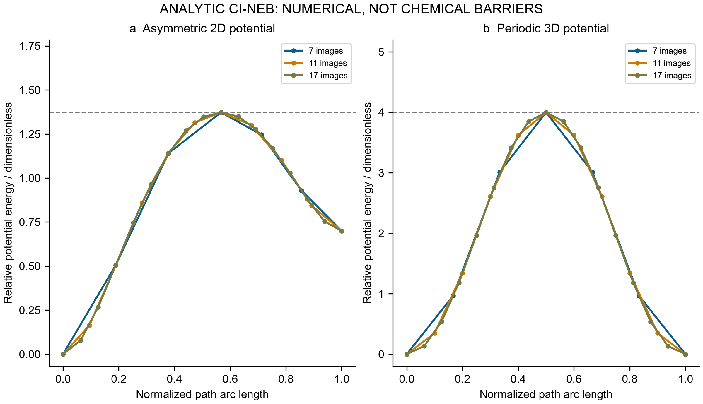
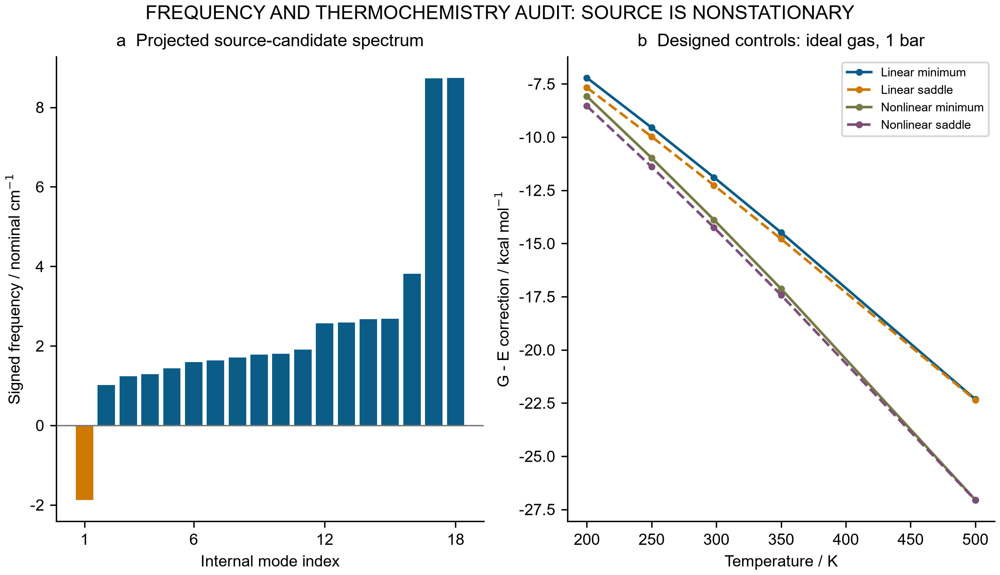

# QuantumEqui-NEB: source audit, quantum reference and numerical validation

Technical report · 28 September 2026 · English edition

## 1. Execution record and evidence scope

The supplied QuantumEqui-NEB program was executed unchanged and exited successfully. Its original numerical output, figure, coordinates, console logs and untrained weights are retained. No compatibility repair was needed. Additional calculations distinguish implementation correctness from chemical validity: a generalized-eigenproblem audit, actual small Hartree–Fock calculations, energy/force interpolation, equivariance checks, analytic path benchmarks and unit-explicit harmonic thermochemistry.

The source specifies eight atoms, **C2HCuN4**, with hand-written reactant/product coordinates. It does not contain a complete indole substrate or porous catalyst, nor establish the cluster charge and multiplicity. Its 24,385-parameter EGNN is randomly initialized and never fitted. Numerical energies assigned kcal/mol labels therefore remain nominal model outputs.

| Unchanged source output | Captured value | Interpretation |
|---|---:|---|
| EHT basis dimension | 31 | Overlap rank requires separate inspection |
| Valence electrons / occupied orbitals | 40 / 20 | Source closed-shell assumption |
| HOMO and LUMO | 1,005,000 eV | Singular-overlap regularization artifact |
| EHT orbital-sum energy | 471,896,257.61 kcal/mol | Not an ab initio total energy |
| NEB updates / candidate image | 30 / 1 | Fixed iteration budget |
| Reported forward barrier | −0.01 kcal/mol | Highest interior image is below the start |
| Raw imaginary-mode count | 2 | Includes numerical near-zero behavior |
| Reported saddle confirmation | False | Source itself does not confirm a saddle |
| Reported Gibbs energy | 471,896,203.29 kcal/mol | Mixed-reference, incomplete thermochemistry |

The actual quantum reference concerns **H2 only**. No Cu-cluster quantum calculation, DFT, electrochemical environment or experiment was performed. The [archived specification](../source/specification.md), [execution record](../results/original/execution.json) and [captured globals](../results/original/captured_results.json) preserve the source claims without endorsing them.

## 2. Secular equations, actual H2 calculations and surrogate limits

For a positive-definite overlap matrix S, symmetric orthogonalization transforms HC=SCε to H′C′=C′ε using H′=S⁻¹ᐟ²HS⁻¹ᐟ². Eigenpair residuals and CᵀSC−I must be checked against the original matrices; the [SciPy generalized eigensolver documentation](https://docs.scipy.org/doc/scipy/reference/generated/scipy.linalg.eigh.html) specifies the positive-definite metric requirement.

The source assigns overlap one to all distinct same-atom s/p/d functions. Their overlap rows are identical because angular orbital structure is absent. Both geometries therefore have rank **8**, leaving **23** null directions among 31 basis functions. Clipping small eigenvalues replaces the original metric and creates large spurious orbital energies. At the source floor 10⁻⁵, the reactant residual against the original generalized equation reaches 3318.67, while metric orthonormality error reaches 1. Canonical rank truncation produces a well-conditioned projected control, but eight retained orbitals cannot accommodate 40 electrons. Its projected residual near 10⁻¹³ coexists with full-space residual 4.59 and discarded Hamiltonian coupling. Neither clipping nor truncation repairs the physical orbital model.

| Reactant overlap floor | Twice occupied eigenvalue sum / eV |
|---:|---:|
| 0.001 | 204,251.2901 |
| 0.00001 | 20,463,363.7288 |
| 0.0000001 | 2,046,374,613.7281 |

A separate reference uses Psi4 1.11, neutral singlet **RHF/STO-3G H2**, PK integrals, one thread, 500 MB requested memory, and energy/density convergence thresholds 10⁻¹². Forty-two distances comprise 33 points from 0.50–1.78 Å and nine stretched points from 1.90–2.70 Å. Analytic gradients, AO overlap/Fock matrices and nuclear repulsion are saved. Twelve displaced energy calculations check six gradient differences; an isolated neutral doublet H UHF/STO-3G calculation supplies a separated-atom reference. All **55 main SCF jobs** converged.

The largest generalized residual is 4.44×10⁻¹⁶, MO orthonormality error 1.11×10⁻¹⁵, and gradient finite-difference discrepancy 2.22×10⁻⁶ Hartree/Å. The grid minimum, −1.117349035 Hartree at 0.70 Å, still has derivative −0.025970422 Hartree/Å; it is not an optimized geometry. Twice the isolated-H energy is −0.933163699 Hartree. Restricted H2 at long bond lengths does not approach this limit correctly. These are executed ab initio calculations within a minimal basis and mean-field approximation, not accurate dissociation benchmarks. Total HF energy also differs from twice the occupied orbital sum; [Psi4’s theory documentation](https://psicode.org/psi4manual/master/scf.html) explains its self-consistent energy construction.

An independent saved-data check reconstructs electronic energies from density, core-Hamiltonian and Fock matrices for all 55 main and three pilot jobs. It also checks electron traces, log convergence and numerical provenance; the main maximum density-energy/Fock discrepancy is 8.88×10⁻¹⁶ Hartree. Thus the numerical records are internally consistent, while basis and correlation errors remain. Displaced gradient-check points never enter surrogate training.

A deterministic distance-only surrogate uses 17 training, eight validation, eight test and nine stretched-OOD geometries, partitioned before labels. Sixteen Gaussian-RBF linear fits compare energy-only and joint energy/gradient objectives. Both use validation energy and gradient errors to select length scale 0.24 Å and ridge 10⁻¹⁰; “energy-only” describes coefficient fitting, not absence of all force-label access. Three baselines use cubic splines, linear interpolation/extrapolation, or training-mean energy with zero force. Derivatives come from the fitted energy, although linear knots are nondifferentiable.

| Model | Test E RMSE / Hartree | Test gradient RMSE / Hartree Å⁻¹ | OOD E RMSE / Hartree | OOD gradient RMSE / Hartree Å⁻¹ |
|---|---:|---:|---:|---:|
| RBF energy only | 0.0000086243 | 0.000115617 | 0.175473 | 0.459351 |
| RBF energy + gradient | 0.0000055614 | 0.000163747 | 0.118352 | 0.448587 |
| Cubic spline | 0.000213351 | 0.00297464 | 0.222780 | 0.766237 |
| Linear interpolation/extrapolation | 0.00110348 | 0.00223930 | 0.0444501 | 0.108744 |
| Mean energy / zero force | 0.0960710 | 0.269899 | 0.268390 | 0.161621 |

Joint fitting improves test energy but worsens test gradient relative to energy-only RBF. Both RBFs extrapolate worse than the linear baseline. This is one-molecule interpolation against imperfect RHF labels, with no neural training or chemical-space generalization.



**Figure 1.** (a) Source occupied-orbital sums under overlap clipping. (b) Executed H2 RHF/STO-3G total energies versus bond length. The panels distinguish an ill-conditioned source construction from a limited independent quantum reference. [Editable SVG](figures/Fig1_Quantum_Reference_english.svg).

## 3. Equivariance and derivative verification of the captured EGNN

Scalar messages based on squared distances and coordinate updates proportional to relative vectors can preserve E(3) covariance, following [Satorras and colleagues](https://proceedings.mlr.press/v139/satorras21a.html). For row coordinates X′=XQᵀ+t and an orthogonal Q, the corresponding force transforms as F′=FQᵀ. Atom permutations must be applied consistently to species, positions and forces. These mathematical symmetries impose no chemical energy calibration.

The actual saved model is tested at its reactant, product and candidate geometries, using float32 and promoted float64 copies of identical stored weights. Four deterministic QR transformations, both determinant signs, translations and permutations yield 48 combined probes. Total force and torque are also recorded. Maximum energy/force transformation errors are 4.77×10⁻⁷/1.31×10⁻⁸ for float32 and 4.44×10⁻¹⁶/3.47×10⁻¹⁷ for float64.

Central differences of energy cover every Cartesian component at steps 10⁻²,10⁻³,10⁻⁴,10⁻⁵ Å. At 10⁻⁴ Å, maximum double-precision force discrepancy is 1.31213×10⁻¹¹; float32 cancellation reaches 0.00301960 nominal force units, increasing to 0.01616491 at 10⁻⁵ Å. These checks compare derivatives of the same function, not reference electronic forces.

The final coordinate head updates positions never consumed by the energy head. Its **1,088 parameters** are disconnected from total energy; adding seven to all of them changes neither energy nor force. Earlier coordinate heads affect later messages. This redundancy coexists with passing covariance checks and does not provide evidence of model learning.



**Figure 2.** Central energy-difference force errors for three source geometries at four displacements, shown separately for (a) float32 and (b) float64. The reference is autograd on the same untrained function. [Editable SVG](figures/Fig2_Force_Audit_english.svg).

## 4. Source path diagnosis and independent CI-NEB validation

Exact saved-weight forward/reverse replays preserve the source algorithm. It evaluates all old-band forces, then updates images sequentially in place: each image sees an already moved left neighbor. Climbing begins at iteration 15, but no force stopping criterion exists. After 30 updates, “converged” is returned unconditionally, with energies from before the last update.

The forward candidate has maximum atomic true force **0.0183398705**; endpoints have 0.0180063229 and 0.0197831113 in nominal units. Its fresh relative energy is −0.0108846426 while the maximum including endpoints is zero. Selecting only interior images explains the negative printed barrier; it does not establish barrierless chemistry. The largest stale-energy difference is 0.0000625849. Forward/reverse mapped coordinates differ by 0.000273762 Å; a same-force simultaneous-update counterfactual differs from the sequential step by 0.0000494665 Å. Unequal physical forward/reverse barriers alone would not diagnose this ordering effect.

The reviewed callback solver uses simultaneous updates, energy-weighted tangents, climbing after 50 ordinary updates, and FIRE-style relaxation. Endpoints must first meet their gradient threshold. Maximum interior projected force and climbing true force must both satisfy tolerance; an iteration cap returns failure. The climbing force is FCI=F−2(F·τ̂)τ̂, as in the [original CI-NEB paper](https://doi.org/10.1063/1.1329672). This extends the repository’s prior implementation, without claiming a new method.

Two independent dimensionless surfaces test unequal wells and a nonplanar path:

\[
V_A=(x^2-1)^2+0.35x+2.5[y-0.55\sin(1.7x)]^2,
\]
\[
V_B=2(1-\cos x)+2(y-0.45\sin x)^2+3[z-0.30(1-\cos x)]^2.
\]

For A, stationary x values solve 4x³−4x+0.35=0; forward/reverse barriers are 1.3727196610/0.6733964499. For B, endpoints (0,0,0),(2π,0,0) and saddle (π,0,0.6) give barrier 4. Analytic saddle Hessians each have one negative eigenvalue. Valley curves locate reference stationary points but are not assumed to trace entire minimum-energy paths.

| Surface | Force tolerance | Cases | Update range | Maximum barrier error | Maximum saddle-position error |
|---|---:|---:|---:|---:|---:|
| A: tilted 2D | 0.001 | 9 | 147–300 | 1.65750e−7 | 3.65261e−4 |
| A: tilted 2D | 0.00001 | 9 | 201–364 | 1.43074e−11 | 3.39351e−6 |
| B: curved 3D | 0.001 | 9 | 112–227 | 2.10034e−7 | 4.91792e−4 |
| B: curved 3D | 0.00001 | 9 | 183–290 | 1.52784e−11 | 4.19447e−6 |

Each surface uses 7,11,17 images, seeds 11,22,33 and two thresholds. All 36 sweep cases converge. Four additional reversal runs agree to 2.22×10⁻¹⁶ after mapping. These outcomes validate bounded analytic cases, not molecular reaction paths.



**Figure 3.** Final energy versus normalized path arc length for (a) surface A and (b) surface B, using 7,11,17 images, seed 11 and tolerance 10⁻⁵. Dashed references show exact forward barriers. Axes are dimensionless. [Editable SVG](figures/Fig3_NEB_Validation_english.svg).

## 5. Hessian projection and explicit ideal-gas thermochemistry

A Hessian must be interpreted with consistent units and at a stationary geometry. For eigenvalues in kcal mol⁻¹ Å⁻² amu⁻¹, SI constants give

\[
\tilde\nu=\operatorname{sign}(\lambda)\sqrt{|\lambda|}
\frac{\sqrt{(4184/N_A)/(10^{-20}m_u)}}{2\pi c_{\rm cm}}
=108.591358535\operatorname{sign}(\lambda)\sqrt{|\lambda|}\;\mathrm{cm^{-1}}.
\]

The source factor 1302.83 is 11.99755 times too large under its stated units and is not the Hartree/Bohr² factor 5140.48714. Constants follow [NIST CODATA 2022](https://physics.nist.gov/cuu/pdf/JPCRD2022CODATA.pdf). Correcting units does not calibrate the random potential.

Mass-centered, √m-weighted translation/rotation vectors define an SVD rigid subspace. Projection onto its orthogonal complement removes five directions for a linear molecule and six for a nonlinear molecule, rather than deleting sorted eigenvalues. A 0.01 cm⁻¹ numerical threshold separates near-zero modes. Thermochemistry requires maximum atomic gradient ≤10⁻⁵ and either zero unstable internal modes for a minimum or exactly one explicitly requested saddle mode.

The source float32/0.005 Å calculation reproduces ZPVE 0.890357736 kcal/mol, but its first-six deletion removes both raw negative values. Strict raw counts vary with near-zero roundoff. Saved-weight float64 projection yields **18 internal modes**, one negative at **−1.881083387 nominal cm⁻¹**; its gradient **0.018339870823** exceeds the threshold approximately 1834-fold. No corrected source RRHO value is therefore released. Eight FD Hessians confirm the curvature result while preserving nonstationarity. The source additionally uses a fixed entropy baseline 78.5 cal mol⁻¹ K⁻¹, omits thermal enthalpy, mixes EHT and neural references, and plots unrelated +3.2/−1.8 kcal/mol offsets.

Four invariant pair-distance polynomial controls provide linear/nonlinear minima and saddles. Their independent analytic and autograd Hessians agree within 3.55×10⁻¹⁵. Forty FD Hessians expose truncation/roundoff tradeoffs. For valid controls, stable logarithmic partitions separately calculate ZPVE, vibrational excitation, ideal-gas translation, classical rotation and electronic degeneracy. Translation contributes 5/2 RT to enthalpy; rotation contributes RT or 3/2 RT. Thus G=E+ZPVE+Hthermal−TS, with explicit pressure, symmetry number and degeneracy. The [Gaussian thermochemistry note](https://gaussian.com/wp-content/uploads/dl/thermo.pdf) provides the conventional framework; Gaussian was not run.

For each positive mode, x=hcν̃/(kBT), and Svib/R=Σ[x/(exp(x)−1)−ln(1−exp(−x))]. `expm1` avoids cancellation at small x; negative and near-zero internal modes are never silently accepted as positive oscillators. The default symmetry number and electronic degeneracy are both one. Pressure changes satisfy ΔG=RT ln(p2/p1), independently tested, while the classical-rotation approximation is exposed through characteristic rotational temperatures. A first-order saddle uses only its stable-mode partition, rather than an equilibrium population along the unstable coordinate.

| Analytic control | Rigid rank | Projected frequencies / cm⁻¹ |
|---|---:|---|
| Linear minimum | 5 | 346.954630 |
| Linear saddle | 5 | −346.954630 |
| Nonlinear minimum | 6 | 233.945192, 272.910673, 378.325758 |
| Nonlinear saddle | 6 | −338.905360, 237.572002, 300.003873 |

Eighty cases span four controls, five temperatures and four pressures. At 298.15 K and 1 bar, the nonlinear minimum gives ZPVE=1.265430660, Hthermal=3.182947980 kcal/mol, S=61.494904977 cal mol⁻¹ K⁻¹ and G−E=−13.886327279 kcal/mol. Seventy-two low-frequency sensitivity cases show that flooring a 0.1 cm⁻¹ mode to 100 shifts G by +4.09847880 kcal/mol. This arbitrary intervention is not a hindered-rotor correction. No solution or electrode standard state is represented.



**Figure 4.** (a) Eighteen projected source-candidate modes from the float64 Hessian, in nominal cm⁻¹; the geometry is nonstationary. (b) Ideal-gas G corrections versus temperature for four artificial controls at 1 bar. These are separate calculations, not a corrected source free-energy profile. [Editable SVG](figures/Fig4_Thermochemistry_english.svg).

## 6. Reproducibility, computation accounting and research limits

| Executed component | Main workload | Separate pilot |
|---|---:|---:|
| H2/H SCF jobs | 55 | 3 |
| H2 analytic gradients | 42 | 1 |
| Source-potential audit energy/force calls | 1,209 | — |
| Exact source NEB replay calls + final checks | 420 + 14 | — |
| Reviewed analytic NEB runs / updates | 40 / 8,522 | 6 / 1,097 |
| Reviewed analytic path point evaluations | 104,262 | 11,449 |
| Control FD Hessians / force calls | 40 / 600 | 16 / 240 |
| Source FD Hessians / force calls | 8 / 384 | 2 / 96 |
| Ideal-gas / low-frequency cases | 80 / 72 | 4 / 9 |

The original master execution is separate. Five control autograd Hessians and one source autograd Hessian supplement the FD counts. Matrix diagnostics and 16 surrogate fits are also separately recorded; they are not quantum jobs. Unit tests are excluded from study counts. Source checkpoints, pilot code snapshots, matrix/gradient logs, full source bands and output hashes remain available.

The following commands regenerate scientific outputs and belong in a separate checkout. Configure `CHEM_PYTHON` and `PSI4_PYTHON` to existing interpreters; their required native runtimes must already be activated or configured. The chemistry interpreter runs source, potential, path and thermal scripts; the Psi4 interpreter runs electronic calculations:

```powershell
$chem=$env:CHEM_PYTHON
$qm=$env:PSI4_PYTHON
$env:OMP_NUM_THREADS='1'; $env:OPENBLAS_NUM_THREADS='1'; $env:MKL_NUM_THREADS='1'
& $chem quantumequi/scripts/run_source.py
& $qm quantumequi/scripts/electronic_reviewed.py
& $chem quantumequi/scripts/potential_audit.py
& $chem quantumequi/scripts/path_reviewed.py --source-audit
& $chem quantumequi/scripts/path_reviewed.py
& $chem quantumequi/scripts/thermochemistry_reviewed.py
& $chem -m unittest discover -s tests -p 'test_quantumequi_*.py' -v
```

The archived source sets NumPy and PyTorch seeds to 42. Seeds do not guarantee identical weights or arithmetic across software versions and platforms; regenerated outputs require their own provenance and QA. Checking published hashes is a separate operation on existing artifacts and does not require rerunning the scientific calculations. Preserve archived results and historical code snapshots before intentional regeneration.

The [electronic](../results/electronic/summary.json), [potential](../results/potential/summary.json), [path](../results/path/summary.json) and [thermal](../results/thermochemistry/summary.json) summaries define units, counts and provenance. Review [module documentation](../README.md), [publication checks](../results/publication_validation.json) and [figure QA](../results/figure_qa.json) for artifact verification. Scientific advancement still requires chemically complete structures, charge/spin assignments, independent electronic references, trained and externally tested potentials, optimized molecular endpoints and validated saddle connectivity. Solvation, entropy beyond harmonic approximations and electrode treatment are additional requirements. The present evidence supports executable numerical components and a limited H2 quantum benchmark, without establishing the proposed Cu-catalyzed reaction mechanism.
