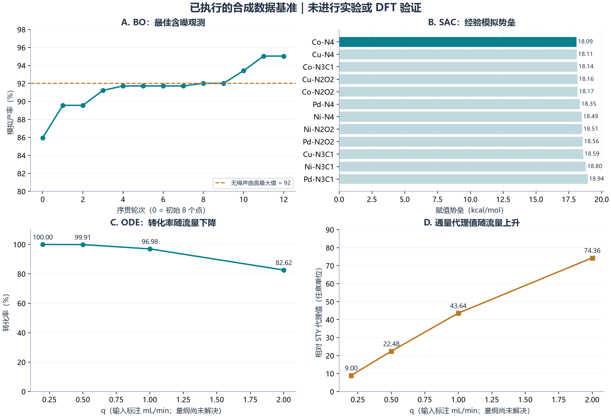
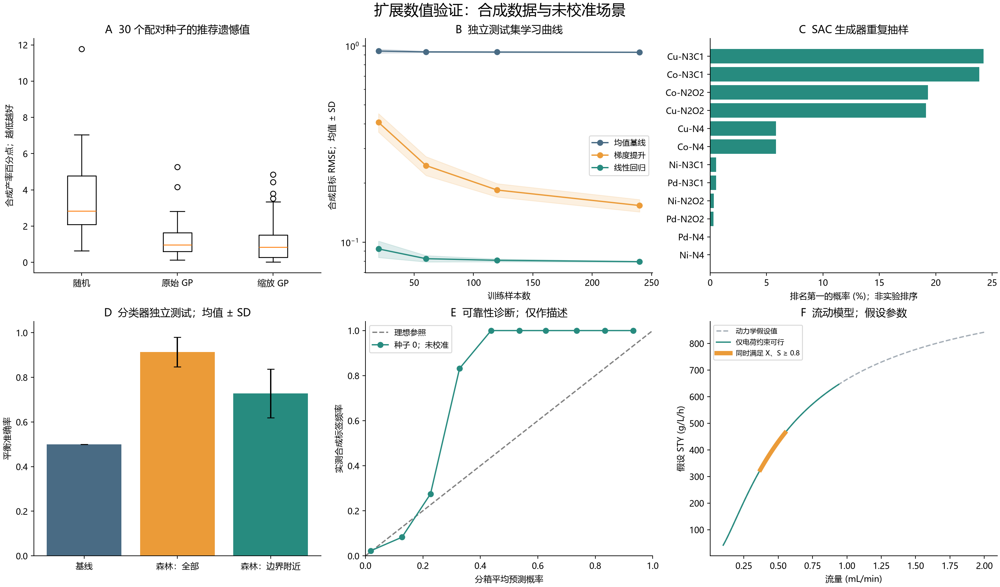
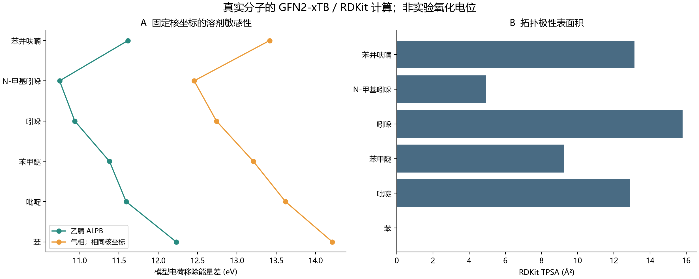

# 初步技术评估报告：AI 驱动的有机电合成与多孔催化材料研究

**日期：** 2026-09-27（Asia/Shanghai）  
**面向对象：** 广西师范大学潘英明—唐海涛研究团队及本科生研究者  
**学科范围：** 有机电化学、催化信息学、机器学习、电子结构与反应工程  
**交付类型：** 遵循所附文档第 3 节的初步技术报告中文版

> **证据声明。** 本次已执行所附 Python 脚本，未改动其科学计算逻辑。五个模块均完成，但其输入与目标值属于合成数据。扩展版另已完成合成数据稳健性检验，以及六个真实分子的 RDKit／GFN2-xTB 计算（36 个 xTB 作业），详见附录 D、E。DFT、过渡态搜索、催化剂合成、伏安测量与制备电解尚未开展。本文如实呈现数值输出，同时指出代码内嵌的无依据结论。下述湿端内容均为拟议验证方案，不是已完成实验的记录。

**证据标记：** **[L]** 文献事实；**[C]** 已执行的合成数据计算；**[Q]** 已执行的真实分子半经验计算；**[A]** 独立代码或算术核验；**[P]** 拟议方法或假设；**[U]** 未知或尚未核实。软件运行成功不等于化学研究取得阳性结果。

## 1. 执行概要与实验室契合性

### 1.1 执行评估

五个方向可以形成连续研究链条：先优化可重复的电合成反应，再学习氧化还原与选择性约束，研究催化剂微环境，探索新的成键级联，最后将已验证反应迁移至流动体系。本次交付建立的是可复现的软件演示与研究方案，尚未证明优势催化剂、新环化反应、可预测的区域选择性或工业运行条件。适合优先启动的课题，是针对组内已能重复的反应，结合标准化电化学数据开展小规模前瞻性贝叶斯优化。该顺序属于基于可执行性的规划判断，不是对科学价值的实测排序。

| 课题 | 实际输出 | 可支持的解释 |
|---|---|---|
| 1. 贝叶斯优化 | 含噪模拟最高产率 **95.04474861433413%**；8 个初始点＋12 次序贯评价 | 优化循环运行完成；未验证节省实验次数 |
| 2. 氧化还原与区域选择性 | 训练集 $R^2=0.9984612448984918$；C2/C3/C5 输出分别为 **3.577 / 3.578 / 3.277** | 对人工目标的训练集拟合；物理电位和主位点未验证 |
| 3. POP-SAC 微环境 | 12 种模拟构型；最低 **Co–N₄，18.09 kcal mol⁻¹** | 经验随机评分最低；非 DFT 势垒或真实催化剂推荐 |
| 4. 杂环环化 | 训练准确率 **1.0**；内置可行性值 **0.892** | 合成数据分类演示；0.892 为硬编码 |
| 5. 流动动力学 | 输入 $q=1.0$ 时：转化率 **96.98%**，代理值 **43.64**；$q=2.0$ 时：**82.62%**、**74.36** | ODE 中的转化率—通量权衡；无真实 STY |

最影响结论的修正包括：BO 最高值包含有利噪声；电位模型混用了不兼容的特征尺度，且 C3 标签人为指定；SAC 最优值只领先 0.02 kcal mol⁻¹，而生成数据的设定噪声尺度为 0.4 kcal mol⁻¹；环化概率与“低风险”均为常量；流动模块文字总结与自身数据表矛盾。本文保留这些问题的原始证据，并在各课题中解释其影响。

**扩展版阅读说明。** 正文五课题保留原始脚本的确切结果与审计结论；后续计算独立记录，不覆盖原始 JSON。新增证据如下，全部方法、数值和限制见附录 D、E。

| 新增计算 | 规模 | 主要发现与边界 |
| --- | --- | --- |
| BO 配对对照 | 30 种子 × 3 方法 × 20 次评价 | 推荐遗憾值：随机 3.5557、原 GP 1.3570、缩放 GP 1.3208 个合成产率百分点 |
| 回归独立测试 | 5,000 测试样本；4 种训练规模；360 次拟合 | n=60：梯度提升测试 R² 0.9287，线性模型 0.9921 |
| SAC 排名敏感性 | 3 个噪声水平，各 100,000 次抽样 | 原 Co–N₄ 第一名概率 5.841%；仅限原经验生成器 |
| 分类器诊断 | 30 训练种子，5,000 独立测试样本 | 整体平衡准确率 0.9129；边界附近 0.7276 |
| 流动反应约束 | 191 点网格；每个流量 10,000 参数情景 | 假设下合格网格最高 STY 点为 0.55 mL/min；未实测 |
| 分子描述符 | 6 个分子；36 个 xTB 作业 | 结构、电荷差分、气相／ALPB 敏感性；没有实测 Eox |

### 1.2 实验室契合性与设备证据边界

**[L]** 2020 年 *Chem* 多孔配体钯单原子催化研究，为孔道环境、配位化学与合成选择性的结合提供了直接先例。出版社摘要支持这一研究主题，中国化学会个人资料页将唐海涛、潘英明列为该文共同通讯作者之一。2024 年 Fe-SA@NC 论文列有广西师范大学药用资源相关国家重点实验室单位，并报告有机电氧化、成键反应及流动合成。这些是合作研究先例，不能证明全部仪器均由某一个课题组独立拥有或当前可以立即使用。 参考：[多孔配体 Pd 研究](https://www.sciencedirect.com/science/article/pii/S2451929420303016)；[中国化学会资料页](https://www.chemsoc.org.cn/member/senior/101648.html)；[铁单原子电合成研究](https://onlinelibrary.wiley.com/doi/full/10.1002/anie.202404295)。

| 方向 | 科学契合点 | 所需条件 | 证据边界 |
| --- | --- | --- | --- |
| 贝叶斯优化 | 复用反应优化和定量分析经验 | 电化学工作站或恒流源、标准电解池、HPLC 或 GC | 文献支持方向契合，软件集成待实施 |
| 电位与 C–H 选择性 | 连接药物骨架与氧化还原描述符 | 三电极 CV、NMR、结构登记 | 未提供组内数据集 |
| 多孔聚合物单原子催化 | 配位与孔道调控有机反应路径 | 聚合物合成；ICP、XPS、BET；合作 STEM/XAS | POP 配位位点与热解氮掺杂碳位点属于不同材料 |
| 环化 | 药用杂环构筑与自由基化学 | 电解、色谱、高分辨质谱、一维及二维核磁 | 所提三组分反应的确切产物未定义 |
| 流动电化学 | 将电合成转化为持续制备 | 计量泵、流动池、压力温度监测、定时收集 | 有文献流动示范，当前设备清单未知 |

**[U]** 本次没有提供仪器品牌型号、电解池尺寸、电极库存、流动通道参数、表征预约权限或组内 SOP。后文列出的设备是各方案的具体需求，不是经核实的库存清单。实验室名称沿用任务文件及 2024 年论文单位信息，不对当前行政名称作额外认证。

### 1.3 从事后解释走向前瞻检验

**[L/P]** 已发表的贝叶斯反应优化及自动化电化学机理研究表明，数据能够指导下一次实验。因此，方法上的转变是：在合成前登记预测，获取能够区分假设的测量，更新模型，再检验模型是否改善决策。DFT 仍用于识别合理中间体和竞争过渡态；AI 不会取消结构、热力学和机理验证。已有成本感知的流动电合成 BO 研究，也意味着“AI＋电化学”本身不构成新颖性。 参考：[Shields 等，2021](https://www.nature.com/articles/s41586-021-03213-y)；[Sheng 等，2024](https://www.nature.com/articles/s41467-024-47210-x)；[Liang 等，2025 年期刊版](https://pubs.acs.org/doi/abs/10.1021/acselectrochem.4c00078)。

**[P]** 五个课题共用四道证据门槛：**G0**，明确可识别的化学体系并获取可追溯记录；**G1**，建立测量重复性与基线；**G2**，给出带不确定性和失败判据的前瞻预测；**G3**，相对于对照证明可重复的科学或过程价值。当前五个模块均属于 G1 之前的软件演示。期刊分区可以是目标，但验收依据必须是证据。

## 2. 5 大适配课题深度剖析

### 2.1 课题一：有机电合成条件的贝叶斯优化

#### 2.1.1 前沿科学背景

阳极单电子转移（SET）可以生成自由基阳离子，后续脱质子、成键或介体循环共同决定产物。阴极过程完成电荷平衡，也可能消耗原料或产物。电流密度影响界面通量，电解质、溶剂、电极材料、混合和通电量影响电阻、传质及反应路径。因此，分离产率不能被视为三个普适坐标的简单函数。实际溶剂通常是离散种类或有约束的混合物，介电常数并非可独立调节的实验旋钮。

**[L/P]** 贝叶斯优化通过代理响应模型与采集函数，在探索未知条件和利用高潜力区域之间权衡。Shields 等已在真实合成中展示这一策略，Liang 等进一步将成本感知的多目标 BO 用于流动电合成。对本实验室而言，可证伪的问题是：在有效实验预算一致的条件下，BO 能否比随机搜索或实验设计基线更快达到预先规定、经重复验证的产率和法拉第效率目标？已有研究支持该策略，但不保证其对所选反应一定占优。 参考：[贝叶斯反应优化](https://www.nature.com/articles/s41586-021-03213-y)；[成本感知流动电合成](https://pubs.acs.org/doi/abs/10.1021/acselectrochem.4c00078)。

#### 2.1.2 干端计算基准与模拟结果

**[C]** 脚本采样 8 个初始点，再运行 12 轮 UCB 搜索，每轮比较 500 个随机候选点。使用 $\nu=2.5$ 的 Matérn 核、`alpha=0.01`、5 次优化器重启，采集函数为 $a(x)=\mu(x)+1.96\sigma(x)$。原注释所写“30 个初始点”与实际执行的 `size=(8,3)` 不一致。数据生成式为：

$$
y=\operatorname{clip}\left[92-0.25(j-16.5)^2-400(c-0.15)^2-0.08(\epsilon-37.5)^2+\eta,\ 0,99\right],\quad \eta\sim\mathcal N(0,1.5^2).
$$

| 指标 | 实际值 | 含义 |
| --- | ---: | --- |
| 电流密度搜索范围 | 5–30 mA cm⁻² | 输入标签 |
| 电解质浓度搜索范围 | 0.05–0.30 M | 输入标签 |
| 介电常数搜索范围 | 20–60 | 无量纲 |
| 观测最高模拟产率 | 95.04474861433413% | 含噪声 |
| 对应电流密度 | 16.438635184335304 mA cm⁻² | 模拟候选点 |
| 对应电解质浓度 | 0.13519087233722182 M | 模拟候选点 |
| 对应介电常数 | 38.71257184723887 | 不能确定具体溶剂 |
| 该点无噪声函数值 [A] | 91.79370804621932% | 独立代入计算 |
| 观测值减无噪声值 [A] | 3.251040568114803 个百分点 | 有利的噪声样本 |

| BO 轮次 | 最佳产率（%） | BO 轮次 | 最佳产率（%） |
| ---: | ---: | ---: | ---: |
| 1 | 89.56812847141919 | 7 | 91.72324013493359 |
| 2 | 89.56812847141919 | 8 | 92.01997177140919 |
| 3 | 91.23322569945368 | 9 | 92.01997177140919 |
| 4 | 91.72324013493359 | 10 | 93.41861536841935 |
| 5 | 91.72324013493359 | 11 | 95.04474861433413 |
| 6 | 91.72324013493359 | 12 | 95.04474861433413 |

**[A]** 无噪声曲面的最大值是 92%，因此 95.04% 是含噪观测，不代表更优的化学极值。选择最大含噪观测还会引入选择偏差。单一长度尺度直接作用于数量级不同的未归一化坐标，目标也未标准化。观测噪声方差为 2.25 百分点平方，而 GP 对角项设为 0.01；两者不匹配，可能扭曲不确定性。使用 1.96 并不自动得到校准良好的 95% 区间。原始脚本未执行多随机种子、无噪声遗憾值或随机搜索对照；新增 30 种子配对检验见附录 D.1。参数定义见所引官方文档。 参考：[GPR 参数定义](https://scikit-learn.org/stable/modules/generated/sklearn.gaussian_process.GaussianProcessRegressor.html)。

**扩展计算。** 本课题的新增验证见附录 D.1。

#### 2.1.3 湿端实验验证方案

**[P]** 选择一个已有明确底物和产物结构、可取得 SOP、且具备校准分析方法的组内反应。铁介导氧化平台可作为文献线索，但具体底物及制备步骤必须来自已核实的 SOP 或补充信息，本报告不反推缺失配方。首先使用玻碳工作电极、铂对电极和适配且校准的参比电极，在三电极池中测量底物、产物、介体、电解质和溶剂的响应。制备筛选可考察玻碳或碳板阳极、铂阴极的无隔膜电解池；若证实产物跨室迁移或阴极消耗，再比较有隔膜配置。

实施步骤为：（1）依据基线 SOP 固定结构编号、化学计量、浓度、温度、电极面积和间距、搅拌、气氛及电量终点；（2）用三次独立配液重复基线，校准内标 HPLC 或 GC 响应因子；（3）根据 CV、电导率、溶解性和电极稳定性限定搜索域，仅允许模型选择已审查的溶剂种类；（4）先进行 8 个空间填充条件，再进行 12 次序贯候选实验，与演示的评价预算对应；（5）尽量随机安排每日顺序，每批加入不变的参照反应，失败实验同样记录；（6）分离候选产物，以 NMR 和 MS 确证，并独立重复优势条件与参照条件后比较均值。

同步记录转化率、分析产率、分离产率、选择性、法拉第效率 $\mathrm{FE}=n_eFn_P/Q_{\mathrm{charge}}$ 和单位产品质量能耗。只有确定产物计量关系及电子数 $n_e$ 后才能报告 FE；电量用 $Q_{\mathrm{charge}}=\int I\,dt$ 积分记录，不能仅凭标称电流推定。拟议成功标准是：预先登记的改善超过分析误差与批间波动，并可跨天重复。具体改善阈值需在测得基线方差后确定，本次尚未达到任何实验阈值。

#### 2.1.4 挑战与备选对策

| 风险 | 诊断与对策 |
| --- | --- |
| 电极钝化 | 记录槽压和前后 CV；统一清洗，登记复用次数和电极批次 |
| 电解质析出或电阻过高 | 在运行温度下检查完整混合物的溶解性和电导率，采集前排除不可行组合 |
| 优化器追逐分析噪声 | 以独立制样估算噪声，重复当前优选条件，标准化目标并建立合理噪声模型 |
| 更多电量或时间造成表观增益 | 匹配电量，或显式将电量、时间、FE 和能耗纳入目标 |
| 未证明 BO 优势 | 保留等预算随机或 DoE 对照，无优势则如实报告 |

### 2.2 课题二：C–H 区域选择性与氧化电位建模

#### 2.2.1 前沿科学背景

氧化电位描述特定条件下某个化学物种失去电子的行为，区域选择性则描述该物种内部不同成键或断键路径之间的竞争。二者相关，但属于不同预测目标。SET、质子耦合电子转移、氢原子转移（HAT）、自由基加成、脱质子及催化剂结合都可能影响产物比例。分子易氧化并不能唯一确定某个碳原子最易反应。除非机理已经建立，也不应将常规电化学官能团化直接等同于金属介导的 C–H 活化。

**[L/P]** OxPot 研究展示了电子描述符与氧化电位预测的结合，但其计算数据集及水相语境不能直接替代非水体系的实测 CV 标签。可信的组内模型应先预测定义一致的分子级观测量，再用独立的位点描述符与实测产物比例处理区域选择性。可检验的问题是：面对未见骨架，描述符模型是否优于简单线性或近邻基线？[OxPot 原始研究](https://pubs.acs.org/doi/10.1021/acs.jcim.5c00159)。

#### 2.2.2 干端计算基准与模拟结果

**[C]** 脚本生成了 60 个四维标准正态随机向量，没有读取分子结构或量化计算结果。虽然注释写有 50 个片段和“实验”电位，实际目标仍是下式合成标签。包含 50 个估计器的梯度提升回归器在同一批 60 条数据上拟合并评分。

$$
y_{ox}=-0.85X_0+0.30X_2+1.65+\xi,\qquad \xi\sim\mathcal N(0,0.08^2).
$$

| 指标 | 原始值 | 解释 |
| --- | ---: | --- |
| `model_r2` | 0.9984612448984918 | 训练集而非测试集 $R^2$ |
| HOMO 特征重要性 | 0.9064911954192894 | 树模型基于不纯度的重要性 |
| 自由基稳定性重要性 | 0.009309994890810476 | 非物理系数 |
| 局部亲电性重要性 | 0.08021380367633771 | 标签公式预先含该变量 |
| 埋藏体积重要性 | 0.00398500601356262 | 不证明位阻在化学上无关 |

| 模拟位点 | 输入向量 | 被标作相对 SCE 的 $E_{ox}$ 输出（V） |
| --- | --- | ---: |
| C2 | [−5.8, 1.42, 0.88, 22.4] | 3.577 |
| C3 | [−5.8, 0.95, 0.54, 18.1] | 3.578 |
| C5 | [−5.8, 0.32, 0.12, 35.8] | 3.277 |

**[A]** 第一特征的实际训练范围为 −2.0182 至 2.7068，第四特征为 −2.1412 至 2.4940；三个目标向量均超出这两个范围。标准正态训练数值从未被校准为 HOMO 能量或埋藏体积百分数，因此物理化的特征名称具有误导性。输出只是数学上的模型响应，不是可信电位。此外，`predicted_regioselective_major_site = "C3"` 是直接写入的字符串，并非由预测推断。即使采用不恰当的“最低电位对应主位点”规则，也会选择 C5 而非 C3。C2/C3 相差 1 mV 不具备经验证的意义。

很高的训练 $R^2$ 主要表明模型能够拟合人工构造的目标，不衡量骨架迁移、不确定性校准或实验电位精度。scikit-learn 的 `score(X, y)` 评价的是传入数据，而该脚本传入的正是训练集。[官方方法说明](https://scikit-learn.org/stable/modules/generated/sklearn.ensemble.GradientBoostingRegressor.html)。

**扩展计算。** 本课题的新增验证见附录 D.2。真实分子描述符见附录 E。

#### 2.2.3 湿端实验验证方案

**[P]** 建立相互关联的分子 CV 表与反应／位点选择性表。每个底物登记规范异构 SMILES、明确原子映射、电荷、质子化状态和批次。可规划 20–30 个易获取化合物作为流程及重复性试点，不能据此宣称广泛泛化。采用玻碳圆盘工作电极、铂对电极和适合非水介质的参比电极，在同一介质测量二茂铁／二茂铁鎓参照并记录实际校准方式。若使用 SCE，需记录液接界面与溶剂条件，不使用跨溶剂的通用换算。

拟议分析起始筛查为：在经溶解性和空白验证的介质中使用 1 mM 底物、0.10 M 支持电解质，扫描速率设为 50、100、200 mV s⁻¹。这些是本报告提出的测量起点，不是从原脚本或潘—唐组 SOP 还原的参数。若电流量程、溶解性或空白稳定性不合适，应据实调整。测量溶剂／电解质空白、独立配液重复及多圈扫描，以识别吸附或分解；明确区分可逆 $E_{1/2}$、不可逆阳极峰电位 $E_{pa}$ 和起始电位，不能混作同一种标签。

在明确的制备反应和可比较的转化率下，利用响应校正且能分离异构体的 HPLC／GC 测定区域异构体比例，再用 NMR／二维 NMR 确定结构。拟议描述符流程为 RDKit 结构检查、构象生成、低成本几何预筛，以及对选定结构采用统一 DFT／溶剂化方案。分子级氧化还原量应与局部自旋密度、HAT 能量、竞争过渡态自由能分开计算。采用骨架分组与时间留出，预处理只在训练折内拟合，报告以 V 为单位的 MAE／RMSE 及校准表现。位点排序应对照实测比例，而不是硬编码的 C3。

#### 2.2.4 挑战与备选对策

| 风险 | 诊断与对策 |
| --- | --- |
| 参比尺度不一致 | 保留溶剂、参比、标准物、扫描速率和观测量类型，分开建模或明确校正 |
| 骨架泄漏与小样本 | 相关分子和重复样本同组划分，与简单基线比较，必要时报告宽不确定区间 |
| 域外输入 | 拒绝或标记单位不一致和陌生化学类别，不输出高置信电位 |
| 过渡态不收敛 | 检查映射、构象、电荷自旋和反应坐标，采用约束扫描及多起点；适用时验证相关虚频及连接两端的 IRC |
| 选择性机理错误 | 综合时间曲线、同位素／竞争实验及中间体证据；捕获和 KIE 仅作支持，不能单独定论 |

### 2.3 课题三：POP-SAC 催化剂配位微环境筛选

#### 2.3.1 前沿科学背景

负载的单金属位点同时与配位原子、邻近官能团、孔道内反应物及电极／电解液界面相互作用。配体给电子能力、局部电荷、自旋态、可接近性和吸附几何都可能改变竞争路径的相对能量。M–N₄ 这样的位点式不能唯一确定催化剂：不同骨架、轴向配体、质子化状态和运行电位可能对应不同活性物种。因此，配位键是机理设计变量，不能仅凭类别标签预测活性。

**[L/P]** 多孔配体 Pd 研究为利用局部环境改变有机合成路径提供了先例，Fe-SA@NC 则为单原子氧化还原介导提供了另一条先例。合理的新问题是：在金属负载量与传质影响可区分的前提下，经结构确认的第一或第二配位层改变，能否在相当转化率下改变有机选择性？这两篇论文都没有建立下述十二种模拟位点的活性排序。完整 POP 配位口袋与热解衍生碳位点必须作为不同材料类别建模和表征。 参考：[Pd 多孔配体研究](https://www.sciencedirect.com/science/article/pii/S2451929420303016)；[Fe 氧化还原介体研究](https://onlinelibrary.wiley.com/doi/full/10.1002/anie.202404295)。

#### 2.3.2 干端计算基准与模拟结果

**[C]** 实际网格包含 Cu、Co、Ni、Pd 四种金属和 N₄、N₃C₁、N₂O₂ 三种配位标签，共十二行。Zn 与 N₂C₂ 仅出现在注释中，没有实际筛选。每个“势垒”由以下经验式赋值：

$$
B=18.5-0.8(d-8)^2+0.3(\chi_{coord}-11.0)^2+\zeta,\qquad \zeta\sim\mathcal N(0,0.4^2).
$$

$d$ 对 Cu、Co、Ni、Pd 分别设为 9、7、8、8，$\chi_{coord}$ 对 N₄、N₃C₁、N₂O₂ 分别设为 12.1、10.8、11.5。它们是未经校准的编码；$d$ 不构成氧化态或真实轨道占据的证据，$\chi_{coord}$ 也不是经验证的物理电负性描述符。

| 金属 | 配位标签 | 模拟势垒（kcal mol⁻¹） |
| --- | --- | ---: |
| Cu | N₄ | 18.11 |
| Cu | N₃C₁ | 18.59 |
| Cu | N₂O₂ | 18.16 |
| Co | N₄ | **18.09** |
| Co | N₃C₁ | 18.14 |
| Co | N₂O₂ | 18.17 |
| Ni | N₄ | 18.49 |
| Ni | N₃C₁ | 18.80 |
| Ni | N₂O₂ | 18.51 |
| Pd | N₄ | 18.35 |
| Pd | N₃C₁ | 18.94 |
| Pd | N₂O₂ | 18.56 |

**[A]** JSON 将 Co–N₄ 的 18.09 kcal mol⁻¹ 选为最低值，Cu–N₄ 的 18.11 次之。0.02 kcal mol⁻¹ 的差值比生成器设定的 0.4 kcal mol⁻¹ 标准差小二十倍，不能构成置信区间或稳定排序。仅作算术示例：若该差值真是 298 K 下的活化自由能差，且 Eyring 前因子相同，速率比约为 1.034；这不是速率预测。Cu 与 Co 的无噪声金属项相同，Ni 与 Pd 也相同，同一配位标签下这些金属对的差异来自随机噪声。本次未计算几何、吸附能、过渡态、溶剂、电位或周转频率。

**扩展计算。** 本课题的新增验证见附录 D.3。

#### 2.3.3 湿端实验验证方案

**[P]** 从一种可获取、已有文献或组内基础的载体化学出发，选择在可比较载体上能够实现的两至三种位点环境，不因玩具网格包含十二个标签就尝试全部合成。完整 POP 路线需记录单体身份、聚合连接方式、金属化学、洗涤顺序、干燥历史及孔隙；热解路线还要记录气氛和温度历史，不能将最终碳材料称作未经改变的聚合物。在选定真实 SOP 前，前体比例、温度程序和合成收率保持 `unverified`。

制备独立催化剂批次，使用 ICP-OES／ICP-MS 测定整体金属含量，XPS 分析化学状态变化，气体吸附测试孔隙，可获得时使用 HAADF-STEM 检查分散性。结合 XANES／EXAFS 及拟合不确定性检验配位环境，不能仅凭一个 STEM 亮点或未见金属衍射峰就证明全部金属为单原子。先在三电极体系中检查电化学行为，再以标准化的负载量、成膜、黏结剂、暴露面积、电解质和电量测试同一基线有机反应。以校准 HPLC／GC 定量转化率和选择性，NMR／MS 确证产物。

对照应包含裸载体、无金属改性载体、相关可溶性金属物种，以及在化学可比时的纳米颗粒材料。测定电解液中的浸出金属，谨慎测试分离后的滤液，并表征回收材料。热过滤或毒化实验单独不能确立非均相单原子催化。优先按几何面积与催化剂质量报告性能；只有活性位点数量可靠时才报告位点归一化 TOF。只有组成、稳定性和选择性变化经这些对照及独立批次检验后，才能提出微环境作用的结论。

#### 2.3.4 挑战与备选对策

| 风险 | 诊断与对策 |
| --- | --- |
| 团聚或浸出 | 比较反应前后显微、光谱和溶液 ICP，不将活性自动归属于初始结构 |
| POP 导电性或孔道可达性差 | 测电阻，改变膜厚及混合条件，比较适配导电载体 |
| 位点比较受混杂影响 | 尽量匹配负载量、孔隙及制备条件，明确剩余差异 |
| 自旋态不明或过渡态失败 | 比较合理电荷自旋和多条路径，检查频率及连接，失败情况明确标记，不插补势垒 |
| 缺少工作态证据 | 离线结构如实标注，可行时合作获取电位依赖或原位表征 |

### 2.4 课题四：药用杂环环化反应可行性

#### 2.4.1 前沿科学背景

自由基级联可以在电化学引发后连续完成多个成键步骤。硫醇氧化可能形成硫中心自由基，其向异腈加成可能产生亚胺酰自由基型中间体，吲哚类组分则可能提供竞争捕获位点。这些只是合理的基元反应类型，不能证明任意吲哚、异腈和硫醇混合都能成环。只有明确产物拓扑、连接链长度、原子平衡、自由基极性、环化几何和终止方式，环化可行性判断才具有化学意义。

**[L/P]** Zhang 等报告了异腈与硫醇或二硒化物电化学环化制备含硫族取代基苯并噻唑的研究。这是相邻文献先例，不是对脚本中未明确结构的吲哚三组分反应的验证。前瞻问题应是：一个具有完整原子映射的三组分设计，能否形成经结构确证的环化产物，而非简单偶联、二硫化物或分解？结构可行性必须先于分类器优化。[原始环化研究](https://advanced.onlinelibrary.wiley.com/doi/10.1002/adsc.202400448)。

#### 2.4.2 干端计算基准与模拟结果

**[C]** 脚本在 0.1–2.5 的均匀分布中抽取 80 个四特征向量，并按下列确定规则赋标签；30 棵树的随机森林在同一数据上训练和评价。过程未使用反应结构、原子映射、产物、CV 测量或文献反应结果。

$$
y=\mathbf1[X_0<1.2\ \land\ X_1<1.8\ \land\ X_2>0.8].
$$

| 输出 | 数值或文本 | 证据状态 |
| --- | --- | --- |
| 训练准确率 | 1.0 | 样本内拟合 |
| 正负标签数 [A] | 18 / 62 | 按原规则重新生成 |
| 目标标签 | 吲哚＋异腈＋硫醇的三组分电化学环化（原始目标标签） | 无具体分子身份的名称 |
| `feasibility_score` | 0.892 | 字面常量，未调用概率预测 |
| `predicted_side_reaction_risk` | “低风险（恒电位电解防止阳极过氧化）”（原始字符串的中文译文，未经验证） | 字面常量；意为“低，恒电位防止阳极过氧化”，未经检验 |

**[A]** 准确率 1.0 只表明森林在训练数据上复现了人工规则；被称为偶极矩的第四特征甚至不参与标签生成。0.892 既不是经过校准的 89.2% 成功概率，也不是产率预测。风险文本没有电位依赖的动力学或电化学模型支持。控制电位可能抑制部分氧化路径，但当氧化窗口重叠、表面状态改变或存在后续化学反应时，不能保证产物稳定。

**扩展计算。** 本课题的新增验证见附录 D.4。

#### 2.4.3 湿端实验验证方案

**[P]** 首先完成结构页，而不是直接写电解配方：列出各反应物结构与原子编号，画出拟议产物，标记所有新键，平衡原子、质子与电子，并检查是否存在合理的成环路径。任务中的目标缺少这些信息，因此无法从它推导经过验证的合成 SOP。文献双组分环化可按其核实后的步骤作为独立阳性对照，但不能改名充当所请求的三组分发现。

选定可行结构设计后，在玻碳／铂／参比三电极体系测量单组分与混合物 CV。采用恒电位仪，在相容时先使用无隔膜制备池；若对电极反应干扰，再比较有隔膜池。拟议发现性筛查可从限量反应物 0.05–0.10 mmol 开始，浓度与共反应物比例由所选结构方案固定；这一规模只是规划选择，不是验证条件。溶剂、支持电解质和电位依据实测窗口及溶解性选择，不能由 0.892 或 BO 的介电常数坐标决定。

设置完整混合物、无电流及分别缺少各组分的对照。按时间取样，用适配的 HPLC／LC-MS 或 GC-MS 比较随电量变化的转化率与产物分布，检查二硫化物、开链加成物、吲哚低聚物和异腈相关副产物。若发现候选环化产物，必须分离后结合 HRMS、一维及二维 NMR 确认连接关系；精确质量不能区分异构体。确认产物后进行独立重复和小型底物矩阵，再开展自由基捕获、同位素标记及竞争实验，同时控制探针自身的直接电化学效应。

训练前明确阳性标签，例如在规定条件下，确认目标连接关系且分析产率超过预先登记阈值。保留失败反应与分析检出限。对新底物组合报告精确率、召回率、PR-AUC 和概率校准，而非只看准确率。如果无法给出合理成环拓扑，或在所考察范围内重复实验只得到已鉴定的非环化产物，应停止该环化分支；这些阴性结果仍有数据价值。

#### 2.4.4 挑战与备选对策

| 风险 | 诊断与对策 |
| --- | --- |
| 产物拓扑未定义 | 排定实验优先级前明确原子映射与合理基元步骤 |
| 硫醇二聚与电极钝化 | 定量二硫化物，检查电流衰减和电极表面；仅在机理支持时比较控制加料 |
| 产物过氧化 | 测产物 CV，设产物稳定性对照，比较电量时间终点或快速移出 |
| 结构误判 | 综合分离、质谱与二维核磁；不能区分的异构体明确标为未解决 |
| 分类器置信度误导 | 用可追溯结果替代人工标签，使用经留出校准的预测 |

### 2.5 课题五：流动电化学、动力学与时空产率

#### 2.5.1 前沿科学背景

连续电解耦合停留时间、界面电子转移、传质、反应器几何和产物稳定性。提高流量可能增强反应物到达电极的输送，同时缩短停留时间；最高单程转化率未必对应最大产品产出。对于定义清楚的理想单电子界面步骤，Butler–Volmer 关系可以表示电位依赖：

$$
j=j_0\left[\exp\left(\frac{\alpha_a F\eta}{RT}\right)-\exp\left(-\frac{\alpha_c F\eta}{RT}\right)\right].
$$

$j_0$ 为交换电流密度，$\eta$ 为过电位，$\alpha_a$、$\alpha_c$ 为传递系数，$F$ 为法拉第常数，$T$ 为温度。真实有机级联可能需要更细致的机理模型。简单传质极限下，可用统一 SI 单位写作 $j_{lim}=n_eFk_mC_b$。在一级过程假设下，单位均为 m s⁻¹ 的界面动力学与传质系数可组合为 $k_{eff}=a/(1/k_{ct}+1/k_m)$，其中 $a$ 为单位反应器体积的电极面积。这些方程都需参数校准，原脚本均未实现。

**[L/P]** 2026 年连续肟电合成研究在特定反应体系中展示了电解液流路和电荷—物料平衡的重要性。该研究支持考察反应器与流量变量，但其中材料、转化率、效率和运行参数不能直接移植到本任务尚未定义的有机反应。可证伪的工程问题是：相比匹配的间歇过程，流动操作能否在保持选择性、FE 和耐久性的同时，提高经确认的产品生产率？[连续肟电合成研究](https://www.nature.com/articles/s41467-026-68738-0)。

#### 2.5.2 干端计算基准与模拟结果

**[C]** 脚本在归一化坐标 $z\in[0,1]$ 上取 50 个点，使用 $C(0)=1$ 和数值常数 $k_{app}=3.5$ 积分下列标量 ODE：

$$
\frac{dC}{dz}=-\frac{3.5}{q}C,\qquad X_{\%}=100[1-C(1)],\qquad S_{proxy}=0.45qX_{\%}.
$$

| 输入流量标签（mL min⁻¹） | JSON 转化率（%） | JSON 相对 STY 代理值 | 解析解转化率（%）[A] |
| ---: | ---: | ---: | ---: |
| 0.2 | 100.00 | 9.00 | 99.9999974890 |
| 0.5 | 99.91 | 22.48 | 99.9088118034 |
| 1.0 | 96.98 | 43.64 | 96.9802616578 |
| 2.0 | 82.62 | 74.36 | 82.6226056550 |

**[A]** 若将其作为数值上的无量纲代理模型，解析解为 $C(1)=\exp(-3.5/q)$。独立计算解析解，与四个条件的数值积分之差均小于 $2.85\times10^{-7}$ 个百分点。100.00% 是四舍五入，不是严格完全转化。JSON 中的 `Flow rate 1.0 mL/min gives balanced conversion (83.2%) and highest STY` 与数据矛盾：1.0 对应 96.98%，所测试条件下最高代理值为 2.0 时的 74.36；83.2% 不匹配四个转化率中的任何一个。

原脚本把 $k_{app}$ 标为 s⁻¹，$q$ 标为 mL min⁻¹，而 $z$ 无量纲；缺少反应器体积和时间单位换算时，$k_{app}/q$ 不能成为所需的无量纲系数。具有物理一致性的理想 PFR 方程应写为：

$$
\frac{dC_A}{d\zeta}=-\mathrm{Da}\,C_A,\qquad \mathrm{Da}=k_{eff}\tau,\qquad \tau=\frac{V_R}{q_v},\qquad X=1-e^{-\mathrm{Da}},
$$

$q_v$ 与 $V_R$ 采用一致的体积单位，$\tau$ 的时间单位须与 $k_{eff}$ 匹配。这是拟议的物理模型修正，不是对原结果事后重新赋予单位。输入没有反应器体积，代码也没有 Butler–Volmer 方程、独立传质系数、电极面积、电流、电位、温度、选择性或失活项。

代理量为 $45q(1-e^{-3.5/q})$，对正流量单调增加，并在任意单位下趋近 157.5，因此不能确定有限流量处的通量极值。四个点均表现为转化率降低与代理量升高的权衡；没有约束或目标权重就没有唯一最优点。仅作示例：若额外要求转化率至少 95%，在这个四点网格中，1.0 是满足约束且代理量最高的点。这是新加入的约束，并非原代码得出的结论。

**扩展计算。** 本课题的新增验证见附录 D.5。

#### 2.5.3 湿端实验验证方案

**[P]** 将已确认的间歇反应迁移至适配的流动池，而不是直接放大未经验证的环化。记录电极材质、几何面积、间距、通道形状、润湿体积、密封、隔膜、泵型和温度。碳或玻碳阳极以及铂或其他已验证阴极可以作为候选起点，不代表普适最优。以称重校准实际流量，测量可达体积，可行时用惰性示踪剂测定停留时间分布。多孔电极或析气通道内，标称体积除以流量未必代表真实停留时间。

只有实际泵、反应器、反应体系及压力范围相容时，才使用上述四个标称流量。在每个条件记录电流、可测得的电极电位、槽压、温度、压力、电量和进出口组成。通过连续样品证明出口稳定，而非仅按固定等待时间判断；初始规划可在若干标称停留时间后取样，再用分析确认稳定。定时收集馏分，经校准 HPLC／GC 定量原料和产物，并以 NMR 核验选定样品。重复流量条件并尽量随机排序，以识别催化剂或电极随时间变化的影响。

对单程稳态系统，令 $q_v$ 的单位为 L h⁻¹、产品浓度 $C_P$ 为 mol L⁻¹、产品摩尔质量 $M_P$ 为 g mol⁻¹、反应器体积 $V_R$ 为 L，则：

$$
\dot m_P=q_vC_PM_P,\qquad \mathrm{STY}=\frac{q_vC_PM_P}{V_R}\quad[\mathrm{g\,L^{-1}\,h^{-1}}].
$$

对不含产品进料、体积变化可忽略的简单 1:1 转化，可写 $C_P=C_{A,0}XS$，其中转化率 $X$ 和选择性 $S$ 均用分数表示。若分离回收不完全，应另报分离产品生产率。稳态 $\mathrm{FE}=n_eF\dot n_P/I$ 中，$\dot n_P$ 的单位须为 mol s⁻¹。电能强度为 $\int U_{cell}I\,dt/m_P$，需明确单位换算和核算边界；泵、冷却、分离及溶剂回收还会增加过程消耗。当前 JSON 的真实 STY、FE 和能耗均为 `unavailable`。

只有检查物料平衡、稳态及参数可辨识性后才拟合动力学／传质参数。至少留出一个流量／电流条件作为预测检验，而非全部用于拟合，并将复杂模型与简单停留时间模型比较。有意义的放大还需产品质量、持续运行、电极寿命及分离负担证据，不能只看短时间高转化率。

#### 2.5.4 挑战与备选对策

| 风险 | 诊断与对策 |
| --- | --- |
| 气泡、旁路或分布不均 | 检查压力与停留时间表现，据需调整方向、通道及气体管理 |
| 析出与堵塞 | 检查进料及产物溶解性，监测压力，依据设备限制设停机阈值 |
| 钝化或催化层脱落 | 随时间记录槽压、产出及金属／颗粒流失，比较回收电极 |
| 电流与进料不匹配 | 报告单位进料电量与 FE，检验传质时联合改变电流和流量 |
| STY 或绿色结论失真 | 明确体积与回收定义，比较过程前明确能耗和废物边界 |

### 2.6 综合证据图



**图 1。** A：BO 最佳含噪观测，含独立重建的初始基线，虚线表示无噪声生成函数最大值。B：十二种经验 SAC 评分。C–D：将转化率和相对通量代理值分图展示，避免暗示相同物理单位。全部图形均为合成数据；流量离散点之间的连线仅作视觉引导。可用 `audit_benchmarks.py` 复现原始图形数值及独立算术核验；本版图中文字已译为中文，数值未变。

## 3. 本科生四年分阶段行动路线

**[P]** 以下是拟议成长路径，不意味着四年必然发表论文或获得录取。推进依据应是已经展示的能力与证据门槛。五个课题是相互关联的选择，本科阶段通常应完成一个完整项目，而非同时铺开五个缺少支撑的项目。实验操作须经过培训并遵循负责教师的正式程序。

### 3.1 第一阶段——大一：建立可复现的基础能力

学习 TLC 判读、柱层析、准确称量与配液、萃取、干燥和实验记录。在指导下区分阴阳极作用，组装无隔膜和有隔膜电解池，测量电极暴露面积，区分恒流与恒电位操作，并导出电流／电压／时间数据。练习内标 HPLC／GC 定量及基础 NMR 判读，避免将色谱峰直接当作目标产物。

并行学习 Python 数组、表格、绘图、单位、误差、Git 和可复现脚本；用 RDKit 检查结构及计算基础描述符。学习分子轨道、电荷自旋、构象、几何优化、频率、溶剂化，以及电子能与吉布斯自由能的区别。使用已有环境完成小型、可解释的量化练习；程序已安装并不意味着方法正确。复现本次基准，并能够不依赖 `success` 等表面标签解释五个模块的局限。

**交付与门槛。** 交付一份完整实验记录、一次校准分析练习、一份有版本记录的数据清洗脚本，以及一篇双语基准核验说明。另一名同学能复现计算输出，且实验记录质量经指导者认可后，再推进下一阶段。

### 3.2 第二阶段——大二：建设组内数据集并部署首个工具

整理一个反应家族或一组测量定义一致的氧化还原数据，保留成功、失败与重复实验，原始文件不可覆盖，单位明确。建立结构、条件、批次、操作者、仪器和分析方法编号。可将 50–100 条可追溯反应记录作为初期工作量参考，但科学充分性取决于化学多样性、重复性与预测任务，而非单纯行数。

向组内成员部署 BO 候选生成器或氧化电位预测工具之一。BO 工具应展示候选条件、搜索域限制、不确定性及建议是否偏探索；$E_{ox}$ 工具应展示观测量和参比定义、适用域及不确定性，并拒绝不合法结构或不兼容单位。先做历史回放，再开展小规模前瞻实验；保留简单基线，防止相近结构或重复测量跨集合泄漏。

**交付与门槛。** 交付数据字典、冻结数据版本、基线比较、可用本地界面及至少一轮前瞻评价记录。当组内用户能追溯输出来源，且留出或前瞻表现得到如实报告——包括无改善结果——才进入下一阶段。

### 3.3 第三阶段——大三：主导聚焦的干湿交叉研究

选择一个可证伪命题：用更少实验达到可重复目标、可迁移的电位预测、改变选择性的配位效应、经结构证实的环化，或满足约束的流动生产率提升。立项和写作前各做一次针对性新颖性检索，在大量投入催化剂合成或过渡态计算前确定对照、所需样本多样性、不确定性分析及停止规则。只为能够区分核心假设的计算或测量申请共享算力及表征资源。

依据学校当年的通知、资格、预算及导师安排，准备国家级大学生创新创业训练计划申请。申请书围绕可测量的问题、可获得资源、阶段证据和备选路线组织；提及项目名称并不意味着已经获批。数据采集阶段即可开始论文初稿：方法来自实际记录，结果来自核验分析，讨论区分观察与解释，补充信息支持复现。

**交付与门槛。** 交付前瞻预测登记、带对照的实验数据、完整计算模型说明、独立重复及论文初稿或证据充分的阴性发现。只有中心命题通过预设比较才推进；若未通过，应缩小或否定命题，而不是看到结果后修改验收标准。

### 3.4 第四阶段——大四：完成论文答辩并衔接研究生科研

完成包含可复现计算档案、仪器原始文件、结构归属、不确定性分析和失败实验的毕业论文。使用冻结环境重跑关键分析，核对图表与原始数据一致性，并由另一位组员复现至少一项重要计算或实验结果。答辩中明确哪些结论来自测量、模型、推断，哪些仍未解决。

申请高水平研究生项目时，形成简明作品集：科学问题、本人贡献、证据链、可公开的代码数据，以及对局限的真实说明。选择导师时重视研究契合度与培养质量，而非只看期刊标签。论文、推荐信、录取和资助均取决于实际成果及当年制度，本路线不作保证。

**交付与门槛。** 交付完成答辩的毕业论文、最终数据代码档案、组内交接说明和基于已完成工作的研究陈述。完成标志是证据可以核查，后续人员不依赖未记录的个人经验也能继续工作。

### 3.5 建议课题顺序与停止规则

| 阶段 | 主线 | 进入下一步所需证据 | 停止或转向条件 |
| --- | --- | --- | --- |
| 基础 | 测量与记录 | 可重复基线及分析校准 | 产物身份或定量未解决 |
| 首个 AI 工具 | 课题一或课题二的分子电位部分 | 前瞻比较与可追溯标签 | 重复后优势消失 |
| 机理深入 | 据证据选择二、三或四 | 能区分假设的结构、动力学或选择性证据 | 位点或产物身份持续不明 |
| 过程迁移 | 课题五 | 稳定产品、物料平衡、量纲一致模型、实测生产率 | 钝化、分离或能耗抵消优势 |

## 附录 A：执行、来源与复现

### A.1 环境核验

**[C]** 所需库均已从现有化学工作环境成功导入，无需安装新包。RDKit 可用，但原始基准未使用它。代码从附件唯一的 Python 代码块提取，只统一了换行和末尾换行符，没有暗中修正原脚本的统计或物理问题。JSON 中五个 `status` 均为 `success`，其含义仅为程序完成。

| 项目 | 实测记录 |
| --- | --- |
| 操作系统 | Windows 11，内部版本 22631 |
| Python | 3.12.14 |
| NumPy | 2.4.6 |
| SciPy | 1.18.0 |
| pandas | 2.3.3 |
| scikit-learn | 1.9.0 |
| RDKit（可选） | 2026.03.5 |
| Matplotlib（核验绘图） | 3.11.1 |
| 执行开始 | 2026-09-26 16:06:40 UTC = 2026-09-27 00:06:40 Asia/Shanghai |
| 原基准子进程 | 退出码 0；用时 3.0529696000157855 s |
| 源脚本随机种子 | 课题一：42；课题二：101；课题三：88；课题四：7；课题五：确定性 |
| 标准错误日志 | 本次为空 |

标准错误为空和退出码为 0，不能验证化学正确性或证明经校准的收敛。本次查阅的 scikit-learn 在线文档显示较新的补丁文档版本，实际执行版本以记录的 1.9.0 为准。不同环境中的浮点、优化及随机数行为可能有差异，应将环境记录与结果一并保留。

### A.2 来源哈希

```text
用户附件 SHA-256：
4c867bbbc143a694de146fc6caf665eae4e7a73dc9fd0079a58b6e408ef0e219

提取脚本 simulate_all_topics.py SHA-256：
41caab8993548814500ff447aa881bf04e62581a418f160727d7e78a3e1ef389

原始运行结果 benchmark_results.json SHA-256：
1775377f34aecba1dbb5fe17fe0b9a6625b6de3a81a31f66247e694317f2ea41
```

完整精度的机器可读结果是数值记录的权威来源；明确标明的表格可为阅读而舍入。无噪声 BO 响应、特征范围、标签数量和 ODE 解析解对照等新增数值来自独立核验，标记为 [A]。核验和报告生成均不覆盖原始 JSON。

### A.3 文件布局与复现

仓库根目录 [README](../README.md) 提供环境、计算与测试命令。原始脚本、结果和审计位于 `data/original/`；新增脚本位于 `scripts/`；逐次结果位于 `results/extended/`，分子坐标、日志、电荷和作业状态位于 `results/molecular/`。环境记录见 `provenance/environment_execution_public.json`，完整性清单见 `provenance/SHA256SUMS.txt`。两份报告分别位于 `reports/`，图位于 `reports/figures/`。

从仓库根目录运行下列命令，新增复算结果写到被 Git 忽略的 `work/` 目录。先激活包含相应依赖与 xTB 的环境；Windows Conda 必须激活环境以正确加载 DLL。

```text
python scripts/extended_benchmarks.py --output work/reproduction/extended --seeds 30
python scripts/molecular_descriptors.py --output work/reproduction/molecular --timeout 180
python -m unittest discover -s tests -v
python scripts/validate_release.py
```

原始 JSON 始终保留；对原始脚本的复现方式见 README。新环境可能产生浮点或优化差异，应比较科学量与容差，不假定时间戳或所有文件逐字节相同。

## 附录 B：数据字典与验收记录

### B.1 最低实验记录字段

**[P]** 未来组内数据集应对每次实验建立唯一记录，并通过稳定编号关联测量。原始观察、处理后测量、模型预测和推断机理分字段保存。合成失败属于观测结果，仪器故障是另一种状态，不能自动记为零产率。

| 字段组 | 必需内容 |
| --- | --- |
| 身份 | 实验编号、日期、操作者、SOP 版本、结构编号／SMILES、原子映射、批号 |
| 组成 | 试剂用量当量、催化剂负载量及基准、溶剂比例、底物与电解质浓度 |
| 电化学 | 电极材质面积间距、电解池、参比尺度、电流电位时间曲线、电量、温度、搅拌 |
| 流动 | 实际流量、润湿体积、停留时间表征、压力、稳态判据、收集时段 |
| 分析 | 仪器方法、校准、内标、响应因子、原始谱图、检出限 |
| 结果 | 转化率、分列的分析和分离产率、选择性、定义明确时的 FE、能耗边界、不确定性、重复 |
| 计算 | 结构、构象、电荷自旋、模型方法版本、溶剂、收敛、单位、训练测试归属 |
| 异常 | 析出、钝化、仪器故障、未归属产物、排除理由且不删除原始数据 |

### B.2 已验证与未验证事项

| 项目 | 状态 | 范围 |
| --- | --- | --- |
| Python 依赖导入 | 已完成 | 本机实际导入 |
| 五个原基准模块 | 已完成 | 原逻辑，退出码 0 |
| 原始 JSON 完整性 | 已检查 | 核验前后 SHA-256 |
| 流动算术 | 已检查 | 独立指数解析解 |
| 代码与报告结论矛盾 | 已识别并解释 | 硬编码、训练分数、尺度失配、量纲问题 |
| 图形渲染 | 已目视检查 | 标签、坐标轴、数值、裁切 |
| 报告架构与完整性 | 已检查 | 三个主章节、五课题和四阶段 |
| 真实分子半经验计算 | 已执行 | 六个分子、36 个 GFN2-xTB 作业，见附录 E |
| DFT 与过渡态计算 | 未执行 | 无反应势垒或频率确认 |
| 合成数据泛化检查 | 已执行 | 固定独立测试集、30 个训练种子，见附录 D |
| 化学泛化或概率校准 | 未证明 | 无实测化学标签或前瞻测试 |
| 湿实验或催化剂验证 | 未执行 | 仅有拟议方案 |
| 当前仪器清单 | 未知 | 文献证明研究活动，不证明当前使用权限 |
| 完整文献及 SI 复现 | 未执行 | 来源访问边界见下 |
| 新颖性、工业优势、投稿水平 | 未建立 | 需要具体课题证据 |

本报告已按要求完成初步技术评估架构；其中科研项目仍处于拟议阶段。报告可供讨论，并不意味着可以据此宣称已经取得经验证的化学发现。

## 附录 C：参考文献与来源访问边界

来源于本地时间 2026-09-27 核查。本次为针对性的技术文献梳理，不是穷尽性查新。基准数值的首要来源是用户代码及其本次生成的 JSON；外部文献只支持背景与研究先例。直接页面受阻时使用出版社搜索索引摘录，没有将不可访问的补充信息配方写作已核实内容。

1. **Huang, W.-Y., et al. (2020).** *Porous Ligand Creates New Reaction Route: Bifunctional Single-Atom Palladium Catalyst for Selective Distannylation of Terminal Alkynes.* **Chem**, 6, 2300–2313. [出版社记录](https://www.sciencedirect.com/science/article/pii/S2451929420303016). DOI: 10.1016/j.chempr.2020.06.020. **引用范围:** 多孔配体及单位点有机合成先例。 **访问边界:** 已核查出版社索引标题、亮点及题录；直接页面 403，全文和 SI 未核实。

2. **Wang, X.-Y., et al. (2024).** *Single-Atom Iron Catalyst as an Advanced Redox Mediator for Anodic Oxidation of Organic Electrosynthesis.* **Angewandte Chemie International Edition**, 63, e202404295. [出版社摘要与单位信息](https://onlinelibrary.wiley.com/doi/full/10.1002/anie.202404295). DOI: 10.1002/anie.202404295. **引用范围:** 铁单原子氧化还原介导及流动合成先例。 **访问边界:** 已读取摘要及单位，发现 SI 链接但未读取文件。

3. **Shields, B. J., et al. (2021).** *Bayesian reaction optimization as a tool for chemical synthesis.* **Nature**, 590, 89–96. [研究论文](https://www.nature.com/articles/s41586-021-03213-y). DOI: 10.1038/s41586-021-03213-y. **引用范围:** 真实实验 BO 先例。 **访问边界:** 出版社摘要、题录及数据代码可用性信息；未重分析该文数据。

4. **Liang, R.; Zheng, S.; Wang, K.; Yuan, Z. (2025 issue; online 2024).** *Cost-Aware Bayesian Optimization for Self-Driven Condition Screening of Flow Electrosynthesis.* **ACS Electrochemistry**, 1, 360–368. [出版社论文页面](https://pubs.acs.org/doi/abs/10.1021/acselectrochem.4c00078). DOI: 10.1021/acselectrochem.4c00078. **引用范围:** 成本感知多目标优化先例。 **访问边界:** 出版社摘要与日期；仅见 SI 条目。在线发表：2024-11-20；期刊出版：2025-03-06。

5. **Sheng, H., et al. (2024).** *Autonomous closed-loop mechanistic investigation of molecular electrochemistry via automation.* **Nature Communications**, 15, 2781. [开放获取论文](https://www.nature.com/articles/s41467-024-47210-x). DOI: 10.1038/s41467-024-47210-x. **引用范围:** 自适应 CV 与动力学研究。 **访问边界:** 已检查正文中的平台与 EC 机理部分，未复现 SI。

6. **Predicting Oxidation Potentials with DFT-Driven Machine Learning (2025).** **Journal of Chemical Information and Modeling**. [出版社研究论文](https://pubs.acs.org/doi/10.1021/acs.jcim.5c00159). DOI: 10.1021/acs.jcim.5c00159. **引用范围:** OxPot 描述符与数据先例及水相适用域边界。 **访问边界:** 已读取出版社摘要与引言摘录，本次未下载或训练该数据集。

7. **Zhang, Y., et al. (2024).** *Accessing 2-(Chalcogen)benzothiazoles via Electrochemical Intermolecular Cyclization of Isocyanides with Thiols or Diselenides.* **Advanced Synthesis & Catalysis**. [出版社论文页面](https://advanced.onlinelibrary.wiley.com/doi/10.1002/adsc.202400448). DOI: 10.1002/adsc.202400448. **引用范围:** 相邻环化化学，不是所提吲哚三组分反应。 **访问边界:** 出版社摘要及题录，具体实验步骤未核实。

8. **Li, J., et al. (2026).** *Managing electrolyte flow boosts the efficiency of continuous oxime electrosynthesis to over 95%.* **Nature Communications**. [开放获取论文](https://www.nature.com/articles/s41467-026-68738-0). DOI: 10.1038/s41467-026-68738-0. **引用范围:** 另一反应体系中的流路、传质及电荷物料匹配。 **访问边界:** 已读取出版社摘要、流量管理及方法摘录，不移植其配方。

9. **中国化学会。** *唐海涛—高级会员资料页。* [官方资料页](https://www.chemsoc.org.cn/member/senior/101648.html)。 **引用范围:** 作者角色与研究方向佐证。 **访问边界:** 官方域名索引摘录，直接打开超时；非仪器清单。

10. **scikit-learn developers.** *GaussianProcessRegressor.* [官方 API 文档](https://scikit-learn.org/stable/modules/generated/sklearn.gaussian_process.GaussianProcessRegressor.html). **引用范围:** `alpha`、归一化与预测输出含义。 **访问边界:** 官方文档，实际执行版本另行记录。

11. **scikit-learn developers.** *GradientBoostingRegressor.* [官方 API 文档](https://scikit-learn.org/stable/modules/generated/sklearn.ensemble.GradientBoostingRegressor.html). **引用范围:** 回归评分及特征重要性含义。 **访问边界:** 官方文档，不构成化学标签验证。

## 附录 D：扩展统计验证与量纲一致的流动情景

### D.1 贝叶斯优化：配对随机搜索基线

**[C/A]** 在正文相同的合成二次曲面与噪声分布上，执行 30 个种子、每种子 3 种策略、每策略 20 次评价，共 90 条轨迹和 1,800 条观测。每个种子共享 8 个初始点、后续每轮的 500 候选点池，以及逐轮噪声，实现等预算配对比较；随机策略取各独立候选池的首个均匀抽样点。所有观测仍裁剪到 [0,99]。原 GP 的超参数配置保持不变，但这是新的随机流，不是重放原始单次结果。

缩放 GP 将输入映射到 [0,1]，每轮仅用当前训练数据计算目标均值与尺度；采用带幅度的 ARD Matérn 核、一次超参数重启，以及与合成噪声方差一致的对角项 $2.25/s_y^2$。两种 GP 均使用 UCB 系数 1.96。该缩放同时改变核、尺度与噪声项，未执行单因素消融，不能把差异归因于一个修改。已记录 225 条核边界收敛警告，算法完成不表示超参数唯一或已校准。

令 $f$ 为已知无噪声曲面，$f^*=92$。最优已查点遗憾值为 $f^*-\max_t f(x_t)$；推荐点按最大观测值选择，推荐遗憾值为 $f^*-f(x_{\arg\max_t y_t})$。它们只因本例知道生成器而可精确计算；实验中通常无法直接知道全局真值。下表单位为合成产率百分点，SD 是 30 条轨迹之间的标准差。

| 方法 | 推荐遗憾值：均值 ± SD | 最优已查点遗憾值：均值 ± SD | 被选点噪声偏差均值 |
| --- | --- | --- | --- |
| random | 3.5557 ± 2.4190 | 3.3653 ± 2.1683 | 0.7548 |
| original_gp | 1.3570 ± 1.1520 | 0.7790 ± 0.7808 | 1.8032 |
| scaled_gp | 1.3208 ± 1.4091 | 0.6144 ± 0.8380 | 1.3608 |

以种子为配对单位，对平均推荐遗憾值差进行 10,000 次自助重采样；差值为“前一方法减去后一方法”，负数更好。

| 配对差值 | 均值 | 均值的 95% 自助区间 |
| --- | --- | --- |
| original_gp_minus_random | -2.1988 | [-3.0886, -1.3921] |
| scaled_gp_minus_random | -2.2350 | [-3.1009, -1.3908] |
| scaled_gp_minus_original_gp | -0.0362 | [-0.6899, 0.6050] |

两种 GP 在这个生成器下均优于随机搜索；缩放 GP 与原 GP 的差值区间跨过零，不能宣称缩放版本显著更好。共享逐轮噪声属于方差控制设计，尚未检验异方差、批次漂移、删失噪声建模或不同反应地形。结果不证明真实实验次数减少。下一步应冻结策略，在可重复反应上开展前瞻对照。

### D.2 回归：独立测试、学习曲线与分布外诊断

**[C]** 用原目标公式生成 5,000 条独立测试样本（种子 555）。训练规模为 20、60、120、240，每个规模 30 个独立训练种子，并比较均值基线、线性回归和 50 棵树的梯度提升，共 360 次拟合。固定测试集不参加训练；30 种子变化只反映训练样本敏感性，不是 30 个独立测试集。不同训练规模不是嵌套抽样。完整学习曲线位于 `regression_runs.csv`。

n=60 时，以下数字为均值 ± SD。RMSE／MAE 采用人工目标单位，不能写成相对于 SCE 的 V。

| 模型 | 训练 R² | 测试 R² | 测试 RMSE | 测试 MAE |
| --- | --- | --- | --- | --- |
| gradient_boosting | 0.9988 ± 0.0003 | 0.9287 ± 0.0158 | 0.2458 ± 0.0270 | 0.1745 ± 0.0166 |
| linear | 0.9928 ± 0.0014 | 0.9921 ± 0.0006 | 0.0824 ± 0.0031 | 0.0656 ± 0.0024 |
| mean | 0.0000 ± 0.0000 | -0.0134 ± 0.0158 | 0.9320 ± 0.0072 | 0.7426 ± 0.0060 |

目标由线性函数加噪声构成，因此线性模型与生成器结构一致。梯度提升训练 R² 接近 0.999，但测试表现明显较低；这说明高训练分数不能替代泛化评价，也不支持“更复杂模型必然更好”。线性测试 RMSE 0.0824 接近所设噪声 SD 0.08，仅对当前同分布生成器有效。

额外用独立训练种子 40404 拟合 n=60 的模型，将原始三个向量输入模型，与生成器的无噪声输出比较：

| 人工向量标签 | 生成器无噪声值 | 线性预测 | 提升树预测 |
| --- | --- | --- | --- |
| C2 | 6.8440 | 7.1274 | 3.0324 |
| C3 | 6.7420 | 6.9735 | 2.9065 |
| C5 | 6.6160 | 7.0279 | 2.8435 |

这些仍是人工向量标签，不是经原子映射确认的位点测量。x₀=−5.8 与 18.1–35.8 的第四特征远离标准正态训练分布。提升树的外推误差约 3.77–3.84；线性模型的误差约 0.23–0.41。后者较小也不赋予电位意义，且离群的无关第四特征会放大有限样本系数误差。六个真实分子的 xTB 描述符没有被送入这个人工模型，以免把两类特征来源混为一谈。

### D.3 SAC：排名对噪声假设的敏感性

**[C/A]** 对原十二种标签的无噪声评分分别加入独立高斯噪声，SD 为 0.1、0.4、0.8；每个水平抽样 100,000 次，总计 300,000 个十二标签评分向量。以下展示原噪声水平 SD=0.4；各 SD 的完整结果见 `sac_rank_sensitivity.csv`。

| 位点标签 | 无噪声评分 | 第一名概率 | Monte Carlo SE |
| --- | --- | --- | --- |
| Cu-N4 | 18.063 | 5.851% | 0.000742 |
| Cu-N3C1 | 17.712 | 24.257% | 0.001355 |
| Cu-N2O2 | 17.775 | 19.131% | 0.001244 |
| Co-N4 | 18.063 | 5.841% | 0.000742 |
| Co-N3C1 | 17.712 | 23.876% | 0.001348 |
| Co-N2O2 | 17.775 | 19.299% | 0.001248 |
| Ni-N4 | 18.863 | 0.029% | 0.000054 |
| Ni-N3C1 | 18.512 | 0.529% | 0.000229 |
| Ni-N2O2 | 18.575 | 0.319% | 0.000178 |
| Pd-N4 | 18.863 | 0.037% | 0.000061 |
| Pd-N3C1 | 18.512 | 0.524% | 0.000228 |
| Pd-N2O2 | 18.575 | 0.307% | 0.000175 |

原胜者 Co–N₄ 在新抽样中仅以 5.841% 的概率第一。Cu 与 Co 在相同配位标签下有相同生成器均值，因此 Co–N₄ 超过 Cu–N₄ 的解析概率恰为 0.5。Monte Carlo SE 只量化有限抽样误差，不含模型偏差。排名使用未取两位小数的连续评分；该表不是以原一次观测为条件的后验，也不是实际催化剂最优概率。它说明原排序依赖噪声与人工编码，仍需真实位点结构及可比较势垒或实验数据。

### D.4 分类：独立测试与可靠性诊断

**[C]** 每个训练种子生成 80 个样本，训练 30 棵树的随机森林；对固定种子 777 的 5,000 个独立测试样本评价，其中正例 1,168 个。标签仍是原阈值规则，不是真实成环实验。与任一前三维阈值相距小于 0.08 的 919 行构成“边界附近”子集；这是诊断切片，不是事后删除困难样本。

| 模型／测试子集 | 准确率 | 平衡准确率 | 召回率 | 平均精确率 AP | Brier |
| --- | --- | --- | --- | --- | --- |
| prevalence/all | 0.7664 ± 0.0000 | 0.5000 ± 0.0000 | 0.0000 ± 0.0000 | 0.2336 ± 0.0000 | 0.1816 ± 0.0033 |
| random_forest/all | 0.9548 ± 0.0297 | 0.9129 ± 0.0662 | 0.8343 ± 0.1365 | 0.9662 ± 0.0349 | 0.0406 ± 0.0194 |
| random_forest/near_boundary | 0.8725 ± 0.0374 | 0.7276 ± 0.1089 | 0.4869 ± 0.2360 | 0.7722 ± 0.1108 | 0.0902 ± 0.0247 |

上述为 30 训练种子的均值 ± SD。平均精确率 AP 使用 `average_precision_score`，不是梯形积分 PR-AUC。总体准确率高达 0.9548 时，边界附近平均召回率仍仅 0.4869，说明整体分数掩盖了困难区域。训练准确率在这些运行中均为 1.0；原常量 0.892 未进入任何评价。

种子 0 的预测及十个概率箱另存 CSV，分箱覆盖全部 5,000 行且无遗漏或重复。可靠性图比较箱内平均概率与阳性频率；它是描述性诊断，没有拟合概率校准器，也未从测试集挑选阈值。这些测试不能验证具体异腈／硫醇环化，更不能给出其真实成功概率。

### D.5 流动：串联副反应、物料守恒与电荷约束

**[C/P]** 新模型独立于原无量纲代理，假设理想平推流、恒温且浓度无关的 $A\rightarrow P\rightarrow D$ 一级串联反应，初始 $A=1,P=D=0$。$P$ 为期望产物，$D$ 为过度氧化产物；每步假设消耗 2 个电子，保持 A 衍生单元的 1:1 计量。参数均为预设情景：反应器体积 1.00 mL、进料 0.10 mol/L、P 摩尔质量 200 g/mol、$k_1=0.015$ s⁻¹、$k_2=0.002$ s⁻¹、可用电流 0.200 A、槽电压 3.0 V；没有从实验拟合。

$$
\tau=60V_{mL}/q_{mL/min},\quad A=e^{-k_1\tau},\quad
P=\frac{k_1}{k_2-k_1}(e^{-k_1\tau}-e^{-k_2\tau}),\quad D=1-A-P.
$$

当 $k_1=k_2=k$ 时使用极限 $P=k\tau e^{-k\tau}$。定义 $X=1-A$，$Y_P=P$，$S_P=P/X$，且 $\dot n_0=(q/1000)C_0/60$（mol/s）。电荷下限及产能为：

$$
I_{req}=2F\dot n_0(P+2D)=2F\dot n_0(X+D),\qquad
\dot m_P=3600\dot n_0P M_P,\qquad STY=\dot m_P/V_L.
$$

这里“物料守恒”指被跟踪 A 衍生单元的守恒，不是未指定共反应物、溶剂与气体的完整元素质量平衡。

| q (mL/min) | τ (s) | X | Y(P) | S(P) | STY (g/L/h) | I_req (A) | 电荷可行 |
| --- | --- | --- | --- | --- | --- | --- | --- |
| 0.20 | 300.0 | 0.9889 | 0.6204 | 0.6274 | 148.90 | 0.0873 | 是 |
| 0.50 | 120.0 | 0.8347 | 0.7169 | 0.8589 | 430.15 | 0.1532 | 是 |
| 1.00 | 60.0 | 0.5934 | 0.5543 | 0.9340 | 665.10 | 0.2035 | 否 |
| 2.00 | 30.0 | 0.3624 | 0.3509 | 0.9684 | 842.22 | 0.2405 | 否 |

独立数值积分与解析解的最大物种分数差为 $6.41\times10^{-12}$。但这只验证方程求解，不验证动力学参数。q=1.0 与 2.0 时，$I_{req}$ 分别为 0.2035 与 0.2405 A，超过 0.200 A，因此这两行 STY 是电荷不自洽的反事实动力学输出。q=2.0 时按指定电流反算的候选 FE 为 1.1286，直接提示不可能按该假设实现；模型未将这些数值裁剪为貌似合理的结果。

在 0.10–2.00 mL/min、间隔 0.01 的 191 点网格中，要求 $X\ge0.80$、$S_P\ge0.80$ 且 $I_{req}\le0.200$ A，合格点中 STY 最高者为 **q=0.55 mL/min**：$X=0.8053$，$S_P=0.8730$，STY=464.00 g/L/h，生产速率=0.4640 g/h，$I_{req}=0.1605$ A。指定 0.200 A 下候选 FE=0.6218，按 3.0 V 得到的槽电耗为 1.2931 kWh/kg。这是离散网格、预设约束下的条件结果，没有证明连续或工业最优；“电荷可行”只是必要条件，余下电流去向未建模。电耗不含泵、温控、分离或电源损失。

进一步令 $k_1,k_2$ 独立服从对数正态分布，中位数为上述预设值、对数 SD=0.2，共 10,000 对参数，并在四个流量共享这些参数样本：

| q (mL/min) | STY 情景 2.5–97.5% 分位数 | X 情景 2.5–97.5% 分位数 | 电荷可行情景比例 |
| --- | --- | --- | --- |
| 0.2 | [119.22, 172.80] | [0.9528, 0.9987] | 1.0000 |
| 0.5 | [362.43, 480.35] | [0.7051, 0.9303] | 1.0000 |
| 1.0 | [512.32, 819.65] | [0.4570, 0.7360] | 0.4366 |
| 2.0 | [610.69, 1126.69] | [0.2631, 0.4862] | 0.1231 |

区间是预设情景分位数，不是实验置信区间；包含电荷不自洽的动力学情景，不能当作可实现产能区间。模型仍未实现经校准的 Butler–Volmer 耦合、传质、电极面积效应或稳态实测。实验应测定速率常数、真实体积、产物谱和电流效率，再联合调整电流与流量。

### D.6 图与统计解释



图 D1。A：箱线图表示 30 种子的推荐遗憾值，中线为中位数、箱为四分位区间、须为 1.5 IQR、离群值单列；B：5,000 行固定测试集上的学习曲线，阴影为训练种子间 ±1 SD，纵轴对数；C：SD=0.4 的生成器排名；D：平衡准确率，误差线为 ±1 SD；E：种子 0 的描述性可靠性曲线；F：灰色为全部动力学情景、绿色为电荷约束通过、橙色同时满足转化率和选择性门槛。所有图中统计数据仍属合成数据或未校准情景。

### D.7 可复现性与剩余证据缺口

随机流、训练规模、超参数、逐次观测、逐次指标、网格和汇总全部在脚本及 CSV／JSON 中保存。统计区间只能回答所指定的生成器问题，不能覆盖结构错误、实验偏差或跨化学空间转移。下一轮有价值的数据应来自实测电位、明确反应结构与可重复实验，而不是继续扩大同一人工生成器的数据量。

## 附录 E：真实分子的 RDKit／GFN2-xTB 描述符计算

### E.1 分子身份、计算流程与实际完成范围

**[Q]** 选择苯、吡啶、苯甲醚、吲哚、N-甲基吲哚及苯并呋喃作为小分子流程试点。每个结构由保存的 SMILES 确定，显式补氢，使用 RDKit ETKDGv3、种子 31415 生成 4 个构象；MMFF94 最多优化 500 步，选取收敛且力场能量最低的候选。构象预筛并非完整构象采样。

使用 **xTB 6.7.1、GFN2-xTB／ALPB(乙腈)** 对中性单重态作 `--opt tight` 几何优化。在其核坐标不变的前提下，分别计算 +1 双重态与 −1 双重态 SCC；另在完全相同几何上计算三个电荷态的气相 SCC。总计 **6 次几何优化 + 30 次单点 = 36 个作业**，均正常终止；六次几何优化均报告收敛。每个作业一个线程、180 s 超时上限，未安装新软件。电荷、未配对电子数、命令与作业时间写入各自 `run.json`。

保存每个分子的 `identity.json`、初始及优化 XYZ、xTB 日志、输出 JSON、逐原子电荷和电荷差分。日志中仅将本机可执行文件／作业目录路径替换为可移植名称；科学数值不变。Windows 版本 xTB 的程序调用 JSON 字段含未转义反斜杠，替换可执行路径同时修复该元数据字段的 JSON 可解析性。方法依据：[GFN2-xTB 原始论文](https://pubs.acs.org/doi/10.1021/acs.jctc.8b01176)、[xTB 命令文档](https://xtb-docs.readthedocs.io/en/latest/commandline.html)、[RDKit 官方指南](https://www.rdkit.org/docs/GettingStartedInPython.html)。

### E.2 结构描述符与固定核坐标能量差

| 分子 | 分子式 | MW (g/mol) | TPSA (Ų) | Crippen logP | HOMO (eV) | LUMO (eV) |
| --- | --- | --- | --- | --- | --- | --- |
| 苯 | C6H6 | 78.114 | 0.00 | 1.6866 | -10.9333 | -6.0045 |
| 吡啶 | C5H5N | 79.102 | 12.89 | 1.0816 | -10.0228 | -6.7935 |
| 苯甲醚 | C7H8O | 108.140 | 9.23 | 1.6952 | -10.2733 | -6.0198 |
| 吲哚 | C8H7N | 117.151 | 15.79 | 2.1679 | -9.8171 | -6.1334 |
| N-甲基吲哚 | C9H9N | 131.178 | 4.93 | 2.1783 | -9.6825 | -6.0943 |
| 苯并呋喃 | C8H6O | 118.135 | 13.14 | 2.4328 | -10.4705 | -6.6163 |

MW、TPSA 与 Crippen logP 为 RDKit 描述符；HOMO／LUMO 为中性 ALPB 作业的模型轨道能，不是实验能级、光谱跃迁能或氧化电位。定义 $\Delta E_{rem}=E_{+1}(R_0)-E_0(R_0)$，$\Delta E_{add}=E_0(R_0)-E_{-1}(R_0)$，换算使用 1 Eh = 27.211386245988 eV。$R_0$ 在三种电荷态及气相对照中完全相同。

| 分子 | ΔE_rem, ALPB (eV) | ΔE_rem, gas (eV) | ALPB − gas (eV) | ΔE_add, ALPB (eV) |
| --- | --- | --- | --- | --- |
| 苯 | 12.2279 | 14.2136 | -1.9857 | 4.7713 |
| 吡啶 | 11.5911 | 13.6176 | -2.0265 | 5.3949 |
| 苯甲醚 | 11.3791 | 13.2085 | -1.8294 | 4.7054 |
| 吲哚 | 10.9383 | 12.7400 | -1.8017 | 5.0399 |
| N-甲基吲哚 | 10.7446 | 12.4556 | -1.7110 | 5.0001 |
| 苯并呋喃 | 11.6137 | 13.4151 | -1.8014 | 5.5059 |

ALPB 将所算电荷移除差相对气相降低约 1.7110–2.0265 eV，显示该描述量显著依赖溶剂模型。在这组六个分子和当前方法中，N-甲基吲哚的 ALPB 电荷移除差最低（10.7446 eV），苯最高（12.2279 eV）；这是模型内排序，不是底物反应性结论。表中能量差未校准，不能直接换算成相对于参比电极的 Eox。尤其不能把正的电子添加能量差当作气相阴离子稳定性或电子束缚的验证。

各电荷态分别求其平衡 ALPB 响应；尽管核坐标固定，这不是严格的非平衡溶剂垂直电离模型。没有进行离子几何松弛、振动频率、零点能、热修正、标准态／参考电极标定，也没有高层级量化或实验基准。GFN2-xTB 能量及轨道值的系统误差并未由此次运行估计。

### E.3 电荷响应守恒与位点解释边界

**[Q/A]** 采用 $r_i=q_i^{+1}-q_i^0$ 表示电子移除响应、$a_i=q_i^0-q_i^{-1}$ 表示电子添加响应。六个分子的原子电荷和分别与 0、+1、−1 相符，误差小于 $10^{-6}e$；$\sum_i r_i$ 与 $\sum_i a_i$ 均在相同容差内等于 1。验证保留所有显式氢，并检查电荷态输入几何的 SHA-256 与中性优化几何一致。完整原子级数据见 `atom_charge_responses.csv`。

原子编号是保存坐标及 `identity.json` 的一基编号，不能直接读作 IUPAC C2／C3／C5。Mulliken 电荷差分依赖模型与分区；本次未计算竞争成键、HAT 或过渡态能垒，也未将响应最大原子宣称为区域选择性主位点。电荷和守恒与正常终止验证的是数据完整性及数值一致性，不是化学预测准确率。

### E.4 图、后续验证与新增参考文献



图 E1。左图在相同核坐标下比较气相与乙腈 ALPB 的电荷移除能量差；连接线仅帮助追踪离散分子，不表示连续化学坐标。右图为 RDKit TPSA。所有量均为计算值，没有实验误差条。

与课题二的衔接应先选定可获取的底物集合，测量统一参照的 CV，再在相同结构、电荷、自旋与溶剂约定下建立分子级数据集；对选定分子用更高层级方法检验几何、相对能量及溶剂敏感性。只有得到足够的可追溯实测标签，才讨论电位回归及按骨架留出的验证。当前六分子试点完成了结构到描述符的可运行链条，尚未达到预测性电化学模型的证据门槛。

12. **Bannwarth, C.; Ehlert, S.; Grimme, S. (2019).** *GFN2-xTB—An Accurate and Broadly Parametrized Self-Consistent Tight-Binding Quantum Chemical Method with Multipole Electrostatics and Density-Dependent Dispersion Contributions.* **J. Chem. Theory Comput. 15**, 1652–1671. [原始论文](https://pubs.acs.org/doi/10.1021/acs.jctc.8b01176)。引用范围：方法出处，不作为本组能量差准确性的验证。

13. **xTB developers.** [命令行参数](https://xtb-docs.readthedocs.io/en/latest/commandline.html)与[隐式溶剂模型](https://xtb-docs.readthedocs.io/en/latest/gbsa.html)。引用范围：GFN、ALPB、电荷、自旋及单点／优化参数。

14. **RDKit developers.** [Getting Started with the RDKit in Python](https://www.rdkit.org/docs/GettingStartedInPython.html)。引用范围：分子、构象及描述符软件用法；实际执行版本为 2026.03.5。

**最终科研定位。** 本交付包含忠实的基准结果、可追溯核验、与实验室方向相契合的假设、具体验证流程及四阶段成长路线。下一步科学推进必须依赖可识别的化学体系、经校准测量、前瞻比较与可重复证据。
