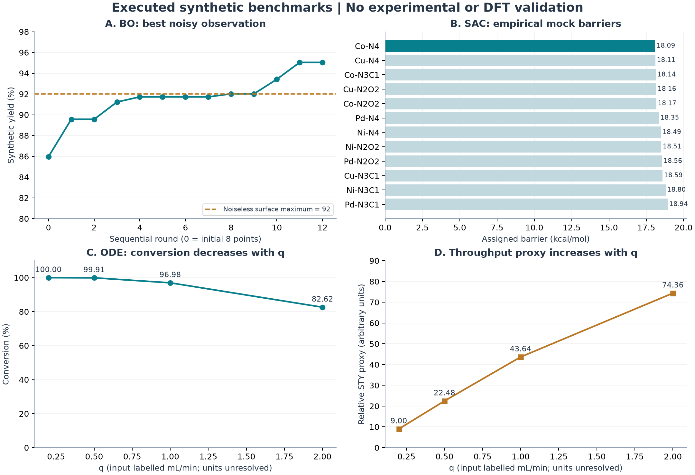
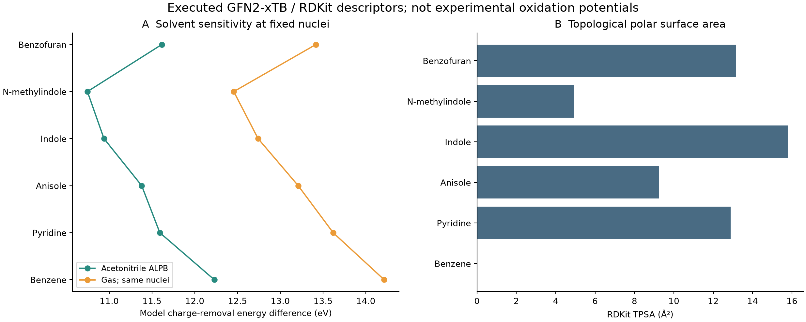

# Preliminary Technical Evaluation Report: AI-Driven Organic Electrosynthesis & Porous Catalytic Materials

**Date:** 2026-09-27 (Asia/Shanghai)  
**Intended audience:** Pan–Tang research group and undergraduate researchers, Guangxi Normal University  
**Disciplinary scope:** Organic electrochemistry, catalyst informatics, machine learning, electronic structure, and reaction engineering  
**Deliverable:** English edition of the preliminary technical report following Section 3 of the supplied specification

> **Evidence statement.** The supplied Python code was executed without scientific changes. All five modules completed, but their inputs and targets are synthetic. This extension additionally executes synthetic robustness studies and RDKit/GFN2-xTB calculations on six real molecules (36 xTB jobs), reported in Appendices D and E. DFT, transition-state searches, catalyst synthesis, voltammetry, and preparative electrolysis remain unperformed. Numerical outputs are reported faithfully; unsupported statements embedded in the code are identified rather than endorsed. Experimental procedures below are proposed validation plans, not records of experiments already conducted.

**Evidence labels:** **[L]** Literature fact; **[C]** Executed synthetic computation; **[Q]** Executed real-molecule semiempirical computation; **[A]** Independent code or arithmetic audit; **[P]** Proposed method or hypothesis; **[U]** Unknown or unverified. A successful software run is not a positive chemical result.

## 1. Executive Summary & Lab Alignment

### 1.1 Executive assessment

The five directions form a coherent research sequence: optimize a reproducible electrosynthetic transformation, learn its redox and selectivity constraints, investigate catalyst microenvironments, test new bond-forming cascades, and transfer a validated reaction to flow. The present deliverable establishes a reproducible software demonstration and a research plan. It does not establish a superior catalyst, a new annulation, predictive regioselectivity, or an industrial operating point. A suitable first project is a small, prospective Bayesian-optimization study on a reaction already reproducible in the laboratory, supported by a standardized electrochemical dataset. This priority is a planning judgment based on tractability, not a measured ranking of scientific value.

| Topic | Actual output | Supported interpretation |
|---|---|---|
| 1. Bayesian optimization | Best noisy synthetic yield **95.04474861433413%**; 8 initial + 12 sequential evaluations | An optimization loop executed; no experiment-saving comparison |
| 2. Redox and regioselectivity | Training $R^2=0.9984612448984918$; C2/C3/C5 outputs = **3.577 / 3.578 / 3.277** | In-sample fit to fabricated targets; physical voltage and major site unvalidated |
| 3. POP-SAC microenvironment | 12 mock configurations; lowest **Co–N₄, 18.09 kcal mol⁻¹** | Lowest empirical random score; not a DFT barrier or catalyst recommendation |
| 4. Heterocycle annulation | Training accuracy **1.0**; supplied feasibility value **0.892** | Synthetic classification demonstration; 0.892 is hardcoded |
| 5. Flow kinetics | At input $q=1.0$: conversion **96.98%**, proxy **43.64**; at $q=2.0$: **82.62%**, **74.36** | Conversion–throughput trade-off in an ODE; physical STY unavailable |

The most consequential corrections are: the BO maximum includes favorable noise; the redox model mixes incompatible feature scales and its C3 label is manually assigned; the SAC winner leads by only 0.02 kcal mol⁻¹ under an assigned 0.4 kcal mol⁻¹ noise scale; the annulation probability and “low risk” claim are constants; and the flow summary contradicts its own table. These issues are retained in the evidence record and addressed in the topic analyses.

**Extension reading guide.** The five main topics retain the exact original-script outputs and their audit. Follow-up calculations are recorded separately and do not overwrite the original JSON. New evidence is summarized below; methods, results, and limitations appear in Appendices D and E.

| Added calculation | Scale | Finding and boundary |
| --- | --- | --- |
| Paired BO comparison | 30 seeds × 3 methods × 20 evaluations | Recommendation regret: random 3.5557, original GP 1.3570, scaled GP 1.3208 synthetic yield points |
| Independent regression test | 5,000 test rows; 4 training sizes; 360 fits | At n=60: test R² 0.9287 for boosting, 0.9921 for linear regression |
| SAC ranking sensitivity | 100,000 draws at each of 3 noise levels | Original Co–N₄ ranks first in 5.841%; applies only to the empirical generator |
| Classifier diagnosis | 30 training seeds; 5,000 independent test rows | Balanced accuracy 0.9129 overall; 0.7276 near boundaries |
| Constrained flow scenario | 191 grid points; 10,000 parameter scenarios per flow | Best qualifying grid point: 0.55 mL/min under assumptions; unmeasured |
| Molecular descriptors | 6 molecules; 36 xTB jobs | Structures, charge differences, gas/ALPB sensitivity; no measured Eox |

### 1.2 Laboratory alignment and infrastructure boundaries

**[L]** The 2020 *Chem* paper on a porous-ligand single-atom Pd catalyst provides a direct precedent for combining pore environments, coordination chemistry, and synthetic selectivity. The publisher summary establishes that research theme; the Chinese Chemical Society profile identifies Tang and Pan among the corresponding authors. The 2024 Fe-SA@NC paper lists the Guangxi Normal University medicinal-resources laboratory affiliation and reports organic electro-oxidation, bond formation, and flow demonstrations. These are collaborative research precedents, not proof that every instrument is owned by or immediately available to one laboratory. [Porous-ligand Pd study](https://www.sciencedirect.com/science/article/pii/S2451929420303016); [Chinese Chemical Society profile](https://www.chemsoc.org.cn/member/senior/101648.html); [Fe single-atom electrosynthesis study](https://onlinelibrary.wiley.com/doi/full/10.1002/anie.202404295).

| Direction | Scientific fit | Required access | Evidence boundary |
| --- | --- | --- | --- |
| BO | Reuse reaction optimization and analytical expertise | Potentiostat or galvanostat, standardized cells, HPLC or GC | Published electrosynthesis supports domain fit; software integration is proposed |
| $E_{ox}$ and C–H selectivity | Connect medicinal scaffolds with redox descriptors | Three-electrode CV, NMR, structure registry | No internal dataset was supplied |
| POP-SAC | Coordination and pore effects on organic pathways | Polymer synthesis; ICP, XPS, BET; collaborative STEM/XAS | POP-bound sites and pyrolyzed N-doped carbon sites are distinct materials |
| Annulation | Medicinal heterocycle construction and radical chemistry | Electrolysis, chromatography, HRMS, 1D/2D NMR | Exact proposed three-component product is unspecified |
| Flow | Translate electrosynthesis into sustained production | Metering pump, flow cell, pressure/temperature monitoring, timed collection | Literature flow demonstration exists; present hardware inventory unknown |

**[U]** Instrument manufacturers, models, cell dimensions, electrode inventory, available flow channels, characterization booking access, and laboratory SOPs were not provided. Equipment named below is an explicit requirement for each plan, not a verified inventory. This report preserves the institutional wording supplied in the brief and supported by the 2024 affiliation; it does not certify a current administrative designation.

### 1.3 From retrospective explanation to prospective testing

**[L/P]** Published Bayesian reaction optimization and autonomous electrochemical mechanism studies show that data can guide the next experiment. The methodological transition is therefore to register a prediction before synthesis, acquire a discriminating measurement, update the model, and test whether it improves decisions. DFT remains useful for identifying plausible intermediates and competing transition states; AI does not remove the need to validate structures, thermodynamics, or mechanisms. The existence of cost-aware BO for flow electrosynthesis also means that “AI + electrochemistry” alone is not a novelty claim. [Shields et al., 2021](https://www.nature.com/articles/s41586-021-03213-y); [Sheng et al., 2024](https://www.nature.com/articles/s41467-024-47210-x); [Liang et al., 2025 issue](https://pubs.acs.org/doi/abs/10.1021/acselectrochem.4c00078).

**[P]** Use four evidence gates across all projects: **G0**, define a chemically identifiable system and acquire traceable records; **G1**, establish measurement repeatability and a baseline; **G2**, make prospective predictions with stated uncertainty and failure criteria; **G3**, demonstrate reproducible scientific or process value against controls. All five current modules are software demonstrations preceding G1. A journal tier is an aspiration, not an acceptance criterion; acceptance requires the underlying evidence.

## 2. Deep-Dive of the 5 Research Topics

### 2.1 Topic 1: Bayesian Optimization of Organic Electrosynthesis

#### 2.1.1 Scientific Rationale & State-of-the-Art

Anodic single-electron transfer (SET) can generate radical cations; subsequent deprotonation, bond formation, or mediator turnover determines the observed product. Cathodic processes close the charge balance and may also consume reagents or products. Current density affects interfacial flux, while electrolyte composition, solvent, electrode material, mixing, and charge passed influence resistance, transport, and reaction pathways. Consequently, isolated yield is not a function of three universally transferable coordinates. In practice, solvent is a categorical choice or a constrained mixture, not an independently tunable dielectric constant.

**[L/P]** Bayesian optimization uses a surrogate response model and an acquisition function to balance searching unfamiliar conditions with revisiting promising regions. Shields et al. demonstrated this approach in real synthesis; Liang et al. subsequently connected cost-aware multi-objective BO with flow electrosynthesis. For this laboratory, the falsifiable question is whether BO reaches a predefined, replicated yield/FE target using fewer valid experiments than a matched random or design-of-experiments baseline. Existing work supports the strategy, not a guaranteed advantage for the selected reaction. [Bayesian reaction optimization](https://www.nature.com/articles/s41586-021-03213-y); [Cost-aware flow electrosynthesis](https://pubs.acs.org/doi/abs/10.1021/acselectrochem.4c00078).

#### 2.1.2 Computational Benchmark & In-Silico Results

**[C]** The script samples 8 initial points and performs 12 UCB-guided rounds, each considering 500 random candidates. It uses a Matérn kernel with $\nu=2.5$, `alpha=0.01`, five optimizer restarts, and acquisition $a(x)=\mu(x)+1.96\sigma(x)$. The source comment claiming 30 initial points is inconsistent with the executed `size=(8,3)`. The generator is:

$$
y=\operatorname{clip}\left[92-0.25(j-16.5)^2-400(c-0.15)^2-0.08(\epsilon-37.5)^2+\eta,\ 0,99\right],\quad \eta\sim\mathcal N(0,1.5^2).
$$

| Quantity | Actual value | Meaning |
| --- | ---: | --- |
| Search interval: $j$ | 5–30 mA cm⁻² | Input label |
| Search interval: $c$ | 0.05–0.30 M | Input label |
| Search interval: $\epsilon$ | 20–60 | Dimensionless |
| Best observed yield | 95.04474861433413% | Includes noise |
| Associated $j$ | 16.438635184335304 mA cm⁻² | Synthetic candidate |
| Associated $c$ | 0.13519087233722182 M | Synthetic candidate |
| Associated $\epsilon$ | 38.71257184723887 | Does not identify a solvent |
| Noiseless value at that point [A] | 91.79370804621932% | Independent substitution |
| Observed minus noiseless value [A] | 3.251040568114803 percentage points | Favorable sampled noise |

| BO round | Best yield (%) | BO round | Best yield (%) |
| ---: | ---: | ---: | ---: |
| 1 | 89.56812847141919 | 7 | 91.72324013493359 |
| 2 | 89.56812847141919 | 8 | 92.01997177140919 |
| 3 | 91.23322569945368 | 9 | 92.01997177140919 |
| 4 | 91.72324013493359 | 10 | 93.41861536841935 |
| 5 | 91.72324013493359 | 11 | 95.04474861433413 |
| 6 | 91.72324013493359 | 12 | 95.04474861433413 |

**[A]** The noiseless surface has a maximum of 92%, so 95.04% is a noisy observation, not a superior chemical optimum. Selecting the largest noisy value introduces selection bias. The scalar length scale acts on unnormalized coordinates with very different numeric ranges; the target is also unnormalized. The observation-noise variance is 2.25 in squared percentage-point units, whereas the specified GP diagonal term is 0.01. This mismatch can distort uncertainty. The factor 1.96 does not by itself establish a calibrated 95% interval. The original script executed no repeated-seed, noise-free regret, or random-search comparison; the new 30-seed paired study is reported in Appendix D.1. [GPR parameter semantics](https://scikit-learn.org/stable/modules/generated/sklearn.gaussian_process.GaussianProcessRegressor.html).

**Additional computation.** Follow-up validation for this topic appears in Appendix D.1.

#### 2.1.3 Wet-Lab Experimental Validation Protocol

**[P]** Select one laboratory reaction with known substrate/product structures, an accessible SOP, and a calibrated analytical method. The Fe-mediated oxidative platform is a literature lead, but its exact substrate and preparation must come from the verified SOP or supporting information; the present report does not reconstruct missing recipes. First use a three-electrode cell with a glassy-carbon working electrode, Pt counter electrode, and an appropriate calibrated reference to measure substrate, product, mediator, electrolyte, and solvent responses. For preparative screening, a glassy-carbon or carbon-plate anode and Pt cathode in an undivided cell are candidate hardware; use a divided configuration if product crossover or cathodic consumption is demonstrated.

Implement the following sequence: (1) fix structure IDs, stoichiometry, concentration, temperature, electrode area/gap, stirring, atmosphere, and charge endpoint from the baseline SOP; (2) reproduce the baseline in three independent preparations and calibrate internal-standard HPLC or GC response factors; (3) define a feasible search domain from CV, conductivity, solubility, and electrode stability, allowing the model to choose only approved solvent identities; (4) generate 8 space-filling conditions, then 12 sequential candidates, matching the software evaluation budget; (5) randomize daily run order where possible, include an unchanged reference reaction in each batch, and record failures without deleting them; (6) isolate the candidate product, verify it by NMR and MS, and repeat promising and reference conditions independently before comparing their means.

Record conversion, assay yield, isolated yield, selectivity, Faradaic efficiency $\mathrm{FE}=n_eFn_P/Q_{\mathrm{charge}}$, and energy per product mass. Report FE only after establishing the product stoichiometry and electron requirement $n_e$; log $Q_{\mathrm{charge}}=\int I\,dt$ instead of guessing it from nominal current. A proposed success criterion is a predeclared improvement larger than analytical and between-run variability, reproduced across days. A numerical improvement target should be chosen after baseline variance is known; none is an achieved result here.

#### 2.1.4 Risk Assessment & Mitigation Strategy

| Risk | Diagnostic and response |
| --- | --- |
| Electrode fouling | Track cell voltage and before/after CV; standardize cleaning, record reuse count, and treat electrode batch as metadata |
| Electrolyte precipitation or high resistance | Check full-mixture solubility and conductivity at operating temperature; exclude infeasible combinations before acquisition |
| Optimizer exploits assay noise | Estimate noise from independent preparations; replicate incumbents; use standardized targets and a justified noise model |
| Apparent yield gain caused by extra charge/time | Compare matched charge or explicitly include charge, time, FE, and energy as objectives |
| No demonstrated BO advantage | Preserve a matched random/DoE baseline and report a negative result if the advantage is absent |

### 2.2 Topic 2: C–H Regioselectivity and Oxidation-Potential Modeling

#### 2.2.1 Scientific Rationale & State-of-the-Art

Oxidation potential describes electron removal from a specified chemical species under defined conditions. Regioselectivity concerns competing bond-forming or bond-breaking pathways within that species. They are related but distinct targets. SET, proton-coupled electron transfer, hydrogen-atom transfer (HAT), radical addition, deprotonation, and catalyst binding can each influence the product ratio. A favorable molecular oxidation potential does not uniquely identify a reactive carbon atom. Conventional electrochemical functionalization should not automatically be labeled metal-mediated C–H activation unless that mechanism is established.

**[L/P]** The OxPot study is a recent example connecting electronic descriptors and oxidation-potential prediction, but its computed dataset and aqueous context are not interchangeable with measured nonaqueous CV labels. A credible laboratory model should first predict a consistently defined molecular observable, then use separate site-specific descriptors and experimental product ratios to address selectivity. The present question is whether descriptors add predictive value on unseen scaffolds relative to a simple linear or nearest-neighbor baseline. [OxPot research article](https://pubs.acs.org/doi/10.1021/acs.jcim.5c00159).

#### 2.2.2 Computational Benchmark & In-Silico Results

**[C]** Sixty four-dimensional standard-normal vectors were generated; no molecular structures or quantum outputs were read. Although comments mention 50 fragments and “experimental” potentials, the executed target is the synthetic expression below. A 50-estimator gradient-boosting regressor is fitted and scored on the same 60 rows.

$$
y_{ox}=-0.85X_0+0.30X_2+1.65+\xi,\qquad \xi\sim\mathcal N(0,0.08^2).
$$

| Metric | Raw value | Interpretation |
| --- | ---: | --- |
| `model_r2` | 0.9984612448984918 | Training $R^2$, not test $R^2$ |
| HOMO feature importance | 0.9064911954192894 | Tree impurity-based importance |
| Radical stability importance | 0.009309994890810476 | Not a physical coefficient |
| Local electrophilicity importance | 0.08021380367633771 | Target formula already includes this variable |
| Buried-volume importance | 0.00398500601356262 | Does not prove sterics are chemically irrelevant |

| Mock site | Input vector | Output labelled $E_{ox}$ vs SCE (V) |
| --- | --- | ---: |
| C2 | [−5.8, 1.42, 0.88, 22.4] | 3.577 |
| C3 | [−5.8, 0.95, 0.54, 18.1] | 3.578 |
| C5 | [−5.8, 0.32, 0.12, 35.8] | 3.277 |

**[A]** The actual training range is −2.0182 to 2.7068 for the first feature and −2.1412 to 2.4940 for the fourth. All three target vectors lie outside both ranges. Standard-normal training numbers were never calibrated into HOMO energies or buried-volume percentages, so the apparent physical feature names are misleading. The outputs are mathematically defined model responses, not defensible voltages. In addition, `predicted_regioselective_major_site = "C3"` is a literal string; it is not inferred from the predictions. Even the inappropriate “lowest potential wins” rule would choose C5, not C3. The 1 mV C2/C3 output difference has no validated significance.

The high training $R^2$ mainly shows that the model can fit its constructed target. It does not measure scaffold transfer, uncertainty calibration, or experimental redox accuracy. The scikit-learn `score(X, y)` method evaluates the data supplied to it; in this script those data are the training set. [GradientBoostingRegressor documentation](https://scikit-learn.org/stable/modules/generated/sklearn.ensemble.GradientBoostingRegressor.html).

**Additional computation.** Follow-up validation for this topic appears in Appendix D.2. Real-molecule descriptors are in Appendix E.

#### 2.2.3 Wet-Lab Experimental Validation Protocol

**[P]** Build a paired dataset: a molecular CV table and a reaction/site-selectivity table. Assign each substrate a canonical isomeric SMILES, explicit atom map, charge, protonation state, and batch identity. A planning pilot of 20–30 accessible compounds is appropriate for checking workflow and repeatability, not for claiming broad generalization. Use a glassy-carbon disk working electrode, Pt counter electrode, and a nonaqueous-compatible reference; measure a ferrocene/ferrocenium reference under the same medium and report the actual reference protocol. If SCE is used, record junction and solvent conditions; do not apply a universal conversion across solvents.

A proposed analytical starting screen is 1 mM substrate in a soluble, blank-tested medium with 0.10 M supporting electrolyte and scan rates of 50, 100, and 200 mV s⁻¹. These are newly proposed measurement settings, not parameters recovered from the supplied script or the Pan–Tang SOP. Adjust them if current range, solubility, or blank stability is unsuitable. Obtain solvent/electrolyte blanks, independent solution replicates, and repeated scans to detect adsorption or decomposition. Distinguish reversible $E_{1/2}$, irreversible anodic peak potential $E_{pa}$, and onset potential; never pool them as interchangeable labels.

Obtain regioisomer ratios from a defined preparative transformation at matched conversion, using response-corrected HPLC/GC where separation is adequate and NMR/2D NMR for structural assignment. A tentative descriptor pipeline is RDKit structure checking, conformer generation, inexpensive geometry prescreening, and a consistently defined DFT/solvation protocol for selected structures. Compute molecular redox quantities separately from local spin density, HAT energetics, and competing transition-state free energies. Use scaffold-grouped and chronological holdouts, keep preprocessing within training folds, and report MAE/RMSE in volts plus calibration. Validate site ranking against experimental ratios, not against the hardcoded C3 string.

#### 2.2.4 Risk Assessment & Mitigation Strategy

| Risk | Diagnostic and response |
| --- | --- |
| Incompatible reference scales | Retain solvent, reference, standard, scan rate and observable type; train separate or explicitly corrected models |
| Scaffold leakage and small data | Group related molecules and repeats together; compare simple baselines; report wide uncertainty when warranted |
| Out-of-domain query | Reject or flag inconsistent units and unfamiliar chemical classes instead of issuing confident voltages |
| Nonconvergent TS search | Check atom mapping, conformers, charge/spin and reaction coordinate; use constrained scans and multiple initial paths; require a relevant imaginary mode and connecting IRC when applicable |
| Wrong selectivity mechanism | Combine time courses, isotope/competition experiments and intermediate evidence; treat radical traps and KIE as supporting, not individually decisive |

### 2.3 Topic 3: Coordination Microenvironments of POP-SAC Catalysts

#### 2.3.1 Scientific Rationale & State-of-the-Art

A supported single-metal site interacts with coordinating atoms, nearby functional groups, pore-confined reactants, and the electrode/electrolyte interface. Ligand donation, local charge, spin state, accessibility, and adsorption geometry can change the relative energies of competing pathways. A site formula such as M–N₄ does not uniquely specify a catalyst: different scaffolds, axial ligands, protonation states, and operating potentials can produce different active species. Coordination bonding is therefore a mechanistic design variable, not a categorical label sufficient to predict activity.

**[L/P]** The porous-ligand Pd work provides an organic-synthesis precedent for exploiting local environment and reaction pathways. The Fe-SA@NC study provides a separate precedent for single-atom redox mediation. A defensible new question is whether a structurally verified change in the first or second coordination sphere changes organic selectivity at comparable conversion, independently of metal loading and transport. Neither paper establishes the activity ordering of the twelve mock sites below. An intact POP coordination pocket and a pyrolysis-derived carbon site must be modeled and characterized as distinct material classes. [Pd porous-ligand research](https://www.sciencedirect.com/science/article/pii/S2451929420303016); [Fe redox-mediator research](https://onlinelibrary.wiley.com/doi/full/10.1002/anie.202404295).

#### 2.3.2 Computational Benchmark & In-Silico Results

**[C]** The executed grid contains four metals (Cu, Co, Ni, Pd) and three coordination labels (N₄, N₃C₁, N₂O₂), giving twelve rows. Zn and N₂C₂ appear only in comments and are not screened. Each “barrier” is an assigned empirical value:

$$
B=18.5-0.8(d-8)^2+0.3(\chi_{coord}-11.0)^2+\zeta,\qquad \zeta\sim\mathcal N(0,0.4^2).
$$

Here $d$ is assigned as 9, 7, 8, and 8 for Cu, Co, Ni, and Pd, and $\chi_{coord}$ as 12.1, 10.8, and 11.5 for N₄, N₃C₁, and N₂O₂. These are uncalibrated encodings. The $d$ values do not establish oxidation states or actual orbital occupations; $\chi_{coord}$ is not a validated physical electronegativity descriptor.

| Metal | Coordination | Mock barrier (kcal mol⁻¹) |
| --- | --- | ---: |
| Cu | N₄ | 18.11 |
| Cu | N₃C₁ | 18.59 |
| Cu | N₂O₂ | 18.16 |
| Co | N₄ | **18.09** |
| Co | N₃C₁ | 18.14 |
| Co | N₂O₂ | 18.17 |
| Ni | N₄ | 18.49 |
| Ni | N₃C₁ | 18.80 |
| Ni | N₂O₂ | 18.51 |
| Pd | N₄ | 18.35 |
| Pd | N₃C₁ | 18.94 |
| Pd | N₂O₂ | 18.56 |

**[A]** The JSON selects Co–N₄ at 18.09 kcal mol⁻¹, followed by Cu–N₄ at 18.11. The 0.02 kcal mol⁻¹ separation is twenty times smaller than the generator's 0.4 kcal mol⁻¹ standard deviation. It is not a confidence interval or a reproducible ranking. If, solely for illustration, this difference represented an activation free-energy difference with identical Eyring prefactors at 298 K, its rate ratio would be about 1.034. That conditional arithmetic is not a rate prediction. Cu and Co have identical noiseless metal terms, as do Ni and Pd; differences within those pairs arise from sampled noise at a fixed coordination label. No geometry, adsorption energy, transition state, solvent, potential, or turnover frequency was computed.

**Additional computation.** Follow-up validation for this topic appears in Appendix D.3.

#### 2.3.3 Wet-Lab Experimental Validation Protocol

**[P]** Start from one accessible, literature- or laboratory-established support chemistry. Define two or three realizable site environments on comparable supports; do not attempt to synthesize all twelve labels merely because the toy grid contains them. For an intact POP route, document the monomer identity, polymerization linkage, metalation chemistry, wash sequence, drying history, and porosity. For a pyrolyzed route, additionally document atmosphere and thermal history and avoid describing the final carbon as an unchanged polymer. Precursor ratios, temperature programs, and yields remain `unverified` until an actual SOP is selected.

Prepare independent catalyst batches and determine bulk metal content by ICP-OES/ICP-MS, bonding trends by XPS, porosity by gas sorption, and dispersion by HAADF-STEM where accessible. Use XANES/EXAFS and fitting uncertainties to examine the proposed coordination environment; a bright STEM spot or absence of metal diffraction peaks alone is insufficient. Determine electrochemical behavior in a three-electrode cell, then test the same baseline organic reaction with standardized catalyst loading, electrode film preparation, binder, exposed area, electrolyte, and charge. Quantify conversion and selectivity by calibrated HPLC/GC and confirm products by NMR/MS.

Include bare support, metal-free modified support, a relevant soluble metal species, and—where chemically comparable—a nanoparticle control. Analyze the electrolyte for leached metal, test separated filtrates cautiously, and characterize the recovered catalyst. Hot filtration or poisoning alone cannot establish heterogeneous single-atom catalysis. Report performance per geometric area and catalyst mass; report site-normalized TOF only if accessible active-site counts are defensible. Advance a microenvironment claim only when composition, stability, and selectivity changes survive these controls and independent batches.

#### 2.3.4 Risk Assessment & Mitigation Strategy

| Risk | Diagnostic and response |
| --- | --- |
| Aggregation or leaching | Compare before/after microscopy, spectroscopy, and solution ICP; avoid assigning activity to the starting structure automatically |
| Poor POP conductivity or pore access | Measure resistance, vary film thickness and mixing, and compare compatible conductive supports |
| Confounded site comparison | Match loading, porosity and preparation as closely as possible; explicitly model remaining differences |
| Ambiguous spin states or TS failure | Explore plausible charge/spin states and multiple pathways; check frequencies and connections; label unconverged cases rather than interpolating barriers |
| Lack of operando evidence | Present ex situ structure as such; use potential-dependent/operando characterization through collaboration when feasible |

### 2.4 Topic 4: Feasibility of Medicinal-Heterocycle Annulation

#### 2.4.1 Scientific Rationale & State-of-the-Art

Radical cascades can join several bond-forming steps after electrochemical initiation. Thiol oxidation may access sulfur-centered radicals; addition to an isocyanide can generate an imidoyl-radical-type intermediate, while indole-derived partners can offer competing trapping sites. These are plausible elementary motifs, not proof that arbitrary indole, isocyanide, and thiol molecules will form a ring. Product topology, tether length, atom balance, radical polarity, cyclization geometry, and termination chemistry must be specified before an annulation prediction is chemically meaningful.

**[L/P]** Zhang et al. reported electrochemical cyclization of isocyanides with thiols or diselenides to chalcogen-containing benzothiazoles. This is an adjacent literature precedent, not validation of the script's unspecified three-component indole reaction. The prospective question is whether one fully atom-mapped three-component design yields a structurally proven annulation product rather than simple coupling, disulfide formation, or decomposition. Structural feasibility must precede classifier optimization. [Original cyclization study](https://advanced.onlinelibrary.wiley.com/doi/10.1002/adsc.202400448).

#### 2.4.2 Computational Benchmark & In-Silico Results

**[C]** The script draws 80 four-feature rows from a uniform distribution over 0.1–2.5 and assigns labels using the deterministic rule below. A 30-tree random forest is fitted and evaluated on the same rows. No reaction structure, atom mapping, product, CV measurement, or literature outcome is used.

$$
y=\mathbf1[X_0<1.2\ \land\ X_1<1.8\ \land\ X_2>0.8].
$$

| Output | Value | Evidence status |
| --- | --- | --- |
| Training accuracy | 1.0 | In-sample fit |
| Positive / negative labels [A] | 18 / 62 | Regenerated directly from the source rule |
| Target label | `3-Component Electrochemical Annulation of Indole + Isocyanide + Thiol` | A name without molecular identities |
| `feasibility_score` | 0.892 | Literal constant; no `predict_proba` call |
| `predicted_side_reaction_risk` | `Low (Anodic overoxidation prevented by potential-controlled electrolysis)` | Literal constant |

**[A]** Accuracy 1.0 only shows that the forest reproduced the artificial rule on its training data. The fourth feature, labelled dipole moment, does not enter the label rule at all. The 0.892 value is neither a calibrated 89.2% success probability nor a yield prediction. The risk statement is not supported by a potential-dependent kinetic or electrochemical model. Controlled potential can help limit some oxidation pathways, but cannot guarantee product stability when oxidation windows overlap, surface conditions change, or follow-up chemistry occurs.

**Additional computation.** Follow-up validation for this topic appears in Appendix D.4.

#### 2.4.3 Wet-Lab Experimental Validation Protocol

**[P]** Begin with a structure sheet, not an electrolysis recipe: identify each reactant by structure and atom numbering; draw the proposed product; identify every new bond; balance atoms, protons, and electrons; and check whether a chemically reasonable cyclization path exists. The supplied target lacks this information, so a validated synthesis SOP cannot be derived from it. A literature two-component cyclization can serve as a separate positive control, with its own verified procedure, but must not be relabeled as the requested three-component discovery.

After a viable structural design is selected, measure individual and mixed-component CV responses in a glassy-carbon/Pt/reference-electrode setup. Use a potentiostat and an initially undivided preparative cell when compatible, comparing a divided cell if counter-electrode reactions interfere. A proposed discovery screen starts at 0.05–0.10 mmol of the limiting reactant, with concentration and co-reactant ratios fixed from the selected design; these scale limits are planning choices, not validated conditions. Choose solvent, supporting electrolyte, and potential from the measured window and solubility, rather than from 0.892 or the BO dielectric coordinate.

Run the complete mixture, no-current control, and each missing-component control. Collect time-resolved aliquots and compare charge-dependent conversion and product profiles using HPLC/LC-MS or GC-MS as appropriate. Check for disulfides, open-chain adducts, indole oligomers, and isocyanide-derived side products. Isolate any candidate annulation product and establish connectivity using HRMS and 1D/2D NMR; exact mass alone cannot distinguish isomers. Once a product is established, repeat it independently and perform a small substrate matrix. Mechanistic radical trapping, isotopic labeling, and competition studies follow product confirmation, with controls for direct electrochemical effects of the probe.

Define a positive classification label before training—for example, a specified connectivity confirmed above a predeclared assay threshold under stated conditions. Retain failed reactions and analytical detection limits. Evaluate on new substrate combinations with precision, recall, PR-AUC, and probability calibration rather than accuracy alone. Stop the proposed annulation branch if no plausible ring-forming topology can be drawn, or if repeated experiments produce only characterized noncyclic products under the investigated domain; that negative result is useful data.

#### 2.4.4 Risk Assessment & Mitigation Strategy

| Risk | Diagnostic and response |
| --- | --- |
| Undefined product topology | Require an atom-mapped scheme and plausible elementary sequence before prioritizing experiments |
| Thiol dimerization and electrode passivation | Quantify disulfide, inspect current decay and electrode surfaces, and compare controlled addition only if the mechanism supports it |
| Product overoxidation | Measure product CV, run product-stability controls, and assess charge/time endpoints or rapid removal |
| False structure assignment | Combine separation, MS, and 2D NMR; report ambiguous isomers as unresolved |
| Misleading classifier confidence | Replace fabricated labels with traceable outcomes and calibrated holdout predictions |

### 2.5 Topic 5: Flow Electrochemistry, Kinetics, and Space-Time Yield

#### 2.5.1 Scientific Rationale & State-of-the-Art

Continuous electrolysis couples residence time, interfacial charge transfer, mass transport, reactor geometry, and product stability. Increasing flow may enhance delivery to the electrode while reducing residence time; a high single-pass conversion need not maximize product output. For an ideal, well-defined one-electron interfacial step, the Butler–Volmer relation illustrates potential dependence:

$$
j=j_0\left[\exp\left(\frac{\alpha_a F\eta}{RT}\right)-\exp\left(-\frac{\alpha_c F\eta}{RT}\right)\right].
$$

Here $j_0$ is exchange current density, $\eta$ overpotential, $\alpha_a$ and $\alpha_c$ transfer coefficients, $F$ the Faraday constant, and $T$ temperature. Real organic cascades may require a more detailed mechanism. Under a simple transport limit, $j_{lim}=n_eFk_mC_b$ with consistent SI units. Under first-order assumptions, compatible kinetic and transport coefficients in m s⁻¹ can be combined as $k_{eff}=a/(1/k_{ct}+1/k_m)$, where $a$ is electrode area per reactor volume. These equations require calibration; none is implemented by the supplied script.

**[L/P]** The 2026 continuous oxime study demonstrates the importance of electrolyte routing and charge–mass balance in a specific reaction system. It supports examining reactor and flow variables, but its materials, conversion, efficiency, and operating parameters cannot be transferred to the present undefined organic transformation. The falsifiable engineering question is whether flow operation increases verified product productivity while maintaining selectivity, FE, and durability relative to a matched batch process. [Continuous oxime electrosynthesis](https://www.nature.com/articles/s41467-026-68738-0).

#### 2.5.2 Computational Benchmark & In-Silico Results

**[C]** The script integrates the following scalar ODE over 50 points on a normalized coordinate $z\in[0,1]$, with $C(0)=1$ and the numeric constant $k_{app}=3.5$:

$$
\frac{dC}{dz}=-\frac{3.5}{q}C,\qquad X_{\%}=100[1-C(1)],\qquad S_{proxy}=0.45qX_{\%}.
$$

| Input flow label (mL min⁻¹) | JSON conversion (%) | JSON relative STY proxy | Analytical conversion (%) [A] |
| ---: | ---: | ---: | ---: |
| 0.2 | 100.00 | 9.00 | 99.9999974890 |
| 0.5 | 99.91 | 22.48 | 99.9088118034 |
| 1.0 | 96.98 | 43.64 | 96.9802616578 |
| 2.0 | 82.62 | 74.36 | 82.6226056550 |

**[A]** Treating the equation as a numerical dimensionless surrogate gives $C(1)=\exp(-3.5/q)$. Independently evaluating this solution agrees with numerical integration within $2.85\times10^{-7}$ percentage points across the four settings. The 100.00% entry is rounding, not exact total conversion. The JSON's statement `Flow rate 1.0 mL/min gives balanced conversion (83.2%) and highest STY` is inconsistent: its 1.0 setting gives 96.98%, and the largest tested proxy is 74.36 at 2.0. The 83.2% value matches none of the four reported conversions.

The source labels $k_{app}$ as s⁻¹ and $q$ as mL min⁻¹, while $z$ is dimensionless. Thus $k_{app}/q$ cannot be the required dimensionless coefficient without reactor volume and time-unit conversion. A physically consistent ideal PFR equation is instead

$$
\frac{dC_A}{d\zeta}=-\mathrm{Da}\,C_A,\qquad \mathrm{Da}=k_{eff}\tau,\qquad \tau=\frac{V_R}{q_v},\qquad X=1-e^{-\mathrm{Da}},
$$

where $q_v$ and $V_R$ use compatible volume units and $\tau$ uses the time unit inverse to $k_{eff}$. This is a proposed correction of the physical model, not a retrospective reassignment of units to the original results. No reactor volume is supplied, and the code has no Butler–Volmer law, separate mass-transfer coefficient, electrode area, current, potential, temperature, selectivity, or deactivation term.

The proxy equals $45q(1-e^{-3.5/q})$ and increases monotonically for positive $q$, approaching 157.5 in its arbitrary units. It therefore does not identify a finite throughput optimum. All four points trade decreasing conversion against increasing proxy; there is no unique optimum without a constraint or objective weighting. For illustration only, requiring at least 95% conversion would select 1.0 as the largest-proxy feasible point on this four-point grid. That is a newly imposed constraint, not a conclusion of the original code.

**Additional computation.** Follow-up validation for this topic appears in Appendix D.5.

#### 2.5.3 Wet-Lab Experimental Validation Protocol

**[P]** Transfer a confirmed batch reaction, not an unverified annulation, to a compatible flow cell. Record electrode materials, geometric area, spacing, channel geometry, wetted volume, seals, separator, pump type, and temperature. A carbon or glassy-carbon anode and Pt or another validated cathode are candidate starting materials, not universally optimal choices. Verify actual flow gravimetrically, determine accessible volume, and measure residence-time distribution with an inert tracer where feasible. Nominal volume/flow alone may misrepresent residence time in porous electrodes or gas-evolving channels.

Use the four nominal flow settings only if compatible with the actual pump, cell, reaction, and pressure limits. At each setting record current, electrode potential where measured, cell voltage, temperature, pressure, charge, and inlet/outlet composition. Wait for a stable outlet profile based on consecutive samples rather than a fixed elapsed time alone; a starting planning rule is to sample after several nominal residence times and confirm stability analytically. Collect timed fractions, quantify starting material and products by calibrated HPLC/GC, and validate selected samples by NMR. Include repeated flow settings in randomized order to detect time-dependent catalyst or electrode changes.

For a single-pass, steady-state system with $q_v$ in L h⁻¹, product concentration $C_P$ in mol L⁻¹, product molar mass $M_P$ in g mol⁻¹, and reactor volume $V_R$ in L:

$$
\dot m_P=q_vC_PM_P,\qquad \mathrm{STY}=\frac{q_vC_PM_P}{V_R}\quad[\mathrm{g\,L^{-1}\,h^{-1}}].
$$

For a simple 1:1 transformation without product in the feed, $C_P=C_{A,0}XS$ if volume change is negligible, with $X$ and selectivity $S$ expressed as fractions. Report isolated-product productivity separately when recovery is incomplete. At steady state, $\mathrm{FE}=n_eF\dot n_P/I$ uses $\dot n_P$ in mol s⁻¹. Electrical energy intensity is $\int U_{cell}I\,dt/m_P$, with explicit unit conversion and a stated boundary; pumps, cooling, separation, and solvent recovery are additional process demands. True STY, FE, and energy intensity are all `unavailable` for the present JSON.

Fit kinetic/transport parameters only after checking mass balance, steady state, and identifiability. Reserve at least one flow/current condition for prediction rather than fitting, and compare a simple residence-time model against the more elaborate model. Demonstrating useful scale-up requires product quality, sustained operation, electrode life, and separation demand, not merely a high conversion in a short run.

#### 2.5.4 Risk Assessment & Mitigation Strategy

| Risk | Diagnostic and response |
| --- | --- |
| Bubbles, bypassing, or maldistribution | Inspect pressure and residence-time behavior; revise orientation/channel design and gas management as needed |
| Precipitation and channel blocking | Test feed/product solubility, monitor pressure, and define a shutdown threshold from equipment limits |
| Fouling or catalyst detachment | Track voltage, output, and metal/particle carryover over time; compare recovered electrodes |
| Current–feed mismatch | Report charge per mole of feed and FE; vary current and flow jointly when testing transport claims |
| Misleading STY or green claim | State reactor-volume and recovery definitions; include energy and waste boundaries before process comparison |

### 2.6 Integrated evidence view



**Figure 1.** A: best noisy BO observations, including an independently regenerated initial baseline; the dashed line is the noiseless generator maximum. B: all twelve empirical SAC scores. C–D: conversion and the relative throughput proxy plotted separately to avoid implying shared physical units. All plots represent synthetic outputs; lines between discrete flow points are visual guides. Plotting and independent arithmetic are reproducible using `audit_benchmarks.py`.

## 3. Undergraduate 4-Stage Action Roadmap

**[P]** The stages below are a proposed progression, not a claim that four years guarantee a paper or admission. Progress should follow demonstrated competence and evidence gates. The five topics are options within a connected program; an undergraduate should normally complete one coherent project rather than run five unsupported projects simultaneously. Laboratory operations require training and the relevant supervisor's approved procedures.

### 3.1 Phase 1 — Freshman: Build reproducible foundations

Learn TLC interpretation, column chromatography, accurate weighing and solution preparation, extraction, drying, and laboratory notebook practice. Under supervision, identify anode/cathode roles, assemble an undivided and a divided cell, measure exposed electrode area, distinguish galvanostatic from potentiostatic operation, and export current/voltage/time data. Practice HPLC/GC quantification with an internal standard and interpret basic NMR spectra before treating a chromatographic peak as a product.

In parallel, learn Python arrays, tables, plotting, units, errors, Git, and reproducible scripts. Use RDKit for structure validation and elementary descriptors. Study molecular orbitals, charge/spin, conformers, optimization, frequency analysis, solvation, and the difference between electronic energy and Gibbs free energy. Run only small, interpretable quantum exercises in an available environment; an installed program is not proof of a correct method. Reproduce the supplied benchmark and explain each of its five limitations without relying on the flattering status strings.

**Deliverables and gate.** Produce one complete experimental record, one calibrated analytical exercise, one versioned data-cleaning script, and a short bilingual explanation of the benchmark audit. Advance when another student can reproduce the computational output and a trained supervisor accepts the laboratory-record quality.

### 3.2 Phase 2 — Sophomore: Build the internal dataset and first tool

Curate one reaction family or one consistently measured redox series. Record successful, failed, and repeated experiments with immutable raw files and explicit units. Keep identifiers for structure, condition, batch, operator, instrument, and analysis method. A planning target of 50–100 traceable reaction records may help size a first project, but scientific adequacy depends on chemical diversity, replication, and the intended prediction task rather than a row count.

Deploy either a BO candidate generator or an oxidation-potential predictor for laboratory members. A BO tool should display candidate conditions, domain restrictions, uncertainty, and whether a recommendation is exploratory. An $E_{ox}$ tool should display the predicted observable/reference, applicability domain, and uncertainty and reject malformed structures or incompatible units. Begin with retrospective replay, then a small prospective campaign; keep a simple baseline and prevent leakage across related structures or repeated measurements.

**Deliverables and gate.** Deliver a data dictionary, frozen dataset version, baseline comparison, usable local interface, and a record of at least one prospective evaluation cycle. Advance when a laboratory user can trace an output to its inputs and when performance on held-out or prospective data is stated honestly, including a negative result.

### 3.3 Phase 3 — Junior: Lead a focused wet–dry research project

Select one falsifiable claim: fewer experiments to reach a reproducible target; transferable redox prediction; a coordination change that alters selectivity; a structurally proven annulation; or improved flow productivity under constraints. Perform a focused novelty search at project selection and again before writing. Define the controls, required sample diversity, uncertainty analysis, and stopping rules before spending heavily on catalyst synthesis or transition-state calculations. Request shared computing or characterization access only for calculations or measurements that can distinguish the central hypotheses.

Prepare an application for the National Undergraduate Innovation and Entrepreneurship Training Program, subject to the university's current call, eligibility, budget, and supervisor agreement. Frame the proposal around a measurable problem, accessible resources, milestone evidence, and a contingency route. The program name does not imply an award has been obtained. Draft the paper while collecting data: methods from actual records, results from verified analyses, discussion separating observation from explanation, and supporting information sufficient for reproduction.

**Deliverables and gate.** Deliver a prospective prediction register, controlled experimental dataset, documented computational models, independent repetitions, and a manuscript draft or a well-supported negative finding. Advance when the central claim survives the predeclared comparison; if it does not, narrow or reject the claim instead of changing the acceptance criterion after seeing the result.

### 3.4 Phase 4 — Senior: Defend the evidence and prepare for graduate research

Complete the graduation thesis with a reproducible computational archive, instrument raw files, structural assignments, uncertainty analysis, and a clear account of failed experiments. Re-run the key analysis from a frozen environment, verify that figures agree with tables and raw data, and have another group member reproduce at least one important computational or experimental result. In the defense, state exactly which claims are measured, modeled, inferred, or unresolved.

For applications to strong graduate programs, present a concise portfolio: the scientific question, personal contribution, evidence chain, code/data where shareable, and an honest account of limitations. Select prospective supervisors by research fit and training quality, not only journal branding. Publication, recommendation letters, admission, and funding depend on actual outcomes and current institutional requirements; this roadmap guarantees none of them.

**Deliverables and gate.** Deliver the defended thesis, final data/code archive, transfer notes for the laboratory, and a graduate-research statement grounded in completed work. Completion means the evidence can be inspected and the project can be continued without relying on undocumented personal knowledge.

### 3.5 Recommended project sequencing and stopping rules

| Stage | Primary focus | Evidence to unlock the next step | Stop or redirect when |
| --- | --- | --- | --- |
| Foundations | Measurement and records | Reproducible baseline and analytical calibration | Product identity or quantification unresolved |
| First AI tool | Topic 1 or a molecular part of Topic 2 | Prospective comparison and traceable labels | Apparent gain vanishes after replication |
| Mechanistic depth | Topic 2, 3, or 4 according to evidence | Structural, kinetic, or selectivity evidence distinguishing hypotheses | Site/product identity remains ambiguous |
| Process transfer | Topic 5 | Stable product, mass balance, dimensional model, measured productivity | Fouling, separation demand, or energy erases the benefit |

## Appendix A. Execution, Provenance, and Reproduction

### A.1 Environment verification

**[C]** Required libraries were successfully imported from the existing chemistry workbench. No package installation was necessary. RDKit was available but was not used by the supplied benchmark. The original code was extracted from the sole Python block in the attachment; only line endings and a terminal newline were normalized. The original script's statistical and physical problems were not silently repaired. All five `status` values in the resulting JSON were `success`, which reports program completion only.

| Item | Observed value |
| --- | --- |
| Operating system | Windows 11, build 22631 |
| Python | 3.12.14 |
| NumPy | 2.4.6 |
| SciPy | 1.18.0 |
| pandas | 2.3.3 |
| scikit-learn | 1.9.0 |
| RDKit, optional | 2026.03.5 |
| Matplotlib, audit figures | 3.11.1 |
| Execution start | 2026-09-26 16:06:40 UTC = 2026-09-27 00:06:40 Asia/Shanghai |
| Original benchmark subprocess | Exit code 0; elapsed 3.0529696000157855 s |
| Source seeds | Topic 1: 42; Topic 2: 101; Topic 3: 88; Topic 4: 7; Topic 5: deterministic |
| stderr | Empty in this run |

Empty stderr and exit code 0 do not validate the chemistry or prove calibrated convergence. The online scikit-learn pages consulted identify a newer patch documentation version; the actual executed version is the recorded 1.9.0. Floating-point, optimization, and random-number behavior can vary across environments, so preserve this environment record alongside the outputs.

### A.2 Provenance hashes

```text
Supplied attachment SHA-256:
4c867bbbc143a694de146fc6caf665eae4e7a73dc9fd0079a58b6e408ef0e219

Extracted simulate_all_topics.py SHA-256:
41caab8993548814500ff447aa881bf04e62581a418f160727d7e78a3e1ef389

Original benchmark_results.json SHA-256:
1775377f34aecba1dbb5fe17fe0b9a6625b6de3a81a31f66247e694317f2ea41
```

The full-precision machine-readable result remains the numerical source of record. Tables may round values for legibility where explicitly indicated. Additional values, such as the noise-free BO response, feature ranges, label counts, and analytical ODE comparison, come from the separate audit and carry [A]. Neither the audit nor report generation overwrites the original JSON.

### A.3 Repository layout and reproduction

The root [README](../README.md) contains environment, computation, and test commands. Original source, outputs, and audit are in `data/original/`; new scripts are in `scripts/`; repeated-run results are in `results/extended/`; molecular coordinates, logs, charges, and job status are in `results/molecular/`. See `provenance/environment_execution_public.json` for environment evidence and `provenance/SHA256SUMS.txt` for integrity. Separate reports are in `reports/`, with images in `reports/figures/`.

Run from the repository root. New reproduction outputs go to ignored `work/`. First activate an environment containing the dependencies and xTB; Conda activation is required for correct DLL loading on Windows.

```text
python scripts/extended_benchmarks.py --output work/reproduction/extended --seeds 30
python scripts/molecular_descriptors.py --output work/reproduction/molecular --timeout 180
python -m unittest discover -s tests -v
python scripts/validate_release.py
```

The original JSON is preserved; see the README for rerunning its script. New environments can produce numerical or optimization differences: compare scientific quantities and tolerances rather than expecting identical timestamps or every byte.

## Appendix B. Data Dictionary and Acceptance Record

### B.1 Minimum experimental record

**[P]** A future laboratory dataset should store each experiment once and link measurements through stable identifiers. Keep raw observations, processed measurements, model predictions, and inferred mechanisms in separate fields. A failed synthesis is an observation; an instrument failure is a different status and must not automatically become zero yield.

| Field group | Required contents |
| --- | --- |
| Identity | Run ID, date, operator, SOP version, structure IDs/SMILES, atom maps, batch IDs |
| Composition | Reagent amount/equivalents, catalyst loading and basis, solvent fractions, substrate and electrolyte concentrations |
| Electrochemistry | Electrode material/area/gap, cell type, reference scale, current/potential/time traces, charge, temperature, stirring |
| Flow | Actual flow, wetted volume, residence-time characterization, pressure, steady-state criterion, collection interval |
| Analytics | Instrument method, calibration, internal standard, response factors, raw chromatograms/spectra, detection limits |
| Outcomes | Conversion, assay and isolated yields separately, selectivity, FE if defined, energy boundary, uncertainty, replicates |
| Computation | Structure, conformer, charge/spin, model/method/version, solvent, convergence, units, train/test membership |
| Exceptions | Precipitation, fouling, instrument failure, unassigned products, exclusion reason without deleting raw data |

### B.2 What was and was not validated

| Item | Status | Scope |
| --- | --- | --- |
| Python dependency imports | Completed | Actual local imports |
| Five original benchmark modules | Completed | Unchanged source logic; exit 0 |
| Original JSON integrity | Checked | SHA-256 before/after audit |
| Flow arithmetic | Checked | Independent exponential solution |
| Script/report contradictions | Identified and explained | Hardcoded labels, training scores, feature mismatch, dimensional error |
| Figure rendering | Visually inspected | Labels, axes, values, clipping |
| Report architecture and completeness | Checked | Three requested main sections, all five topics and four phases |
| Real-molecule semiempirical calculations | Completed | Six molecules, 36 GFN2-xTB jobs; Appendix E |
| DFT and transition-state calculations | Not performed | No reaction barrier or frequency certification |
| Synthetic generalization checks | Completed | Fixed independent tests, 30 training seeds; Appendix D |
| Chemical generalization or probability calibration | Not demonstrated | No measured chemical labels or prospective tests |
| Wet-lab or catalyst validation | Not performed | Proposed protocols only |
| Current instrument inventory | Unknown | Publications establish research activity, not live access |
| Complete literature/SI reconstruction | Not performed | Source-access limits recorded below |
| Novelty, industrial advantage, journal eligibility | Not established | Require project-specific evidence |

This report is complete as a preliminary technical evaluation under the requested architecture. The research programs remain proposed. Its readiness for discussion must not be interpreted as readiness to claim a validated chemical discovery.

## Appendix C. References and Source-Access Boundaries

Sources were checked on 2026-09-27 local time. This is a focused technical literature review, not an exhaustive novelty search. The supplied code and its freshly generated JSON are the primary sources for benchmark numbers. External references support background and precedents only. Publisher search-index excerpts were used when direct page access was blocked; no inaccessible supporting-information recipe is represented as verified.

1. **Huang, W.-Y., et al. (2020).** *Porous Ligand Creates New Reaction Route: Bifunctional Single-Atom Palladium Catalyst for Selective Distannylation of Terminal Alkynes.* **Chem**, 6, 2300–2313. [Publisher record](https://www.sciencedirect.com/science/article/pii/S2451929420303016). DOI: 10.1016/j.chempr.2020.06.020. **Scope:** Porous-ligand/single-site synthetic precedent. **Access:** Publisher-indexed title, highlights and bibliographic details; direct full page returned 403; full text/SI not verified.

2. **Wang, X.-Y., et al. (2024).** *Single-Atom Iron Catalyst as an Advanced Redox Mediator for Anodic Oxidation of Organic Electrosynthesis.* **Angewandte Chemie International Edition**, 63, e202404295. [Publisher abstract and affiliation record](https://onlinelibrary.wiley.com/doi/full/10.1002/anie.202404295). DOI: 10.1002/anie.202404295. **Scope:** Fe-SA@NC redox mediation and a flow-synthesis precedent. **Access:** Abstract/affiliations retrieved; SI file identified but not read.

3. **Shields, B. J., et al. (2021).** *Bayesian reaction optimization as a tool for chemical synthesis.* **Nature**, 590, 89–96. [Research article](https://www.nature.com/articles/s41586-021-03213-y). DOI: 10.1038/s41586-021-03213-y. **Scope:** Experimental BO precedent. **Access:** Publisher abstract, article metadata and data/code availability; not a reanalysis of their dataset.

4. **Liang, R.; Zheng, S.; Wang, K.; Yuan, Z. (2025 issue; online 2024).** *Cost-Aware Bayesian Optimization for Self-Driven Condition Screening of Flow Electrosynthesis.* **ACS Electrochemistry**, 1, 360–368. [Publisher article](https://pubs.acs.org/doi/abs/10.1021/acselectrochem.4c00078). DOI: 10.1021/acselectrochem.4c00078. **Scope:** Cost-aware, multi-objective optimization precedent. **Access:** Publisher abstract and dates; SI listing only. Published online: 2024-11-20; issue date: 2025-03-06.

5. **Sheng, H., et al. (2024).** *Autonomous closed-loop mechanistic investigation of molecular electrochemistry via automation.* **Nature Communications**, 15, 2781. [Open-access article](https://www.nature.com/articles/s41467-024-47210-x). DOI: 10.1038/s41467-024-47210-x. **Scope:** Adaptive CV/kinetic investigation. **Access:** Main article text inspected, including platform and EC-mechanism discussion; SI not reconstructed.

6. **Predicting Oxidation Potentials with DFT-Driven Machine Learning (2025).** **Journal of Chemical Information and Modeling**. [Publisher research article](https://pubs.acs.org/doi/10.1021/acs.jcim.5c00159). DOI: 10.1021/acs.jcim.5c00159. **Scope:** OxPot descriptor/data precedent; aqueous-domain boundary. **Access:** Publisher abstract and introduction excerpts; dataset not downloaded or trained on here.

7. **Zhang, Y., et al. (2024).** *Accessing 2-(Chalcogen)benzothiazoles via Electrochemical Intermolecular Cyclization of Isocyanides with Thiols or Diselenides.* **Advanced Synthesis & Catalysis**. [Publisher article](https://advanced.onlinelibrary.wiley.com/doi/10.1002/adsc.202400448). DOI: 10.1002/adsc.202400448. **Scope:** Adjacent cyclization chemistry, not the proposed three-component indole reaction. **Access:** Publisher abstract and bibliographic information; exact procedures unverified.

8. **Li, J., et al. (2026).** *Managing electrolyte flow boosts the efficiency of continuous oxime electrosynthesis to over 95%.* **Nature Communications**. [Open-access article](https://www.nature.com/articles/s41467-026-68738-0). DOI: 10.1038/s41467-026-68738-0. **Scope:** Flow routing, transport and charge–mass matching in a distinct reaction. **Access:** Publisher abstract and flow-management/method excerpts; no transplantation of its recipe.

9. **Chinese Chemical Society.** *Hai-Tao Tang — Senior Member profile.* [Official profile](https://www.chemsoc.org.cn/member/senior/101648.html). **Scope:** Authorship and research-profile corroboration. **Access:** Official-domain indexed profile excerpt; direct open timed out; not an instrument inventory.

10. **scikit-learn developers.** *GaussianProcessRegressor.* [Official API documentation](https://scikit-learn.org/stable/modules/generated/sklearn.gaussian_process.GaussianProcessRegressor.html). **Scope:** Meaning of `alpha`, normalization and prediction outputs. **Access:** Official documentation; executed package version recorded separately.

11. **scikit-learn developers.** *GradientBoostingRegressor.* [Official API documentation](https://scikit-learn.org/stable/modules/generated/sklearn.ensemble.GradientBoostingRegressor.html). **Scope:** Regression scoring and feature-importance semantics. **Access:** Official documentation; does not validate chemical labels.

## Appendix D. Extended Statistical Validation and Dimensionally Consistent Flow Scenarios

### D.1 Bayesian optimization: a paired random-search baseline

**[C/A]** The same synthetic quadratic surface and noise distribution were evaluated with 30 seeds, three strategies per seed, and 20 evaluations per strategy: 90 campaigns and 1,800 observations. Within each seed, methods share eight initial points, the subsequent pools of 500 candidates per round, and stepwise noise. Random search selects the first uniformly sampled point in each independent pool. Observations remain clipped to [0,99]. The original GP configuration is retained, but this is a new paired random-stream design rather than a replay of the original single run.

The scaled GP maps inputs to [0,1], computes target centering and scaling from the currently observed training data only, and uses an amplitude-scaled ARD Matérn kernel, one hyperparameter restart, and diagonal noise term $2.25/s_y^2$. Both GP strategies use UCB coefficient 1.96. Several modeling choices change together; no ablation isolates scaling, kernel, or noise specification. There were 225 recorded kernel-boundary convergence warnings. Completion does not establish unique or calibrated hyperparameters.

For known latent surface $f$ and maximum $f^*=92$, oracle simple regret is $f^*-\max_t f(x_t)$. Recommendation regret is $f^*-f(x_{\arg\max_t y_t})$, where the recommended point is selected by its observed response. These metrics are available because the generator is known; the true global optimum is generally unavailable experimentally. Units below are synthetic yield percentage points; SD describes variation across 30 campaigns.

| Method | Recommendation regret: mean ± SD | Oracle simple regret: mean ± SD | Mean selected-point noise bias |
| --- | --- | --- | --- |
| random | 3.5557 ± 2.4190 | 3.3653 ± 2.1683 | 0.7548 |
| original_gp | 1.3570 ± 1.1520 | 0.7790 ± 0.7808 | 1.8032 |
| scaled_gp | 1.3208 ± 1.4091 | 0.6144 ± 0.8380 | 1.3608 |

The following intervals resample paired seeds 10,000 times and describe the mean difference in recommendation regret. A negative difference favors the first named method.

| Paired difference | Mean | 95% bootstrap interval for mean |
| --- | --- | --- |
| original_gp_minus_random | -2.1988 | [-3.0886, -1.3921] |
| scaled_gp_minus_random | -2.2350 | [-3.1009, -1.3908] |
| scaled_gp_minus_original_gp | -0.0362 | [-0.6899, 0.6050] |

Both GP methods outperform random search on this generator. The scaled-minus-original interval includes zero, so improved performance of the scaled version is not established. Shared stepwise noise is a variance-control design; heteroscedasticity, batch drift, an explicit clipping-aware likelihood, and other reaction landscapes remain untested. These results do not establish savings in real experiments. A prospective comparison on a reproducible reaction remains the next evidence gate.

### D.2 Regression: independent testing, learning curves, and distribution shift

**[C]** An independent 5,000-row test set was generated from the original target formula with seed 555. Training sizes were 20, 60, 120, and 240, each with 30 training seeds. Mean prediction, linear regression, and a 50-tree gradient boosting model were compared in 360 fits. The fixed test set is never used to fit models; seed variation represents training-sample sensitivity rather than 30 independent test replications. Training sets at different sizes are not nested. Complete learning curves are in `regression_runs.csv`.

At n=60, results below are mean ± SD. RMSE and MAE use synthetic target units, not volts versus SCE.

| Model | Train R² | Test R² | Test RMSE | Test MAE |
| --- | --- | --- | --- | --- |
| gradient_boosting | 0.9988 ± 0.0003 | 0.9287 ± 0.0158 | 0.2458 ± 0.0270 | 0.1745 ± 0.0166 |
| linear | 0.9928 ± 0.0014 | 0.9921 ± 0.0006 | 0.0824 ± 0.0031 | 0.0656 ± 0.0024 |
| mean | 0.0000 ± 0.0000 | -0.0134 ± 0.0158 | 0.9320 ± 0.0072 | 0.7426 ± 0.0060 |

The target is linear plus noise, making linear regression correctly specified for this generator. Boosting achieves training R² near 0.999 but a lower test score. This shows why in-sample fit cannot replace generalization assessment and why greater model complexity need not improve performance. The linear test RMSE of 0.0824 approaches the assigned noise SD of 0.08; that observation applies only within this synthetic distribution.

A separate n=60 training set, seed 40404, was used to probe the three original out-of-distribution vectors against their noiseless generator values:

| Mock vector label | Noiseless generator value | Linear prediction | Boosting prediction |
| --- | --- | --- | --- |
| C2 | 6.8440 | 7.1274 | 3.0324 |
| C3 | 6.7420 | 6.9735 | 2.9065 |
| C5 | 6.6160 | 7.0279 | 2.8435 |

These remain mock vector labels, not atom-mapped site measurements. x₀=−5.8 and fourth-feature values of 18.1–35.8 lie far outside typical standard-normal training data. Boosting absolute errors are approximately 3.77–3.84; linear errors are approximately 0.23–0.41. The smaller linear errors do not confer voltage semantics, and the extreme irrelevant fourth feature amplifies finite-sample coefficient error. Real molecular xTB descriptors were not inserted into this artificial predictor because the feature provenance and meaning are incompatible.

### D.3 SAC ranking sensitivity to assigned noise

**[C/A]** Independent Gaussian noise with SD 0.1, 0.4, or 0.8 was added to the twelve original noiseless scores. Each level contains 100,000 draws, for 300,000 twelve-label score vectors. The original SD=0.4 results are shown below; all levels are in `sac_rank_sensitivity.csv`.

| Site label | Noiseless score | Rank-1 probability | Monte Carlo SE |
| --- | --- | --- | --- |
| Cu-N4 | 18.063 | 5.851% | 0.000742 |
| Cu-N3C1 | 17.712 | 24.257% | 0.001355 |
| Cu-N2O2 | 17.775 | 19.131% | 0.001244 |
| Co-N4 | 18.063 | 5.841% | 0.000742 |
| Co-N3C1 | 17.712 | 23.876% | 0.001348 |
| Co-N2O2 | 17.775 | 19.299% | 0.001248 |
| Ni-N4 | 18.863 | 0.029% | 0.000054 |
| Ni-N3C1 | 18.512 | 0.529% | 0.000229 |
| Ni-N2O2 | 18.575 | 0.319% | 0.000178 |
| Pd-N4 | 18.863 | 0.037% | 0.000061 |
| Pd-N3C1 | 18.512 | 0.524% | 0.000228 |
| Pd-N2O2 | 18.575 | 0.307% | 0.000175 |

The original winner Co–N₄ ranks first in only 5.841% of new draws. Cu and Co have identical generator means at fixed coordination, giving an exact probability of 0.5 that Co–N₄ beats Cu–N₄. Monte Carlo SE measures finite-sampling uncertainty only, excluding model error. Ranking uses continuous scores before two-decimal rounding. These are unconditioned generator probabilities, not a posterior conditioned on the original observation and not probabilities that real catalysts are best. Structural models and comparable barriers or measurements are still required.

### D.4 Classification: held-out metrics and reliability diagnosis

**[C]** A 30-tree random forest was fitted to 80 training samples for each of 30 seeds and evaluated on a fixed 5,000-row independent set generated with seed 777, containing 1,168 positives. Labels remain the original threshold rule, not measured annulation outcomes. The 919 rows within 0.08 of any of the first three feature thresholds form the near-boundary slice; this is a diagnostic subset rather than an exclusion of difficult cases.

| Model / test subset | Accuracy | Balanced accuracy | Recall | Average precision | Brier |
| --- | --- | --- | --- | --- | --- |
| prevalence/all | 0.7664 ± 0.0000 | 0.5000 ± 0.0000 | 0.0000 ± 0.0000 | 0.2336 ± 0.0000 | 0.1816 ± 0.0033 |
| random_forest/all | 0.9548 ± 0.0297 | 0.9129 ± 0.0662 | 0.8343 ± 0.1365 | 0.9662 ± 0.0349 | 0.0406 ± 0.0194 |
| random_forest/near_boundary | 0.8725 ± 0.0374 | 0.7276 ± 0.1089 | 0.4869 ± 0.2360 | 0.7722 ± 0.1108 | 0.0902 ± 0.0247 |

Values are mean ± SD across training seeds. Average precision uses `average_precision_score`, not trapezoidal PR-AUC. Despite overall accuracy of 0.9548, mean near-boundary recall is only 0.4869: aggregate performance masks a difficult region. Training accuracy equals 1.0 in all these forest runs. The original constant 0.892 is never used in the evaluations.

Seed-0 predictions and ten reliability bins are saved separately. Every one of the 5,000 rows belongs to exactly one bin. The reliability figure compares mean predicted probability with positive-label frequency; it is descriptive, with no probability calibrator fitted and no decision threshold selected on the test set. None of these tests validates an actual isocyanide/thiol annulation or provides its real success probability.

### D.5 Flow: sequential overoxidation, material balance, and charge constraints

**[C/P]** Independently of the original dimensionless proxy, assume isothermal ideal plug flow and concentration-independent first-order $A\rightarrow P\rightarrow D$, initially $A=1,P=D=0$. P is desired product and D is an overoxidation product. Each step is assumed to require two electrons, with 1:1 stoichiometry for the tracked A-derived unit. All parameters are prescribed scenarios: reactor volume 1.00 mL, feed 0.10 mol/L, P molar mass 200 g/mol, $k_1=0.015$ s⁻¹, $k_2=0.002$ s⁻¹, available current 0.200 A, and cell voltage 3.0 V. None is fitted to measurements.

$$
\tau=60V_{mL}/q_{mL/min},\quad A=e^{-k_1\tau},\quad
P=\frac{k_1}{k_2-k_1}(e^{-k_1\tau}-e^{-k_2\tau}),\quad D=1-A-P.
$$

For equal rates $k_1=k_2=k$, use the limit $P=k\tau e^{-k\tau}$. Define $X=1-A$, $Y_P=P$, $S_P=P/X$, and $\dot n_0=(q/1000)C_0/60$ in mol/s. The minimum current requirement and production metrics are:

$$
I_{req}=2F\dot n_0(P+2D)=2F\dot n_0(X+D),\qquad
\dot m_P=3600\dot n_0P M_P,\qquad STY=\dot m_P/V_L.
$$

Here material balance concerns the tracked A-derived unit, not a complete elemental balance including unspecified co-reactants, solvent, or gases.

| q (mL/min) | τ (s) | X | Y(P) | S(P) | STY (g/L/h) | I_req (A) | Charge-feasible |
| --- | --- | --- | --- | --- | --- | --- | --- |
| 0.20 | 300.0 | 0.9889 | 0.6204 | 0.6274 | 148.90 | 0.0873 | True |
| 0.50 | 120.0 | 0.8347 | 0.7169 | 0.8589 | 430.15 | 0.1532 | True |
| 1.00 | 60.0 | 0.5934 | 0.5543 | 0.9340 | 665.10 | 0.2035 | False |
| 2.00 | 30.0 | 0.3624 | 0.3509 | 0.9684 | 842.22 | 0.2405 | False |

The largest species-fraction difference between independent numerical integration and the analytical solution is $6.41\times10^{-12}$. This checks equation solving, not kinetic validity. At q=1.0 and 2.0, current requirements are 0.2035 and 0.2405 A, exceeding 0.200 A; the associated STY values are therefore charge-inconsistent counterfactual kinetic outputs. At q=2.0, a candidate FE computed using the available current is 1.1286, directly exposing infeasibility. Values are not clipped into an apparently plausible range.

Among 191 grid points from 0.10 to 2.00 mL/min in 0.01 increments, impose $X\ge0.80$, $S_P\ge0.80$, and $I_{req}\le0.200$ A. The qualifying point with greatest STY is **q=0.55 mL/min**: $X=0.8053$, $S_P=0.8730$, STY=464.00 g/L/h, production=0.4640 g/h, and $I_{req}=0.1605$ A. At the assigned 0.200 A, candidate FE=0.6218 and cell electrical demand at 3.0 V is 1.2931 kWh/kg. This is a conditional discrete-grid result, not a continuous or industrial optimum. Charge feasibility is necessary rather than sufficient; the destination of remaining current is unmodeled. Energy excludes pumping, temperature control, separation, and power-supply losses.

For sensitivity, draw 10,000 independent lognormal pairs of $k_1,k_2$, with medians as specified above and log-SD 0.2. The same parameter draws are used at four flows:

| q (mL/min) | STY scenario 2.5–97.5% quantiles | X scenario 2.5–97.5% quantiles | Charge-feasible scenario fraction |
| --- | --- | --- | --- |
| 0.2 | [119.22, 172.80] | [0.9528, 0.9987] | 1.0000 |
| 0.5 | [362.43, 480.35] | [0.7051, 0.9303] | 1.0000 |
| 1.0 | [512.32, 819.65] | [0.4570, 0.7360] | 0.4366 |
| 2.0 | [610.69, 1126.69] | [0.2631, 0.4862] | 0.1231 |

These are assumed scenario quantiles, not experimental confidence intervals. They include charge-inconsistent kinetic scenarios and cannot be read as intervals of realizable production. Calibrated Butler–Volmer coupling, transport, electrode-area effects, and measured steady-state behavior remain absent. Experiments should determine rate constants, actual volume, product distributions, and current efficiency before jointly selecting current and flow.

### D.6 Figures and statistical interpretation


Figure D1. A: Recommendation-regret boxplots for 30 seeds; center lines are medians, boxes span quartiles, whiskers extend to 1.5 IQR, and outliers are shown separately. B: Learning curves on a fixed 5,000-row test set; shading is ±1 training-seed SD, with a logarithmic vertical axis. C: Generator ranking at SD=0.4. D: Balanced accuracy with ±1 SD. E: Descriptive seed-0 reliability. F: Gray shows all kinetic scenarios, green satisfies the charge constraint, and orange also satisfies conversion and selectivity thresholds. All statistics remain synthetic or uncalibrated scenarios.

### D.7 Reproducibility and remaining evidence gaps

Random streams, training sizes, hyperparameters, individual observations, per-run metrics, grids, and summaries are retained in scripts and CSV/JSON. Statistical intervals address their specified generator only; they do not cover structural model error, experimental bias, or transfer across chemistry. The next useful evidence is measured redox data, identifiable reaction structures, and reproducible experiments rather than merely more samples from the same artificial generator.

## Appendix E. Executed RDKit/GFN2-xTB Descriptors for Real Molecules

### E.1 Molecular identity, workflow, and completed scope

**[Q]** Benzene, pyridine, anisole, indole, N-methylindole, and benzofuran were selected for a small-molecule workflow pilot. Structures are defined by saved SMILES, explicit hydrogens, and atom order. RDKit ETKDGv3 generated four conformers with seed 31415; MMFF94 optimization used at most 500 iterations, and the converged conformer of lowest force-field energy was selected. This is a prescreen rather than exhaustive conformational sampling.

With **xTB 6.7.1, GFN2-xTB/ALPB(acetonitrile)**, each neutral singlet underwent `--opt tight` optimization. A +1 doublet and −1 doublet SCC calculation used exactly the optimized neutral nuclei. Three additional gas-phase SCC calculations used the same nuclei for all three charge states. The total is **6 optimizations + 30 single points = 36 jobs**, all normally terminated; all six geometry optimizations reported convergence. Each job used one thread and a 180 s timeout; no software was newly installed. Charge, unpaired-electron count, command, and runtime are in each `run.json`.

Saved artifacts include `identity.json`, initial and optimized XYZ files, xTB logs, output JSON, atomic charges, and charge differences. Only machine-specific executable/job-directory paths were replaced by portable names in public logs; scientific values were unchanged. This also fixes the unescaped Windows executable path in xTB's program-call JSON metadata. Method sources: [original GFN2-xTB paper](https://pubs.acs.org/doi/10.1021/acs.jctc.8b01176), [xTB command documentation](https://xtb-docs.readthedocs.io/en/latest/commandline.html), and [official RDKit guide](https://www.rdkit.org/docs/GettingStartedInPython.html).

### E.2 Structural descriptors and fixed-nuclei energy differences

| Molecule | Formula | MW (g/mol) | TPSA (Ų) | Crippen logP | HOMO (eV) | LUMO (eV) |
| --- | --- | --- | --- | --- | --- | --- |
| benzene | C6H6 | 78.114 | 0.00 | 1.6866 | -10.9333 | -6.0045 |
| pyridine | C5H5N | 79.102 | 12.89 | 1.0816 | -10.0228 | -6.7935 |
| anisole | C7H8O | 108.140 | 9.23 | 1.6952 | -10.2733 | -6.0198 |
| indole | C8H7N | 117.151 | 15.79 | 2.1679 | -9.8171 | -6.1334 |
| N_methylindole | C9H9N | 131.178 | 4.93 | 2.1783 | -9.6825 | -6.0943 |
| benzofuran | C8H6O | 118.135 | 13.14 | 2.4328 | -10.4705 | -6.6163 |

MW, TPSA, and Crippen logP are RDKit descriptors. HOMO/LUMO values are neutral ALPB model orbital energies, not measured energy levels, optical transition energies, or oxidation potentials. Define $\Delta E_{rem}=E_{+1}(R_0)-E_0(R_0)$ and $\Delta E_{add}=E_0(R_0)-E_{-1}(R_0)$, using 1 Eh = 27.211386245988 eV. The same $R_0$ is used across all charge states and the gas-phase comparisons.

| Molecule | ΔE_rem, ALPB (eV) | ΔE_rem, gas (eV) | ALPB − gas (eV) | ΔE_add, ALPB (eV) |
| --- | --- | --- | --- | --- |
| benzene | 12.2279 | 14.2136 | -1.9857 | 4.7713 |
| pyridine | 11.5911 | 13.6176 | -2.0265 | 5.3949 |
| anisole | 11.3791 | 13.2085 | -1.8294 | 4.7054 |
| indole | 10.9383 | 12.7400 | -1.8017 | 5.0399 |
| N_methylindole | 10.7446 | 12.4556 | -1.7110 | 5.0001 |
| benzofuran | 11.6137 | 13.4151 | -1.8014 | 5.5059 |

ALPB lowers calculated charge-removal differences by approximately 1.7110–2.0265 eV relative to gas-phase calculations, showing substantial solvent-model sensitivity. For these six molecules under this method, N-methylindole has the lowest ALPB removal difference (10.7446 eV) and benzene the highest (12.2279 eV). This is an internal model ranking, not a substrate-reactivity conclusion. The uncalibrated differences cannot be directly converted to reference-electrode Eox values. Positive electron-addition differences do not validate gas-phase anion stability or electron binding.

Each charge state receives its own equilibrium ALPB response. Fixed nuclei therefore do not make this a rigorous nonequilibrium-solvent vertical-ionization model. No ion relaxation, vibrational frequency, zero-point energy, thermal correction, standard-state/reference-electrode calibration, higher-level quantum benchmark, or experimental comparison was performed. Systematic errors of these GFN2-xTB energy and orbital values remain unestimated.

### E.3 Charge-response conservation and limits of site interpretation

**[Q/A]** Define removal response $r_i=q_i^{+1}-q_i^0$ and addition response $a_i=q_i^0-q_i^{-1}$. For all six molecules, summed atomic charges match 0, +1, and −1 within $10^{-6}e$; both $\sum_i r_i$ and $\sum_i a_i$ equal one within that tolerance. Checks retain all explicit hydrogens and verify that charged-state input geometries have the same SHA-256 as the optimized neutral geometry. Complete atom-level records are in `atom_charge_responses.csv`.

Atom labels are one-based indices into saved coordinates and `identity.json`, not automatic IUPAC C2/C3/C5 assignments. Mulliken charge differences depend on the model and population partition. No competing bond formation, HAT, or transition-state barrier was computed, and the largest response is not declared the major regioselective site. Charge conservation and normal termination establish data integrity and numerical consistency, not chemical prediction accuracy.

### E.4 Figure, follow-up evidence, and additional references



Figure E1. Left: gas-phase and acetonitrile-ALPB charge-removal differences at identical nuclei. Connecting lines only help track discrete molecules; they do not imply a continuous chemical coordinate. Right: RDKit TPSA. All quantities are calculated, without experimental error bars.

To connect this pilot to Topic 2, first select accessible substrates and acquire CV data on a consistent reference scale. Build a molecular dataset with matched structure, charge, spin, and solvent conventions, and benchmark selected geometries and relative energies with a higher-level method. Only traceable measured labels can support potential regression and scaffold-held-out validation. This six-molecule pilot completes an executable structure-to-descriptor chain, but not the evidence required for a predictive electrochemical model.

12. **Bannwarth, C.; Ehlert, S.; Grimme, S. (2019).** *GFN2-xTB—An Accurate and Broadly Parametrized Self-Consistent Tight-Binding Quantum Chemical Method with Multipole Electrostatics and Density-Dependent Dispersion Contributions.* **J. Chem. Theory Comput. 15**, 1652–1671. [Primary paper](https://pubs.acs.org/doi/10.1021/acs.jctc.8b01176). Scope: method provenance, not validation of the present energy differences.

13. **xTB developers.** [Command-line documentation](https://xtb-docs.readthedocs.io/en/latest/commandline.html) and [implicit-solvent documentation](https://xtb-docs.readthedocs.io/en/latest/gbsa.html). Scope: GFN, ALPB, charge, spin, optimization, and single-point options.

14. **RDKit developers.** [Getting Started with the RDKit in Python](https://www.rdkit.org/docs/GettingStartedInPython.html). Scope: molecular, conformer, and descriptor software usage; executed version 2026.03.5.

**Final research position.** The deliverable supplies faithful benchmark results, a documented audit, laboratory-aligned hypotheses, concrete validation workflows, and a four-stage training roadmap. The next scientific advance must come from identifiable chemical systems, calibrated measurements, prospective comparisons, and reproducible evidence.
