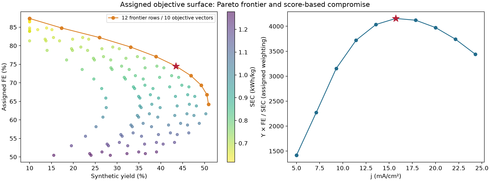
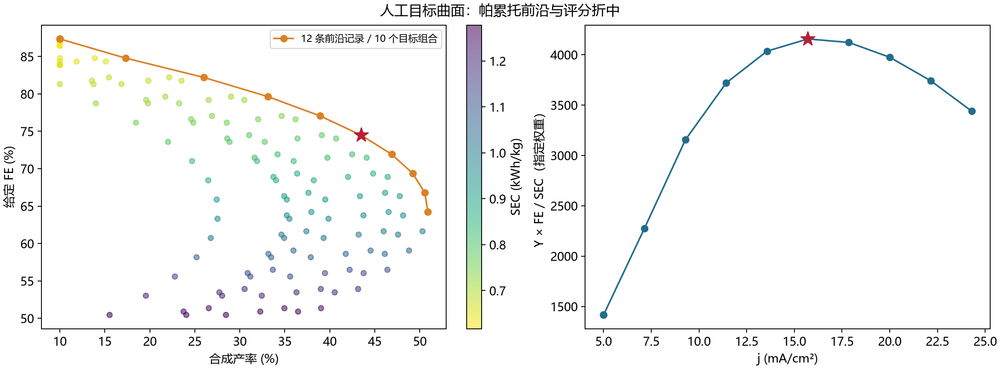
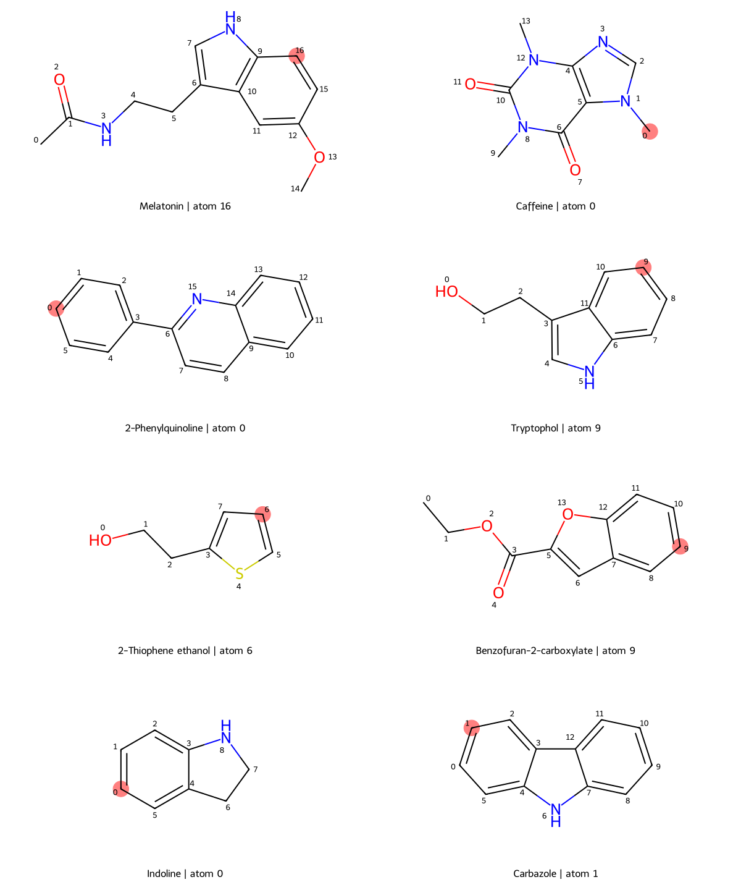
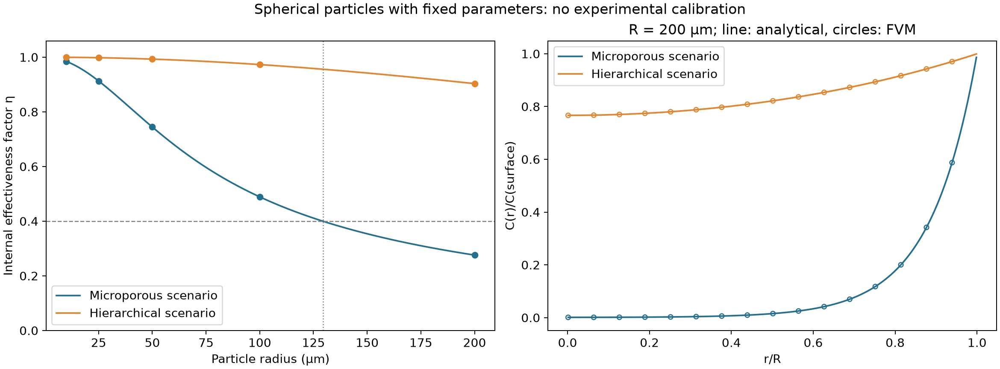
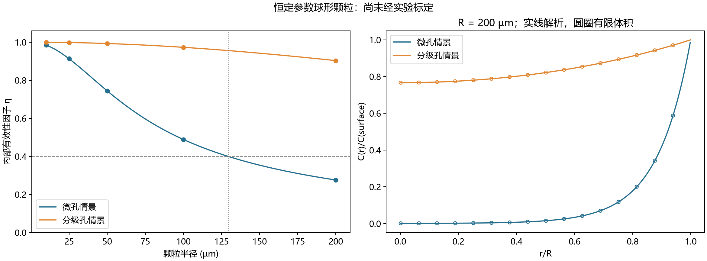
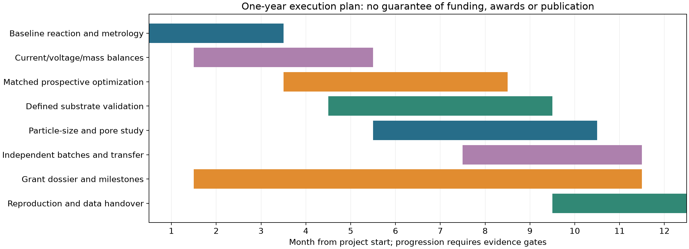
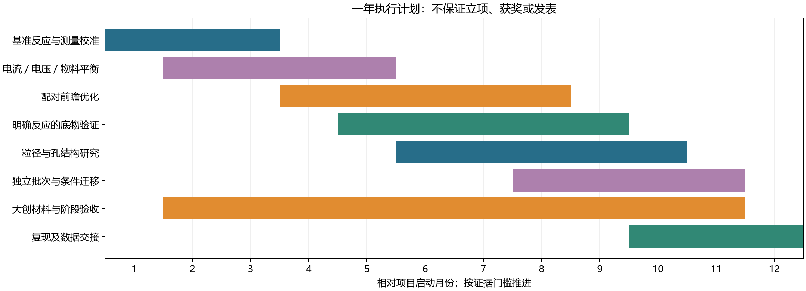

# Comprehensive Technical Report: Multiscale Machine Learning & Chemical Engineering for Green Organic Electrocatalysis
# 综合技术报告：面向绿色有机电催化的多尺度机器学习与化学工程集成研究

2026-09-27 · Section-aligned bilingual edition / 按章节对齐的双语版


## 1. Abstract / 1. 摘要

**English**

The supplied three-module engine was executed unchanged and produced `research_grade_results.json`. Its 135-condition synthetic grid contains 12 nondominated records, representing 10 distinct objective vectors. The source's scalarization selects 15.71 mA/cm², 8.0 mol% catalyst and 900 rpm, with assigned yield 43.47%, Faradaic efficiency 74.49% and cell-only specific energy consumption 0.779 kWh/kg. These are model outputs, not measured performance. Eight supplied molecular structures were successfully embedded and minimized; their reported oxidation potentials are uncalibrated graph-descriptor scores and their yield labels are seeded normal draws. A first-order spherical diffusion model gives internal effectiveness factors of 0.2760 and 0.9033 at 200 µm radius for the two prescribed diffusivities. Its hard-coded statement that microporous particles above 50 µm necessarily have η below 0.40 is contradicted by its own numerical output.

Additional work comprises complete Pareto reconstruction, 231 weight combinations, three feasibility scenarios, five current-band holdout folds for a newly fitted multi-output Gaussian process, 64 converged molecular conformers, 16 actual GFN2-xTB jobs, 40 finite-volume mesh cases, 50 external-film cases and 60 transport-parameter cases. A 320-cell spherical finite-volume calculation agrees with the analytical effectiveness factor within 2.94×10⁻⁵. The η=0.40 microporous threshold is 129.379256 µm under the supplied assumptions. The contribution is a reproducible numerical and evidence audit, with a proposed one-year measurement program. No experimental substrate scope, accurate oxidation-potential predictor, validated single-atom catalyst, or journal-ready scientific discovery is established.


**中文**

本研究按原样执行所提供的三模块引擎，生成 `research_grade_results.json`。135 个合成条件中有 12 条非支配记录，对应 10 个不同目标向量。源评分选择 15.71 mA/cm²、8.0 mol% 催化剂及 900 rpm，给定产率为 43.47%、法拉第效率为 74.49%、仅计电解池的比能耗为 0.779 kWh/kg。这些属于模型输出，而非实测性能。八个输入分子均成功嵌入并完成力场优化，但所报氧化电位是未经标定的分子图描述符评分，产率标签则为有种子的正态抽样。一级球形扩散模型在 200 µm 半径下给出两种预设扩散系数对应的内部有效性因子 0.2760 和 0.9033。其“微孔颗粒半径超过 50 µm 时 η 必然低于 0.40”的硬编码结论与自身数值矛盾。

新增工作包括完整帕累托前沿重建、231 组目标权重、三组可行性约束、五个电流区间分组留出的多输出高斯过程、64 个收敛构象、16 个实际 GFN2-xTB 作业、40 个有限体积网格案例、50 个外膜情景及 60 个传质参数情景。320 单元球形有限体积解与解析有效性因子的偏差不超过 2.94×10⁻⁵。按输入假设，微孔 η=0.40 的半径阈值为 129.379256 µm。本次贡献是可复现的数值与证据审计，以及拟议的一年测量路线；尚未建立实验底物普适性、准确氧化电位预测器、经验证的单原子催化剂或可直接发表的科学发现。


### 1.1 Evidence classes and scope / 1.1 证据分类与研究范围

**English**

**[L]** primary literature or official method documentation; **[S]** executed synthetic objective or random-label calculation; **[M]** molecular mechanics/descriptors; **[Q]** executed semiempirical electronic structure; **[A]** independent code/numerical audit; **[P]** proposed experiment; **[U]** missing or unverified evidence. “Research-grade” is retained in source and output filenames as the brief's label; successful execution does not validate that claim.

The three source modules do not form a calibrated multiscale coupling. Molecular scores are not inputs to the green-optimization equations; no molecularly derived rate enters the POP model; product identity, electron stoichiometry and catalyst structure are not linked across modules. This report follows the requested five-section paper architecture while distinguishing what the equations calculate from what an experiment would need to establish.


**中文**

**[L]** 原始文献或官方方法文档；**[S]** 已执行合成目标／随机标签计算；**[M]** 分子力学与描述符；**[Q]** 已执行半经验电子结构计算；**[A]** 独立代码／数值核验；**[P]** 拟议实验；**[U]** 缺失或未核实证据。源文件及输出名称保留附件中的“Research-grade”，运行成功不等于该成熟度主张得到验证。

三个源模块尚未构成经标定的多尺度耦合：分子评分没有进入绿色优化方程，POP 模型没有使用分子计算得到的速率，产物身份、电子计量和催化剂结构也未跨模块关联。本报告遵循所要求的五部分论文架构，同时区分方程实际计算的内容与实验还需证明的内容。


### 1.2 Execution and provenance / 1.2 执行环境与来源记录

**English**

The original script completed without a repair. The existing environment was reused: Python 3.12.14, NumPy 2.4.6, SciPy 1.18.0, pandas 2.3.3, scikit-learn 1.9.0, RDKit 2026.03.5 and xTB 6.7.1. Calculations were serial, CPU-only and single-threaded. The original output, logs and execution record are archived separately from all extensions. Additional scripts retain unrounded tables, identities, coordinates, charges and numerical diagnostics. Original source extraction normalizes line endings only.

```text
Extracted original script SHA-256:
59263ea547ddef1e6a9abd1fba47d02cac900c422fc9815895f02918dbfbc535
```

The input supplies no measured training set, electrolysis trace, product structure, raw spectrum, catalyst synthesis or pore-transport measurement. Assigned values therefore remain assigned values even when their units are physical.


**中文**

原脚本无需修复即完成执行。复用了既有环境：Python 3.12.14、NumPy 2.4.6、SciPy 1.18.0、pandas 2.3.3、scikit-learn 1.9.0、RDKit 2026.03.5、xTB 6.7.1。采用 CPU、单线程、串行计算。原输出、日志与执行记录单独归档，新增计算保存未舍入表格、分子身份、坐标、电荷及数值诊断。原代码提取仅统一换行符。

```text
提取后原脚本 SHA-256：
59263ea547ddef1e6a9abd1fba47d02cac900c422fc9815895f02918dbfbc535
```

输入没有提供实测训练集、电解时间轨迹、产物结构、原始谱图、催化剂合成或孔内传质测量。参数即使带有物理单位，也不能因此从给定值升级为实测值。


## 2. Multi-Objective Green Electrosynthesis (Module 1) / 2. 多目标绿色电合成帕累托优化（模块 1）

**English**


**中文**


### 2.1 Model, units and actual algorithm / 2.1 模型、单位与实际算法

**English**

[S/A] The grid has 15 current densities from 5 to 35 mA/cm², three catalyst loadings (2, 5, 8 mol%) and three stirring rates (300, 600, 900 rpm). Comments describing 1–10 mol% and 200–1000 rpm are broader than the executed grid. All 135 conditions are evaluated by prescribed equations and compared pairwise. `GaussianProcessRegressor` and `Matern` are imported but never instantiated or fitted in the original script; no acquisition function, adaptive query, posterior uncertainty or outcome-feasibility constraint is implemented. The source JSON key `Module1_MultiObjective_BO` is thus a name, not evidence that Bayesian optimization occurred.

The source defines an assumed voltage and yield surface:

$$
U=2.1+0.045\ln(j+1)+0.012j,\qquad
v=\frac{j}{20}(1-e^{-\omega/350})(c/5)^{0.4},
$$

$$
Y=\mathrm{clip}\left[94\frac{v}{1+v}-0.08(j-18)^2,10,96.5\right],\quad
FE_{\%}=\mathrm{clip}[92-1.2j+0.0015\omega,15,94].
$$

Here j, c and ω are numerical values in the code's stated units; the logarithm contains an implicit current-density reference scale. Its coefficient is assigned, not fitted Tafel kinetics. With the stated resistance of 12 Ω, converting j to total current implicitly assumes 1 cm² electrode area. Alternatively, the term could be reinterpreted as an area-specific resistance, but that is not the source's stated unit.

$$
SEC=\frac{n_e F U}{3.6\times10^6 M f},\quad n_e=2,\quad
M=0.223\ \mathrm{kg\ mol^{-1}},\quad f=FE_{\%}/100.
$$

The implemented factor 3.6×10⁶ correctly converts joules to kWh with M in kg/mol. The docstring's factor 3600 would be wrong by 1000 with those same units. A check based on charge, electrolysis duration and product mass independently reproduces the implemented SEC. No product corresponding to M=223 g/mol is specified. The expression is cell electrical energy per assumed product mass at constant voltage and product-specific FE; it excludes stirring, pumps, heating, purification, solvent recovery and catalyst preparation. It is not a life-cycle greenness metric. The yield equation lacks reaction time and substrate inventory, so joint consistency of Y, FE and charge is not experimentally established.


**中文**

[S/A] 网格包含 5–35 mA/cm² 的 15 个电流密度、三种催化剂用量（2、5、8 mol%）及三种转速（300、600、900 rpm）。注释中的 1–10 mol%、200–1000 rpm 比实际搜索范围更宽。全部 135 个条件都由预设公式评价，再两两比较。原脚本导入 `GaussianProcessRegressor` 和 `Matern`，却没有实例化或训练模型，也没有采集函数、自适应提问、后验不确定性或结果可行性约束。因此源 JSON 中的 `Module1_MultiObjective_BO` 是名称，不能证明已经执行贝叶斯优化。

源电压及产率曲面为：

$$
U=2.1+0.045\ln(j+1)+0.012j,\qquad
v=\frac{j}{20}(1-e^{-\omega/350})(c/5)^{0.4},
$$

$$
Y=\mathrm{clip}\left[94\frac{v}{1+v}-0.08(j-18)^2,10,96.5\right],\quad
FE_{\%}=\mathrm{clip}[92-1.2j+0.0015\omega,15,94].
$$

j、c、ω 为按代码所列单位代入的数值；对数项隐含电流密度参考尺度，系数为指定值，并非拟合的 Tafel 动力学。若按源注释采用 12 Ω 电阻，则把 j 换成总电流时隐含电极面积 1 cm²；也可以另解释为面积比电阻，但这不是源注释所给的单位。

$$
SEC=\frac{n_e F U}{3.6\times10^6 M f},\quad n_e=2,\quad
M=0.223\ \mathrm{kg\ mol^{-1}},\quad f=FE_{\%}/100.
$$

实际代码的 3.6×10⁶ 正确地将焦耳换成 kWh，并与 kg/mol 的 M 相配；文档字符串写作 3600，若沿用同一质量单位会错 1000 倍。新增核验通过电荷、电解时长和产物质量独立复算了实际 SEC。输入未给出与 223 g/mol 对应的具体产物。该式仅表示恒电压、产物特异 FE 假设下的电解池电能／产物质量，不包括搅拌、泵、加热、分离、溶剂回收和催化剂制备，不能当作生命周期绿色指标。产率公式缺少反应时间与底物库存，Y、FE、电荷之间的联合一致性尚未由实验建立。


### 2.2 Complete Pareto set and source compromise / 2.2 完整前沿与源评分折中

**English**

Table 1 contains all 12 source-rounded nondominated records. A condition dominates another only when it is no worse in all three objectives and strictly better in at least one. Three records at 5 mA/cm² have identical objectives because yield is clipped at 10%; equality does not count as domination. There are therefore **10 unique objective vectors**. Independent unrounded enumeration gives the same membership and selected condition.

| ID | j (mA/cm²) | Catalyst (mol%) | Stirring (rpm) | U (V) | Y (%) | FE (%) | SEC (kWh/kg) | Green score |
| --- | --- | --- | --- | --- | --- | --- | --- | --- |
| 89 | 24.29 | 8.0 | 900 | 2.537 | 50.90 | 64.21 | 0.950 | 3440.304211 |
| 80 | 22.14 | 8.0 | 900 | 2.507 | 50.55 | 66.78 | 0.902 | 3742.493348 |
| 71 | 20.00 | 8.0 | 900 | 2.477 | 49.23 | 69.35 | 0.859 | 3974.505821 |
| 62 | 17.86 | 8.0 | 900 | 2.446 | 46.88 | 71.92 | 0.818 | 4121.772127 |
| 53 | 15.71 | 8.0 | 900 | 2.415 | 43.47 | 74.49 | 0.779 | 4156.714121 |
| 44 | 13.57 | 8.0 | 900 | 2.383 | 38.91 | 77.06 | 0.743 | 4035.537820 |
| 35 | 11.43 | 8.0 | 900 | 2.351 | 33.12 | 79.64 | 0.709 | 3720.277574 |
| 26 | 9.29 | 8.0 | 900 | 2.316 | 25.98 | 82.21 | 0.677 | 3154.823929 |
| 17 | 7.14 | 8.0 | 900 | 2.280 | 17.33 | 84.78 | 0.646 | 2274.361300 |
| 8 | 5.00 | 8.0 | 900 | 2.241 | 10.00 | 87.35 | 0.617 | 1415.721232 |
| 2 | 5.00 | 2.0 | 900 | 2.241 | 10.00 | 87.35 | 0.617 | 1415.721232 |
| 5 | 5.00 | 5.0 | 900 | 2.241 | 10.00 | 87.35 | 0.617 | 1415.721232 |

The supplied “green compromise” is condition **53**, with Green_Score **4156.7141206675215** from rounded outputs. The unrounded score is 4154.82786378971. The highest-yield point instead uses 24.29 mA/cm² and returns 50.90% yield, 64.21% FE and 0.950 kWh/kg. Relative to that point, the source compromise sacrifices 7.43 yield percentage points, gains 10.28 FE points and lowers modeled SEC by about 18.0%. Neither is a laboratory recommendation.

The score $Y\,FE/SEC$ is a scalar preference, not a uniquely balanced optimum or an identified Pareto knee. Since $SEC\propto U/f$, the score is proportional to $Yf^2/U$ up to constants: FE is effectively counted twice. Catalyst loading and stirring are mostly pushed to their upper bounds because the generator rewards them without charging catalyst or mixing costs. The low-current clipped ties are the exception. The apparent green frontier inherits these modeling choices.



Figure 1. Assigned response surface; color represents SEC. Stars identify the source scalarization. The connected frontier has overlapping identical objective records. Values are synthetic and uncertainty bars would not be measurement uncertainties.


**中文**

表 1 保留全部 12 条基于源舍入值的非支配记录。只有三个目标均不差、且至少一个严格更好时，才构成支配。5 mA/cm² 下有三条记录因产率被截断至 10% 而具有相同目标；相等不构成支配，因此只有 **10 个不同目标向量**。独立的未舍入枚举给出相同前沿成员和所选条件。

| ID | j (mA/cm²) | 催化剂 (mol%) | 搅拌 (rpm) | U (V) | Y (%) | FE (%) | SEC (kWh/kg) | 绿色评分 |
| --- | --- | --- | --- | --- | --- | --- | --- | --- |
| 89 | 24.29 | 8.0 | 900 | 2.537 | 50.90 | 64.21 | 0.950 | 3440.304211 |
| 80 | 22.14 | 8.0 | 900 | 2.507 | 50.55 | 66.78 | 0.902 | 3742.493348 |
| 71 | 20.00 | 8.0 | 900 | 2.477 | 49.23 | 69.35 | 0.859 | 3974.505821 |
| 62 | 17.86 | 8.0 | 900 | 2.446 | 46.88 | 71.92 | 0.818 | 4121.772127 |
| 53 | 15.71 | 8.0 | 900 | 2.415 | 43.47 | 74.49 | 0.779 | 4156.714121 |
| 44 | 13.57 | 8.0 | 900 | 2.383 | 38.91 | 77.06 | 0.743 | 4035.537820 |
| 35 | 11.43 | 8.0 | 900 | 2.351 | 33.12 | 79.64 | 0.709 | 3720.277574 |
| 26 | 9.29 | 8.0 | 900 | 2.316 | 25.98 | 82.21 | 0.677 | 3154.823929 |
| 17 | 7.14 | 8.0 | 900 | 2.280 | 17.33 | 84.78 | 0.646 | 2274.361300 |
| 8 | 5.00 | 8.0 | 900 | 2.241 | 10.00 | 87.35 | 0.617 | 1415.721232 |
| 2 | 5.00 | 2.0 | 900 | 2.241 | 10.00 | 87.35 | 0.617 | 1415.721232 |
| 5 | 5.00 | 5.0 | 900 | 2.241 | 10.00 | 87.35 | 0.617 | 1415.721232 |

源“绿色折中”为条件 **53**，按舍入数据计算的 Green_Score 为 **4156.7141206675215**；未舍入评分为 4154.82786378971。最高产率点则使用 24.29 mA/cm²，产率 50.90%、FE 64.21%、SEC 0.950 kWh/kg。相对于该点，源折中牺牲 7.43 个产率百分点，增加 10.28 个 FE 百分点，并使模型 SEC 降低约 18.0%。二者都不是已验证的实验室推荐。

$Y\,FE/SEC$ 代表指定的标量偏好，并非唯一平衡点或已识别的帕累托膝点。由于 $SEC\propto U/f$，评分实际上正比于 $Yf^2/U$，即 FE 被重复加权。催化剂用量和转速大多被推到上界，是因为生成器奖励二者却不计催化剂和混合成本；低电流下被截断的并列点例外。该“绿色前沿”继承了这些建模选择。



图 1。给定响应曲面，颜色代表 SEC，星标代表源评分选择。前沿中存在重叠的相同目标记录。数值属于合成数据，若加误差棒也不能冒充测量不确定性。


### 2.3 Preference, constraints and geometry sensitivity / 2.3 目标偏好、约束与电极面积敏感性

**English**

[A/S] A grid of 231 nonnegative weight triplets, summing to one in steps of 0.05, maximizes $w_Y\ln(Y/100)+w_F\ln(f)-w_E\ln(SEC)$ on the unrounded frontier. This dimensional scaling fixes the numerical reference units of SEC; multiplying its reference unit by a common constant does not change a given-weight ranking. Ties use the lowest condition ID. Ten conditions are selected across the grid; the source choice appears in **27/231** cases. Frequencies measure sensitivity to this arbitrary weight grid, not a probability of experimental optimality.

| ID | j (mA/cm²) | Selections / 231 |
| --- | --- | --- |
| 2 | 5.00 | 41 |
| 17 | 7.14 | 2 |
| 26 | 9.29 | 22 |
| 35 | 11.43 | 21 |
| 44 | 13.57 | 21 |
| 53 | 15.71 | 27 |
| 62 | 17.86 | 28 |
| 71 | 20.00 | 32 |
| 80 | 22.14 | 31 |
| 89 | 24.29 | 6 |

Three explicitly added outcome constraints illustrate how a recommendation changes when acceptable performance is stated. They are analyst-chosen scenarios, not a grant or industry standard. The third scenario is infeasible under this model; relaxing the requirements or changing chemistry would be necessary.

| Minimum Y (%) | Minimum FE (%) | Maximum SEC (kWh/kg) | Feasible rows | Best score ID |
| --- | --- | --- | --- | --- |
| 40 | 70 | 0.85 | 5 | 53 |
| 45 | 70 | 0.85 | 1 | 62 |
| 50 | 70 | 0.85 | 0 | — |

An electrode-area audit keeps 12 Ω fixed and substitutes $I=jA/1000$. It leaves the synthetic Y/FE equations unchanged solely to isolate the missing area term; this is not a scale-up prediction. Larger assumed area changes the preferred current density:

| Area (cm²) | Selected j (mA/cm²) | U (V) | SEC (kWh/kg) |
| --- | --- | --- | --- |
| 1.0 | 15.7143 | 2.4153 | 0.7794 |
| 5.0 | 13.5714 | 3.0348 | 0.9466 |
| 10.0 | 13.5714 | 3.8491 | 1.2006 |

Real scale-up changes resistance, mass transfer, thermal behavior and geometry together. These results explain why area, spacing, conductivity and measured total cell voltage must be recorded before assigning a physical energy optimum.


**中文**

[A/S] 新增 231 组非负权重，三者之和为一、步长为 0.05，在未舍入前沿上最大化 $w_Y\ln(Y/100)+w_F\ln(f)-w_E\ln(SEC)$。这里固定了 SEC 的数值参考单位；整体改变参考单位只增加常数，不改变某组权重下的排序。并列时选择最小条件 ID。权重网格共选择十个条件，源选择出现 **27/231** 次。频率衡量对该人为权重网格的敏感性，不是实验最优的概率。

| ID | j (mA/cm²) | 被选择次数 / 231 |
| --- | --- | --- |
| 2 | 5.00 | 41 |
| 17 | 7.14 | 2 |
| 26 | 9.29 | 22 |
| 35 | 11.43 | 21 |
| 44 | 13.57 | 21 |
| 53 | 15.71 | 27 |
| 62 | 17.86 | 28 |
| 71 | 20.00 | 32 |
| 80 | 22.14 | 31 |
| 89 | 24.29 | 6 |

新增三组结果约束，展示明确“什么结果可接受”后推荐如何改变。这些是分析者指定情景，不是行业或项目标准。第三组约束在本模型中不可行，需要调整要求或改变化学体系。

| 最低 Y (%) | 最低 FE (%) | 最高 SEC (kWh/kg) | 可行记录 | 最高评分 ID |
| --- | --- | --- | --- | --- |
| 40 | 70 | 0.85 | 5 | 53 |
| 45 | 70 | 0.85 | 1 | 62 |
| 50 | 70 | 0.85 | 0 | — |

电极面积核验保持电阻 12 Ω 不变，改用 $I=jA/1000$；仅为隔离原式缺少面积项的问题，暂时保持 Y／FE 公式不变，并非预测真实放大。面积改变后，所选电流密度也会变化：

| 面积 (cm²) | 所选 j (mA/cm²) | U (V) | SEC (kWh/kg) |
| --- | --- | --- | --- |
| 1.0 | 15.7143 | 2.4153 | 0.7794 |
| 5.0 | 13.5714 | 3.0348 | 0.9466 |
| 10.0 | 13.5714 | 3.8491 | 1.2006 |

实际放大会同时改变电阻、传质、温度与几何。上述结果说明，在赋予能耗最优物理意义前，必须记录面积、间距、电导率和实测总槽压。


### 2.4 Added multi-output GP and comparison with OVAT / 2.4 新增多输出 GP 与 OVAT 对照边界

**English**

[S/A] The extension actually fits a multi-output GP to the three unrounded synthetic objectives. Five contiguous current-band folds each hold out three of the 15 current levels: 108 training and 27 test conditions per fold. Feature scaling is fitted only on training rows. The GP uses an amplitude-scaled ARD Matérn-5/2 kernel, `alpha=1e-6`, training-target normalization, one optimizer restart and seed 42. Outputs share kernel hyperparameters; no learned cross-output covariance or mechanistic relationship is imposed. The outer folds test current interpolation/extrapolation within the same assigned surface, not new chemical reactions. [Official GP API](https://scikit-learn.org/stable/modules/generated/sklearn.gaussian_process.GaussianProcessRegressor.html).

| Model | Objective | Macro MAE | Macro RMSE |
| --- | --- | --- | --- |
| multioutput_gp | FE_pct | 0.301045 | 0.374970 |
| multioutput_gp | SEC_kWh_kg | 0.008476 | 0.010595 |
| multioutput_gp | Yield_pct | 1.017672 | 1.506982 |
| training_mean | FE_pct | 11.934286 | 12.137799 |
| training_mean | SEC_kWh_kg | 0.209588 | 0.214355 |
| training_mean | Yield_pct | 11.368639 | 12.663336 |

MAE/RMSE units are percentage points for Y and FE, and kWh/kg for SEC. Macro metrics average the five fold metrics. The GP improves substantially on a training-mean baseline for this smooth artificial problem. Nevertheless, stitching its out-of-fold predictions produces 15 predicted Pareto records, with precision **0.733333** and recall **0.916667** against the 12-record true model frontier. These are a retrospective diagnostic across five models, not a prospectively validated frontier from one deployed model. One kernel amplitude bound warning is archived; no tuning was performed to erase it.

OVAT can cheaply establish local operating trends but depends on its starting condition and may miss interactions. Exhaustive enumeration evaluates every modeled combination; sequential multiobjective BO would choose new measurements using predictive uncertainty and acquisition criteria. This delivery implements an added surrogate audit, not that sequential algorithm. No matched OVAT experiment was run, so no quantified experimental saving or superiority over OVAT is claimed. A future comparison should freeze equal budgets, feasible domains, reference-point choices and baseline procedures before outcomes are collected. Experimental BO literature provides precedent for that design, rather than evidence that this surface represents a reaction. [Shields et al., 2021](https://www.nature.com/articles/s41586-021-03213-y).


**中文**

[S/A] 扩展部分真正拟合了三个未舍入合成目标的多输出 GP。五个连续电流区间各留出 15 个电流水平中的三个，每折训练 108 个、测试 27 个条件。缩放仅拟合训练集。GP 使用带幅度的 ARD Matérn-5/2 核、`alpha=1e-6`、基于训练目标的归一化、一次优化重启和种子 42。各输出共享核超参数，但未学习输出间协方差或施加机理关系。分组检验针对同一给定曲面的电流插值／外推，不代表新反应迁移。[官方 GP 接口](https://scikit-learn.org/stable/modules/generated/sklearn.gaussian_process.GaussianProcessRegressor.html)。

| 模型 | 目标 | 宏平均 MAE | 宏平均 RMSE |
| --- | --- | --- | --- |
| multioutput_gp | FE_pct | 0.301045 | 0.374970 |
| multioutput_gp | SEC_kWh_kg | 0.008476 | 0.010595 |
| multioutput_gp | Yield_pct | 1.017672 | 1.506982 |
| training_mean | FE_pct | 11.934286 | 12.137799 |
| training_mean | SEC_kWh_kg | 0.209588 | 0.214355 |
| training_mean | Yield_pct | 11.368639 | 12.663336 |

Y／FE 的 MAE、RMSE 单位为百分点，SEC 的单位为 kWh/kg；宏平均为五折指标的均值。对于这一平滑人工问题，GP 明显优于训练均值基线。不过，将各折留出预测拼接后得到 15 条预测前沿记录，对真实模型的 12 条前沿记录而言，精确率为 **0.733333**，召回率为 **0.916667**。这是跨五个模型的回顾性诊断，不是单一部署模型经前瞻验证的前沿。归档了一条核幅度上界警告，没有为消除警告而反复调参。

OVAT 可以较低成本建立局部操作趋势，但结果依赖起始点，且可能遗漏交互作用；穷举枚举评价全部模型组合；序贯多目标 BO 则应根据预测不确定性及采集规则选择新测量。本次新增的是代理模型核验，尚未实现上述序贯算法。没有进行配对 OVAT 实验，因此不能宣称节省了多少真实实验或已优于 OVAT。未来应在获得结果前冻结等预算、可行域、参考点和基线程序。实验 BO 文献提供设计先例，并不能证明当前曲面代表真实反应。[Shields 等，2021](https://www.nature.com/articles/s41586-021-03213-y)。


## 3. In Silico Substrate Scope Evaluation (Module 2) / 3. 计算机辅助底物普适性评估（模块 2）

**English**


**中文**


### 3.1 Complete molecular scope table and identities / 3.1 完整底物表与分子身份

**English**

[M/S] Table 2 reproduces every source entry and its numerical output. Names are clarified where the SMILES is more specific: the benzofuran entry is the **ethyl ester**, not a generic carboxylate ion; the thiophene alcohol is 2-(thiophen-2-yl)ethanol. All eight saved structures are neutral with singlet input convention. Their inclusion does not establish that every compound is a natural product, has a specified bioactivity, or participates in one shared reaction.

| Substrate | Formula | MW (g/mol) | logP | Assigned Eox proxy* | Atom index | Random yield label (%)** | Source category |
| --- | --- | --- | --- | --- | --- | --- | --- |
| Melatonin | C13H16N2O2 | 232.28 | 1.86 | 1.088 | 16 | 89.5 | High |
| Caffeine | C8H10N4O2 | 194.19 | 0.06 | 0.909 | 0 | 87.6 | High |
| 2-Phenylquinoline | C15H11N | 205.26 | 3.90 | 1.622 | 0 | 74.6 | Moderate |
| Tryptophol | C10H11NO | 161.20 | 1.70 | 1.174 | 9 | 92.6 | High |
| 2-(Thiophen-2-yl)ethanol | C6H8OS | 128.20 | 1.28 | 1.265 | 6 | 87.3 | High |
| Ethyl benzofuran-2-carboxylate | C11H10O3 | 190.20 | 2.61 | 1.256 | 9 | 87.3 | High |
| Indoline | C8H9N | 119.17 | 1.65 | 1.360 | 0 | 92.7 | High |
| Carbazole | C12H9N | 167.21 | 3.32 | 1.530 | 1 | 75.1 | Moderate |

*The source labels this number “V vs SCE,” but no reference-electrode calibration or training data support that unit assignment. **Yield values are random labels; they are neither assay nor isolated yields. Source categories are threshold labels of the same proxy, not observed reactivity. Atom indices are zero-based RDKit indices in the archived input order, not standard ring numbering. Table 2 is a descriptor and source-label inventory, not an experimental methodology-paper substrate scope.



Figure 2. Red highlights mark each source-selected carbon. They do not assert product formation at that position. Geometry/identity files retain atom order and hydrogen connectivity. The image uses source names; the ethyl ester identity is clarified in Table 2.


**中文**

[M/S] 表 2 逐项复现全部源底物及数值输出。根据 SMILES 明确较模糊名称：苯并呋喃条目是**羧酸乙酯**，不是一般羧酸根；噻吩醇是 2-(噻吩-2-基)乙醇。八个保存结构均为中性，输入采用单重态约定。列入该库不证明每种化合物均为天然产物、具有某种特定生物活性，或能参与同一个反应。

| 底物 | 分子式 | MW (g/mol) | logP | 指定 Eox 代理量* | 原子编号 | 随机产率标签 (%)** | 源分类 |
| --- | --- | --- | --- | --- | --- | --- | --- |
| 褪黑素 | C13H16N2O2 | 232.28 | 1.86 | 1.088 | 16 | 89.5 | 高 |
| 咖啡因 | C8H10N4O2 | 194.19 | 0.06 | 0.909 | 0 | 87.6 | 高 |
| 2-苯基喹啉 | C15H11N | 205.26 | 3.90 | 1.622 | 0 | 74.6 | 中 |
| 色醇 | C10H11NO | 161.20 | 1.70 | 1.174 | 9 | 92.6 | 高 |
| 2-(噻吩-2-基)乙醇 | C6H8OS | 128.20 | 1.28 | 1.265 | 6 | 87.3 | 高 |
| 苯并呋喃-2-羧酸乙酯 | C11H10O3 | 190.20 | 2.61 | 1.256 | 9 | 87.3 | 高 |
| 二氢吲哚 | C8H9N | 119.17 | 1.65 | 1.360 | 0 | 92.7 | 高 |
| 咔唑 | C12H9N | 167.21 | 3.32 | 1.530 | 1 | 75.1 | 中 |

*源字段标为“V vs SCE”，但没有参比电极标定或训练数据支持这一单位赋值。**产率是随机标签，不是分析产率或分离产率。源分类来自同一代理量阈值，不是观察到的反应性。原子编号为归档输入顺序下的零基 RDKit 编号，不是标准环位次。表 2 是描述符和源标签清单，不能作为实验方法学论文的底物普适性表。


图 2。红色标记代表源脚本选择的碳，并不宣称该位点形成产物。身份与坐标文件保留原子顺序及氢连接。图片沿用源英文名称，表 2 明确了乙酯身份。


### 3.2 Why geometry and partial charges do not validate the prediction / 3.2 三维构象与部分电荷为何不能验证预测

**English**

The source successfully embedded all eight structures with ETKDGv3 seed 42 and converged MMFF94 within 300 iterations, as independently recorded by the audit. However, the scoring path uses only calculated logP, topological polar surface area (TPSA) and the smallest Gasteiger charge among carbons bearing hydrogen:

$$
E_{proxy}=\mathrm{clip}[1.35+0.12\log P-0.008TPSA+1.5q_{min},0.75,2.30].
$$

These coefficients have no supplied fit, uncertainty, reference-electrode conversion or test set. There is no radical-cation calculation, orbital population, transition state or reaction partner in the source scoring function. Coordinate generation does not feed the formula. Repeating the charge calculation on the same molecular graph with no conformer gives a maximum charge difference of **0.0** for these inputs. All eight proxies lie inside the clipping limits, so clipping did not affect this particular table. [RDKit methods](https://www.rdkit.org/docs/RDKit_Book.html); [Gasteiger charge implementation](https://github.com/rdkit/rdkit/blob/master/Code/GraphMol/PartialCharges/GasteigerCharges.cpp).

| Substrate | TPSA (Ų) | Selected C charge (e) | Hybridization | Source MMFF status |
| --- | --- | --- | --- | --- |
| Melatonin | 54.12 | -0.034322 | SP2 | 0 |
| Caffeine | 58.44 | 0.012958 | SP3 | 0 |
| 2-Phenylquinoline | 12.89 | -0.062224 | SP2 | 0 |
| Tryptophol | 36.02 | -0.061509 | SP2 | 0 |
| 2-(Thiophen-2-yl)ethanol | 20.23 | -0.051230 | SP2 | 0 |
| Ethyl benzofuran-2-carboxylate | 39.44 | -0.061399 | SP2 | 0 |
| Indoline | 12.03 | -0.061842 | SP2 | 0 |
| Carbazole | 15.79 | -0.061497 | SP2 | 0 |

Caffeine selects atom 0, an N-methyl **SP3 carbon** with positive partial charge **0.012958 e**, because it is the smallest charge in the restricted candidate set. Calling it an electron-rich aromatic SET site is unsupported. Other candidates are aromatic carbons, but that alone does not make their ranking mechanistic. SET changes the electronic state of the molecule; subsequent proton transfer, radical trapping, adsorption and competing barriers can determine site selectivity.

For a proxy below 1.45, the program draws $N(88,3^2)$; between 1.45 and 1.85 it draws $N(72,4^2)$; otherwise it draws $N(42,6^2)$. Source execution yields six “High” and two “Moderate” entries. The global seed is set by Module 1, so standalone Module 2 is not independently seeded. Reconstructing the seed-42 draws exactly reproduces all eight displayed yields. Repeating 1,000 seeds gives:

| Substrate | Mean of 1,000 random labels (%) | SD (percentage points) |
| --- | --- | --- |
| Melatonin | 87.9617 | 2.9781 |
| Caffeine | 88.0060 | 2.9107 |
| 2-Phenylquinoline | 72.0434 | 3.9583 |
| Tryptophol | 88.0965 | 2.9977 |
| 2-(Thiophen-2-yl)ethanol | 87.9700 | 3.1083 |
| Ethyl benzofuran-2-carboxylate | 88.0499 | 3.0883 |
| Indoline | 87.8623 | 3.0104 |
| Carbazole | 71.8925 | 4.0594 |

The different single-run yields within a category are random sampling, not substrate-specific predictions. The Gaussian generator is not intrinsically bounded to 0–100%; the stored 8,000 draws happened to remain within that interval. These distributions describe the code's noise assumption, not experimental uncertainty or chemical success rates.


**中文**

源流程使用 ETKDGv3 种子 42 成功嵌入八个结构，MMFF94 均在 300 次迭代内收敛，新增审计独立记录了状态。但评分只使用计算 logP、拓扑极性表面积 TPSA 和所有带氢碳中的最小 Gasteiger 电荷：

$$
E_{proxy}=\mathrm{clip}[1.35+0.12\log P-0.008TPSA+1.5q_{min},0.75,2.30].
$$

这些系数没有给出拟合、不确定性、参比换算或测试集。源评分函数中没有自由基阳离子、轨道布居、过渡态或反应伙伴。生成坐标并未进入该公式。对不含构象的相同分子图重新计算电荷，本组输入的最大差值为 **0.0**。八个代理值均处于截断范围内部，本表没有受到截断影响。[RDKit 方法](https://www.rdkit.org/docs/RDKit_Book.html)；[Gasteiger 电荷实现](https://github.com/rdkit/rdkit/blob/master/Code/GraphMol/PartialCharges/GasteigerCharges.cpp)。

| 底物 | TPSA (Ų) | 所选 C 电荷 (e) | 杂化 | 源 MMFF 状态 |
| --- | --- | --- | --- | --- |
| 褪黑素 | 54.12 | -0.034322 | SP2 | 0 |
| 咖啡因 | 58.44 | 0.012958 | SP3 | 0 |
| 2-苯基喹啉 | 12.89 | -0.062224 | SP2 | 0 |
| 色醇 | 36.02 | -0.061509 | SP2 | 0 |
| 2-(噻吩-2-基)乙醇 | 20.23 | -0.051230 | SP2 | 0 |
| 苯并呋喃-2-羧酸乙酯 | 39.44 | -0.061399 | SP2 | 0 |
| 二氢吲哚 | 12.03 | -0.061842 | SP2 | 0 |
| 咔唑 | 15.79 | -0.061497 | SP2 | 0 |

咖啡因选择原子 0，即 N-甲基上的 **SP3 碳**，其部分电荷仍为正值 **0.012958 e**，只是受限候选集中的最小值。不能将其称作已确定的富电子芳香 SET 位点。其他候选属于芳香碳，但芳香性本身也不使排序具备机理意义。SET 改变整个分子的电子态，后续质子转移、自由基捕获、吸附及竞争势垒可能决定区域选择性。

代理量低于 1.45 时，程序抽取 $N(88,3^2)$；介于 1.45 与 1.85 时抽取 $N(72,4^2)$；否则抽取 $N(42,6^2)$。本次产生六条“高”和两条“中”分类。全局种子由模块 1 设置，因此单独调用模块 2 没有独立种子。重新构造种子 42 的随机序列，能够精确复现八个产率标签。扩展至 1,000 个种子得到：

| 底物 | 1,000 次随机标签均值 (%) | SD（百分点） |
| --- | --- | --- |
| 褪黑素 | 87.9617 | 2.9781 |
| 咖啡因 | 88.0060 | 2.9107 |
| 2-苯基喹啉 | 72.0434 | 3.9583 |
| 色醇 | 88.0965 | 2.9977 |
| 2-(噻吩-2-基)乙醇 | 87.9700 | 3.1083 |
| 苯并呋喃-2-羧酸乙酯 | 88.0499 | 3.0883 |
| 二氢吲哚 | 87.8623 | 3.0104 |
| 咔唑 | 71.8925 | 4.0594 |

同一类别中单次产率的差异来自随机抽样，不是底物特异预测。正态生成器本身未限制在 0–100%；本次保存的 8,000 次抽样恰好均未越界。这些分布仅描述代码指定的噪声，不代表实验不确定性或化学成功率。


### 3.3 Additional conformers and actual semiempirical calculations / 3.3 新增构象与实际半经验计算

**English**

[M/Q] Eight ETKDG conformers per molecule were generated with seed 271828 and optimized for up to 1,000 MMFF94 iterations. All **64/64 converged**. Duplicate conformational wells were retained; the lowest sampled MMFF energy was chosen as the starting structure for neutral GFN2-xTB/ALPB(acetonitrile) tight optimization. Each optimized neutral then underwent a +1 doublet single point at identical nuclei. All **16/16 jobs** terminated normally. Neutral/cation total atomic charges agree with 0/+1 within 10⁻⁶ e; no new dependency was installed.

| Substrate | Neutral energy (Eh) | Cation energy (Eh) | Removal difference (eV) | Source-site charge response (e) |
| --- | --- | --- | --- | --- |
| Melatonin | -50.029842786604 | -49.643054739192 | 10.525039 | 0.03437943 |
| Caffeine | -42.176331461625 | -41.750105833372 | 11.598190 | -0.02830746 |
| 2-Phenylquinoline | -40.650656410037 | -40.246255926242 | 11.004298 | 0.02832754 |
| Tryptophol | -34.027081360985 | -33.632629159093 | 10.733591 | 0.02470270 |
| 2-(Thiophen-2-yl)ethanol | -24.222950045856 | -23.801281680866 | 11.474181 | 0.03727600 |
| Ethyl benzofuran-2-carboxylate | -40.882858095976 | -40.448111141054 | 11.830067 | 0.01937752 |
| Indoline | -24.648629878475 | -24.266789025024 | 10.390419 | 0.05305096 |
| Carbazole | -33.235632759629 | -32.839587222217 | 10.776948 | 0.04355546 |

Energy differences use 27.211386245988 eV/Eh. Each charged state uses its own equilibrium ALPB response; the fixed-nuclei difference is not a rigorous nonequilibrium-solvent vertical ionization energy and has no reference-electrode calibration. The source-selected caffeine carbon has a removal charge response of **−0.02830746 e**, despite the molecule losing one electron overall. Local charge redistribution can have either sign; it is not a local oxidation potential. These calculations add actual electronic-structure records, not validation of the earlier heuristic. [GFN2-xTB method](https://pubs.acs.org/doi/10.1021/acs.jctc.8b01176); [xTB options](https://xtb-docs.readthedocs.io/en/latest/commandline.html).

No DFT, charged-geometry relaxation, vibrational Hessian, thermal correction, measured Eox or competing reaction path was calculated. Neutral convergence does not certify a vibrational minimum. MMFF energies are compared only within each molecule; energy rankings across chemically different molecules have no reactivity meaning. The pilot does not establish all relevant conformations, protonation states or tautomer populations in an experimental solvent.


**中文**

[M/Q] 每个分子以种子 271828 生成八个 ETKDG 构象，最多进行 1,000 次 MMFF94 优化，**64/64 全部收敛**。保留重复构象势阱，从采样中选择最低 MMFF 能量结构，进行中性 GFN2-xTB/ALPB(乙腈) tight 优化。随后在完全相同的中性核坐标上，进行 +1 双重态单点计算。**16/16 作业正常终止**。中性／阳离子原子电荷和与 0／+1 的偏差小于 10⁻⁶ e；没有新装依赖。

| 底物 | 中性能量 (Eh) | 阳离子能量 (Eh) | 移电子能量差 (eV) | 源位点电荷响应 (e) |
| --- | --- | --- | --- | --- |
| 褪黑素 | -50.029842786604 | -49.643054739192 | 10.525039 | 0.03437943 |
| 咖啡因 | -42.176331461625 | -41.750105833372 | 11.598190 | -0.02830746 |
| 2-苯基喹啉 | -40.650656410037 | -40.246255926242 | 11.004298 | 0.02832754 |
| 色醇 | -34.027081360985 | -33.632629159093 | 10.733591 | 0.02470270 |
| 2-(噻吩-2-基)乙醇 | -24.222950045856 | -23.801281680866 | 11.474181 | 0.03727600 |
| 苯并呋喃-2-羧酸乙酯 | -40.882858095976 | -40.448111141054 | 11.830067 | 0.01937752 |
| 二氢吲哚 | -24.648629878475 | -24.266789025024 | 10.390419 | 0.05305096 |
| 咔唑 | -33.235632759629 | -32.839587222217 | 10.776948 | 0.04355546 |

能量差采用 27.211386245988 eV/Eh 换算。各电荷态具有各自平衡 ALPB 响应，因此固定核能量差不等于严格非平衡溶剂垂直电离能，也没有参比电极标定。咖啡因源选中碳的移电子电荷响应为 **−0.02830746 e**，尽管整个分子失去一个电子。局部电荷重新分布可以为正或负，不是局域氧化电位。这些计算增加真实电子结构记录，并未验证先前启发式。[GFN2-xTB 方法](https://pubs.acs.org/doi/10.1021/acs.jctc.8b01176)；[xTB 选项](https://xtb-docs.readthedocs.io/en/latest/commandline.html)。

未进行 DFT、带电结构弛豫、振动 Hessian、热修正、实测 Eox 或竞争反应路径计算。中性优化收敛不等于已用振动确认能量极小点。MMFF 能量只在同一分子内部比较，跨不同分子的绝对能量排序不能解释反应性。该小规模计算也未覆盖实验溶剂中的全部构象、质子化态或互变异构体分布。


### 3.4 What a defensible scope predictor would require / 3.4 可靠底物预测器还需要什么

**English**

[P/U] First define one transformation, its partners, product connectivity and measurable endpoint. Measure oxidation behavior on a common solvent/electrolyte/reference scale and retain irreversible peaks, fouling and unsuccessful runs. Separate oxidation potential prediction from product yield and regioselectivity prediction; each needs its own labels and validation. Eight structures without reactions cannot supply a universal yield predictor.

Calibrated chromatography should quantify conversion and product yield; isolated material and NMR connectivity should establish regioisomer identity. Freeze held-out substrate families before feature selection or tuning. Compare against simple baselines and report errors relative to analytical and between-day variability. A molecular or charge-response correlation is only a hypothesis until tested on independent chemistry.


**中文**

[P/U] 首先明确一个转化、反应伙伴、产物连接关系和可测终点。在共同溶剂／电解质／参比尺度下测量氧化行为，保留不可逆峰、电极污染与失败记录。氧化电位预测、产率预测和区域选择性预测必须分别定义标签与验证；八个没有反应数据的分子不足以建立通用产率预测器。

经标定的色谱用于转化率和产物量，分离样品及 NMR 连接关系用于确认区域异构体。应在特征筛选或调参之前冻结留出底物家族，与简单基线比较，并将误差与分析误差、跨日变化相对照。分子或电荷响应相关性在独立化学体系中接受检验之前，只能作为假说。


## 4. POP-SAC Pore Kinetics & Thiele Modulus (Module 3) / 4. 多孔聚合物孔道动力学与蒂勒模数（模块 3）

**English**


**中文**


### 4.1 Governing assumptions and analytical model / 4.1 控制假设与解析模型

**English**

[S/A] The source assigns $k_{int}=4.2\times10^{-4}$ m³/(kg·s), $\rho=850$ kg/m³ and therefore $k_v=k_{int}\rho=0.357$ s⁻¹. It assigns $D_{eff}=1.5\times10^{-10}$ m²/s to the microporous label and $8.5\times10^{-9}$ m²/s to the hierarchical label, a ratio of 56.6667. No Cu structure, pore geometry, temperature, porosity, tortuosity or measured diffusivity is loaded.

For a uniform isothermal sphere, first-order reaction, constant effective diffusivity, zero central flux and fixed surface concentration:

$$
\frac{1}{r^2}\frac{d}{dr}\left(r^2D_{eff}\frac{dC}{dr}\right)-k_vC=0,
\qquad C(R)=C_s,\quad C'(0)=0,
$$

$$
\phi=R\sqrt{k_v/D_{eff}},\qquad
\eta=\frac{3}{\phi^2}(\phi\coth\phi-1).
$$

The source directly evaluates this analytical effectiveness factor. It imports `odeint` without using it and does not solve a new Knudsen/molecular diffusion model. η is the actual integrated rate divided by the hypothetical rate if the entire particle were at surface concentration. It is not conversion, selectivity or Faradaic efficiency. No intrinsic TOF or active-site count is supplied, so no absolute TOF is computed. The first-order spherical model is a standard reaction-engineering result. [MIT reaction/diffusion notes](https://ocw.mit.edu/courses/10-37-chemical-and-biological-reaction-engineering-spring-2007/resources/lec20_04272007_w/).


**中文**

[S/A] 源程序给定 $k_{int}=4.2\times10^{-4}$ m³/(kg·s)、$\rho=850$ kg/m³，所以 $k_v=k_{int}\rho=0.357$ s⁻¹。微孔标签使用 $D_{eff}=1.5\times10^{-10}$ m²/s，分级孔标签使用 $8.5\times10^{-9}$ m²/s，比值为 56.6667。没有载入 Cu 结构、孔道几何、温度、孔隙率、曲折度或实测扩散系数。

在均匀等温球、一级反应、常数有效扩散系数、中心零通量和固定表面浓度条件下：

$$
\frac{1}{r^2}\frac{d}{dr}\left(r^2D_{eff}\frac{dC}{dr}\right)-k_vC=0,
\qquad C(R)=C_s,\quad C'(0)=0,
$$

$$
\phi=R\sqrt{k_v/D_{eff}},\qquad
\eta=\frac{3}{\phi^2}(\phi\coth\phi-1).
$$

源代码直接计算此解析有效性因子，虽然导入 `odeint`，却没有使用，也未新建 Knudsen／分子扩散求解。η 是实际积分速率与假设整个颗粒都处于表面浓度时速率的比值，不是转化率、选择性或法拉第效率。由于没有给出本征 TOF 或活性位点数量，程序并未计算绝对 TOF。一级球形模型是经典反应工程结果。[MIT 反应与扩散讲义](https://ocw.mit.edu/courses/10-37-chemical-and-biological-reaction-engineering-spring-2007/resources/lec20_04272007_w/)。


### 4.2 Full particle-size sweep and corrected design threshold / 4.2 完整粒径扫描与修正后的设计阈值

**English**

Table 3 preserves all ten source outputs. Sizes are **radii**, not diameters.

| Scenario | Radius (µm) | φ | η | Internal utilization (%) |
| --- | --- | --- | --- | --- |
| Microporous_POP | 10.0 | 0.488 | 0.9845 | 98.45 |
| Microporous_POP | 25.0 | 1.220 | 0.9131 | 91.31 |
| Microporous_POP | 50.0 | 2.439 | 0.7445 | 74.45 |
| Microporous_POP | 100.0 | 4.879 | 0.4890 | 48.90 |
| Microporous_POP | 200.0 | 9.757 | 0.2760 | 27.60 |
| Hierarchical_POP | 10.0 | 0.065 | 0.9997 | 99.97 |
| Hierarchical_POP | 25.0 | 0.162 | 0.9983 | 99.83 |
| Hierarchical_POP | 50.0 | 0.324 | 0.9931 | 99.31 |
| Hierarchical_POP | 100.0 | 0.648 | 0.9731 | 97.31 |
| Hierarchical_POP | 200.0 | 1.296 | 0.9033 | 90.33 |

At 50 µm, microporous η is 0.7445; at 100 µm it remains 0.4890; only the 200 µm tested point lies below 0.40. Thus the hard-coded conclusion about all radii above 50 µm is false. Root solving the unrounded equation gives:

| Scenario | Target η | φ at threshold | Radius (µm) |
| --- | --- | --- | --- |
| Microporous_POP | 0.4 | 6.311799 | 129.379256 |
| Hierarchical_POP | 0.4 | 6.311799 | 973.931660 |
| Microporous_POP | 0.85 | 1.689315 | 34.627577 |
| Hierarchical_POP | 0.85 | 1.689315 | 260.666929 |

Under these fixed assumptions, microporous particles cross η=0.40 at **129.379256 µm** radius; hierarchical particles cross η=0.85 at **260.666929 µm**. The source's hierarchical η>0.85 claim holds over the sampled 10–200 µm interval, not for arbitrarily large particles. At 200 µm, center/surface concentration is 0.00112958 for the microporous case and 0.76658717 for the hierarchical case. The model therefore predicts a strong internal gradient in the first scenario, not a demonstrated failure of a synthesized material.



Figure 3. Left: analytical curves and source-radius markers; reference lines mark η=0.40 and its microporous threshold. Right: analytical concentration profiles and sampled 320-cell finite-volume values at R=200 µm. All parameters are prescribed rather than calibrated.


**中文**

表 3 保留十条源输出。尺寸均为**半径**，不是直径。

| 情景 | 半径 (µm) | φ | η | 内部利用率 (%) |
| --- | --- | --- | --- | --- |
| Microporous_POP | 10.0 | 0.488 | 0.9845 | 98.45 |
| Microporous_POP | 25.0 | 1.220 | 0.9131 | 91.31 |
| Microporous_POP | 50.0 | 2.439 | 0.7445 | 74.45 |
| Microporous_POP | 100.0 | 4.879 | 0.4890 | 48.90 |
| Microporous_POP | 200.0 | 9.757 | 0.2760 | 27.60 |
| Hierarchical_POP | 10.0 | 0.065 | 0.9997 | 99.97 |
| Hierarchical_POP | 25.0 | 0.162 | 0.9983 | 99.83 |
| Hierarchical_POP | 50.0 | 0.324 | 0.9931 | 99.31 |
| Hierarchical_POP | 100.0 | 0.648 | 0.9731 | 97.31 |
| Hierarchical_POP | 200.0 | 1.296 | 0.9033 | 90.33 |

50 µm 时微孔 η 为 0.7445，100 µm 时仍为 0.4890；所测试的尺寸中只有 200 µm 低于 0.40。因此“所有超过 50 µm 的半径均低于 0.40”的硬编码结论错误。对未舍入方程求根得到：

| 情景 | 目标 η | 阈值 φ | 半径 (µm) |
| --- | --- | --- | --- |
| Microporous_POP | 0.4 | 6.311799 | 129.379256 |
| Hierarchical_POP | 0.4 | 6.311799 | 973.931660 |
| Microporous_POP | 0.85 | 1.689315 | 34.627577 |
| Hierarchical_POP | 0.85 | 1.689315 | 260.666929 |

在这些固定假设下，微孔 η=0.40 的半径阈值为 **129.379256 µm**，分级孔 η=0.85 的阈值为 **260.666929 µm**。源分级孔 η>0.85 的结论只在采样的 10–200 µm 范围内成立，不能外推至任意大颗粒。200 µm 时，微孔和分级孔的中心／表面浓度分别为 0.00112958 和 0.76658717。模型预测的是前一情景的强内部浓度梯度，不是已经证明某种合成材料失效。



图 3。左图为解析曲线与源半径标记，参考线标出 η=0.40 及微孔对应阈值；右图为 R=200 µm 的解析浓度与抽样显示的 320 单元有限体积结果。全部参数均为预设值，尚未标定。


### 4.3 Independent finite-volume and external-film checks / 4.3 独立有限体积与外膜传质核验

**English**

[A] The extension discretizes the radial material balance in conservative spherical shells, with 40, 80, 160 and 320 cells for each of ten cases. Volume integration and surface flux are independently compared. Errors decrease with refinement; the maximum 320-cell η error is **2.9352×10⁻⁵**. An independent quadrature of $C/C_s=\sinh(\phi r/R)/[(r/R)\sinh\phi]$ reproduces the analytical η. This is numerical verification of the assumed equation, not validation of its parameters.

For small φ, the stable expression uses $\eta=1-\phi^2/15+2\phi^4/315-\phi^6/1575+\cdots$; for large φ, $\eta\sim3/\phi-3/\phi^2$. The source clips η below 0.01. That floor is inactive in its ten displayed cases but becomes unphysical outside them: at φ=10,000 the unclipped value is **0.00029997**, while the source returns **0.01**.

An added external-film scenario uses $Bi=k_fR/D_{eff}$ and steady flux balance:

$$
\frac{C_s}{C_b}=\left(1+\frac{\eta\phi^2}{3Bi}\right)^{-1},\qquad
\eta_{overall}=\eta\frac{C_s}{C_b}.
$$

| Scenario (R=200 µm) | Bi | Surface / bulk concentration | Overall effectiveness |
| --- | --- | --- | --- |
| Microporous_POP | 0.1 | 0.011290 | 0.003116 |
| Microporous_POP | 1.0 | 0.102490 | 0.028283 |
| Microporous_POP | 10.0 | 0.533133 | 0.147122 |
| Microporous_POP | 100.0 | 0.919481 | 0.253738 |
| Hierarchical_POP | 0.1 | 0.165051 | 0.149098 |
| Hierarchical_POP | 1.0 | 0.664066 | 0.599882 |
| Hierarchical_POP | 10.0 | 0.951848 | 0.859849 |
| Hierarchical_POP | 100.0 | 0.994967 | 0.898799 |

The full file contains 50 radius/regime/Bi cases. These are hypothetical dimensionless conditions; equal Bi across different D does not imply equal physical film coefficients. Another 60 cases vary D or $k_v$ by factors of one-half/two and include $k_v\times0.4$ as an illustrative density-basis scenario. Neither set is a measured uncertainty interval. A high internal η can coexist with external transport loss.


**中文**

[A] 新增求解采用守恒球壳离散径向物料平衡，对十个情景分别使用 40、80、160、320 个单元，并独立比较体积分与表面通量。误差随加密减小；320 单元的最大 η 误差为 **2.9352×10⁻⁵**。对 $C/C_s=\sinh(\phi r/R)/[(r/R)\sinh\phi]$ 独立积分，也可复现解析 η。这验证了假设方程的数值实现，没有验证参数的物理真实性。

小 φ 时使用稳定展开 $\eta=1-\phi^2/15+2\phi^4/315-\phi^6/1575+\cdots$；大 φ 时 $\eta\sim3/\phi-3/\phi^2$。源程序把 η 的下限截断为 0.01，此限制在十个显示情景中未触发，但向外扩展会产生非物理结果：φ=10,000 时，不截断的值为 **0.00029997**，源程序却返回 **0.01**。

新增外膜情景使用 $Bi=k_fR/D_{eff}$ 及稳态通量平衡：

$$
\frac{C_s}{C_b}=\left(1+\frac{\eta\phi^2}{3Bi}\right)^{-1},\qquad
\eta_{overall}=\eta\frac{C_s}{C_b}.
$$

| 情景（R=200 µm） | Bi | 表面／主体浓度 | 总有效性因子 |
| --- | --- | --- | --- |
| Microporous_POP | 0.1 | 0.011290 | 0.003116 |
| Microporous_POP | 1.0 | 0.102490 | 0.028283 |
| Microporous_POP | 10.0 | 0.533133 | 0.147122 |
| Microporous_POP | 100.0 | 0.919481 | 0.253738 |
| Hierarchical_POP | 0.1 | 0.165051 | 0.149098 |
| Hierarchical_POP | 1.0 | 0.664066 | 0.599882 |
| Hierarchical_POP | 10.0 | 0.951848 | 0.859849 |
| Hierarchical_POP | 100.0 | 0.994967 | 0.898799 |

完整文件包含 50 个半径／孔型／Bi 组合。这些是无量纲假设情景，不同 D 下相同 Bi 并不意味着相同物理外膜系数。另外 60 个情景将 D 或 $k_v$ 变为一半／两倍，并以 $k_v\times0.4$ 示范密度基准变化；两组都不是从测量估计的置信区间。内部 η 较高，仍可能存在严重外传质损失。


### 4.4 Limits of a POP-SAC interpretation / 4.4 POP-SAC 解释的适用边界

**English**

The code labels 850 kg/m³ as skeletal density, whereas the volumetric reaction term requires a consistent catalyst mass per particle-volume basis. Porosity can make those densities different. The two assigned diffusivities cannot be derived from pore size alone. A gas-phase Knudsen treatment requires its own molecular-wall-collision assumptions; solvent-filled pores require consideration of liquid diffusion, partitioning, adsorption, steric hindrance and swelling. The source computes none of these. BET area does not measure liquid-phase effective diffusivity.

The approximately 15 nm pore width named in a comment is **mesoporous**; it does not by itself establish a macropore network or hierarchical connectivity. IUPAC terminology distinguishes micropores around/below 2 nm, mesopores between those and about 50 nm, and larger macropores. [IUPAC micropore](https://goldbook.iupac.org/terms/view/M03906/plain); [IUPAC mesopore](https://goldbook.iupac.org/terms/view/M03853/pdf).

An electroactive POP may also require electron/ion transport, potential distribution, site accessibility and charge-state dynamics. A uniform first-order sphere cannot identify a working SAC coordination site or separate all these limitations. A useful research question is whether measured apparent rates and concentration gradients across controlled particle sizes are consistent with a common independently constrained reaction/diffusion model.


**中文**

代码将 850 kg/m³ 标为骨架密度，而体积反应项需要一致的“催化剂质量／颗粒体积”基准；孔隙率会使两种密度不同。不能只由孔径推导这两项给定扩散系数。气相 Knudsen 模型具有分子—孔壁碰撞假设；充满溶剂的孔道则要考虑液相扩散、分配、吸附、位阻和溶胀，源代码均未计算。BET 面积也不是液相有效扩散系数的测量。

注释所写约 15 nm 孔宽属于**介孔**，本身不能证明存在大孔网络或分级连通性。IUPAC 术语区分约 2 nm 及以下的微孔、介于该范围与约 50 nm 之间的介孔，以及更大的大孔。[IUPAC 微孔](https://goldbook.iupac.org/terms/view/M03906/plain)；[IUPAC 介孔](https://goldbook.iupac.org/terms/view/M03853/pdf)。

电活性 POP 还可能需要考虑电子／离子传输、电位分布、位点可及性和电荷态动态。均匀一级球模型不能确定工作态 SAC 配位结构，也不能区分全部限制。更有价值的问题是：受控粒径下的实测速率和浓度梯度，是否符合一组由独立测量约束的反应—扩散参数。


## 5. Lab-Scale Translation & Grant Application Roadmap / 5. 实验室转化与大创申报路线

**English**


**中文**


### 5.1 Measurement sequence for electrosynthesis and substrate scope / 5.1 电合成及底物验证的测量顺序

**English**

[P/U] These steps are a proposed supervised program, not an executed SOP or verified local instrument inventory. A defined transformation, partner identities and a reproducible literature/group baseline are prerequisites. No target-product recipe is invented from the random scope labels.

1. Register canonical substrate/product structures, atom mapping, electron stoichiometry, batch identities and a common analytical endpoint. Establish calibration curves, internal-standard recovery, blanks and replicate preparation before optimization. Separate assay yield, isolated yield, conversion and selectivity.
2. For an initial analytical CV study, consider 1 mM analyte in MeCN with 0.10 M n-Bu4NPF6, a polished glassy-carbon working electrode, Pt counter electrode and compatible Ag/Ag+ reference. Establish the blank window first; collect 50, 100 and 200 mV/s traces, monitor fouling and document reference checks with ferrocene. These are proposed starting settings whose compatibility must be confirmed for the chosen reaction. Report peak/onset/midpoint distinctions rather than calling every number Eox.
3. Reproduce the chosen preparative baseline in independent runs. An undivided glassy-carbon/Pt cell can be a starting configuration when chemically appropriate. Measure immersed electrode area, gap, solution resistance, temperature and total cell voltage; retain current and voltage time traces. Check cathodic loss or crossover with an appropriate control before interpreting yields.
4. Calculate $FE=n_eFn_{product}/\int I\,dt$ and $SEC=\int U_{cell}I\,dt/(3.6\times10^6m_{product,kg})$ with a declared product basis. Log auxiliary power separately. Do not substitute anode overpotential for full cell voltage or an assumed 223 g/mol product for the identified product mass.
5. Freeze a feasible multiobjective study and matched OVAT/space-filling baselines under equal valid-evaluation budgets. Randomize execution where practical and interleave repeated reference conditions across days. State unacceptable potential, temperature, analytical failure and precipitation rules in advance. Failed chemistry remains data; instrument failure needs a separate status.
6. Transfer only a verified reaction to the eight-substrate panel. Keep the core procedure fixed or explicitly account for permitted changes. Determine product connectivity by 1H/13C NMR and HSQC/HMBC; use NOESY as supporting spatial evidence. HPLC-MS provides time-resolved offline composition unless a genuine online interface and latency are documented. Retain unsuccessful and mixed-regioisomer cases.

CV interpretation and electrolysis-cell design depend on the chemistry; they cannot be replaced by descriptor scores. [Electrosynthesis practice](https://www.nature.com/articles/s41570-022-00372-y).


**中文**

[P/U] 以下为拟议的受指导研究路线，不是已执行 SOP 或已核实的本地仪器清单。首先必须确定反应、伙伴身份以及可复现的文献／组内基线，不能根据随机产率标签杜撰具体产物合成配方。

1. 登记标准底物／产物结构、原子映射、电子计量、批次和统一分析终点。优化前先建立标定曲线、内标回收、空白与独立配样重复；分别报告分析产率、分离产率、转化率和选择性。
2. 初始分析 CV 可考虑 1 mM 分析物、乙腈中 0.10 M n-Bu4NPF6、抛光玻碳工作电极、Pt 对电极及相容的 Ag/Ag+ 参比。先确定空白窗口，再采集 50、100、200 mV/s 曲线，观察污染，并记录二茂铁参照检查。这些是待确认与目标反应相容的起始设置。区分峰、起始和中点电位，不能统称所有读数为 Eox。
3. 用独立重复复现选定的制备基线。化学条件允许时，可从无隔膜玻碳／Pt 电解池开始。实测浸没面积、间距、溶液电阻、温度及总槽压，保存电流／电压时间轨迹。解释产率前，设置相应对照检查阴极损失或跨区迁移。
4. 以明确的产物基准计算 $FE=n_eFn_{product}/\int I\,dt$，以及 $SEC=\int U_{cell}I\,dt/(3.6\times10^6m_{product,kg})$，辅助功率另记。不能用阳极过电位代替总槽压，也不能用假定的 223 g/mol 代替确定产物的实际摩尔质量。
5. 在等有效评价预算下冻结可行的多目标研究与 OVAT／空间填充基线。条件允许时随机执行顺序，跨日穿插重复参考条件；预先定义不可接受电位、温度、分析失效和析出规则。化学失败仍是数据，仪器故障单独标记。
6. 只把已验证的反应转移至八底物面板。固定核心程序，或明确记录允许的条件调整。用 1H/13C NMR、HSQC/HMBC 确定连接关系，NOESY 作为空间辅助证据。除非已有真实在线接口和延迟记录，HPLC-MS 应称作离线时间分辨组成分析。保留失败和混合区域异构体结果。

CV 解释和电解池设计取决于具体化学，不能由描述符分数取代。[电合成方法实践](https://www.nature.com/articles/s41570-022-00372-y)。


### 5.2 POP characterization and continuous-flow translation / 5.2 POP 表征与连续流转化

**English**

Prepare a defined support/metalation system before testing the abstract microporous/hierarchical labels. Measure particle-size distributions and distinguish radius, diameter and agglomerate size. Compare size fractions from the same parent batch where feasible, with independent-batch replication. Establish rate versus stirring and catalyst loading before attributing particle-size dependence solely to internal diffusion. Keep conversion low enough for an initial-rate interpretation and measure the relevant time interval rather than assuming first-order behavior.

Collect N2 physisorption at 77 K with material-compatible pretreatment, reported adsorption/desorption branches and a justified fitting range/pore model. Use ICP-MS after validated digestion for metal loading; obtain representative aberration-corrected HAADF-STEM fields for dispersion. Bright isolated features do not quantify all active atoms or identify operando coordination. Complement with XAS/XPS where accessible, leaching measurements, post-run structure and support/soluble-metal/nanoparticle controls. Gas sorption and dry microscopy cannot alone establish solvent-swollen transport or single-atom catalytic identity.

For a liquid-filled particle, estimate D by an independently designed uptake, tracer or kinetic method with partitioning accounted for. Fit $k_v$ and D only where the data can identify both; apparent rates alone can confound them. Reserve a particle size or batch for prediction. The source's 10–200 µm radii and 50 µm threshold are scenarios to test, not fabrication specifications.

For flow, measure residence-time distribution, wetted volume, pressure drop and product recovery. Start with a verified chemistry and a stable electrode/catalyst configuration; retain total cell energy and outlet composition until a prespecified steady-state criterion is met. A packed bed of POP particles is not automatically equivalent to an electrode film or the preceding microchannel model. Check external transfer, swelling, bed compaction, fouling and catalyst loss; include separation and auxiliary energy in any scale-up comparison. Demonstrate mass and charge closure before claiming a productivity advantage.


**中文**

先建立确定的载体／金属化体系，再检验抽象的微孔／分级孔标签。测量粒径分布，区分半径、直径和团聚体尺寸。可行时从同一母批次分离粒径组，并加入独立批次重复。在将粒径效应完全归因于内扩散前，先测量速率对搅拌和催化剂用量的依赖。采用足以解释初速的低转化区间并实际测量时间响应，不能先假定一级动力学成立。

在相容预处理条件下采集 77 K N2 物理吸附，报告吸附／脱附支、合理拟合范围及孔模型。用验证后的消解和 ICP-MS 测量金属负载，以具有代表性的球差校正 HAADF-STEM 图像评估分散。孤立亮点不能统计全部活性原子或确定操作态配位。条件允许时结合 XAS/XPS、浸出、反应后结构，以及载体／可溶性金属／纳米颗粒对照。气体吸附和干态电镜不能单独证明溶剂溶胀后的传质或单原子催化身份。

对于液体充填颗粒，应通过独立设计的吸附动力学、示踪或动力学测量估计 D，并处理分配效应。只在数据能同时辨识时拟合 $k_v$ 和 D；表观速率可能混淆二者。留出一个粒径或批次用于预测验证。源程序的 10–200 µm 半径和 50 µm 阈值是待检验情景，不是制备规格。

连续流需测量停留时间分布、润湿体积、压降及产物回收。从已验证化学和稳定电极／催化剂构型出发，持续记录总槽电能和出口组成，直至满足预先规定的稳态标准。POP 颗粒填充床不自动等同于电极膜或前一版微通道模型。检查外传质、溶胀、床层压实、污染和催化剂流失，并把分离及辅助能耗纳入放大比较。在宣称生产率优势前证明物料和电荷平衡。


### 5.3 One-year execution plan and acceptance gates / 5.3 一年执行安排与验收门槛

**English**

Months refer to project start, not the current university application calendar. A freshman should prioritize one falsifiable core question and use the other modules as support. Parallel ambition does not remove instrument, supervision or coursework constraints.



| Period | Core deliverable | Advancement gate |
|---|---|---|
| Months 1–3 | Literature/structure registry, training, analytical calibration, replicated baseline | Defined product, traceable records and quantification repeatability |
| Months 4–6 | Equal-budget pilot design; current/voltage balances; measured descriptor table | Metrics have consistent units and uncertainty; failures are recorded |
| Months 7–9 | Prospective optimization or controlled particle-size study; substrate validation as justified | Independent predictions improve a declared baseline or expose a useful limitation |
| Months 10–12 | Independent reproduction, negative-result analysis, grant report and manuscript draft | Raw data, code, uncertainty and claim boundaries survive internal review |

Stop or redesign if product identity is unresolved, analytical drift exceeds the proposed effect, optimizer gains vanish on repetition, transport parameters are not identifiable, or separation/electrode deterioration removes the energy benefit. A null or negative result can still satisfy a sound methodological milestone; it does not justify a chemical breakthrough claim.


**中文**

月份相对于项目启动，而非当年学校申报日历。大一学生应选择一个可证伪核心问题，其余模块作为支持，不能以并行目标消除仪器、指导和课业约束。



| 时段 | 核心交付 | 进入下一阶段的条件 |
|---|---|---|
| 第 1–3 月 | 文献／结构库、培训、分析标定、重复基线 | 产物明确、记录可追溯、定量可重复 |
| 第 4–6 月 | 等预算试验设计、电流／电压平衡、实测描述符表 | 指标单位和不确定性一致，保留失败记录 |
| 第 7–9 月 | 前瞻优化或受控粒径研究，按证据开展底物验证 | 独立预测改善既定基线，或揭示有价值的限制 |
| 第 10–12 月 | 独立复现、负结果分析、项目报告与论文草稿 | 原始数据、代码、不确定性和主张边界通过内部审查 |

若产物身份不清、分析漂移超过拟研究效应、优化收益不能重复、传质参数不可辨识，或分离／电极劣化抵消能耗优势，应停止该路线或重新设计。零效应和负结果仍可满足合理的方法学里程碑，但不能据此宣称化学突破。


### 5.4 Undergraduate innovation proposal and publication position / 5.4 大创申请与论文定位

**English**

A defensible proposal can ask: **Can a measured multiobjective protocol lower product-specific electrical energy without sacrificing a predeclared yield/FE threshold, and can particle-scale transport explain any loss of catalyst utilization?** Choose the electrosynthesis or particle-transport question as the core after baseline feasibility; combining all eight substrate classes and all material regimes in one year is not a prerequisite.

The application dossier should contain a literature novelty comparison, a falsifiable hypothesis, measured preliminary data clearly separated from this simulation, work packages, instrument access, itemized consumables/analysis costs, responsibilities and backup plans. Use the university's current National Undergraduate Innovation and Entrepreneurship Training Program notice for eligibility, forms and deadlines; none was supplied or verified here. The schedule supports preparation and execution, not a guarantee of national approval, an award or acceptance in JACS/Angewandte/ACS Catalysis/Green Chemistry.

For a paper, computational integrity is necessary but insufficient. A publishable claim would need, for example, a prospective experimentally reproducible optimization gain, a reference-consistent substrate model with independent tests, or a constrained reaction/transport mechanism that predicts new particle-size behavior. The present release supplies reproducible software and an audit appendix; those missing chemical results remain the next work.


**中文**

可辩护的申请问题是：**实测多目标策略能否在不牺牲预定产率／FE 门槛的情况下降低产物特异电能，粒子尺度传质能否解释催化剂利用率损失？** 完成基线可行性后选择电合成或颗粒传质作为核心；一年内同时覆盖八种底物类别和全部材料情景并非必要条件。

申请材料应包括文献创新性比较、可证伪假设、与本模拟明确区分的实测预研数据、工作包、仪器使用条件、分项耗材／分析预算、分工和替代方案。资格、表格和截止时间以学校当年“国家级大学生创新创业训练计划”通知为准，本次输入未提供、也未核实这些信息。上述时间表支持申报准备和执行，不保证国家级立项、获奖或 JACS／Angewandte／ACS Catalysis／Green Chemistry 接收。

对论文而言，计算完整性是必要条件但不充分。可发表主张仍需例如前瞻且可重复的实验优化增益、参照一致并经独立测试的底物模型，或能够预测新粒径行为的受约束反应—扩散机制。当前发布提供可复现软件和审计附录，缺失的化学证据仍是下一阶段工作。


### 5.5 Reproduction, data availability and primary references / 5.5 复现、数据可用性与主要参考资料

**English**

The release includes the original specification/script/output, the independent audit, all 135 conditions and 12 Pareto rows, per-fold predictions, eight molecular identities, 64-conformer SDF records, 16 xTB jobs, diffusion profiles, bilingual figures and three complete report editions. [Research package guide](../README.md) gives paths and environment requirements. The previous four-task and five-topic reports remain separate.

```text
python research/scripts/run_original.py
python research/scripts/audit_research.py
python research/scripts/plot_research.py --zh-font PATH_TO_CJK_FONT
python research/scripts/build_reports.py
python research/scripts/validate_research.py
python -m unittest discover -s tests -v
python scripts/validate_release.py
```

Run in a separate clone to preserve release outputs: these commands refresh saved files. Activate the existing numerical environment, set OMP/OPENBLAS/MKL threads to one, and set `XTB_EXE` when xTB is not on PATH. Each xTB job has a 180-second timeout. Public logs normalize machine-specific executable/directory paths without changing scientific values. Numerical tests validate records and equations, not chemical accuracy. No external measured training set or supporting-information experiment was reproduced.

1. Shields et al. (2021), *Bayesian reaction optimization as a tool for chemical synthesis*. [Nature](https://www.nature.com/articles/s41586-021-03213-y). Experimental design precedent only.
2. scikit-learn developers, [GaussianProcessRegressor API](https://scikit-learn.org/stable/modules/generated/sklearn.gaussian_process.GaussianProcessRegressor.html). Multi-target fitting and normalization; recorded local version governs reproduction.
3. RDKit developers, [RDKit Book](https://www.rdkit.org/docs/RDKit_Book.html) and [Gasteiger implementation](https://github.com/rdkit/rdkit/blob/master/Code/GraphMol/PartialCharges/GasteigerCharges.cpp). Conformers and graph-based descriptor provenance.
4. Bannwarth, Ehlert and Grimme (2019), GFN2-xTB. [Primary method](https://pubs.acs.org/doi/10.1021/acs.jctc.8b01176); [official xTB documentation](https://xtb-docs.readthedocs.io/en/latest/commandline.html). No target-specific calibration is implied.
5. MIT OpenCourseWare, [Reaction and Diffusion in Porous Catalysts](https://ocw.mit.edu/courses/10-37-chemical-and-biological-reaction-engineering-spring-2007/resources/lec20_04272007_w/). Official teaching source for the classical assumptions. Thiele's 1939 paper has DOI [10.1021/ie50355a027](https://doi.org/10.1021/ie50355a027); full publisher text was not retrievable in this run.
6. IUPAC Gold Book, [micropore](https://goldbook.iupac.org/terms/view/M03906/plain) and [mesopore](https://goldbook.iupac.org/terms/view/M03853/pdf). Pore terminology, not diffusivity measurements.
7. Leech and Lam (2022), [electrosynthesis methodology](https://www.nature.com/articles/s41570-022-00372-y). General measurement context; the proposed sequence above is newly designed, not copied from a group SOP.

**Conclusion.** The supplied calculations are reproducible, and their unsupported mechanistic and material-design claims can be identified quantitatively. The added models improve numerical transparency. Progress to scientific validation requires a defined reaction and independent measurements, not a stronger label for the same synthetic targets.

**中文**

发布内容包括原规范／脚本／输出、独立核验、全部 135 条条件和 12 条前沿记录、逐折预测、八个分子身份、64 构象 SDF 记录、16 个 xTB 作业、扩散分布、双语图及三份完整报告。[研究包指南](../README.md) 提供路径和环境说明，前一版四任务和更早的五课题报告分别保留。

```text
python research/scripts/run_original.py
python research/scripts/audit_research.py
python research/scripts/plot_research.py --zh-font PATH_TO_CJK_FONT
python research/scripts/build_reports.py
python research/scripts/validate_research.py
python -m unittest discover -s tests -v
python scripts/validate_release.py
```

为保留发布记录，请在单独克隆中复现，因为这些命令会更新保存文件。先激活既有数值环境，将 OMP／OPENBLAS／MKL 线程设为一；若 PATH 中没有 xTB，则设置 `XTB_EXE`。每个 xTB 作业超时限制为 180 秒。公开日志只规范化机器特定可执行程序／目录路径，不改科学数值。测试验证记录和方程，不认证化学准确性。本次没有复现实测外部训练集或补充信息实验。

1. Shields 等（2021），*Bayesian reaction optimization as a tool for chemical synthesis*。[Nature](https://www.nature.com/articles/s41586-021-03213-y)。仅作为实验设计先例。
2. scikit-learn 开发者，[GaussianProcessRegressor 接口](https://scikit-learn.org/stable/modules/generated/sklearn.gaussian_process.GaussianProcessRegressor.html)。多目标拟合和归一化；复现以记录的本地版本为准。
3. RDKit 开发者，[RDKit Book](https://www.rdkit.org/docs/RDKit_Book.html) 和 [Gasteiger 实现](https://github.com/rdkit/rdkit/blob/master/Code/GraphMol/PartialCharges/GasteigerCharges.cpp)。构象和分子图描述符来源。
4. Bannwarth、Ehlert、Grimme（2019），GFN2-xTB。[原始方法论文](https://pubs.acs.org/doi/10.1021/acs.jctc.8b01176)；[xTB 官方文档](https://xtb-docs.readthedocs.io/en/latest/commandline.html)。不代表已针对本组分子标定。
5. MIT OpenCourseWare，[多孔催化剂中的反应与扩散](https://ocw.mit.edu/courses/10-37-chemical-and-biological-reaction-engineering-spring-2007/resources/lec20_04272007_w/)。经典假设的官方教学资料。Thiele 1939 年原论文 DOI 为 [10.1021/ie50355a027](https://doi.org/10.1021/ie50355a027)，本次未能获取出版方全文。
6. IUPAC Gold Book，[微孔](https://goldbook.iupac.org/terms/view/M03906/plain) 和 [介孔](https://goldbook.iupac.org/terms/view/M03853/pdf)。孔术语依据，并非扩散系数测量。
7. Leech、Lam（2022），[电合成方法学](https://www.nature.com/articles/s41570-022-00372-y)。一般测量背景；上述拟议程序为新设计，不是照抄组内 SOP。

**结论。** 输入计算可以复现，其缺少支持的机理和材料设计主张能够定量识别。新增模型提高了数值透明度。下一步科学验证依赖确定反应和独立测量，不能仅给同一组合成目标换上更强的成熟度标签。
