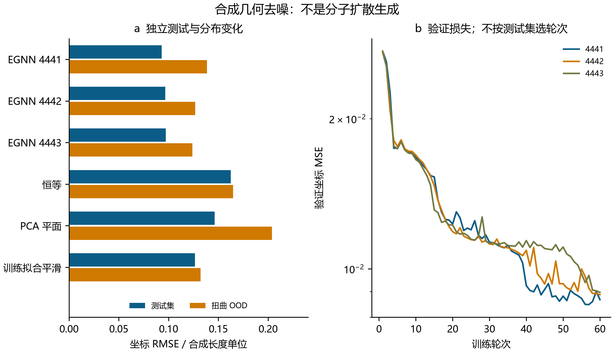
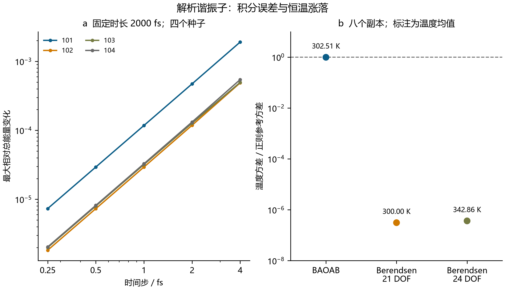
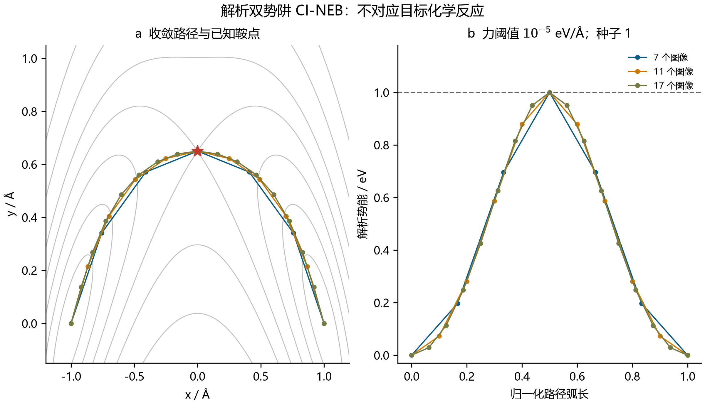
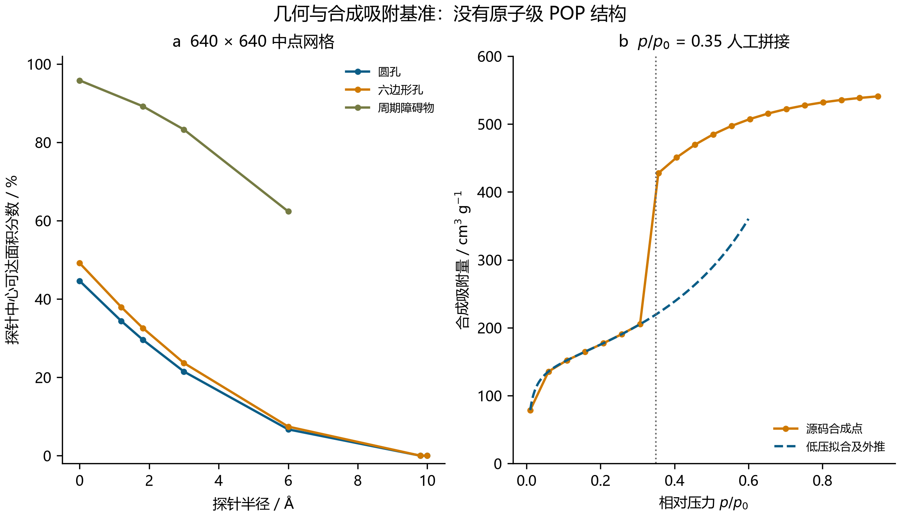

# SynthaPore-Omni：原始执行审计与数值研究基准

技术报告 · 2026 年 9 月 28 日 · 中文版

## 1. 执行记录与证据范围

本工作执行用户提供的 SynthaPore 程序，保留失败记录及实际输出，并为等变网络、分子动力学算法、爬山图像弹性带和几何孔道分析补充受控数值基准。已经实现的是可复现软件与数值验证；现有证据不能证明化学力场准确、吲哚活化机理成立、多孔聚合物已被合成，或实验性能得到改善。

未经修改的程序因嵌入表只有 10 项、输入却包含原子序数 29 而失败。兼容版仅把主模型构造器的物种表长度由 10 改为 30，并保存补丁。这是一项执行修复，也会改变初始化时随机数的消耗，因此下游随机权重随之改变。针对已执行模型的结论使用其实际保存的权重，而非仅重新设置相同种子的近似模型。输入只有八个带元素标签的坐标，元素清单为 **C4H2CuN**，配以完整有向图；它不是完整的 2-苯基吲哚，也不是经实验确证的 Cu 配位环境。

| 兼容版实际输出 | 数值 | 证据含义 |
|---|---:|---|
| 未训练模型参数数 | 55,394 | 表示架构规模，不代表预测准确性 |
| MD 时长 | 150 fs | 在随机力场下执行的轨迹 |
| 打印的平均温度 | 330.59 K | 原代码记录的统计量，不证明平衡 |
| 打印的活化势垒 | 0.00 kcal/mol | 最大值在端点，不是已验证过渡态 |
| 打印的孔隙率 | 42.5% | 圆形掩膜的端点网格面积估计 |
| 打印的 BET 面积 | 631.2 m²/g | 指定合成容量的换算结果 |

三个独立复核模块回答不依赖化学训练标签的数学问题。全部工作使用现有 CPU 环境进行本地软件计算；没有连接仪器，没有实验测量、DFT、分子自由能或巨正则蒙特卡洛计算。原文中的机构名称属于来源信息，不代表机构认可。[原始规范](../source/specification.md)、[源码记录](../source/source_record.json)及[实际捕获输出](../results/compatibility/captured_results.json)均保留，以区分上述证据层级。

## 2. 等变性、电荷守恒与监督去噪

### 2.1 数学审计

等变坐标更新可以由不变标量消息与相对坐标向量构造：

\[
m_{ij}=\phi(h_i,h_j,\|x_i-x_j\|^2),\qquad
x'_i=x_i+\sum_j(x_i-x_j)\psi(m_{ij}).
\]

正交变换保持距离，相对向量则协变；平移在坐标差中抵消。存在外电场时，场矢量须与坐标一同变换才能检验协变性。上述架构原则见 [Satorras、Hoogeboom 与 Welling](https://proceedings.mlr.press/v139/satorras21a.html)，但它不等于能量或力的化学准确性。

原代码的径向截断未消除全部相互作用：即使径向特征为零，节点特征和消息网络偏置仍然有效。对实际保存的随机权重，距离为 8 的边在名义截断 6 之外仍产生 0.0372638 的标量变化和 0.0196872 的坐标变化。复核实现对完整消息与向量更新施加截断，对应受控检验中的变化为零；同时让聚合张量保留输入数据类型，修复了原代码使用 float64 时的失败。

偶极耦合为 \(E_f=-\mathbf E\cdot\sum_i q_i(x)x_i\)。若电荷对平移不变，但总电荷 \(Q(x)\) 未受约束，平移 \(t\) 会使能量改变 \(-Q\mathbf E\cdot t\)，并使力改变 \((\mathbf E\cdot t)\nabla Q\)。对于固定非零电荷，能量零点发生平移可以合理；总电荷依赖构型则会进一步使内部力依赖坐标原点。实际保存模型的 \(Q=2.80738759\)。在原电场下平移 (4, −3, 7)，能量改变 −0.982585669，某力分量最大改变 0.001329373；这些均为未校准模型的数值单位。

复核势能采用投影 \(\tilde q_i=q_i+(Q_{\rm target}-\sum_jq_j)/N\)。对电中性目标，该操作消除了已检验的原点依赖，但不证明局部电荷准确。单独的双精度有限差分审计在位移 10⁻⁴ 时达到 5.81×10⁻¹² 的最大力差；原单精度函数的有限差分则在步长缩小时恶化。两者的架构和权重不同，不能视为相同权重下的受控精度比较。这些是未训练函数的微分与协变检验，不是与量子力的对照。

### 2.2 已训练但范围有限的去噪任务

监督任务使用 368 个不同的合成八节点环：192 个训练、48 个验证、64 个测试平面椭圆，以及 64 个分布外弯曲环。分区生成种子为 33001–33004。高斯坐标噪声标准差为 0.08、0.16 或 0.24，长度单位任意；噪声质心被消除。已知环邻接关系和中心化噪声使该任务比真实分子结构生成更容易。

三个含 13,176 个参数的去噪器各训练 60 轮，使用 Adam，学习率 0.003、批大小 32、权重衰减 10⁻⁵、梯度范数上限 5。仅按验证损失选择检查点，选中轮次分别为 57、60 和 60。基线包括不处理的带噪坐标、逐输入 PCA 平面投影，以及仅在训练集拟合系数的环平滑器。下表坐标 RMSE 对所有笛卡尔分量的平方误差取均值后开方。

| 方法 | 测试坐标 RMSE | 弯曲分布外坐标 RMSE |
|---|---:|---:|
| 带噪恒等输出 | 0.162532 | 0.164768 |
| PCA 平面投影 | 0.146258 | 0.203743 |
| 训练集拟合环平滑器 | 0.126434 | 0.132234 |
| EGNN 种子 4441 | 0.093198 | 0.138630 |
| EGNN 种子 4442 | 0.096786 | 0.126767 |
| EGNN 种子 4443 | 0.097257 | 0.124032 |

三个神经网络均改善了固定测试集的坐标指标，但种子 4441 在弯曲分布外集合上弱于平滑器；PCA 的平面先验同样损害了分布外表现。已训练模型的最大双精度协变残差为 1.78×10⁻¹⁵。该残差和同一数据集上的三个种子均不能证明广泛泛化能力。这里没有随时间变化的学习得分函数、前向扩散日程或反向采样链，因此任务应称为**单步监督去噪**，而非扩散生成；真正的扩散框架可参见 [Ho、Jain 与 Abbeel](https://proceedings.neurips.cc/paper/2020/hash/4c5bcfec8584af0d967f1ab10179ca4b-Abstract.html)。



**图 1。** (a) 六种方法在测试集和弯曲分布外集合上的坐标 RMSE，单位为合成长度单位。(b) 三个训练种子在 60 轮内的验证坐标 MSE，仅用验证损失选择检查点。两幅子图衡量监督形状去噪，不表示分子生成或化学准确性。[可编辑 SVG](figures/Fig1_Equivariance_Denoising_chinese.svg)。

## 3. 分子动力学算法验证

复核 MD 使用八个质量均为 12.011 amu 的粒子和具有平移不变性的谐势：

\[
U=\frac{k}{2}\sum_i|r_i-\bar r|^2,\quad k=2\ {\rm eV/Å^2},\quad
a_i=F_i/(c_m m_i),\quad c_m=103.64269652680505.
\]

其中 \(c_m\) 的单位为 eV fs² Å⁻² amu⁻¹。该模型的最低能量位置是粒子重合，因此只适合作为谐振子测试，不是真实分子模型。初始质心位置和动量被消除，没有额外的转动或键约束，内部笛卡尔自由度为 \(f=3N-3=21\)。

Velocity Verlet 先按 \(r_{n+1}=r_n+h v_n+h^2a_n/2\) 更新坐标，再按 \(v_{n+1}=v_n+h(a_n+a_{n+1})/2\) 更新速度。精确谐振子解提供独立参考。四个种子、五个时间步各覆盖 2,000 fs；程序拒绝不稳定时间步，时间记录包含真实初态与终态。

| 时间步 / fs | 最大相对能量误差包络 | 最大终点坐标均方根误差 / Å |
|---:|---:|---:|
| 0.25 | 0.0000073361 | 0.0000414194 |
| 0.50 | 0.0000293488 | 0.0001656753 |
| 1.00 | 0.0001174680 | 0.0006626605 |
| 2.00 | 0.0004710357 | 0.0026499698 |
| 4.00 | 0.0019028858 | 0.0105877504 |

这里的能量量是振荡误差包络，不是拟合的线性漂移斜率。时间步减半得到能量包络收敛阶 1.96457–2.04409、终点坐标收敛阶 1.99041–2.00339，支持该基准中的二阶行为。

恒温比较中，每种方法使用八个对应种子、0.5 fs 时间步、50 fs 松弛时间、6,000 fs 总时长和 1,000 fs 预热。Langevin 使用 BAOAB 分裂与质心投影噪声。正则谐振子模型满足 \(2K/(k_BT)\sim\chi_f^2\)，故 300 K 时温度方差为 \(2T^2/f=8571.428571\) K²。相邻时间点仍存在相关性。

| 恒温方法 | 内部温度均值 / K | 轨迹内温度方差均值 / K² | 与正则方差之比 |
|---|---:|---:|---:|
| Langevin BAOAB | 302.508228 | 8423.370489 | 0.982726557 |
| Berendsen，21 自由度 | 299.999705 | 0.002660 | 0.000000310355 |
| Berendsen，原代码 24 自由度 | 342.856740 | 0.003125 | 0.000000364530 |

Berendsen 给出正确温度均值，不代表它产生正确的正则涨落。故意采用不一致的 24 自由度公式会使内部温度趋向 \(300\times24/21\)。BAOAB 的方差接近参考值也受有限时长和步长误差限制；积分背景见 [Leimkuhler 与 Matthews](https://arxiv.org/abs/1203.5428)。

原程序的 eV/Å 到牛顿换算在量纲上是正确的。其独立问题是随机力、提前一个时间步的时间标签、缩放前遥测，以及初始移除质心漂移后仍把实验室坐标系动能除以 3N。外场净力可能重新引入整体运动；因此一致的内部温度处理应先扣除瞬时漂移，再确定自由度，而不只是修改分母。

原程序保存的 30 帧标记为 0–145 fs，实际对应更新后的 0.5–145.5 fs，重算均值为 330.586475 K。源方法没有返回速度或完整坐标轨迹，因此仅凭保存的遥测无法重建内部温度。



**图 2。** (a) 四个 NVE 种子的最大相对总能误差随时间步的变化，坐标轴采用对数刻度。(b) 三种恒温器的温度方差均值与正则参考方差之比，每种方法含八条重复轨迹，标注给出内部温度均值。对数方差轴展示了解析谐振子基准中 Berendsen 涨落被压制的程度。[可编辑 SVG](figures/Fig2_MD_Validation_chinese.svg)。

## 4. CI-NEB 收敛与原始方法对照

独立鞍点基准采用：

\[
V(x,y)=(x^2-1)^2+4[y-0.65(1-x^2)]^2.
\]

其极小值为 (−1, 0) 和 (1, 0)，鞍点为 (0, 0.65)，势垒为 1 eV，Hessian 特征值为 (−4, 8) eV/Ų。弯曲谷底不被预设为最小能量路径。扰动端点先做最小化，最大终点梯度达到 9.61×10⁻¹² eV/Å。

普通图像结合垂直真实力与切向弹簧力，爬山图像使用 \(F_{CI}=F-2(F\cdot\hat\tau)\hat\tau\)，遵循[爬山图像方法](https://doi.org/10.1063/1.1329672)。实现同时采用能量加权切向、50 次普通更新后的爬山启动、位移上限和 FIRE 类优化。优化器步长不是真实 MD 时间；最大带力及爬山图像真实力都必须满足阈值，最终能量按最终坐标重算。

| 力阈值 / eV Å⁻¹ | 条件数 | 更新范围 | 最大鞍点误差 / Å | 最大势垒误差 / eV |
|---:|---:|---:|---:|---:|
| 0.001 | 9 | 104–188 | 0.000249073 | 0.000000123954 |
| 0.00001 | 9 | 153–251 | 0.00000219411 | 0.00000000000962830 |

扫描包括 7、11、17 个图像及三个初始路径种子。18 个复核条件全部收敛，鞍点均只有一个负模。这些是二维势能鞍点，不是分子活化自由能。

未经改动的原始 NEB 类也在同一解析势上运行。12 个条件全部声称“收敛”，但其中 10 个未满足独立的 10⁻⁵ eV/Å 判据；两个 150 次更新后达标的条件保留为阳性对照。一次更新后，原方法仍返回更新前的 2.69 eV 势垒，而更新后坐标给出 1.781456 eV，过期能量差达 0.908544 eV。45 次更新后小数位上接近正确的势垒，同样不能证明整条带已收敛。

实际保存的原始随机模型打印 0.00 kcal/mol，是因为取最大值时包括了作为参考的起始端点，而其他显示的相对能量均为负。被指定的内部图像不能因此被接受为过渡态。有限更新次数、未经弛豫的端点、缺少按力停止的规则和分子振动分析，都是实质性限制。

对实际保存权重的精确重放复现了源输出。独立最终坐标评估给出最大投影原子力 0.009773735，端点力分别为 0.005495586 与 0.005935186，单位仅为源程序名义上的 eV/Å；带中最短原子对距离为 0.169807479 Å。最大过期能量差为名义 8.22544×10⁻⁶ eV。这些单位没有经过化学能量尺度校准。原 NEB 还没有使用 MD 中的外电场。[原始执行审计](../results/source_audit.json)保存了完整区分。



**图 3。** (a) 解析势能等高线，以及种子 1、力阈值 10⁻⁵ eV/Å 下收敛的 7、11、17 图像路径，红星标出已知鞍点。(b) 对应势能随归一化路径弧长的变化，虚线为精确的 1 eV 势垒。这些是复核后的解析路径，不是原始片段的反应机理。[可编辑 SVG](figures/Fig3_NEB_Validation_chinese.svg)。

## 5. 几何可达性与合成吸附反演

原始探针半径参数从未被读取：两个胞长、四个探针半径的八次类方法调用，证实每个胞长下的输出相同。其圆形掩膜不构成 hcb 网络或原子级框架。在 26 Å 胞长下，零探针圆孔的精确面积分数为 44.632923%，而原粗网格输出为 42.5%。

三个几何基准位于 26 Å 方胞中：内切半径均为 9.8 Å 的圆孔和正六边形孔，以及中心在 (12.4, 2.5) Å、半径 3 Å 的周期性实心圆盘。两个孔道的探针中心可达面积分别为 \(\pi\max(R-r_p,0)^2\) 和 \(2\sqrt3\max(a-r_p,0)^2\)，其中六边形 a 为内切半径。周期位移采用 \((\Delta+L/2)\bmod L-L/2\)，扩张圆盘的交叠区由解析式处理。

40–640 分辨率下的 15 个中点净空距离场产生 90 个探针掩膜。最高分辨率最大面积分数误差为 0.000474912，最小镜像距离与显式九胞枚举最大差为 3.55×10⁻¹⁵ Å。探针半径 1.82 Å 时，圆孔、六边形孔及周期圆盘外部的精确可达分数分别为 0.295943605、0.326324521 和 0.892031454。这些是几何基准，不是 POP 孔隙率。

120 行直方图描述按面积加权的点到最近壁面距离；123 个检验边界上的 CDF 最大误差为 0.000687445。它不是孔直径分布。探针中心面积、探针占据面积、表面积和体积也必须区分；[Zeo++ 文档](https://www.zeoplusplus.org/examples.html)阐明了这些定义，但本次并未运行 Zeo++。

原吸附公式在相对压力 0.35 处由 219.531691 跳至 424.311058 cm³/g，跳变为 204.779367。这个指定切换不构成滞后或 IV 型等温线证据。BET 线性化拟合 \(p/[V(1-p)]=i+sp\)，并由 \(V_m=1/(s+i)\)、\(C=1+s/i\) 得到参数；非正参数、残差及选定的一致性诊断均保留。

| 舍入原始点的拟合窗口 | Vm / cm³ g⁻¹ | C | 诊断 |
|---|---:|---:|---|
| 0.01–0.30 | 145.000199 | 114.998314 | 恢复指定低压分支 |
| 0.10–0.35 | 145.002011 | 114.965103 | 单层压力在窗口外 |
| 0.01–0.45 | 235.485444 | 10.566237 | V(1−p) 非单调 |
| 0.35–0.95 | 48.803456 | −1.189751 | C 为负，不报告面积 |
| 0.01–0.95 | 65.615805 | −3.775999 | C 为负，不报告面积 |

24 次确定性拟合包含精确 BET 对照。另有 64 个种子、均值为 1 的对数正态乘性扰动基准，产生 384 个观测和 128 次拟合。去除最低压力点后，C 的重复分位范围由 104.439–136.165 扩至 93.963–166.296。这是条件合成噪声范围，不是实验置信区间。常规面积换算明确采用氮分子截面积 0.162 nm²、STP 摩尔体积 22414 cm³/mol；拟合是否适用仍是独立问题，相关限制见 [NIST SP 960-17](https://nvlpubs.nist.gov/nistpubs/Legacy/SP/nistspecialpublication960-17.pdf)。



**图 4。** (a) 三个人工几何在 640² 中点网格上的探针中心可达面积分数。(b) 原始 20 个舍入等温线点，以及仅用相对压力 0.01–0.30 拟合、外推至 0.60 的 BET 曲线；竖线表示人为设定的 0.35 分支切换。这些是合成数据，不是实验等温线或实测 PSD。[可编辑 SVG](figures/Fig4_Pore_Adsorption_chinese.svg)。

## 6. 复现、计算规模与研究限制

| 正式复核工作量 | 执行数量 | 独立先导计算 |
|---|---:|---|
| 去噪器拟合 / 轮数 | 3 / 180 | 1 / 2 |
| 解析 MD 轨迹 / 步数 | 44 / 350,000 | 4 / 700 |
| 复核 NEB 条件 / 更新 | 18 / 3,129 | 1 / 135 |
| 未改动原类解析 NEB 条件 / 更新 | 12 / 618 | 2 / 46 |
| 几何点评估 / 掩膜 | 1,636,800 / 90 | 24,000 / 36 |
| BET 拟合 | 152 | 40 |

正式 MD 使用 350,044 次能量/力评估；复核 NEB 使用 37,337 个图像点评估和 36 个端点检查；原类解析对照使用 7,210 个点评估和 140 个更新后审计点；两次端点最小化另使用 778 次评估。先导与单元测试不计入正式数量。网络数学审计、实际保存权重的检查和原始程序执行属于单独记录的工作，不计入去噪器训练次数。

主小模型能量审计包含 244 次势能/力评估及 124 次仅电荷前向计算。实际保存权重的独立审计另增加 157 次能量/力评估及一次仅电荷前向计算。精确原始 NEB 重放使用 315 次调用和七个最终带点评估，没有再次运行 MD。单独的层行为及数据类型探针在相应审计 JSON 中分列。

从仓库根目录执行以下命令可复现主要工作：

```bash
python synthapore/scripts/run_source.py
python synthapore/scripts/equivariant_reviewed.py
python synthapore/scripts/dynamics_reviewed.py
python synthapore/scripts/pore_reviewed.py
python -m unittest discover -s tests -p "test_synthapore_*.py" -v
```

每个复核脚本还支持 `--pilot`。[等变模块](../results/equivariant/summary.json)、[动力学模块](../results/dynamics/summary.json)和[孔道模块](../results/pore/summary.json)的汇总记录版本、种子、计数及哈希。逐形状误差、检查点、最终带、力历史、网格表和拒绝拟合均可检查。MD 时间序列保存每种配置的第一个种子，同时保留全部重复统计及 NVE 初末状态。发布验证见[模块入口](../README.md)、[报告检查](../results/publication_validation.json)和[图形复核记录](../results/figure_qa.json)。

下一步科学研究需要明确的结构身份与电荷态、参考电子能和力、独立化学测试集、物理上合理的边界条件、收敛的分子端点与鞍点检验，以及具有明确半径和质量约定的真实周期框架。只有补齐溶剂、熵和电极处理后，才可能讨论活化自由能。当前套件提供经过测试的数值组件和明确的失败证据，但没有提供上述物理基础，也不能据此声称达到发表或工业应用要求。
