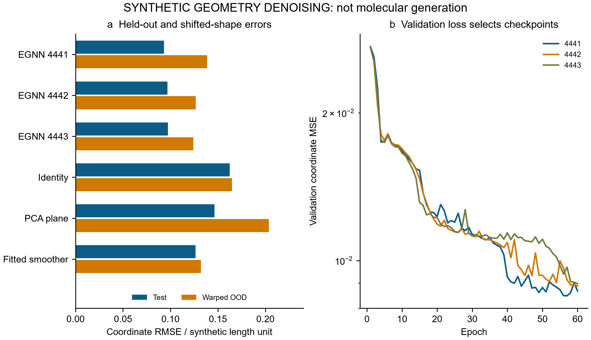
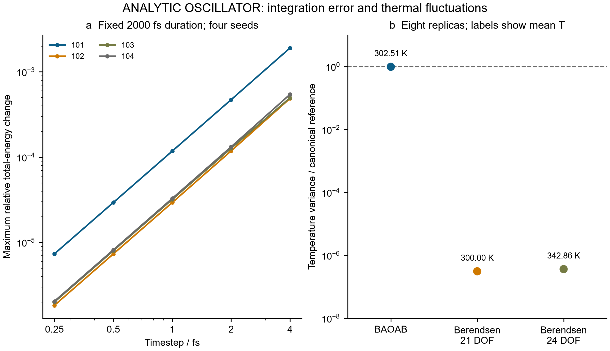
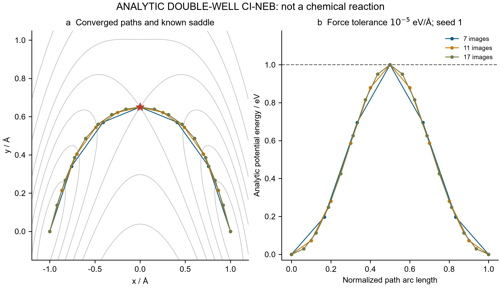
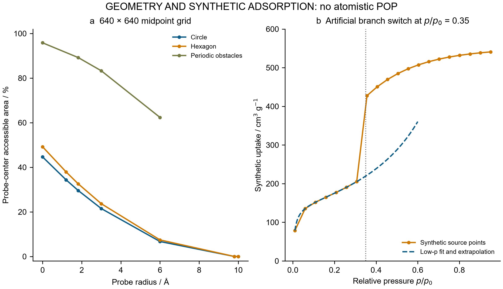

# SynthaPore-Omni: audited execution and numerical research benchmarks

Technical report · 28 September 2026 · English edition

## 1. Execution record and evidence scope

This work executes the supplied SynthaPore source, preserves its failure and output records, and adds controlled numerical benchmarks for equivariant networks, molecular-dynamics algorithms, climbing-image nudged elastic bands, and geometric pore analysis. The demonstrated achievement is reproducible software and numerical verification. It does not establish an accurate chemical force field, an indole activation mechanism, a synthesized porous polymer, or experimental performance.

The untouched program fails because its embedding table has 10 entries while an input atomic number is 29. The compatibility version changes the main constructor's species-table length from 10 to 30. This is one execution repair, with an archived patch. It also changes random-number consumption during initialization; therefore subsequent random weights differ. Claims about the executed model use its saved weights rather than a separately reseeded approximation. The program supplies eight typed coordinates, **C4H2CuN**, and a complete directed graph. This is not a complete 2-phenylindole molecule or an experimentally established Cu coordination environment.

| Captured compatibility output | Value | Evidential interpretation |
|---|---:|---|
| Untrained model parameters | 55,394 | Architecture size, not predictive accuracy |
| MD duration | 150 fs | Executed trajectory under random forces |
| Printed mean temperature | 330.59 K | Recorded source statistic, not equilibrium proof |
| Printed activation barrier | 0.00 kcal/mol | Endpoint maximum; no validated transition state |
| Printed void fraction | 42.5% | Circular endpoint-grid area estimate |
| Printed BET area | 631.2 m²/g | Prescribed synthetic capacity conversion |

Three independently reviewed modules address mathematical questions that can be answered without chemical training labels. All calculations are local software executions using existing CPU environments. No instrument connection, experimental measurement, DFT calculation, molecular free-energy calculation, or grand-canonical Monte Carlo simulation was performed. Institutional wording in the supplied source is provenance, not evidence of institutional endorsement. The immutable [specification](../source/specification.md), [source record](../source/source_record.json), and [captured output](../results/compatibility/captured_results.json) preserve these distinctions.

## 2. Equivariance, charge conservation and supervised denoising

### 2.1 Mathematical audit

An equivariant coordinate update can be constructed from invariant scalar messages and relative vectors:

\[
m_{ij}=\phi(h_i,h_j,\|x_i-x_j\|^2),\qquad
x'_i=x_i+\sum_j(x_i-x_j)\psi(m_{ij}).
\]

Distances remain invariant under an orthogonal transformation, while relative vectors transform covariantly; translation cancels in their differences. External electric fields must transform jointly with coordinates. This architecture principle follows [Satorras, Hoogeboom and Welling](https://proceedings.mlr.press/v139/satorras21a.html); it does not imply accurate energy or force predictions.

The source's radial cutoff does not eliminate all interactions: zero radial features still enter biased message networks alongside node features. With the exact captured weights, edges at distance 8 produce scalar and coordinate changes of 0.0372638 and 0.0196872 despite the nominal cutoff of 6. The reviewed implementation gates the complete messages and vector updates, giving zero changes in the corresponding controlled probe. Dtype-preserving aggregation also repairs a source float64 failure.

For dipole coupling, \(E_f=-\mathbf E\cdot\sum_i q_i(x)x_i\). If charges are translation invariant but their total \(Q(x)\) is unconstrained, translating by \(t\) changes energy by \(-Q\mathbf E\cdot t\), and changes forces by \((\mathbf E\cdot t)\nabla Q\). A constant nonzero charge may legitimately shift the energy origin; geometry-dependent total charge additionally makes the predicted forces origin dependent. The captured model has \(Q=2.80738759\). Translation by (4, −3, 7) under its source field shifts energy by −0.982585669 and changes a force component by up to 0.001329373 in the model's uncalibrated numerical units.

The reviewed potential projects charges as \(\tilde q_i=q_i+(Q_{\rm target}-\sum_jq_j)/N\). For a neutral target, this removes the tested origin dependence; it does not establish local-charge accuracy. Its separate double-precision finite-difference audit reaches a maximum force discrepancy of 5.81×10⁻¹² at displacement 10⁻⁴. The source's single-precision difference deteriorates as displacement shrinks. The architectures and weights differ, so this is not a controlled precision comparison with identical weights. These are differentiation and covariance checks on untrained functions, not comparisons against quantum forces.

### 2.2 A trained, limited denoising task

The supervised task uses 368 distinct synthetic eight-node cycles: 192 training, 48 validation, 64 test planar ellipses, and 64 out-of-distribution warped cycles. Partition generator seeds are 33001–33004. Gaussian coordinate noise has standard deviations 0.08, 0.16 or 0.24 in arbitrary length units; its centroid is removed. Known cycle adjacency and centered noise make this easier than molecular structure generation.

Three 13,176-parameter denoisers train for 60 epochs each with Adam, learning rate 0.003, batch size 32, weight decay 10⁻⁵ and gradient-norm cap 5. Checkpoints are selected only by validation loss; selected epochs are 57, 60 and 60. Baselines are unchanged noisy coordinates, per-input PCA plane projection, and a cycle smoother whose coefficients are fitted on training data. Coordinate RMSE below averages squared Cartesian component errors before taking the square root.

| Method | Test coordinate RMSE | Warped-OOD coordinate RMSE |
|---|---:|---:|
| Noisy identity | 0.162532 | 0.164768 |
| PCA plane projection | 0.146258 | 0.203743 |
| Training-fitted cycle smoother | 0.126434 | 0.132234 |
| EGNN seed 4441 | 0.093198 | 0.138630 |
| EGNN seed 4442 | 0.096786 | 0.126767 |
| EGNN seed 4443 | 0.097257 | 0.124032 |

All three neural fits improve the fixed test-set coordinate metric, but seed 4441 is worse than the smoother on warped OOD shapes. PCA's planarity prior also harms OOD performance. The largest double-precision covariance residual among trained models is 1.78×10⁻¹⁵. Neither this residual nor three seeds on one dataset establishes broad generalization. There is no learned time-dependent score, forward diffusion schedule or reverse sampling chain, so the task is **one-step supervised denoising**, not diffusion generation; see the distinct framework of [Ho, Jain and Abbeel](https://proceedings.neurips.cc/paper/2020/hash/4c5bcfec8584af0d967f1ab10179ca4b-Abstract.html).



**Figure 1.** (a) Coordinate RMSE for six methods on the test and warped-OOD sets, in synthetic length units. (b) Validation coordinate MSE over 60 epochs for three training seeds; validation alone selects checkpoints. These panels measure supervised shape denoising, not molecular generation or chemical accuracy. [Editable SVG](figures/Fig1_Equivariance_Denoising_english.svg).

## 3. Molecular-dynamics algorithm verification

The reviewed MD benchmark contains eight equal masses of 12.011 amu with translationally invariant harmonic energy

\[
U=\frac{k}{2}\sum_i|r_i-\bar r|^2,\quad k=2\ {\rm eV/Å^2},\quad
a_i=F_i/(c_m m_i),\quad c_m=103.64269652680505.
\]

Here \(c_m\) has units eV fs² Å⁻² amu⁻¹. The coincident-particle minimum makes this an oscillator test, not a realistic molecule. Center-of-mass position and momentum are removed; no rotational or bond constraints are imposed, leaving \(f=3N-3=21\) internal Cartesian degrees of freedom.

Velocity Verlet updates positions with \(r_{n+1}=r_n+h v_n+h^2a_n/2\), then velocities with \(v_{n+1}=v_n+h(a_n+a_{n+1})/2\). Exact harmonic solutions provide independent references. Four seeds and five timesteps each cover 2,000 fs; unstable timesteps are rejected and timestamps include the true initial and final states.

| Step / fs | Maximum relative energy-error envelope | Maximum final coordinate RMS error / Å |
|---:|---:|---:|
| 0.25 | 0.0000073361 | 0.0000414194 |
| 0.50 | 0.0000293488 | 0.0001656753 |
| 1.00 | 0.0001174680 | 0.0006626605 |
| 2.00 | 0.0004710357 | 0.0026499698 |
| 4.00 | 0.0019028858 | 0.0105877504 |

The energy statistic is an oscillatory error envelope, not a fitted drift slope. Step-halving orders are 1.96457–2.04409 for that envelope and 1.99041–2.00339 for final coordinates, supporting second-order behavior within this benchmark.

Thermostat comparisons use eight matched seeds per method, timestep 0.5 fs, relaxation time 50 fs, duration 6,000 fs and burn-in 1,000 fs. Langevin uses BAOAB splitting and center-of-mass-projected noise. For the canonical harmonic model, \(2K/(k_BT)\sim\chi_f^2\), giving temperature variance \(2T^2/f=8571.428571\) K² at 300 K. Adjacent samples remain correlated.

| Thermostat | Mean internal temperature / K | Mean within-trajectory variance / K² | Canonical variance ratio |
|---|---:|---:|---:|
| Langevin BAOAB | 302.508228 | 8423.370489 | 0.982726557 |
| Berendsen, 21 DOF | 299.999705 | 0.002660 | 0.000000310355 |
| Berendsen, source 24 DOF | 342.856740 | 0.003125 | 0.000000364530 |

A correct mean under Berendsen does not demonstrate canonical fluctuations. The deliberately inconsistent 24-DOF case tends toward \(300\times24/21\). BAOAB's variance agreement remains subject to finite-time and timestep errors; the integration background is discussed by [Leimkuhler and Matthews](https://arxiv.org/abs/1203.5428).

The source's eV/Å-to-newton conversion is dimensionally correct. Its separate problems are random forces, early timestamps, pre-rescaling telemetry, and laboratory-frame kinetic energy divided by 3N after initially removing COM drift. An external net force can restore bulk motion. Consequently, consistent internal temperature requires subtracting instantaneous drift before choosing degrees of freedom, not merely changing a denominator.

The 30 saved source frames are labeled 0–145 fs but represent updates at 0.5–145.5 fs. Their recomputed mean is 330.586475 K. The source does not return velocities or its complete coordinate trajectory, so an internal-temperature reconstruction is unavailable from the saved telemetry alone.



**Figure 2.** (a) Maximum relative total-energy error versus timestep for four NVE seeds, on logarithmic axes. (b) Mean temperature-variance/canonical-variance ratios for three thermostats, each with eight replicas; annotations give mean internal temperature. The logarithmic variance axis reveals suppressed Berendsen fluctuations in the analytic harmonic benchmark. [Editable SVG](figures/Fig2_MD_Validation_english.svg).

## 4. CI-NEB convergence and source comparison

The independent saddle benchmark is

\[
V(x,y)=(x^2-1)^2+4[y-0.65(1-x^2)]^2.
\]

Its minima are (−1, 0) and (1, 0), with saddle (0, 0.65), barrier 1 eV and Hessian eigenvalues (−4, 8) eV/Ų. The curved valley floor is not assumed to be the minimum-energy path. Perturbed endpoint guesses are minimized first, reaching maximum gradient 9.61×10⁻¹² eV/Å.

Ordinary images combine perpendicular physical force and parallel spring force. Climbing images use \(F_{CI}=F-2(F\cdot\hat\tau)\hat\tau\), following the [climbing-image method](https://doi.org/10.1063/1.1329672). The implementation adds energy-weighted tangents, 50 ordinary updates before climbing, capped image displacements and FIRE-style optimization. Optimizer time is not physical MD time. Both maximum band-force and climbing-image true-force norms must satisfy the threshold; energies are reevaluated at final coordinates.

| Force threshold / eV Å⁻¹ | Cases | Update range | Largest saddle error / Å | Largest barrier error / eV |
|---:|---:|---:|---:|---:|
| 0.001 | 9 | 104–188 | 0.000249073 | 0.000000123954 |
| 0.00001 | 9 | 153–251 | 0.00000219411 | 0.00000000000962830 |

The scan covers 7, 11 and 17 images and three initial-path seeds. All 18 reviewed cases converge and have one negative saddle mode. These are two-dimensional potential-energy saddles, not molecular activation free energies.

An unchanged source NEB class is also run against this analytic potential. All 12 cases report “converged”, but 10 fail an independent 10⁻⁵ eV/Å criterion. The two passing 150-update cases remain positive controls. After one update, its stored barrier is still 2.69 eV although updated coordinates give 1.781456 eV: a 0.908544 eV stale-energy discrepancy. A nearly correct rounded barrier after 45 updates similarly does not prove whole-band convergence.

For the actual captured untrained source model, the printed 0.00 kcal/mol results from including the reference endpoint in the maximum while all other displayed relative energies are negative. Its nominated interior image therefore cannot be accepted as a transition state from that output. The finite update budget, unrelaxed endpoints, absence of a force-based stopping rule and absence of molecular vibrational analysis remain material limitations.

An exact saved-weight replay reproduces the captured return. Independent final-coordinate evaluation gives a maximum projected atomic force of 0.009773735 in nominal eV/Å, endpoint forces 0.005495586 and 0.005935186, and a shortest band pair distance of 0.169807479 Å. The largest stale energy difference is 8.22544×10⁻⁶ in nominal eV. These labels describe the source's assumed units, not a calibrated chemical energy scale. Its NEB calculation also omits the external field used for MD. The [source audit](../results/source_audit.json) retains the complete distinction.



**Figure 3.** (a) Analytic potential contours and converged 7-, 11- and 17-image paths for seed 1 at force tolerance 10⁻⁵ eV/Å; the red star marks the known saddle. (b) Their potential energies versus normalized path arc length; the dashed line is the exact 1 eV barrier. These are reviewed analytic paths, not the source fragment's reaction mechanism. [Editable SVG](figures/Fig3_NEB_Validation_english.svg).

## 5. Geometric accessibility and synthetic adsorption inversion

The source's probe-radius argument is never read: eight class-only calls spanning two cell lengths and four probe radii confirm identical answers at each cell length. Its circular mask supplies no hcb network or atomistic framework. At cell length 26 Å, the exact zero-probe circular fraction is 44.632923%, compared with the source's coarse-grid 42.5%.

Three artificial two-dimensional geometries occupy a 26 Å square: circular and regular hexagonal channels of inradius 9.8 Å, and a periodic solid disk of radius 3 Å centered at (12.4, 2.5) Å. Probe-center areas are \(\pi\max(R-r_p,0)^2\) and \(2\sqrt3\max(a-r_p,0)^2\) for the channels. Hexagonal a is the apothem. Periodic displacements use \((\Delta+L/2)\bmod L-L/2\); expanded-disk overlaps are handled analytically.

Fifteen midpoint clearance fields across resolutions 40–640 yield 90 probe masks. The finest maximum area-fraction error is 0.000474912; minimum-image distances agree with nine-cell enumeration within 3.55×10⁻¹⁵ Å. At probe radius 1.82 Å, exact accessible fractions are 0.295943605 for the circle, 0.326324521 for the hexagon and 0.892031454 outside the periodic disk. These are benchmark geometry results, not POP porosities.

The 120 histogram rows describe area-weighted distance to the nearest wall. CDF errors at 123 checked bin edges reach at most 0.000687445. This is not a distribution of pore diameters. Probe-center area, probe-occupiable area, surface area and volume must also be distinguished; the [Zeo++ documentation](https://www.zeoplusplus.org/examples.html) clarifies these definitions, although Zeo++ itself was not run.

The source adsorption formula switches branches at relative pressure 0.35, from 219.531691 to 424.311058 cm³/g, a 204.779367 jump. No hysteresis or Type IV classification follows from this imposed switch. BET linearization fits \(p/[V(1-p)]=i+sp\), with \(V_m=1/(s+i)\) and \(C=1+s/i\). Failed positivity, residual and selected consistency diagnostics are retained.

| Rounded source fitting window | Vm / cm³ g⁻¹ | C | Diagnostic |
|---|---:|---:|---|
| 0.01–0.30 | 145.000199 | 114.998314 | Recovers prescribed low branch |
| 0.10–0.35 | 145.002011 | 114.965103 | Monolayer pressure outside window |
| 0.01–0.45 | 235.485444 | 10.566237 | Nonmonotonic V(1−p) |
| 0.35–0.95 | 48.803456 | −1.189751 | Negative C; area withheld |
| 0.01–0.95 | 65.615805 | −3.775999 | Negative C; area withheld |

Twenty-four deterministic fits include exact BET controls. An additional 64-seed, mean-one lognormal perturbation benchmark supplies 384 observations and 128 fits. Removing the lowest-pressure point widens fitted-C repetition quantiles from 104.439–136.165 to 93.963–166.296. These are conditional synthetic-noise ranges, not experimental confidence intervals. Conventional area conversion states nitrogen cross-section 0.162 nm² and STP molar volume 22414 cm³/mol; fit validity remains a separate issue, as discussed in [NIST SP 960-17](https://nvlpubs.nist.gov/nistpubs/Legacy/SP/nistspecialpublication960-17.pdf).



**Figure 4.** (a) Probe-center accessible area fractions on the 640² midpoint grid for three artificial geometries. (b) Twenty rounded source isotherm points and the BET fit using only relative pressures 0.01–0.30, extrapolated to 0.60; the vertical line marks the imposed 0.35 branch switch. These are synthetic data, not an experimental isotherm or measured PSD. [Editable SVG](figures/Fig4_Pore_Adsorption_english.svg).

## 6. Reproducibility, computational scope and research limits

| Main reviewed workload | Executed count | Separate pilot |
|---|---:|---|
| Denoiser fits / epochs | 3 / 180 | 1 / 2 |
| Analytic MD trajectories / steps | 44 / 350,000 | 4 / 700 |
| Reviewed NEB cases / updates | 18 / 3,129 | 1 / 135 |
| Unchanged-source analytic NEB cases / updates | 12 / 618 | 2 / 46 |
| Geometric point evaluations / masks | 1,636,800 / 90 | 24,000 / 36 |
| BET fits | 152 | 40 |

Main MD requires 350,044 energy/force evaluations. Reviewed NEB contributes 37,337 image-point evaluations plus 36 endpoint checks; unchanged-source analytic cases contribute 7,210 plus 140 post-update audit points. Two endpoint minimizations use 778 evaluations. Pilot and unit-test runs are excluded. Network mathematical audits, exact-captured-weight checks, and the source execution are separate recorded work, not additions to the denoiser training count.

The main small-model energy audit contains 244 potential energy/force evaluations and 124 charge-only forwards. A separate exact-captured-weight audit adds 157 energy/force evaluations and one charge-only forward. The exact source NEB replay uses 315 calls and seven final-band evaluations; it does not rerun MD. Additional isolated layer and dtype probes are itemized in the corresponding audit JSON files.

From the repository root, reproduce the principal runs with:

```bash
python synthapore/scripts/run_source.py
python synthapore/scripts/equivariant_reviewed.py
python synthapore/scripts/dynamics_reviewed.py
python synthapore/scripts/pore_reviewed.py
python -m unittest discover -s tests -p "test_synthapore_*.py" -v
```

Each reviewed script also supports `--pilot`. The three [equivariant](../results/equivariant/summary.json), [dynamics](../results/dynamics/summary.json) and [pore](../results/pore/summary.json) summaries record versions, seeds, counts and hashes. Per-shape errors, checkpoints, final bands, force histories, grid tables and rejected fits remain inspectable. MD telemetry samples the first seed per configuration; all replica aggregates and NVE initial/final states are retained. See the [module entry point](../README.md), [publication checks](../results/publication_validation.json), and [figure review record](../results/figure_qa.json) for release verification.

Scientific advancement requires structure identities and charge states, reference electronic energies and forces, independent chemical test sets, physically justified boundary conditions, converged molecular endpoints and saddle validation, and real periodic framework coordinates with stated radii and mass. Solvent, entropy and electrode treatment would be needed before interpreting activation free energies. The present suite supplies tested numerical components and explicit failure evidence; it does not supply those missing physical foundations or justify publication or industrial-readiness claims.
