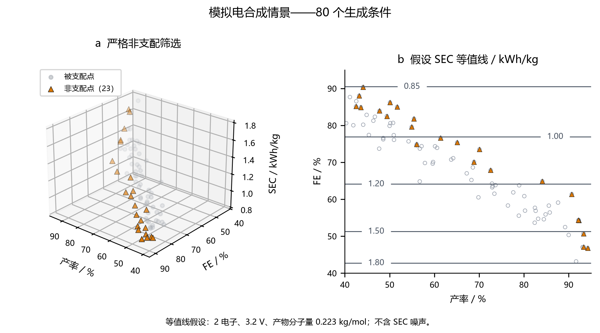
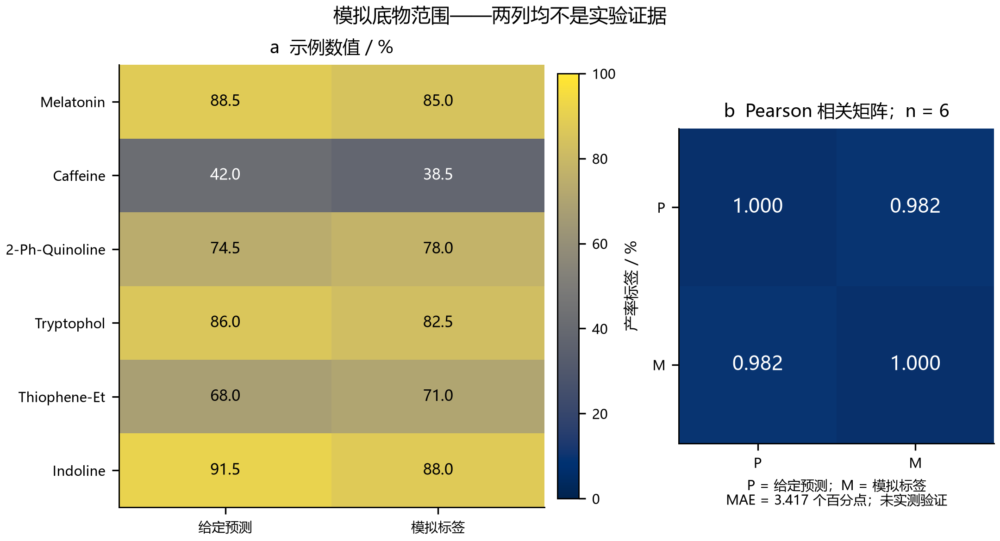
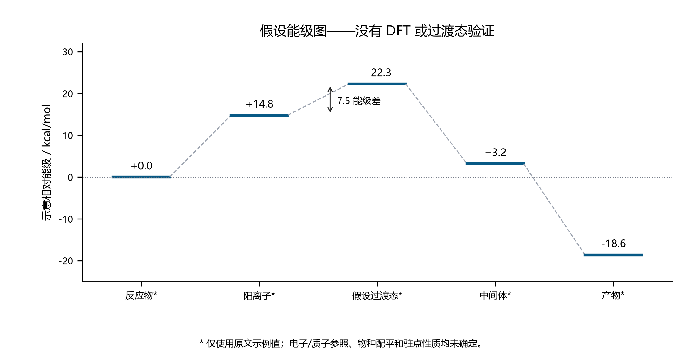
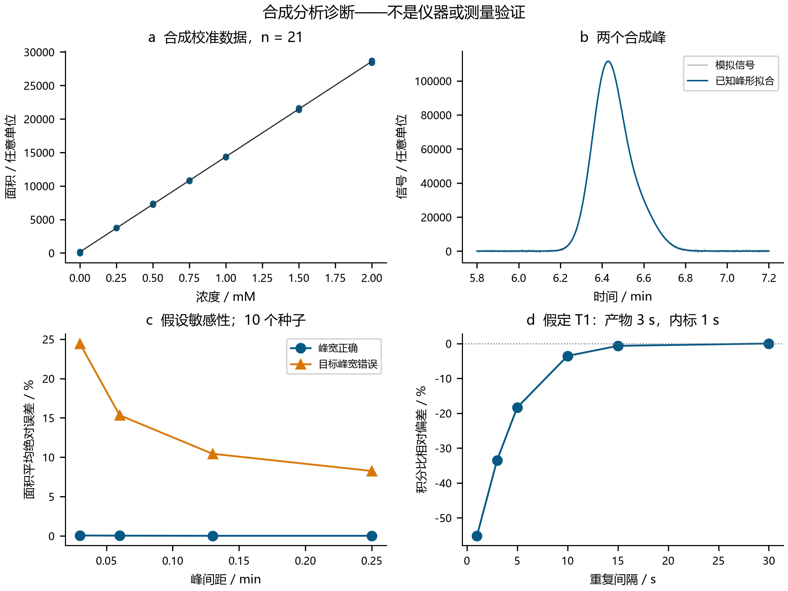

# 科研级 AI4S 实战套件：分析定量、学术图表与大学生科研申报

独立中文完整版 · 2026 年 9 月 28 日

**摘要。** 本工作保留并执行附件三个模块的 Python 逻辑。原程序的数值结果不支持其“HPLC/NMR 一致”“湿实验验证”或“DFT 机理”的表述。独立核算得到 HPLC 产率 1292.00%，原 NMR 示例产率 91.392%，相差 1200.608 个百分点。本次交付保留异常原值，新增带证据来源检查的预积分数据导入、100,000 次不确定度情景抽样、80 组模拟峰恢复、严格 Pareto 分析及 2,000 次扰动、八组按语言区分的 PNG/SVG 图表和完整大创申报书。这些属于实际执行的数值计算与文档成果；没有新增原始仪器数据、湿实验、DFT 能量、立项或提交记录。

## 1. 工作范围、执行记录与证据类型

### 1.1 交付内容及与前版报告的关系

最新附件要求分析解析、三幅学术图表和国家级大学生创新训练申报书。其第 3 节是终端执行说明，并未另定报告结构。本报告以五部分完整覆盖三个模块与新增审计；仓库前几版按各自第 3 节组织的报告继续保留。[英文版](deployment_toolkit_report_english.md)包含相同分析。申报书独立提供[完整中文内容稿](../proposals/National_Undergraduate_Grant_Proposal_PanTang_Lab.md)与[完整英文对应稿](../proposals/National_Undergraduate_Grant_Proposal_PanTang_Lab_English.md)。

项目当前是可复现的研究原型。程序运行完成、分析方法有效、仪器接入成功、前瞻优化有效和化学发现是不同层级的结论。应先为一个身份明确的反应建立可信标签，再决定是否扩展底物、多孔有机聚合物（POP）配位微环境或微流动体系。

### 1.2 原程序执行与代码提取修复

附件原文保存在 [specification.md](../source/specification.md)。原“一键执行”正则会在申报书字符串内部的 Markdown 围栏处提前结束，导致三引号字符串未闭合。因此实际提取范围为第 3 节前的完整外层 Python 代码块，只统一 LF 换行并增加末尾换行，未改动程序逻辑。归档脚本 SHA-256 为：

`73938741e18cf74bd5d45efe18a1e8d147c1b08d3367970eecfe4d2c8112f154`

原程序返回码为零，生成 JSON、三幅 PNG 和申报书，均保留在 [results/original](../results/original/README.md)。其中 stdout 仍宣称两种方法一致；保留该文本是为了审计来源，不代表认可结论。[执行元数据](../results/original/execution.json)和[提取记录](../source/source_record.json)分别说明软件状态与证据边界。本轮复用已安装环境，没有安装新的 DFT 或仪器软件。

### 1.3 证据标识

| 标识 | 本报告中的含义 | 边界 |
|---|---|---|
| [L] | 一手文献或官方公开资料 | 不证明本项目的设备权限或反应性能 |
| [S] | 附件给定值 | 可能是假设、近似或内部不一致的数据 |
| [A] | 本次实际执行的算术或数值计算 | 结论取决于输入与方程 |
| [M] | 合成数据或假设模型 | 不是实测结果或已训练化学模型的预测 |
| [P] | 拟开展研究或预算 | 尚未执行、获批或获得经费 |
| [U] | 未知或未核实 | 不用精美输出替代缺失证据 |

本套件没有新增量子化学作业。仓库早期计算有独立记录，不能拿来证明本附件五个示意能级。新增数值结果索引见 [audit_summary.json](../results/audit/audit_summary.json)。

## 2. 分析定量与额外计算

### 2.1 HPLC 物料衡算及一致性判断失败

绝对峰面积校准采用斜率 a、截距 b，计算约定为 C_meas=(A−b)/a，单位 mM；C_reaction=C_meas D；n_product=C_reaction V_mL/1000，单位 mmol；Y=100 n_product/n0。D 为总稀释倍数。产率范围检查假设一个限制底物分子对应一个目标产物分子；其他化学计量必须明确修改定义。

| 量 | 给定值或重算值 | 解释 |
|---|---:|---|
| 峰面积 [S] | 245600 | 绝对面积，不是内标面积比 |
| 校准斜率 [S] | 14250 | 面积单位/mM |
| 校准截距 [S] | 120 | 面积单位 |
| 稀释倍数 [S] | 25 | 未提供稀释链记录 |
| 反应体积 [S] | 6.0 | mL |
| 初始底物 [S] | 0.2 | mmol |
| 测得浓度 [A] | 17.226667 | mM |
| 还原至反应液的浓度 [A] | 430.666667 | mM |
| 还原得到的产物量 [A] | 2.584000 | mmol |
| HPLC 产率 [A] | 1292.000000 | 百分数；不满足所假定物料衡算 |
| 原 NMR 产率 [S,A] | 91.392000 | 百分数；峰归属和采集条件未验证 |
| 两方法绝对差值 [A] | 1200.608000 | 个百分点；不能判为一致 |

正确处理是保留原计算值并报警，不能裁剪到 100%，也不能偷偷调整稀释倍数。原校准的真实适用范围未知；后文另行生成的模拟校准范围不能当作原仪器的范围。其他输入不变时，满足 100% 产率的最大面积为 19120.00。

三组单字段反事实量化了偏差规模：假如原 NMR 量正确，每次仅改变一个字段，匹配它分别需要面积 17484.48、稀释倍数 1.768421 或体积 0.424421 mL。这些不是批准采用的修正，也不能识别究竟哪个原始字段有误。必须回查真实稀释与校准记录。详见 [concordance_counterfactuals.csv](../results/audit/concordance_counterfactuals.csv)。

### 2.2 定量核磁：物质的量、峰归属与取样

质子数归一化方程为 n_product=((I_product/H_product)/(I_standard/H_standard)) × (m_standard/M_standard) × p/f，其中 p 为内标纯度，f 为所分析样品代表的反应份额。质量用 mg、分子量用 g/mol 时，m/M 得到 mmol。给定积分 5.12 和 3、质子数 1 和 3、内标质量 6 mg、分子量 168.19，并令 p=f=1，重算内标量为 0.0356739402 mmol，产率为 **91.3252869%**。原 91.392% 使用了四舍五入的内标量 0.0357 mmol。该近似只解释两种 NMR 算法的小差异，不能解释 HPLC 异常。

[qnmr_scenarios.csv](../results/audit/qnmr_scenarios.csv)保存了纯度 1、0.995、0.99、0.98 与取样份额 1、0.5、0.25 的十二种组合。积分比和内标质量不变而降低 f，相当于不同取样情景，并不是对某个已知分样记录的重新解析。超出物料衡算的值继续保留并标记。

原文提出用吲哚 C3–H 定量 C3 官能团化产物。但 C3 取代已经移除了该氢，不能继续拿它代表产物量。真实产物身份、独立归属且不重叠的信号、内标纯度和原文建议的化学位移均待核实。[BIPM qNMR 资源](https://www.bipm.org/en/organic-analysis/qnmr)与 [ACS 绝对 qNMR 指引](https://pubsapp.acs.org/paragonplus/submission/jmcmar/jmcmar_purity_instructions.pdf)支持可追溯标准与规范积分条件，但不能证明一份从未提供的谱图有效。[L,U]

### 2.3 不确定度及弛豫敏感性

100,000 次抽样使用人为指定的独立正态误差：面积标准差 1%、斜率 2%、截距 20 面积单位、稀释倍数 1%、体积 0.5%、底物量 0.5%、产物积分 1%、内标积分 0.5%、内标质量 0.5%。两种方法共用同一组底物量抽样，内标纯度固定为一。这些是敏感性假设，不是根据实测重复或校准数据估出的不确定度。

| 情景量 [A,M] | 2.5 分位数 | 中位数 | 97.5 分位数 |
|---|---:|---:|---:|
| HPLC 产率 / % | 1230.038231 | 1291.844559 | 1358.927534 |
| 质量重算 NMR 产率 / % | 88.944455 | 91.322973 | 93.709782 |
| HPLC 减 NMR / 个百分点 | 1138.793695 | 1200.545471 | 1267.498968 |

所有 HPLC 抽样值仍高于 100%，说明在这个情景下，小幅输入误差不能使两方法相容。这些区间不能称为已验证的置信区间。真实测量评估还需要斜率与截距协方差、重复性、样品制备、内标纯度不确定度及相关项。

另以理想重复 90 度脉冲模型计算相对响应比 (1−exp(−tau/T1_product))/(1−exp(−tau/T1_standard))，假定产物与内标 T1 为 3 s 和 1 s。tau=5 s 时积分比偏差约 −18.34%，15 s 时约 −0.674%。tau 是完整重复间隔，不能直接等同于仪器单独设置的弛豫延迟。六个情景说明不等饱和的影响；真实 T1、脉冲、采集及处理条件仍需对样品测定。详见 [relaxation_scenarios.csv](../results/audit/relaxation_scenarios.csv)。

### 2.4 合成校准与峰重叠恢复

模拟校准覆盖 0–2 mM 的七个已知浓度，每点三次，由 A=14250 C+120 加标准差 100 的正态面积噪声生成，种子为 2709。普通最小二乘斜率为 14222.722351，截距为 139.522285。按“斜率、截距”排序的协方差矩阵为 [[928.757202, −796.077602], [−796.077602, 1078.021752]]。它仅描述所假设模型下的合成回归，没有模拟标准溶液浓度制备误差。

合成色谱含 1401 个点、两个按面积归一化的高斯峰、线性基线和独立信号噪声。目标峰与干扰峰面积为 17500 和 7000，名义峰宽为 0.07 和 0.09 min。求解器在**已知峰中心与峰宽**时，用线性最小二乘拟合基线、基线斜率及两个面积。四种间距、两种目标峰宽情景、十个种子，共 80 组。失配情景按 0.08 min 生成目标峰，但仍按 0.07 min 拟合。

| 峰形情景 [A,M] | 目标面积平均绝对误差 / % | 目标面积最大绝对误差 / % |
|---|---:|---:|
| 已知峰宽正确 | 0.027363 | 0.165362 |
| 目标峰宽设错 | 14.614337 | 24.534740 |

低残差或较小的条件 OLS 标准误差不能排除峰形模型错误。逐例结果同时保存设计矩阵条件数、条件面积标准误差和固定窗口积分对照。窗口对照使用已知真实基线，因此属于偏乐观的参照，不是通常的原始仪器积分流程。两种方法都不识别峰的化学身份。本实验揭示数值模型的失效方式，不构成色谱方法学验证。[恢复汇总](../results/audit/synthetic_recovery.json)、[全部情景](../results/audit/deconvolution_recovery.csv)。

### 2.5 解析器实际支持的输入

新增命令行接口接收**已经积分的 CSV**，提供 [HPLC 样例](../data/source_integrated_area.csv)、[NMR 样例](../data/source_nmr_integrals.csv)和[数据字典](../data/README.md)。它不直接解码仪器厂商色谱格式、NMR FID，不完成相位处理或自动峰归属。接口拒绝证据角色不匹配、错误单位、空缺/重复样本编号、非法分母及缺失的实验来源记录。HPLC 仅支持绝对面积，单位显式采用 mM/mL；NMR 需要质子数、质量、纯度和取样份额。

标为 experimental 的行还必须提供元数据和哈希匹配的本地文件：HPLC 需要原始文件与校准文件；NMR 需要原始文件、内标证书、峰归属及弛豫记录。这只能证明文件身份与记录完整性，任意文件具备哈希并不会自动变成有效实验。两个解析器始终返回 `measurement_validated=false`，仍需针对具体方法审查。当前没有真实实验数据用于验证厂商格式兼容性或法规层面的方法性能。

## 3. 学术图表、多目标分析与机理边界

### 3.1 严格 Pareto 筛选与能耗量纲

以相同 legacy seed-42 随机生成器复现原 80 个点。原“产率 >80%、FE >65%、SEC <2.5”规则选出零点。阈值定义的是可行域，不能代替支配关系。修订算法最小化 (−产率、−FE、SEC)：只有不存在另一点在所有指标上不差、且至少一项更好时，才保留该点。完全相同的重复点都保留为非支配点。结果为 **23 个非支配点**，原规则遗漏了全部 23 个。

固定电子数 z、电压 U、分子量 M，且 FE 为小数时，假定单位电耗为 zFU/(3.6×10^6 M FE)，单位 kWh/kg。z=2、U=3.2 V、M=0.223 kg/mol 对应分子常数 0.7691904733 kWh/kg。因此原 SEC 是 FE 倒数的确定函数加噪声，并不是三个独立化学目标的证据。去除 SEC 噪声后，非支配点减为 15 个。原文未定义实际产物及分子量；恒压模型也未计入后处理、冷却或材料制造的能耗。

新增 2,000 次扰动使用独立且不截断的正态噪声，产率与 FE 标准差各 2 个百分点，SEC 为 0.03 kWh/kg。每点进入前沿的比例属于敏感性统计，不是用真实实验噪声校准的概率。真实优化还需电压—电流—时间记录、明确产物质量及配平的电子计量。[全部条件与入选比例](../results/audit/pareto_conditions.csv)。



**图 1。** 80 个生成条件的电合成目标情景。橙色三角形为严格非支配点，灰点为被支配点；右侧等值线采用图中明确给出的恒电压、分子量假设并去除 SEC 噪声。图中没有实测最优条件。[可编辑 SVG](figures/Fig1_Pareto_Electrosynthesis_chinese.svg)。

### 3.2 底物范围热图与描述性指标

原“热图”实际是柱状图，比较六个写死的“预测”和“湿实验验证”数组；没有对应的训练模型、原始分析或反应记录。修订版将列名明确改为**给定预测**和**模拟标签**，统一色标为 0–100%，并标注每格数值。为追溯而保留原底物字符串，其中“Thiophene-Et”不足以唯一确定化学结构。

| 六对给定值的指标 [A,S] | 数值 | 含义 |
|---|---:|---|
| MAE | 3.416667 | 个百分点 |
| RMSE | 3.421744 | 个百分点 |
| 预测减模拟标签的平均差 | 1.250000 | 个百分点 |
| Pearson 相关系数 | 0.982099 | 描述性关联 |
| 相对模拟标签均值的 R² | 0.958043 | 描述性误差归一化 |
| 逐一删除后的最小相关系数 | 0.980708 | 每次去掉一对后重算 |
| 逐一删除后的最大相关系数 | 0.990117 | 每次去掉一对后重算 |

逐一删除只是描述性的影响检查，不是留一模型验证，因为没有模型可重新训练。人为选定数组的高相关不能证明化学泛化能力。还需要前瞻实测、独立反应重复、预定对照和留出评价。[原始成对数值](../results/audit/scope_mock.csv)、[删除诊断](../results/audit/scope_leave_one_out_descriptive.csv)。



**图 2。** 六对给定示例值及 Pearson 相关矩阵，两列均不是实验证据。[可编辑 SVG](figures/Fig2_Substrate_Scope_Heatmap_chinese.svg)中的热图及色标采用矢量图元；数值标注使读者无需仅依赖颜色判断。

### 3.3 假设能级图与分析诊断图

原五个能级为 0.0、14.8、22.3、3.2、−18.6 kcal/mol，相邻差为 14.8、7.5、−19.1、−21.8 kcal/mol。虽然原标题给出 DFT 方法名，程序实际仅绘制这些常数。没有电子结构输出、配平物种、溶剂/温度/标准态、自旋检查、驻点频率、过渡态连接或电子/质子库。因此 7.5 kcal/mol 只是两个假设能级的差，不是已经确定的活化自由能。本报告不由此推导 Eyring 速率、区域选择性或机理结论。[给定能级](../results/audit/hypothetical_energy.csv)。



**图 3。** 原文给定的示意能级。虚线仅引导阅读，不表示已计算反应路径；星号提示化学状态未定义。[可编辑 SVG](figures/Fig3_Reaction_Energy_Profile_chinese.svg)。



**图 4。** 新增合成分析诊断：校准、双峰信号与已知峰形拟合、峰宽失配下的目标面积误差、理想化 qNMR 饱和偏差。c 图为每个峰间距十个种子的绝对误差均值。各子图检验数值假设，不评价真实仪器性能。[可编辑 SVG](figures/Fig4_Analytical_Quality_Control_chinese.svg)。

### 3.4 输出格式与图表质量核验

四幅图分别提供英文和中文，每种语言均有 300 DPI PNG 与文字可编辑 SVG，共 16 个文件。PNG 预览不是矢量图；SVG 的热图、色标、线条与文字均使用矢量表示，没有嵌入栅格图。文件哈希、尺寸、PNG DPI 及源数据哈希见 [figure_manifest.json](../results/figure_manifest.json)。统一宽度为 7.2 英寸，约 183 mm。

[Nature 图表制作指引](https://research-figure-guide.nature.com/figures/building-and-exporting-figure-panels/)支持可编辑矢量内容、清晰文字与可辨配色。本图遵循这些一般原则，但不能宣称已经满足任何目标期刊的全部当前面板、字体与投稿要求。复用时必须保留合成数据标注。PNG 预览和独立渲染的 SVG 均核对文字、边界、图例与数字位置，见[图表 QA 记录](../results/figure_qa.json)。其他机器可能替换可编辑文字字体，中文尤其需要确认；具体投稿还需按最终版面尺寸复查。

## 4. 国家级大学生科研申报

### 4.1 完整内容稿与聚焦后的研究问题

[中文申报书](../proposals/National_Undergraduate_Grant_Proposal_PanTang_Lab.md)和[英文申报书](../proposals/National_Undergraduate_Grant_Proposal_PanTang_Lab_English.md)各含十二节：摘要、依据、目标、研究内容、路线、创新与基础、条件、进度、经费、风险、成果及申报说明/参考资料。保留 AI4S 与电化学 C–H 官能团化的大主题，把首年核心聚焦到可信定量和基于实测的多目标推荐。POP 与微流动列为条件允许时的扩展，不预先承诺建成平台。

拟检验的问题是：对于明确反应，可信分析标签和相同预算的对照，序贯推荐能否带来可重复的效率优势。[Leech 与 Lam](https://www.nature.com/articles/s41570-022-00372-y)提供电合成方法背景，[Shields 等](https://www.nature.com/articles/s41586-021-03213-y)提供贝叶斯反应优化的一手研究实例。两篇文献均不能证明一个尚未定义反应的新颖性或性能；导师确定反应后需要开展专题检索。

### 4.2 平台条件与申报状态核实

学校 [2026 年大创公告](https://www.gxnu.edu.cn/2026/0603/c1441a343392/page.htm)发布于 2026 年 6 月 3 日，内容为推荐/结题结果，不能证明本报告日期有新申报窗口开放。下一轮截止日和当年正式表格仍未核实。[教育部 2019 年管理文件](https://www.moe.gov.cn/srcsite/A08/s5672/201907/t20190724_392132.html)通过官方索引文本核实了文号及一般培养原则，但直连全文受限，不能声称完整核查了现行适用条款。

公开的 [600M 核磁设备条目](https://dypt.gxnu.edu.cn/genee/equipment/61)只能证明学校有该设备公示，不能证明本项目已获预约、收费、操作者权限或课题组所有权，也不足以支撑原文“500 MHz NMR、HPLC-MS、多通道电化学、流动装置及充足超算”整套承诺。学校[科研机构目录](https://www.gxnu.edu.cn/1382/list.psp)含历史名称标记，而 [2026 年活动公告](https://gxttc.gxnu.edu.cn/2026/0317/c10229a337773/page.htm)仍使用旧实验室名称，因此正式依托名称留待学院确认。[学校科研新闻](https://news.gxnu.edu.cn/2023/0519/c1330a267710/page.psp)支持潘—唐团队与研究方向相关，不代表其已同意指导本申报。

### 4.3 时间、样本预算与经费核算

原文 2026 年 9 月至 2028 年 5 月按月初相差 20 个月，含首尾月份为 21 个日历月份，并非完整 24 个月。修订稿建议从正式批准后执行 12 个月，日期最终以通知为准。最多 40 次反应分为 24 次探索训练、6 次冻结留出、6 次独立重复和4 次化学对照，须与技术重复进样分开。策略分配与等预算比较在实验前明确，不能把同一批 40 次反应算成每种策略各有 40 次。

| 拟定开支 [P] | 数量 | 假设单价/元 | 小计/元 |
|---|---:|---:|---:|
| 试剂与溶剂 | 1 | 2500 | 2500 |
| 电极与耗材 | 1 | 1000 | 1000 |
| 标准品与色谱柱 | 1 | 2000 | 2000 |
| HPLC 进样 | 120 | 15 | 1800 |
| NMR 样品 | 20 | 100 | 2000 |
| CPU 试算 | 1 | 200 | 200 |
| 归档与展示 | 1 | 500 | 500 |
| 合计 | — | — | 10000 |

HPLC 预算由 40 次反应各两次技术进样的 80 针、校准 21 针和空白/QC 19 针构成。表中是计划估算，不是平台报价、已实现通量或获批经费。资源不足时缩小化学范围，同时保留校准、对照和证据记录；不承诺必然发表特定数量的一区论文、获得专利或竞赛奖项。

## 5. 复现、核验及科研成熟度

### 5.1 复现顺序

在已记录的科学 Python 环境中，从仓库根目录运行。归档计算采用单 CPU 线程。原程序封装器会重新生成其专属目录中的原始执行输出，发布过程中仅在确实需要重建这些记录时运行。

```bash
python toolkit/scripts/run_original.py
python toolkit/scripts/audit_toolkit.py
python toolkit/scripts/plot_reviewed.py
python toolkit/scripts/validate_toolkit.py
python -m unittest discover -s tests -p test_toolkit.py
```

自定义导入使用新的输出目录，例如：

```bash
python toolkit/scripts/audit_toolkit.py --input-csv toolkit/data/source_integrated_area.csv --assay hplc --role source_example --output work/toolkit-hplc-import
python toolkit/scripts/audit_toolkit.py --input-csv toolkit/data/source_nmr_integrals.csv --assay nmr --role source_example --output work/toolkit-nmr-import
```

依赖版本及固定种子记录在脚本和结果汇总中。现有 Windows 数值环境需将其 BLAS/runtime DLL 目录加入 PATH，这是环境配置要求，不是科研结论。发布文件不含凭据、用户目录路径或个人申报资料。

### 5.2 验收检查及边界

[套件校验器](../scripts/validate_toolkit.py)检查来源哈希、原程序执行、预期行数、数值锚点、中英文表格数值一致性、本地链接、证据标签、图表元数据及申报书完整性。单元测试覆盖量纲转换、异常值、证据角色、文件哈希、Pareto 重复点及独立支配判定、已知模拟峰的面积恢复。仓库整体检查继续覆盖前版交付和归档完整性，结果见[套件校验记录](../results/publication_validation.json)与[仓库校验记录](../../provenance/release_validation.json)。

这些检查评价软件和文档，不认证测量准确度、反应安全性、化学新颖性、未来数据模型的有效性或申报获奖资格。已知正确峰形时，合成恢复表现很好属于预期；峰宽错误时的负结果更能提示真实应用对模型假设的依赖。

### 5.3 尚未解决的科学问题

关键缺失证据是明确产物与计量、真实色谱和核磁、可追溯校准及样品制备、电荷/电压轨迹、独立反应结果、资源授权，以及在提出机理时已经完成并核验的电子结构计算。本次交付给出可审阅工具与完整申报内容稿，用于后续取得这些证据，不能把给定常数转写为实验发现。资料访问范围和限制记录在 [sources.json](../results/sources.json)。
