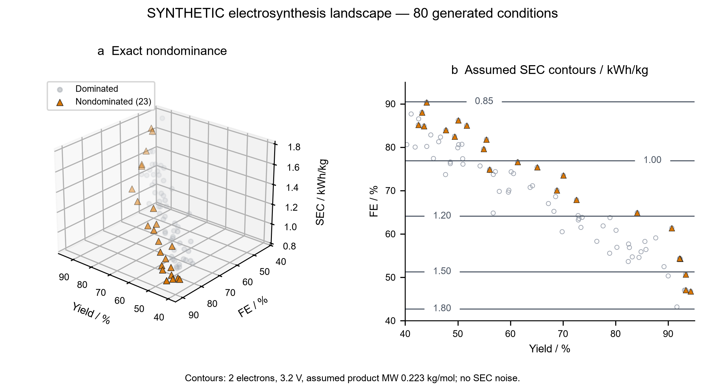
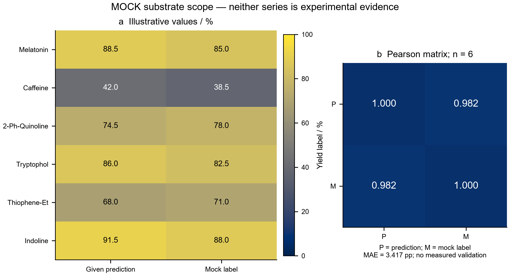
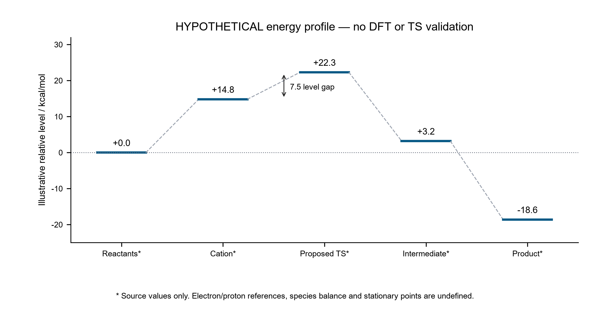
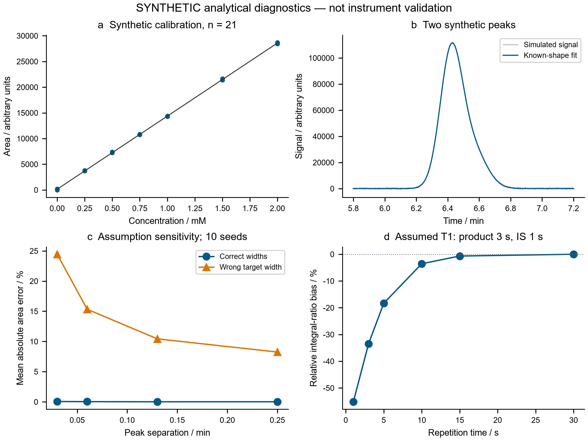

# Research-grade AI4S toolkit: analytical quantification, publication graphics and an undergraduate research proposal

Independent English edition · 28 September 2026

**Abstract.** The supplied three-module toolkit was executed without changing its Python logic. Its numerical output does not support its claims of HPLC/NMR concordance, wet-lab verification or a DFT mechanism. Independent bookkeeping gives an HPLC yield of 1292.00% and the source NMR yield of 91.392%, a difference of 1200.608 percentage points. This release preserves those results, adds provenance-aware import of pre-integrated measurements, 100,000 uncertainty-scenario draws, 80 synthetic peak-recovery cases, exact Pareto analysis with 2,000 perturbations, eight language-specific figure pairs, and a complete undergraduate grant proposal. These are executed numerical and documentary deliverables. No raw instrument dataset, new wet-lab result, DFT energy, grant approval or submission is claimed.

## 1. Scope, execution and evidence

### 1.1 Deliverables and relation to earlier reports

The latest attachment requests analytical parsing, three scientific figures and a national undergraduate innovation-training application. Its Section 3 gives execution instructions rather than a new technical-report structure. This five-section report covers all three requested modules and the additional audit; the earlier section-aligned reports remain unchanged in the repository. The [Chinese edition](deployment_toolkit_report_chinese.md) contains the same analysis. The proposal is a separate [complete Chinese application draft](../proposals/National_Undergraduate_Grant_Proposal_PanTang_Lab.md), with a [full English counterpart](../proposals/National_Undergraduate_Grant_Proposal_PanTang_Lab_English.md).

The project is currently a reproducible research prototype. Software completion is distinct from analytical validity, instrument integration, prospective optimization performance and chemical discovery. The immediate research priority is trustworthy labels for a clearly identified reaction, before expansion into multiple substrates, POP coordination environments or microflow operation.

### 1.2 Original execution and extraction repair

The source attachment is preserved in [specification.md](../source/specification.md). The suggested regular expression stops at a Markdown fence inside the grant-proposal string and produces an unterminated triple-quoted-string error. Extraction therefore used the complete outer Python block ending before Section 3. Line endings were normalized to LF and a final newline was added; Python logic was unchanged. The archived script SHA-256 is:

`73938741e18cf74bd5d45efe18a1e8d147c1b08d3367970eecfe4d2c8112f154`

The original execution returned zero and generated JSON, three PNGs and a proposal in [results/original](../results/original/README.md). Its stdout still asserts concordance; that assertion is retained as source evidence, not endorsed. [Execution metadata](../results/original/execution.json) and [extraction provenance](../source/source_record.json) separate execution status from scientific interpretation. Installed dependencies were reused; no new DFT or instrument software was installed.

### 1.3 Evidence vocabulary

| Label | Meaning in this report | Boundary |
|---|---|---|
| [L] | Primary literature or official public source | Does not establish local equipment access or this reaction's performance |
| [S] | Values supplied in the attachment | May be hypothetical, rounded or internally inconsistent |
| [A] | Arithmetic or numerical calculation executed here | Validity depends on stated inputs and equations |
| [M] | Synthetic data or assumed model | Not measured observations or trained chemical predictions |
| [P] | Proposed research or budget | Not executed, approved or funded |
| [U] | Unknown or unverified | Kept explicit instead of inferred from a polished output |

No new quantum-chemical calculation was performed for this toolkit. Earlier repository calculations have their own evidence records and cannot substantiate these five illustrative energy levels. All numerical files for this release are indexed by [audit_summary.json](../results/audit/audit_summary.json).

## 2. Analytical quantification and additional calculations

### 2.1 HPLC material balance and the failed concordance claim

For an absolute-area calibration with slope a and intercept b, the implemented convention is C_meas=(A−b)/a in mM; C_reaction=C_meas D; n_product=C_reaction V_mL/1000 in mmol; Y=100 n_product/n0. D is the total dilution factor. The final yield range check assumes one product molecule per limiting-substrate molecule. A different stoichiometry requires an explicitly revised definition.

| Quantity | Source or recalculated value | Interpretation |
|---|---:|---|
| Peak area [S] | 245600 | Absolute area, not an internal-standard area ratio |
| Calibration slope [S] | 14250 | Area per mM |
| Calibration intercept [S] | 120 | Area units |
| Dilution factor [S] | 25 | Dilution chain not supplied |
| Reaction volume [S] | 6.0 | mL |
| Initial substrate [S] | 0.2 | mmol |
| Measured concentration [A] | 17.226667 | mM |
| Reconstructed reaction concentration [A] | 430.666667 | mM |
| Reconstructed product amount [A] | 2.584000 | mmol |
| HPLC yield [A] | 1292.000000 | Percent; fails the assumed material balance |
| Source NMR yield [S,A] | 91.392000 | Percent; assignment and acquisition unverified |
| Absolute method difference [A] | 1200.608000 | Percentage points; no concordance |

The correct output is the unmodified numerical result with flags, not clipping to 100% or silently changing a dilution factor. The source's actual calibration range is unknown. The separate synthetic calibration below must not be treated as the source instrument's calibration range. The maximum area compatible with 100% under the other supplied inputs is 19120.00.

Three one-field counterfactuals illustrate how large the discrepancy is. If the source NMR amount were correct, matching it would require area 17484.48, dilution factor 1.768421, or volume 0.424421 mL, changing only the named field each time. None is an authorized correction or a diagnosis of which field is wrong. Raw dilution and calibration records are needed. Values are saved in [concordance_counterfactuals.csv](../results/audit/concordance_counterfactuals.csv).

### 2.2 Quantitative NMR: amount, peak identity and sampling

The proton-normalized equation is n_product=((I_product/H_product)/(I_standard/H_standard)) × (m_standard/M_standard) × p/f, where p is standard purity and f is the fraction of the reaction represented by the analyzed sample. With mass in mg and molecular weight in g/mol, m/M is mmol. For the supplied integrals 5.12 and 3, proton counts 1 and 3, mass 6 mg, molecular weight 168.19, p=f=1, the recalculated standard amount is 0.0356739402 mmol and yield is **91.3252869%**. The original 91.392% uses the rounded standard amount 0.0357 mmol. Rounding explains their small difference, not the HPLC disagreement.

Twelve combinations of purity (1, 0.995, 0.99, 0.98) and sample fraction (1, 0.5, 0.25) are saved in [qnmr_scenarios.csv](../results/audit/qnmr_scenarios.csv). Holding the same integral ratio and internal-standard mass while reducing f represents a different sampling scenario; it is not a reanalysis of a known aliquot. Impossible yields remain flagged.

The source proposes an indole C3-H resonance for a C3-functionalized product. Substitution at C3 removes that hydrogen, so it cannot quantify the proposed product. Product identity, a nonoverlapping assigned resonance, actual standard purity and the source's suggested chemical shift remain unverified. [BIPM qNMR resources](https://www.bipm.org/en/organic-analysis/qnmr) and [ACS absolute-qNMR guidance](https://pubsapp.acs.org/paragonplus/submission/jmcmar/jmcmar_purity_instructions.pdf) support traceable standards and documented integration conditions; they do not certify the supplied spectrum, because none was supplied. [L,U]

### 2.3 Uncertainty and relaxation sensitivity

The 100,000-draw calculation uses independent normal errors for area (1% SD), slope (2%), intercept (20 area units), dilution (1%), volume (0.5%), substrate amount (0.5%), product integral (1%), standard integral (0.5%) and standard mass (0.5%). The two assay calculations share the same substrate-amount draws. Standard purity is fixed at one. These are analyst-selected perturbations, not estimated uncertainties from replicate measurements or calibration data.

| Scenario quantity [A,M] | 2.5th percentile | Median | 97.5th percentile |
|---|---:|---:|---:|
| HPLC yield / % | 1230.038231 | 1291.844559 | 1358.927534 |
| Mass-based NMR yield / % | 88.944455 | 91.322973 | 93.709782 |
| HPLC minus NMR / percentage points | 1138.793695 | 1200.545471 | 1267.498968 |

Every HPLC draw exceeds 100%. Small assumed errors therefore do not reconcile the methods in this scenario. The ranges are sensitivity intervals, not validated confidence intervals. Real uncertainty requires calibration slope/intercept covariance, repeatability, preparation records, standard purity uncertainty and relevant correlations.

A separate ideal repeated-90-degree-pulse model uses the relative response ratio (1−exp(−tau/T1_product))/(1−exp(−tau/T1_standard)), with assumed T1 values of 3 s and 1 s. At tau=5 s, the integral-ratio bias is about −18.34%; at 15 s it is −0.674%. Tau represents the full repetition interval, not automatically the instrument's recycle-delay setting alone. These six scenarios illustrate unequal saturation; actual T1, pulse calibration, acquisition and processing conditions must be established for the sample. They are saved in [relaxation_scenarios.csv](../results/audit/relaxation_scenarios.csv).

### 2.4 Synthetic calibration and peak-overlap recovery

The calibration benchmark contains seven known levels from 0 to 2 mM with three observations each, generated from A=14250 C+120 plus normal area noise of SD 100 (seed 2709). Ordinary least squares gives slope 14222.722351 and intercept 139.522285. The covariance matrix, ordered slope then intercept, is [[928.757202, −796.077602], [−796.077602, 1078.021752]]. It describes the synthetic regression under its assumed model. Concentration-preparation uncertainty was not simulated.

The synthetic chromatogram contains 1401 points, two area-normalized Gaussian peaks, a linear baseline and independent signal noise. Target and interference areas are 17500 and 7000; nominal widths are 0.07 and 0.09 min. The numerical solver fits baseline, baseline slope and two areas by linear least squares with **known peak centers and widths**. Four separations, two target-width scenarios and ten seeds give 80 cases. The wrong-width scenario generates the target at 0.08 min while fitting 0.07 min.

| Peak-shape scenario [A,M] | Mean absolute target-area error / % | Maximum absolute target-area error / % |
|---|---:|---:|
| Correct known widths | 0.027363 | 0.165362 |
| Wrong target width | 14.614337 | 24.534740 |

A low residual or small conditional OLS standard error cannot exclude peak-shape misspecification. Saved per-case diagnostics include the design-matrix condition number, conditional area standard error and a fixed-window integration comparator. That comparator is given the true baseline, making it an optimistic reference rather than an ordinary raw-instrument integration workflow. Neither method identifies a chemical peak. This test demonstrates a numerical failure mode; it does not validate a chromatographic assay. [Recovery results](../results/audit/synthetic_recovery.json), [all cases](../results/audit/deconvolution_recovery.csv).

### 2.5 What the analytical parser actually accepts

The new command-line interface accepts **pre-integrated CSV**, using [HPLC](../data/source_integrated_area.csv) and [NMR](../data/source_nmr_integrals.csv) examples and the [data dictionary](../data/README.md). It does not decode a vendor chromatogram, NMR FID, phase spectrum or automatically assign peaks. It rejects mismatched evidence roles, unsupported units, empty or duplicated IDs, invalid denominators and missing experimental provenance. HPLC supports absolute area only, with explicit mM/mL conventions. NMR requires proton counts, mass, purity and sampling fraction.

Experimental-role rows additionally require metadata and local evidence files with matching SHA-256 hashes: raw and calibration files for HPLC; raw and standard-certificate files plus assignment and relaxation records for NMR. These checks establish file identity and record completeness only; an arbitrary hashed file is not thereby scientifically valid. Both parsers always return `measurement_validated=false`. Dataset-specific method review remains necessary. No real experimental dataset was available to exercise vendor compatibility or clinical/regulatory assay validation.

## 3. Figures, multiobjective analysis and mechanism boundaries

### 3.1 Exact Pareto analysis and energy units

The original 80 points are reproduced with the same legacy seed-42 generator. Its rule “yield >80%, FE >65%, SEC <2.5” selects zero points. A threshold defines an admissible region; it does not test dominance. The corrected calculation minimizes (−yield, −FE, SEC), retaining a point only when no other point is at least as good in all objectives and strictly better in one. Exact duplicates remain jointly nondominated. The resulting front contains **23 points**. The original rule misses all 23 in this generated dataset.

For fixed electron count z, voltage U, molar mass M and FE expressed as a fraction, the assumed specific electrical energy is zFU/(3.6×10^6 M FE), in kWh/kg. With z=2, U=3.2 V and M=0.223 kg/mol, the numerator is 0.7691904733 kWh/kg. Thus the source SEC is a deterministic inverse function of FE plus added noise; this is not evidence for three independent chemical objectives. With the SEC noise removed, the front has 15 points. Actual product identity and molecular weight are not defined in the source, and the constant-voltage model does not cover workup, cooling or embodied materials.

The additional 2,000 perturbations assume independent unbounded normal SDs of 2 percentage points for yield, 2 for FE and 0.03 kWh/kg for SEC. Each condition's front-membership fraction is a sensitivity statistic, not a probability calibrated against experimental noise. Actual optimization needs measured energy from voltage-current-time records, product mass and a balanced electron stoichiometry. [All conditions and membership fractions](../results/audit/pareto_conditions.csv).



**Figure 1.** Synthetic electrosynthesis objectives for 80 generated conditions. Orange triangles mark exact nondominance; grey points are dominated. The right panel shows noiseless energy contours under the explicitly stated constant-voltage/molar-mass assumptions. The figure makes no experimental optimality claim. [Editable SVG](figures/Fig1_Pareto_Electrosynthesis_english.svg).

### 3.2 Substrate-scope heatmap and descriptive metrics

The original “heatmap” is a bar chart comparing six hardcoded arrays labeled predictions and wet-lab verification. No fitted prediction model, raw analytical data or reaction record accompanies these arrays. The reviewed heatmap labels them **given predictions** and **mock labels**, uses a common 0–100% scale and annotates each cell. Substrate strings are retained for traceability; “Thiophene-Et” is insufficient to define a unique chemical structure.

| Metric for six supplied pairs [A,S] | Value | Meaning |
|---|---:|---|
| MAE | 3.416667 | Percentage points |
| RMSE | 3.421744 | Percentage points |
| Prediction minus mock-label mean | 1.250000 | Percentage points |
| Pearson correlation | 0.982099 | Descriptive association |
| R-squared relative to mock-label mean | 0.958043 | Descriptive error normalization |
| Minimum deletion correlation | 0.980708 | Recompute after dropping one pair |
| Maximum deletion correlation | 0.990117 | Recompute after dropping one pair |

Dropping each pair is a descriptive influence check, not leave-one-out model validation: there is no model to retrain. High correlation between chosen mock arrays does not demonstrate chemical generalization. Prospective measurements, independent reaction replicates, a predefined comparator and a held-out evaluation are required. [Pairs](../results/audit/scope_mock.csv), [deletion diagnostics](../results/audit/scope_leave_one_out_descriptive.csv).



**Figure 2.** Six supplied illustrative pairs and their Pearson matrix. Neither column is experimental evidence. The heatmap and color scale use vector primitives in the [editable SVG](figures/Fig2_Substrate_Scope_Heatmap_english.svg); numerical labels make the comparison readable without relying on color alone.

### 3.3 Hypothetical energy profile and analytical diagnostic panel

The five source levels are 0.0, 14.8, 22.3, 3.2 and −18.6 kcal/mol; consecutive differences are 14.8, 7.5, −19.1 and −21.8 kcal/mol. Although the original title names a DFT method, the script only plots these constants. There are no electronic-structure outputs, balanced species, solvent/temperature/standard-state records, spin checks, stationary-point frequencies, transition-state connectivity or electron/proton reservoirs. The 7.5 kcal/mol difference is therefore a gap between hypothetical levels, not an established activation free energy. No Eyring rate, regioselectivity or mechanistic conclusion is derived. [Source levels](../results/audit/hypothetical_energy.csv).



**Figure 3.** Source-supplied illustrative energy levels. Dashed connections guide the eye and do not trace a computed reaction path. Asterisks identify undefined chemical states. [Editable SVG](figures/Fig3_Reaction_Energy_Profile_english.svg).



**Figure 4.** Additional synthetic analytical diagnostics: calibration, a two-peak trace and known-shape fit, target-area error under peak-width mismatch, and idealized qNMR saturation bias. Panel c averages absolute error across ten seeds per separation. Panels a–d test numerical assumptions rather than instrument performance. [Editable SVG](figures/Fig4_Analytical_Quality_Control_english.svg).

### 3.4 Publication format and figure quality assurance

Four figures are delivered in English and Chinese, each as a 300-DPI PNG and an editable-text SVG: 16 files in total. Raster PNG previews are not called vector graphics. SVG files use vector paths and text without embedded raster images, including heatmaps and color bars. Figure hashes, dimensions, PNG DPI and source-data hashes are recorded in [figure_manifest.json](../results/figure_manifest.json). The common width is 7.2 inches, approximately 183 mm.

The [Nature figure-building guide](https://research-figure-guide.nature.com/figures/building-and-exporting-figure-panels/) supports editable vector artwork and legible, accessible labels. These figures follow those general practices; they are not certified to meet every target journal's current panel, font or submission requirement. Synthetic provenance must remain visible in any reuse. Labels, borders, legends and number placement were visually checked in PNG previews and independently rendered SVGs; see the [QA record](../results/figure_qa.json). Rendering on another machine can substitute fonts, especially for editable Chinese text. Final submission-size review is still required for a particular journal.

## 4. National undergraduate research application

### 4.1 Complete application content and focused research question

The [Chinese proposal](../proposals/National_Undergraduate_Grant_Proposal_PanTang_Lab.md) and [English proposal](../proposals/National_Undergraduate_Grant_Proposal_PanTang_Lab_English.md) each contain twelve sections: abstract, rationale, objectives, work packages, workflow, innovation/foundation, resources, schedule, budget, risks, deliverables and application/reference notes. The broad AI4S/electrochemical C–H theme is retained while the first-year core is limited to trustworthy quantification and measured multiobjective recommendations. POP and microflow are conditional extensions, not promised completed platforms.

The proposed question is whether an explicitly defined reaction, reliable analytical labels and an equal-budget comparator can demonstrate a reproducible benefit from sequential recommendations. [Leech and Lam](https://www.nature.com/articles/s41570-022-00372-y) provide an electrosynthesis methods context, and [Shields et al.](https://www.nature.com/articles/s41586-021-03213-y) provide a primary example of Bayesian reaction optimization. Neither establishes novelty or performance for this undefined reaction. Literature review must become reaction-specific after supervisor selection.

### 4.2 Resource and application-status verification

The university's [2026 project announcement](https://www.gxnu.edu.cn/2026/0603/c1441a343392/page.htm) was published on 3 June 2026. It reports recommendations/results, not proof that a new application window is open on this report's date. The next deadline and current application form remain unverified. The [Ministry of Education's 2019 management document](https://www.moe.gov.cn/srcsite/A08/s5672/201907/t20190724_392132.html) was identified from official indexed text; direct full-text access was restricted. Its identity and general training principles were checked, not every currently applicable clause.

A public [600M NMR equipment listing](https://dypt.gxnu.edu.cn/genee/equipment/61) confirms an institutional listing, not this project's booking, price, operator access or ownership. It does not substantiate the source's specific “500 MHz NMR, HPLC-MS, multichannel electrochemistry, flow system and ample supercomputing” package. The university [research directory](https://www.gxnu.edu.cn/1382/list.psp) includes a former-name marker, while a [2026 announcement](https://gxttc.gxnu.edu.cn/2026/0317/c10229a337773/page.htm) uses an older laboratory name. The current formal host name is therefore left for institutional confirmation. A [university research news item](https://news.gxnu.edu.cn/2023/0519/c1330a267710/page.psp) supports thematic relevance of the Pan–Tang team, not their consent to supervise this application.

### 4.3 Schedule, sample budget and financial arithmetic

The original September 2026–May 2028 interval is 20 months between month starts, or 21 named calendar months inclusively, rather than a full 24 months. The reviewed proposal suggests 12 months from actual approval, with dates to follow the call. A maximum of 40 reaction runs comprises 24 exploratory training runs, 6 frozen holdouts, 6 independent repeats and 4 chemical controls. These are distinct from technical injection replicates. Strategy allocation and equal-budget comparisons must be specified before experimentation; the same 40 reactions cannot be counted as 40 for every strategy.

| Planned expense [P] | Quantity | Assumed unit CNY | Total CNY |
|---|---:|---:|---:|
| Reagents/solvents | 1 | 2500 | 2500 |
| Electrodes/consumables | 1 | 1000 | 1000 |
| Standards/columns | 1 | 2000 | 2000 |
| HPLC injections | 120 | 15 | 1800 |
| NMR samples | 20 | 100 | 2000 |
| CPU pilot | 1 | 200 | 200 |
| Archiving/presentation | 1 | 500 | 500 |
| Total | — | — | 10000 |

The HPLC allocation is 80 technical injections for 40 reactions, 21 calibration injections and 19 blank/QC injections. These are planning estimates, not platform quotations, measured throughput or approved funding. If resources are insufficient, narrow the chemical scope while preserving calibration, controls and provenance. No fixed number of top-quartile papers, patent grants or competition prizes is promised.

## 5. Reproduction, verification and research readiness

### 5.1 Reproduction sequence

Run from the repository root in the recorded scientific Python environment. Numerical scripts use one CPU thread in the archived run. The original runner overwrites only its own archived execution outputs; do not rerun it during a release unless intentionally regenerating those records.

```bash
python toolkit/scripts/run_original.py
python toolkit/scripts/audit_toolkit.py
python toolkit/scripts/plot_reviewed.py
python toolkit/scripts/validate_toolkit.py
python -m unittest discover -s tests -p test_toolkit.py
```

Use a fresh output directory for custom imports, for example:

```bash
python toolkit/scripts/audit_toolkit.py --input-csv toolkit/data/source_integrated_area.csv --assay hplc --role source_example --output work/toolkit-hplc-import
python toolkit/scripts/audit_toolkit.py --input-csv toolkit/data/source_nmr_integrals.csv --assay nmr --role source_example --output work/toolkit-nmr-import
```

Library versions and deterministic seeds are in the script and audit summary. The existing Windows numerical environment requires its BLAS/runtime DLL directory on PATH; this is an environment setup requirement, not a scientific result. No credentials, user profile paths or personal application data are published.

### 5.2 Acceptance checks and their limits

The [toolkit validator](../scripts/validate_toolkit.py) checks source hashes, original execution, expected row counts, arithmetic anchors, English/Chinese numeric parity, local links, evidence labels, figure metadata and proposal completeness. Unit tests exercise unit conversion, abnormal values, evidence-role gates, file hashes, Pareto ties and independent dominance checks, and known synthetic area recovery. Repository-wide validation checks earlier releases and archive integrity. See [toolkit checks](../results/publication_validation.json) and [repository checks](../../provenance/release_validation.json).

These checks assess the released software and documents. They do not certify measurement accuracy, reaction safety, chemical novelty, the validity of a model trained on future data, or suitability for grant award. A successful synthetic recovery test is expected when the correct peak shapes are supplied; the wrong-width result is the more relevant warning about real-world model dependence.

### 5.3 What remains scientifically unresolved

The essential missing evidence is a defined product and stoichiometry; raw chromatograms and spectra; calibrated, traceable sample preparation; actual charge and voltage histories; independent reaction results; resource permissions; and, if a mechanism is claimed, completed and checked electronic-structure calculations. The release provides reviewable tools and a complete application-content draft for obtaining that evidence. It does not turn supplied constants into experimental findings. Source-access details and limitations are recorded in [sources.json](../results/sources.json).
